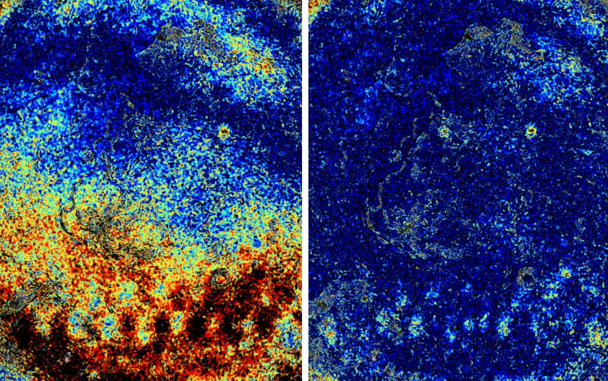
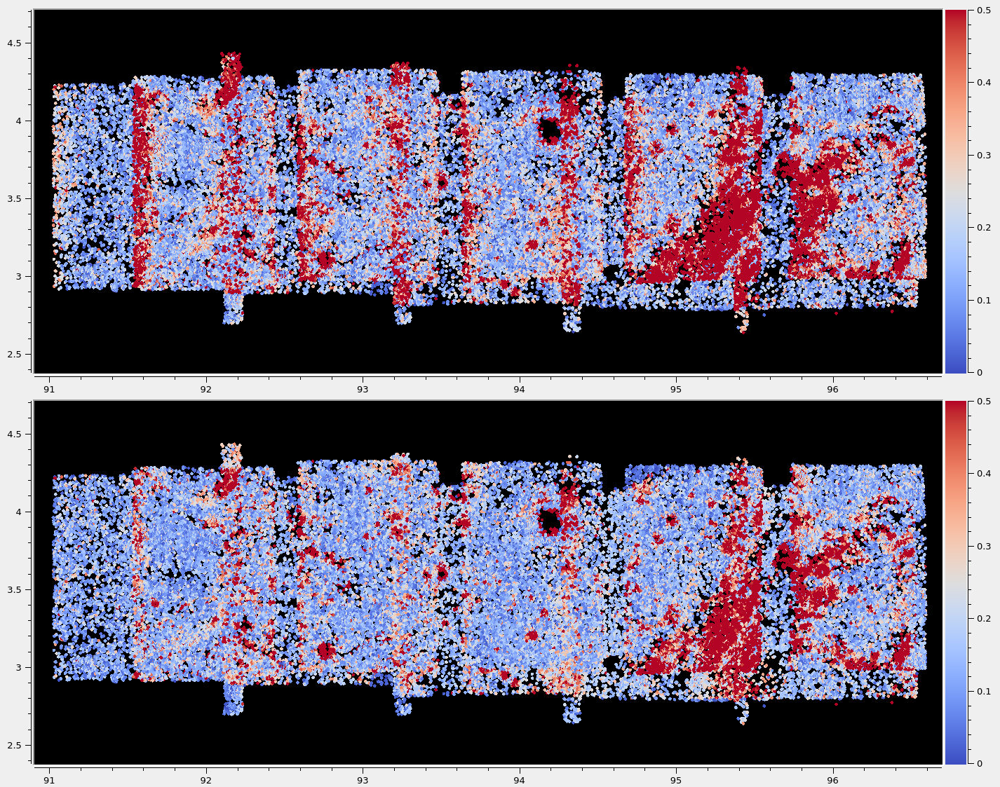
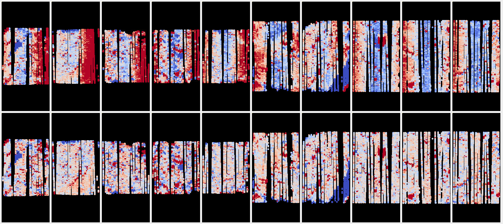
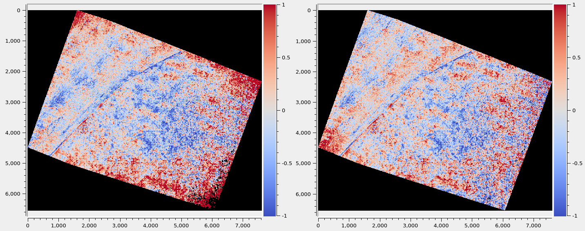
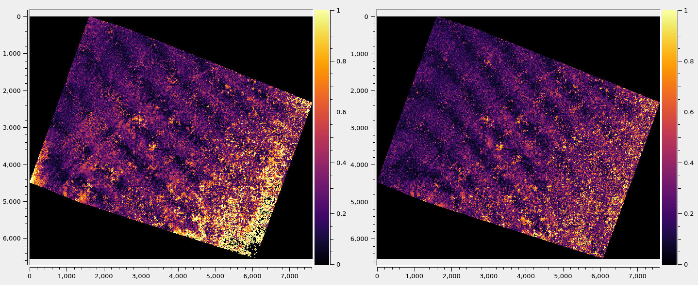
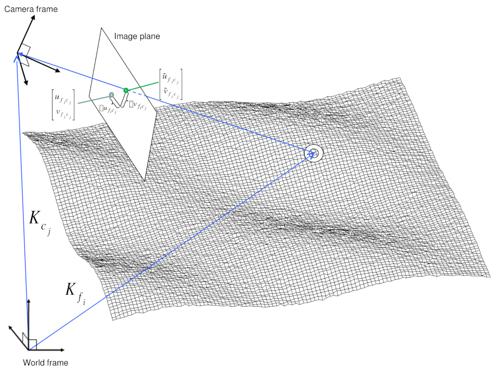
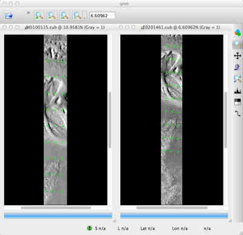
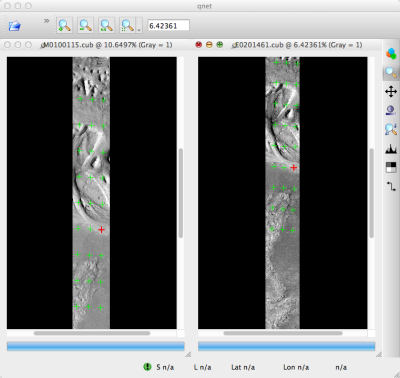

.. _bundle_adjustment:

Bundle adjustment
=================

Overview
--------

Satellite position and orientation errors have a direct effect on the
accuracy of digital elevation models produced by the Stereo Pipeline. If
they are not corrected, these uncertainties will result in systematic
errors in the overall position and slope of the DEM. Severe distortions
can occur as well, resulting in twisted or "taco-shaped" DEMs, though in
most cases these effects are quite subtle and hard to detect. In the
worst case, such as with old mission data like Voyager or Apollo, these
gross camera misalignments can inhibit Stereo Pipeline's internal
interest point matcher and block auto search range detection.

.. figure:: images/ba_orig_adjusted.png

   Bundle adjustment is illustrated here using a color-mapped, hill-shaded
   DEM mosaic from Apollo 15, Orbit 33, images. (a) Prior to bundle
   adjustment, large discontinuities can exist between overlapping DEMs
   made from different images. (b) After bundle adjustment, DEM alignment
   errors are minimized and no longer visible.

Errors in camera position and orientation can be corrected using a
process called *bundle adjustment*. Bundle adjustment is the process of
simultaneously adjusting the properties of many cameras and the 3D
locations of the objects they see in order to minimize the error between
the estimated, back-projected pixel locations of the 3D objects and
their actual measured locations in the captured images. This is called
the *reprojection error*.

This complex process can be boiled down to this simple idea: bundle
adjustment ensures that the observations in multiple images of a single
ground feature are self-consistent. If they are not consistent, then the
position and orientation of the cameras as well as the 3D position of
the feature must be adjusted until they are. This optimization is
carried out along with thousands (or more) of similar constraints
involving many different features observed in other images. Bundle
adjustment is very powerful and versatile: it can operate on just two
overlapping images, or on thousands. It is also a dangerous tool.
Careful consideration is required to insure and verify that the solution
does represent reality.

Bundle adjustment can also take advantage of GCPs (:numref:`bagcp`), which are
3D locations of features that are known a priori (often by measuring them by
hand in another existing DEM). GCPs can improve the internal consistency of your
DEM or align your DEM to an existing data product. Finally, even though bundle
adjustment calculates the locations of the 3D objects it views, only the final
properties of the cameras are recorded for use by the Ames Stereo Pipeline.
Those properties can be loaded into the ``parallel_stereo`` program which uses
its own method for triangulating 3D feature locations.

When using the Stereo Pipeline, bundle adjustment is an optional step
between the capture of images and the creation of DEMs. The bundle
adjustment process described below should be completed prior to running
the ``parallel_stereo`` command.

Although bundle adjustment is not a required step for generating DEMs,
it is *highly recommended* for users who plan to create DEMs for
scientific analysis and publication. Incorporating bundle adjustment
into the stereo work flow not only results in DEMs that are more
internally consistent, it is also the correct way to co-register your
DEMs with other existing data sets and geodetic control networks.

A DEM obtained after bundle adjustment and stereo may need to be aligned
to a known reference coordinate system. For that, use the ``pc_align``
tool (:numref:`pc_align`).

See the options ``--heights-from-dem`` (:numref:`heights_from_dem`)
and ``--reference-terrain`` further down for how to incorporate an
external DEM in bundle adjustment.  Note that these can only locally
refine camera parameters, an initial alignment with ``pc_align`` is
still necessary.

Optimizing of camera intrinsics parameters, such as optical center,
focal length, and distortion is also possible, as seen below.

.. _baasp:

Bundle adjustment using ASP
---------------------------

Stereo Pipeline provides its own bundle adjustment tool, named
``bundle_adjust``. Its usage is described in :numref:`bundle_adjust`.

Here is an example of using this tool on a couple of Apollo 15 images,
and its effect on decreasing the stereo triangulation error.

   Illustration of the triangulation error (intersection error) map
   (:numref:`triangulation_error`) for a pair of images before (left) and after
   (right) using Stereo Pipeline's ``bundle_adjust``. Red and black colors
   suggest higher error. It can be seen that the triangulation error is much
   reduced, so the resulting cameras are more self-consistent.

Start by running ``parallel_stereo`` without using bundle-adjusted camera
models::

    parallel_stereo AS15-M-1134.cub AS15-M-1135.cub run_noadjust/run

See :numref:`nextsteps` for how how to improve the quality of stereo
correlation results (at the expense of speed).

Create a DEM and triangulation error image as in :numref:`point2dem`.

Run bundle adjustment::

    bundle_adjust --camera-position-weight 0     \
     --tri-weight 0.1 --tri-robust-threshold 0.1 \
     AS15-M-1134.cub AS15-M-1135.cub -o run_ba/run

Here only camera positions and orientations are refined. How to optimize the
camera intrinsics (if applicable) is discussed further down
(:numref:`floatingintrinsics`).

Run ``parallel_stereo`` while using the bundle-adjusted camera models::

    parallel_stereo AS15-M-1134.cub AS15-M-1135.cub run_adjust/run \
      --bundle-adjust-prefix run_ba/run

This should be followed, as before, by creation of a DEM and a triangulation
error image.

A comparison of the results given these two ways of doing stereo is shown in
:numref:`asp-ba-example`.

Bundle adjustment aims to make the cameras more self-consistent but offers no
guarantees about their absolute positions (unless GCP are used), in fact, the
cameras can move away a lot sometimes. The options ``--tri-weight``,   
``--rotation-weight``, and ``--camera-position-weight`` can be used to constrain
how much the cameras can move during bundle adjustment. Note that large values
for these may impact the ability to make the cameras self-consistent.

This program can constrain the triangulated points, and hence the cameras,
relative to a DEM. This option only works when the cameras are already
rather well-aligned to this DEM and only fine-level adjustments are needed.
That is discussed in :numref:`heights_from_dem`.

ASP also offers the tool ``parallel_bundle_adjust`` which can create
match files using multiple processes spread over multiple machines
(:numref:`parallel_bundle_adjust`). These can also be used later
during stereo with the options ``--match-files-prefix`` and
``--clean-match-files-prefix``.

.. _floatingintrinsics:

Floating intrinsics and using a lidar or DEM ground truth
~~~~~~~~~~~~~~~~~~~~~~~~~~~~~~~~~~~~~~~~~~~~~~~~~~~~~~~~~

This section documents some advanced functionality, and it suggested the
reader study it carefully and invest a certain amount of time to fully
take advantage of these concepts.

When the input cameras are of Pinhole type (:numref:`pinholemodels`), optical
bar (:numref:`panoramic`), or CSM (:numref:`csm`), it is possible to optimize
(float, refine) the intrinsic parameters (focal length, optical center,
distortion, with a somewhat different list for optical bar cameras), in addition
to the extrinsics. 

It is also possible to take advantage of an existing terrain ground truth, such
as a lidar file or a DEM, to correct imperfectly calibrated intrinsic
parameters, which can result in greatly improved results, such as creating less
distorted DEMs that agree much better with the ground truth.

See :numref:`intrinsics_no_constraints` for how to optimize intrinsics with no
constraints, :numref:`intrinsics_ground_truth` for when ground constraints can
be used (there exist options for sparse ground points and a DEM), and
:numref:`kaguya_ba` for how to have several groups of intrinsics. 

Mixing frame and linescan cameras is discussed in :numref:`ba_frame_linescan`.

.. _intrinsics_no_constraints:

A first attempt at floating the intrinsics
^^^^^^^^^^^^^^^^^^^^^^^^^^^^^^^^^^^^^^^^^^

This section is only an introduction of how to float the intrinsics. Detailed
examples are further down. It is very strongly suggested to ensure that a good
number of images exists, they have a lot of overlap, that the cameras have been
already bundle-adjusted with intrinsics fixed and aligned to a DEM
(:numref:`ba_pc_align`). Such a DEM should be used as a constraint. 

Note that when solving for intrinsics, ``bundle_adjust`` will by default
optimize all intrinsic parameters and will share them across all cameras. This
behavior can be controlled with the ``--intrinsics-to-float`` and
``--intrinsics-to-share`` parameters, or in a finer-grained way, as shown in
:numref:`kaguya_ba`.

The first invocation of camera optimization should be with intrinsics fixed::

     bundle_adjust -t nadirpinhole --inline-adjustments      \
       left.tif right.tif left.tsai right.tsai -o run_ba/run

Here two images have been used for illustration purposes, but a larger number
should be used in practice.

It is suggested that one run ``parallel_stereo`` with the obtained cameras::

     parallel_stereo -t nadirpinhole --alignment-method epipolar      \
        --stereo-algorithm asp_mgm --subpixel-mode 9                  \
        left.tif right.tif run_ba/run-left.tsai run_ba/run-right.tsai \
        run_stereo/run

followed by DEM creation (:numref:`point2dem`)::

     point2dem --tr RESOLUTION --errorimage run_stereo/run-PC.tif

Then examine and plot the intersection error::

     gdalinfo -stats run_stereo/run-IntersectionErr.tif
     colormap run_stereo/run-IntersectionErr.tif
     stereo_gui run_stereo/run-IntersectionErr_CMAP.tif

See :numref:`running-stereo` for other stereo algorithms. For ``colormap``
(:numref:`colormap`), ``--min`` and ``--max`` bounds can be specified if the
automatic range is too large.

We also suggest inspecting the interest points
(:numref:`stereo_gui_view_ip`)::

     stereo_gui left.tif right.tif run_ba/run

and then viewing the interest points from the menu.

If the interest points are not well-distributed, this may result in large ray
intersection errors where they are missing. Then, one should delete the existing
run directory and create a better set, as discussed in :numref:`custom_ip`.

If the interest points are good and the mean intersection error is
acceptable, but this error shows an odd nonlinear pattern, that means
it may be necessary to optimize the intrinsics. We do so by using the
cameras with the optimized extrinsics found earlier. This is just an
early such attempt, better approaches will be suggested below::

     bundle_adjust -t nadirpinhole --inline-adjustments \
       --solve-intrinsics --camera-position-weight 0    \
       --max-pairwise-matches 20000                     \
       left.tif right.tif                               \
       run_ba/run-left.tsai run_ba/run-right.tsai       \
       -o run_ba_intr/run

See :numref:`heights_from_dem` for how to use a DEM as a constraint.
That is very recommended.

It is important to note that only the non-zero intrinsics will be
optimized, and the step size used in optimizing a certain intrinsic
parameter is proportional to it. Hence, if an intrinsic is 0 and it is
desired to optimize it, it should be set to small non-zero value
suggestive of its final estimated scale. If the algorithm fails to give
a good solution, perhaps different initial values for the intrinsics
should be tried. For example, one can try changing the sign of the
initial distortion coefficients, or make their values much smaller.

It is good to use a lens distortion model such as the one ASP calls
*Tsai* (:numref:`pinholemodels`), as then the distortion operation
is a simple formula, which is fast and convenient in bundle adjustment,
when projecting into the camera is the key operation. Using models
like *Photometrix* and *Brown-Conrady* is not advised.

Here we assumed all intrinsics are shared. See
:numref:`kaguya_ba` for how to have several groups of
intrinsics. See also the option ``--intrinsics-to-share``.

Sometimes the camera weight may need to be decreased, even all the way
to 0, if it appears that the solver is not aggressive enough, or it may
need to be increased if perhaps it overfits. This will become less of a
concern if there is some ground truth, as discussed later.

Next, one can run ``parallel_stereo`` as before, with the new cameras,
and see if the obtained solution is more acceptable, that is, if the
intersection error is smaller. It is good to note that a preliminary
investigation can already be made right after bundle adjustment, by
looking at the residual error files before and after bundle
adjustment. They are in the output directory, with names::

     initial_residuals_pointmap.csv
     final_residuals_pointmap.csv

If desired, these csv files can be converted to a DEM with
``point2dem``, which can be invoked with::

     --csv-format 1:lon,2:lat,4:height_above_datum

then one can look at their statistics, also have them colorized, and
viewed in ``stereo_gui`` (:numref:`plot_csv`).

This file also shows how often each feature is seen in the images, so,
if three images are present, hopefully many features will be seen three
times.

.. _intrinsics_ground_truth:

Using ground truth when floating the intrinsics
^^^^^^^^^^^^^^^^^^^^^^^^^^^^^^^^^^^^^^^^^^^^^^^

If a point cloud having ground truth, such as a lidar file or DEM
exists, say named ``lidar.csv``, it can be used as part of bundle
adjustment. For that, the stereo DEM obtained earlier 
needs to be first aligned to this ground truth, such as::

    pc_align --max-displacement VAL run_stereo/run-DEM.tif \
      --save-inv-transformed-reference-points              \
      lidar.csv -o run_align/run 

(see the manual page of this tool in :numref:`pc_align` for more details).

This alignment can then be applied to the cameras as well::

     bundle_adjust -t nadirpinhole --inline-adjustments              \
       --initial-transform run_align/run-inverse-transform.txt       \
       left.tif right.tif run_ba/run-left.tsai run_ba/run-right.tsai \
       --apply-initial-transform-only -o run_align/run

Note that your lidar file may have some conventions as to what each
column means, and then any tools that use this cloud must set
``--csv-format`` and perhaps also ``--datum`` and/or ``--csv-proj4``.

If ``pc_align`` is called with the clouds in reverse order (the denser
cloud should always be the first), when applying the transform to the
cameras in ``bundle_adjust`` one should use ``transform.txt`` instead of
``inverse-transform.txt`` above.

See :numref:`ba_pc_align` for how to handle the case when input
adjustments exist.

There are two ways of incorporating a ground constraint in bundle adjustment.
The first one assumes that the ground truth is a DEM, and is very easy to use
with a large number of images (:numref:`heights_from_dem`). A second approach
can be used when the ground truth is sparse (and with a DEM as well). This is a
bit more involved (:numref:`reference_terrain`).

.. _heights_from_dem:

Using the heights from a reference DEM
^^^^^^^^^^^^^^^^^^^^^^^^^^^^^^^^^^^^^^

In some situations the DEM obtained with ASP is, after alignment, quite similar
to a reference DEM, but the heights may be off. This can happen, for example,
if the focal length or lens distortion are not accurately known. 

In this case it is possible to borrow more accurate information from the
reference DEM (see details below). The option for this is
``--heights-from-dem``. An additional control is given, in the form of the
option ``--heights-from-dem-uncertainty`` (1 sigma, in meters). The smaller its
value is, the stronger the DEM constraint. This value divides the difference
between the triangulated points being optimized and their initial value on the
DEM when added to the cost function (:numref:`how_ba_works`). 

The option ``--heights-from-dem-robust-threshold`` ensures that these weighted
differences plateau at a certain level and do not dominate the problem. The
default value is 0.1, which is smaller than the ``--robust-threshold`` value of
0.5, which is used to control the pixel reprojection error, as that is given a
higher priority. It is suggested to not modify this threshold, and adjust
instead ``--heights-from-dem-uncertainty``.

If a triangulated point is not close to the reference DEM, bundle adjustment
falls back to the ``--tri-weight`` constraint.

Here is an example, and note that, as in the earlier section,
we assume that the cameras and the terrain are already aligned::

     bundle_adjust -t nadirpinhole                   \
       --inline-adjustments                          \
       --solve-intrinsics --camera-position-weight 0 \
       --max-pairwise-matches 20000                  \
       --heights-from-dem dem.tif                    \
       --heights-from-dem-uncertainty 10.0           \
       --heights-from-dem-robust-threshold 0.1       \
       --parameter-tolerance 1e-12                   \
       --remove-outliers-params "75.0 3.0 20 25"     \
       left.tif right.tif                            \
       run_align/run-run-left.tsai                   \
       run_align/run-run-right.tsai                  \
       -o run_ba_hts_from_dem/run

Here we were rather generous with the parameters for removing
outliers, as the input DEM may not be that accurate, and then if tying
too much to it some valid matches be be flagged as outliers otherwise,
perhaps.

It is suggested to use dense interest points as above (and adjust
``--max-pairwise-matches`` to not throw some of them out). We set
``--camera-position-weight 0``, as hopefully the DEM constraint is enough to
constrain the solution.

The implementation of ``--heights-from-dem`` is as follows. Rays from matching
interest points are intersected with this DEM, and the average of the produced
points is projected vertically onto the DEM. This is declared to be the
intersection point of the rays, and the the triangulated points being optimized
can then be constrained to not vary too much from this location on the DEM.

It is important to note that this heuristic may not be accurate if the rays have
a large intersection error. But, since bundle adjustment usually has two passes,
at the second pass the improved cameras are used to recompute the point on the
DEM with better accuracy. 

This option can be more effective than using ``--reference-terrain`` when there
is a large uncertainty in camera intrinsics.

See two other large-scale examples of using this option, without
floating the intrinsics, in the SkySat processing example
(:numref:`skysat`), using Pinhole cameras, and with 
linescan Lunar images with variable illumination
(:numref:`sfs-lola`).

Here we assumed all intrinsics are shared. See
:numref:`kaguya_ba` for how to have several groups of
intrinsics. See also the option ``--intrinsics-to-share``.

It is suggested to look at the documentation of all the options
above and adjust them for your use case.

See :numref:`bundle_adjust` for the documentation of all options
above, and :numref:`ba_out_files` for the output reports being saved,
which can help judge how well the optimization worked.

.. _reference_terrain:

Sparse ground truth and using the disparity
^^^^^^^^^^^^^^^^^^^^^^^^^^^^^^^^^^^^^^^^^^^

Here we will discuss an approach that works when the ground truth can
be sparse, and we make use of the stereo disparity. It requires more
work to set up than the earlier one.

We will need to create a disparity from the left and right images
that we will use during bundle adjustment. For that we will take the
disparity obtained in stereo and remove any intermediate transforms
stereo applied to the images and the disparity. This can be done as
follows::

     stereo_tri -t nadirpinhole --alignment-method epipolar \
       --unalign-disparity                                  \
       left.tif right.tif                                   \
       run_ba/run-left.tsai run_ba/run-right.tsai           \
       run_stereo/run               

and then bundle adjustment can be invoked with this disparity and the
lidar/DEM file. Note that we use the cameras obtained after alignment::

     bundle_adjust -t nadirpinhole --inline-adjustments         \
       --solve-intrinsics --camera-position-weight 0            \
       --max-disp-error 50                                      \
       --max-num-reference-points 1000000                       \
       --max-pairwise-matches 20000                             \
       --parameter-tolerance 1e-12                              \
       --robust-threshold 2                                     \
       --reference-terrain lidar.csv                            \
       --reference-terrain-weight 5                             \
       --disparity-list run_stereo/run-unaligned-D.tif          \
       left.tif right.tif                                       \
       run_align/run-run-left.tsai run_align/run-run-right.tsai \
       -o run_ba_intr_lidar/run

Here we set the camera weight all the way to 0, since it is hoped that
having a reference terrain is a sufficient constraint to prevent
over-fitting.

We used ``--robust-threshold 2`` to make the solver work harder
where the errors are larger. This may be increased somewhat if the
distortion is still not solved well in corners.

See the note earlier in the text about what a good lens distortion
model is.

This tool will write some residual files of the form::

     initial_residuals_reference_terrain.txt
     final_residuals_reference_terrain.txt

which may be studied to see if the error-to-lidar decreased. Each
residual is defined as the distance, in pixels, between a terrain point
projected into the left camera image and then transferred onto the right
image via the unaligned disparity and its direct projection into the
right camera.

If the initial errors in that file are large to start with, say more
than 2-3 pixels, there is a chance something is wrong. Either the
cameras are not well-aligned to each other or to the ground, or the
intrinsics are off too much. In that case it is possible the errors are
too large for this approach to reduce them effectively.

We strongly recommend that for this process one should not rely on
bundle adjustment to create interest points, but to use the dense and
uniformly distributed ones created with stereo (:numref:`dense_ip`).

The hope is that after these directions are followed, this will result
in a smaller intersection error and a smaller error to the lidar/DEM
ground truth (the later can be evaluated by invoking
``geodiff --absolute`` on the ASP-created aligned DEM and the reference
lidar/DEM file).

Here we assumed all intrinsics are shared. See 
:numref:`kaguya_ba` for how to have several groups of
intrinsics. See also the option ``--intrinsics-to-share``.

When the lidar file is large, in bundle adjustment one can use the flag
``--lon-lat-limit`` to read only a relevant portion of it. This can
speed up setting up the problem but does not affect the optimization.

Sparse ground truth and multiple images
^^^^^^^^^^^^^^^^^^^^^^^^^^^^^^^^^^^^^^^

Everything mentioned earlier works with more than two images, in fact,
having more images is highly desirable, and ideally the images overlap a
lot. For example, one can create stereo pairs consisting of first and
second images, second and third, third and fourth, etc., invoke the
above logic for each pair, that is, run stereo, alignment to the ground
truth, dense interest point generation, creation of unaligned
disparities, and transforming the cameras using the alignment transform
matrix. Then, a directory can be made in which one can copy the dense
interest point files, and run bundle adjustment with intrinsics
optimization jointly for all cameras. Hence, one should use a command as
follows (the example here is for 4 images)::

     disp1=run_stereo12/run-unaligned-D.tif
     disp2=run_stereo23/run-unaligned-D.tif
     disp3=run_stereo34/run-unaligned-D.tif
     bundle_adjust -t nadirpinhole --inline-adjustments       \
       --solve-intrinsics  --camera-position-weight 0         \
       img1.tif img2.tif img3.tif img4.tif                    \
       run_align_12/run-img1.tsai run_align12/run-img2.tsai   \
       run_align_34/run-img3.tsai run_align34/run-img4.tsai   \
       --reference-terrain lidar.csv                          \
       --disparity-list "$disp1 $disp2 $disp3"                \
       --robust-threshold 2                                   \
       --max-disp-error 50 --max-num-reference-points 1000000 \
       --overlap-limit 1 --parameter-tolerance 1e-12          \
       --reference-terrain-weight 5                           \   
       -o run_ba_intr_lidar/run

In case it is desired to omit the disparity between one pair of images,
for example, if they don't overlap, instead of the needed unaligned
disparity one can put the word ``none`` in this list.

Notice that since this joint adjustment was initialized from several
stereo pairs, the second camera picked above, for example, could have
been either the second camera from the first pair, or the first camera
from the second pair, so there was a choice to make. In :numref:`skysat`
an example is shown where a preliminary
bundle adjustment happens at the beginning, without using a reference
terrain, then those cameras are jointly aligned to the reference
terrain, and then one continues as done above, but this time one need
not have dealt with individual stereo pairs.

The option ``--overlap-limit`` can be used to control which images
should be tested for interest point matches, and a good value for it is
say 1 if one plans to use the interest points generated by stereo,
though a value of 2 may not hurt either. One may want to decrease
``--parameter-tolerance``, for example, to 1e-12, and set a value for
``--max-disp-error``, e.g, 50, to exclude unreasonable disparities (this
last number may be something one should experiment with, and the results
can be somewhat sensitive to it). A larger value of
``--reference-terrain-weight`` can improve the alignment of the cameras
to the reference terrain.

Also note the earlier comment about sharing and floating the intrinsics
individually.

RPC lens distortion
^^^^^^^^^^^^^^^^^^^

If it is realized that the optimized intrinsics still do not make the
ASP-generated DEMs agree very well with the ground truth, and some residual and
systematic error can be seen either by comparing these two or in intersection
error files, it may be convenient to convert the current camera models to ones
with the distortion given by rational function coefficients (RPC) of a desired
degree (:numref:`pinholemodels`). An RPC model can have a lot more coefficients
to optimize, hence a better fit can be found. 

It is suggested to use low-degree polynomials as those are easy to fit, and go
to higher degree only for refinement if needed.

One should, however, first try the simpler *Tsai* and *Adjustable Tsai* lens
distortion models (:numref:`pinholemodels`), or the OpenCV radial-tangential
distortion model for CSM (:numref:`csm_frame_def`) before resorting to RPC.

The tool ``convert_pinhole_model`` (:numref:`convert_pinhole_model`) can be used
to convert a camera model with one distortion type to another one with Pinhole
cameras. The ``cam_gen`` program can be used to convert a camera model to CSM
(:numref:`cam_gen_frame`).

Working with map-projected images
^^^^^^^^^^^^^^^^^^^^^^^^^^^^^^^^^

If ``parallel_stereo`` was run with map-projected images, one can still extract
dense interest point matches and the unaligned disparity from such a run, and
these can be applied with the original unprojected images for the purpose of
bundle adjustment (after being renamed appropriately, :numref:`ba_match_files`).
This may be convenient since while bundle adjustment must always happen with the
original images, ``parallel_stereo`` could be faster and more accurate when
images are map-projected. It is suggested that the unaligned disparity and
interest points obtained this way be examined carefully.  Particularly the grid
size used in mapprojection should be similar to the ground sample distance for
the raw images for best results.

.. _kaguya_ba:

Refining the intrinsics per sensor
~~~~~~~~~~~~~~~~~~~~~~~~~~~~~~~~~~

Given a set of sensors, with each acquiring several images, we will optimize the
intrinsics per sensor. All images acquired with the same sensor will share the
same intrinsics, and none will be shared across sensors.

We will work with Kaguya TC linescan cameras and the CSM camera model
(:numref:`csm`). Pinhole cameras in .tsai format (:numref:`pinholemodels`) and
Frame cameras in CSM format (:numref:`csm_frame_def`) can be used as well.

See :numref:`floatingintrinsics` for an introduction on how optimizing intrinsics
works, and :numref:`kaguya_tc` for how to prepare and use Kaguya TC cameras.

See :numref:`ba_frame_linescan` for fine-level control per group and for how 
to mix frame and linescan cameras.

.. _kaguya_watch:

Things to watch for
^^^^^^^^^^^^^^^^^^^

Optimizing the intrinsics can be tricky. One has to be careful to select a
non-small set of images that have a lot of overlap, similar illumination, and 
an overall good baseline between enough images (:numref:`stereo_pairs`).

It is suggested to do a lot of inspections along the way. If things turn out to
work poorly, it is often hard to understand at what step the process failed.
Most of the time the fault lies with the data not satisfying the assumptions
being made.

The process will fail if, for example, the data is not well-aligned before
the refinement of intrinsics is started, if the illumination is so different that
interest point matches cannot be found, or if something changed about a sensor
and the same intrinsics don't work for all images acquired with that sensor.

The ``cam_test`` tool (:numref:`cam_test`) can be used to check if the distortion
model gets inverted correctly. The distortion model should also be expressive
enough to model the distortion in the images.

Image selection
^^^^^^^^^^^^^^^

We chose a set of 10 Kaguya stereo pairs with a lot of overlap (20 images in
total). The left image was acquired with the ``TC1`` sensor, and the right one
with ``TC2``. These sensors have different intrinsics.

Some Kaguya images have different widths. These should not be mixed together.

Some images had very large difference in illumination (not for the same stereo
pair). Then, finding of matching interest points can fail. Kaguya images are
rather well-registered to start with, so the resulting small misalignment that
could not be corrected by bundle adjustment was not a problem in solving for
intrinsics, and ``pc_align`` (:numref:`pc_align`) was used later for individual
alignment. This is not preferable, in general. It was tricky however to find
many images with a lot of overlap, so this had to make do.

A modification of the work flow for the case of images with very different
illumination is in :numref:`kaguya_ba_illumination`.

.. _kaguya_ba_initial_ba:

Initial bundle adjustment with fixed intrinsics
^^^^^^^^^^^^^^^^^^^^^^^^^^^^^^^^^^^^^^^^^^^^^^^

Put the image and camera names in plain text files named ``images.txt`` and
``cameras.txt``. These must be in one-to-one correspondence, and with one image
or camera per line. 

The order should be with TC1 images being before TC2. Later we will use the same
order when these are subdivided by sensor.

Initial bundle adjustment is done with the intrinsics fixed.

::

     parallel_bundle_adjust                      \
       --nodes-list nodes.txt                    \
       --image-list images.txt                   \
       --camera-list cameras.txt                 \
       --num-iterations 50                       \
       --tri-weight 0.2                          \
       --tri-robust-threshold 0.2                \
       --camera-position-weight 0                \
       --auto-overlap-params 'dem.tif 15'        \
       --remove-outliers-params '75.0 3.0 20 20' \
       --ip-per-tile 2000                        \
       --matches-per-tile 2000                   \
       --max-pairwise-matches 20000              \
       -o ba/run 

The option ``--auto-overlap-params`` is used with a prior DEM (such as gridded
and filled with ``point2dem`` at low resolution based on LOLA RDR data). This is
needed to estimate which image pairs overlap.

The option ``--remove-outliers-params`` is set so that only the worst outliers
(with reprojection error of 20 pixels or more) are removed. That because
imperfect intrinsics may result in accurate interest points that have a
somewhat large reprojection error. We want to keep such features in the corners
to help refine the distortion parameters.

The option ``--ip-per-tile`` is set to a large value so that many interest
points are generated, and then the best ones are kept. This can be way too large
for big images. (Consider using instead ``--ip-per-image``.) The option
``--matches-per-tile`` tries to ensure matches are uniformly distributed
(:numref:`custom_ip`).

Normally 50 iterations should be enough. Two passes will happen. After each 
pass outliers will be removed.

It is very strongly suggested to inspect the obtained clean match files (that
is, without outliers) with ``stereo_gui``
(:numref:`stereo_gui_pairwise_matches`), and reprojection errors in the final
``pointmap.csv`` file (:numref:`ba_out_files`), using ``stereo_gui`` as well
(:numref:`plot_csv`). Insufficient or poorly distributed clean interest point
matches will result in a poor solution.

The reprojection errors are plotted in :numref:`kaguya_intrinsics_opt_example`.

Running stereo
^^^^^^^^^^^^^^

We will use the optimized CSM cameras saved in the ``ba`` directory
(:numref:`csm_state`). For each stereo pair, run::

    parallel_stereo                    \
      --job-size-h 2500                \
      --job-size-w 2500                \
      --stereo-algorithm asp_mgm       \
      --subpixel-mode 9                \
      --nodes-list nodes.txt           \
      left.cub right.cub               \
      ba/run-left.adjusted_state.json  \
      ba/run-right.adjusted_state.json \
      stereo_left_right/run

Then we will create a DEM at the resolution of the input images,
which in this case is 10 m/pixel. The local stereographic projection
will be used.

::

    point2dem --tr 10    \
      --errorimage       \
      --stereographic    \
      --proj-lon 93.7608 \
      --proj-lat 3.6282  \
      stereo_left_right/run-PC.tif

Normally it is suggested to rerun stereo with mapprojected images
(:numref:`mapproj-example`) to get higher quality results. For the current goal,
of optimizing the intrinsics, the produced terrain is good enough. See also
:numref:`nextsteps` for a discussion of various stereo algorithms.

Inspect the produced DEMs and intersection error files (:numref:`point2dem`).
The latter can be colorized (:numref:`colorize`). Use ``gdalinfo -stats``
(:numref:`gdal_tools`) to see the statistics of the intersection error. In this
case it turns out to be around 4 m, which, given the ground resolution of 10
m/pixel, is on the high side. The intersection errors are also higher at left
and right image edges, due to distortion. (For a frame sensor this error will
instead be larger in the corners.)

Evaluating agreement between the DEMs
^^^^^^^^^^^^^^^^^^^^^^^^^^^^^^^^^^^^^

Overlay the produced DEMs and check for any misalignment. This may happen 
if there are insufficient interest points or if the unmodelled distortion 
is large.

Create a blended average DEM from the produced DEMs using the
``dem_mosaic`` (:numref:`dem_mosaic`)::

     dem_mosaic stereo*/run-DEM.tif -o mosaic_ba.tif

Alternatively, such a DEM can be created from LOLA RDR data, if dense enough, 
as::

  point2dem                               \
    --csv-format 2:lon,3:lat,4:radius_km  \
    --search-radius-factor 10             \
    --tr <grid size> --t_srs <projection> \
    lola.csv

It is likely better, however, to ensure there is a lot of overlap between the
input images and use the stereo DEM mosaic rather than LOLA.
 
It is useful to subtract each DEM from the mosaic using ``geodiff``
(:numref:`geodiff`)::

     geodiff mosaic_ba.tif stereo_left_right/run-DEM.tif \
       -o stereo_left_right/run

These differences can be colorized with ``stereo_gui`` using the ``--colorbar``
option (:numref:`colorize`). The std dev of the obtained signed difference 
can be used as a measure of discrepancy. These errors should go down after
refining the intrinsics.

Uniformly distributed interest points
^^^^^^^^^^^^^^^^^^^^^^^^^^^^^^^^^^^^^

For the next step, refining the intrinsics, it is important to have
well-distributed interest points. 

Normally, the sparse interest points produced with bundle adjustment so far can
be used. For most precise work, dense and uniformly distributed interest points
can be necessary. This is discussed in :numref:`dense_ip`.

For example, if the input dataset consists of 6 overlapping stereo pairs, stereo
can be run between each left image and every other right image, producing 36
sets of dense interest points. 

The interest point file names must be changed to respect the *naming convention*
(:numref:`ba_match_files`), reflecting the names of the raw images, then passed
to ``bundle_adjust`` via the ``--match-files`` option.

One can also take the sparse interest points, and augment them with dense
interest points from stereo only for a select set of pairs. All these must
then use the same naming convention.

Refining the intrinsics
^^^^^^^^^^^^^^^^^^^^^^^

We will use the camera files produced by ``bundle_adjust`` before, with names as
``ba/run-*.adjusted_state.json``. These have the refined position and
orientation. We will re-optimize those together with the intrinsics parameters,
including distortion (which in ``bundle_adjust`` goes by the name
``other_intrinsics``).

The images and (adjusted) cameras for individual sensors should be put in
separate files, but in the same overall order as before, to be able reuse the
match files. Then, the image lists will be passed to the ``--image-list`` option
with comma as separator (no spaces), and the same for the camera lists. The
bundle adjustment command becomes::

  bundle_adjust --solve-intrinsics                 \
    --inline-adjustments                           \
    --intrinsics-to-float                          \
    "optical_center focal_length other_intrinsics" \
    --image-list tc1_images.txt,tc2_images.txt     \
    --camera-list tc1_cameras.txt,tc2_cameras.txt  \
    --num-iterations 10                            \
    --clean-match-files-prefix ba/run              \
    --heights-from-dem mosaic_ba.tif               \
    --heights-from-dem-uncertainty 10.0            \
    --heights-from-dem-robust-threshold 0.1        \
    --remove-outliers-params '75.0 3.0 20 20'      \
    --max-pairwise-matches 20000                   \
    -o ba_other_intrinsics/run

See :numref:`heights_from_dem` for the option ``--heights-from-dem``, and 
:numref:`bundle_adjust` for the documentation of all options above.

If large errors are still left at the image periphery, decrease
``--heights-from-dem-uncertainty``. Also consider adding more images 
overlapping with the current ones.

   The reprojection errors (``pointmap.csv``) before (top) and after (bottom)
   refinement of distortion. Some outliers are still visible but are harmless.
   Dense and uniformly distributed interest points (:numref:`dense_ip`) are
   strongly suggested, but not used here. 
   
   It can be seen that many red vertical patterns are now much attenuated (these
   correspond to individual image edges). On the right some systematic errors
   are seen (due to the search range in stereo chosen here being too small and
   some ridges having been missed). Those do not affect the optimization. Using
   mapprojected images would have helped with this. The ultimate check will be
   the comparison with LOLA RDR (:numref:`kaguya_intrinsics_alignment_diff`).
   Plotted with ``stereo_gui`` (:numref:`plot_csv`).

Recreation of the stereo DEMs
^^^^^^^^^^^^^^^^^^^^^^^^^^^^^

The new cameras can be used to redo stereo and the DEMs. It is suggested to 
use the option ``--prev-run-prefix`` in ``parallel_stereo`` to 
redo only the triangulation operation, which greatly speeds up processing
(see :numref:`bathy_reuse_run` and :numref:`mapproj_reuse`).

As before, it is suggested to examine the intersection error and the difference
between each produced DEM and the corresponding combined averaged DEM. These
errors drop by a factor of about 2 and 1.5 respectively. 

Comparing to an external ground truth
^^^^^^^^^^^^^^^^^^^^^^^^^^^^^^^^^^^^^

We solved for intrinsics by constraining against the averaged mosaicked DEM of
the stereo pairs produced with initial intrinsics. This works reasonably well if
the error due to distortion is somewhat small and the stereo pairs overlap
enough that this error gets averaged out in the mosaic.

Ideally, a known accurate external DEM should be used. For example, one could
create DEMs using LRO NAC data. Note that many such DEMs would be need to be
combined, because LRO NAC has a much smaller footprint.

Should such a DEM exist, before using it instead of the averaged mosaic, the
mosaic (or individual stereo DEMs) should be first aligned to the external DEM.
Then, the same alignment transform should be applied to the cameras
(:numref:`ba_pc_align`). Then the intrinsics optimization can happen as before. 

We use the sparse `LOLA RDR
<https://ode.rsl.wustl.edu/moon/lrololadatapointsearch.aspx>`_ dataset for
final validation. This works well enough because the ground footprint of Kaguya TC is
rather large. 

Each stereo DEM, before and after intrinsics refinement, is individually aligned to 
LOLA, and the signed difference to LOLA is found.

::

     pc_align --max-displacement 50                  \
       --save-inv-transformed-reference-points       \
       dem.tif lola.csv                              \
       -o run_align/run

     point2dem --tr 10   \
      --errorimage       \
      --stereographic    \
      --proj-lon 93.7608 \
      --proj-lat 3.6282  \
      run_align/run-trans_reference.tif 

    geodiff --csv-format 2:lon,3:lat,4:radius_km     \
      run_align/run-trans_reference-DEM.tif lola.csv \
      -o run_align/run

The ``pc_align`` tool is quite sensitive to the value of ``--max-displacement``
(:numref:`pc_align_max_displacement`). Here it was chosen to be somewhat larger
than the vertical difference between the two datasets to align. That because
KaguyaTC is already reasonably well-aligned.

   The signed difference between aligned stereo DEMs and LOLA RDR before (top)
   and after (bottom) refinement of distortion. (Blue = -20 meters, red = 20
   meters.) It can be seen that the warping of the DEMs due to distortion is much
   reduced. Plotted with ``stereo_gui`` (:numref:`plot_csv`).

.. _kaguya_ba_illumination:

Handling images with very different illumination
^^^^^^^^^^^^^^^^^^^^^^^^^^^^^^^^^^^^^^^^^^^^^^^^

If each stereo pair has consistent illumination, but the illumination is very
different between pairs, then the above approach may not work well as tie points
could be hard to find. It is suggested to do the initial bundle adjustment per
each stereo pair, followed by alignment of the individual produced DEMs to a
reference dataset.

Apply the alignment transform to the pairwise bundle-adjusted cameras as well
(:numref:`ba_pc_align`), and use these cameras for the refinement of intrinsics,
with the ground constraint being the mosaic of these aligned DEMs. 

It is suggested to examine how each aligned DEM differs from the
reference, and the same for their mosaic. The hope is that the mosaicking will
average out the errors in the individual DEMs.

If a lot of such stereo pairs are present, for the purpose of refinement of
intrinsics it is suggested to pick just a handful of them, corresponding to the
area where the mosaicked DEM differs least from the reference, so where the
distortion artifacts are most likely to have been averaged well.

.. _ba_frame_linescan:

Mixing frame and linescan cameras
~~~~~~~~~~~~~~~~~~~~~~~~~~~~~~~~~

So far we discussed refining the intrinsics for pinhole (frame) cameras, such as
in :numref:`heights_from_dem`, and for linescan cameras, such as in
:numref:`kaguya_ba`.

Here we will consider the situation when we have both. It is assumed that the
images acquired with these sensors are close in time and have similar
illumination. There should be a solid amount of image overlap, especially in the
corners of the images whose distortion should be optimized. 

It will be illustrated how the presumably more accurate linescan sensor images
can be used to refine the intrinsics of the frame sensor.

Preparing the inputs
^^^^^^^^^^^^^^^^^^^^

The frame cameras can be in the black-box RPC format (:numref:`rpc`), or any
other format supported by ASP. The cameras can be converted to the CSM format
using ``cam_gen`` (:numref:`cam_gen_frame`). This will find the best-fit
intrinsics, including the lens distortion. 

It is important to know at least the focal length of the frame cameras somewhat
accurately. This can be inferred based on satellite elevation and ground
footprint.

Once the first frame camera is converted to CSM, the rest of them that are
supposed to be for the same sensor model can borrow the just-solved intrinsic
parameters using the option ``--sample-file prev_file.json`` (the ``cam_gen``
manual has the full invocation).

The linescan cameras can be converted to CSM format using ``cam_gen`` as well
(:numref:`cam_gen_linescan`). This does not find a best-fit model, but rather
reads the linescan sensor poses and intrinsics from the input file.  

We will assume we have two frame camera images sharing intrinsics, named
``frame1.tif`` and ``frame2.tif``, and two linescan camera images, for which
will not enforce that the intrinsics are shared. They can even be from different
vendors. The linescan intrinsics will be kept fixed. Assume these files are
named ``linescan1.tif`` and ``linescan2.tif``. The camera names will have the
same convention, but ending in ``.json``.

Initial bundle adjustment
^^^^^^^^^^^^^^^^^^^^^^^^^

The same approach as in :numref:`kaguya_ba_initial_ba` can be used.
A DEM may be helpful to help figure out which image pairs overlap, but is not 
strictly necessary. 

Ensure consistent order of the images and cameras, both here and in the next
steps. This will guarantee that all generated match files will be used. The
order here will be ``frame1``, ``frame2``, ``linescan1``, ``linescan2``.

It is very strongly suggested to examine the stereo convergence angles 
(:numref:`ba_conv_angle`). The angles between each frame pair and each linescan
pair better be at least 15 degrees, to ensure a robust solution.

Also examine the pairwise matches in ``stereo_gui``
(:numref:`stereo_gui_pairwise_matches`), the final residuals per camera
(:numref:`ba_errors_per_camera`), and per triangulated point
(:numref:`ba_err_per_point`). The latter can be visualized in ``stereo_gui``
(:numref:`plot_csv`). The goal is to ensure well-distributed features,
and that the errors are pushed down uniformly.

Dense interest points produced from stereo may be necessary
(:numref:`dense_ip`).

Evaluation of terrain models
^^^^^^^^^^^^^^^^^^^^^^^^^^^^

As in :numref:`kaguya_ba`, it is suggested to create several stereo DEMs after
the initial bundle adjustment. For example, make one DEM for the frame camera
pair, and a second for the linescan one. Use mapprojected images, the
``asp_mgm`` algorithm (:numref:`nextsteps`), and a local stereographic
projection for the produced DEMs.

One should examine the triangulation error for each DEM
(:numref:`triangulation_error`), and the difference between them with
``geodiff`` (:numref:`geodiff`). Strong systematic errors for the frame camera
data will then motivate the next steps.

Refinement of the frame camera intrinsics
^^^^^^^^^^^^^^^^^^^^^^^^^^^^^^^^^^^^^^^^^

We will follow closely the recipe in :numref:`kaguya_ba`. It is suggested to use
for the refinement step the linescan DEM as a constraint (option
``--heights-from-dem``). If a different DEM is employed, the produced bundle-adjusted
cameras and DEMs should be aligned to it first (:numref:`ba_pc_align`).

As for :numref:`kaguya_ba`, we need to create several text files, with each
having the names of the images whose intrinsics are shared, and the same for the
cameras.

If not sure that the linescan cameras have the same intrinsics, they can be kept
in different files. We will keep those intrinsics fixed in either ase.

Assume the previous bundle adjustment was done with the output prefix
``ba/run``. The files for the next step are created as follows. For the
cameras::

    ls ba/run-frame1.adjusted_state.json \
       ba/run-frame2.adjusted_state.json > frame_cameras.txt
    ls ba/run-linescan1.adjusted_state.json > linescan1_cameras.txt
    ls ba/run-linescan2.adjusted_state.json > linescan2_cameras.txt
 
and similarly the images. Hence, we have 3 groups of sensors. These
files will be passed to ``bundle_adjust`` as follows::

  --image-list frame_images.txt,linescan1_images.txt,linescan2_images.txt      \
  --camera-list frame_cameras.txt,linescan1_cameras.txt,linescan2_cameras.txt
 
Use a comma as separator, and no spaces.

We will float the intrinsics for the frame cameras, and keep the linescan intrinsics
(but not poses) fixed. This is accomplished with the option::

  --intrinsics-to-float '1:focal_length,optical_center,other_intrinsics 
                         2:none 3:none'

Optimizing the optical center may not be necessary, as this intrinsic parameter
may correlate with the position of the cameras, and these are not easy to
separate. Optimizing this may produce an implausible optical center.

Post-refinement evaluation
^^^^^^^^^^^^^^^^^^^^^^^^^^

New DEMs and intersection error maps can be created. The previous stereo runs
can be reused with the option ``--prev-run-prefix`` in ``parallel_stereo`` (:numref:`mapproj_reuse`).

   The signed difference between the frame and linescan DEMs before intrinsics
   refinement (left) and after (right).

   The triangulation error for the frame cameras before refinement of intrinsics
   (left) and after (right). It can be seen in both figures that systematic
   differences are greatly reduced.

.. _custom_ip:

Custom approaches to interest points
~~~~~~~~~~~~~~~~~~~~~~~~~~~~~~~~~~~~

.. _sparse_ip:

Sparse and roughly uniformly distributed interest points
^^^^^^^^^^^^^^^^^^^^^^^^^^^^^^^^^^^^^^^^^^^^^^^^^^^^^^^^

To attempt to create roughly uniformly distributed *sparse* interest points during
bundle adjustment, use options along the lines ``--ip-per-tile 1000
--matches-per-tile 500 --max-pairwise-matches 10000``. 

Note that if the images are big, this will result in a very large number of
potential matches, because a tile has the size of 1024 pixels. (See
:numref:`ba_options` for the reference documentation for these options.)

.. _dense_ip:

Dense and uniformly distributed interest points
^^^^^^^^^^^^^^^^^^^^^^^^^^^^^^^^^^^^^^^^^^^^^^^

Dense and uniformly distributed interest points can be created during stereo. If
having many images, that will mean many combinations of stereo pairs. 

For each stereo invocation, add options along the lines of::

     --num-matches-from-disp-triplets 10000

or::
  
    --num-matches-from-disparity 10000

Only the second approach is supported with mapprojected images. See
:numref:`triangulation_options` for more details. 

The produced interest points must be renamed to the *standard convention* and
reflect the names of the raw images, not the mapprojected ones
(:numref:`ba_match_files`), then passed to ``bundle_adjust`` via the
``--match-files`` option.

Invoke ``bundle_adjust`` with an option along the lines of
``--max-pairwise-matches 10000`` (or larger) to ensure that on reading the
interest points the full set is kept. 

.. _limit_ip:

Limit extent of interest point matches
~~~~~~~~~~~~~~~~~~~~~~~~~~~~~~~~~~~~~~

To limit the triangulated points produced from interest points to a certain area
during bundle adjustment, two approaches are supported. One is the option
``--proj-win``, coupled with ``--proj-str``. 

The other is using the ``--weight-image`` option (also supported by the jitter
solver, :numref:`jitter_solve`). In locations where a given georeferenced weight
image has non-positive or nodata values, triangulated points will be ignored.
Otherwise each pixel reprojection error will be multiplied by the weight closest
geographically to the triangulated point. The effect is to work harder on the
areas where the weight is higher. 
 
Such a weight image can be created from a regular georeferenced image with
positive pixel values as follows. Open it in ``stereo_gui``, and draw on top of
it one or more polygons, each being traversed in a counterclockwise direction,
and with any holes oriented clockwise (:numref:`plot_poly`). Save this shape as
``poly.shp``, and then run::

    cp georeferenced_image.tif aux_image.tif
    gdal_rasterize -i -burn -32768 poly.shp aux_image.tif

This will keep the data inside the polygons and set the data outside to this value.
The value to burn should be negative and smaller than any valid pixel value in
the image. To keep the data outside the polygons, omit the ``-i`` option.

Then, create a mask of valid values using ``image_calc`` (:numref:`image_calc`),
as follows::

    image_calc -c "max(sign(var_0), 0)" \
     --output-nodata-value var_0        \
     aux_image.tif -o weight.tif

Examine the obtained image in ``stereo_gui`` and click on various pixels to
inspect the values. 

If the image does not have positive values to start with, those values
can be first shifted up with ``image_calc``. 

Various such weight images can be merged with ``dem_mosaic``
(:numref:`dem_mosaic`) or the values manipulated with ``image_calc``.

.. _jigsaw:

Bundle adjustment using ISIS
----------------------------

In what follows we describe how to do bundle adjustment using ISIS's
toolchain. It also serves to describe bundle adjustment in more detail,
which is applicable to other bundle adjustment tools as well, including
Stereo Pipeline's own tool.

ASP's ``bundle_adjust`` program can read and write the ISIS control network
format, hence the ASP and ISIS tools can be compared or used together
(:numref:`control_network`).

In bundle adjustment, the position and orientation of each camera
station are determined jointly with the 3D position of a set of image
tie-points points chosen in the overlapping regions between images. Tie
points, as suggested by the name, tie multiple camera images together.
Their physical manifestation would be a rock or small crater than can be
observed across more than one image.

Tie-points are automatically extracted using ISIS's ``autoseed`` and
``pointreg`` (alternatively one could use a number of outside methods
such as the famous SURF :cite:`surf08`). Creating a
collection of tie points, called a *control network*, is a three step
process. First, a general geographic layout of the points must be
decided upon. This is traditionally just a grid layout that has some
spacing that allows for about 20-30 measurements to be made per image.
This shows up in slightly different projected locations in each image
due to their slight misalignments. The second step is to have an
automatic registration algorithm try to find the same feature in all
images using the prior grid as a starting location. The third step is to
manually verify all measurements visually, checking to insure that each
measurement is looking at the same feature.

   A feature observation in bundle adjustment, from
   :cite:`moore09`

Bundle adjustment in ISIS is performed with the ``jigsaw`` executable.
It generally follows the method described
in :cite:`triggs00` and determines the best camera
parameters that minimize the projection error given by

.. math::

     {\bf \epsilon} = \sum_k\sum_j(I_k-I(C_j, X_k))^2

where :math:`I_k` are the tie points on the image plane, :math:`C_j` are the
camera parameters, and :math:`X_k` are the 3D positions associated with features
:math:`I_k`. :math:`I(C_j, X_k)` is an image formation model (i.e. forward
projection) for a given camera and 3D point. To recap, it projects the 3D point,
:math:`X_k`, into the camera with parameters :math:`C_j`. 

This produces a predicted image location for the 3D point that is compared
against the observed location, :math:`I_k`. It then reduces this error with the
Levenberg-Marquardt algorithm (LMA). Speed is improved by using sparse methods
as described in :cite:`hartley04`, :cite:`konolige:sparsesparse`, and
:cite:`cholmod`.

Even though the arithmetic for bundle adjustment sounds clever, there
are faults with the base implementation. Imagine a case where all
cameras and 3D points were collapsed into a single point. If you
evaluate the above cost function, you'll find that the error is indeed
zero. This is not the correct solution if the images were taken from
orbit. Another example is if a translation was applied equally to all 3D
points and camera locations. This again would not affect the cost
function. This fault comes from bundle adjustment's inability to control
the scale and translation of the solution. It will correct the geometric
shape of the problem, yet it cannot guarantee that the solution will
have correct scale and translation.

ISIS attempts to fix this problem by adding two additional cost
functions to bundle adjustment. First of which is

.. math::

     {\bf \epsilon} = \sum_j(C_j^{initial}-C_j)^2. 

This constrains camera parameters to stay relatively close to their initial
values. Second, a small handful of 3D ground control points can be chosen by
hand and added to the error metric as

.. math::

     {\bf \epsilon} = \sum_k(X_k^{gcp}-X_k)^2 
     
to constrain these points to known locations in the planetary coordinate frame.
A physical example of a ground control point could be the location of a lander
that has a well known location. GCPs could also be hand-picked points against a
highly regarded and prior existing map such as the THEMIS Global Mosaic or the
LRO-WAC Global Mosaic.

Like other iterative optimization methods, there are several conditions that
will cause bundle adjustment to terminate. When updates to parameters become
insignificantly small or when the error, :math:`{\bf \epsilon}`, becomes
insignificantly small, then the algorithm has converged and the result is most
likely as good as it will get. However, the algorithm will also terminate when
the number of iterations becomes too large in which case bundle adjustment may
or may not have finished refining the parameters of the cameras.

.. _ba_example:

Tutorial: Processing Mars Orbital Camera images
~~~~~~~~~~~~~~~~~~~~~~~~~~~~~~~~~~~~~~~~~~~~~~~

This tutorial for ISIS's bundle adjustment tools is taken from
:cite:`lunokhod:controlnetwork` and
:cite:`lunokhod:gcp`. These tools are not a product of NASA
nor the authors of Stereo Pipeline. They were created by USGS and their
documentation is available at :cite:`isis:documentation`.

What follows is an example of bundle adjustment using two MOC images of Hrad
Vallis. We use images E02/01461 and M01/00115, the same as used in
:numref:`moc_tutorial`. These images are available from NASA's PDS (the ISIS
``mocproc`` program will operate on either the IMQ or IMG format files, we use
the ``.imq`` below in the example). 

Ensure that ISIS and its supporting data is installed, per :numref:`isis_start`,
and that ``ISISROOT`` and ``ISIS3DATA`` are set. The string ``ISIS>`` is not 
part of the shell commands below, it is just suggestive of the fact that we operate
in an ISIS environment.

Fetch the MOC images anc convert them to ISIS cubes.

::

     ISIS> mocproc from=E0201461.imq to=E0201461.cub mapping=no
     ISIS> mocproc from=M0100115.imq to=M0100115.cub mapping=no

Note that the resulting images are not map-projected. That because bundle
adjustment requires the ability to project arbitrary 3D points into the camera
frame. The process of map-projecting an image dissociates the camera model from
the image. Map-projecting can be perceived as the generation of a new infinitely
large camera sensor that may be parallel to the surface, a conic shape, or
something more complex. That makes it extremely hard to project a random point
into the camera's original model. The math would follow the transformation from
projection into the camera frame, then projected back down to surface that ISIS
uses, then finally up into the infinitely large sensor. ``Jigsaw`` does not
support this and thus does not operate on map-projected images. 

ASP's ``bundle_adjust`` program, however, can create and match features
on mapprojected images, and then project those into the original images
(:numref:`mapip`).

Before we can dive into creating our tie-point measurements we must
finish prepping these images. The following commands will add a vector
layer to the cube file that describes its outline on the globe. It will
also create a data file that describes the overlapping sections between
files.

::

     ISIS> footprintinit from=E0201461.cub
     ISIS> footprintinit from=M0100115.cub
     ISIS> ls *.cub > cube.lis
     ISIS> findimageoverlaps from=cube.lis overlaplist=overlap.lis

At this point, we are ready to start generating our measurements. This
is a three step process that requires defining a geographic pattern for
the layout of the points on the groups, an automatic registration pass,
and finally a manual clean up of all measurements. Creating the ground
pattern of measurements is performed with ``autoseed``. It requires a
settings file that defines the spacing in meters between measurements.
For this example, write the following text into a *autoseed.def* file.

::

     Group = PolygonSeederAlgorithm
           Name = Grid
           MinimumThickness = 0.01
           MinimumArea = 1
           XSpacing = 1000
           YSpacing = 2000
     End_Group

The minimum thickness defines the minimum ratio between the sides of the
region that can have points applied to it. A choice of 1 would define a
square and anything less defines thinner and thinner rectangles. The
minimum area argument defines the minimum square meters that must be in
an overlap region. The last two are the spacing in meters between
control points. Those values were specifically chosen for this pair so
that about 30 measurements would be produced from ``autoseed``. Having
more control points just makes for more work later on in this process.
Run ``autoseed`` as follows.

::

     ISIS> autoseed fromlist=cube.lis overlaplist=overlap.lis      \
               onet=control.net deffile=autoseed.def networkid=moc \
               pointid=vallis???? description=hrad_vallis

Note the option ``pointid=vallis????``. It must be used verbatim. This command
will create ids that will look like ``vallis0001``, ``valis0002``, potentially
up to ``vallis9999``. The number of question marks will control hom many
measurements are created. See `autoseed
<https://isis.astrogeology.usgs.gov/Application/presentation/PrinterFriendly/autoseed/autoseed.html>`_'s
manual page for more details.

Inspect this control network with 
`qnet <https://isis.astrogeology.usgs.gov/Application/presentation/Tabbed/qnet/qnet.html>`_. Type "qnet" in a terminal, with
no options. A couple of windows will pop up. From the *File* menu of the
``qnet`` window, click on *Open control network and cube list*. Open the
file ``cube.lis``. From the same dialog, open ``control.net``. 

Click on ``vallis0001`` in the Control Network Navigator window, then click on
``view cubes``. This will show the illustration below. 
 

   A visualization of the features laid out by ``autoseed`` in ``qnet``.
   Note that the marks do not cover the same features between images.
   This is due to the poor initial SPICE (camera pose) data for MOC images.

The next step is to perform auto registration of these features between the two
images using `pointreg
<https://isis.astrogeology.usgs.gov/Application/presentation/Tabbed/pointreg/pointreg.html>`_.
This program also requires a settings file that describes how to do the
automatic search. Copy the text box below into a *autoRegTemplate.def* file.

::

      Object = AutoRegistration
       Group = Algorithm
         Name         = MaximumCorrelation
         Tolerance    = 0.7
       EndGroup

       Group = PatternChip
         Samples = 21
         Lines   = 21
         MinimumZScore = 1.5
         ValidPercent = 80
       EndGroup

       Group = SearchChip
         Samples = 75
         Lines   = 1000
       EndGroup
     EndObject

The search chip defines the search range for which ``pointreg`` will
look for matching images. The pattern chip is simply the kernel size of
the matching template. The search range is specific for this image pair.
The control network result after ``autoseed`` had a large vertical
offset on the order of 500 pixels. The large misalignment dictated the
need for the large search in the lines direction. Use ``qnet`` to get an
idea for what the pixel shifts look like in your stereo pair to help you
decide on a search range. In this example, only one measurement failed
to match automatically. Here are the arguments to use in this example of
``pointreg``.

::

     ISIS> pointreg fromlist=cube.lis cnet=control.net             \
                onet=control_pointreg.net deffile=autoRegTemplate.def

The third step is to verify the measurements in ``qnet``, and, if necessary,
apply manual corrections. Type ``qnet`` in the terminal and then open
*cube.lis*, followed by *control_pointreg.net*. From the Control Network
Navigator window, click, as before, on the first point, *vallis0001*. That opens
a third window called the Qnet Tool. That window will allow you to play a flip
animation that shows alignment of the feature between the two images. Correcting
a measurement is performed by left clicking in the right image, then clicking
*Save Measure*, and finally finishing by clicking *Save Point*.

In this tutorial, measurement *0025* ended up being incorrect. Your number may
vary if you used different settings than the above or if MOC SPICE (camera pose)
data has improved since this writing. When finished, go back to the main Qnet
window. Save the final control network as *control_qnet.net* by clicking on
*File*, and then *Save As*.

   A visualization of the features after manual editing in ``qnet``.
   Note that the marks now appear in the same location between images.

Once the control network is finished, it is finally time to start bundle
adjustment. Here's how ``jigsaw`` is called::

     ISIS> jigsaw fromlist=cube.lis update=yes twist=no radius=yes \
             cnet=control_qnet.net onet=control_ba.net

The update option defines that we would like to update the camera pointing, if
our bundle adjustment converges. The *twist=no* says to not solve for the camera
rotation about the camera bore. That property is usually very well known as it
is critical for integrating an image with a line-scan camera. The *radius=yes*
means that the radius of the 3D features can be solved for. Using *radius=no*
will force the points to use height values from another source, usually LOLA or
MOLA.

The above command will print out diagnostic information from
every iteration of the optimization algorithm. The most important
feature to look at is the *sigma0* value. It represents the mean of
pixel errors in the control network. In our run, the initial error was
1065 pixels and the final solution had an error of 1.1 pixels.

Producing a DEM using the newly created camera corrections is the same
as covered in the Tutorial. When using ``jigsaw``, it modifies
a copy of the SPICE data that is stored internally to the cube file.

Thus, when we want to create a DEM using the correct camera geometry, no extra
information needs to be given to ``parallel_stereo`` since it is already
contained in the camera files. 

More information is in the `jigsaw documentation
<https://isis.astrogeology.usgs.gov/Application/presentation/Tabbed/jigsaw/jigsaw.html>`_.
See :numref:`control_network` for how to use the resulting control network in
``bundle_adjust``.

In the event a mistake has been made, ``spiceinit`` will overwrite the SPICE
data inside a cube file and provide the original uncorrected camera pointing.
It can be invoked on each cub file as::

     ISIS> spiceinit from=image.cub

In either case, then one can run stereo::

     ISIS> parallel_stereo              \
             --stereo-algorithm asp_mgm \
             --subpixel-mode 9          \
             E0201461.cub M0100115.cub  \
             stereo/run
     
See :numref:`nextsteps` for how how to improve the quality of stereo
correlation results (at the expense of speed), how to create a DEM,
etc.

.. _jigsaw_cnet_details:

Using the ISIS cnet format in ASP
---------------------------------

ASP's ``bundle_adjust`` program can read and write control networks in the ISIS
format (and they are read by ``jitter_solve`` as well). A basic overview of how
this works is in :numref:`jigsaw_cnet`. This section provides more details.

A priori surface points will be read and written back (they may change only in
special cases, see below). Adjusted surface points will be read, optimized, then
written back. 

For constrained surface points, the constraint will be relative to the a priori
surface points. These will be used with sigmas from adjusted surface points, as
the a priori sigmas are on occasion negative, and likely the adjusted sigmas are
more up-to-date. 

Constrained surface points are treated as GCP in ``bundle_adjust``
(:numref:`bagcp`), so smaller sigmas result in more weight given to the
discrepancy betwen surface points being optimized and a priori surface points.

Fixed surface points will be set to the a priori values and kept fixed during
the optimization. 

Any input points that are flagged as ignored or rejected will be treated as
outliers and will not be used in the optimization. They will be saved the same
way. Additional points may be tagged as outliers during optimization. These will
be flagged as ignored and rejected on output.

Partially constrained points will be treated as free points during the
optimization, but the actual flags will be preserved on saving.

Control measure sigmas are read and written back. They will be used in the
optimization. If not set in the input file, they will be assigned the value 1.0
by ``bundle_adjust``, and it is this value that will be saved. 

Pixel measurements will have 0.5 subtracted on input, and then added back on
output. 

If ``bundle_adjust`` is invoked with GCP files specified separately in ASP's GCP
format, the GCP will be appended to the ISIS control network and then saved
together with it. These points will be treated as constrained (with provided
sigmas and a priori surface values), unless the sigmas are set to the precise
value of 1e-10, or when the flag ``--fix-gcp-xyz`` is used, in which case they
will be treated as fixed both during optimization and when saving to the ISIS
control network file. (For a small value of sigma, GCP are practically fixed in
either case.)

Using the ``bundle_adjust`` options ``--initial-transform`` and
``--input-adjustments-prefix`` will force the recomputation of a priori points
(using triangulation), as these options can drastically change the cameras. 

A priori points will change if ``--heights-from-dem`` is used
(:numref:`heights_from_dem`). The sigmas will be set to what is provided via the
``--heights-from-dem-uncertainty`` option.

If exporting match files from an ISIS control network (option
``--output-cnet-type match-files``), constrained and fixed points won't be
saved, as ASP uses GCP files for that. Saved match files will have the rest of
the matches, and clean match files will have only the inliers. Any sigma values
and surface points from the control network will not be saved. 

