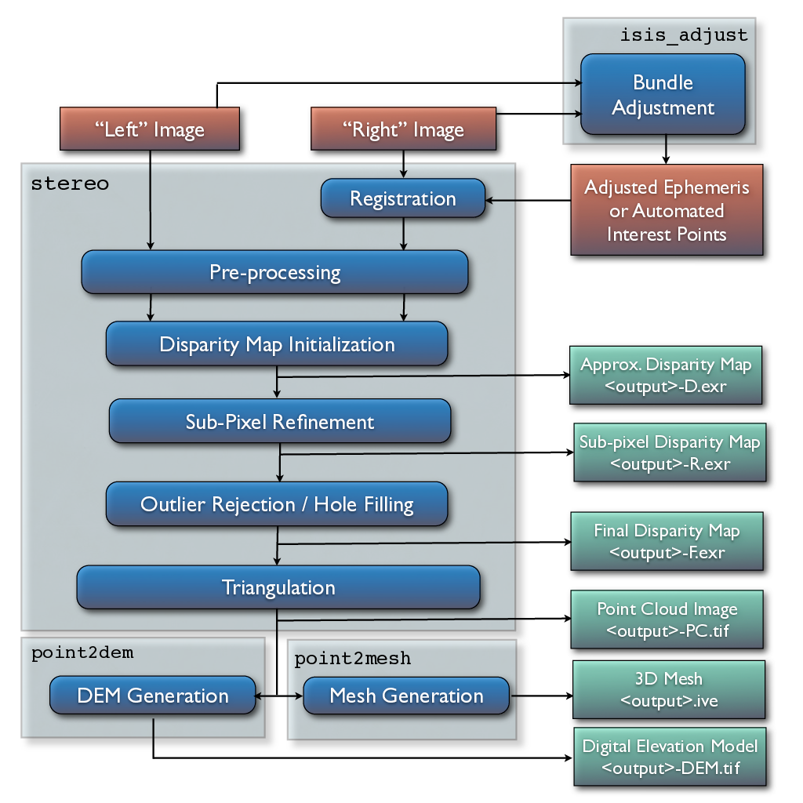
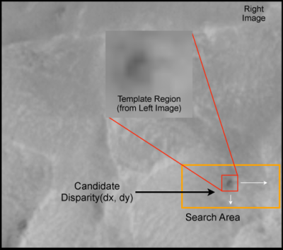
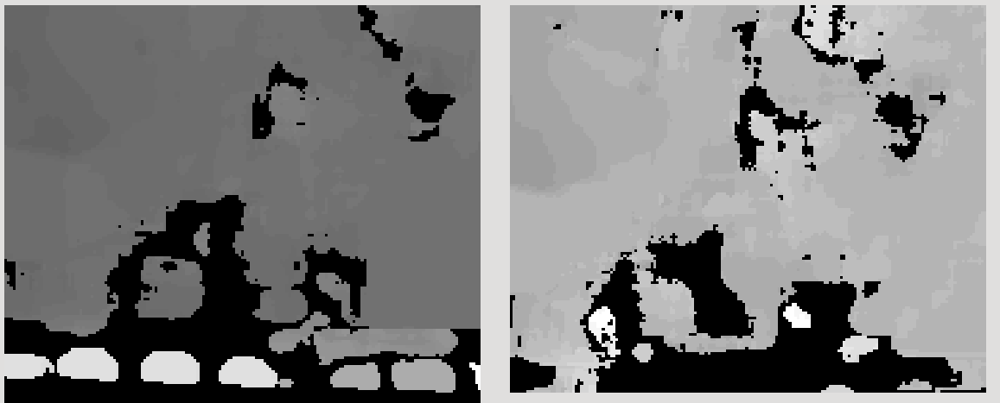
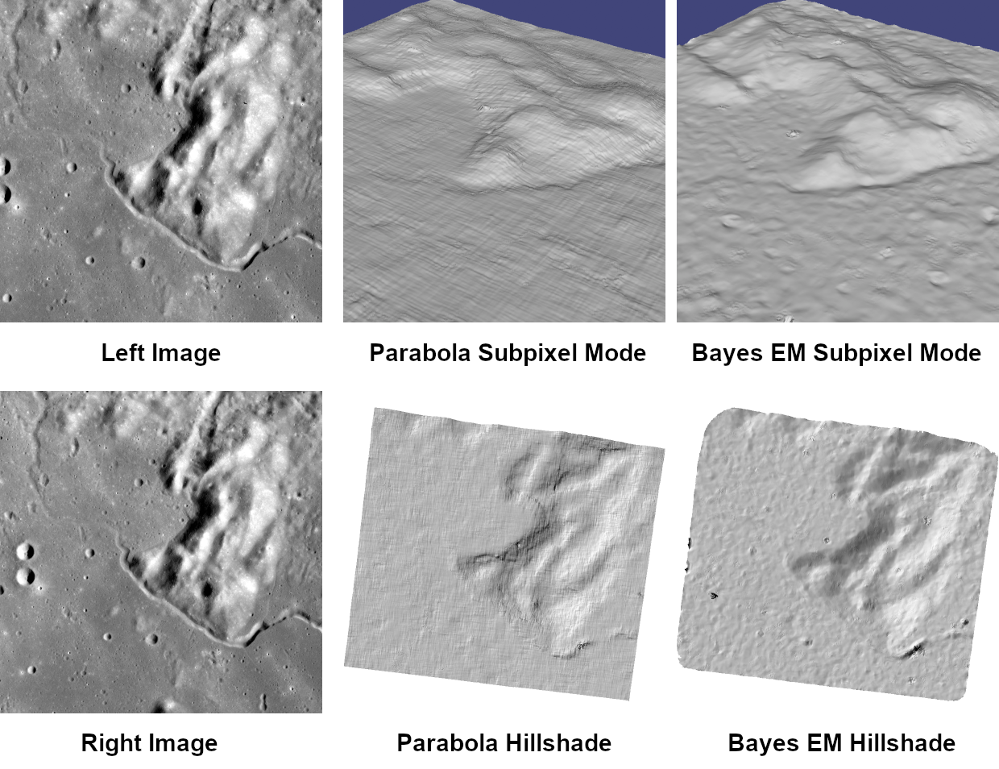
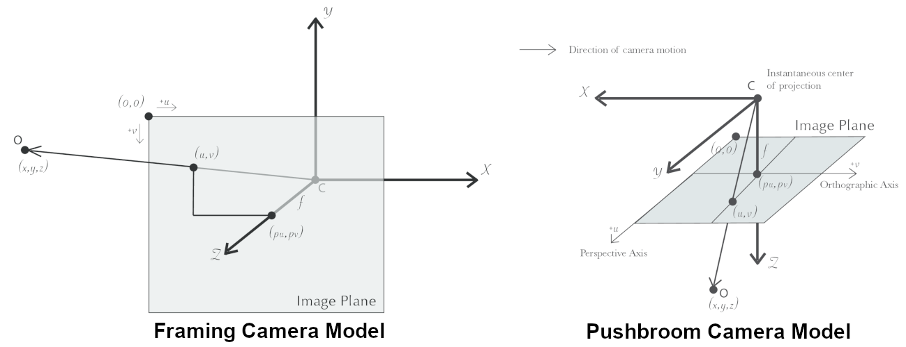

.. _correlation:

Advanced stereo topics
======================

In this chapter we will dive much deeper into understanding the core
algorithms in the Stereo Pipeline. We start with an overview of the five
stages of stereo reconstruction. Then we move into an in-depth
discussion and exposition of the various correlation algorithms.

The goal of this chapter is to build an intuition for the stereo
correlation process. This will help users to identify unusual results in
their DEMs and hopefully eliminate them by tuning various parameters in
the ``stereo.default`` file (:numref:`stereodefault`). For scientists and
engineers who are using DEMs produced with the Stereo Pipeline, this
chapter may help to answer the question, "What is the Stereo Pipeline
doing to the raw data to produce this DEM?"

A related question that is commonly asked is, "How accurate is a DEM
produced by the Stereo Pipeline?" This chapter does not yet address
matters of accuracy and error, however we have several efforts underway
to quantify the accuracy of Stereo Pipeline-derived DEMs, and will be
publishing more information about that shortly. Stay tuned.

The entire stereo correlation process, from raw input images to a point
cloud or DEM, can be viewed as a multistage pipeline as depicted in
:numref:`asp`, and detailed in the following sections.

   Flow of data through the Stereo Pipeline.

Pre-processing
--------------

The first optional (but recommended) step in the process is least
squares Bundle Adjustment, which is described in detail in
:numref:`bundle_adjustment`.

Next, the left and right images are roughly aligned using one of
the four methods: (1) a homography transform of the right image
based on automated tie-point measurements (interest point matches), 
(2) an affine epipolar
transform of both the left and right images (also based on tie-point
measurements as earlier), the effect of which is equivalent to
rotating the original cameras which took the pictures, (3) a 3D
rotation that achieves epipolar rectification (only implemented for
Pinhole sessions for missions like MER or K10, see
:numref:`mer-example` and :numref:`k10example`) or (4)
map-projection of both the left and right images using the ISIS
``cam2map`` command or through the more general ``mapproject`` tool
that works for any cameras supported by ASP (see :numref:`mapproj-example`
for the latter). The first three options can be applied automatically
by the Stereo Pipeline when the ``alignment-method`` variable in
the ``stereo.default`` file is set to ``affineepipolar``, ``homography``,
or ``epipolar``, respectively.

The latter option, running ``cam2map``, ``cam2map4stereo.py``, or
``mapproject`` must be carried out by the user prior to invoking the
``parallel_stereo`` command. Map-projecting the images using ISIS eliminates any
unusual distortion in the image due to the unusual camera acquisition
modes (e.g. pitching "ROTO" maneuvers during image acquisition for MOC,
or highly elliptical orbits and changing line exposure times for the ,
HRSC). It also eliminates some of the perspective differences in the
image pair that are due to large terrain features by taking the existing
low-resolution terrain model into account (e.g. the :term:`MOLA`, :term:`LOLA`,
:term:`NED`, or :term:`ULCN` 2005 models).

In essence, map-projecting the images results in a pair of very closely
matched images that are as close to ideal as possible given existing
information. This leaves only small perspective differences in the
images, which are exactly the features that the stereo correlation
process is designed to detect.

For this reason, we recommend map-projection for pre-alignment of most
stereo pairs. Its only cost is longer triangulation times as more math
must be applied to work back through the transforms applied to the
images. In either case, the pre-alignment step is essential for
performance because it ensures that the disparity search space is
bounded to a known area. In both cases, the effects of pre-alignment are
taken into account later in the process during triangulation, so you do
not need to worry that pre-alignment will compromise the geometric
integrity of your DEM.

In some cases the pre-processing step may also normalize the pixel
values in the left and right images to bring them into the same
dynamic range. Various options in the ``stereo.default`` file affect
whether or how normalization is carried out, including
``individually-normalize`` and ``force-use-entire-range``. Although
the defaults work in most cases, the use of these normalization
steps can vary from data set to data set, so we recommend you refer
to the examples in :numref:`examples` to see if these are necessary
in your use case.

Finally, pre-processing can perform some filtering of the input
images (as determined by ``prefilter-mode``) to reduce noise and
extract edges in the images.  When active, these filters apply a
kernel with a sigma of ``prefilter-kernel-width`` pixels that can
improve results for noisy images (``prefilter-mode`` must be chosen
carefully in conjunction with ``cost-mode``, see :numref:`stereodefault`).
The pre-processing modes that extract image edges are useful for
stereo pairs that do not have the same lighting conditions, contrast,
and absolute brightness :cite:`Nishihara84practical`. We recommend
that you use the defaults for these parameters to start with, and
then experiment only if your results are sub-optimal.

.. _stereo_corr:

Disparity map initialization
----------------------------

Correlation is the process at the heart of the Stereo Pipeline. It is a
collection of algorithms that compute correspondences between pixels in
the left image and pixels in the right image. The map of these
correspondences is called a *disparity map*.  This is saved
in the file named ``output_prefix-D.tif``.

A disparity map is an image whose pixel locations correspond to the pixel
:math:`(u,v)` in the left image, and whose pixel values contain the horizontal
and vertical offsets :math:`(d_u, d_v)` to the matching pixel in the right
image, which is :math:`(u+d_u, v+d_v)`.

The correlation process attempts to find a match for every pixel in the
left image. The only pixels skipped are those marked invalid in the mask
images. For large images (e.g. from HiRISE, , LROC, or WorldView), this
is very expensive computationally, so the correlation process is split
into two stages. The disparity map initialization step computes
approximate correspondences using a pyramid-based search that is highly
optimized for speed, but trades resolution for speed. The results of
disparity map initialization are integer-valued disparity estimates. The
sub-pixel refinement step takes these integer estimates as initial
conditions for an iterative optimization and refines them using the
algorithm discussed in the next section.

We employ several optimizations to accelerate disparity map
initialization: (1) a box filter-like accumulator that reduces duplicate
operations during correlation :cite:`Sun02rectangular`; (2)
a coarse-to-fine pyramid based approach where disparities are estimated
using low-resolution images, and then successively refined at higher
resolutions; and (3) partitioning of the disparity search space into
rectangular sub-regions with similar values of disparity determined in
the previous lower resolution level of the pyramid
:cite:`Sun02rectangular`.

   The correlation algorithm in disparity map initialization uses a
   sliding template window from the left image to find the best match in
   the right image. The size of the template window can be adjusted
   using the ``H_KERN`` and ``V_KERN`` parameters in the
   ``stereo.default`` file, and the search range can be adjusted using
   the ``{H,V}_CORR_{MIN/MAX}`` parameters.

Naive correlation itself is carried out by moving a small, rectangular
template window from the from left image over the specified search
region of the right image, as in :numref:`correlation_window`. The
"best" match is determined by applying a cost function that compares the
two windows. The location at which the window evaluates to the lowest
cost compared to all the other search locations is reported as the
disparity value. The ``cost-mode`` variable allows you to choose one of
three cost functions, though we recommend normalized cross correlation
:cite:`Menard97:robust`, since it is most robust to slight
lighting and contrast variations between a pair of images. Try the
others if you need more speed at the cost of quality.

.. _d_sub:

Low-resolution disparity
------------------------

Producing the disparity map at full resolution as in :numref:`stereo_corr` is
computationally expensive. To speed up the process, ASP starts by first creating
a low-resolution initial guess version of the disparity map. This is saved
in the file ``output_prefix-D_sub.tif``. 

Four methods are available for producing this low-resolution disparity,
described below.

.. _d_sub_corr:

Disparity from stereo correlation
~~~~~~~~~~~~~~~~~~~~~~~~~~~~~~~~~

The default approach is to use for the low-resolution disparity the same
algorithm as for the full-resolution one, but called with the low-resolution
images ``output_prefix-L_sub.tif`` and ``output_prefix-R_sub.tif``. 

Those "sub" images have their size chosen so that their area is around 2.25
megapixels, a size that is easily viewed on the screen unlike the raw source
images. 

This corresponds to the ``parallel_stereo`` option ``--corr-seed-mode 1``
(:numref:`stereodefault`).

.. _d_sub_dem:

Disparity from a DEM
~~~~~~~~~~~~~~~~~~~~

The low resolution disparity can be computed from a lower-resolution initial
guess DEM of the area. This works with all alignment methods except ``epipolar``
(:numref:`image_alignment`). Mapprojected images are supported
(:numref:`mapproj-example`).

This option assumes rather good alignment between the cameras and the DEM.
Otherwise see :numref:`ba_pc_align`. The option ``--disparity-estimation-dem-error``
should be used to specify the uncertainty in such a DEM.

This can be useful when there are a lot of clouds, or terrain features are not
seen well at low resolution.

As an example, invoke ``parallel_stereo`` with options along the lines of::

   --corr-seed-mode 2                 \
   --disparity-estimation-dem ref.tif \
   --disparity-estimation-dem-error 5 

When features are washed out at low resolution, consider also adding the option
``--corr-max-levels 2``, or see :numref:`sparse_disp`.

See :numref:`stereodefault` for more information on these options.

It is suggested to extract the produced low-resolution disparity bands with
``gdal_translate`` (:numref:`mask_disparity`) or ``disparitydebug``
(:numref:`disparitydebug`). Inspect them  in ``stereo_gui``
(:numref:`stereo_gui`).

.. _sparse_disp:

Sparse disparity from full-resolution images
~~~~~~~~~~~~~~~~~~~~~~~~~~~~~~~~~~~~~~~~~~~~

For snowy landscapes, whose only features may be small-scale grooves or ridges
sculpted by wind (so-called *zastrugi*), the low-resolution images appear blank,
so the default low-resolution disparity approach in :numref:`d_sub_corr` fails.

One can then use a disparity from a DEM (:numref:`d_sub_dem`), skip the
low-resolution disparity (:numref:`d_sub_skip`), or the approach outlined in
this section, based on the tool named ``sparse_disp``.

This program create the low-resolution initial disparity
``output_prefix-D_sub.tif`` from the full-resolution images, yet only at a
sparse set of pixels for reasons, of speed. This low-resolution disparity is
then refined as earlier using a pyramid approach, but with fewer levels,
to prevent the features being washed out.

.. figure:: images/examples/sparse_disp.png
   :name: fig:sparse-disp-example
   :figwidth: 100%

   Example of a difficult terrain obtained without (left) and with (right)
   ``sparse_disp``. (In these DEMs there is very little elevation change,
   hence the flat appearance.)

Here is an example:

::

    parallel_stereo -t dg --corr-seed-mode 3            \
      --corr-max-levels 2                               \
      left_mapped.tif right_mapped.tif                  \
      12FEB12053305-P1BS_R2C1-052783824050_01_P001.XML  \
      12FEB12053341-P1BS_R2C1-052783824050_01_P001.XML  \
      dg/dg srtm_53_07.tif

This tool can be customized with the ``parallel_stereo`` switch
``--sparse-disp-options``. 

Installation of sparse_disp
^^^^^^^^^^^^^^^^^^^^^^^^^^^

The ``sparse_disp`` tool is written in Python, and makes use of the ``gdal``,
``numpy``, and ``scipy`` packages. To use it, these packages must be installed
with ``conda``. 

It is very important to use the same version of ``python``, ``numpy``, and
``gdal`` as in ASP. Hence, make adjustments below and then run::

    conda create -n sparse_disp c conda-forge      \
      python=3.11.6 numpy=1.26.4 gdal=3.7.1 scipy
      
ASP can be told where to look for these packages with a line such as::
      
    export ASP_PYTHON_MODULES_PATH=$HOME/miniconda3/envs/sparse_disp/lib/python3.11/site-packages
    
Here, also need to adjust appropriately the ``conda`` installation location 
and ``python`` version.

.. _d_sub_skip:

Skip the low-resolution disparity
~~~~~~~~~~~~~~~~~~~~~~~~~~~~~~~~~

Any large failure in the low-resolution disparity image will be detrimental to
the performance of the higher resolution disparity.  In the event that the
low-resolution disparity is completely unhelpful, it can be skipped by adding
``corr-seed-mode 0`` in the ``stereo.default`` file and using a manual search
range (:numref:`search_range`). 

This should only be considered in cases where the texture in an image is
completely lost when subsampled.  An example would be satellite images of fresh
snow in the Arctic. Alternatively, ``output_prefix-D_sub.tif`` can be computed
at a sparse set of pixels at full resolution, as described in
:numref:`sparse_disp`.

More on the correlation process
-------------------------------

Debugging disparity map initialization
~~~~~~~~~~~~~~~~~~~~~~~~~~~~~~~~~~~~~~

Never will all pixels be successfully matched during stereo matching.
Though a good chunk of the image should be correctly processed. If you
see large areas where matching failed, this could be due to a variety of
reasons:

-  In regions where the images do not overlap, there should be no valid
   matches in the disparity map.

-  Match quality may be poor in regions of the images that have
   different lighting conditions, contrast, or specular properties of
   the surface.

-  Areas that have image content with very little texture or extremely
   low contrast may have an insufficient signal to noise ratio, and will
   be rejected by the correlator.

-  Areas that are highly distorted due to different image perspective,
   such as crater and canyon walls, may exhibit poor matching
   performance. This could also be due to failure of the preprocessing
   step in aligning the images. The correlator can not match images that
   are rotated differently from each other or have different
   scale/resolution. Mapprojection is used to at least partially rectify
   these issues (:numref:`mapproj-example`).

Bad matches, often called "blunders" or "artifacts" are also common, and
can happen for many of the same reasons listed above. The Stereo
Pipeline does its best to automatically detect and eliminate these
blunders, but the effectiveness of these outlier rejection strategies
does vary depending on the quality of the input images.

When tuning up your ``stereo.default`` file, you will find that it is
very helpful to look at the raw output of the disparity map
initialization step. This can be done using the ``disparitydebug`` tool,
which converts the ``output_prefix-D.tif`` file into a pair of normal
images that contain the horizontal and vertical components of disparity.
You can open these in a standard image viewing application and see
immediately which pixels were matched successfully, and which were not.
Stereo matching blunders are usually also obvious when inspecting these
images. With a good intuition for the effects of various
``stereo.default`` parameters and a good intuition for reading the
output of ``disparitydebug``, it is possible to quickly identify and
address most problems.

If you are seeing too many holes in your disparity images, one option
that may give good results is to increase the size of the correlation
kernel used by ``stereo_corr`` with the ``--corr-kernel`` option.
Increasing the kernel size will increase the processing time but should
help fill in regions of the image where no match was found.

.. figure:: images/correlation/stereo_corr_box_compare.png
   :name: corr-kernel-size-effect
   :alt: Correlation Kernel Size

   The effect of increasing the correlation kernel size from 35 (left)
   to 75 (right). This location is covered in snow and several regions
   lack texture for the correlator to use but a large kernel increases
   the chances of finding useful texture for a given pixel.

   The effect of using the ``rm-quantile`` filtering option in
   ``stereo_corr``. In the left image there are a series of high
   disparity "islands" at the bottom of the image. In the right image
   quantile filtering has removed those islands while leaving the rest
   of the image intact.

.. _search_range:

Search range determination
~~~~~~~~~~~~~~~~~~~~~~~~~~

In some circumstances, the low-resolution disparity ``D_sub.tif`` computation
may fail, or it may be inaccurate. This can happen for example if only very
small features are present in the original images, and they disappear during the
resampling that is necessary to obtain ``D_sub.tif``. 

In this case, it is possible to set ``corr-seed-mode`` from the default of 1 to
the values of 2 or 3, that will use a DEM or sample the full-resolution images
to produce a low-resolution disparity (:numref:`d_sub`).

Or, set ``corr-seed-mode`` to 0, and manually specify a search range to use for
full-resolution correlation via the parameter ``corr-search``. In
``stereo.default`` (:numref:`stereodefault`) this parameter's entry will look
like::

           corr-search -80 -2 20 2

The exact values to use with this option you'll have to discover
yourself. These four numbers represent the horizontal
minimum boundary, vertical minimum boundary, horizontal maximum
boundary, and finally the horizontal maximum boundary within which we
will search for the disparity during correlation.

It can be tricky to select a good search range. That's why the best
way is to let ``parallel_stereo`` perform an automated determination.
If you think that you can do a better estimate of the search range,
take look at what search ranges ``stereo_corr`` prints in the log files
in the output directory, and examine the intermediate disparity images
using the ``disparitydebug`` program, to figure out which search
directions can be expanded or contracted. The output images will
clearly show good data or bad data depending on whether the search
range is correct.

The worst case scenario is to determine the search range manually. The
aligned ``L.tif`` and ``R.tif`` images (:numref:`outputfiles`) can be
opened in ``stereo_gui`` (:numref:`stereo_gui`), and the coordinates
of points that can be matched visually can be compared. Click on a
pixel to have its coordinates printed in the terminal. Subtract row
and column locations of a feature in the first image from the
locations of the same feature in the second image, and this will yield
offsets that can be used in the search range. Make several of these
offset measurements (for example, for features at higher and then
lower elevations), and use them to define a row and column bounding
box, then expand this by 50% and use it for ``corr-search``. This will
produce good results in most cases.

If the search range produced automatically from the low-resolution
disparity is too big, perhaps due to outliers, it can be tightened
with either ``--max-disp-spread`` or ``--corr-search-limit``, before
continuing with full-resolution correlation (:numref:`stereodefault`).
But note that for very steep terrains and no use of mapprojection a
large search range is expected, and tightening it too much may result
in an inaccurate disparity.

.. _subpixel:

Sub-pixel refinement
--------------------

Once disparity map initialization is complete, every pixel in the
disparity map will either have an estimated disparity value, or it will
be marked as invalid. All valid pixels are then adjusted in the
sub-pixel refinement stage based on the ``subpixel-mode`` setting.

The first mode is parabola-fitting sub-pixel refinement
(``subpixel-mode 1``). This technique fits a 2D parabola to points on
the correlation cost surface in an 8-connected neighborhood around the
cost value that was the "best" as measured during disparity map
initialization. The parabola's minimum can then be computed analytically
and taken as as the new sub-pixel disparity value.

This method is easy to implement and extremely fast to compute, but it
exhibits a problem known as pixel-locking: the sub-pixel disparities
tend toward their integer estimates and can create noticeable "stair
steps" on surfaces that should be smooth
:cite:`Stein06:attenuating,Szeliski03sampling`. See for
example :numref:`parabola_subpixel`.
Furthermore, the parabola subpixel mode is not capable of refining a
disparity estimate by more than one pixel, so although it produces
smooth disparity maps, these results are not much more accurate than the
results that come out of the disparity map initialization in the first
place. However, the speed of this method makes it very useful as a
"draft" mode for quickly generating a DEM for visualization (i.e.
non-scientific) purposes. It is also beneficial in the event that a user
will simply downsample their DEM after generation in Stereo Pipeline.

  Left: Input images.  Center: results using the parabola draft
  subpixel mode (subpixel-mode = 1). Right: results using the Bayes
  EM high quality subpixel mode (subpixel-mode = 2).

For high quality results, we recommend ``subpixel-mode 2``: the Bayes EM
weighted affine adaptive window correlator. This advanced method
produces extremely high quality stereo matches that exhibit a high
degree of immunity to image noise. For example Apollo Metric Camera
images are affected by two types of noise inherent to the scanning
process: (1) the presence of film grain and (2) dust and lint particles
present on the film or scanner. The former gives rise to noise in the
DEM values that wash out real features, and the latter causes incorrect
matches or hard to detect blemishes in the DEM. Attenuating the effect
of these scanning artifacts while simultaneously refining the integer
disparity map to sub-pixel accuracy has become a critical goal of our
system, and is necessary for processing real-world data sets such as the
Apollo Metric Camera data.

The Bayes EM subpixel correlator also features a deformable template
window from the left image that can be rotated, scaled, and translated
as it zeros in on the correct match in the right image. This adaptive
window is essential for computing accurate matches on crater or canyon
walls, and on other areas with significant perspective distortion due to
foreshortening.

This affine-adaptive behavior is based on the Lucas-Kanade template
tracking algorithm, a classic algorithm in the field of computer vision
:cite:`Baker04:lucas-kanade`. We have extended this
technique; developing a Bayesian model that treats the Lucas-Kanade
parameters as random variables in an Expectation Maximization (EM)
framework. This statistical model also includes a Gaussian mixture
component to model image noise that is the basis for the robustness of
our algorithm. We will not go into depth on our approach here, but we
encourage interested readers to read our papers on the topic
:cite:`nefian:bayes_em,broxton:isvc09`.

However we do note that, like the computations in the disparity map
initialization stage, we adopt a multi-scale approach for sub-pixel
refinement. At each level of the pyramid, the algorithm is initialized
with the disparity determined in the previous lower resolution level of
the pyramid, thereby allowing the subpixel algorithm to shift the
results of the disparity initialization stage by many pixels if a better
match can be found using the affine, noise-adapted window. Hence, this
sub-pixel algorithm is able to significantly improve upon the results to
yield a high quality, high resolution result.

Another option when run time is important is ``subpixel-mode 3``: the
simple affine correlator. This is essentially the Bayes EM mode with the
noise correction features removed in order to decrease the required run
time. In data sets with little noise this mode can yield results similar
to Bayes EM mode in approximately one fifth the time.

A different option is Phase Correlation, ``subpixel-mode 4``, which
implements the algorithm from :cite:`guizar2008efficient`.
It is slow and does not work well on slopes but since the algorithm is
very different it might perform in situations where the other algorithms
are not working well.

Triangulation
-------------

When running an ISIS session, the Stereo Pipeline uses geometric camera
models available in ISIS :cite:`anderson08:isis`. These
highly accurate models are customized for each instrument that ISIS
supports. Each ISIS "cube" file contains all of the information that is
required by the Stereo Pipeline to find and use the appropriate camera
model for that observation.

Other sessions such as DG (*DigitalGlobe*) or Pinhole, require that
their camera model be provided as additional arguments to the ``parallel_stereo``
command. Those camera models come in the form of an XML document for DG
and as ``*.pinhole, *.tsai, *.cahv, *.cahvor`` for Pinhole sessions.
Those files must be the third and forth arguments or immediately follow
after the two input images for ``parallel_stereo``.

   Most remote sensing cameras fall into two generic categories
   based on their basic geometry.  Framing cameras (left) capture an
   instantaneous two-dimensional image.  Linescan cameras (right)
   capture images one scan line at a time, building up an image over
   the course of several seconds as the satellite moves through the
   sky.

ISIS camera models account for all aspects of camera geometry, including
both intrinsic (i.e. focal length, pixel size, and lens distortion) and
extrinsic (e.g. camera position and orientation) camera parameters.
Taken together, these parameters are sufficient to "forward project" a
3D point in the world onto the image plane of the sensor. It is also
possible to "back project" from the camera's center of projection
through a pixel corresponding to the original 3D point.

.. figure:: images/correlation/triangulation_400px.png
   :name: triangulation
   :alt: Triangulation

   Once a disparity map has been generated and refined, it can be used
   in combination with the geometric camera models to compute the
   locations of 3D points on the surface of Mars. This figure shows the
   position (at the origins of the red, green, and blue vectors) and
   orientation of the Mars Global Surveyor at two points in time where
   it captured images in a stereo pair.

Notice, however, that forward and back projection are not symmetric
operations. One camera is sufficient to "image" a 3D point onto a pixel
located on the image plane, but the reverse is not true. Given only a
single camera and a pixel location :math:`x = (u,v),` that is the image
of an unknown 3D point :math:`P = (x,y,z)`, it is only possible to
determine that :math:`P` lies somewhere along a ray that emanates from
the camera center through the pixel location :math:`x`
on the image plane (see :numref:`camera_models`).

Alas, once images are captured, the route from image pixel back to
3D points in the real world is through back projection, so we must
bring more information to bear on the problem of uniquely reconstructing
our 3D point. In order to determine :math:`P` using back projection,
we need *two* cameras that both contain pixel locations :math:`x_1`
and :math:`x_2` where :math:`P` was imaged. Now, we have two rays
that converge on a point in 3D space (see :numref:`triangulation`).
The location where they meet must be the original location of
:math:`P`.

.. _triangulation_error:

Triangulation error
~~~~~~~~~~~~~~~~~~~

In practice, the rays emanating from matching pixels in the cameras
rarely intersect perfectly on the ground because any slight error in
the position or pointing information of the cameras will affect the
accuracy of the rays. The matching (correlation) among the images is
also not perfect, contributing to the error budget. Then, we take the
*closest point of intersection* of the two rays as the location of the
intersection point :math:`P`.

Additionally, the actual shortest distance between the rays at this
point is an interesting and important error metric that measures how
self-consistent our two camera models are for this point. It will be
seen in the next chapter that this information, when computed and
averaged over all reconstructed 3D points, can be a valuable statistic
for determining whether to carry out bundle adjustment
(:numref:`bundle_adjust`). 

The distance between the two rays emanating from matching points in
the cameras at their closest intersection is recorded in the fourth
channel of the point cloud file, ``output-prefix-PC.tif``.  This is
called the *triangulation error*, or the *ray intersection error*. It
is measured in meters. This error can be gridded when a DEM is created
from the point cloud by using the ``--errorimage`` argument on the
``point2dem`` command (:numref:`point2dem`).

This error *is not* the true accuracy of the DEM. It is only another
indirect measure of quality. A DEM with high triangulation error, as
compared to the ground sample distance, is always bad and should have
its images bundle-adjusted. A DEM with low triangulation error is at
least self-consistent, but could still be bad, or at least
misaligned.

If, after bundle adjustment, the triangulation error is still high at
the image corners and the inputs are Pinhole cameras, one may have to
refine the intrinsics, including the distortion model.
:numref:`bundle_adjustment` discusses bundle adjustment, including
optimizing the intrinsics.

To improve the location of a triangulated point cloud or created DEM
relative to a known ground truth, use alignment (:numref:`pc_align`).

See :numref:`error_propagation` for another metric qualifying
the accuracy of a point cloud or DEM, namely the horizontal and vertical
uncertainty, as propagated from the input cameras.

.. _mapproj_with_cam2map:

Stereo with images mapprojected using ISIS
~~~~~~~~~~~~~~~~~~~~~~~~~~~~~~~~~~~~~~~~~~

This is a continuation of the discussion at :numref:`moc_tutorial`. It
describes how to mapproject the input images using the ISIS tool
``cam2map`` and how to run stereo with the obtained
images. Alternatively, the images can be mapprojected using ASP
itself, per :numref:`mapproj-example`.

Mapprojection can result in improved results for steep slopes, when
the images are taken from very different perspectives, or if the
curvature of the planet/body being imaged is non-negligible.

We will now describe how this works, but we also provide the
``cam2map4stereo.py`` program (:numref:`cam2map4stereo.py`) which does
this automatically.

The ISIS ``cam2map`` program will map-project these images::

    ISIS> cam2map from=M0100115.cub to=M0100115.map.cub
    ISIS> cam2map from=E0201461.cub to=E0201461.map.cub \
            map=M0100115.map.cub matchmap=true

At this stage we can run the stereo program with map-projected images:

::

     ISIS> parallel_stereo E0201461.map.cub M0100115.map.cub   \
             --alignment-method none -s stereo.default.example \
             results/output

Here we have used ``alignment-method none`` since ``cam2map4stereo.py``
brought the two images into the same perspective and using the same
resolution. If you invoke ``cam2map`` independently on the two images,
without ``matchmap=true``, their resolutions may differ, and using an
alignment method rather than ``none`` to correct for that is still
necessary.

Now you may skip to chapter :numref:`nextsteps` which will discuss the
``parallel_stereo`` program in more detail and the other tools in ASP.
Or, you can continue reading below for more details on mapprojection.

Advanced discussion of mapprojection
------------------------------------

Notice the order in which the images were run through ``cam2map``. The
first projection with ``M0100115.cub`` produced a map-projected image
centered on the center of that image. The projection of ``E0201461.cub``
used the ``map=`` parameter to indicate that ``cam2map`` should use the
same map projection parameters as those of ``M0100115.map.cub``
(including center of projection, map extents, map scale, etc.) in
creating the projected image. By map-projecting the image with the worse
resolution first, and then matching to that, we ensure two things: (1)
that the second image is summed or scaled down instead of being
magnified up, and (2) that we are minimizing the file sizes to make
processing in the Stereo Pipeline more efficient.

Technically, the same end result could be achieved by using the
``mocproc`` program alone, and using its ``map= M0100115.map.cub``
option for the run of ``mocproc`` on ``E0201461.cub`` (it behaves
identically to ``cam2map``). However, this would not allow for
determining which of the two images had the worse resolution and
extracting their minimum intersecting bounding box (see below).
Furthermore, if you choose to conduct bundle adjustment (see
:numref:`bundle_adjustment`) as a pre-processing step, you would
do so between ``mocproc`` (as run above) and ``cam2map``.

The above procedure is in the case of two images which cover similar
real estate on the ground. If you have a pair of images where one image
has a footprint on the ground that is much larger than the other, only
the area that is common to both (the intersection of their areas) should
be kept to perform correlation (since non-overlapping regions don't
contribute to the stereo solution). 

ASP normally has no problem identifying the shared area and it still
run well. Below we describe, for the adventurous user, some
fine-tuning of this procedure.

If the image with the larger footprint size also happens to be the
image with the better resolution (i.e. the image run through
``cam2map`` second with the ``map=`` parameter), then the above
``cam2map`` procedure with ``matchmap=true`` will take care of it just
fine. Otherwise you'll need to figure out the latitude and longitude
boundaries of the intersection boundary (with the ISIS ``camrange``
program). Then use that smaller boundary as the arguments to the
``MINLAT``, ``MAXLAT``, ``MINLON``, and ``MAXLON`` parameters of the
first run of ``cam2map``. So in the above example, after ``mocproc``
with ``Mapping= NO`` you'd do this:

::

     ISIS> camrange from=M0100115.cub
              ... lots of camrange output omitted ...
     Group = UniversalGroundRange
       LatitudeType       = Planetocentric
       LongitudeDirection = PositiveEast
       LongitudeDomain    = 360
       MinimumLatitude    = 34.079818835324
       MaximumLatitude    = 34.436797628116
       MinimumLongitude   = 141.50666207418
       MaximumLongitude   = 141.62534719278
     End_Group
              ... more output of camrange omitted ...

::

     ISIS> camrange from=E0201461.cub
              ... lots of camrange output omitted ...
     Group = UniversalGroundRange
       LatitudeType       = Planetocentric
       LongitudeDirection = PositiveEast
       LongitudeDomain    = 360
       MinimumLatitude    = 34.103893080982
       MaximumLatitude    = 34.547719435156
       MinimumLongitude   = 141.48853937384
       MaximumLongitude   = 141.62919740048
     End_Group
              ... more output of camrange omitted ...

Now compare the boundaries of the two above and determine the
intersection to use as the boundaries for ``cam2map``:

::

     ISIS> cam2map from=M0100115.cub to=M0100115.map.cub   \
             DEFAULTRANGE=CAMERA MINLAT=34.10 MAXLAT=34.44 \
             MINLON=141.50 MAXLON=141.63
     ISIS> cam2map from=E0201461.cub to=E0201461.map.cub \
             map=M0100115.map.cub matchmap=true

You only have to do the boundaries explicitly for the first run of
``cam2map``, because the second one uses the ``map=`` parameter to mimic
the map-projection of the first. These two images are not radically
different in spatial coverage, so this is not really necessary for these
images, it is just an example.

Again, unless you are doing something complicated, using the
``cam2map4stereo.py`` (:numref:`cam2map4stereo.py`) will take care of
all these steps for you.

.. _local_alignment_issues:

Identifying issues in local alignment
~~~~~~~~~~~~~~~~~~~~~~~~~~~~~~~~~~~~~

Stereo with local epipolar alignment (:numref:`running-stereo`) can
perform better than with global affine epipolar alignment. Yet, when stereo
fails on a locally aligned tile pair, it is instructive to understand
why. Usually it is because the images are difficult at 
that location, such as due to very steep terrain, clouds, shadows, etc.

For a completed ``parallel_stereo`` run which failed in a portion, the
first step is to identify the offending tile directory. For that, open the
produced DEM in ``stereo_gui``, and use the instructions at
:numref:`image_bounds` to find the approximate longitude, latitude,
and height at the problematic location. 

Then run ``stereo_parse`` with the same options as ``parallel_stereo``
and the flag::

    --tile-at-location '<lon> <lat> <height>'

This should print on the screen a text like::

    Tile with location: run/run-2048_3072_1024_1024

If a run failed to complete, find the most recent output tile
directories that were being worked on, based on modification time, and
investigate one of them.

In either case, given a candidate for a problematic tile, from the log
file of ``stereo_corr`` in that tile's directory you can infer the full
correlation command that failed. Re-run it, while appending the option::

    --local-alignment-debug

Images and interest point matches before and after alignment will be
saved. Those can be examined as::

    stereo_gui <tile>-left-crop.tif <tile>-right-crop.tif \
      <tile>-left-crop__right-crop.match 

and::

    stereo_gui <tile>-left-aligned-tile.tif               \
      <tile>-right-aligned-tile.tif                       \
      <tile>-left-aligned-tile__right-aligned-tile.match 

