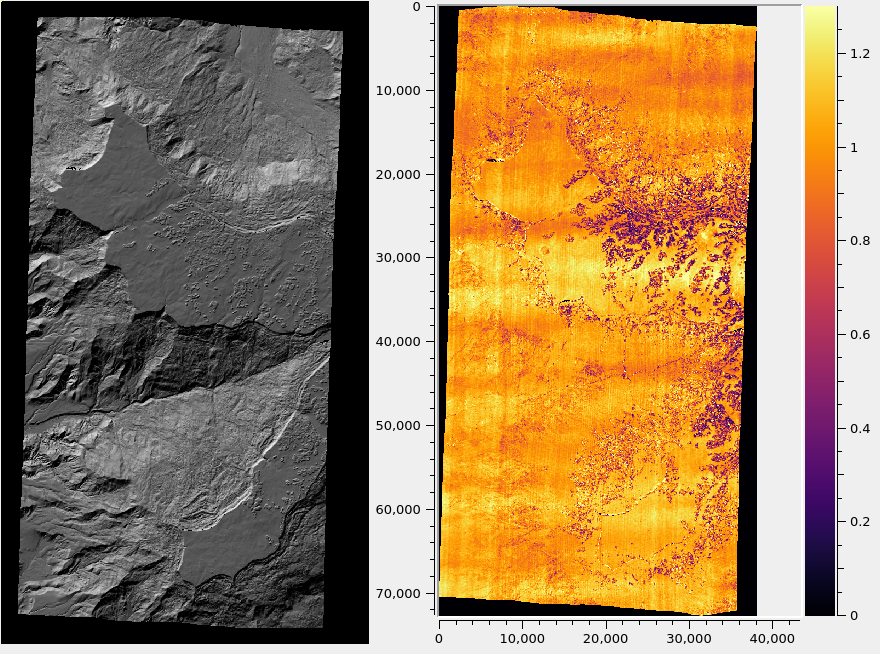
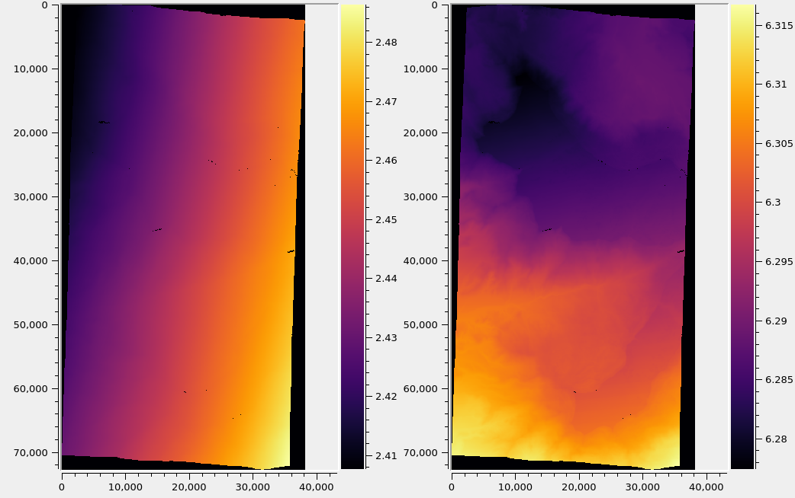

.. _error_propagation:

Error propagation
=================

At the triangulation stage, ``parallel_stereo`` can propagate the
errors (uncertainties, standard deviations, covariances) from the
input cameras, computing the horizontal and vertical standard
deviation (stddev) of the uncertainty for each triangulated
point. This is enabled with the option ``--propagate-errors``
(:numref:`stereo-default-error-propagation`).

The produced uncertainties are then propagated from the point cloud 
to the produced DEM (:numref:`error_propagation_dem`).

The input uncertainties
-----------------------

The input uncertainties can be either numbers that are passed on the
command line, or, otherwise, for a few camera models, they can be read
from the camera files.

If the option ``--horizontal-stddev`` is set, with two positive
numbers as values, representing the left and right camera stddev of
position uncertainty in the local horizontal ground plane having the
triangulated point, then these values will be used. The input stddev
values are measured in meters.  This functionality works with any
cameras supported by ASP.

If this option is not set, the following strategies are used:

 - For Pleiades 1A/1B linescan camera models (:numref:`pleiades`) 
   (but not for NEO, :numref:`pleiades_neo`) the
   ``ACCURACY_STDV`` field is read from the "DIM" XML file for each camera
   (in the *Absolute Horizontal Accuracy* section of the camera
   model), and it is used as the horizontal stddev.

 - For Maxar (DigitalGlobe) RPC cameras (:numref:`rpc`), the values
   ``ERRBIAS`` and ``ERRRAND`` are read from each camera model
   file. The square root of sum of squares of these quantities is the
   input horizontal stddev for a camera.

 - For Maxar (DigitalGlobe) linescan cameras (:numref:`dg_tutorial`), 
   the inputs are the satellite position and orientation covariances,
   read from the ``EPHEMLIST`` and ``ATTLIST`` fields. These are
   propagated from the satellites to the ground and then through
   triangulation. 

For datasets with a known CE90 measure, or in general a
:math:`CE_X` measure, where :math:`X` is between 0% and 100%,
use the  ``--horizontal-stddev`` option, with values computed
using the formula:

.. math::

     StdDev = CE_X/\sqrt{-2 \ln(1-X/100.0)}

(`reference
<https://en.wikipedia.org/wiki/Circular_error_probable#Conversion>`_).

In all cases, the error propagation takes into account whether the cameras are
bundle-adjusted or not (:numref:`bundle_adjust`), and if the images are
mapprojected (:numref:`mapproj-example`).

Produced uncertainty for triangulated points
--------------------------------------------

The triangulation covariance matrix is computed in the local North-East-Down
(NED) coordinates at each nominal triangulated point, and further decomposed
into the horizontal and vertical components (:numref:`produced_covariances`). 

The square root is taken, creating the stddev, which are saved as the 5th and
6th band in the point cloud (\*-PC.tif file, :numref:`outputfiles`). Running
``gdalinfo`` (:numref:`gdal_tools`) on the point cloud will show some metadata
describing each band in that file.

The computed stddev values are in units of meter.

.. _error_propagation_dem:

Propagation of uncertainties to the DEM
---------------------------------------

The stddev values in the point cloud can then be gridded with ``point2dem``
(:numref:`point2dem`) with the option ``--propagate-errors``, using the same
algorithm as for computing the DEM heights.

Example::

    point2dem --t_srs <projection string> --tr <grid size> \
      --propagate-errors run/run-PC.tif

This will produce the files ``run/run-HorizontalStdDev.tif`` and
``run/run-VerticalStdDev.tif`` alongside the output DEM, ``run/run-DEM.tif``.

In all these files the values are in units of meter.

Implementation details
----------------------

Note that propagating the errors subtly changes the behavior of stereo
triangulation, and hence also of the output DEM. Triangulated points
are saved with a float precision of 1e-8 meters (rather than the usual
1e-3 meters or so, :numref:`triangulation_options`), to avoid creating
step artifacts later when gridding the rather slowly varying
propagated errors.

When error propagation is enabled, the triangulated point cloud stores
6 bands instead of the usual 4 (:numref:`outputfiles`), and the LZW
compression is somewhat less efficient since more digits of precision
are stored. The size of the point cloud roughly doubles. This does not
affect the size of the DEM, but its values and extent may change
slightly.

.. _uncertainty_vs_triangulation_err:

What the produced uncertainties are not
---------------------------------------

The horizontal and vertical stddev values created by stereo
triangulation and later gridded by ``point2dem`` measure the
uncertainty of each nominal triangulated point, given the
uncertainties in the input cameras.

This is not the discrepancy between this point's location as compared
to to a known ground truth. If the input cameras are translated by the
same amount in the ECEF coordinate system, the triangulated point
position can change a lot, but the produced uncertainties will change
very little. To estimate and correct a point cloud's geolocation 
invoke an alignment algorithm (:numref:`pc_align`).

The produced uncertainties are not a measure of the pointing accuracy
(:numref:`triangulation_error`). Whether the rays from the cameras
meet at the nominal triangulated point perfectly, or their closest
distance is, for example, 5 meters, the produced uncertainties around
the nominal point will be about the same. See a comparison between
these errors in :numref:`grand_mesa_dem_intersection_err` and 
:numref:`horizontal_vertical_error`.

The pointing accuracy can be improved by using bundle adjustment
(:numref:`bundle_adjust`) and solving for jitter
(:numref:`jitter_solve`).

Example
-------

For Maxar (DigitalGlobe) linescan cameras::

    parallel_stereo --alignment-method local_epipolar \
      --stereo-algorithm asp_mgm --subpixel-mode 9    \
      -t dg --propagate-errors                        \
      left.tif right.tif left.xml right.xml 
      run/run
   point2dem --tr 1.6                                            \
     --t_srs "+proj=utm +zone=13 +datum=WGS84 +units=m +no_defs" \
     --propagate-errors run/run-PC.tif

The projection and grid size above are dependent on the dataset. 

Alternatively, the input horizontal stddev values for the cameras
can be set as::

   --horizontal-stddev 1.05 1.11

Then these will be used instead. This last approach works for any
orbital camera model supported by ASP (:numref:`examples`).

   A hillshaded DEM created with DigitalGlobe WorldView images for
   Grand Mesa, Colorado (left), and the triangulation error
   (:numref:`triangulation_error`) in meters (right). The input images were
   mapprojected (:numref:`mapproj-example`). No bundle adjustment was
   used. Jitter (:numref:`jitter_solve`) is noticeable.  

   Produced horizontal and vertical stddev values (left and right) for the
   same dataset. It can be seen from the scales (units are in meter)
   and comparing with :numref:`grand_mesa_dem_intersection_err` that these
   errors vary little overall, and depend more on the geometry
   of the stereo pair than the underlying terrain. See
   :numref:`uncertainty_vs_triangulation_err` for a discussion.

.. _produced_covariances:

Definitions
-----------

The vertical variance of a triangulated point is defined as the
lower-right corner of the 3x3 NED covariance matrix (since x=North,
y=East, z=Down).

To find the horizontal variance component, consider the upper-left
:math:`2 \times 2` block of that matrix. Geometrically, the
horizontal covariances represent an ellipse. The radius of the circle
with the same area is found, which is the square root of the product
of ellipse semiaxes, which is the product of the eigenvalues of this
symmetric matrix, or its determinant. So, the the horizontal component
of the covariance is defined as the square root of the upper-left
:math:`2 \times 2` bock of the NED covariance matrix.

The square root is taken to go from variance to stddev.

Theory
------

According to the theory of `propagation of uncertainty
<https://en.wikipedia.org/wiki/Propagation_of_uncertainty>`_, given a
function :math:`y = f(x)` between multi-dimensional spaces, the
covariances of the inputs and outputs are related via

.. math::

  Cov_Y = J Cov_X J^T

Here, :math:`J` is the Jacobian of the function :math:`f` and
:math:`J^T` is its transpose. It is assumed that the uncertainties are
small enough that this function can be linearized around the nominal
location.

For this particular application, the input variables are either the
coordinates in the local horizontal ground plane having the
triangulated point (two real values for each camera), or the satellite
positions and orientations (quaternions), which are 7 real values for
each camera. The output is the triangulated point in the local
North-East-Down coordinates.

If the input uncertainties are stddev values, then these are squared,
creating variances, before being propagated (then converted back to
stddev values at the last step).

The Jacobian was computed using centered finite
differences, with a step size of 0.01 meters for the position and 1e-6
for the (normalized) quaternions. The computation was not particularly
sensitive to these step sizes. A much smaller position step size is
not recommended, since the positions are on the order of 7e6 meters,
(being measured from planet center) and because double precision
computations have only 16 digits of precision.

Validation for Maxar (DigitalGlobe) linescan cameras
----------------------------------------------------

The horizontal stddev values propagated through triangulation are on
the order of 3 meters.

The obtained vertical stddev varies very strongly with the convergence
angle, and is usually, 5-10 meters, and perhaps more for stereo pairs
with a convergence angle under 30 degrees.

The dependence on the convergence angle is very expected. But these
numbers appear too large given the ground sample distance of
DigitalGlobe WorldView cameras. We are very confident that they are
correct. The results are so large is because of the input orientation
covariances (the relative contribution of input position and
orientation covariances can be determined with the options
``--position-covariance-factor`` and
``--orientation-covariance-factor``).

The curious user can try the following independent approach to
validate these numbers. The linescan camera files in XML format have
the orientations on lines with the ``ATTLIST`` field. The numbers on
that line are measurement index, then the quaternions (4 values, in
order x, y, z, w) and the upper-right half of the 4x4 covariance
matrix (10 numbers, stored row-wise).

The ``w`` variance (the last number), can be, for example, on the
order of 6.3e-12. Its square root, the standard deviation, which is
2.5e-6 or so, is the expected variability in the ``w`` component of
the quaternion.

Fetch and save the Python script `bias_dg_cam.py
<https://raw.githubusercontent.com/NeoGeographyToolkit/StereoPipeline/master/src/asp/Tools/bias_dg_cam.py>`_. Invoke
it as::

   python bias_dg_cam.py --position-bias "0 0 0" \
     --orientation-bias "0 0 0 2.5e-6"           \
     -i left.xml -o left_bias.xml
   python bias_dg_cam.py --position-bias "0 0 0" \
     --orientation-bias "0 0 0 -2.5e-6"          \
     -i right.xml -o right_bias.xml

This will bias the positions and quaternions in the camera files by
the given amounts, creating ``left_bias.xml`` and
``right_bias.xml``. Note that values with different sign were used in
the two camera files. It is instructive to compare the original and
produced camera files side-by-side, and see the effect of using a
different sign and magnitude for the biases.

Then, ``parallel_stereo`` can be run twice, with different output
prefixes, first with the original cameras, and then the biased ones,
in both cases without propagation of errors. Use
``--left-image-crop-win`` and ``--right-image-crop-win``
(:numref:`stereo_gui`) to run on small clips only.

The created DEMs (with nominal and then with biased cameras) can have
their heights compared using the ``geodiff --absolute`` command
(:numref:`geodiff`). We found a height difference that is very similar
to the vertical standard deviation produced earlier.
