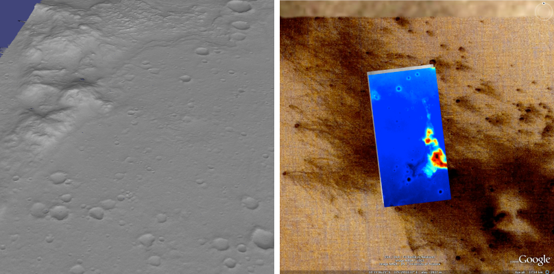
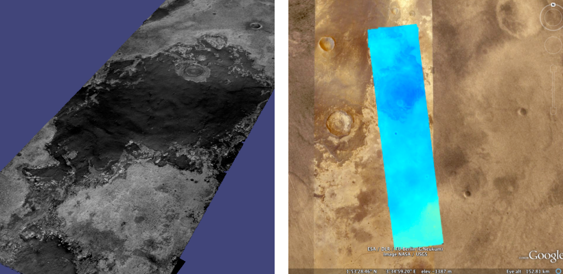
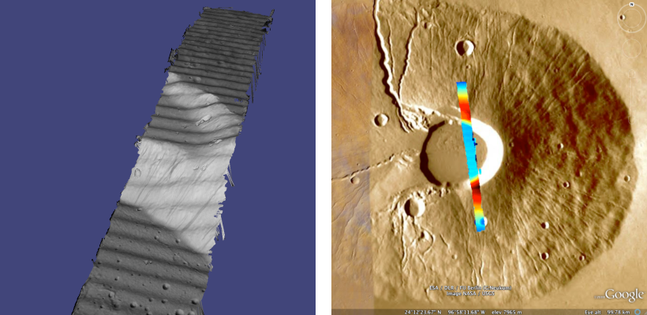
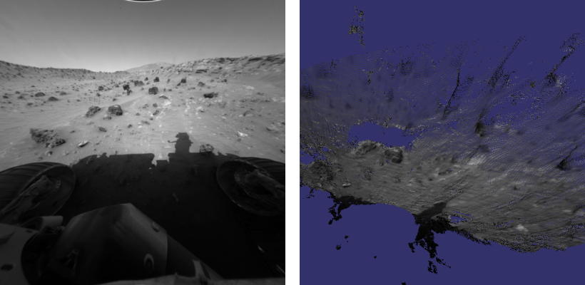
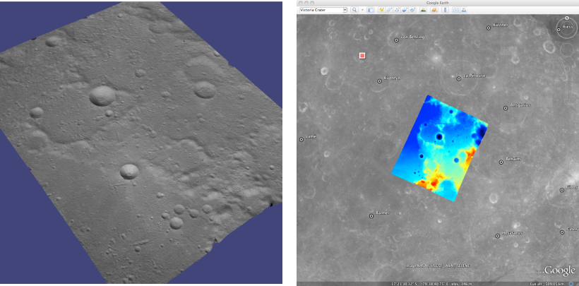
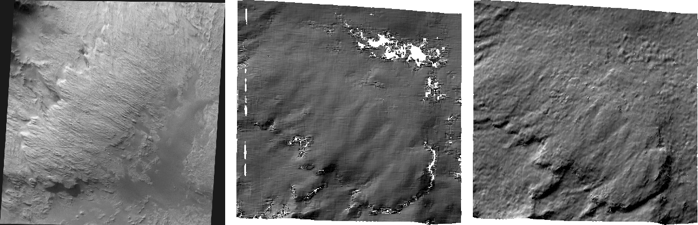
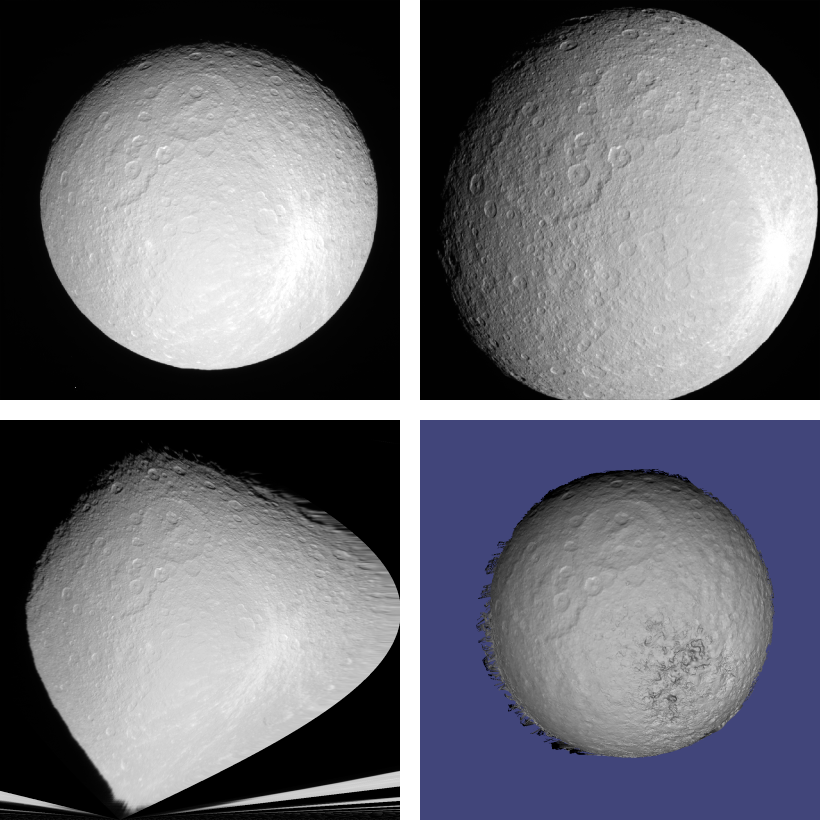
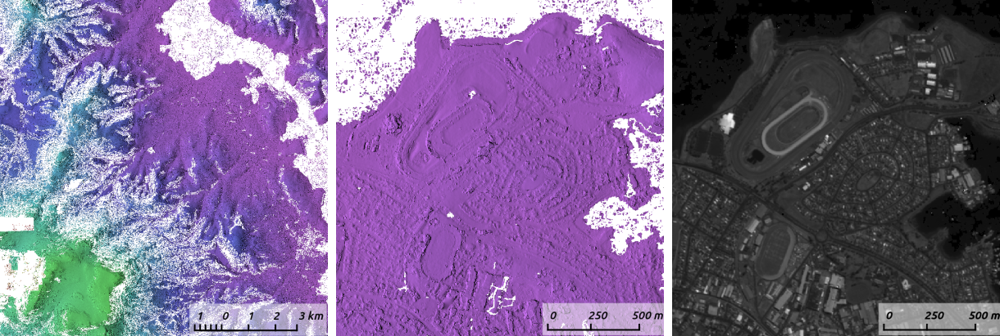
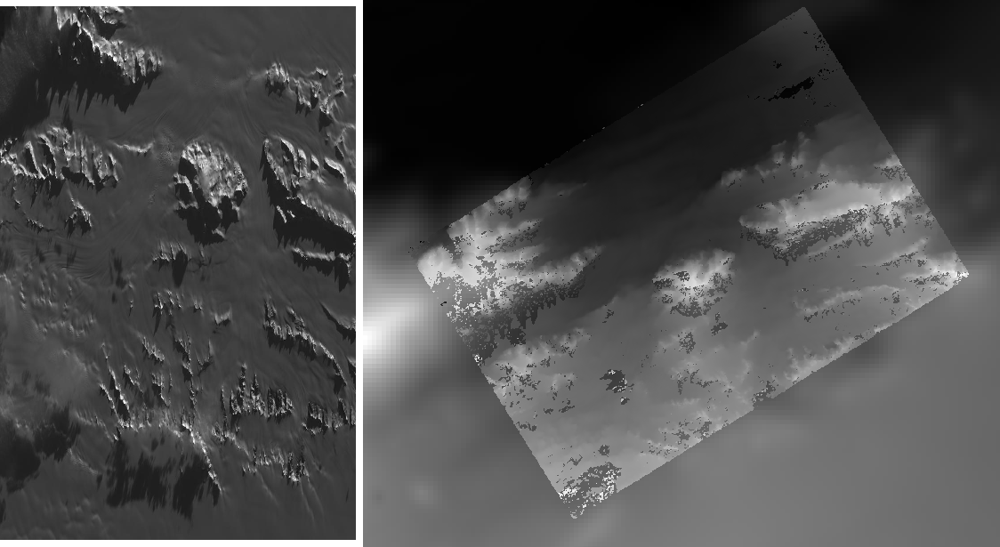
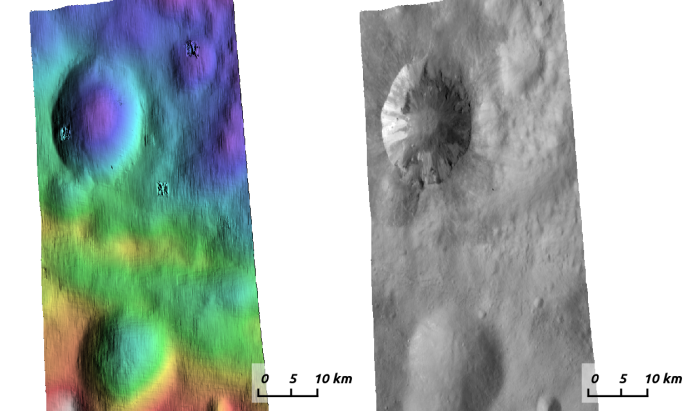

.. _examples:

Data Processing Examples
========================

This chapter showcases a variety of results that are possible when
processing different data sets with the Stereo Pipeline. It is also a
shortened guide that shows the commands used to process specific mission
data. There is no definitive method yet for making elevation models as
each stereo pair is unique. We hope that the following sections serve as
a cookbook for strategies that will get you started in processing your
own data. We recommend that you second check your results against
another source.

Guidelines for Selecting Stereo Pairs
-------------------------------------

When choosing image pairs to process, images that are taken with
similar viewing angles, lighting conditions, and significant surface
coverage overlap are best suited for creating terrain models
:cite:`2015LPI462703B`.  Depending on the characteristics of the
mission data set and the individual images, the degree of acceptable
variation will differ. Significant differences between image
characteristics increases the likelihood of stereo matching error
and artifacts, and these errors will propagate through to the
resulting data products.

Although images do not need to be map-projected before running the
``stereo`` program, we recommend that you do run ``cam2map`` (or
``cam2map4stereo.py``) beforehand, especially for image pairs that
contain large topographic variation (and therefore large disparity
differences across the scene, e.g., Valles Marineris). Map-projection is
especially necessary when processing HiRISE images. This removes the
large disparity differences between HiRISE images and leaves only the
small detail for the Stereo Pipeline to compute. Remember that ISIS can
work backwards through a map-projection when applying the camera model,
so the geometric integrity of your images will not be sacrificed if you
map-project first.

An alternative way of map-projection, that applies to non-ISIS images
as well, is with the ``mapproject`` tool (:numref:`mapproj-example`).

Excessively noisy images will not correlate well, so images should be
photometrically calibrated in whatever fashion suits your purposes. If
there are photometric problems with the images, those photometric
defects can be misinterpreted as topography.

Remember, in order for ``stereo`` to process stereo pairs in ISIS cube
format, the images must have had SPICE data associated by running ISIS’s
``spiceinit`` program run on them first.

Mars Reconnaissance Orbiter HiRISE
----------------------------------

HiRISE is one of the most challenging cameras to use when making 3D
models because HiRISE exposures can be several gigabytes each. Working
with this data requires patience as it will take time.

One important fact to know about HiRISE is that it is composed of
multiple linear CCDs that are arranged side by side with some vertical
offsets. These offsets mean that the CCDs will view some of the same
terrain but at a slightly different time and a slightly different angle.
Mosaicking the CCDs together to a single image is not a simple process
and involves living with some imperfections.

One cannot simply use the HiRISE RDR products, as they do not have the
required geometric stability. Instead, the HiRISE EDR products must be
assembled using ISIS ``noproj``. The USGS distributes a script in use by
the HiRISE team that works forward from the team-produced ‘balance’
cubes, which provides a de-jittered, noproj’ed mosaic of a single
observation, which is perfectly suitable for use by the Stereo Pipeline
(this script was originally engineered to provide input for SOCET SET).
However, the ‘balance’ cubes are not available to the general public,
and so we include a program (``hiedr2mosaic.py``, written in
`Python <http://www.python.org>`__) that will take PDS available HiRISE
EDR products and walk through the processing steps required to provide
good input images for ``stereo``.

The program takes all the red CCDs and projects them using the ISIS
``noproj`` command into the perspective of the RED5 CCD. From there,
``hijitreg`` is performed to work out the relative offsets between CCDs.
Finally the CCDs are mosaicked together using the average offset listed
from ``hijitreg`` using the ``handmos`` command, and the mosaic is
normalized with ``cubenorm``. Below is an outline of the processing.

::

       hi2isis           # Import HiRISE IMG to Isis
       hical             # Calibrate
       histitch          # Assemble whole-CCD images from the channels
       spiceinit
       spicefit          # For good measure
       noproj            # Project all images into perspective of RED5
       hijitreg          # Work out alignment between CCDs
       handmos           # Mosaic to single file
       cubenorm          # Normalize the mosaic

To use our script, first download a set of HiRISE data. Here is an
example, using wget to fetch all RED CCDs for a dataset and process
them.

::

     wget -r -l1 -np \
       "http://hirise-pds.lpl.arizona.edu/PDS/EDR/ESP/ORB_029400_029499/ESP_029421_2300/" \
       -A "*RED*IMG"

Alternately, you can pass the ``--download-folder`` option to
``hiedr2mosaic.py`` and pass in the URL of the web page containing the
EDR files as the only positional argument. This will cause the tool to
first download all of the RED CCD images to the specified folder and
then continue with processing.

::

     hiedr2mosaic.py --download-folder hirise_example/ \
       http://hirise-pds.lpl.arizona.edu/PDS/EDR/ESP/ORB_029400_029499/ESP_029421_2300/

Assuming you downloaded the files manually, go to the directory
containing the files. You can run the ``hiedr2mosaic.py`` program
without any arguments to view a short help statement, with the ``-h``
option to view a longer help statement, or just run the program on the
EDR files like so::

       hiedr2mosaic.py *.IMG

If you have more than one observation’s worth of EDRs in that directory,
then limit the program to just one observation’s EDRs at a time, e.g.
``hiedr2mosaic.py PSP_001513_1655*IMG``. If you run into problems, try
using the ``-k`` option to retain all of the intermediary image files to
help track down the issue. The ``hiedr2mosaic.py`` program will create a
single mosaic file with the extension ``.mos_hijitreged.norm.cub``. Be
warned that the operations carried out by ``hiedr2mosaic.py`` can take
many hours to complete on the very large HiRISE images.

An example of using ASP with HiRISE data is included in the
``examples/HiRISE`` directory (just type ’make’ there).

Columbia Hills
~~~~~~~~~~~~~~

HiRISE observations
`PSP_001513_1655 <http://hirise.lpl.arizona.edu/PSP_001513_1655>`_ and
`PSP_001777_1650 <http://hirise.lpl.arizona.edu/PSP_001777_1650>`_ are
on the floor of Gusev Crater and cover the area where the MER Spirit
landed and has roved, including the Columbia Hills.

   Example output using HiRISE images PSP_001513_1655 and
   PSP_001777_1650 of the Columbia Hills.

Commands
^^^^^^^^

Download all 20 of the RED EDR ``.IMG`` files for each observation.

::

     ISIS> hiedr2mosaic.py PSP_001513_1655_RED*.IMG
     ISIS> hiedr2mosaic.py PSP_001777_1650_RED*.IMG
     ISIS> cam2map4stereo.py PSP_001777_1650_RED.mos_hijitreged.norm.cub \
                             PSP_001513_1655_RED.mos_hijitreged.norm.cub
     ISIS> stereo PSP_001513_1655.map.cub \
                    PSP_001777_1650.map.cub result/output

stereo.default
^^^^^^^^^^^^^^

The stereo.default example file (:numref:`stereodefault`) should
apply well to HiRISE.  Just set ``alignment-method`` to ``none``
if using map-projected images. If you are not using map-projected
images, set ``alignment-method`` to ``homography`` or ``affineepipolar``.
The ``corr-kernel`` value can usually be safely reduced to 21 pixels
to resolve finer detail and faster processing for images with good
contrast.

Mars Reconnaissance Orbiter CTX
-------------------------------

CTX is a moderate camera to work with. Processing times for CTX can be
pretty long when using Bayes EM subpixel refinement. Otherwise the
disparity between images is relatively small, allowing efficient
computation and a reasonable processing time.

North Terra Meridiani
~~~~~~~~~~~~~~~~~~~~~

In this example, we use map-projected images. Map-projecting the images
is the most reliable way to align the images for correlation. However
when possible, use non-map-projected images with the
``alignment-method affineepipolar`` option. This greatly reduces the
time spent in triangulation. For all cases using linescan cameras,
triangulation of map-projected images is 10x slower than
non-map-projected images.

This example is distributed in the ``examples/CTX`` directory (type
’make’ there to run it).

   Example output possible with the CTX imager aboard MRO.

.. _commands-1:

Commands
^^^^^^^^

Download the CTX images P02_001981_1823_XI_02N356W.IMG and
P03_002258_1817_XI_01N356W.IMG from the PDS.

::

     ISIS> mroctx2isis from=P02_001981_1823_XI_02N356W.IMG to=P02_001981_1823.cub
     ISIS> mroctx2isis from=P03_002258_1817_XI_01N356W.IMG to=P03_002258_1817.cub
     ISIS> spiceinit from=P02_001981_1823.cub
     ISIS> spiceinit from=P03_002258_1817.cub
     ISIS> ctxcal from=P02_001981_1823.cub to=P02_001981_1823.cal.cub
     ISIS> ctxcal from=P03_002258_1817.cub to=P03_002258_1817.cal.cub
       \textnormal{you can also optionally run} ctxevenodd \textnormal{on the} cal.cub \textnormal{files, if needed}
     ISIS> cam2map4stereo.py P02_001981_1823.cal.cub P03_002258_1817.cal.cub
     ISIS> stereo P02_001981_1823.map.cub P03_002258_1817.map.cub results/out

.. _stereo.default-1:

stereo.default
^^^^^^^^^^^^^^

The stereo.default example file (:numref:`stereodefault`) works
generally well with all CTX pairs. Just set ``alignment-method``
to ``homography`` or ``affineepipolar``.

Automated Processing of HiRISE and CTX
--------------------------------------

While he was at the University of Chicago, David Mayer developed a set of
scripts for automating Stereo Pipeline for CTX and HiRISE images.  Those
scripts and more information can now be found at 
https://github.com/USGS-Astrogeology/asp_scripts

Mars Global Surveyor MOC-NA
---------------------------

In the Stereo Pipeline Tutorial in
:numref:`moc_tutorial`, we showed you how to
process a narrow angle MOC stereo pair that covered a portion of Hrad
Vallis. In this section we will show you more examples, some of which
exhibit a problem common to stereo pairs from linescan imagers:
“spacecraft jitter” is caused by oscillations of the spacecraft due to
the movement of other spacecraft hardware. All spacecraft wobble around
to some degree but some are particularly susceptible.

Jitter causes wave-like distortions along the track of the satellite
orbit in DEMs produced from linescan camera images. This effect can be
very subtle or quite pronounced, so it is important to check your data
products carefully for any sign of this type of artifact. The following
examples will show the typical distortions created by this problem.

Note that the science teams of HiRISE and LROC are actively working on
detecting and correctly modeling jitter in their respective SPICE data.
If they succeed in this, the distortions will still be present in the
raw images, but the jitter will no longer produce ripple artifacts in
the DEMs produced using ours or other stereo reconstruction software.

Ceraunius Tholus
~~~~~~~~~~~~~~~~

Ceraunius Tholus is a volcano in northern Tharsis on Mars. It can be
found at 23.96 N and 262.60 E. This DEM crosses the volcano’s caldera.

   Example output for MOC-NA of Ceraunius Tholus. Notice the presence
   of severe washboarding artifacts due to spacecraft jitter.

.. _commands-2:

Commands
^^^^^^^^

Download the M08/06047 and R07/01361 images from the PDS.

::

     ISIS> moc2isis f=M0806047.img t=M0806047.cub
     ISIS> moc2isis f=R0701361.img t=R0701361.cub
     ISIS> spiceinit from=M0806047.cub
     ISIS> spiceinit from=R0701361.cub
     ISIS> cam2map4stereo.py M0806047.cub R0701361.cub
     ISIS> stereo M0806047.map.cub R0701361.map.cub result/output

.. _stereo.default-2:

stereo.default
^^^^^^^^^^^^^^

The stereo.default example file (:numref:`stereodefault`) works
generally well with all MOC-NA pairs. Just set ``alignment-method``
to ``none`` when using map-projected images. If the images are not
map-projected, use ``homography`` or ``affineepipolar``.

.. _mer-example:

Mars Exploration Rovers
-----------------------

The Mars Exploration Rovers (MER) have several cameras on board and they
all seem to have a stereo pair. With ASP you are able to process the
PANCAM, NAVCAM, and HAZCAM camera images. ISIS has no telemetry or
camera intrinsic supports for these images. That however is not a
problem as their raw images contain the cameras’ information in JPL’s
CAHV, CAHVOR, and CHAVORE formats.

These cameras are all variations of a simple pinhole camera model so
they are processed with ASP in the ``Pinhole`` session instead of the
usual ``ISIS``. ASP only supports creating of point clouds. *The
\*-PC.tif is a raw point cloud with the first 3 channels being XYZ in
the rover site’s coordinate frame*. We don’t support the creation of
DEMs from these images and that is left as an exercise for the user.

An example of using ASP with MER data is included in the
``examples/MER`` directory (just type ’make’ there).

PANCAM, NAVCAM, HAZCAM
~~~~~~~~~~~~~~~~~~~~~~

All of these cameras are processed the same way. We’ll be showing 3D
processing of the front hazard cams. The only new things in the pipeline
is the new executable ``mer2camera`` along with the use of
``alignment-method epipolar``. This example is also provided in the MER
data example directory.

   Example output possible with the front hazard cameras.

.. _commands-3:

Commands
^^^^^^^^

Download 2f194370083effap00p1214l0m1.img and
2f194370083effap00p1214r0m1.img from the PDS.

::

     ISIS> mer2camera 2f194370083effap00p1214l0m1.img
     ISIS> mer2camera 2f194370083effap00p1214r0m1.img
     ISIS> stereo 2f194370083effap00p1214l0m1.img 2f194370083effap00p1214r0m1.img \
                    2f194370083effap00p1214l0m1.cahvore 2f194370083effap00p1214r0m1.cahvore \
                    fh01/fh01

.. _stereo.default-3:

stereo.default
~~~~~~~~~~~~~~

The default stereo settings will work but change the following options.
The universe option filters out points that are not triangulated well
because they are too close to the *robot’s hardware* or are extremely far away::

       alignment-method epipolar
       force-use-entire-range

       # This deletes points that are too far away
       # from the camera to truly triangulate.
       universe-center Camera
       near-universe-radius 0.7
       far-universe-radius 80.0

.. _k10example:

K10
---

K10 is an Earth-based research rover within the Intelligent Robotics
Group at NASA Ames, the group ASP developers belong to. The cameras on
this rover use a simple Pinhole model. The use of ASP with these cameras
is illustrated in the ``examples/K10`` directory (just type ’make’
there). Just as for the MER datatset (:numref:`mer-example`),
only the creation of a point cloud is supported.

.. _lronac-example:

Lunar Reconnaissance Orbiter LROC NAC
-------------------------------------

Lee-Lincoln Scarp
~~~~~~~~~~~~~~~~~

This stereo pair covers the Taurus-Littrow valley on the Moon where, on
December 11, 1972, the astronauts of Apollo 17 landed. However, this
stereo pair does not contain the landing site. It is slightly west;
focusing on the Lee-Lincoln scarp that is on North Massif. The scarp is
an 80 m high feature that is the only visible sign of a deep fault.

.. figure:: images/examples/lrocna/lroc-na-example2_combined.png

   Example output possible with a LROC NA stereo pair, using both
   CCDs from each observation courtesy of the lronac2mosaic.py tool.

.. _commands-4:

Commands
^^^^^^^^

Download the EDRs for the left and right CCDs for observations
M104318871 and M104318871 from http://wms.lroc.asu.edu/lroc/search.
Alternatively you can search by original IDs of 2DB8 and 4C86 in the
PDS.

All ISIS preprocessing of the EDRs is performed via the
``lronac2mosaic.py`` command. This runs ``lronac2isis``, ``lronaccal``,
``lronacecho``, ``spiceinit``, ``noproj``, and ``handmos`` to create a
stitched unprojected image for a single observation. In this example we
don’t map-project the images as ASP can usually get good results. More
aggressive terrain might require an additional ``cam2map4stereo.py``
step.

::

       ISIS> lronac2mosaic.py M104318871LE.img M104318871RE.img
       ISIS> lronac2mosaic.py M104311715LE.img M104311715RE.img
       ISIS> stereo M104318871LE*.mosaic.norm.cub M104311715LE*.mosaic.norm.cub \
                 result/output --alignment-method affineepipolar

.. _stereo.default-4:

stereo.default
^^^^^^^^^^^^^^

The defaults work generally well with LRO-NAC pairs, so you don’t need
to provide a stereo.default file. Map-projecting is optional. When
map-projecting the images use ``alignment-method none``, otherwise use
``alignment-method affineepipolar``. Better map-project results can be
achieved by projecting on a higher resolution elevation source like the
WAC DTM. This is achieved using the ISIS command ``demprep`` and
attaching to cube files via ``spiceinit``\ ’s SHAPE and MODEL options.

Apollo 15 Metric Camera Images
------------------------------

Apollo Metric images were all taken at regular intervals, which means
that the same ``stereo.default`` can be used for all sequential pairs of
images. Apollo Metric images are ideal for stereo processing. They
produce consistent, excellent results.

The scans performed by ASU are sufficiently detailed to exhibit film
grain at the highest resolution. The amount of noise at the full
resolution is not helpful for the correlator, so we recommend
subsampling the images by a factor of 4.

Currently the tools to ingest Apollo TIFFs into ISIS are not available,
but these images should soon be released into the PDS for general public
usage.

Ansgarius C
~~~~~~~~~~~

Ansgarius C is a small crater on the west edge of the far side of the
Moon near the equator. It is east of Kapteyn A and B.

   Example output possible with Apollo Metric frames AS15-M-2380 and AS15-M-2381.

.. _commands-5:

Commands
^^^^^^^^

Process Apollo TIFF files into ISIS.

::

     ISIS> reduce from=AS15-M-2380.cub to=sub4-AS15-M-2380.cub sscale=4 lscale=4
     ISIS> reduce from=AS15-M-2381.cub to=sub4-AS15-M-2381.cub sscale=4 lscale=4
     ISIS> spiceinit from=sub4-AS15-M-2380.cub
     ISIS> spiceinit from=sub4-AS15-M-2381.cub
     ISIS> stereo sub4-AS15-M-2380.cub sub4-AS15-M-2381.cub result/output

.. _stereo.default-5:

stereo.default
^^^^^^^^^^^^^^

The stereo.default example file (:numref:`stereodefault`) works
generally well with all Apollo pairs. Just set ``alignment-method``
to ``homography`` or ``affineepipolar``.

Mars Express High Resolution Stereo Camera (HRSC)
-------------------------------------------------

The HRSC camera on the Mars Express satellite is a complicated system,
consisting of multiple channels pointed in different directions plus
another super resolution channel. The best option to create DEMs is to
use the two dedicated stereo channels. These are pointed ahead of and
behind the nadir channel and collect a stereo observation in a single
pass of the satellite. Data can be downloaded from the Planetary Data
System (PDS)
http://pds-geosciences.wustl.edu/missions/mars_express/hrsc.htm or you
can use the online graphical tool located at
http://hrscview.fu-berlin.de/cgi-bin/ion-p?page=entry2.ion. Since each
observation contains both stereo channels, one observation is sufficient
to create a DEM.

HRSC data is organized into categories. Level 2 is radiometrically
corrected, level 3 is corrected and map projected onto MOLA, and level 4
is corrected and map projected on to a DEM created from the HRSC data.
You should use the level 2 data for creating DEMs with ASP. If you would
like to download one of the already created DEMs, it may be easiest to
use the areoid referenced version (.da4 extension) since that is
consistent with MOLA.

What follows is an example for how to process HRSC data. One starts by
fetching the two stereo channels from::

   http://pds-geosciences.wustl.edu/mex/mex-m-hrsc-3-rdr-v3/mexhrs_1001/data/1995/h1995_0000_s12.img
   http://pds-geosciences.wustl.edu/mex/mex-m-hrsc-3-rdr-v3/mexhrs_1001/data/1995/h1995_0000_s22.img

   Sample outputs from a cropped region of HRSC frame 1995.  Left: Cropped input.
   Center: Block matching with subpixel mode 3.  Right: MGM algorithm with cost
   mode 3.

.. _commands-6:

Commands
~~~~~~~~

You may need to download the HRSC kernel files in case using
``web=true`` with ``spiceinit`` does not work. You will also probably
need to include the ``ckpredicted=true`` flag with ``spiceinit``. HRSC
images are large and may have compression artifacts so you should
experiment on a small region to make sure your stereo parameters are
working well. For this frame, the MGM stereo algorithm performed better
than block matching with subpixel mode 3.

::

     ISIS> hrsc2isis from=h1995_0000_s12.img to=h1995_0000_s12.cub
     ISIS> hrsc2isis from=h1995_0000_s22.img to=h1995_0000_s22.cub
     ISIS> spiceinit from=h1995_0000_s12.cub ckpredicted=true
     ISIS> spiceinit from=h1995_0000_s22.cub ckpredicted=true
     ISIS> stereo h1995_0000_s12.cub  h1995_0000_s22.cub \
              --stereo-algorithm 2 --cost-mode 3 mgm/out

[fig:hrsc_example]

Cassini ISS NAC
---------------

This is a proof of concept showing the strength of building the Stereo
Pipeline on top of ISIS. Support for processing ISS NAC stereo pairs was
not a goal during our design of the software, but the fact that a camera
model exists in ISIS means that it too can be processed by the Stereo
Pipeline.

Identifying stereo pairs from spacecraft that do not orbit their target
is a challenge. We have found that one usually has to settle with images
that are not ideal: different lighting, little perspective change, and
little or no stereo parallax. So far we have had little success with
Cassini’s data, but nonetheless we provide this example as a potential
starting point.

Rhea
~~~~

Rhea is the second largest moon of Saturn and is roughly a third the
size of our own Moon. This example shows, at the top right of both
images, a giant impact basin named Tirawa that is 220 miles across. The
bright white area south of Tirawa is ejecta from a new crater. The lack
of texture in this area poses a challenge for our correlator. The
results are just barely useful: the Tirawa impact can barely be made out
in the 3D data while the new crater and ejecta become only noise.

   Example output of what is possible with Cassini's ISS NAC.  Upper left:
   original left image.  Upper right: original right image.  Lower left: 
   map-projected left image.  Lower right: 3D Rendering of the point cloud.

.. _commands-7:

Commands
^^^^^^^^

Download the N1511700120_1.IMG and W1567133629_1.IMG images and their
label (.LBL) files from the PDS.

::

     ISIS> ciss2isis f=N1511700120_1.LBL t=N1511700120_1.cub
     ISIS> ciss2isis f=W1567133629_1.LBL t=W1567133629_1.cub
     ISIS> cisscal from=N1511700120_1.cub to=N1511700120_1.lev1.cub
     ISIS> cisscal from=W1567133629_1.cub to=W1567133629_1.lev1.cub
     ISIS> fillgap from=W1567133629_1.lev1.cub to=W1567133629_1.fill.cub %Only one image
                                                                           %exhibits the problem
     ISIS> cubenorm from=N1511700120_1.lev1.cub to=N1511700120_1.norm.cub
     ISIS> cubenorm from=W1567133629_1.fill.cub to=W1567133629_1.norm.cub
     ISIS> spiceinit from=N1511700120_1.norm.cub
     ISIS> spiceinit from=W1567133629_1.norm.cub
     ISIS> cam2map from=N1511700120_1.norm.cub to=N1511700120_1.map.cub
     ISIS> cam2map from=W1567133629_1.norm.cub map=N1511700120_1.map.cub \
     ISIS>           to=W1567133629_1.map.cub matchmap=true
     ISIS> stereo N1511700120_1.map.equ.cub W1567133629_1.map.equ.cub result/rhea

.. _stereo.default-6:

stereo.default
^^^^^^^^^^^^^^

::

       ### PREPROCESSING
       alignment-method none
       force-use-entire-range
       individually-normalize

       ### CORRELATION
       prefilter-mode 2
       prefilter-kernel-width 1.5

       cost-mode 2

       corr-kernel 25 25
       corr-search -55 -2 -5 10

       subpixel-mode 3
       subpixel-kernel 21 21

       ### FILTERING
       rm-half-kernel 5 5
       rm-min-matches 60 # Units = percent
       rm-threshold 3
       rm-cleanup-passes 1

.. _csm:

Community Sensor Model
----------------------

The Community Sensor Model (CSM), established by the U.S. defense
and intelligence community, has the goal of standardizing camera
models for various remote sensor types :cite:`CSMTRD`. It provides
a well-defined application program interface (API) for multiple
types of sensors and has been widely adopted by Earth remote sensing
software systems :cite:`hare2017community,2019EA000713`.
ASP supports CSM by using the USGS ISIS implementation
(https://github.com/USGS-Astrogeology/usgscsm) that we ship with
our software.

CSM is handled via dynamically loaded plugins. Hence, if a user has a
new sensor model, ASP can use it as soon as a supporting plugin is added
to the existing software, without having to rebuild it or modify it
otherwise. Plugins are stored in the directory ``plugins/usgscsm`` of
the ASP distribution. New plugins should be added there and will be
detected automatically.

Each stereo pair to be processed by ASP should be made up of two images
(for example in .cub format) and two plain text camera files with
``.json`` extension. The CSM information is contained in the ``.json``
files and it determines which plugin to load to use with those cameras.
More details are available at the USGS ISIS CSM repository mentioned
earlier.

What follows is an example of using this sensor model for Mars images,
specifically for the CTX camera. The images are regular ``.cub`` files
as in the tutorial in :numref:`moc_tutorial`,
hence the only distinction is that cameras are stored as ``.json``
files.

We will work with the dataset pair::

     J03_045994_1986_XN_18N282W.cub J03_046060_1986_XN_18N282W.cub

which, for simplicity, we will rename to ``left.cub`` and ``right.cub``
and the same for the associated camera files.

One runs the stereo and terrain generation steps as usual::

     stereo left.cub right.cub left.json right.json run/run    
     point2dem -r mars --stereographic --proj-lon 77.4 --proj-lat 18.4 run/run-PC.tif

The actual stereo session used is ``csm``, and here it will be
auto-detected based on the extension of the camera files. For
``point2dem`` we chose to use a stereographic projection centered at the
area of interest. One of course could use the fancier MGM algorithm by
running this example with ``parallel_stereo`` and
``--stereo-algorithm 2``.

One can also run stereo with mapprojected images
(:numref:`mapproj-example`). The first step would be to create a
low-resolution smooth DEM from the previous cloud::

     point2dem  -r mars --stereographic --proj-lon 77.4 --proj-lat 18.4 run/run-PC.tif \
       --tr 120 -o run/run-smooth

followed by mapprojecting onto it and redoing stereo::

     mapproject run/run-smooth-DEM.tif left.cub left.json left.map.tif
     mapproject run/run-smooth-DEM.tif right.cub right.json right.map.tif
     stereo left.map.tif right.map.tif left.json right.json \
       run_map/run run/run-smooth-DEM.tif

.. _digital_globe_data:

Digital Globe Images
---------------------

Processing of Digital Globe images is described extensively in the
tutorial in :numref:`dg_tutorial`.

.. _rpc:

RPC Images, including GeoEye, Astrium, Cartosat-1, and PeruSat-1
----------------------------------------------------------------

Some vendors, such as GeoEye with its Ikonos and two GeoEye satellites,
and Astrium, with its SPOT and Pleiades satellites, the Indian
Cartosat-1 satellite provide only Rational Polynomial Camera (RPC)
models. Digital Globe provides both exact linescan camera models and
their RPC approximations and ASP supports both. Apparently such is the
case as well for PeruSat-1, but ASP supports only the RPC model for this
satellite.

RPC represents four 20-element polynomials that map geodetic coordinates
(longitude-latitude-height above datum) to image pixels. Since they are
easy to implement and fast to evaluate, RPC represents a universal
camera model providing a simple approximation to complex exact camera
models that are unique to each vendor. The only downside is that it has
less precision in our opinion compared to the exact camera models.

In addition to supporting vendor-provided RPC models, ASP provides a
tool named ``cam2rpc`` (:numref:`cam2rpc`), that can be
used to create RPC camera models from ISIS and all other cameras that
ASP understands, including for non-Earth planets (currently only the
Earth, Moon and Mars are supported). In such situations, the planet
datum must be passed to the tools reading the RPC models, as shown
below.

Our RPC read driver is GDAL. If the command ``gdalinfo`` can identify
the RPC information inside the headers of your image files (whether that
information is actually embedded in the images, or stored separately in
some auxiliary files with a convention GDAL understands), ASP will
likely be able to see it as well. This means that sometimes we can get
away with only providing a left and right image, with no extra files
containing camera information. This is specifically the case for GeoEye,
and Cartosat-1. Otherwise, the camera files must be specified separately
in XML files, as done for Digital Globe images (:numref:`rawdg`) and PeruSat-1.

For a first test, you can download an example stereo pair from GeoEye’s
website at :cite:`geoeye:samples`. When we accessed the
site, we downloaded a GeoEye-1 image of Hobart, Australia. As previously
stated in the Digital Globe section, these types of images are not ideal
for ASP. This is both a forest and a urban area which makes correlation
difficult. ASP was designed more for modeling bare rock and ice. Any
results we produce in other environments is a bonus but is not our
objective.

   Example colorized height map and ortho image output. 

Command
~~~~~~~

::

      stereo -t rpc po_312012_pan_0000000.tif po_312012_pan_0010000.tif geoeye/geoeye

(For Cartosat data sometimes one should overwrite the \*RPC.TXT files
that are present with the ones that end in RPC_ORG.TXT.)

If RPC cameras are specified separately, the ``stereo`` command looks as
follows. This example is for Mars, with the RPC models created with
``cam2rpc`` from ISIS cubes. So the datum has to be set.

::

     stereo -t rpc --datum D_MARS left.tif right.tif left.xml right.xml run/run

For terrains having steep slopes, we recommend that images be
map-projected onto an existing DEM before running stereo. This is
described in :numref:`mapproj-example`. As above,
if the cameras are specified separately (as xml files), they should be
on the command line, otherwise they can be omitted.

If the RPC coefficients are not stored in the original Tif images, but
rather in associated .RPB or \_RPC.TXT files, ``mapproject`` creates
these files automatically for each map-projected image.

.. _stereo.default-7:

stereo.default
~~~~~~~~~~~~~~

The stereo.default example file (:numref:`stereodefault`) works
generally well with all GeoEye pairs. Just set ``alignment-method``
to ``affineepipolar`` or ``homography``.

.. _spot5:

SPOT5 Images
-------------

SPOT5 is a CNES (Space Agency of France) satellite launched on May 2002
and decommissioned in March 2015. SPOT5 contained two High Resolution
Stereoscopic (HRS) instruments with a ground resolution of 5 meters.
These two cameras were pointed forwards and backwards, allowing capture
of a stereo image pair in a single pass of the satellite.

ASP supports only images from the HRS sensors on SPOT5. These images
come in two parts, the data file (extension ``.bil`` or ``.tif``) and
the header file the data file (extension ``.dim``). The data file can be
either a plain binary file with no header information or a GeoTIFF file.
The header file is a plain text XML file. When using SPOT5 images with
ASP tools, pass in the data file as the image file and the header file
as the camera model file.

All ASP tools can handle ``.bil`` images (and also ``.bip`` and
``.bsq``) as long as a similarly named ``.dim`` file exists that can be
looked up. The lookup succeeds if, for example, the ``.dim`` and
``.bil`` files differ only by extension (lower or upper case), or, as
below, when an IMAGERY.BIL file has a corresponding METADATA file.

You can find a sample SPOT5 image at
http://www.geo-airbusds.com/en/23-sample-imagery.

One issue to watch out for is that SPOT5 data typically comes in a
standard directory structure where the image and header files always
have the same name. The header (camera model) files cannot be passed
into the ``bundle_adjust`` tool with the same file name even if they are
in different folders. A simple workaround is to create symbolic links to
the original header files with different names::

       > ln -s  front/SEGMT01/METADATA.DIM front/SEGMT01/METADATA_FRONT.DIM
       > ln -s  back/SEGMT01/METADATA.DIM  back/SEGMT01/METADATA_BACK.DIM
       > bundle_adjust -t spot5 front/SEGMT01/IMAGERY.BIL back/SEGMT01/IMAGERY.BIL \
         front/SEGMT01/METADATA_FRONT.DIM back/SEGMT01/METADATA_BACK.DIM -o ba_run/out
       > stereo -t spot5 front/SEGMT01/IMAGERY.BIL back/SEGMT01/IMAGERY.BIL  \ 
         front/SEGMT01/METADATA_FRONT.DIM back/SEGMT01/METADATA_BACK.DIM \ 
         st_run/out --bundle-adjust-prefix ba_run/out

You can also map project the SPOT5 images before they are passed to the
``stereo`` tool. In order to do so, you must first use the
``add_spot_rpc`` tool to generate an RPC model approximation of the
SPOT5 sensor model, then use the ``spot5maprpc`` session type when
running stereo on the map projected images.

::

       > add_spot_rpc front/SEGMT01/METADATA.DIM -o front/SEGMT01/METADATA.DIM
       > add_spot_rpc back/SEGMT01/METADATA.DIM  -o back/SEGMT01/METADATA.DIM
       > mapproject sample_dem.tif front/SEGMT01/IMAGERY.BIL front/SEGMT01/METADATA.DIM 
         front_map_proj.tif -t rpc
       > mapproject sample_dem.tif back/SEGMT01/IMAGERY.BIL back/SEGMT01/METADATA.DIM 
         back_map_proj.tif -t rpc
       > stereo -t spot5maprpc front_map_proj.tif back_map_proj.tif  \ 
         front/SEGMT01/METADATA.DIM back/SEGMT01/METADATA.DIM \ 
         st_run/out sample_dem.tif

         
   Cropped region of SPOT5 image and a portion of the associated stereo
   DEM overlaid on a low resolution Bedmap2 DEM.

Dawn (FC) Framing Camera
------------------------

This is a NASA mission to visit two of the largest objects in the
asteroid belt, Vesta and Ceres. The framing camera on board Dawn is
quite small and packs only a resolution of 1024x1024 pixels. This means
processing time is extremely short. To its benefit, it seems that the
mission planners leave the framing camera on taking shots quite rapidly.
On a single pass, they seem to usually take a chain of FC images that
have a high overlap percentage. This opens the idea of using ASP to
process not only the sequential pairs, but also the wider baseline
shots. Then someone could potentially average all the DEMs together to
create a more robust data product.

For this example, we downloaded the images
``FC21A0010191_11286212239F1T.IMG`` and
``FC21A0010192_11286212639F1T.IMG``

which show the Cornelia crater. We found these images by looking at the
popular anaglyph shown on the Planetary Science Blog
:cite:`planetaryblog:vesta`.

   Example colorized height map and ortho image output.

.. _commands-8:

Commands
~~~~~~~~

First you must download the Dawn FC images from PDS.

::

       ISIS> dawnfc2isis from=FC21A0010191_11286212239F1T.IMG \
                         to=FC21A0010191_11286212239F1T.cub
       ISIS> dawnfc2isis from=FC21A0010192_11286212639F1T.IMG \
                         to=FC21A0010192_11286212639F1T.cub
       ISIS> spiceinit from=FC21A0010191_11286212239F1T.cub
       ISIS> spiceinit from=FC21A0010192_11286212639F1T.cub
       ISIS> stereo FC21A0010191_11286212239F1T.cub \
                    FC21A0010192_11286212639F1T.cub stereo/stereo
       ISIS> point2dem stereo-PC.tif --orthoimage stereo-L.tif \
      --t_srs "+proj=eqc +lat_ts=-11.5 +a=280000 +b=229000 +units=m"

.. _stereo.default-8:

stereo.default
~~~~~~~~~~~~~~

The stereo.default example file (:numref:`stereodefault`) works
well for this stereo pair. Just set ``alignment-method`` to
``affineepipolar`` or ``homography``.

.. _aster:

ASTER Images
-------------

In this example we will describe how to process ASTER Level 1A VNIR
images. The data can be obtained for free from
https://search.earthdata.nasa.gov/search. Select a region on the map,
search for AST_L1A, and choose “ASTER L1A Reconstructed Unprocessed
Instrument Data V003”. (The same interface can be used to obtain
pre-existing ASTER DEMs.)

There are two important things to keep in mind when ordering the data.
First, at the very last step, when finalizing the order options, choose
GeoTIFF as the data format, rather than HDF-EOS. This way the images
and metadata will come already extracted from the HDF file.

Second, note that ASP cannot process ASTER Level 1B images, as those
images lack camera information.

Below, we will use the dataset
``AST_L1A_00307182000191236_20160404141337_21031`` near San Luis
Reservoir in Northern California. This dataset will come as a
directory containing TIFF images and meta-information as text
files. We use the tool :ref:`aster2asp` to parse it (also there is
described the data contained in this directory)::

     aster2asp 030353697511879 -o out

This command will create 4 files, named::

     out-Band3N.tif out-Band3B.tif out-Band3N.xml out-Band3B.xml

We refer again to the tool’s documentation page regarding details of how
these files were created.

Next, we run stereo. We can use either the exact camera model
(``-t aster``), or its RPC approximation (``-t rpc``). The former is
much slower but more accurate.

::

     stereo -t aster --subpixel-mode 3 out-Band3N.tif out-Band3B.tif \
        out-Band3N.xml out-Band3B.xml out_stereo/run

or

::

     stereo -t rpc --subpixel-mode 3 out-Band3N.tif out-Band3B.tif \
        out-Band3N.xml out-Band3B.xml out_stereo/run

This is followed by DEM creation::

     point2dem -r earth --tr 0.000277777777778 out_stereo/run-PC.tif

The value 0.000277777777778 is the desired output DEM resolution,
specified in degrees. It is approximately 31 meters/pixel, the same as
the publicly available ASTER DEM, and about twice the 15 meters/pixel
image resolution.

Much higher quality results, but still not as detailed as the public
ASTER DEM can be obtained by doing stereo as before, followed by
map-projection onto a coarser and smoother version of the obtained DEM,
and then redoing stereo with map-projected images (per the suggestions
in :numref:`tips`). Using ``--subpixel-mode 2``, while much
slower, yields the best results. The flow is as follows::

     # Initial stereo
     stereo -t aster --subpixel-mode 3 out-Band3N.tif out-Band3B.tif \
        out-Band3N.xml out-Band3B.xml out_stereo/run               

     # Create a coarse and smooth DEM at 300 meters/pixel
     point2dem -r earth --tr 0.0026949458523585 out_stereo/run-PC.tif \
       -o out_stereo/run-300m

     # Map-project onto this DEM at 10 meters/pixel
     mapproject --tr 0.0000898315284119 out_stereo/run-300m-DEM.tif \
       out-Band3N.tif out-Band3N.xml out-Band3N_proj.tif            
     mapproject --tr 0.0000898315284119 out_stereo/run-300m-DEM.tif \
       out-Band3B.tif out-Band3B.xml out-Band3B_proj.tif            
     
     # Run stereo with the map-projected images with subpixel-mode 2
     stereo -t aster --subpixel-mode 2 out-Band3N_proj.tif out-Band3B_proj.tif \
       out-Band3N.xml out-Band3B.xml out_stereo_proj/run              \
       out_stereo/run-300m-DEM.tif

     # Create the final DEM
     point2dem -r earth --tr 0.000277777777778 out_stereo_proj/run-PC.tif

Here we could have again used ``-t rpc`` instead of ``-t aster``. The
map-projection was done using ``--tr 0.0000898315284119`` which is about
10 meters/pixel.

It is possible to increase the resolution of the final DEM slightly by
instead map-projecting at 7 meters/pixel, hence using::

     --tr .0000628820698883

or smaller correlation and subpixel-refinement kernels, that is::

     --corr-kernel 15 15 --subpixel-kernel 25 25

instead of the defaults (21 21 and 35 35) but this comes with increased
noise as well, and using a finer resolution results in longer run-time.

We also tried to first bundle-adjust the cameras, using ASP’s
``bundle_adjust``. We did not notice a noticeable improvement in
results.

.. _skysat:

SkySat Images
--------------

In this section we will discuss how to process the SkySat “Video”
product.

It is very important to note that this is a very capricious dataset, so
some patience will be needed to work with it. That is due to the
following factors:

-  The baseline can be small, so the perspective of the left and right
   image can be too similar.

-  The footprint on the ground is small, on the order of 2 km.

-  The terrain can be very steep.

-  The known longitude-latitude corners of each image have only a few
   digits of precision, which can result in poor initial estimated
   cameras.

Below a recipe for how to deal with this data is described, together
with things to watch for and advice when things don’t work.

The input data
~~~~~~~~~~~~~~

We will use as an illustration a mountainous terrain close to
Breckenridge, Colorado. The dataset we fetched is called
``s4_20181107T175036Z_video.zip``. We chose to work with the following
four images from it::

     1225648254.44006968_sc00004_c1_PAN.tiff
     1225648269.40892076_sc00004_c1_PAN.tiff
     1225648284.37777185_sc00004_c1_PAN.tiff
     1225648299.37995577_sc00004_c1_PAN.tiff

A sample picture from this image set is shown in :numref:`skysat-example`.

It is very important to pick images that have sufficient difference in
perspective, but which are still reasonably similar, as otherwise the
procedure outlined in this section will fail.

.. figure:: images/Breckenridge.jpg
   :name: skysat-example
   :alt: SkySat example

   An image used in the SkySat example. Reproduced with permission.

.. _refdem:

Initial camera models and a reference DEM
~~~~~~~~~~~~~~~~~~~~~~~~~~~~~~~~~~~~~~~~~

Based on vendor’s documentation, these images are
:math:`2560 \times 1080` pixels. We use the geometric center of the
image as the optical center, which turned out to be a reasonable enough
assumption (verified by allowing it to float later). Since the focal
length is given as 3.6 m and the pixel pitch is
:math:`6.5 \times 10^{-6}` m, the focal length in pixels is

.. math:: 3.6/6.5 \times 10^{-6} = 553846.153846.

We will fetch an SRTM DEM of the area, which will be used as a reference
for registration, from location:

::

     https://e4ftl01.cr.usgs.gov/provisional/MEaSUREs/NASADEM/NorthAmerica/hgt_merge/n39w107.hgt.zip

After unzipping it, we clip it to the area of interest:

::

     gdal_translate -projwin -106.1679167 39.5120833 -106.0034722 39.3895833 \
       n39w107.hgt ref_dem_clipped.tif

It is good to be a bit generous with clipping, so that the output DEM
goes a few km or more beyond the region of interest. If the region of
interest is not fully covered by an SRTM tile, a neighboring one can be
downloaded as well. They can be merged with ``dem_mosaic`` and then
cropped as before.

It appears that SRTM stores heights above the geoid, rather than above
the datum. Hence it needs to be adjusted, as follows::

     dem_geoid --reverse-adjustment ref_dem_clipped.tif -o run/run 
     mv run/run-adj.tif ref_dem.tif

This may adjust the DEM by up to 100 meters.

Using the tool ``cam_gen`` (:numref:`cam_gen`) bundled with ASP, we
create an initial camera model and a GCP file (:numref:`bagcp`) for
the first image as as follows::

     cam_gen output/video/frames/1225648254.44006968_sc00004_c1_PAN.tiff   \
       --reference-dem ref_dem.tif --focal-length 553846.153846            \
       --optical-center 1280 540 --pixel-pitch 1 --height-above-datum 4000 \
       --refine-camera --frame-index output/video/frame_index.csv          \
       --gcp-std 1 -o v1.tsai --gcp-file v1.gcp

This tool works by reading the longitude and latitude of each image
corner on the ground from the file ``frame_index.csv``, and finding the
position and orientation of the camera that best fits this data. The
camera is written to ``v1.tsai``. A GCP file is written to ``v1.gcp``.
This will help later with bundle adjustment.

In this command, the optical center and focal length are as mentioned
earlier. The reference SRTM DEM is used to infer the height above datum
for each image corner based on its longitude and latitude. The height
value specified via ``--height-above-datum`` is used as a fallback
option, if for example, the DEM is incomplete, and is not strictly
necessary for this example. This tool also accepts the longitude and
latitude of the corners as an option, via ``--lon-lat-values``.

The flag ``--refine-camera`` makes ``cam_gen`` solve a least square
problem to refine the output camera. In some rare cases it can get the
refinement wrong, though by and large it it greatly improves the
cameras.

For simplicity of notation, we will create a symbolic link from this
image to the shorter name ``v1.tif``, and the GCP file needs to be
edited to reflect this. The same will apply to the other files. We will
have then four images, ``v1.tif, v2.tif, v3.tif, v4.tif``, and
corresponding camera and GCP files.

A good sanity check is to visualize these computed cameras in ASP’s
``orbitviz`` tool. It can be invoked as::

      orbitviz v[1-4].tif v[1-4].tsai -o orbit.kml

The output KML file can then be opened in Google Earth. We very strongly
recommend this step, since it may catch inaccurate cameras which will
cause problems later.

Another important check is to map-project these images using the cameras
and overlay them in ``stereo_gui`` on top of the reference DEM. Here is
an example for the first image::

     mapproject --t_srs \
     '+proj=stere +lat_0=39.4702 +lon_0=253.908 +k=1 +x_0=0 +y_0=0 +datum=WGS84 +units=m' \
     ref_dem.tif v1.tif v1.tsai v1_map.tif 

Notice that we used above a longitude and latitude around the area of
interest. This will need to be modified for your specific example.

Bundle adjustment
~~~~~~~~~~~~~~~~~

At this stage, the cameras should be about right, but not quite exact.
We will take care of this using bundle adjustment. We will invoke this
tool twice. In the first call we will make the cameras self-consistent,
which can make them move away, however, and in the second call we will
bring them back to the original location.

::

     parallel_bundle_adjust -t nadirpinhole --disable-tri-ip-filter \
       --disable-pinhole-gcp-init --skip-rough-homography           \
       --force-reuse-match-files --ip-inlier-factor 2.0             \
       --ip-uniqueness-threshold 0.9 --ip-per-tile 2000             \
       --datum WGS84 --inline-adjustments --camera-weight 0         \
       --overlap-limit 10 --robust-threshold 10                     \
       --remove-outliers-params '75 3 4 5'                          \
       --ip-num-ransac-iterations 1000                              \
       --num-passes 2 --num-iterations 2000                         \
       v[1-4].tif v[1-4].tsai -o ba/run

     parallel_bundle_adjust -t nadirpinhole --datum WGS84           \
       --force-reuse-match-files --inline-adjustments               \
       --num-passes 1 --num-iterations 0                            \
       --transform-cameras-using-gcp                                \
       v[1-4].tif ba/run-v[1-4].tsai v[1-4].gcp -o ba/run

It is very important to not use the “pinhole” session here, rather
“nadirpinhole” as the former does not filter well interest points in
this steep terrain.

The output optimized cameras will be named ``ba/run-run-v[1-4].tsai``.
The reason one has the word “run” repeated is because we ran this tool
twice. The intermediate cameras from the first run were called
``ba/run-v[1-4].tsai``.

Here we use ``--ip-per-tile 2000`` to create a lot of interest points.
This will help with alignment later. It is suggested that the user study
all these options and understand what they do. We also used
``--robust-threshold 10`` to force the solver to work the bigger errors.
That is necessary since the initial cameras could be pretty inaccurate.

It is very important to examine the residual file named::

     ba/run-final_residuals_no_loss_function_pointmap_point_log.csv

Here, the third column are the heights of triangulated interest points,
while the fourth column are the reprojection errors. Normally these
errors should be a fraction of a pixel, as otherwise the solution did
not converge. The last entries in this file correspond to the GCP, and
those should be looked at carefully as well. The reprojection errors for
GCP should be on the order of tens of pixels because the longitude and
latitude of each GCP are not well-known.

It is also very important to examine the obtained match files in the
output directory. If there are too few matches, particularly among very
similar images, one may need to increase the value of
``--epipolar-threshold`` (or of ``--ip-inlier-factor`` for the
not-recommended pinhole session). Note that a large value here may allow
more outliers.

Another thing one should keep an eye on is the height above datum of the
camera centers as printed by bundle adjustment towards the end. Any
large difference in camera heights (say more than a few km) could be a
symptom of some failure.

.. _skysat-stereo:

Creating terrain models
~~~~~~~~~~~~~~~~~~~~~~~

The next step is to run stereo and create DEMs.

We will run the following command for each pair of images. Note that we
reuse the filtered match points created by bundle adjustment.

::

     i=1
     ((j=i+1))
     st=stereo_v${i}${j}
     rm -rfv $st
     mkdir -p $st
     cp -fv ba/run-v${i}__v${j}-clean.match $st/run-v${i}__v${j}.match
     parallel_stereo --skip-rough-homography -t nadirpinhole --stereo-algorithm 2 \
       v${i}.tif v${j}.tif ba/run-run-v${i}.tsai ba/run-run-v${j}.tsai $st/run
     point2dem --stereographic --proj-lon 253.90793 --proj-lat 39.47021 --tr 4  \
       --errorimage $st/run-PC.tif

(Repeat this for other values of :math:`i`.)

Here we chose to use a stereographic projection in ``point2dem``
centered on this region to create the DEM in units of meter. One can can
also use a different projection that can be passed to the option
``--t_srs``, or if doing as above, the center of the projection would
need to change if working on a different region.

It is important to examine the mean intersection error for each DEM::

     gdalinfo -stats stereo_v12/run-IntersectionErr.tif | grep Mean

which should hopefully be no more than 0.5 meters, otherwise likely
bundle adjustment failed. One should also compare the DEMs among
themselves::

     geodiff --absolute stereo_v12/run-DEM.tif stereo_v23/run-DEM.tif -o tmp 
     gdalinfo -stats tmp-diff.tif | grep Mean

(And so on for any other pair.) Here the mean error should be on the
order of 2 meters, or hopefully less.

Mosaicking and alignment
~~~~~~~~~~~~~~~~~~~~~~~~

If more than one image pair was used, the obtained DEMs can be
mosaicked::

     dem_mosaic stereo_v12/run-DEM.tif stereo_v23/run-DEM.tif \
       stereo_v34/run-DEM.tif -o mosaic.tif

This DEM can be hillshaded and overlayed on top of the reference DEM.

The next step is aligning it to the reference.

::

     pc_align --max-displacement 1000 --save-transformed-source-points \
       --alignment-method similarity-point-to-point                    \
       ref_dem.tif mosaic.tif -o align/run

It is important to look at the errors printed by this tool before and
after alignment, as well as details about the alignment that was
applied. The obtained aligned cloud can be made into a DEM again::

     point2dem --stereographic --proj-lon 253.90793 --proj-lat 39.47021 --tr 4  \
       align/run-trans_source.tif

The absolute difference before and after alignment can be found as
follows::

     geodiff --absolute mosaic.tif ref_dem.tif -o tmp 
     gdalinfo -stats tmp-diff.tif | grep Mean

::

     geodiff --absolute  align/run-trans_source-DEM.tif ref_dem.tif -o tmp 
     gdalinfo -stats tmp-diff.tif | grep Mean

In this case the mean error after alignment was about 6.5 m, which is
not too bad given that the reference DEM resolution is about 30 m/pixel.

Alignment of cameras
~~~~~~~~~~~~~~~~~~~~

The transform computed with ``pc_align`` can be used to bring the
cameras in alignment to the reference DEM. That can be done as follows::

     parallel_bundle_adjust -t nadirpinhole --datum wgs84     \
       --force-reuse-match-files                              \
       --inline-adjustments --num-passes 1 --num-iterations 0 \
       --initial-transform align/run-transform.txt            \
       v[1-4].tif ba/run-run-v[1-4].tsai -o ba/run

creating the aligned cameras ``ba/run-run-run-v[1-4].tsai``. If
``pc_align`` was called with the reference DEM being the second cloud,
one should use above the file::

     align/run-inverse-transform.txt

as the initial transform.

Mapprojection
~~~~~~~~~~~~~

If the steep topography prevents good DEMs from being created, one can
map-project the images first onto the reference DEM::

     for i in 1 2 3 4; do 
       mapproject ref_dem.tif v${i}.tif ba/run-run-run-v${i}.tsai v${i}_map.tif  
     done

and then run stereo with the mapprojected images, such as::

     i=1
     ((j=i+1))
     rm -rfv stereo_map_v${i}${j}
     stereo v${i}_map.tif v${j}_map.tif                                         \
       ba/run-run-run-v${i}.tsai ba/run-run-run-v${j}.tsai                      \
       stereo_map_v${i}${j}/run ref_dem.tif --session-type pinhole              \
       --cost-mode 4 --stereo-algorithm 2 --corr-seed-mode 1                    \
       --alignment-method none --corr-tile-size 9000                            
     point2dem --stereographic --proj-lon 253.90793 --proj-lat 39.47021 --tr 4  \
       --errorimage stereo_map_v${i}${j}/run-PC.tif

It is important to note that here we used the cameras that were aligned
with the reference DEM. We could have as well mapprojected onto a
lower-resolution version of the mosaicked and aligned DEM with its holes
filled.

When things fail
~~~~~~~~~~~~~~~~

Processing SkySat images is difficult, for various reasons mentioned
earlier. A few suggestions were also offered along the way when things
go wrong.

Problems are usually due to cameras being initialized inaccurately by
``cam_gen`` or bundle adjustment not optimizing them well. The simplest
solution is often to just try a different pair of images from the
sequence, say from earlier or later in the flight, or a pair with less
overlap, or with more time elapsed between the two acquisitions.
Modifying various parameters may help as well.

We have experimented sufficiently with various SkySat datasets to be
sure that the intrinsics (focal length, optical center, and pixel pitch)
are usually not the issue, rather the positions and orientations of the
cameras.

Structure from motion
~~~~~~~~~~~~~~~~~~~~~

In case ``cam_gen`` does not create sufficiently good cameras, one
can attempt to use the ``camera_solve`` tool (:numref:`sfm`). This
will create hopefully good cameras but in an arbitrary coordinate
system. Then we will transfer those to the world coordinates using
GCP.

Here is an example for two cameras::

     out=out_v12 
     ba_params="--num-passes 1 --num-iterations 0 --transform-cameras-using-gcp"
     theia_overdides="--sift_num_levels=6 --lowes_ratio=0.9 
       --min_num_inliers_for_valid_match=10 
       --min_num_absolute_pose_inliers=10 
       --bundle_adjustment_robust_loss_function=CAUCHY 
       --post_rotation_filtering_degrees=180.0 --v=2  
       --max_sampson_error_for_verified_match=100.0 
       --max_reprojection_error_pixels=100.0 
       --triangulation_reprojection_error_pixels=100.0 
       --min_num_inliers_for_valid_match=10 
       --min_num_absolute_pose_inliers=10"                  
     rm -rfv $out
     camera_solve $out --datum WGS84 --calib-file v1.tsai               \
         --bundle-adjust-params "$ba_params v1.gcp v2.gcp" v1.tif v2.tif 

The obtained cameras should be bundle-adjusted as done for the outputs
of ``cam_gen``. Note that this tool is capricious and its outputs can be
often wrong. In the future it will be replaced by something more robust.

RPC models
~~~~~~~~~~

Some SkySat datasets come with RPC camera models, typically embedded in
the images. This can be verified by running::

     gdalinfo -stats output/video/frames/1225648254.44006968_sc00004_c1_PAN.tiff

We found that these models are not sufficiently robust for stereo. But
they can be used to create initial guess cameras with ``cam_gen``
instead of using longitude and latitude of corners. Here is an example::

    img=output/video/frames/1225648254.44006968_sc00004_c1_PAN.tiff
    cam_gen $img --reference-dem ref_dem.tif --focal-length 553846.153846  \
       --optical-center 1280 540 --pixel-pitch 1 --height-above-datum 4000 \
       --refine-camera --gcp-std 1 --input-camera $img                     \
       -o v1_rpc.tsai --gcp-file v1_rpc.gcp

(Note that the Breckenridge dataset does not have RPC data, but other
datasets do.)

Then one can proceed as earlier (particularly the GCP file can be edited
to reflect the shorter image name).

One can also regenerate the provided SkySat RPC model as::

     cam2rpc -t rpc --dem-file dem.tif input.tif output.xml

Here, the reference DEM should go beyond the extent of the image. This
tool makes it possible to decide how finely to sample the DEM, and one
can simply use longitude-latitude and height ranges instead of the DEM.

We assumed in the last command that the input image implicitly stores
the RPC camera model, as is the case for SkySat.

Also, any pinhole camera models obtained using our software can be
converted to RPC models as follows::

     cam2rpc --dem-file dem.tif input.tif input.tsai output.xml 

Bundle adjustment using reference terrain
~~~~~~~~~~~~~~~~~~~~~~~~~~~~~~~~~~~~~~~~~

At this stage, if desired, but this is rather unnecessary, one can do
joint optimization of the cameras using dense and uniformly distributed
interest points, and using the reference DEM as a constraint. This
should make the DEMs more consistent among themselves and closer to the
reference DEM.

It is also possible to float the intrinsics, per
:numref:`floatingintrinsics`, which sometimes can improve the results
further.

For that, one should repeat the ``stereo_tri`` part of of the stereo
commands from :numref:`skysat-stereo` with the flags
``--num-matches-from-disp-triplets 10000`` and  ``--unalign-disparity``
to obtain dense interest points and unaligned disparity.

The match points can be examined as::

     stereo_gui v1.tif v2.tif stereo_v12/run-disp-v1__v2.match

and the same for the other image pairs. Hopefully they will fill as much
of the images as possible. One should also study the unaligned
disparities, for example::

     stereo_v12/run-v1__v2-unaligned-D.tif

by invoking ``disparitydebug`` on it and then visualizing the two
obtained images. Hopefully these disparities are dense and with few
holes.

The dense interest points should be copied to the new bundle adjustment
directory, such as::

     mkdir -p ba_ref_terrain
     cp stereo_v12/run-disp-v1__v2.match ba_ref_terrain/run-v1__v2.match

and the same for the other ones (note the convention for match files in
the new directory). The unaligned disparities can be used from where
they are.

Then bundle adjustment using the reference terrain constraint proceeds
as follows::

     disp_list=$(ls stereo_v[1-4][1-4]/*-unaligned-D.tif)
     bundle_adjust v[1-4].tif  ba/run-run-run-v[1-4].tsai -o ba_ref_terrain/run    \
     --reference-terrain ref_dem.tif --disparity-list "$disp_list"                 \
     --max-num-reference-points 10000000 --reference-terrain-weight 50             \
     --parameter-tolerance 1e-12 -t nadirpinhole --max-iterations 500              \
     --overlap-limit 1 --inline-adjustments --robust-threshold 2                   \
     --force-reuse-match-files --max-disp-error 100 --camera-weight 0

If invoking this creates new match files, it means that the dense match
files were not copied successfully to the new location. If this
optimization is slow, perhaps too many reference terrain points were
picked.

This will create, as before, the residual file named::

     ba_ref_terrain/run-final_residuals_no_loss_function_pointmap_point_log.csv

showing how consistent are the cameras among themselves, and in
addition, a file named::

     ba_ref_terrain/run-final_residuals_no_loss_function_reference_terrain.txt

which tells how well the cameras are aligned to the reference terrain.
The errors in the first file should be under 1 pixel, and in the second
one should be mostly under 2-3 pixels (both are the fourth column in
these files).

The value of ``--reference-terrain-weight`` can be increased to make the
alignment to the reference terrain a little tighter.

It is hoped that after running stereo with these refined cameras, the
obtained DEMs will differ by less than 2 m among themselves, and by less
than 4 m as compared to the reference DEM.

Floating the camera intrinsics
~~~~~~~~~~~~~~~~~~~~~~~~~~~~~~

If desired to float the focal length as part of the optimization, one
should pass in addition, the options::

    --solve-intrinsics --intrinsics-to-float 'focal_length'

Floating the optical center can be done by adding it in as well.

It is important to note that for SkySat the intrinsics seem to be
already quite good, and floating them is not necessary and is only shown
for completeness. If one wants to float them, one should vary the focal
length while keeping the optical center fixed, and vice versa, and
compare the results. Then, with the result that shows most promise, one
should vary the other parameter. If optimizing the intrinsics too
aggressively, it is not clear if they will still deliver better results
with other images or if comparing with a different reference terrain.

Yet, if desired, one can float even the distortion parameters. For that,
the input camera files need to be converted to some camera model having
these (see :numref:`pinholemodels`), and their
values can be set to something very small. One can use the Brown-Conrady
model, for example, so each camera file must have instead of ``NULL`` at
the end the fields::

   BrownConrady
   xp  = -1e-12
   yp  = -1e-12
   k1  = -1e-10
   k2  = -1e-14
   k3  = -1e-22
   p1  = -1e-12
   p2  = -1e-12
   phi = -1e-12

There is always a chance when solving these parameters that the obtained
solution is not optimal. Hence, one can also try using as initial
guesses different values, for example, by negating the above numbers.

One can also try to experiment with the option ``--heights-from-dem``,
and also with ``--robust-threshold`` if it appears that the large errors
are not minimized enough.

.. _kh4:

Declassified satellite images: KH-4B
------------------------------------

ASP supports the declassified high-resolution CORONA KH-4B images. These
images can be processed using either optical bar (panoramic) camera
models or as pinhole camera models with RPC distortion. Most of the
steps are similar to the example in :numref:`skysat-example`.
The optical bar camera model is based on
:cite:`schenk2003rigorous` and
:cite:`sohn2004mathematical`, whose format is described in
:numref:`panoramic`.

Fetching the data
~~~~~~~~~~~~~~~~~

KH-4B images are available via the USGS Earth Explorer, at

https://earthexplorer.usgs.gov/

(an account is required to download the data). We will work with the
KH-4B image pair::

    DS1105-2248DF076
    DS1105-2248DA082

To get these from Earth Explorer, click on the ``Data Sets`` tab and
select the three types of declassified data available, then in the
``Additional Criteria`` tab choose ``Declass 1``, and in the
``Entity ID`` field in that tab paste the above frames (if no results
are returned, one can attempt switching above to ``Declass 2``, etc).
Clicking on the ``Results`` tab presents the user with information about
these frames.

Clicking on ``Show Metadata and Browse`` for every image will pop-up a
table with meta-information. That one can be pasted into a text file,
named for example, ``DS1105-2248DF076.txt`` for the first image, from
which later the longitude and latitude of each image corner will be
parsed. Then one can click on ``Download Options`` to download the data.

Stitching the images
~~~~~~~~~~~~~~~~~~~~

Each downloaded image will be made up of 2-4 portions, presumably due to
the limitations of the scanning equipment. They can be stitched together
using ASP’s ``image_mosaic`` tool (:numref:`image_mosaic`).

For some reason, the KH-4B images are scanned in an unusual order. To
mosaic them, the last image must be placed first, the next to last
should be second, etc. In addition, as seen from the tables of metadata
discussed earlier, some images correspond to the ``Aft`` camera type.
Those should be rotated 180 degrees after mosaicking, hence below we use
the ``--rotate`` flag for that one. The overlap width is manually
determined by looking at two of the sub images in ``stereo_gui``.

With this in mind, image mosaicking for these two images will happen as
follows::

     image_mosaic DS1105-2248DF076_d.tif  DS1105-2248DF076_c.tif              \
       DS1105-2248DF076_b.tif  DS1105-2248DF076_a.tif -o DS1105-2248DF076.tif \
       --ot byte --overlap-width 7000 --blend-radius 2000
     image_mosaic DS1105-2248DA082_d.tif DS1105-2248DA082_c.tif               \
       DS1105-2248DA082_b.tif  DS1105-2248DA082_a.tif -o DS1105-2248DA082.tif \
       --ot byte --overlap-width 7000 --blend-radius 2000 --rotate

In order to process with the optical bar camera model these images need
to be cropped to remove the most of empty area around the image. The
four corners of the valid image area can be manually found by clicking
on the corners in ``stereo_gui``. Note that for some input images it can
be unclear where the proper location for the corner is due to edge
artifacts in the film. Do your best to select the image corners such
that obvious artifacts are kept out and all reasonable image sections
are kept in. ASP provides a simple Python tool called
``historical_helper.py`` to rotate the image so that the top edge is
horizontal while also cropping the boundaries. Pass in the corner
coordinates as shown below in the order top-left, top-right, bot-right,
bot-left (column then row). This is also a good opportunity to simplify
the file names going forwards.

::

     historical_helper.py rotate-crop --input-path DS1105-2248DA082.tif  --output-path aft.tif \
       --interest-points '4523 1506  114956 1450  114956 9355  4453 9408'
     historical_helper.py rotate-crop --input-path DS1105-2248DF076.tif  --output-path for.tif \
       --interest-points '6335 1093  115555 1315  115536 9205  6265 8992'

Fetching a ground truth DEM
~~~~~~~~~~~~~~~~~~~~~~~~~~~

To create initial cameras to use with these images, and to later refine
and validate the terrain model made from them, we will need a ground
truth source. Several good sets of DEMs exist, including SRTM, ASTER,
and TanDEM-X. Here we will work with SRTM, which provides DEMs with a
30-meter post spacing. The bounds of the region of interest are inferred
from the tables with meta-information from above. We will use ``wget``
to fetch https://e4ftl01.cr.usgs.gov/provisional/MEaSUREs/NASADEM/Eurasia/hgt_merge/n31e099.hgt.zip

and also tiles ``n31e100`` and ``n31e101``. After unzipping, these can
be merged and cropped as follows::

     dem_mosaic n*.hgt --t_projwin 99.6 31.5 102 31 -o dem.tif

Determining these bounds and the visualization of all images and DEMs
can be done in ``stereo_gui``.

The SRTM DEM may need adjustment, as discussed in :numref:`refdem`.

Creating camera files
~~~~~~~~~~~~~~~~~~~~~

ASP provides the tool named ``cam_gen`` that, based on a camera’s
intrinsics and the positions of the image corners on Earth’s surface
will create initial camera models that will be the starting point for
aligning the cameras.

To create optical bar camera models, an example camera model file is
needed. This needs to contain all of the expected values for the camera,
though image_size, image_center, iC, and IR can be any value since they
will be recalculated. The pitch is determined by the resolution of the
scanner used, which is seven microns. The other values are determined by
looking at available information about the satellite. For the first
image (DS1105-2248DF076) the following values were used::

     VERSION_4
     OPTICAL_BAR
     image_size = 13656 1033
     image_center = 6828 517
     pitch = 7.0e-06
     f = 0.61000001430511475
     scan_time = 0.5
     forward_tilt = 0.2618
     iC = -1030862.1946224371 5468503.8842079658 3407902.5154047827
     iR = -0.95700845635275322 -0.27527006183758934 0.091439638698163225 \
          -0.26345593052063937 0.69302501329766897 -0.67104940475144637 \
          0.1213498543172795 -0.66629027007731101 -0.73575232847574434
     speed = 7700
     mean_earth_radius = 6371000
     mean_surface_elevation = 4000
     motion_compensation_factor = 1.0
     scan_dir = right

For a description of each value, see :numref:`panoramic`. For
the other image (aft camera) the forward tilt was set to -0.2618 and
scan_dir was set to ’left’. The correct values for scan_dir (left or
right) and use_motion_compensation (1.0 or -1.0) are not known for
certain due to uncertainties about how the images were recorded and may
even change between launches of the KH-4 satellite. You will need to
experiment to see which combination of settings produces the best
results for your particular data set.

The metadata table from Earth Explorer has the following entries for
DS1105-2248DF076::

     NW Corner Lat dec   31.266
     NW Corner Long dec  99.55
     NE Corner Lat dec   31.55
     NE Corner Long dec  101.866
     SE Corner Lat dec   31.416
     SE Corner Long dec  101.916
     SW Corner Lat dec   31.133
     SW Corner Long dec  99.55

These correspond to the upper-left, upper-right, lower-right, and
lower-left pixels in the image. We will invoke ``cam_gen`` as follows::

     cam_gen --sample-file sample_kh4b_for_optical_bar.tsai --camera-type opticalbar \
       --lon-lat-values '99.55 31.266 101.866 31.55 101.916 31.416 99.55 31.133' \
       for.tif --reference-dem dem.tif --refine-camera -o for.tsai

     cam_gen --sample-file sample_kh4b_aft_optical_bar.tsai --camera-type opticalbar
       --lon-lat-values '99.566 31.266 101.95 31.55 101.933 31.416 99.616 31.15' \
       aft.tif --reference-dem dem.tif --refine-camera -o aft.tsai

It is very important to note that if, for example, the upper-left image
corner is in fact the NE corner from the metadata, then that corner
should be the first in the longitude-latitude list when invoking this
tool.

An important sanity check is to mapproject the images with these
cameras, for example as::

     mapproject dem.tif for.tif for.tsai for.map.tif

and then overlay the mapprojected image on top of the DEM in
``stereo_gui``. If it appears that the image was not projected
correctly, likely the order of image corners was incorrect. At this
stage it is not unusual that the mapprojected images are shifted from
where they should be, that will be corrected later.

Bundle adjustment and stereo
~~~~~~~~~~~~~~~~~~~~~~~~~~~~

Before processing the input images it is a good idea to experiment with
reduced resolution copies in order to accelerate testing. You can easily
generate reduced resolution copies of the images using ``stereo_gui`` as
shown below. When making a copy of the camera model files, make sure to
update image_size, image_center (divide by N), and the pitch (multiply
by N) to account for the downsample amount.

::

     stereo_gui for.tif aft.tif --create-image-pyramids-only
     ln -s for_sub8.tif  for_small.tif
     ln -s aft_sub8.tif  aft_small.tif
     cp for.tsai  for_small.tsai
     cp aft.tsai  aft_small.tsai

You can now run bundle adjustment on the downsampled images::

     bundle_adjust for_small.tif aft_small.tif                 \
       for_small.tsai aft_small.tsai                           \
       -o ba_small/run --max-iterations 100 --camera-weight 0  \
       --disable-tri-ip-filter --disable-pinhole-gcp-init      \
       --skip-rough-homography --inline-adjustments            \
       --ip-detect-method 1 -t opticalbar --datum WGS84

Followed by stereo and DEM creation::

     parallel_stereo for_small.tif aft_small.tif                        \
       ba_small/run-for_small.tsai ba_small/run-aft_small.tsai          \
       stereo_small_mgm/run --alignment-method affineepipolar           \
       -t opticalbar --skip-rough-homography --disable-tri-ip-filter  \
       --skip-low-res-disparity-comp --ip-detect-method 1               \
       --stereo-algorithm 2 

     point2dem --stereographic --proj-lon 100.50792 --proj-lat 31.520417 \
       --tr 30 stereo_small_mgm/run-PC.tif

This will create a very rough initial DEM. It is sufficient however to
align and compare with the SRTM DEM::

     pc_align --max-displacement -1                                      \
       --initial-transform-from-hillshading similarity                   \
       --save-transformed-source-points --num-iterations 0               \
       --max-num-source-points 1000 --max-num-reference-points 1000      \
       dem.tif stereo_small_mgm/run-DEM.tif -o stereo_small_mgm/run

     point2dem --stereographic --proj-lon 100.50792 --proj-lat 31.520417 \
       --tr 30 stereo_small_mgm/run-trans_source.tif

This will hopefully create a DEM aligned to the underlying SRTM. There
is a chance that this may fail as the two DEMs to align could be too
different. In that case, one can re-run ``point2dem`` to re-create the
DEM to align with a coarser resolution, say with ``--tr 120``, then
re-grid the SRTM DEM to the same resolution, which can be done as::

     pc_align --max-displacement -1 dem.tif dem.tif -o dem/dem             \
       --num-iterations 0 --max-num-source-points 1000                     \
       --max-num-reference-points 1000 --save-transformed-source-points

     point2dem --stereographic --proj-lon 100.50792 --proj-lat 31.520417   \
       --tr 120 dem/dem-trans_source.tif

You can then try to align the newly obtained coarser SRTM DEM to the
coarser DEM from stereo.

Floating the intrinsics
~~~~~~~~~~~~~~~~~~~~~~~

The obtained alignment transform can be used to align the cameras as
well, and then one can experiment with floating the intrinsics, as in
:numref:`skysat`.

Modeling the camera models as pinhole cameras with RPC distortion
~~~~~~~~~~~~~~~~~~~~~~~~~~~~~~~~~~~~~~~~~~~~~~~~~~~~~~~~~~~~~~~~~

Once sufficiently good optical bar cameras are produced and the
DEMs from them are reasonably similar to some reference terrain
ground truth, such as SRTM, one may attempt to improve the accuracy
further by modeling these cameras as simple pinhole models with the
nonlinear effects represented as a distortion model given by Rational
Polynomial Coefficients (RPC) of any desired degree (see
:numref:`pinholemodels`). The best fit RPC representation can be
found for both optical bar models, and the RPC can be further
optimized using the reference DEM as a constraint.

To convert from optical bar models to pinhole models with RPC distortion
one does::

      convert_pinhole_model for_small.tif for_small.tsai -o for_small_rpc.tsai \
        --output-type RPC --sample-spacing 50 --rpc-degree 2

and the same for the other camera. The obtained cameras should be
bundle-adjusted as before. One can create a DEM and compare it with the
one obtained with the earlier cameras. Likely some shift in the position
of the DEM will be present, but hopefully not too large. The
``pc_align`` tool can be used to make this DEM aligned to the reference
DEM.

Next, one follows the same process as outlined in :numref:`skysat` and
:numref:`floatingintrinsics` to refine the RPC
coefficients. We will float the RPC coefficients of the left and right
images independently, as they are unrelated. Hence the command we will
use is::

     bundle_adjust for_small.tif aft_small.tif for_small_rpc.tsai aft_small_rpc.tsai \
       -o ba_rpc/run --max-iterations 200 --camera-weight 0                          \
       --disable-tri-ip-filter --disable-pinhole-gcp-init                            \
       --skip-rough-homography --inline-adjustments                                  \
       --ip-detect-method 1 -t nadirpinhole --datum WGS84                            \
       --force-reuse-match-files --reference-terrain-weight 1000                     \
       --parameter-tolerance 1e-12 --max-disp-error 100                              \
       --disparity-list stereo/run-unaligned-D.tif                                   \
       --max-num-reference-points 40000 --reference-terrain srtm.tif                 \
       --solve-intrinsics --intrinsics-to-share 'focal_length optical_center'        \
       --intrinsics-to-float other_intrinsics --robust-threshold 10                  \
       --initial-transform pc_align/run-transform.txt

Here it is suggested to use a match file with dense interest points. The
initial transform is the transform written by ``pc_align`` applied to
the reference terrain and the DEM obtained with the camera models
``for_small_rpc.tsai`` and ``aft_small_rpc.tsai`` (with the reference
terrain being the first of the two clouds passed to the alignment
program). The unaligned disparity in the disparity list should be from
the stereo run with these initial guess camera models (hence stereo
should be used with the ``–-unalign-disparity`` option). It is suggested
that the optical center and focal lengths of the two cameras be kept
fixed, as RPC distortion should be able model any changes in those
quantities as well.

One can also experiment with the option ``--heights-from-dem`` instead
of ``--reference-terrain``. The former seems to be able to handle better
large height differences between the DEM with the initial cameras and
the reference terrain, while the former is better at refining the
solution.

Then one can create a new DEM from the optimized camera models and see
if it is an improvement.

.. _kh7:

Declassified satellite images: KH-7
-----------------------------------

KH-7 was an effective observation satellite that followed the Corona
program. It contained an index (frame) camera and a single strip
(pushbroom) camera. ASP does currently have a dedicated camera model for
this camera, so we will have to try to approximate it with a pinhole
model. Without a dedicated solution for this camera, you may only be
able to get good results near the central region of the image.

For this example we find the following images in Earth Explorer
declassified collection 2::

     DZB00401800038H025001
     DZB00401800038H026001

Make note of the lat/lon corners of the images listed in Earth Explorer,
and note which image corners correspond to which compass locations.

After downloading and unpacking the images, we merge them with the
``image_mosaic`` tool. These images have a large amount of overlap and
we need to manually lower the blend radius so that we do not have memory
problems when merging the images. Note that the image order is different
for each image.

::

     image_mosaic DZB00401800038H025001_b.tif  DZB00401800038H025001_a.tif      \
       -o DZB00401800038H025001.tif  --ot byte --blend-radius 2000  --overlap-width 10000 \
     image_mosaic DZB00401800038H026001_a.tif  DZB00401800038H026001_b.tif      \
       -o DZB00401800038H026001.tif  --ot byte --blend-radius 2000  --overlap-width 10000 \

For this image pair we will use the following SRTM images from Earth
Explorer::

     n22_e113_1arc_v3.tif
     n23_e113_1arc_v3.tif
     dem_mosaic n22_e113_1arc_v3.tif n23_e113_1arc_v3.tif -o srtm_dem.tif

(The SRTM DEM may need adjustment, as discussed in :numref:`refdem`.)

Next we crop the input images so they only contain valid image area.

::

     historical_helper.py rotate-crop --input-path DZB00401800038H025001.tif \
     --output-path 5001.tif  --interest-points '1847 2656  61348 2599  61338 33523  1880 33567'
     historical_helper.py rotate-crop --input-path DZB00401800038H026001.tif \
     --output-path 6001.tif  --interest-points '566 2678  62421 2683  62290 33596  465 33595'

We will try to approximate the KH7 camera using a pinhole model. The
pitch of the image is determined by the scanner, which is 7.0e-06 meters
per pixel. The focal length of the camera is reported to be 1.96 meters,
and we will set the optical center at the center of the image. We need
to convert the optical center to units of meters, which means
multiplying the pixel coordinates by the pitch to get units of meters.

Using the image corner coordinates which we recorded earlier, use the
``cam_gen`` tool to generate camera models for each image, being careful
of the order of coordinates.

::

     cam_gen --pixel-pitch 7.0e-06 --focal-length 1.96                                 \
       --optical-center 0.2082535  0.1082305                                           \
       --lon-lat-values '113.25 22.882  113.315 23.315  113.6 23.282  113.532 22.85'   \
       5001.tif --reference-dem srtm_dem.tif --refine-camera -o 5001.tsai
     cam_gen --pixel-pitch 7.0e-06 --focal-length 1.96                                 \
       --optical-center 0.216853 0.108227                                              \
       --lon-lat-values '113.2 22.95  113.265 23.382  113.565 23.35  113.482 22.915'   \
       6001.tif --reference-dem srtm_dem.tif --refine-camera  -o 6001.tsai

A quick way to evaluate the camera models is to use the
``camera_footprint`` tool to create KML footprint files, then look at
them in Google Earth. For a more detailed view, you can map project them
and overlay them on the reference DEM in ``stereo_gui``.

::

     camera_footprint 5001.tif  5001.tsai  --datum  WGS_1984 --quick \
       --output-kml  5001_footprint.kml -t nadirpinhole --dem-file srtm_dem.tif
     camera_footprint 6001.tif  6001.tsai  --datum  WGS_1984 --quick \
       --output-kml  6001_footprint.kml -t nadirpinhole --dem-file srtm_dem.tif

The output files from ``cam_gen`` will be roughly accurate but they may
still be bad enough that ``bundle_adjust`` has trouble finding a
solution. One way to improve your initial models is to use ground
control points. For this test case I was able to match features along
the rivers to the same rivers in a hillshaded version of the reference
DEM. I used three sets of GCPs, one for each image individually and a
joint set for both images. I then ran ``bundle_adjust`` individually for
each camera using the GCPs.

::

     bundle_adjust 5001.tif 5001.tsai gcp_5001.gcp -t nadirpinhole --inline-adjustments \
       --num-passes 1 --camera-weight 0 --ip-detect-method 1 -o bundle_5001/out       \
       --max-iterations 30 --fix-gcp-xyz

     bundle_adjust 6001.tif 6001.tsai gcp_6001.gcp -t nadirpinhole --inline-adjustments \
       --num-passes 1 --camera-weight 0 --ip-detect-method 1 -o bundle_6001/out       \
       --max-iterations 30 --fix-gcp-xyz

At this point it is a good idea to experiment with downsampled copies of
the input images before running processing with the full size images.
You can generate these using ``stereo_gui``. Also make copies of the
camera model files and scale the image center and pitch to match the
downsample amount.

::

     stereo_gui 5001.tif 6001.tif --create-image-pyramids-only
     ln -s 5001_sub16.tif  5001_small.tif
     ln -s 6001_sub16.tif  6001_small.tif
     cp 5001.tsai  5001_small.tsai
     cp 6001.tsai  6001_small.tsai

Now we can run ``bundle_adjust`` and ``stereo``. If you are using the
GCPs from earlier, the pixel values will need to be scaled to match the
downsampling applied to the input images.

::

     bundle_adjust 5001_small.tif 6001_small.tif bundle_5001/out-5001_small.tsai \
       bundle_6001/out-6001_small.tsai gcp_small.gcp -t nadirpinhole               \
       -o bundle_small_new/out --force-reuse-match-files --max-iterations 30     \
       --camera-weight 0 --disable-tri-ip-filter --disable-pinhole-gcp-init      \
       --skip-rough-homography --inline-adjustments --ip-detect-method 1         \
       --datum WGS84 --num-passes 2

     stereo --alignment-method homography --skip-rough-homography              \
       --disable-tri-ip-filter --ip-detect-method 1 --session-type nadirpinhole  \
        5001_small.tif 6001_small.tif bundle_small_new/out-out-5001_small.tsai \
       bundle_small_new/out-out-6001_small.tsai st_small_new/out

     gdal_translate -b 4 st_small_new/out-PC.tif st_small_new/error.tif

Looking at the error result, it is clear that the simple pinhole model
is not doing a good job modeling the KH7 camera. We can try to improve
things by adding a distortion model to replace the NULL model in the
.tsai files we are using.

::

   BrownConrady
   xp  = -1e-12
   yp  = -1e-12
   k1  = -1e-10
   k2  = -1e-14
   k3  = -1e-22
   p1  = -1e-12
   p2  = -1e-12
   phi = -1e-12

Once the distortion model is added, you can use ``bundle_adjust`` to
optimize them. See the section on solving for pinhole intrinsics in the
KH4B example for details. We hope to provide a more rigorous method of
modeling the KH7 camera in the future.

.. _kh9:

Declassified satellite images: KH-9
-----------------------------------

The KH-9 satellite contained one frame camera and two panoramic cameras,
one pitched forwards and one aft. The frame camera is a normal pinhole
model so this example describes how to set up the panoramic cameras for
processing. Processing this data is similar to processing KH-4B data
except that the images are much larger.

For this example we use the following images from the Earth Explorer
declassified collection 3::

     D3C1216-200548A041
     D3C1216-200548F040

Make note of the lat/lon corners of the images listed in Earth Explorer,
and note which image corners correspond to which compass locations.

After downloading and unpacking the images, we merge them with the
``image_mosaic`` tool.

::

     image_mosaic D3C1216-200548F040_a.tif  D3C1216-200548F040_b.tif  D3C1216-200548F040_c.tif \
       D3C1216-200548F040_d.tif  D3C1216-200548F040_e.tif  D3C1216-200548F040_f.tif            \
       D3C1216-200548F040_g.tif  D3C1216-200548F040_h.tif  D3C1216-200548F040_i.tif            \
       D3C1216-200548F040_j.tif  D3C1216-200548F040_k.tif  D3C1216-200548F040_l.tif            \
       --ot byte --overlap-width 3000 -o D3C1216-200548F040.tif
     image_mosaic D3C1216-200548A041_a.tif  D3C1216-200548A041_b.tif  D3C1216-200548A041_c.tif \
       D3C1216-200548A041_d.tif  D3C1216-200548A041_e.tif  D3C1216-200548A041_f.tif            \
       D3C1216-200548A041_g.tif  D3C1216-200548A041_h.tif  D3C1216-200548A041_i.tif            \
       D3C1216-200548A041_j.tif  D3C1216-200548A041_k.tif --overlap-width 1000                 \
       --ot byte -o D3C1216-200548A041.tif  --rotate

These images also need to be cropped to remove most of the area around
the images::

     historical_helper.py rotate-crop --input-path D3C1216-200548F040.tif --output-path for.tif \
       --interest-points '2414 1190  346001 1714  345952 23960  2356 23174'
     historical_helper.py rotate-crop --input-path D3C1216-200548A041.tif --output-path aft.tif \
       --interest-points '1624 1333  346183 1812  346212 24085  1538 23504'

For this example there are ASTER DEMs which can be used for reference.
They can be downloaded from https://gdex.cr.usgs.gov/gdex/ as single
GeoTIFF files. To cover the entire area of this image pair you may need
to download two files separately and merge them using ``dem_mosaic``.

As with KH-4B, this satellite contains a forward pointing and aft
pointing camera that need to have different values for "forward_tilt" in
the sample camera files. The suggested values are -0.174533 for the aft
camera and 0.174533 for the forward camera. Note that some KH9 images
have a much smaller field of view (horizontal size) than others!

::

     VERSION_4
     OPTICAL_BAR
     image_size = 62546 36633
     image_center = 31273 18315.5
     pitch = 7.0e-06
     f = 1.5
     scan_time = 0.7
     forward_tilt = 0.174533
     iC = -1053926.8825477704 5528294.6575468015 3343882.1925249361
     iR = -0.96592328992496967 -0.16255393156297787 0.20141603042941184 \
          -0.23867502833024612 0.25834753840712932 -0.93610404349651921 \
          0.10013205696518604 -0.95227767417513032 -0.28834146846321851
     speed = 8000
     mean_earth_radius = 6371000
     mean_surface_elevation = 0
     motion_compensation_factor = 1
     scan_dir = right

Camera files are generated using ``cam_gen`` from a sample camera file
as in the previous examples.

::

     cam_gen --sample-file sample_kh9_for_optical_bar.tsai --camera-type opticalbar          \
       --lon-lat-values '-151.954 61.999  -145.237 61.186  -145.298 60.944  -152.149 61.771' \
       for.tif --reference-dem aster_dem.tif --refine-camera  -o for.tsai
     cam_gen --sample-file sample_kh9_aft_optical_bar.tsai --camera-type opticalbar         \
       --lon-lat-values '-152.124 61.913  -145.211 61.156  -145.43 60.938  -152.117 61.667' \
       aft.tif --reference-dem aster_dem.tif --refine-camera  -o aft.tsai

As with KH-4B, it is best to first experiment with low resolution copies
of the images. Don’t forget to scale the image size, center location,
and pixel size in the new camera files!

::

     stereo_gui for.tif aft.tif --create-image-pyramids-only
     ln -s for_sub32.tif  for_small.tif
     ln -s aft_sub32.tif  aft_small.tif
     cp for.tsai  for_small.tsai
     cp aft.tsai  aft_small.tsai

From this point KH-9 data can be processed in a very similar manner to
the KH-4B example. Once again, you may need to vary some of the camera
parameters to find the settings that produce the best results. For this
example we will demonstrate how to use ``bundle_adjust`` to solve for
intrinsic parameters in optical bar models.

Using the DEM and the input images it is possible to collect rough
ground control points which can be used to roughly align the initial
camera models.

::

     bundle_adjust for_small.tif for_small.tsai ground_control_points.gcp -t opticalbar \
       --inline-adjustments --num-passes 1 --camera-weight 0 --ip-detect-method 1       \
       -o bundle_for_small/out --max-iterations 30 --fix-gcp-xyz

     bundle_adjust aft_small.tif aft_small.tsai ground_control_points.gcp -t opticalbar \
       --inline-adjustments --num-passes 1 --camera-weight 0 --ip-detect-method 1       \
       -o bundle_aft_small/out --max-iterations 30 --fix-gcp-xyz

Now we can do a joint bundle adjustment. While in this example we
immediately attempt to solve for intrinsics, you can get better results
using techniques such as the ``--disparity-list`` option described in
:numref:`kh4` and :numref:`skysat` along with the reference DEM.
We will try to solve for all intrinsics but will share the focal length
and optical center since we expect them to be very similar. If we get
good values for the other intrinsics we could do another pass where we
don’t share those values in order to find small difference between the
two cameras. We specify intrinsic scaling limits here. The first three
pairs are for the focal length and the two optical center values. For an
optical bar camera, the next three values are for ``speed``,
``motion_compensation_factor``, and ``scan_time``. We are fairly
confident in the focal length and the optical center but we only have
guesses for the other values so we allow them to vary in a wider range.

::

     bundle_adjust left_small.tif right_small.tif bundle_for_small/out-for_small.tsai \
       bundle_aft_small/out-aft_small.tsai -t opticalbar -o bundle_small/out          \
       --force-reuse-match-files --max-iterations 30 --camera-weight 0                \
       --disable-tri-ip-filter  --skip-rough-homography --inline-adjustments          \
       --ip-detect-method 1 --datum WGS84 --num-passes 2 --solve-intrinsics           \
       --intrinsics-to-float "focal_length optical_center other_intrinsics"           \
       --intrinsics-to-share "focal_length optical_center" --ip-per-tile 1000         \
       --intrinsics-limits "0.95 1.05   0.90 1.10  0.90 1.10   0.5 1.5  -5.0 5.0      \
       0.3 2.0" --num-random-passes 2

These limits restrict our parameters to reasonable bounds but
unfortunately they greatly increase the run time of ``bundle_adjust``.
Hopefully you can figure out the correct values for ``scan_dir`` doing
long optimization runs using the limits. The ``--intrinsic-limits``
option is useful when used in conjunction with the
``--num-random-passes`` option because it also sets the numeric range in
which the random initial parameter values are chosen from. Note that
``--num-passes`` is intended to filter out bad interest points while
``--num-random-passes`` tries out multiple random starting seeds to see
which one leads to the result with the lowest error.
