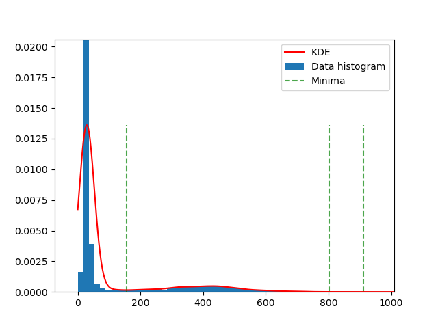

.. include:: <isonum.txt>

.. _examples:

Stereo processing examples
==========================

This chapter showcases a variety of results that are possible when
processing different data sets with the Stereo Pipeline. It is also a
shortened guide that shows the commands used to process specific mission
data. There is no definitive method yet for making elevation models as
each stereo pair is unique. We hope that the following sections serve as
a cookbook for strategies that will get you started in processing your
own data. We recommend that you second check your results against
another source.

.. _stereo_pairs:

Guidelines for selecting stereo pairs
-------------------------------------

When choosing image pairs to process, images that are taken with
similar lighting conditions and significant surface coverage overlap
are best suited for creating terrain models
:cite:`2015LPI462703B`. The images should have sufficient difference
in perspective, hence a reasonably large baseline, or, equivalently, a
non-small convergence angle between the matching rays emanating from
the two cameras, for stereo triangulation to be accurate. Yet, if the
perspectives are very different, it will be challenging to compute the
stereo correlation between images. A convergence angle of 10 to 60
degrees is likely reasonable. 

Depending on the characteristics of the mission data set and the
individual images, the degree of acceptable variation will
differ. Significant differences between image characteristics
increases the likelihood of stereo matching error and artifacts, and
these errors will propagate through to the resulting data products.

The ``parallel_stereo`` and ``bundle_adjust`` programs compute the
convergence angle for input cameras. In stereo that happens at the
preprocessing stage (:numref:`entrypoints`), with the result
printed on the screen and saved to the log file. In ``bundle_adjust``
this computation takes place after the optimization of the cameras
finishes, and the results are saved to a file on disk
(:numref:`ba_out_files`).

Although images do not need to be mapprojected before running the
``parallel_stereo`` program, we recommend that you do run ``cam2map`` (or
``cam2map4stereo.py``) beforehand, especially for image pairs that
contain large topographic variation (and therefore large disparity
differences across the scene, e.g., Valles Marineris). mapprojection is
especially necessary when processing HiRISE images. This removes the
large disparity differences between HiRISE images and leaves only the
small detail for the Stereo Pipeline to compute. Remember that ISIS can
work backwards through a mapprojection when applying the camera model,
so the geometric integrity of your images will not be sacrificed if you
mapproject first.

An alternative way of mapprojection, that applies to non-ISIS images
as well, is with the ``mapproject`` tool (:numref:`mapproj-example`).

Excessively noisy images will not correlate well, so images should be
photometrically calibrated in whatever fashion suits your purposes. If
there are photometric problems with the images, those photometric
defects can be misinterpreted as topography.

Remember, in order for ``parallel_stereo`` to process stereo pairs in
ISIS cube format, the images must have had SPICE data associated by
running ISIS's ``spiceinit`` program run on them first.

Mars Reconnaissance Orbiter HiRISE
----------------------------------

HiRISE is one of the most challenging cameras to use when making 3D
models because HiRISE exposures can be several gigabytes each. Working
with this data requires patience as it will take time.

One important fact to know about HiRISE is that it is composed of
multiple linear CCDs that are arranged side by side with some vertical
offsets. These offsets mean that the CCDs will view some of the same
terrain but at a slightly different time and a slightly different angle.
Mosaicking the CCDs together to a single image is not a simple process
and involves living with some imperfections.

One cannot simply use the HiRISE RDR products, as they do not have the
required geometric stability. Instead, the HiRISE EDR products must be
assembled using ISIS ``noproj``. The USGS distributes a script in use by
the HiRISE team that works forward from the team-produced 'balance'
cubes, which provides a de-jittered, noproj'ed mosaic of a single
observation, which is perfectly suitable for use by the Stereo Pipeline
(this script was originally engineered to provide input for SOCET SET).
However, the 'balance' cubes are not available to the general public,
and so we include a program (``hiedr2mosaic.py``, written in
`Python <http://www.python.org>`__) that will take PDS available HiRISE
EDR products and walk through the processing steps required to provide
good input images for ``parallel_stereo``.

The program takes all the red CCDs and projects them using the ISIS
``noproj`` command into the perspective of the RED5 CCD. From there,
``hijitreg`` is performed to work out the relative offsets between CCDs.
Finally the CCDs are mosaicked together using the average offset listed
from ``hijitreg`` using the ``handmos`` command, and the mosaic is
normalized with ``cubenorm``. Below is an outline of the processing.

::

       hi2isis           # Import HiRISE IMG to Isis
       hical             # Calibrate
       histitch          # Assemble whole-CCD images from the channels
       spiceinit
       spicefit          # For good measure
       noproj            # Project all images into perspective of RED5
       hijitreg          # Work out alignment between CCDs
       handmos           # Mosaic to single file
       cubenorm          # Normalize the mosaic

To use our script, first download a set of HiRISE data. Here is an
example, using wget to fetch all RED CCDs for a dataset and process
them.

::

     wget -r -l1 -np \
       "http://hirise-pds.lpl.arizona.edu/PDS/EDR/ESP/ORB_029400_029499/ESP_029421_2300/" \
       -A "*RED*IMG"

Alternately, you can pass the ``--download-folder`` option to
``hiedr2mosaic.py`` and pass in the URL of the web page containing the
EDR files as the only positional argument. This will cause the tool to
first download all of the RED CCD images to the specified folder and
then continue with processing.

::

     hiedr2mosaic.py --download-folder hirise_example/ \
       http://hirise-pds.lpl.arizona.edu/PDS/EDR/ESP/ORB_029400_029499/ESP_029421_2300/

Assuming you downloaded the files manually, go to the directory
containing the files. You can run the ``hiedr2mosaic.py`` program
without any arguments to view a short help statement, with the ``-h``
option to view a longer help statement, or just run the program on the
EDR files like so::

       hiedr2mosaic.py *.IMG

If you have more than one observation's worth of EDRs in that directory,
then limit the program to just one observation's EDRs at a time, e.g.
``hiedr2mosaic.py PSP_001513_1655*IMG``. If you run into problems, try
using the ``-k`` option to retain all of the intermediary image files to
help track down the issue. The ``hiedr2mosaic.py`` program will create a
single mosaic file with the extension ``.mos_hijitreged.norm.cub``. Be
warned that the operations carried out by ``hiedr2mosaic.py`` can take
many hours to complete on the very large HiRISE images.

If you get any errors, make sure you have ISIS and its data installed,
and the environmental variable ``ISISDATA`` is set (:numref:`isis_start`).

An example of using ASP with HiRISE data is included in the
``examples/HiRISE`` directory (just type 'make' there).

The dataset
~~~~~~~~~~~

HiRISE observations
`PSP_001513_1655 <http://hirise.lpl.arizona.edu/PSP_001513_1655>`_ and
`PSP_001777_1650 <http://hirise.lpl.arizona.edu/PSP_001777_1650>`_ are
on the floor of Gusev Crater and cover the area where the MER Spirit
landed and has roved, including the Columbia Hills.

.. figure:: images/examples/hirise/chills_hirise_combined.png
   :name: hirise_chills_example

   Example output using HiRISE images PSP_001513_1655 and
   PSP_001777_1650 of the Columbia Hills.

Commands
~~~~~~~~

Download all 20 of the RED EDR ``.IMG`` files for each observation.

::

     ISIS> hiedr2mosaic.py PSP_001513_1655_RED*.IMG
     ISIS> hiedr2mosaic.py PSP_001777_1650_RED*.IMG
     ISIS> cam2map4stereo.py PSP_001777_1650_RED.mos_hijitreged.norm.cub \
                             PSP_001513_1655_RED.mos_hijitreged.norm.cub
     ISIS> parallel_stereo PSP_001513_1655.map.cub                       \
                    PSP_001777_1650.map.cub result/output

See :numref:`nextsteps` for a discussion about various speed-vs-quality choices.

The ``corr-kernel`` value can usually be safely reduced to 21 pixels
to resolve finer detail and faster processing for images with good
contrast.

.. _ctx_example:

Mars Reconnaissance Orbiter CTX
-------------------------------

CTX is a moderately difficult camera to work with. The processing time
can be pretty long when using the Bayes EM subpixel refinement
(``subpixel-mode 2``). Otherwise the disparity between images is
relatively small, allowing efficient computation and a reasonable
processing time.

In this example we use mapprojected images, which is the most reliable
way to align the images for correlation.  Mapprojection is discussed
in :numref:`mapproj_with_cam2map` and :numref:`mapproj-example`.  Note
that mapprojection can slow down the triangulation step, but given
that ``parallel_stereo`` performs the triangulation using multiple
processes, that is not a concern.

This example's recipe is is in the ``examples/CTX`` directory shipped
with ASP (type 'make' there to run it).

.. figure:: images/examples/ctx/n_terra_meridiani_ctx_combined.png
   :name: ctx_example_fig

   Example output possible with the CTX imager aboard MRO.

The images are for the North Terra Meridiani region.

Download the CTX images P02_001981_1823_XI_02N356W.IMG and
P03_002258_1817_XI_01N356W.IMG from PDS, at:

    https://ode.rsl.wustl.edu/mars/indexproductsearch.aspx 

The download commands are::

    wget https://pds-imaging.jpl.nasa.gov/data/mro/mars_reconnaissance_orbiter/ctx/mrox_0031/data/P02_001981_1823_XI_02N356W.IMG
    wget https://pds-imaging.jpl.nasa.gov/data/mro/mars_reconnaissance_orbiter/ctx/mrox_0042/data/P03_002258_1817_XI_01N356W.IMG

Convert the .IMG files to ISIS .cub files, initialize the spice information, and calibrate::

    ISIS> mroctx2isis from = P02_001981_1823_XI_02N356W.IMG \
            to = P02_001981_1823.cub
    ISIS> mroctx2isis from = P03_002258_1817_XI_01N356W.IMG \
            to = P03_002258_1817.cub
    ISIS> spiceinit from = P02_001981_1823.cub
    ISIS> spiceinit from = P03_002258_1817.cub
    ISIS> ctxcal from = P02_001981_1823.cub to = P02_001981_1823.cal.cub
    ISIS> ctxcal from = P03_002258_1817.cub to = P03_002258_1817.cal.cub

(Here one can optionally run ``ctxevenodd`` on the ``cal.cub`` files, if needed.)

Run stereo::

    ISIS> cam2map4stereo.py P02_001981_1823.cal.cub P03_002258_1817.cal.cub
    ISIS> parallel_stereo P02_001981_1823.map.cub P03_002258_1817.map.cub \
            results/out

See :numref:`nextsteps` about the next steps, including a discussion
about various speed-vs-quality choices in stereo.

Automated Processing of HiRISE and CTX
--------------------------------------

While he was at the University of Chicago, David Mayer developed a set of
scripts for automating Stereo Pipeline for CTX and HiRISE images.  Those
scripts and more information can now be found at 
https://github.com/USGS-Astrogeology/asp_scripts.

Mars Global Surveyor MOC-NA
---------------------------

In the Stereo Pipeline Tutorial in :numref:`moc_tutorial`, we showed
you how to process a narrow angle MOC stereo pair that covered a
portion of Hrad Vallis. In this section we will show you more
examples, some of which exhibit a problem common to stereo pairs from
linescan imagers: ``spacecraft jitter`` is caused by oscillations of
the spacecraft due to the movement of other spacecraft hardware. All
spacecraft wobble around to some degree but some are particularly
susceptible.

Jitter causes wave-like distortions along the track of the satellite
orbit in DEMs produced from linescan camera images. This effect can be
very subtle or quite pronounced, so it is important to check your data
products carefully for any sign of this type of artifact. The following
examples will show the typical distortions created by this problem.

Note that the science teams of HiRISE and LROC are actively working on
detecting and correctly modeling jitter in their respective SPICE data.
If they succeed in this, the distortions will still be present in the
raw images, but the jitter will no longer produce ripple artifacts in
the DEMs produced using ours or other stereo reconstruction software.

Ceraunius Tholus
~~~~~~~~~~~~~~~~

Ceraunius Tholus is a volcano in northern Tharsis on Mars. It can be
found at 23.96 N and 262.60 E. This DEM crosses the volcano's caldera.

.. figure:: images/examples/mocna/ceraunius_tholus_mocna_ge_combined.png
   :name: mocna_ceraunius_example

   Example output for MOC-NA of Ceraunius Tholus. Notice the presence
   of severe washboarding artifacts due to spacecraft jitter.

.. _commands-2:

Commands
^^^^^^^^

Download the M08/06047 and R07/01361 images from the PDS.

::

     ISIS> moc2isis f=M0806047.img t=M0806047.cub
     ISIS> moc2isis f=R0701361.img t=R0701361.cub
     ISIS> spiceinit from=M0806047.cub
     ISIS> spiceinit from=R0701361.cub
     ISIS> cam2map4stereo.py M0806047.cub R0701361.cub
     ISIS> parallel_stereo M0806047.map.cub R0701361.map.cub result/output

See :numref:`nextsteps` for a discussion about various speed-vs-quality choices.

.. _mer-example:

Mars Exploration Rovers
-----------------------

The Mars Exploration Rovers (MER) have several cameras on board and they
all seem to have a stereo pair. With ASP you are able to process the
PANCAM, NAVCAM, and HAZCAM camera images. ISIS has no telemetry or
camera intrinsic supports for these images. That however is not a
problem as their raw images contain the cameras information in JPL's
CAHV, CAHVOR, and CHAVORE formats.

These cameras are all variations of a simple pinhole camera model so
they are processed with ASP in the ``Pinhole`` session instead of the
usual ``ISIS``. ASP only supports creating of point clouds. *The
\*-PC.tif is a raw point cloud with the first 3 channels being XYZ in
the rover site's coordinate frame*. We don't support the creation of
DEMs from these images and that is left as an exercise for the user.

An example of using ASP with MER data is included in the
``examples/MER`` directory (just type 'make' there).

PANCAM, NAVCAM, HAZCAM
~~~~~~~~~~~~~~~~~~~~~~

All of these cameras are processed the same way. We'll be showing 3D
processing of the front hazard cams. The only new things in the pipeline
is the new executable ``mer2camera`` along with the use of
``alignment-method epipolar``. This example is also provided in the MER
data example directory.

.. figure:: images/examples/mer/fh01_combined.png

   Example output possible with the front hazard cameras.

.. _commands-3:

Commands
^^^^^^^^

Download 2f194370083effap00p1214l0m1.img and
2f194370083effap00p1214r0m1.img from the PDS.

::

     ISIS> mer2camera 2f194370083effap00p1214l0m1.img
     ISIS> mer2camera 2f194370083effap00p1214r0m1.img
     ISIS> parallel_stereo 2f194370083effap00p1214l0m1.img     \
                           2f194370083effap00p1214r0m1.img     \
                           2f194370083effap00p1214l0m1.cahvore \
                           2f194370083effap00p1214r0m1.cahvore \
                    fh01/fh01

See :numref:`nextsteps` for a discussion about various speed-vs-quality choices.

It is suggested to filter out points that are not triangulated well
because they are too close to robot's camera or are extremely far
away, using the ``parallel_stereo`` options::

    --universe-center camera --near-universe-radius 0.7 \
       --far-universe-radius 80.0

These are suggested as well::

    --alignment-method epipolar --force-use-entire-range

.. _k10example:

K10
---

K10 is an Earth-based research rover within the Intelligent Robotics
Group at NASA Ames, the group ASP developers belong to. The cameras on
this rover use a simple Pinhole model. The use of ASP with these cameras
is illustrated in the ``examples/K10`` directory (just type 'make'
there). Just as for the MER datatset (:numref:`mer-example`),
only the creation of a point cloud is supported.

.. _lronac-example:

Lunar Reconnaissance Orbiter (LRO) NAC
--------------------------------------

This section will describe in detail how to process an LRO NAC dataset.
(See also :numref:`lronac_csm` for a ready-made example using a different
dataset for which all inputs have already been prepared.)

The site
~~~~~~~~

In this example we will consider a stereo pair that covers the
Taurus-Littrow valley on the Moon where, on December 11, 1972, the
astronauts of Apollo 17 landed. However, this stereo pair does not
contain the landing site. It is slightly west; focusing on the
Lee-Lincoln scarp that is on North Massif. The scarp is an 80 m high
feature that is the only visible sign of a deep fault.

.. figure:: images/examples/lrocna/lroc-na-example2_combined.png

   Example output possible with a LROC NA stereo pair, using both
   CCDs from each observation, courtesy of the lronac2mosaic.py tool.

LRO NAC camera design
~~~~~~~~~~~~~~~~~~~~~

LRO has two Narrow Angle Cameras (NAC), with both acquiring image data
at the same time, so each observation consists
of two images, left and right, denoted with ``L`` and ``R``.
These are not meant to be used as a stereo pair, as the camera
center is virtually in the same place for both, and they have very little
overlap. For stereo one needs two such observations, with a
reasonable perspective difference (baseline) among the two.
 
Then stereo can happen by pairing an L or R image from the first
observation with an L or R image from the second. Alternatively, each
observation's L and R images can be stitched first, then stereo happens
between the two stitched images. Both of these approaches will be
discussed below.

Download
~~~~~~~~

Download the experimental data records (EDR) for observations
M104318871 and M104311715 from http://wms.lroc.asu.edu/lroc/search.
Alternatively, search by original IDs of 2DB8 and 4C86 in the
PDS. 

The download will result in four files, named M104318871LE.img,
M104318871RE.img, M104311715LE.img, and M104311715RE.img.

.. _lro_nac_no_stitch:

Preparing the inputs without stitching
~~~~~~~~~~~~~~~~~~~~~~~~~~~~~~~~~~~~~~

The individual ``L`` and ``R`` images in an LRO NAC observation can be
used without stitching if desired to keep the original camera models.
Unstitched cameras can also be converted to CSM (:numref:`csm`), which
will provide a great speed up for stereo, bundle adjustment, and
Shape-from-Shading (:numref:`sfs_usage`).

We convert each .img file to an ISIS .cub camera image, initialize the
SPICE kernels, and perform radiometric calibration and echo
correction. Here are the steps, illustrated on one image::

    f=M104318871LE
    lronac2isis from = ${f}.IMG     to = ${f}.cub
    spiceinit   from = ${f}.cub shape = ellipsoid
    lronaccal   from = ${f}.cub     to = ${f}.cal.cub
    lronacecho  from = ${f}.cal.cub to = ${f}.cal.echo.cub

Note that for these commands to succeed ISIS and its supporting data
must be downloaded, per :numref:`planetary_images`.

Stitching the LE and RE observations
~~~~~~~~~~~~~~~~~~~~~~~~~~~~~~~~~~~~

In this case all ISIS preprocessing of the EDRs is performed via the
``lronac2mosaic.py`` command (:numref:`lronac2mosaic`)::

    lronac2mosaic.py M104318871LE.img M104318871RE.img
    lronac2mosaic.py M104311715LE.img M104311715RE.img

This runs ``lronac2isis``, ``lronaccal``, ``lronacecho``,
``spiceinit``, ``noproj``, and ``handmos`` to create a stitched
unprojected image for each observation. In this example we don't
mapproject the images as ASP can usually get good results. More
aggressive terrain might require an additional ``cam2map4stereo.py``
step.

.. _commands-4:

Running stereo
~~~~~~~~~~~~~~

Stereo can then be run either with unstitched or stitched .cub files.
Here's an example::

    parallel_stereo M104318871LE*.mosaic.norm.cub  \
      M104311715LE*.mosaic.norm.cub result/output  \
      --alignment-method affineepipolar

See :numref:`nextsteps` for a discussion about various stereo
speed-vs-quality choices. Consider using mapprojection
(:numref:`mapproj-example`).

Mapprojection can also be done with the ISIS tools
(:numref:`mapproj_with_cam2map`). Better mapprojection results can be
achieved by projecting on a higher resolution elevation source like
the WAC DTM. This is achieved using the ISIS command ``demprep`` and
attaching to cube files via the ``spiceinit`` SHAPE and MODEL options.

Lunar Reconnaissance Orbiter (LRO) WAC
--------------------------------------

This example, including the inputs, recipe, and produced terrain model
can be downloaded from:

    https://github.com/NeoGeographyToolkit/StereoPipelineSolvedExamples/releases/tag/LROWAC

Fetching the data
~~~~~~~~~~~~~~~~~

We will focus on the monochromatic images for this sensor. Visit:

   https://ode.rsl.wustl.edu/moon/indexproductsearch.aspx

Find the *Lunar Reconnaissance Orbiter -> Experiment Data Record Wide
Angle Camera - Mono (EDRWAM)* option.

Search either based on a longitude-latitude window, or near a notable
feature, such as a named crater.  We choose a couple of images having
the Tycho crater, with download links::

    http://pds.lroc.asu.edu/data/LRO-L-LROC-2-EDR-V1.0/LROLRC_0002/DATA/MAP/2010035/WAC/M119923055ME.IMG
    http://pds.lroc.asu.edu/data/LRO-L-LROC-2-EDR-V1.0/LROLRC_0002/DATA/MAP/2010035/WAC/M119929852ME.IMG

Get these with ``wget``.

Creation of .cub files
~~~~~~~~~~~~~~~~~~~~~~

We broadly follow the tutorial at :cite:`ohman2015procedure`. For a
dataset called ``image.IMG``, do::

    lrowac2isis from = image.IMG to = image.cub

This will create so-called *even* and *odd* datasets, with names like
``image.vis.even.cub`` and ``image.vis.odd.cub``.

Run ``spiceinit`` on them to set up the SPICE kernels::

    spiceinit from = image.vis.even.cub
    spiceinit from = image.vis.odd.cub

followed by ``lrowaccal`` to adjust the image intensity::

    lrowaccal from = image.vis.even.cub to = image.vis.even.cal.cub
    lrowaccal from = image.vis.odd.cub  to = image.vis.odd.cal.cub

All these .cub files can be visualized with ``stereo_gui``. It can be
seen that instead of a single contiguous image we have a set of narrow
horizontal framelets, with some of these in the even and some in the odd
cub file. The framelets may also be recorded in reverse.

Production of seamless mapprojected images
~~~~~~~~~~~~~~~~~~~~~~~~~~~~~~~~~~~~~~~~~~

This is not needed for stereo, but may be useful for readers who would
like to produce image mosaics using ``cam2map``.

::

    cam2map from = image.vis.even.cal.cub to = image.vis.even.cal.map.cub
    cam2map from = image.vis.odd.cal.cub  to = image.vis.odd.cal.map.cub  \
      map = image.vis.even.cal.map.cub matchmap = true

Note how in the second ``cam2map`` call we used the ``map`` and
``matchmap`` arguments. This is to ensure that both of these output
images have the same resolution and projection. In particular, if more
datasets are present, it is suggested for all of them to use the same
previously created .cub file as a map reference.  That because stereo
works a lot better on mapprojected images with the same ground
resolution. For more details see :numref:`mapproj-example` and
:numref:`mapproj_with_cam2map`.

To verify that the obtained images have the same ground resolution, do::

    gdalinfo image.vis.even.cal.map.cub | grep -i "pixel size"
    gdalinfo image.vis.odd.cal.map.cub  | grep -i "pixel size"

(see :numref:`gdal_tools` regarding this tool).

The fusion happens as::

    ls image.vis.even.cal.map.cub image.vis.odd.cal.map.cub  > image.txt
    noseam fromlist = image.txt to = image.noseam.cub SAMPLES=73 LINES=73

The obtained file ``image.noseam.cub`` may still have some small artifacts
but should be overall reasonably good. 

Stitching the raw even and odd images
~~~~~~~~~~~~~~~~~~~~~~~~~~~~~~~~~~~~~

This requires ISIS newer than version 6.0, or the latest development code.

For each image in the stereo pair, stitch the even and odd datasets::

    framestitch even = image.vis.even.cal.cub odd = image.vis.odd.cal.cub \
      to = image.cub flip = true num_lines_overlap = 2

The ``flip`` flag is needed if the order of framelets is reversed
relative to what the image is expected to show.

The parameter ``num_lines_overlap`` is used to remove a total of this
many lines from each framelet (half at the top and half at the bottom)
before stitching, in order to deal with the fact that the even and odd
framelets have a little overlap, and that they also tend to have artifacts
due to some pixels flagged as invalid in each first and last framelet
row.

The CSM camera models will assume that this parameter is set at 2, so
it should not be modified. Note however that WAC framelets may overlap
by a little more than that, so resulting DEMs may have some artifacts
at framelet borders, as can be seen further down.

Creation of CSM camera models
~~~~~~~~~~~~~~~~~~~~~~~~~~~~~

This process is still being ironed out. Generally speaking, for the
time being one should fetch the latest ALE and its conda environemnt
from GitHub, at:

    https://github.com/USGS-Astrogeology/ale

then create a script named ``gen_json.py``::

    #!/usr/bin/python

    import os, sys
    import json
    import ale

    prefix = sys.argv[1]

    if prefix.endswith(".cub") or prefix.lower().endswith(".img") \
      or prefix.endswith(".lbl"):
      prefix = os.path.splitext(prefix)[0]

    cub_file = prefix + '.cub'

    print("Loading cub file: " + cub_file)

    kernels = ale.util.generate_kernels_from_cube(cub_file, expand = True)

    usgscsm_str = ale.loads(cub_file, formatter = "ale", \
                        props={"kernels": kernels},
                        verbose = True)

    csm_isd = prefix + '.json'
    print("Saving: " + csm_isd)
    with open(csm_isd, 'w') as isd_file:
      isd_file.write(usgscsm_str)
  
and invoke it with either the ``even`` or ``odd`` .cub file as an argument.
Do not use the stitched .cub file as that one lacks camera information.
The obtained .json files can be renamed to follow the same
convention as the stitched .cub images.

At some point when a new version of ISIS is released (version > 6),
it may have a tool for creation of CSM camera models.

Running stereo
~~~~~~~~~~~~~~

::

    parallel_stereo --stereo-algorithm asp_mgm   \
      --left-image-crop-win 341 179 727 781      \
      --right-image-crop-win 320 383 824 850     \
      M119923055ME.cub M119929852ME.cub          \
      M119923055ME.json M119929852ME.json        \
      run/run

    point2dem run/run-PC.tif --orthoimage run/run-L.tif 
    hillshade run/run-DEM.tif 
    colormap run/run-DEM.tif -s run/run-DEM_HILLSHADE.tif 

As printed by ``stereo_pprc``, the convergence angle is about 27
degrees, which is a good number.

See :numref:`nextsteps` for a discussion about various stereo
speed-vs-quality choices.

.. figure:: images/CSM_WAC.png
   :name: CSM_WAC_example

   The produced colorized DEM and orthoimage for the CSM WAC camera
   example. The artifacts are due to issues stitching of even and odd
   framelets.

It can be seen that the stereo DEM has some linear artifacts. That is
due to the fact that the stitching does not perfectly integrate the
framelets.

An improved solution can be obtained by creating a low-resolution
version of the above DEM, mapprojecting the images on it, and then
re-running stereo, per (:numref:`mapproj-example`).

::

    point2dem --tr 0.03 run/run-PC.tif --search-radius-factor 5 -o \
      run/run-low-res
    mapproject --tr 0.0025638 run/run-low-res-DEM.tif              \
      M119923055ME.cub M119923055ME.json M119923055ME.map.tif 
    mapproject --tr 0.0025638 run/run-low-res-DEM.tif              \
      M119929852ME.cub M119929852ME.json M119929852ME.map.tif    
    parallel_stereo --stereo-algorithm asp_mgm                     \
      M119923055ME.map.tif M119929852ME.map.tif                    \
      M119923055ME.json M119929852ME.json                          \
      run_map/run run/run-low-res-DEM.tif    
    point2dem run_map/run-PC.tif --orthoimage run_map/run-L.tif 
    hillshade run_map/run-DEM.tif 
    colormap run_map/run-DEM.tif -s run_map/run-DEM_HILLSHADE.tif 

To create the low-resolution DEM we used a grid size which is about 10
times coarser than the one for the DEM created earlier. Note that the
same resolution is used when mapprojecting both images; that is very
important to avoid a large search range in stereo later. This is discussed
in more detail in :numref:`mapproj-example`.

.. figure:: images/CSM_WAC_mapproj.png
   :name: CSM_WAC_example_mapproj

   The produced colorized DEM and orthoimage for the CSM WAC camera
   example, when mapprojected images are used.

As can be seen in the second figure, there are somewhat fewer artifacts.
The missing lines in the DEM could be filled in if ``point2dem`` was run
with ``--search-radius-factor 4``, for example. 

Given that there exists a wealth of WAC images, one could also try to
get several more stereo pairs with similar illumination, run bundle
adjustment for all of them (:numref:`bundle_adjust`), run pairwise
stereo, create DEMs (at the same resolution), and then merge them with
``dem_mosaic`` (:numref:`dem_mosaic`). This may further attenuate the
artifacts as each stereo pair will have them at different
locations. See :numref:`stereo_pairs` for guidelines about how to
choose good stereo pairs.

Apollo 15 Metric Camera images
------------------------------

Apollo Metric images were all taken at regular intervals, which means
that the same ``stereo.default`` can be used for all sequential pairs of
images. Apollo Metric images are ideal for stereo processing. They
produce consistent, excellent results.

The scans performed by ASU are sufficiently detailed to exhibit film
grain at the highest resolution. The amount of noise at the full
resolution is not helpful for the correlator, so we recommend
subsampling the images by a factor of 4.

Currently the tools to ingest Apollo TIFFs into ISIS are not available,
but these images should soon be released into the PDS for general public
usage.

Ansgarius C
~~~~~~~~~~~

Ansgarius C is a small crater on the west edge of the far side of the
Moon near the equator. It is east of Kapteyn A and B.

.. figure:: images/examples/metric/metric_ge_example_combined.png
   :name: metric_example

   Example output possible with Apollo Metric frames AS15-M-2380 and AS15-M-2381.

.. _commands-5:

Commands
^^^^^^^^

Process Apollo TIFF files into ISIS.

::

     ISIS> reduce from=AS15-M-2380.cub to=sub4-AS15-M-2380.cub \
             sscale=4 lscale=4
     ISIS> reduce from=AS15-M-2381.cub to=sub4-AS15-M-2381.cub \
             sscale=4 lscale=4
     ISIS> spiceinit from=sub4-AS15-M-2380.cub
     ISIS> spiceinit from=sub4-AS15-M-2381.cub
     ISIS> parallel_stereo sub4-AS15-M-2380.cub sub4-AS15-M-2381.cub \
             result/output

See :numref:`nextsteps` for a discussion about various speed-vs-quality choices.

Mars Express High Resolution Stereo Camera (HRSC)
-------------------------------------------------

The HRSC camera on the Mars Express satellite is a complicated system,
consisting of multiple channels pointed in different directions plus
another super resolution channel. The best option to create DEMs is to
use the two dedicated stereo channels. These are pointed ahead of and
behind the nadir channel and collect a stereo observation in a single
pass of the satellite. Data can be downloaded from the Planetary Data
System (PDS)
http://pds-geosciences.wustl.edu/missions/mars_express/hrsc.htm or you
can use the online graphical tool located at
http://hrscview.fu-berlin.de/cgi-bin/ion-p?page=entry2.ion. Since each
observation contains both stereo channels, one observation is sufficient
to create a DEM.

HRSC data is organized into categories. Level 2 is radiometrically
corrected, level 3 is corrected and map projected onto MOLA, and level 4
is corrected and map projected on to a DEM created from the HRSC data.
You should use the level 2 data for creating DEMs with ASP. If you would
like to download one of the already created DEMs, it may be easiest to
use the areoid referenced version (.da4 extension) since that is
consistent with MOLA.

What follows is an example for how to process HRSC data. One starts by
fetching the two stereo channels from::

   http://pds-geosciences.wustl.edu/mex/mex-m-hrsc-3-rdr-v3/mexhrs_1001/data/1995/h1995_0000_s12.img
   http://pds-geosciences.wustl.edu/mex/mex-m-hrsc-3-rdr-v3/mexhrs_1001/data/1995/h1995_0000_s22.img

.. figure:: images/examples/hrsc/hrsc_example.png
   :name: hrsc_example

   Sample outputs from a cropped region of HRSC frame 1995.  Left: Cropped input.
   Center: Block matching with subpixel mode 3.  Right: MGM algorithm with cost
   mode 3.

.. _commands-6:

Commands
~~~~~~~~

You may need to download the HRSC kernel files in case using
``web=true`` with ``spiceinit`` does not work. You will also probably
need to include the ``ckpredicted=true`` flag with ``spiceinit``. HRSC
images are large and may have compression artifacts so you should
experiment on a small region to make sure your stereo parameters are
working well. For this frame, the MGM stereo algorithm performed better
than block matching with subpixel mode 3.

::

     ISIS> hrsc2isis from=h1995_0000_s12.img to=h1995_0000_s12.cub
     ISIS> hrsc2isis from=h1995_0000_s22.img to=h1995_0000_s22.cub
     ISIS> spiceinit from=h1995_0000_s12.cub ckpredicted=true
     ISIS> spiceinit from=h1995_0000_s22.cub ckpredicted=true
     ISIS> parallel_stereo h1995_0000_s12.cub  h1995_0000_s22.cub \
              --stereo-algorithm 2 --cost-mode 3 mgm/out

Cassini ISS NAC
---------------

This is a proof of concept showing the strength of building the Stereo
Pipeline on top of ISIS. Support for processing ISS NAC stereo pairs was
not a goal during our design of the software, but the fact that a camera
model exists in ISIS means that it too can be processed by the Stereo
Pipeline.

Identifying stereo pairs from spacecraft that do not orbit their target
is a challenge. We have found that one usually has to settle with images
that are not ideal: different lighting, little perspective change, and
little or no stereo parallax. So far we have had little success with
Cassini's data, but nonetheless we provide this example as a potential
starting point.

Rhea
~~~~

Rhea is the second largest moon of Saturn and is roughly a third the
size of our own Moon. This example shows, at the top right of both
images, a giant impact basin named Tirawa that is 220 miles across. The
bright white area south of Tirawa is ejecta from a new crater. The lack
of texture in this area poses a challenge for our correlator. The
results are just barely useful: the Tirawa impact can barely be made out
in the 3D data while the new crater and ejecta become only noise.

.. figure:: images/examples/cassini/cassini_rhea_quad.png
   :name: cassini-example

   Example output of what is possible with Cassini's ISS NAC.  Upper left:
   original left image.  Upper right: original right image.  Lower left: 
   mapprojected left image.  Lower right: 3D Rendering of the point cloud.

.. _commands-7:

Commands
^^^^^^^^

Download the N1511700120_1.IMG and W1567133629_1.IMG images and their
label (.LBL) files from the PDS.

::

     ISIS> ciss2isis f=N1511700120_1.LBL t=N1511700120_1.cub
     ISIS> ciss2isis f=W1567133629_1.LBL t=W1567133629_1.cub
     ISIS> cisscal from=N1511700120_1.cub to=N1511700120_1.lev1.cub
     ISIS> cisscal from=W1567133629_1.cub to=W1567133629_1.lev1.cub
     ISIS> fillgap from=W1567133629_1.lev1.cub to=W1567133629_1.fill.cub

(Note the optional ``fillgap`` command above.)
                                                                        
::

     ISIS> cubenorm from=N1511700120_1.lev1.cub to=N1511700120_1.norm.cub
     ISIS> cubenorm from=W1567133629_1.fill.cub to=W1567133629_1.norm.cub
     ISIS> spiceinit from=N1511700120_1.norm.cub
     ISIS> spiceinit from=W1567133629_1.norm.cub
     ISIS> cam2map from=N1511700120_1.norm.cub to=N1511700120_1.map.cub
     ISIS> cam2map from=W1567133629_1.norm.cub map=N1511700120_1.map.cub \
     ISIS>   to=W1567133629_1.map.cub matchmap=true
     ISIS> parallel_stereo N1511700120_1.map.equ.cub                     \
             W1567133629_1.map.equ.cub result/rhea

See :numref:`nextsteps` for a discussion about various speed-vs-quality choices.
Also consider the following modifications to ``stereo.default``::

       ### PREPROCESSING
       alignment-method none
       force-use-entire-range
       individually-normalize

       ### CORRELATION
       prefilter-mode 2
       prefilter-kernel-width 1.5

       cost-mode 2

       corr-kernel 25 25
       corr-search -55 -2 -5 10

       subpixel-mode 3
       subpixel-kernel 21 21

       ### FILTERING
       rm-half-kernel 5 5
       rm-min-matches 60 # Units = percent
       rm-threshold 3
       rm-cleanup-passes 1

.. _csm:

Community Sensor Model (CSM)
----------------------------

The Community Sensor Model (CSM), established by the U.S. defense
and intelligence community, has the goal of standardizing camera
models for various remote sensor types :cite:`CSMTRD`. It provides
a well-defined application program interface (API) for multiple
types of sensors and has been widely adopted by Earth remote sensing
software systems :cite:`hare2017community,2019EA000713`.

ASP supports and ships the USGS implementation of CSM for planetary images
(https://github.com/USGS-Astrogeology/usgscsm), which provides
Linescan, Frame, and  Synthetic Aperture Radar (SAR) implementations.

CSM is handled via dynamically loaded plugins. Hence, if a user has a
new sensor model, ASP should, in principle, be able to use it as soon
as a supporting plugin is added to the existing software, without
having to rebuild ASP or modify it otherwise. In practice, while this
logic is implemented, ASP defaults to using only the USGS
implementation, though only minor changes are needed to support
additional plugins.

Each stereo pair to be processed by ASP should be made up of two
images (for example ``.cub`` or ``.tif`` files) and two plain
text camera files with ``.json`` extension. The CSM information is
contained in the ``.json`` files and it determines which plugin to
load to use with those cameras.  More details are available at the
USGS CSM repository mentioned earlier.

.. _csm_frame:

Example using the USGS CSM Frame sensor
~~~~~~~~~~~~~~~~~~~~~~~~~~~~~~~~~~~~~~~

The USGS CSM *Frame* sensor models a frame camera. All the
pixels get acquired at the same time, unlike for pushbroom and
pushframe cameras, which keep on acquiring image lines as they fly
(those are considered later in the text). Hence, a single camera
center and orientation is present. This model serves the same function
as ASP's own Pinhole camera model (:numref:`pinholemodels`).

In this example we will consider images acquired with the Dawn
Framing Camera instrument, which took pictures of the Ceres and Vesta
asteroids. This particular example will be for Vesta. Note that one
more example of this sensor is shown in this documentation, in
:numref:`dawn_isis`, which uses ISIS ``.cub`` camera models rather
than CSM ones.

This example can be downloaded from:

  https://github.com/NeoGeographyToolkit/StereoPipelineSolvedExamples

Creating the input images
^^^^^^^^^^^^^^^^^^^^^^^^^

Fetch the data from PDS then extract it::

    wget https://sbib.psi.edu/data/PDS-Vesta/Survey/img-1B/FC21B0004011_11224024300F1E.IMG.gz
    wget https://sbib.psi.edu/data/PDS-Vesta/Survey/img-1B/FC21B0004012_11224030401F1E.IMG.gz
      
    gunzip FC21B0004011_11224024300F1E.IMG.gz 
    gunzip FC21B0004012_11224030401F1E.IMG.gz

For simplicity of notation, we will rename these to ``left.IMG`` and ``right.IMG``.

Set up the ISIS environment. These will need adjusting for your system::

    export ISISROOT=$HOME/miniconda3/envs/isis6
    export PATH=$ISISROOT/bin:$PATH
    export ISISDATA=$HOME/isisdata

Create cub files and initialize the kernels::

    dawnfc2isis from = left.IMG  to = left.cub  target = VESTA
    dawnfc2isis from = right.IMG to = right.cub target = VESTA

    spiceinit from = left.cub  shape = ellipsoid
    spiceinit from = right.cub shape = ellipsoid

The ``target`` field is likely no longer needed in newer versions of
ISIS.

.. _create_csm_dawn:

Creation of CSM camera files
^^^^^^^^^^^^^^^^^^^^^^^^^^^^

Some care is needed here, as the recipe provided below has some subtle
differences with the ones used later for linescan and SAR camera
models (:numref:`create_csm_linescan` and :numref:`create_csm_sar`).

Create a conda environment for the ``ale`` package::

    conda create -c conda-forge -n ale_env python=3.6 ale  
    conda activate ale_env

(other versions of Python may result in a runtime error later). 

Create a Python script named ``gen_csm.py``::

    #!/usr/bin/python
    
    import os, sys
    import json
    import ale
    
    prefix = sys.argv[1]
    
    if prefix.lower().endswith(".cub") or prefix.lower().endswith(".img") \
        or prefix.lower().endswith(".lbl"):
        # Wipe extension
        prefix = os.path.splitext(prefix)[0]
    
    print("Prefix is: " + prefix)
    
    cub_file = prefix + '.cub'
    img_file = prefix + '.IMG'
    
    kernels = ale.util.generate_kernels_from_cube(cub_file, expand = True)
    
    usgscsm_str = ale.loads(img_file, props={'kernels': kernels},
                            formatter='ale', verbose = False)
    
    csm_isd = prefix + '.json'
    print("Writing: " + csm_isd)
    with open(csm_isd, 'w') as isd_file:
        isd_file.write(usgscsm_str)

Assuming that conda installed this environment in the default location,
run::

    $HOME/miniconda3/envs/ale_env/bin/python gen_csm.py left.IMG
    $HOME/miniconda3/envs/ale_env/bin/python gen_csm.py right.IMG

This will create ``left.json`` and ``right.json``.

As a sanity check, run ``cam_test`` to see how well the CSM camera
approximates the ISIS camera::

    cam_test --image left.cub  --cam1 left.cub  --cam2 left.json
    cam_test --image right.cub --cam1 right.cub --cam2 right.json

Note that for a handful of pixels these errors may be big. That is a
known issue, and it seems to be due to the fact that a ray traced from
the camera center towards the ground may miss the body of the asteroid.
That should not result in inaccurate stereo results.

Running stereo
^^^^^^^^^^^^^^

::

    parallel_stereo --stereo-algorithm asp_mgm \
      --left-image-crop-win 243 161 707 825    \
      --right-image-crop-win 314 109 663 869   \
      left.cub right.cub left.json right.json  \
      run/run

    point2dem run/run-PC.tif --orthoimage run/run-L.tif 
    hillshade run/run-DEM.tif 
    colormap run/run-DEM.tif -s run/run-DEM_HILLSHADE.tif 

See :numref:`nextsteps` for a discussion about various
speed-vs-quality choices when running stereo.

.. figure:: images/CSM_Frame.png
   :name: CSM_Frame_example

   The produced colorized DEM and orthoimage for the CSM Frame camera
   example. Likely using mapprojection (:numref:`mapproj-example`)
   may have reduced the number and size of the holes in the DEM.

Example using the USGS CSM linescan sensor
~~~~~~~~~~~~~~~~~~~~~~~~~~~~~~~~~~~~~~~~~~

Here we use CSM for Mars images, specifically for the CTX camera,
which is a linescan sensor. The images are regular ``.cub`` files as
in the tutorial in :numref:`moc_tutorial`, hence the only distinction
compared to that example is that the cameras are stored as ``.json``
files.

We will work with the dataset pair::

     J03_045994_1986_XN_18N282W.cub J03_046060_1986_XN_18N282W.cub

which, for simplicity, we will rename to ``left.cub`` and ``right.cub``
and the same for the associated camera files.

.. _create_csm_linescan:

Creating CSM cameras from ISIS .cub files
^^^^^^^^^^^^^^^^^^^^^^^^^^^^^^^^^^^^^^^^^

Note that this recipe looks a little different for Frame and SAR cameras,
as can be seen in :numref:`create_csm_dawn` and :numref:`create_csm_sar`.

Run the ISIS ``spiceinit`` command on the .cub files as::

    spiceinit from = left.cub  shape = ellipsoid
    spiceinit from = right.cub shape = ellipsoid

Create a conda environment for the ``ale`` package::

    conda create -c conda-forge -n ale_env python=3.6 ale  
    conda activate ale_env

(other versions of Python may result in a runtime error later). 

Create a Python script named ``gen_csm.py``::

    #!/usr/bin/python
    
    import ale, os, sys
    
    # Get the input cub
    cub_file = sys.argv[1]
    
    # Form the output cub
    isd_file = os.path.splitext(cub_file)[0] + '.json'
    
    print("Reading: " + cub_file)
    usgscsm_str = ale.loads(cub_file)
    
    print("Writing: " + isd_file)
    with open(isd_file, 'w') as isd_file:
        isd_file.write(usgscsm_str)

Assuming that conda installed this environment in the default location,
run::

    $HOME/miniconda3/envs/ale_env/bin/python gen_csm.py camera.cub

This will produce ``left.json`` and ``right.json``.

Running stereo
^^^^^^^^^^^^^^

::

     parallel_stereo left.cub right.cub left.json right.json run/run    
     point2dem -r mars --stereographic --proj-lon 77.4 \
       --proj-lat 18.4 run/run-PC.tif

See :numref:`nextsteps` for a discussion about various stereo
algorithms and speed-vs-quality choices.

The actual stereo session used is ``csm``, and here it will be
auto-detected based on the extension of the camera files. For
``point2dem`` we chose to use a stereographic projection centered at
some point in the area of interest. The fancier MGM algorithm could be
used by running this example with ``--stereo-algorithm asp_mgm``.

One can also run ``parallel_stereo`` with mapprojected images
(:numref:`mapproj-example`). The first step would be to create a
low-resolution smooth DEM from the previous cloud::

     point2dem  -r mars --stereographic --proj-lon 77.4 \
       --proj-lat 18.4 run/run-PC.tif --tr 120          \
       -o run/run-smooth

followed by mapprojecting onto it and redoing stereo::

     mapproject --tr 6 run/run-smooth-DEM.tif left.cub left.json     \
       left.map.tif
     mapproject --tr 6 run/run-smooth-DEM.tif right.cub right.json   \
       right.map.tif
     parallel_stereo left.map.tif right.map.tif left.json right.json \
       run_map/run run/run-smooth-DEM.tif

Notice how we used the same resolution for both images when
mapprojecting. That helps making the resulting images more similar and
reduces the processing time (:numref:`mapproj-res`).

.. _csm_minirf:

The USGS CSM SAR sensor for LRO Mini-RF 
~~~~~~~~~~~~~~~~~~~~~~~~~~~~~~~~~~~~~~~

*Mini-RF* was a Synthetic Aperture Radar (SAR) sensor on the LRO
spacecraft. It is challenging to process its data with ASP for several
reasons:

 - The synthetic image formation model produces curved rays going from the
   ground to the pixel in the camera (:cite:`kirk2016semi`). To simplify the
   calculations, ASP finds where a ray emanating from the camera
   intersects the standard Moon ellipsoid with radius 1737.4 km and
   declares the ray to be a straight line from the camera center to this
   point.

 - This sensor very rarely acquires stereo pairs. The convergence angle
   (:numref:`stereo_pairs`) as printed by ``parallel_stereo`` in
   pre-processing is usually less than 5 degrees, which is little and
   results in noisy DEMs. In this example we will use a dataset
   intentionally created with stereo in mind. The images will cover a
   part of Jackson crater (:cite:`kirk2011radargrammetric`).

 - It is not clear if all modeling issues with this sensor were
   resolved. The above publication states that "Comparison of the stereo
   DTM with ~250 m/post LOLA grid data revealed (in addition to
   dramatically greater detail) a very smooth discrepancy that varied
   almost quadratically with latitude and had a peak-to-peak amplitude
   of nearly 4000 m."
  
 - The images are dark and have unusual appearance, which requires
   some pre-processing and a large amount of interest points. 

Hence, ASP's support for this sensor is experimental. The results
are plausible but likely not fully rigorous.

This example, including input images, produced outputs, and a recipe, is available
for download at:

    https://github.com/NeoGeographyToolkit/StereoPipelineSolvedExamples

No ISIS data are needed to run it.

Creating the input images
^^^^^^^^^^^^^^^^^^^^^^^^^

Fetch the data from PDS::

    wget https://pds-geosciences.wustl.edu/lro/lro-l-mrflro-4-cdr-v1/lromrf_0002/data/sar/03800_03899/level1/lsz_03821_1cd_xku_16n196_v1.img
    wget https://pds-geosciences.wustl.edu/lro/lro-l-mrflro-4-cdr-v1/lromrf_0002/data/sar/03800_03899/level1/lsz_03821_1cd_xku_16n196_v1.lbl
    wget https://pds-geosciences.wustl.edu/lro/lro-l-mrflro-4-cdr-v1/lromrf_0002/data/sar/03800_03899/level1/lsz_03822_1cd_xku_23n196_v1.img
    wget https://pds-geosciences.wustl.edu/lro/lro-l-mrflro-4-cdr-v1/lromrf_0002/data/sar/03800_03899/level1/lsz_03822_1cd_xku_23n196_v1.lbl

These will be renamed to ``left.img``, ``right.img``, etc., to simply
the processing.

Create .cub files::

    export ISISROOT=$HOME/miniconda3/envs/isis6
    export PATH=$ISISROOT/bin:$PATH
    export ISISDATA=$HOME/isis3data
   
    mrf2isis from = left.lbl  to = left.cub
    mrf2isis from = right.lbl to = right.cub

Run ``spiceinit``. Setting the shape to the ellipsoid makes it easier
to do image-to-ground computations and is strongly suggested::

    spiceinit from = left.cub  shape = ellipsoid
    spiceinit from = right.cub shape = ellipsoid

.. _create_csm_sar:

Creating the CSM cameras
^^^^^^^^^^^^^^^^^^^^^^^^

Fetch the latest ``ale`` from GitHub:

    https://github.com/USGS-Astrogeology/ale

or something newer than version 0.8.7 on conda-forge, which lacks
certain functionality for SAR. Below we assume a very recent version
of USGS CSM, as shipped with ASP. Version 1.5.2 of this package on
conda-forge is too old for the following to work.

Create a script called ``gen_json.py``. (Note that this script
differs somewhat for analogous scripts earlier in the text, at
:numref:`create_csm_dawn` and :numref:`create_csm_linescan`.)

::

    #!/usr/bin/python
    
    import os, sys
    import json
    import ale
    
    prefix = sys.argv[1]
    
    if prefix.lower().endswith(".cub") or prefix.lower().endswith(".img") \
      or prefix.lower().endswith(".lbl"):
      # Remove extension
      prefix = os.path.splitext(prefix)[0]
    
    cub_file = prefix + '.cub'
    print("Loading cub file: " + cub_file)
    
    kernels = ale.util.generate_kernels_from_cube(cub_file, expand = True)
    usgscsm_str = ale.loads(cub_file, formatter = "ale", \
      props={"kernels": kernels}, verbose = False)
    
    csm_isd = prefix + '.json'
    print("Saving: " + csm_isd)
    with open(csm_isd, 'w') as isd_file:
      isd_file.write(usgscsm_str)
    
Run it as::

   python gen_json.py left.cub
   python gen_json.py right.cub

The above paths will need adjusting for your system. The path to
Python should be such that the recently installed ``ale`` is picked
up.

Run ``cam_test`` (:numref:`cam_test`) as a sanity check::

    cam_test --image left.cub  --cam1 left.cub  --cam2 left.json
    cam_test --image right.cub --cam1 right.cub --cam2 right.json

Preparing the images
^^^^^^^^^^^^^^^^^^^^

ASP accepts only single-band images, while these .cub files have four of them.
We will pull the first band and clamp it to make it easier for stereo to find
interest point matches::

    gdal_translate -b 1 left.cub  left_b1.tif
    gdal_translate -b 1 right.cub right_b1.tif

    image_calc -c "min(var_0, 0.5)" left_b1.tif  -d float32 \
      -o left_b1_clamp.tif 
    image_calc -c "min(var_0, 0.5)" right_b1.tif -d float32 \
      -o right_b1_clamp.tif 

Running stereo
^^^^^^^^^^^^^^

It is simpler to first run a clip with ``stereo_gui``
(:numref:`stereo_gui`).  This will result in the following command::

    parallel_stereo --ip-per-tile 3500             \
      --left-image-crop-win 0 3531 3716 10699      \
      --right-image-crop-win -513 22764 3350 10783 \
      --stereo-algorithm asp_mgm --min-num-ip 10   \
      left_b1_clamp.tif right_b1_clamp.tif         \
      left.json right.json run/run  

The stereo convergence angle for this pair is 18.4 degrees which is
rather decent.

Create a colorized DEM and orthoimage::

    point2dem run/run-PC.tif --orthoimage run/run-L.tif 
    hillshade run/run-DEM.tif 
    colormap run/run-DEM.tif -s run/run-DEM_HILLSHADE.tif 

See :numref:`nextsteps` for a discussion about various
speed-vs-quality choices when running stereo.

.. figure:: images/CSM_MiniRF.png
   :name: CSM_miniRF_example

   The produced colorized DEM and orthoimage for the CSM SAR example. 

.. _csm_state:

Exporting CSM model state after bundle adjustment and alignment
~~~~~~~~~~~~~~~~~~~~~~~~~~~~~~~~~~~~~~~~~~~~~~~~~~~~~~~~~~~~~~~

ASP's bundle adjustment program (:numref:`bundle_adjust`) normally
writes plain text ``.adjust`` files which encode how the position and
orientation of the cameras were modified (:numref:`adjust_files`). If
invoked for CSM cameras, additional files with extension
``.adjusted_state.json`` are saved in the same output directory, which
contain the model state from the input CSM cameras with the
optimization adjustments applied to them (use zero iterations in
``bundle_adjust`` to save the states of the original cameras).

This functionality is only implemented for USGS CSM ``linescan`` and
``SAR`` models.

It is important to note that the ``model state`` of a CSM camera
and the CSM camera itself, while both stored on disk as JSON files,
are not the same thing. The CSM camera file (also called the ``CSM
ISD`` file) has the transforms from sensor coordinates to J2000 and from
J2000 to ECEF. These are then combined together to form the model
state, which has the transforms from the sensor to ECEF. The model
state is used to project ground points into the camera and vice-versa,
so it is sufficient for the purposes of bundle adjustment and stereo.

ASP's ``parallel_stereo`` and bundle adjustment programs can, in addition to CSM
ISD camera model files, also load such model state files, either as
previously written by ASP or from an external source (it will
auto-detect the type from the format of the JSON files). Hence, the
model state is a convenient format for data exchange, while being
less complex than the ISD format.

If ASP's ``parallel_stereo`` program is used to create a point cloud from
images and CSM cameras, and then that point cloud has a transform
applied to it, such as with ``pc_align``, the same transform can be
applied to the model states for the two cameras, which are then saved
to disk as earlier.  That is accomplished by invoking bundle
adjustment with the input images and cameras as follows::

    bundle_adjust left.cub right.cub left.json right.json \
      --initial-transform transform.txt                   \
      --apply-initial-transform-only -o ba/run
 
This will save the state files ``ba/run-left.adjusted_state.json`` and
``ba/run-right.adjusted_state.json``. If it is desired to simply
export the model state of the initial cameras without any alignment,
then the transform passed in can be the identity matrix of size 4.

In case first bundle adjustment was used, then ``parallel_stereo`` was run with
bundle adjusted cameras, then ``pc_align`` was invoked on the
resulting point cloud, obtaining an alignment transform, and is
desired to create model state files having both the effect of bundle
adjustment and subsequent alignment, one can invoke bundle adjustment
just as above, with an initial transform and zero iterations, but use
not the original ``left.json`` and ``right.json`` camera files, but
the model state files after the initial bundle adjustment which encode
that adjustment. (See also :numref:`ba_pc_align` for how to combine
bundle adjustment with the alignment transform.) 

To evaluate how well the obtained CSM camera approximates the ISIS camera model, run
the program ``cam_test`` shipped with ASP (:numref:`cam_test`) as
follows::

    cam_test --sample-rate 100 --image camera.cub \
      --cam1 camera.cub --cam2 camera.json

The pixel errors are expected to be at most on the order of 0.2
pixels.

.. _digital_globe_data:

DigitalGlobe
------------

Processing of DigitalGlobe/Maxar images is described extensively in the
tutorial in :numref:`dg_tutorial`.

.. _rpc:

RPC camera models
-----------------

Some vendors, such as GeoEye with its Ikonos and two
GeoEye satellites, Airbus, with its SPOT and Pleiades satellites, the
Indian Cartosat-1 satellite, PeruSat-1, the Spanish Deimos 1 and 2,
etc., provide Rational Polynomial Coefficient (RPC) camera models.

(Certain providers also offer exact linescan models. ASP supports the
ones from DigitalGlobe/Maxar (:numref:`dg_tutorial`),
PeruSat-1 (:numref:`perusat1`), Pleiades 1A/1B (:numref:`pleiades`),
and SPOT 5 (:numref:`spot5`).)

RPC represents four 20-element polynomials that map geodetic coordinates
(longitude-latitude-height above datum) to image pixels. Since they are
easy to implement and fast to evaluate, RPC represents a universal
camera model providing a simple approximation to complex exact camera
models that are unique to each vendor. The only downside is that it has
less precision in our opinion compared to the exact camera models.

In addition to supporting the provided RPC models, ASP provides a
tool named ``cam2rpc`` (:numref:`cam2rpc`), that can be
used to create RPC camera models from ISIS and all other cameras that
ASP understands, including for non-Earth planets (currently only the
Earth, Moon and Mars are supported). In such situations, the planet
datum must be passed to the tools reading the RPC models, as shown
below.

Our RPC read driver is GDAL. If the command ``gdalinfo``
(:numref:`gdal_tools`) can identify the RPC information inside the
headers of your image files (whether that information is actually
embedded in the images, or stored separately in some auxiliary files
with a convention GDAL understands), ASP will likely be able to see it
as well. This means that sometimes we can get away with only providing
a left and right image, with no extra files containing camera
information. This is specifically the case for GeoEye, and
Cartosat-1. Otherwise, the camera files must be specified separately
in XML files, as done for DigitalGlobe/Maxar images (:numref:`rawdg`)
and PeruSat-1.

For a first test, you can download an example stereo pair from
GeoEye's website at :cite:`geoeye:samples`. When we accessed the site,
we downloaded a GeoEye-1 image of Hobart, Australia. As previously
stated in :numref:`dg_tutorial`, these types of images are not ideal
for ASP. This is both a forest and a urban area which makes
correlation difficult. ASP was designed more for modeling bare rock
and ice. Any results we produce in other environments is a bonus but
is not our objective.

.. figure:: images/examples/geoeye/GeoEye_CloseUp_triple.png
   :name: geoeye-nomap-example

   Example colorized height map and ortho image output. 

Commands
~~~~~~~~

GoeEye's datasets have the RPC coefficients stored as part of the
images. The stereo command is then::

    parallel_stereo -t rpc --stereo-algorithm asp_mgm     \
      po_312012_pan_0000000.tif po_312012_pan_0010000.tif \
      results/run

See :numref:`nextsteps` for a discussion about various speed-vs-quality choices.

For Cartosat data sometimes one should overwrite the \*RPC.TXT files
that are present with the ones that end in RPC_ORG.TXT in order for
stereo to work.

If the RPC cameras are stored separately in XML files, the stereo 
command is::

    parallel_stereo -t rpc --stereo-algorithm asp_mgm \
      left.tif right.tif left.xml right.xml results/run

For terrains having steep slopes, we recommend that images be
mapprojected onto an existing DEM before running stereo. This is
described in :numref:`mapproj-example`.

If the RPC coefficients are stored in the input images, ``mapproject``
copies them to the output mapprojected images. If these coefficients
are in the associated .RPB or \_RPC.TXT files, ``mapproject`` creates
such files for each mapprojected image.

See :numref:`other-mapproj` for how ``parallel_stereo`` is invoked
with mapprojected images when the cameras are stored either separately
or part of the images.

.. _airbus_tiled:

Airbus tiled images
~~~~~~~~~~~~~~~~~~~

With recent Airbus Pleiades data, each of the left and right
images may arrive broken up into .JP2 tiles, and they would need to be
mosaicked before being used. That can be done as follows (individually
for the left and right stereo image):

::

      gdalbuildvrt mosaic.vrt *.JP2
      gdal_translate -co TILED=YES -co BIGTIFF=IF_SAFER mosaic.vrt image.tif

The Orfeo Toolbox provides functionality for stitching such images as well.

.. _perusat1:

PeruSat-1
---------

PeruSat-1 provides exact linescan camera models and RPC-approximated
camera models in separate files. The names for these start with
"DIM" and "RPC", respectively, and end with ".XML".

If desired to use the exact model, the stereo command is::

    parallel_stereo -t perusat --stereo-algorithm asp_mgm \
        left.tif right.tif left.xml right.xml results/run

For the RPC model the option ``-t rpc`` should be used and the correct
camera files should be passed in. See also :numref:`rpc`.

If the ``-t`` option is not specified, it will be auto-guessed
based on the content of the camera files provided as inputs.

For PeruSat-1 exact linescan camera models the atmospheric correction and
velocity aberration corrections (:numref:`sensor_corrections`) are
disabled, as these decrease somewhat the agreement with the RPC
models. 

DEMs created with the exact and RPC models differ by a systematic
vertical shift of about 15 meters for unknown reasons, even though the
intersection error maps are very similar. Nothing in the sensor manual
or camera metadata suggests the cause of this. The ``pc_align`` tool
can be used to reduce this discrepancy. The mean absolute
difference of the (full-image extent) aligned DEMs is about 0.17
meters.

See :numref:`nextsteps` for a discussion about various speed-vs-quality choices.

.. _pleiades:

Pleiades
--------

The Airbus Pleiades satellites data have both an exact linescan camera model
and an approximate RPC model. These are stored in separate files. The
names for these start with "DIM" and "RPC", respectively, and end with
".XML". 

ASP supports the linescan model for the 1A/1B satellites. It can also
use the RPC model (:numref:`rpc`), likely for all Pleiades
satellites. The linescan support is based on the USGS CSM library
(:numref:`csm`).

With the exact model, the stereo command is::

    parallel_stereo -t pleiades --stereo-algorithm asp_mgm           \
        left.tif right.tif left_exact.xml right_exact.xml results/run

For the RPC model the option ``-t rpc`` should be used and the correct
camera files should be passed in. If the ``-t`` option is not
specified, it will be auto-guessed based on the content of the camera
files provided as inputs.

For Pleiades exact linescan camera models the atmospheric correction
and velocity aberration corrections (:numref:`sensor_corrections`) are
disabled. This ensures that the exact and RPC camera models agree (see
below).

ASP supports running stereo with mapprojected Pleiades images
(:numref:`mapproj-example`). All input images must be mapprojected at
the same resolution (which is comparable with the ground sample
distance). The same camera models must be used for mapprojection
as for stereo, so one should not mix the exact and RPC cameras.
Example::

    mapproject --tr 0.000009 -t pleiades                        \
      ref_dem.tif left.tif left_exact.xml left_map.tif 
    mapproject --tr 0.000009 -t pleiades                        \
      ref_dem.tif right.tif right_exact.xml right_map.tif
    parallel_stereo --stereo-algorithm asp_mgm                  \
      left_map.tif right_map.tif left_exact.xml right_exact.xml \
      run_map/run ref_dem.tif
   point2dem run_map/run-PC.tif 

Here it is assumed the images are far from the poles, the input DEM
has the longlat projection, and the grid size (``--tr``) is in degrees
(the value 0.000009 may need adjustment). Otherwise, a polar or UTM
projection needs to be used (option ``--t_srs``) and the grid size
should be set to the known image ground sample distance in
meters.

To compare the linescan and RPC models, run ``cam_test``
(:numref:`cam_test`) as::

     cam_test --image img.tif --cam1 cam_exact.xml --cam2 cam_rpc.xml \
       --session1 pleiades --session2 rpc

This should give great agreement when it comes to pixels projected
from one camera to the ground, then reprojected back to the other
one::

    cam1 to cam2 pixel diff
    Max:    0.00304066

    cam2 to cam1 pixel diff
    Max:    0.00296764

The camera centers computed by the two methods won't agree, because
the RPC camera model does not store the camera center. ASP then
substitutes it with an estimated point on the ray from the camera
center to the ground. This disagreement is not an issue in practice.

Commands similar to the above can be used to compare the exact and RPC
cameras not to each other but against themselves. This tool will also
print timing information for the operation of projecting a pixel to
the ground and back.

See :numref:`airbus_tiled` if the input images arrive in multiple
tiles.

See :numref:`nextsteps` for a discussion about various
speed-vs-quality choices for stereo.

.. _spot5:

SPOT5
-----

SPOT5 is a CNES (Space Agency of France) satellite launched on May 2002
and decommissioned in March 2015. SPOT5 contained two High Resolution
Stereoscopic (HRS) instruments with a ground resolution of 5 meters.
These two cameras were pointed forwards and backwards, allowing capture
of a stereo image pair in a single pass of the satellite.

ASP supports only images from the HRS sensors on SPOT5. These images
come in two parts, the data file (extension ``.bil`` or ``.tif``) and
the header file the data file (extension ``.dim``). The data file can be
either a plain binary file with no header information or a GeoTIFF file.
The header file is a plain text XML file. When using SPOT5 images with
ASP tools, pass in the data file as the image file and the header file
as the camera model file.

All ASP tools can handle ``.bil`` images (and also ``.bip`` and
``.bsq``) as long as a similarly named ``.dim`` file exists that can be
looked up. The lookup succeeds if, for example, the ``.dim`` and
``.bil`` files differ only by extension (lower or upper case), or, as
below, when an IMAGERY.BIL file has a corresponding METADATA file.

You can find a sample SPOT5 image at
http://www.geo-airbusds.com/en/23-sample-imagery.

One issue to watch out for is that SPOT5 data typically comes in a
standard directory structure where the image and header files always
have the same name. The header (camera model) files cannot be passed
into the ``bundle_adjust`` tool with the same file name even if they are
in different folders. A simple workaround is to create symbolic links to
the original header files with different names::

       > ln -s  front/SEGMT01/METADATA.DIM front/SEGMT01/METADATA_FRONT.DIM
       > ln -s  back/SEGMT01/METADATA.DIM  back/SEGMT01/METADATA_BACK.DIM
       > bundle_adjust -t spot5 front/SEGMT01/IMAGERY.BIL back/SEGMT01/IMAGERY.BIL   \
         front/SEGMT01/METADATA_FRONT.DIM back/SEGMT01/METADATA_BACK.DIM -o ba_run/out
       > parallel_stereo -t spot5 front/SEGMT01/IMAGERY.BIL back/SEGMT01/IMAGERY.BIL \ 
         front/SEGMT01/METADATA_FRONT.DIM back/SEGMT01/METADATA_BACK.DIM             \ 
         st_run/out --bundle-adjust-prefix ba_run/out

You can also map project the SPOT5 images before they are passed to the
``parallel_stereo`` tool. In order to do so, you must first use the
``add_spot_rpc`` tool to generate an RPC model approximation of the
SPOT5 sensor model, then use the ``spot5maprpc`` session type when
running parallel_stereo on the map projected images.

::

    add_spot_rpc front/SEGMT01/METADATA.DIM -o front/SEGMT01/METADATA.DIM
    add_spot_rpc back/SEGMT01/METADATA.DIM  -o back/SEGMT01/METADATA.DIM
    mapproject --tr gridSize sample_dem.tif front/SEGMT01/IMAGERY.BIL   \
      front/SEGMT01/METADATA.DIM front_map_proj.tif -t rpc
    mapproject --tr gridSize sample_dem.tif back/SEGMT01/IMAGERY.BIL    \
      back/SEGMT01/METADATA.DIM back_map_proj.tif -t rpc
    parallel_stereo -t spot5maprpc front_map_proj.tif back_map_proj.tif \ 
      front/SEGMT01/METADATA.DIM back/SEGMT01/METADATA.DIM              \ 
      st_run/out sample_dem.tif

Notice how we used the same resolution (option ``--tr``) for both
images when mapprojecting. That helps making the resulting images more
similar and reduces the processing time (:numref:`mapproj-res`).

.. figure:: images/examples/spot5_figure.png
   :name: spot5_output
         
   Cropped region of SPOT5 image and a portion of the associated stereo
   DEM overlaid on a low resolution Bedmap2 DEM.

See :numref:`nextsteps` for a discussion about various speed-vs-quality choices.

.. _dawn_isis:

Dawn (FC) Framing Camera
------------------------

This is a NASA mission to visit two of the largest objects in the
asteroid belt, Vesta and Ceres. The framing camera on board Dawn is
quite small and packs only a resolution of 1024x1024 pixels. This means
processing time is extremely short. To its benefit, it seems that the
mission planners leave the framing camera on taking shots quite rapidly.
On a single pass, they seem to usually take a chain of FC images that
have a high overlap percentage. This opens the idea of using ASP to
process not only the sequential pairs, but also the wider baseline
shots. Then someone could potentially average all the DEMs together to
create a more robust data product.

For this example, we used the images FC21A0010191_11286212239F1T and
FC21A0010192_11286212639F1T which show the Cornelia crater on
Vesta. We learned about them from the anaglyph shown on the Planetary
Science Blog :cite:`planetaryblog:vesta`.

A different example (using CSM cameras) is in :numref:`csm_frame`.

.. figure:: images/examples/dawn/Vesta_figure.png
   :name: dawn-nomap-example

   Example colorized height map and ortho image output.

.. _commands-8:

Commands
~~~~~~~~

First you must download and unzip the Dawn FC images from PDS from
https://sbib.psi.edu/data/PDS-Vesta/pds-vesta.html::

    wget https://sbib.psi.edu/data/PDS-Vesta/HAMO/img-1A/FC21A0010191_11286212239F1T.IMG.gz
    wget https://sbib.psi.edu/data/PDS-Vesta/HAMO/img-1A/FC21A0010192_11286212639F1T.IMG.gz
    gunzip FC21A0010191_11286212239F1T.IMG.gz
    gunzip FC21A0010192_11286212639F1T.IMG.gz

Then, these are converted to ISIS .cub files and ``parallel_stereo`` is run::

    dawnfc2isis from=FC21A0010191_11286212239F1T.IMG \
      to=FC21A0010191_11286212239F1T.cub target=VESTA
    dawnfc2isis from=FC21A0010192_11286212639F1T.IMG \
      to=FC21A0010192_11286212639F1T.cub  target=VESTA
    spiceinit from=FC21A0010191_11286212239F1T.cub
    spiceinit from=FC21A0010192_11286212639F1T.cub
    
    parallel_stereo FC21A0010191_11286212239F1T.cub \
      FC21A0010192_11286212639F1T.cub stereo/stereo
    point2dem stereo-PC.tif --orthoimage stereo-L.tif \
      --t_srs "+proj=eqc +lat_ts=-11.5 +a=280000 +b=229000 +units=m"

The option ``target=VESTA`` is necessary with ISIS version 5, and is
likely not needed in later versions.

See :numref:`nextsteps` for a discussion about various
speed-vs-quality choices when it comes to stereo algorithms.

.. _isis_minirf:

LRO Mini-RF using ISIS camera models
------------------------------------

See :numref:`csm_minirf`. That example uses CSM cameras. Running it
with ISIS ``.cub`` cameras amounts to replacing ``.json`` with
``.cub`` in all commands.

.. _aster:

ASTER
-----

In this example we will describe how to process ASTER Level 1A VNIR
images. A ready-made ASTER example having the input images and
cameras, ASP outputs, and instructions for how to run it, can be found
at:

    https://github.com/NeoGeographyToolkit/StereoPipelineSolvedExamples/releases

A different worked-out example with illustrations:

    https://github.com/uw-cryo/asp-binder-demo/blob/master/example-aster_on_pangeo_binder_draft.ipynb
 
ASTER satellite images are freely available from: 

  https://search.earthdata.nasa.gov/search

When visiting that page, select a region on the map, search for
AST_L1A, and choose ``ASTER L1A Reconstructed Unprocessed Instrument
Data V003``. (The same interface can be used to obtain pre-existing
ASTER DEMs.) If too many results are shown, narrow down the choices by
using a range in time or deselecting unwanted items
manually. Examining the data thumbnails is helpful, to exclude those
with clouds, etc. Then click to download.

There are two important things to keep in mind. First, at the very
last step, when finalizing the order options, choose GeoTIFF as the
data format, rather than HDF-EOS. This way the images and metadata
will come already extracted from the HDF file.

Second, note that ASP cannot process ASTER Level 1B images, as those
images lack camera information.

In this example will use the dataset
``AST_L1A_00307182000191236_20160404141337_21031`` near San Luis
Reservoir in Northern California. This dataset will contain TIFF
images and meta-information as text files. We use the tool
:ref:`aster2asp` to parse it::

     aster2asp dataDir -o out

Here, ``dataDir`` is the directory containing the ``*VNIR*tif`` files
produced by unzipping the ASTER dataset (sometimes this creates a new 
directory, and sometimes the files are extracted in the current
one).

This command will create 4 files, named::

     out-Band3N.tif out-Band3B.tif out-Band3N.xml out-Band3B.xml

We refer again to the tool's documentation page regarding details of how
these files were created.

Open the images in ``stereo_gui`` (:numref:`stereo_gui`) as::

    stereo_gui out-Band3N.tif out-Band3B.tif 

and ensure that they are of good quality, or else get another dataset. 
 
Next, we run ``parallel_stereo`` (:numref:`parallel_stereo`). We can
use either the exact camera model (``-t aster``), or its RPC
approximation (``-t rpc``). The former is much slower but more
accurate.

::

     parallel_stereo -t aster --subpixel-mode 3      \
        out-Band3N.tif out-Band3B.tif                \
        out-Band3N.xml out-Band3B.xml out_stereo/run

or

::

     parallel_stereo -t rpc --subpixel-mode 3        \
        out-Band3N.tif out-Band3B.tif                \
        out-Band3N.xml out-Band3B.xml out_stereo/run

See :numref:`nextsteps` for a discussion about various stereo
algorithms and speed-vs-quality choices. Particularly,
``--stereo-algorithm asp_mgm`` should produce more detailed results.

This is followed by DEM creation::

     point2dem -r earth --tr 0.0002777 out_stereo/run-PC.tif

The value 0.0002777 is the desired output DEM resolution,
specified in degrees. It is approximately 31 meters/pixel, the same as
the publicly available ASTER DEM, and about twice the 15 meters/pixel
image resolution.

Visualize the DEM with::

    stereo_gui --hillshade out_stereo/run-DEM.tif

To improve the results for steep terrain, one may consider doing
stereo as before, followed by mapprojection onto a coarser and
smoother version of the obtained DEM, and then redoing stereo with
mapprojected images (per the suggestions in :numref:`mapproj-example`). Using
``--subpixel-mode 2``, while much slower, yields the best results. The
flow is as follows::

     # Initial stereo
     parallel_stereo -t aster --subpixel-mode 3      \
        out-Band3N.tif out-Band3B.tif                \
        out-Band3N.xml out-Band3B.xml out_stereo/run               

     # Create a coarse and smooth DEM at 300 meters/pixel
     point2dem -r earth --tr 0.002695                \
       out_stereo/run-PC.tif -o out_stereo/run-300m

     # Mapproject onto this DEM at 10 meters/pixel
     mapproject --tr 0.0000898 out_stereo/run-300m-DEM.tif \
       out-Band3N.tif out-Band3N.xml out-Band3N_proj.tif
     mapproject --tr 0.0000898 out_stereo/run-300m-DEM.tif \
       out-Band3B.tif out-Band3B.xml out-Band3B_proj.tif
     
     # Run parallel_stereo with the mapprojected images
     # and subpixel-mode 2
     parallel_stereo -t aster --subpixel-mode 2          \
       out-Band3N_proj.tif out-Band3B_proj.tif           \
       out-Band3N.xml out-Band3B.xml out_stereo_proj/run \
       out_stereo/run-300m-DEM.tif

     # Create the final DEM
     point2dem -r earth --tr 0.0002777 out_stereo_proj/run-PC.tif

Also consider using ``--stereo-algorithm asp_mgm`` as mentioned earlier.

Here we could have again used ``-t rpc`` instead of ``-t aster``. 

It is very important to use the same resolution (option ``--tr``) for
both images when mapprojecting. That helps making the resulting images
more similar and reduces the processing time
(:numref:`mapproj-res`). The mapprojection resolution was 0.0000898,
which is about 10 meters/pixel.

It is possible to increase the resolution of the final DEM slightly by
instead mapprojecting at 7 meters/pixel, hence using::

     --tr .00006288

or smaller correlation and subpixel-refinement kernels, that is::

     --corr-kernel 15 15 --subpixel-kernel 25 25

instead of the defaults (21 21 and 35 35) but this comes with increased
noise as well, and using a finer resolution results in longer run-time.

We also tried to first bundle-adjust the cameras, using ASP's
``bundle_adjust``. We did not notice a noticeable improvement in
results.

.. _skysat:

SkySat Stereo and Video data
----------------------------

SkySat is a constellation of sub-meter resolution Earth observation
satellites owned by *Planet*. There are two type of SkySat
products, *Stereo* and *Video*, with each made up of
sequences of overlapping images. Their processing is described in
:numref:`skysat_stereo` and :numref:`skysat_video`, respectively.

SkySat images are challenging to process with ASP because they come in
a very long sequence, with small footprints, and high focal length. It
requires a lot of care to determine and refine the camera positions
and orientations. 

A very informative paper on processing SkySat data with ASP is
:cite:`bhushan2021automated`, and their workflow is `publicly
available <https://github.com/uw-cryo/skysat_stereo>`_.

.. _skysat_stereo:

Stereo data
~~~~~~~~~~~

The SkySat *Stereo* products may come with Pinhole cameras
(stored in files with the ``_pinhole.json`` suffix) and/or with RPC
cameras (embedded in the TIF images or in files with the ``_RPC.txt``
suffix).

This product may have images acquired with either two or three
perspectives, and for each of those there are three sensors with
overlapping fields of view. Each sensor creates on the order of 300
images with much overlap among them.

Individual pairs of stereo images are rather easy to process with ASP,
following the example in :numref:`rpc`. Here we focus on creating
stereo from the full sequences of images.

Due to non-trivial errors in each provided camera's position and orientation,
it was found necessary to convert the given cameras to ASP's
Pinhole format (:numref:`pinholemodels`) and then run bundle
adjustment (:numref:`bundle_adjust`), to refine the camera
poses. (Note that for RPC cameras, this conversion decouples the
camera intrinsics from their poses.) Then, pairwise stereo is run, and
the obtained DEMs are mosaicked.

A possible workflow is as follows. (Compare this with the processing
of Video data in :numref:`skysat_video`. This section is newer, and if
in doubt, use the approach here.)

Creation of input cameras
^^^^^^^^^^^^^^^^^^^^^^^^^

Pinhole cameras can be created with ``cam_gen`` (:numref:`cam_gen`).
Two approaches can be used. The first is to ingest SkySat's provided
Pinhole cameras, which have a ``_pinhole.json`` suffix.

::

    pref=img/1259344359.55622339_sc00104_c2_PAN_i0000000320
    cam_gen ${pref}.tif                        \
        --input-camera ${pref}_pinhole.json    \
        -o ${pref}.tsai

This approach is preferred.

Here, no camera refinement happens and no GCP are created.
Note that this was tested only with the L1A SkySat product.

Alternatively, if the ``pinhole.json`` files are not available, 
a Pinhole camera can be derived from each of their RPC
cameras.

::

    pref=img/1259344359.55622339_sc00104_c2_PAN_i0000000320
    cam_gen ${pref}.tif               \
        --input-camera ${pref}.tif    \
        --focal-length 553846.153846  \
        --optical-center 1280 540     \
        --pixel-pitch 1.0             \
        --reference-dem ref.tif       \
        --height-above-datum 4000     \
        --refine-camera               \
        --frame-index frame_index.csv \
        --parse-ecef                  \
        --cam-ctr-weight 1000         \
        --gcp-std 1                   \
        --gcp-file ${pref}.gcp        \
        -o ${pref}.tsai

It is very important to examine if the data is of type L1A or L1B. The
value of ``--pixel-pitch`` should be 0.8 in the L1B products, but 1.0
for L1A.

Above, we read the ECEF camera positions from the ``frame_index.csv``
file provided by Planet. These positions are more accurate than what
``cam_gen`` can get on its own based on the RPC camera.

The ``--cam-ctr-weight`` and ``--refine-camera`` options will keep
the camera position in place by penalizing any deviations with the given
weight, while refining the camera orientation.

The reference DEM ``ref.tif`` is a Copernicus 30 m DEM
(:numref:`initial_terrain`). Ensure the DEM is relative to WGS84 and
not EGM96, and convert it if necessary; see :numref:`conv_to_ellipsoid`.

The option ``--input-camera`` will make
use of existing RPC cameras to accurately find the pinhole camera
poses. The option ``--height-above-datum`` should not be necessary if
the DEM footprint covers fully the area of interest.

Bundle adjustment
^^^^^^^^^^^^^^^^^

For the next steps, it may be convenient to make symbolic links from
the image names and cameras to something shorter (once relevant
metatadata that needs the original names is parsed from
``frame_index.csv``). For example, if all the images and cameras just
produced are in a directory called ``img``, one can do::

    cd img
    ln -s ${pref}.tif n1000.tif

for the first Nadir-looking image, and similarly for Forward and
Aft-looking images and cameras, if available, and their associated RPC
metadata files.

For bundle adjustment it may be preferable to have the lists of images
and pinhole cameras stored in files, as otherwise they may be too many
to individually pass on the command line. 

::

    ls img/*.tif > images.txt
    ls img/*.tsai > cameras.txt

Then run ``parallel_bundle_adjust``
(:numref:`parallel_bundle_adjust`), rather than ``bundle_adjust``, as
there are very many pairs of images to match.

::

    nodesList=machine_names.txt
    parallel_bundle_adjust                    \
    --inline-adjustments                      \
    --num-iterations 200                      \
    --image-list images.txt                   \
    --camera-list cameras.txt                 \
    --tri-weight 0.1                          \
    --tri-robust-threshold 0.1                \
    --translation-weight 10.0                 \
    --camera-weight 0                         \
    --auto-overlap-params "ref.tif 15"        \
    --min-matches 5                           \
    --remove-outliers-params '75.0 3.0 20 20' \
    --min-triangulation-angle 15.0            \
    --max-pairwise-matches 200                \
    --nodes-list $nodesList                   \
    -o ba/run

See :numref:`pbs_slurm` for more details on running ASP tools on multiple
machines.

We used the the ``--tri-weight`` option (:numref:`bundle_adjust`) to
prevent the cameras from moving too much, with a value of 0.1 (a lower
weight value will constrain less, and the weight should be inversely
proportional to the ground sample distance in meters). The value of
``--tri-robust-threshold`` (0.1) is intentionally set to be less than
the one used for ``--robust-threshold`` (0.5) to ensure pixel
reprojection errors are always given a higher priority than
triangulation errors. The value of ``--translation-weight`` is rather
high, as the camera centers are known reasonably well.
 
If the input cameras are reasonably accurate to start with, for example,
consistent with a known DEM to within a small handful of meters, that DEM
can be used to constrain the cameras, instead of the triangulation
constraint. So, the above options can be replaced, for example, with::

    --heights-from-dem dem.tif              \
    --heights-from-dem-weight 0.1           \
    --heights-from-dem-robust-threshold 0.1 \

The DEM must be relative to the WGS84 ellipsoid, rather than to a geoid,
and the weight and threshold above should be lower if the DEM has higher
uncertainty when it comes to its heights or alignment to the cameras. 

The option ``--auto-overlap-params`` automatically determines which
image pairs overlap. We used ``--max-pairwise-matches 200`` as
otherwise too many interest point matches were found.

The option ``--min-triangulation-angle 15.0`` filtered out interest
point matches with a convergence angle less than this. This is very
important for creating a reliable sparse set of triangulated points
based on interest point matches (:numref:`ba_out_files`). This one can
be used to compute the alignment transform to the reference terrain::

    pc_align --max-displacement 200                 \
      --csv-format 1:lon,2:lat,3:height_above_datum \
      --save-transformed-source-points              \
      ref.tif ba/run-final_residuals_pointmap.csv   \
     -o $dir/run

If desired, the obtained alignment transform can be applied to the
cameras as well (:numref:`ba_pc_align`).

Use ``stereo_gui`` to inspect the reprojection errors in the final
``pointmap.csv`` file (:numref:`plot_csv`). See the outcome in
:numref:`skysat_stereo_grand_mesa_pointmap`.

.. _skysat_stereo_grand_mesa_pointmap:
.. figure:: images/skysat_stereo_grand_mesa.png
   :name: skysat-stereo-example
   :alt: SkySat stereo example

   The colorized optimized bundle adjustment residuals
   (final_residuals_pointmap.csv) overlayed on top of the Copernicus
   30 m DEM for a site in Grand Mesa, Colorado. Plotted with
   ``stereo_gui``. Maximum shade of red is 0.5 pixels. There seems to
   be some correlation between errors and elevation or vegetation, but not with
   individual SkySat image frames. Here, only the center sensor of the
   Skysat sensor triplet was used.

The camera positions and orientations (the latter in NED coordinates)
are summarized in two report files, before and after optimization
(:numref:`ba_cam_pose`). It is suggested to examine if these are
plausible. It is expected that the spacecraft position and orientation
will change in a slow and smooth manner, and that these will not change
drastically during bundle adjustment.

If desired to do further experiments in bundle adjustment, the
existing interest matches can be reused via the options
``--clean-match-files-prefix`` and ``--match-files-prefix``. The
matches can be inspected with ``stereo_gui``
(:numref:`stereo_gui_pairwise_matches`).

DEM creation
^^^^^^^^^^^^

Pairwise stereo then can be run among overlapping image pairs
(:numref:`nextsteps`), with ``dem_mosaic`` (:numref:`dem_mosaic`) used
for mosaicking the obtained DEMs. It may be necessary to eliminate the pairwise
DEMs which are created with images that barely overlap before mosaicking.

.. _skysat_video:

Video data
~~~~~~~~~~

The rest of this section will be concerned with the ``Video`` product,
which is a set of images recorded together in quick sequence. This is
a very capricious dataset, so some patience will be needed to work
with it. That is due to the following factors:

-  The baseline can be small, so the perspective of the left and right
   image can be too similar.

-  The footprint on the ground is small, on the order of 2 km.

-  The terrain can be very steep.

-  The known longitude-latitude corners of each image have only a few
   digits of precision, which can result in poor initial estimated
   cameras.

Below a recipe for how to deal with this data is described, together
with things to watch for and advice when things don't work. 

See also how the Stereo product was processed
(:numref:`skysat_stereo`).  That section is newer, and that product
was explored in more detail. Stereo products are better-behaved than
Video products, so it is suggested to work with Stereo data, if possible, 
or at least cross-reference with that section the logic below.

The input data
~~~~~~~~~~~~~~

We will use as an illustration a mountainous terrain close to
Breckenridge, Colorado. The dataset we fetched is called
``s4_20181107T175036Z_video.zip``. We chose to work with the following
four images from it::

     1225648254.44006968_sc00004_c1_PAN.tiff
     1225648269.40892076_sc00004_c1_PAN.tiff
     1225648284.37777185_sc00004_c1_PAN.tiff
     1225648299.37995577_sc00004_c1_PAN.tiff

A sample picture from this image set is shown in :numref:`skysat-example`.

It is very important to pick images that have sufficient difference in
perspective, but which are still reasonably similar, as otherwise the
procedure outlined in this section will fail.

.. figure:: images/Breckenridge.jpg
   :name: skysat-example
   :alt: SkySat example

   An image used in the SkySat example. Reproduced with permission.

.. _refdem:

Initial camera models and a reference DEM
~~~~~~~~~~~~~~~~~~~~~~~~~~~~~~~~~~~~~~~~~

Based on vendor's documentation, these images are
:math:`2560 \times 1080` pixels. We use the geometric center of the
image as the optical center, which turned out to be a reasonable enough
assumption (verified by allowing it to float later). Since the focal
length is given as 3.6 m and the pixel pitch is
:math:`6.5 \times 10^{-6}` m, the focal length in pixels is

.. math:: 3.6/6.5 \times 10^{-6} = 553846.153846.

Next, a reference DEM needs to be found. Recently we recommend getting
a Copernicus 30 m DEM (:numref:`initial_terrain`).  Ensure the DEM is
relative to WGS84 and not EGM96, and convert if necessary; see
:numref:`conv_to_ellipsoid`.

It is good to be a bit generous when selecting the extent of the reference DEM.
We will rename the downloaded DEM to ``ref_dem.tif``. 

It is important to note that SRTM DEMs can be relative to the WGS84
ellipsoidal vertical datum, or relative to the EGM96 geoid. In
the latter case, ``dem_geoid`` (:numref:`dem_geoid`) needs to be used
to first convert it to be relative to WGS84. This may apply up to 100
meters of vertical adjustment.

Using the ``cam_gen`` tool (:numref:`cam_gen`) bundled with ASP, we
create an initial camera model and a GCP file (:numref:`bagcp`) for
the first image as as follows::

     cam_gen 1225648254.44006968_sc00004_c1_PAN.tiff \
       --frame-index output/video/frame_index.csv    \
       --reference-dem ref_dem.tif                   \
       --focal-length 553846.153846                  \
       --optical-center 1280 540                     \
       --pixel-pitch 1 --height-above-datum 4000     \
       --refine-camera                               \
       --gcp-std 1                                   \
       --gcp-file v1.gcp                             \
       -o v1.tsai

This tool works by reading the longitude and latitude of each image
corner on the ground from the file ``frame_index.csv``, and finding the
position and orientation of the camera that best fits this data. The
camera is written to ``v1.tsai``. A GCP file is written to ``v1.gcp``.
This will help later with bundle adjustment.

If an input camera exists, such as embedded in the image file, it is
strongly suggested to pass it to this tool using the
``--input-camera`` option, as it will improve the accuracy of produced
cameras (:numref:`skysat-rpc`).

In the above command, the optical center and focal length are as mentioned
earlier. The reference SRTM DEM is used to infer the height above datum
for each image corner based on its longitude and latitude. The height
value specified via ``--height-above-datum`` is used as a fallback
option, if for example, the DEM is incomplete, and is not strictly
necessary for this example. This tool also accepts the longitude and
latitude of the corners as an option, via ``--lon-lat-values``.

The flag ``--refine-camera`` makes ``cam_gen`` solve a least square
problem to refine the output camera. In some cases it can get the
refinement wrong, so it is suggested experimenting with and without
using this option.

For simplicity of notation, we will create a symbolic link from this
image to the shorter name ``v1.tif``, and the GCP file needs to be
edited to reflect this. The same will apply to the other files. We will
have then four images, ``v1.tif, v2.tif, v3.tif, v4.tif``, and
corresponding camera and GCP files.

A good sanity check is to visualize these computed cameras in ASP's
``orbitviz`` tool. It can be invoked as::

      orbitviz v[1-4].tif v[1-4].tsai -o orbit.kml

The output KML file can then be opened in Google Earth. We very strongly
recommend this step, since it may catch inaccurate cameras which will
cause problems later.

Another important check is to mapproject these images using the cameras
and overlay them in ``stereo_gui`` on top of the reference DEM. Here is
an example for the first image::

     mapproject --t_srs \
     '+proj=stere +lat_0=39.4702 +lon_0=253.908 +k=1 +x_0=0 +y_0=0 +datum=WGS84 +units=m' \
     ref_dem.tif v1.tif v1.tsai v1_map.tif 

Notice that we used above a longitude and latitude around the area of
interest. This will need to be modified for your specific example.

Bundle adjustment
~~~~~~~~~~~~~~~~~

At this stage, the cameras should be about right, but not quite exact.
We will take care of this using bundle adjustment. We will invoke this
tool twice. In the first call we will make the cameras self-consistent.
This may move them somewhat, though the ``--tri-weight`` constraint 
that is used below should help. In the second call we will try to 
bring the back to the original location.

::

     parallel_bundle_adjust                \
       v[1-4].tif v[1-4].tsai              \
       -t nadirpinhole                     \
       --disable-tri-ip-filter             \
       --skip-rough-homography             \
       --force-reuse-match-files           \
       --ip-inlier-factor 2.0              \
       --ip-uniqueness-threshold 0.8       \
       --ip-per-image 20000                \
       --datum WGS84                       \
       --inline-adjustments                \
       --camera-weight 0                   \
       --tri-weight 0.1                    \
       --robust-threshold 2                \
       --remove-outliers-params '75 3 4 5' \
       --ip-num-ransac-iterations 1000     \
       --num-passes 2                      \
       --auto-overlap-params "ref.tif 15"  \
       --num-iterations 1000               \
       -o ba/run

     parallel_bundle_adjust                     \
       -t nadirpinhole                          \
       --datum WGS84                            \
       --force-reuse-match-files                \
       --inline-adjustments                     \
       --num-passes 1 --num-iterations 0        \
       --transform-cameras-using-gcp            \
       v[1-4].tif ba/run-v[1-4].tsai v[1-4].gcp \
       -o ba/run

It is very important to not use the ``pinhole`` session here, rather
``nadirpinhole``, as the former does not filter well interest points
in this steep terrain.

The ``--auto-overlap-params`` option used earlier is useful a very large
number of images is present and a preexisting DEM of the area is available,
which need not be perfectly aligned with the cameras. It can be used
to determine each camera's footprint, and hence, which cameras overlap.
Otherwise, use the ``--overlap-limit`` option to control how many subsequent
images to match with a given image. 

The output optimized cameras will be named ``ba/run-run-v[1-4].tsai``.
The reason one has the word "run" repeated is because we ran this tool
twice. The intermediate cameras from the first run were called
``ba/run-v[1-4].tsai``.

Here we use ``--ip-per-image 20000`` to create a lot of interest points.
This will help with alignment later. It is suggested that the user study
all these options and understand what they do. We also used
``--robust-threshold 10`` to force the solver to work the bigger errors.
That is necessary since the initial cameras could be pretty inaccurate.

It is very important to examine the residual file named::

     ba/run-final_residuals_pointmap.csv

Here, the third column are the heights of triangulated interest
points, while the fourth column are the reprojection errors. Normally
these errors should be a fraction of a pixel, as otherwise the
solution did not converge. The last entries in this file correspond to
the GCP, and those should be looked at carefully as well. The
reprojection errors for GCP should be on the order of tens of pixels
because the longitude and latitude of each GCP are not
well-known. This can be done with :numref:`stereo_gui`, which will
also colorize the residuals (:numref:`plot_csv`).

It is also very important to examine the obtained match files in the
output directory. For that, use ``stereo_gui`` with the option
``--pairwise-matches`` (:numref:`stereo_gui_view_ip`). If there are
too few matches, particularly among very similar images, one may need
to increase the value of ``--epipolar-threshold`` (or of
``--ip-inlier-factor`` for the not-recommended pinhole session). Note
that a large value here may allow more outliers, but those should normally
by filtered out by ``bundle_adjust``.

Another thing one should keep an eye on is the height above datum of the
camera centers as printed by bundle adjustment towards the end. Any
large difference in camera heights (say more than a few km) could be a
symptom of some failure.

.. _skysat-stereo:

Creating terrain models
~~~~~~~~~~~~~~~~~~~~~~~

The next steps are to run ``parallel_stereo`` and create DEMs.

We will run the following command for each pair of images. Note that we
reuse the filtered match points created by bundle adjustment, with the
``--clean-match-files-prefix`` option.

::

     i=1
     ((j=i+1))
     st=stereo_v${i}${j}
     rm -rfv $st
     mkdir -p $st
     parallel_stereo --skip-rough-homography       \
       -t nadirpinhole --stereo-algorithm asp_mgm  \
       v${i}.tif v${j}.tif                         \
       ba/run-run-v${i}.tsai ba/run-run-v${j}.tsai \
       --clean-match-files-prefix ba/run           \
       $st/run
     point2dem --stereographic --proj-lon 253.90793 --proj-lat 39.47021 \
       --tr 4 --errorimage $st/run-PC.tif

(Repeat this for other values of :math:`i`.)

See :numref:`nextsteps` for a discussion about various speed-vs-quality choices.

Here we chose to use a stereographic projection in ``point2dem``
centered at a point somewhere in the area of interest, in order to
create the DEM in units of meter. One can can also use a different
projection that can be passed to the option ``--t_srs``, or if doing
as above, the center of the projection would need to change if working
on a different region.

It is important to examine the mean intersection error for each DEM::

     gdalinfo -stats stereo_v12/run-IntersectionErr.tif | grep Mean

which should hopefully be no more than 0.5 meters, otherwise likely
bundle adjustment failed. One should also compare the DEMs among
themselves::

     geodiff --absolute stereo_v12/run-DEM.tif stereo_v23/run-DEM.tif -o tmp 
     gdalinfo -stats tmp-diff.tif | grep Mean

(And so on for any other pair.) Here the mean error should be on the
order of 2 meters, or hopefully less.

Mosaicking and alignment
~~~~~~~~~~~~~~~~~~~~~~~~

If more than one image pair was used, the obtained DEMs can be
mosaicked::

     dem_mosaic stereo_v12/run-DEM.tif stereo_v23/run-DEM.tif \
       stereo_v34/run-DEM.tif -o mosaic.tif

This DEM can be hillshaded and overlayed on top of the reference DEM.

The next step is aligning it to the reference.

::

     pc_align --max-displacement 1000 --save-transformed-source-points \
       --alignment-method similarity-point-to-point                    \
       ref_dem.tif mosaic.tif -o align/run

It is important to look at the errors printed by this tool before and
after alignment, as well as details about the alignment that was
applied. The obtained aligned cloud can be made into a DEM again::

     point2dem --stereographic --proj-lon 253.90793 --proj-lat 39.47021 --tr 4  \
       align/run-trans_source.tif

The absolute difference before and after alignment can be found as
follows::

     geodiff --absolute mosaic.tif ref_dem.tif -o tmp 
     gdalinfo -stats tmp-diff.tif | grep Mean

::

     geodiff --absolute  align/run-trans_source-DEM.tif ref_dem.tif -o tmp 
     gdalinfo -stats tmp-diff.tif | grep Mean

In this case the mean error after alignment was about 6.5 m, which is
not too bad given that the reference DEM resolution is about 30 m/pixel.

Alignment of cameras
~~~~~~~~~~~~~~~~~~~~

The transform computed with ``pc_align`` can be used to bring the
cameras in alignment to the reference DEM. That can be done as follows::

     parallel_bundle_adjust -t nadirpinhole --datum wgs84     \
       --force-reuse-match-files                              \
       --inline-adjustments                                   \
       --initial-transform align/run-transform.txt            \
       --apply-initial-transform-only                         \
       v[1-4].tif ba/run-run-v[1-4].tsai -o ba/run

creating the aligned cameras ``ba/run-run-run-v[1-4].tsai``. If
``pc_align`` was called with the reference DEM being the second cloud,
one should use above the file::

     align/run-inverse-transform.txt

as the initial transform.

Mapprojection
~~~~~~~~~~~~~

If the steep topography prevents good DEMs from being created, one can
mapproject the images first onto the reference DEM::

     for i in 1 2 3 4; do 
       mapproject --tr gridSize ref_dem.tif v${i}.tif \
         ba/run-run-run-v${i}.tsai v${i}_map.tif  
     done

It is very important to use the same resolution (option ``--tr``) for
both images when mapprojecting. That helps making the resulting images
more similar and reduces the processing time (:numref:`mapproj-res`). 

Then run ``parallel_stereo`` with the mapprojected images, such as::

     i=1
     ((j=i+1))
     rm -rfv stereo_map_v${i}${j}
     parallel_stereo v${i}_map.tif v${j}_map.tif                   \
       ba/run-run-run-v${i}.tsai ba/run-run-run-v${j}.tsai         \
       --session-type pinhole --alignment-method none              \
       --cost-mode 4 --stereo-algorithm asp_mgm --corr-seed-mode 1 \
       stereo_map_v${i}${j}/run ref_dem.tif
     point2dem --stereographic --proj-lon 253.90793                \
       --proj-lat 39.47021 --tr 4 --errorimage                     \
       stereo_map_v${i}${j}/run-PC.tif

It is important to note that here we used the cameras that were aligned
with the reference DEM. We could have as well mapprojected onto a
lower-resolution version of the mosaicked and aligned DEM with its holes
filled.

When things fail
~~~~~~~~~~~~~~~~

Processing SkySat images is difficult, for various reasons mentioned
earlier. A few suggestions were also offered along the way when things
go wrong.

Problems are usually due to cameras being initialized inaccurately by
``cam_gen`` or bundle adjustment not optimizing them well. The simplest
solution is often to just try a different pair of images from the
sequence, say from earlier or later in the flight, or a pair with less
overlap, or with more time elapsed between the two acquisitions.
Modifying various parameters may help as well.

We have experimented sufficiently with various SkySat datasets to be
sure that the intrinsics (focal length, optical center, and pixel pitch)
are usually not the issue, rather the positions and orientations of the
cameras.

Structure from motion
~~~~~~~~~~~~~~~~~~~~~

In case ``cam_gen`` does not create sufficiently good cameras, one
can attempt to use the ``camera_solve`` tool (:numref:`sfm`). This
will create hopefully good cameras but in an arbitrary coordinate
system. Then we will transfer those to the world coordinates using
GCP.

Here is an example for two cameras::

     out=out_v12 
     ba_params="--num-passes 1 --num-iterations 0
        --transform-cameras-using-gcp"
     theia_overdides="--sift_num_levels=6 --lowes_ratio=0.9 
       --min_num_inliers_for_valid_match=10 
       --min_num_absolute_pose_inliers=10 
       --bundle_adjustment_robust_loss_function=CAUCHY 
       --post_rotation_filtering_degrees=180.0 --v=2  
       --max_sampson_error_for_verified_match=100.0 
       --max_reprojection_error_pixels=100.0 
       --triangulation_reprojection_error_pixels=100.0 
       --min_num_inliers_for_valid_match=10 
       --min_num_absolute_pose_inliers=10"                  
     rm -rfv $out
     camera_solve $out --datum WGS84 --calib-file v1.tsai  \
         --bundle-adjust-params "$ba_params v1.gcp v2.gcp" \
         v1.tif v2.tif 

The obtained cameras should be bundle-adjusted as done for the outputs
of ``cam_gen``. Note that this tool is capricious and its outputs can be
often wrong. In the future it will be replaced by something more robust.

.. _skysat-rpc:

RPC models
~~~~~~~~~~

Some SkySat datasets come with RPC camera models, typically embedded in
the images. This can be verified by running::

     gdalinfo -stats output/video/frames/1225648254.44006968_sc00004_c1_PAN.tiff

We found that these models are not sufficiently robust for stereo. But
they can be used to create initial guess pinhole cameras 
(:numref:`pinholemodels`) with ``cam_gen``. 

We will use the RPC camera model instead of longitude and latitude of
image corners to infer the pinhole camera position and orientation.
This greatly improves the accuracy and reliability.

Here is an example::

    img=output/video/frames/1225648254.44006968_sc00004_c1_PAN.tiff
    cam_gen $img --reference-dem ref_dem.tif --focal-length 553846.153846  \
       --optical-center 1280 540 --pixel-pitch 1 --height-above-datum 4000 \
       --refine-camera --gcp-std 1 --input-camera $img                     \
       -o v1_rpc.tsai --gcp-file v1_rpc.gcp

Note that the Breckenridge dataset does not have RPC data, but other
datasets do. If the input camera is stored separately in a camera file,
use that one with ``--input-camera``.

If an RPC model is embedded in the image, one can validate how well the new Pinhole
camera approximates the existing RPC camera with ``cam_test``
(:numref:`cam_test`), with a command like::

  cam_test --image image.tif --cam1 image.tif --cam2 out_cam.tsai \
      --height-above-datum 4000

Then one can proceed as earlier (particularly the GCP file can be edited
to reflect the shorter image name).

One can also regenerate the provided SkySat RPC model as::

     cam2rpc -t rpc --dem-file dem.tif input.tif output.xml

Here, the reference DEM should go beyond the extent of the image. This
tool makes it possible to decide how finely to sample the DEM, and one
can simply use longitude-latitude and height ranges instead of the DEM.

We assumed in the last command that the input image implicitly stores
the RPC camera model, as is the case for SkySat.

Also, any pinhole camera models obtained using our software can be
converted to RPC models as follows::

     cam2rpc --dem-file dem.tif input.tif input.tsai output.xml 

Bundle adjustment using reference terrain
~~~~~~~~~~~~~~~~~~~~~~~~~~~~~~~~~~~~~~~~~

At this stage, if desired, but this is rather unnecessary, one can do
joint optimization of the cameras using dense and uniformly distributed
interest points, and using the reference DEM as a constraint. This
should make the DEMs more consistent among themselves and closer to the
reference DEM.

It is also possible to float the intrinsics, per
:numref:`floatingintrinsics`, which sometimes can improve the results
further.

For that, one should repeat the ``stereo_tri`` part of of the stereo
commands from :numref:`skysat-stereo` with the flags
``--num-matches-from-disp-triplets 10000`` and ``--unalign-disparity``
to obtain dense interest points and unaligned disparity.
(To not generate the triangulated point cloud after
this, add the option ``--compute-point-cloud-center-only``.)
Use ``--num-matches-from-disparity 10000`` if the images are large,
as the earlier related option can be very slow then.

The match points can be examined as::

     stereo_gui v1.tif v2.tif stereo_v12/run-disp-v1__v2.match

and the same for the other image pairs. Hopefully they will fill as much
of the images as possible. One should also study the unaligned
disparities, for example::

     stereo_v12/run-v1__v2-unaligned-D.tif

by invoking ``disparitydebug`` on it and then visualizing the two
obtained images. Hopefully these disparities are dense and with few
holes.

The dense interest points should be copied to the new bundle adjustment
directory, such as::

     mkdir -p ba_ref_terrain
     cp stereo_v12/run-disp-v1__v2.match ba_ref_terrain/run-v1__v2.match

and the same for the other ones (note the convention for match files in
the new directory). The unaligned disparities can be used from where
they are.

Then bundle adjustment using the reference terrain constraint proceeds
as follows::

     disp_list=$(ls stereo_v[1-4][1-4]/*-unaligned-D.tif)
     bundle_adjust v[1-4].tif  ba/run-run-run-v[1-4].tsai -o ba_ref_terrain/run    \
     --reference-terrain ref_dem.tif --disparity-list "$disp_list"                 \
     --max-num-reference-points 10000000 --reference-terrain-weight 50             \
     --parameter-tolerance 1e-12 -t nadirpinhole --max-iterations 500              \
     --overlap-limit 1 --inline-adjustments --robust-threshold 2                   \
     --force-reuse-match-files --max-disp-error 100 --camera-weight 0

If invoking this creates new match files, it means that the dense match
files were not copied successfully to the new location. If this
optimization is slow, perhaps too many reference terrain points were
picked.

This will create, as before, the residual file named::

     ba_ref_terrain/run-final_residuals_pointmap.csv

showing how consistent are the cameras among themselves, and in
addition, a file named::

     ba_ref_terrain/run-final_residuals_reference_terrain.txt

which tells how well the cameras are aligned to the reference terrain.
The errors in the first file should be under 1 pixel, and in the second
one should be mostly under 2-3 pixels (both are the fourth column in
these files).

The value of ``--reference-terrain-weight`` can be increased to make the
alignment to the reference terrain a little tighter.

It is hoped that after running ``parallel_stereo`` with these refined
cameras, the obtained DEMs will differ by less than 2 m among
themselves, and by less than 4 m as compared to the reference DEM.

Floating the camera intrinsics
~~~~~~~~~~~~~~~~~~~~~~~~~~~~~~

If desired to float the focal length as part of the optimization, one
should pass in addition, the options::

    --solve-intrinsics --intrinsics-to-float 'focal_length'

Floating the optical center can be done by adding it in as well.

It is important to note that for SkySat the intrinsics seem to be
already quite good, and floating them is not necessary and is only shown
for completeness. If one wants to float them, one should vary the focal
length while keeping the optical center fixed, and vice versa, and
compare the results. Then, with the result that shows most promise, one
should vary the other parameter. If optimizing the intrinsics too
aggressively, it is not clear if they will still deliver better results
with other images or if comparing with a different reference terrain.

Yet, if desired, one can float even the distortion parameters. For that,
the input camera files need to be converted to some camera model having
these (see :numref:`pinholemodels`), and their
values can be set to something very small. One can use the Brown-Conrady
model, for example, so each camera file must have instead of ``NULL`` at
the end the fields::

   BrownConrady
   xp  = -1e-12
   yp  = -1e-12
   k1  = -1e-10
   k2  = -1e-14
   k3  = -1e-22
   p1  = -1e-12
   p2  = -1e-12
   phi = -1e-12

There is always a chance when solving these parameters that the obtained
solution is not optimal. Hence, one can also try using as initial
guesses different values, for example, by negating the above numbers.

One can also try to experiment with the option ``--heights-from-dem``,
and also with ``--robust-threshold`` if it appears that the large errors
are not minimized enough.

.. _kh4:

Declassified satellite images: KH-4B
------------------------------------

ASP has support for the declassified high-resolution CORONA KH-4B images. 
This support is very experimental, and the user is advised to use caution.

These images can be processed using either optical bar (panoramic) camera
models or as pinhole camera models with RPC distortion. Most of the
steps are similar to the example in :numref:`skysat-example`.
The optical bar camera model is based on
:cite:`schenk2003rigorous` and
:cite:`sohn2004mathematical`, whose format is described in
:numref:`panoramic`.

Fetching the data
~~~~~~~~~~~~~~~~~

KH-4B images are available via the USGS Earth Explorer, at

https://earthexplorer.usgs.gov/

(an account is required to download the data). We will work with the
KH-4B image pair::

    DS1105-2248DF076
    DS1105-2248DA082

To get these from Earth Explorer, click on the ``Data Sets`` tab and
select the three types of declassified data available, then in the
``Additional Criteria`` tab choose ``Declass 1``, and in the
``Entity ID`` field in that tab paste the above frames (if no results
are returned, one can attempt switching above to ``Declass 2``, etc).
Clicking on the ``Results`` tab presents the user with information about
these frames.

Clicking on ``Show Metadata and Browse`` for every image will pop-up a
table with meta-information. That one can be pasted into a text file,
named for example, ``DS1105-2248DF076.txt`` for the first image, from
which later the longitude and latitude of each image corner will be
parsed. Then one can click on ``Download Options`` to download the data.

Stitching the images
~~~~~~~~~~~~~~~~~~~~

Each downloaded image will be made up of 2-4 portions, presumably due to
the limitations of the scanning equipment. They can be stitched together
using ASP's ``image_mosaic`` tool (:numref:`image_mosaic`).

For some reason, the KH-4B images are scanned in an unusual order. To
mosaic them, the last image must be placed first, the next to last
should be second, etc. In addition, as seen from the tables of metadata
discussed earlier, some images correspond to the ``Aft`` camera type.
Those should be rotated 180 degrees after mosaicking, hence below we use
the ``--rotate`` flag for that one. The overlap width is manually
determined by looking at two of the sub images in ``stereo_gui``.

With this in mind, image mosaicking for these two images will happen as
follows::

     image_mosaic DS1105-2248DF076_d.tif  DS1105-2248DF076_c.tif              \
       DS1105-2248DF076_b.tif  DS1105-2248DF076_a.tif -o DS1105-2248DF076.tif \
       --ot byte --overlap-width 7000 --blend-radius 2000
     image_mosaic DS1105-2248DA082_d.tif DS1105-2248DA082_c.tif               \
       DS1105-2248DA082_b.tif  DS1105-2248DA082_a.tif -o DS1105-2248DA082.tif \
       --ot byte --overlap-width 7000 --blend-radius 2000 --rotate

In order to process with the optical bar camera model these images need
to be cropped to remove the most of empty area around the image. The
four corners of the valid image area can be manually found by clicking
on the corners in ``stereo_gui``. Note that for some input images it can
be unclear where the proper location for the corner is due to edge
artifacts in the film. Do your best to select the image corners such
that obvious artifacts are kept out and all reasonable image sections
are kept in. ASP provides a simple Python tool called
``historical_helper.py`` to rotate the image so that the top edge is
horizontal while also cropping the boundaries. Pass in the corner
coordinates as shown below in the order top-left, top-right, bot-right,
bot-left (column then row). This is also a good opportunity to simplify
the file names going forwards.

This tool expects the ``convert`` tool, part of the ImageMagick
software.

::

     historical_helper.py rotate-crop --input-path DS1105-2248DA082.tif  --output-path aft.tif \
       --interest-points '4523 1506  114956 1450  114956 9355  4453 9408'
     historical_helper.py rotate-crop --input-path DS1105-2248DF076.tif  --output-path for.tif \
       --interest-points '6335 1093  115555 1315  115536 9205  6265 8992'

Fetching a ground truth DEM
~~~~~~~~~~~~~~~~~~~~~~~~~~~

To create initial cameras to use with these images, and to later refine
and validate the terrain model made from them, we will need a ground
truth source. Several good sets of DEMs exist, including SRTM, ASTER,
and TanDEM-X. Here we will work with SRTM, which provides DEMs with a
30-meter post spacing. The bounds of the region of interest are inferred
from the tables with meta-information from above. We will use ``wget``
to fetch https://e4ftl01.cr.usgs.gov/provisional/MEaSUREs/NASADEM/Eurasia/hgt_merge/n31e099.hgt.zip

and also tiles ``n31e100`` and ``n31e101``. After unzipping, these can
be merged and cropped as follows::

     dem_mosaic n*.hgt --t_projwin 99.6 31.5 102 31 -o dem.tif

Determining these bounds and the visualization of all images and DEMs
can be done in ``stereo_gui``.

The SRTM DEM may need adjustment, as discussed in :numref:`refdem`.

Creating camera files
~~~~~~~~~~~~~~~~~~~~~

ASP provides the tool named ``cam_gen`` that, based on a camera's
intrinsics and the positions of the image corners on Earth's surface
will create initial camera models that will be the starting point for
aligning the cameras.

To create optical bar camera models, an example camera model file is
needed. This needs to contain all of the expected values for the camera,
though image_size, image_center, iC, and IR can be any value since they
will be recalculated. The pitch is determined by the resolution of the
scanner used, which is seven microns. The other values are determined by
looking at available information about the satellite. For the first
image (DS1105-2248DF076) the following values were used::

     VERSION_4
     OPTICAL_BAR
     image_size = 13656 1033
     image_center = 6828 517
     pitch = 7.0e-06
     f = 0.61000001430511475
     scan_time = 0.5
     forward_tilt = 0.2618
     iC = -1030862.1946224371 5468503.8842079658 3407902.5154047827
     iR = -0.95700845635275322 -0.27527006183758934 0.091439638698163225 -0.26345593052063937 0.69302501329766897 -0.67104940475144637 0.1213498543172795 -0.66629027007731101 -0.73575232847574434
     speed = 7700
     mean_earth_radius = 6371000
     mean_surface_elevation = 4000
     motion_compensation_factor = 1.0
     scan_dir = right

For a description of each value, see :numref:`panoramic`. For
the other image (aft camera) the forward tilt was set to -0.2618 and
scan_dir was set to 'left'. The correct values for scan_dir (left or
right) and use_motion_compensation (1.0 or -1.0) are not known for
certain due to uncertainties about how the images were recorded and may
even change between launches of the KH-4 satellite. You will need to
experiment to see which combination of settings produces the best
results for your particular data set.

The metadata table from Earth Explorer has the following entries for
DS1105-2248DF076::

     NW Corner Lat dec   31.266
     NW Corner Long dec  99.55
     NE Corner Lat dec   31.55
     NE Corner Long dec  101.866
     SE Corner Lat dec   31.416
     SE Corner Long dec  101.916
     SW Corner Lat dec   31.133
     SW Corner Long dec  99.55

These correspond to the upper-left, upper-right, lower-right, and
lower-left pixels in the image. We will invoke ``cam_gen`` as follows::

     cam_gen --sample-file sample_kh4b_for_optical_bar.tsai --camera-type opticalbar \
       --lon-lat-values '99.55 31.266 101.866 31.55 101.916 31.416 99.55 31.133' \
       for.tif --reference-dem dem.tif --refine-camera -o for.tsai

     cam_gen --sample-file sample_kh4b_aft_optical_bar.tsai --camera-type opticalbar
       --lon-lat-values '99.566 31.266 101.95 31.55 101.933 31.416 99.616 31.15' \
       aft.tif --reference-dem dem.tif --refine-camera -o aft.tsai

It is very important to note that if, for example, the upper-left image
corner is in fact the NE corner from the metadata, then that corner
should be the first in the longitude-latitude list when invoking this
tool.

Bundle adjustment and stereo
~~~~~~~~~~~~~~~~~~~~~~~~~~~~

Before processing the input images it is a good idea to experiment with
reduced resolution copies in order to accelerate testing. You can easily
generate reduced resolution copies of the images using ``stereo_gui`` as
shown below. 

::

     stereo_gui for.tif aft.tif --create-image-pyramids-only
     ln -s for_sub8.tif  for_small.tif
     ln -s aft_sub8.tif  aft_small.tif
     cp for.tsai for_small.tsai
     cp aft.tsai aft_small.tsai

The new .tsai files need to be adjusted by updating the image_size,
image_center (divide by resolution factor, which is 8 here), and the
pitch (multiply by the resolution factor) to account for the
downsample amount.

You can now run bundle adjustment on the downsampled images::

     bundle_adjust for_small.tif aft_small.tif \
       for_small.tsai aft_small.tsai           \
       -t opticalbar                           \
       --max-iterations 100                    \
       --camera-weight 0                       \
       --tri-weight 0.1                        \
       --tri-robust-threshold 0.1              \
       --disable-tri-ip-filter                 \
       --skip-rough-homography                 \
       --inline-adjustments                    \
       --ip-detect-method 1                    \
       --datum WGS84                           \
       -o ba_small/run

The value of ``--tri-weight`` should be inversely proportional to
ground-sample distance, so low-resolution (coarser) images should use
a lower-value, as then multiplying by this weight will more accurately
bring differences in units of meters to units of pixels.

Validation of cameras
~~~~~~~~~~~~~~~~~~~~~

An important sanity check is to mapproject the images with these
cameras, for example as::

     mapproject dem.tif for.tif for.tsai for.map.tif
     mapproject dem.tif aft.tif aft.tsai aft.map.tif

and then overlay the mapprojected images on top of the DEM in
``stereo_gui``. If it appears that the images were not projected
correctly, or there are gross alignment errors, likely the order of
image corners was incorrect. At this stage it is not unusual that the
mapprojected images are somewhat shifted from where they should be,
that will be corrected later.

This exercise can be done with the small versions of the images and
cameras, and also before and after bundle adjustment.

Running stereo
~~~~~~~~~~~~~~

Followed by stereo::

     parallel_stereo for_small.tif aft_small.tif                        \
       ba_small/run-for_small.tsai ba_small/run-aft_small.tsai          \
       stereo_small_mgm/run --alignment-method affineepipolar           \
       -t opticalbar --skip-rough-homography --disable-tri-ip-filter    \
       --skip-low-res-disparity-comp --ip-detect-method 1               \
       --stereo-algorithm 2 

If stereo takes too long, and in particular, if the printed disparity
search range is large (its width and height is more than 100 pixels),
it is strongly suggested to run stereo with mapprojected images, per
:numref:`mapproj-example`. Ensure the mapprojected images have the
same resolution, and overlay them on top of the initial DEM first, to
check for gross misalignment.

See :numref:`nextsteps` for a discussion about various
speed-vs-quality choices in stereo.

.. _kh4_align:

DEM generation and alignment
~~~~~~~~~~~~~~~~~~~~~~~~~~~~

Next, a DEM is created::

     point2dem --stereographic --proj-lon 100.50792 --proj-lat 31.520417 \
       --tr 30 stereo_small_mgm/run-PC.tif

Here we chose to use a stereographic projection, with its center
not too far from the area of interest. This has the advantage that the grid
size (``--tr``) is then expressed in meters, which is more intuitive
than if it is in fraction of a degree as when the ``longlat`` projection
is used. 

This will create a very rough initial DEM. It is sufficient however to
align and compare with the SRTM DEM::

     pc_align --max-displacement -1                                      \
       --initial-transform-from-hillshading similarity                   \
       --save-transformed-source-points --num-iterations 0               \
       --max-num-source-points 1000 --max-num-reference-points 1000      \
       dem.tif stereo_small_mgm/run-DEM.tif -o stereo_small_mgm/run

     point2dem --stereographic --proj-lon 100.50792 --proj-lat 31.520417 \
       --tr 30 stereo_small_mgm/run-trans_source.tif

This will hopefully create a DEM aligned to the underlying SRTM. Consider
examining in ``stereo_gui`` the left and right hillshaded files produced
by ``pc_align`` and the match file among them, to ensure tie points among
the two DEMs were found properly (:numref:`stereo_gui_view_ip`). 

There is a chance that this may fail as the two DEMs to align could be too
different. In that case, one can re-run ``point2dem`` to re-create the
DEM to align with a coarser resolution, say with ``--tr 120``, then
re-grid the SRTM DEM to the same resolution, which can be done as::

     pc_align --max-displacement -1 dem.tif dem.tif -o dem/dem             \
       --num-iterations 0 --max-num-source-points 1000                     \
       --max-num-reference-points 1000 --save-transformed-source-points

     point2dem --stereographic --proj-lon 100.50792 --proj-lat 31.520417   \
       --tr 120 dem/dem-trans_source.tif

You can then try to align the newly obtained coarser SRTM DEM to the
coarser DEM from stereo.

Floating the intrinsics
~~~~~~~~~~~~~~~~~~~~~~~

The obtained alignment transform can be used to align the cameras as
well, and then one can experiment with floating the intrinsics, as in
:numref:`skysat`.

Modeling the camera models as pinhole cameras with RPC distortion
~~~~~~~~~~~~~~~~~~~~~~~~~~~~~~~~~~~~~~~~~~~~~~~~~~~~~~~~~~~~~~~~~

Once sufficiently good optical bar cameras are produced and the
DEMs from them are reasonably similar to some reference terrain
ground truth, such as SRTM, one may attempt to improve the accuracy
further by modeling these cameras as simple pinhole models with the
nonlinear effects represented as a distortion model given by Rational
Polynomial Coefficients (RPC) of any desired degree (see
:numref:`pinholemodels`). The best fit RPC representation can be
found for both optical bar models, and the RPC can be further
optimized using the reference DEM as a constraint.

To convert from optical bar models to pinhole models with RPC distortion
one does::

    convert_pinhole_model for_small.tif for_small.tsai \
      -o for_small_rpc.tsai --output-type RPC          \
      --sample-spacing 50 --rpc-degree 2

and the same for the other camera. The obtained cameras should be
bundle-adjusted as before. One can create a DEM and compare it with the
one obtained with the earlier cameras. Likely some shift in the position
of the DEM will be present, but hopefully not too large. The
``pc_align`` tool can be used to make this DEM aligned to the reference
DEM.

Next, one follows the same process as outlined in :numref:`skysat` and
:numref:`floatingintrinsics` to refine the RPC
coefficients. We will float the RPC coefficients of the left and right
images independently, as they are unrelated. Hence the command we will
use is::

     bundle_adjust for_small.tif aft_small.tif                       \
       for_small_rpc.tsai aft_small_rpc.tsai                         \
       -o ba_rpc/run --max-iterations 200                            \
       --camera-weight 0 --disable-tri-ip-filter                     \
       --skip-rough-homography --inline-adjustments                  \
       --ip-detect-method 1 -t nadirpinhole --datum WGS84            \
       --force-reuse-match-files --reference-terrain-weight 1000     \
       --parameter-tolerance 1e-12 --max-disp-error 100              \
       --disparity-list stereo/run-unaligned-D.tif                   \
       --max-num-reference-points 40000 --reference-terrain srtm.tif \
       --solve-intrinsics                                            \
       --intrinsics-to-share 'focal_length optical_center'           \
       --intrinsics-to-float other_intrinsics --robust-threshold 10  \
       --initial-transform pc_align/run-transform.txt

Here it is suggested to use a match file with dense interest points. The
initial transform is the transform written by ``pc_align`` applied to
the reference terrain and the DEM obtained with the camera models
``for_small_rpc.tsai`` and ``aft_small_rpc.tsai`` (with the reference
terrain being the first of the two clouds passed to the alignment
program). The unaligned disparity in the disparity list should be from
the stereo run with these initial guess camera models (hence stereo
should be used with the ``--unalign-disparity`` option). It is suggested
that the optical center and focal lengths of the two cameras be kept
fixed, as RPC distortion should be able model any changes in those
quantities as well.

One can also experiment with the option ``--heights-from-dem`` instead
of ``--reference-terrain``. The former seems to be able to handle better
large height differences between the DEM with the initial cameras and
the reference terrain, while the former is better at refining the
solution.

Then one can create a new DEM from the optimized camera models and see
if it is an improvement.

.. _kh7:

Declassified satellite images: KH-7
-----------------------------------

KH-7 was an effective observation satellite that followed the Corona
program. It contained an index (frame) camera and a single strip
(pushbroom) camera. ASP does not currently have a dedicated camera model for
this camera, so we will have to try to approximate it with a pinhole
model. Without a dedicated solution for this camera, you may only be
able to get good results near the central region of the image.

For this example we find the following images in Earth Explorer
declassified collection 2::

     DZB00401800038H025001
     DZB00401800038H026001

Make note of the lat/lon corners of the images listed in Earth Explorer,
and note which image corners correspond to which compass locations.

After downloading and unpacking the images, we merge them with the
``image_mosaic`` tool. These images have a large amount of overlap and
we need to manually lower the blend radius so that we do not have memory
problems when merging the images. Note that the image order is different
for each image.

::

     image_mosaic DZB00401800038H025001_b.tif  DZB00401800038H025001_a.tif      \
       -o DZB00401800038H025001.tif  --ot byte --blend-radius 2000  --overlap-width 10000 \
     image_mosaic DZB00401800038H026001_a.tif  DZB00401800038H026001_b.tif      \
       -o DZB00401800038H026001.tif  --ot byte --blend-radius 2000  --overlap-width 10000 \

For this image pair we will use the following SRTM images from Earth
Explorer::

     n22_e113_1arc_v3.tif
     n23_e113_1arc_v3.tif
     dem_mosaic n22_e113_1arc_v3.tif n23_e113_1arc_v3.tif -o srtm_dem.tif

(The SRTM DEM may need adjustment, as discussed in :numref:`refdem`.)

Next we crop the input images so they only contain valid image area.

::

     historical_helper.py rotate-crop --input-path DZB00401800038H025001.tif \
     --output-path 5001.tif  --interest-points '1847 2656  61348 2599  61338 33523  1880 33567'
     historical_helper.py rotate-crop --input-path DZB00401800038H026001.tif \
     --output-path 6001.tif  --interest-points '566 2678  62421 2683  62290 33596  465 33595'

We will try to approximate the KH7 camera using a pinhole model. The
pitch of the image is determined by the scanner, which is 7.0e-06 meters
per pixel. The focal length of the camera is reported to be 1.96 meters,
and we will set the optical center at the center of the image. We need
to convert the optical center to units of meters, which means
multiplying the pixel coordinates by the pitch to get units of meters.

Using the image corner coordinates which we recorded earlier, use the
``cam_gen`` tool to generate camera models for each image, being careful
of the order of coordinates.

::

     cam_gen --pixel-pitch 7.0e-06 --focal-length 1.96                             \
       --optical-center 0.2082535 0.1082305                                        \
       --lon-lat-values '113.25 22.882 113.315 23.315 113.6 23.282 113.532 22.85'  \
       5001.tif --reference-dem srtm_dem.tif --refine-camera -o 5001.tsai
     cam_gen --pixel-pitch 7.0e-06 --focal-length 1.96                             \
       --optical-center 0.216853 0.108227                                          \
       --lon-lat-values '113.2 22.95 113.265 23.382 113.565 23.35 113.482 22.915'  \
       6001.tif --reference-dem srtm_dem.tif --refine-camera -o 6001.tsai

A quick way to evaluate the camera models is to use the
``camera_footprint`` tool to create KML footprint files, then look at
them in Google Earth. For a more detailed view, you can map project them
and overlay them on the reference DEM in ``stereo_gui``.

::

     camera_footprint 5001.tif  5001.tsai  --datum  WGS_1984 --quick \
       --output-kml  5001_footprint.kml -t nadirpinhole --dem-file srtm_dem.tif
     camera_footprint 6001.tif  6001.tsai  --datum  WGS_1984 --quick \
       --output-kml  6001_footprint.kml -t nadirpinhole --dem-file srtm_dem.tif

The output files from ``cam_gen`` will be roughly accurate but they may
still be bad enough that ``bundle_adjust`` has trouble finding a
solution. One way to improve your initial models is to use ground
control points. For this test case I was able to match features along
the rivers to the same rivers in a hillshaded version of the reference
DEM. I used three sets of GCPs, one for each image individually and a
joint set for both images. I then ran ``bundle_adjust`` individually for
each camera using the GCPs.

::

    bundle_adjust 5001.tif 5001.tsai gcp_5001.gcp \
      -t nadirpinhole --inline-adjustments        \
      --num-passes 1 --camera-weight 0            \
      --ip-detect-method 1 -o bundle_5001/out     \
      --max-iterations 30 --fix-gcp-xyz

    bundle_adjust 6001.tif 6001.tsai gcp_6001.gcp \
      -t nadirpinhole --inline-adjustments        \
      --num-passes 1 --camera-weight 0            \
      --ip-detect-method 1 -o bundle_6001/out     \
      --max-iterations 30 --fix-gcp-xyz

At this point it is a good idea to experiment with downsampled copies of
the input images before running processing with the full size images.
You can generate these using ``stereo_gui``. Also make copies of the
camera model files and scale the image center and pitch to match the
downsample amount.

::

     stereo_gui 5001.tif 6001.tif --create-image-pyramids-only
     ln -s 5001_sub16.tif  5001_small.tif
     ln -s 6001_sub16.tif  6001_small.tif
     cp 5001.tsai  5001_small.tsai
     cp 6001.tsai  6001_small.tsai

Now we can run ``bundle_adjust`` and ``parallel_stereo``. If you are using the
GCPs from earlier, the pixel values will need to be scaled to match the
downsampling applied to the input images.

::

    bundle_adjust 5001_small.tif 6001_small.tif              \
       bundle_5001/out-5001_small.tsai                       \
       bundle_6001/out-6001_small.tsai                       \
       gcp_small.gcp -t nadirpinhole -o bundle_small_new/out \
       --force-reuse-match-files --max-iterations 30         \
       --camera-weight 0 --disable-tri-ip-filter             \
       --skip-rough-homography                               \
       --inline-adjustments --ip-detect-method 1             \
       --datum WGS84 --num-passes 2

    parallel_stereo --alignment-method homography                      \
      --skip-rough-homography --disable-tri-ip-filter                  \
      --ip-detect-method 1 --session-type nadirpinhole                 \
      5001_small.tif 6001_small.tif                                    \
      bundle_small_new/out-out-5001_small.tsai                         \
      bundle_small_new/out-out-6001_small.tsai                         \
      st_small_new/out

As in :numref:`kh4`, it is suggested to mapproject the images with these
cameras onto the initial guess DEM, overlay all these in ``stereo_gui``,
and check if they roughly align.

It is suggested to run stereo with mapprojected images
(:numref:`mapproj-example`). See also :numref:`nextsteps` for a
discussion about various speed-vs-quality choices in stereo.

Write the intersection error image to a separate file::

     gdal_translate -b 4 st_small_new/out-PC.tif st_small_new/error.tif

Looking at the error result, it is clear that the simple pinhole model
is not doing a good job modeling the KH7 camera. We can try to improve
things by adding a distortion model to replace the NULL model in the
.tsai files we are using.

::

   BrownConrady
   xp  = -1e-12
   yp  = -1e-12
   k1  = -1e-10
   k2  = -1e-14
   k3  = -1e-22
   p1  = -1e-12
   p2  = -1e-12
   phi = -1e-12

Once the distortion model is added, you can use ``bundle_adjust`` to
optimize them. See the section on solving for pinhole intrinsics in the
KH4B example for details. We hope to provide a more rigorous method of
modeling the KH7 camera in the future.

.. _kh9:

Declassified satellite images: KH-9
-----------------------------------

The KH-9 satellite contained one frame camera and two panoramic cameras,
one pitched forwards and one aft. The frame camera is a normal pinhole
model so this example describes how to set up the panoramic cameras for
processing. Processing this data is similar to processing KH-4B data
except that the images are much larger.

For this example we use the following images from the Earth Explorer
declassified collection 3::

     D3C1216-200548A041
     D3C1216-200548F040

Make note of the lat/lon corners of the images listed in Earth Explorer,
and note which image corners correspond to which compass locations.

After downloading and unpacking the images, we merge them with the
``image_mosaic`` tool.

::

     image_mosaic D3C1216-200548F040_a.tif  D3C1216-200548F040_b.tif  D3C1216-200548F040_c.tif \
       D3C1216-200548F040_d.tif  D3C1216-200548F040_e.tif  D3C1216-200548F040_f.tif            \
       D3C1216-200548F040_g.tif  D3C1216-200548F040_h.tif  D3C1216-200548F040_i.tif            \
       D3C1216-200548F040_j.tif  D3C1216-200548F040_k.tif  D3C1216-200548F040_l.tif            \
       --ot byte --overlap-width 3000 -o D3C1216-200548F040.tif
     image_mosaic D3C1216-200548A041_a.tif  D3C1216-200548A041_b.tif  D3C1216-200548A041_c.tif \
       D3C1216-200548A041_d.tif  D3C1216-200548A041_e.tif  D3C1216-200548A041_f.tif            \
       D3C1216-200548A041_g.tif  D3C1216-200548A041_h.tif  D3C1216-200548A041_i.tif            \
       D3C1216-200548A041_j.tif  D3C1216-200548A041_k.tif --overlap-width 1000                 \
       --ot byte -o D3C1216-200548A041.tif  --rotate

These images also need to be cropped to remove most of the area around
the images::

     historical_helper.py rotate-crop --input-path D3C1216-200548F040.tif --output-path for.tif \
       --interest-points '2414 1190  346001 1714  345952 23960  2356 23174'
     historical_helper.py rotate-crop --input-path D3C1216-200548A041.tif --output-path aft.tif \
       --interest-points '1624 1333  346183 1812  346212 24085  1538 23504'

For this example there are ASTER DEMs which can be used for reference.
They can be downloaded from https://gdex.cr.usgs.gov/gdex/ as single
GeoTIFF files. To cover the entire area of this image pair you may need
to download two files separately and merge them using ``dem_mosaic``.

As with KH-4B, this satellite contains a forward pointing and aft
pointing camera that need to have different values for "forward_tilt" in
the sample camera files. The suggested values are -0.174533 for the aft
camera and 0.174533 for the forward camera. Note that some KH9 images
have a much smaller field of view (horizontal size) than others!

::

     VERSION_4
     OPTICAL_BAR
     image_size = 62546 36633
     image_center = 31273 18315.5
     pitch = 7.0e-06
     f = 1.5
     scan_time = 0.7
     forward_tilt = 0.174533
     iC = -1053926.8825477704 5528294.6575468015 3343882.1925249361
     iR = -0.96592328992496967 -0.16255393156297787 0.20141603042941184 -0.23867502833024612 0.25834753840712932 -0.93610404349651921 0.10013205696518604 -0.95227767417513032 -0.28834146846321851
     speed = 8000
     mean_earth_radius = 6371000
     mean_surface_elevation = 0
     motion_compensation_factor = 1
     scan_dir = right

Camera files are generated using ``cam_gen`` from a sample camera file
as in the previous examples.

::

     cam_gen --sample-file sample_kh9_for_optical_bar.tsai --camera-type opticalbar          \
       --lon-lat-values '-151.954 61.999  -145.237 61.186  -145.298 60.944  -152.149 61.771' \
       for.tif --reference-dem aster_dem.tif --refine-camera  -o for.tsai
     cam_gen --sample-file sample_kh9_aft_optical_bar.tsai --camera-type opticalbar         \
       --lon-lat-values '-152.124 61.913  -145.211 61.156  -145.43 60.938  -152.117 61.667' \
       aft.tif --reference-dem aster_dem.tif --refine-camera  -o aft.tsai

As with KH-4B, it is best to first experiment with low resolution copies
of the images. Don't forget to scale the image size, center location,
and pixel size in the new camera files!

::

     stereo_gui for.tif aft.tif --create-image-pyramids-only
     ln -s for_sub32.tif for_small.tif
     ln -s aft_sub32.tif aft_small.tif
     cp for.tsai for_small.tsai
     cp aft.tsai aft_small.tsai

From this point KH-9 data can be processed in a very similar manner to
the KH-4B example. Once again, you may need to vary some of the camera
parameters to find the settings that produce the best results. For this
example we will demonstrate how to use ``bundle_adjust`` to solve for
intrinsic parameters in optical bar models.

Using the DEM and the input images it is possible to collect rough
ground control points which can be used to roughly align the initial
camera models.

::

     bundle_adjust for_small.tif for_small.tsai    \
       ground_control_points.gcp -t opticalbar     \
       --inline-adjustments --num-passes 1         \
       --camera-weight 0 --ip-detect-method 1      \
       -o bundle_for_small/out --max-iterations 30 \
       --fix-gcp-xyz

     bundle_adjust aft_small.tif aft_small.tsai    \
       ground_control_points.gcp -t opticalbar     \
       --inline-adjustments --num-passes 1         \
       --camera-weight 0 --ip-detect-method 1      \
       -o bundle_aft_small/out --max-iterations 30 \
       --fix-gcp-xyz

Now we can do a joint bundle adjustment. While in this example we
immediately attempt to solve for intrinsics, you can get better results
using techniques such as the ``--disparity-list`` option described in
:numref:`kh4` and :numref:`skysat` along with the reference DEM.
We will try to solve for all intrinsics but will share the focal length
and optical center since we expect them to be very similar. If we get
good values for the other intrinsics we could do another pass where we
don't share those values in order to find small difference between the
two cameras. We specify intrinsic scaling limits here. The first three
pairs are for the focal length and the two optical center values. For an
optical bar camera, the next three values are for ``speed``,
``motion_compensation_factor``, and ``scan_time``. We are fairly
confident in the focal length and the optical center but we only have
guesses for the other values so we allow them to vary in a wider range.

::

    bundle_adjust left_small.tif right_small.tif          \
      bundle_for_small/out-for_small.tsai                 \
      bundle_aft_small/out-aft_small.tsai                 \
      -t opticalbar -o bundle_small/out                   \
      --force-reuse-match-files --max-iterations 30       \
      --camera-weight 0 --disable-tri-ip-filter           \
      --skip-rough-homography --inline-adjustments        \
      --ip-detect-method 1 --datum WGS84 --num-passes 2   \
      --solve-intrinsics                                  \
      --intrinsics-to-float "focal_length optical_center 
        other_intrinsics"                                 \
      --intrinsics-to-share "focal_length optical_center" \
      --ip-per-tile 1000                                  \
      --intrinsics-limits "0.95 1.05 0.90 1.10 0.90 1.10 
         0.5 1.5 -5.0 5.0 0.3 2.0" --num-random-passes 2

These limits restrict our parameters to reasonable bounds but
unfortunately they greatly increase the run time of ``bundle_adjust``.
Hopefully you can figure out the correct values for ``scan_dir`` doing
long optimization runs using the limits. The ``--intrinsic-limits``
option is useful when used in conjunction with the
``--num-random-passes`` option because it also sets the numeric range in
which the random initial parameter values are chosen from. Note that
``--num-passes`` is intended to filter out bad interest points while
``--num-random-passes`` tries out multiple random starting seeds to see
which one leads to the result with the lowest error.

.. _shallow_water_bathy:

Shallow-water bathymetry
------------------------

ASP supports creation of terrain models where parts of the terrain are
under water. Assuming that the water is shallow, still, clear, with
sufficient texture to match at the water bottom between the left and
right images, the rays emanating from the cameras and converging at
those features will be bent according to Snell's law at the water
interface, hence determining correctly the position of underwater
terrain.

For an application of this bathymetry module see
:cite:`palaseanu2021bathy`.

Software considerations
~~~~~~~~~~~~~~~~~~~~~~~

ASP supports the bathymetry mode only with the ``dg``, ``rpc``, and
``nadirpinhole`` sessions, so with Digital Globe linescan cameras, RPC
cameras, and pinhole cameras (:numref:`bathy_non_dg`), all for
Earth. Both raw and mapprojected images can be used
(:numref:`bathy_map`), with or without bundle adjustment or alignment
(:numref:`bathy_and_align`).

Physics considerations
~~~~~~~~~~~~~~~~~~~~~~

Shallow water does not appear equally transparent at all wavelengths,
which will affect the quality of the results. While the process we
outline below will work, in principle, with any data, we will focus on
stereo with the G band (green, stored at band 3) of Digital Globe
multispectral imagery, and we will use the N band (near-infrared 1,
stored at band 7), to determine a mask of the ground vs water.

These or any other bands can be extracted from a multi-band image as follows:

::
     
     b=3
     gdal_translate -b ${b} -co compress=lzw -co TILED=yes \
       -co BLOCKXSIZE=256 -co BLOCKYSIZE=256               \
       input.TIF input_b${b}.tif

The extra options, in addition to ``-b ${b}`` to extract a given band,
are needed to create a compressed and tiled output image, which helps
with the performance of ASP later.

.. _bathy_threshold_use:

Computation of the water-land threshold
~~~~~~~~~~~~~~~~~~~~~~~~~~~~~~~~~~~~~~~

In order to distinguish points on land from those under water, a
mask needs to be computed for each of the left and right input images,
with the masks having the same dimensions as those images.

A simple way of creating such a mask is to first determine a threshold
such that pixels at or below threshold are under water, and those
above threshold are on land.

It was experimentally found that it is best to use band 7 (near
infrared) for Digital Globe multispectral images to find this water
threshold, as in them the water appears universally darker than the
land.

A manual approach for finding this threshold in an image is pick some
sample pixels in ``stereo_gui`` over the water region, with the pixel
of the largest value declared as the threshold. How to do this is
described in :numref:`thresh`.

ASP provides two tools for finding the threshold in automated way
based on histogram analysis. One is ``bathy_threshold_calc.py``
(:numref:`bathy_threshold_calc`), and the second one is
``otsu_threshold`` (:numref:`otsu_threshold`). This last tool produces
a somewhat higher threshold compared to the other one, but in practice
the results with both approaches are very similar.

The ``bathy_threshold_calc.py`` program works based on the observation
that, since in such an image the water appears darker than the land,
then in a histogram of the pixels in the image, the water and land
appear as two noticeable peaks, with a good value for the threshold
then being the image value at the bottom of the valley between those
peaks.

For robustness to noise, this histogram is approximated by a
kernel-density estimate (``KDE``) using Gaussian kernels. It is very
important to note that even then this tool may return the wrong
minimum, which it assumes to be the first one.

Therefore, this tool plots the histogram, its kernel density estimate,
the positions of the minima, and prints their locations on screen. The
user is responsible for validating visually where the most appropriate
position of the minimum is (along the horizontal axis).
 
The kernel-density estimate calculation is very time-consuming for
large images, hence it is suggested to pass to the tool the number of
samples to use (it will pick the samples uniformly in the image). For
example, if a million samples are used, the calculation should take
a few minutes to complete.

This program can be invoked for each of the left and right images as follows:

::

    ~/miniconda3/envs/bathy/bin/python $(which bathy_threshold_calc.py) \
      --image left.tif --num-samples 1000000

Here it is assumed that ASP's ``bin`` directory is in the path.

It is suggested to experiment a bit with the number of samples, using,
for example, double of this amount, and see the difference. Normally
the outcome should be rather similar.

It will produce the following output:

::

    Image file is left.tif
    Number of samples is 1000000
    Number of image rows and columns: 7276, 8820
    Picking a uniform sample of dimensions 908, 1101
    Please be patient. It make take several minutes to find the answer.
    Positions of the minima:  [ 155.18918919  802.7027027 ... ]
    Suggested threshold is the position of the first minimum:  155.1891891891892
    Please verify with the graph. There is a chance the second minimum may work better.
    Elapsed time in seconds: 275.2

   Example of the graph plotted by bathy_threshold_calc.py

Once the threshold is found, either manually or automatically, the
``stereo_gui`` tool can be used to visualize
the regions at or below threshold, see again :numref:`thresh`.

.. _bathy_mask_creation:

Creation of masks based on the threshold
~~~~~~~~~~~~~~~~~~~~~~~~~~~~~~~~~~~~~~~~

Having determined the water-land threshold, the left and right image
masks will be found from the corresponding images as follows:

::
    
    left_thresh=155.1891891891892 
    image_calc -c "max($left_thresh, var_0)" -d float32 \
      --output-nodata-value $left_thresh                \
      left_b7.tif -o left_mask.tif

Here, ``left_b7.tif`` is suggestive of the fact that the band 7 of
WorldView multispectral imagery was used.

It is important to remember to use the right image threshold when repeating
this process for the right image. 

This tool sets the pixel values at or below threshold to the no-data
value, while keeping unchanged the values above the threshold.

Later, when doing stereo, if, based on the masks, a pixel in the left
image is under water, while the corresponding pixel in the right image
is not, for noise or other reasons, that pixel pair will be declared
to be on land and hence no bathymetry correction will take place for
this pair. Hence, some inspection and potentially cleanup of the
masks may be necessary.

.. _water_surface:

Determination of the water surface
~~~~~~~~~~~~~~~~~~~~~~~~~~~~~~~~~~

In order to run stereo and properly triangulate the rays which 
may intersect under water, it is necessary to determine
the water surface. Since for images of large extent the Earth
curvature will be important, this surface will be found as a plane
in a local stereographic projection.

The procedure for this is described in :numref:`bathy_plane_calc`.

Stereo with bathymetry correction
~~~~~~~~~~~~~~~~~~~~~~~~~~~~~~~~~

Having these in place, stereo can then happen as follows:

::

    parallel_stereo -t dg left.tif right.tif left.xml right.xml \
      --left-bathy-mask left_mask.tif                           \
      --right-bathy-mask right_mask.tif                         \
      --stereo-algorithm asp_mgm                                \
      --refraction-index 1.34 --bathy-plane bathy_plane.txt     \
      run_bathy/run 
 
Here we specified the two masks, the water index of refraction, and
the water plane found before.

See :numref:`nextsteps` for a discussion about various
speed-vs-quality choices.

This is followed by creating a DEM::

    point2dem run_bathy/run-PC.tif --orthoimage run_bathy/run-L.tif 

The water refraction index was set 1.34 :cite:`jerlov1976marine`. 
Alternatively, one could use 1.333 
:cite:`thormahlen1985refractive,harvey1998calibration`, or a more
precise value that depends on wavelength, temperature, and if having
saltwater or freshwater (`Parrish (2020)
<http://research.engr.oregonstate.edu/parrish/index-refraction-seawater-and-freshwater-function-wavelength-and-temperature>`_,
:cite:`austin1976index,mobley1995optical`).  For example, using the
equation and coefficients found in Parrish (2020), and the green
wavelength for saltwater, the water refraction index is 1.340125 when
the water temperature is 27 |deg| C (this was applied to a Florida
Keys test site for the month of May).

The obtained point cloud will have both triangulated points above water,
so with no correction, and below water, with the correction applied.
If desired to have only one of the two, call the ``parallel_stereo`` command
with the option ``--output-cloud-type`` with the value ``topo``
or ``bathy`` respectively (the default for this option is ``all``).

The bathymetry correction happens at the triangulation stage
(though the necessary transformations on the bathymetry masks are done
in pre-processing). Hence, after a stereo run finished, it is only
necessary to re-run the ``stereo_tri`` step if desired to apply this
correction or not, or if to change the value of
``--output-cloud-type``.

As in usual invocations of stereo, the input images may be
mapprojected, and then a DEM is expected, stereo may happen only in
certain regions as chosen in the GUI, bundle adjustment may be used,
the output point cloud may be converted to LAS, etc. 

.. _bathy_validation:

Performing sanity checks on a bathy run
~~~~~~~~~~~~~~~~~~~~~~~~~~~~~~~~~~~~~~~

The results produced with the bathymetry mode for stereo need careful
validation. Here we will show how to examine if the water-land
boundary and corresponding water surface were found correctly.

Before that, it is important to note that such runs can take a long
time, and one should try to first perform a bathymetry experiment
in a carefully chosen small area by running ``stereo_gui`` instead of
``parallel_stereo``, while keeping the rest of the bathy options as
above, and then selecting clips in the left and right images with the
mouse to run ``parallel_stereo`` on. See :numref:`stereo_gui` for more
info.

If the ``bathy_plane_calc`` is run with the option::

    --output-inlier-shapefile inliers.shp

it will produce a shapefile for the inliers.

Create an orthoimage from the aligned bathy mask, for example,
such as::

    point2dem --no-dem run_bathy/run-PC.tif                \
      --orthoimage run_bathy/run-L_aligned_bathy_mask.tif  \
      -o run_bathy/run-bathy_mask

This should create ``run_bathy/run-bathy_mask-DRG.tif``.

This should be overlayed in ``stereo_gui`` on top of the inliers
from the bathy plane calculation, as::

    stereo_gui --single-window --use-georef inliers.shp    \
      run_bathy/run-bathy_mask-DRG.tif

The inliers should be well-distributed on the land-water interface
as shown by the mask.

To verify that the water surface was found correctly, one can
create a DEM with no bathymetry correction, subtract from that one the
DEM with bathymetry correction, and colorize the result. This can be
done by redoing the triangulation in the previous run, this time with
no bathy information::

    mv run_bathy/run-DEM.tif run_bathy/run-yesbathy-DEM.tif
    parallel_stereo -t dg left.tif right.tif left.xml right.xml \
      --stereo-algorithm asp_mgm                                \
      --entry-point 5 run_bathy/run 
    point2dem run_bathy/run-PC.tif -o run_bathy/run-nobathy
    
Note that we started by renaming the bathy DEM. The result of these
commands will be ``run_bathy/run-nobathy-DEM.tif``. The differencing
and colorizing is done as::

    geodiff run_bathy/run-nobathy-DEM.tif             \
      run_bathy/run-yesbathy-DEM.tif -o run_bathy/run
    colormap --min 0 --max 1 run_bathy/run-diff.tif

The obtained file, ``run_bathy/run-diff_CMAP.tif``, can be added to
the ``stereo_gui`` command from above. Colors hotter than blue will be
suggestive of how much the depth elevation changed as result of
bathymetry correction. It is hoped that no changes will be seen on
land, and that the inliers bound well the region where change of depth
happened.

.. _bathy_and_align:

Bundle adjustment and alignment
~~~~~~~~~~~~~~~~~~~~~~~~~~~~~~~

It is important to note that we did not use bundle adjustment
(:numref:`bundle_adjust`) or ``pc_align`` (:numref:`pc_align`) for
alignment. That is possible, but then one has to ensure that all the
data are kept consistent under such operations.

In particular, running bundle adjustment on a PAN image pair, and then
on a corresponding multispectral band pair, will result in DEMs which
are no longer aligned either to each other, or to their versions
before bundle adjustment. The cameras can be prevented by moving too
far if ``bundle_adjust`` is called with, for example, ``--tri-weight
0.1``, or some other comparable value, to constrain the triangulated
points. Yet, by its very nature, this program changes the positions
and orientations of the cameras, and therefore the coordinate
system. And note that a very high camera weight may interfere with the
convergence of bundle adjustment.

It is suggested to use these tools only if a trusted reference dataset
exists, and then the produced DEMs should be aligned to that dataset.

Only the "topo" component of a DEM obtained with ASP should be used
for alignment (see ``--output-cloud-type``), that is, the part above
water, as the part under water can be quite variable given the water
level. Here's an example for creating the "topo" DEM, just the
triangulation stage processing needs modification::

    parallel_stereo -t dg left.tif right.tif left.xml right.xml \
      --stereo-algorithm asp_mgm                                \
      <other options>                                           \
      --entry-point 5 --output-cloud-type topo                  \
        run_bathy/run
   point2dem run_bathy/run-PC.tif -o run_bathy/run-topo

which will create ``run_bathy/run-topo-DEM.tif``.

Then, after the "topo" DEM is aligned, the alignment transform can be
applied to the full DEM (obtained at triangulation stage with
``--output-cloud-type all``), as detailed in :numref:`prevtrans`. The
input cameras can be aligned using the same transform
(:numref:`ba_pc_align`).

When the water surface is determined using a DEM, a mask of the image
portion above water, and corresponding camera, and the cameras have
been bundle-adjusted or aligned, the option ``--bundle-adjust-prefix``
must be used with ``bathy_plane_calc`` (see
:numref:`bathy_plane_calc_example1`).

Validation of alignment
-----------------------

It is very strongly suggested to use visual inspection in
``stereo_gui`` and the ``geodiff`` and ``colormap`` tools for
differencing DEMs to ensure DEMs that are meant to be aligned have
small differences. Since bathymetry modeling can measure only very
shallow water depths, any misalignment can result in big errors in
final results.

If DEMs have parts under water and it is desired to remove those for
the purpose of alignment, one can take advantage of the fact that the
water height is roughly horizontal. Hence, a command like::

    height=-21.2
    image_calc -c "max($height, var_0)" -d float32 \
      --output-nodata-value $height                \
      dem.tif -o topo_dem.tif

will eliminate all heights under -21.2 meters (relative to the
datum ellipsoid).

Bathymetry with changing water level
~~~~~~~~~~~~~~~~~~~~~~~~~~~~~~~~~~~~

If the left and right images were acquired at different times,
the water level may be different among the two, for example because
of the tide. Then, ``bathy_plane_calc`` (:numref:`bathy_plane_calc`) 
can be used independently for the left and right images, obtaining
two such surfaces. These can be passed to ASP as follows::

    parallel_stereo --bathy-plane "left_plane.txt right_plane.txt" \
      --stereo-algorithm asp_mgm                                   \
      <other options>
 
The computation will go as before until the triangulation stage.
There, the rays emanating from the cameras will bend when meeting the
water at different elevations given by these planes, and their
intersection may happen in three possible regimes (above both planes,
in between them, or below both of them).

Care must be taken when doing stereo with images acquired at a different
times as the illumination may be too different. A good convergence
angle is also expected (:numref:`stereo_pairs`).

.. _bathy_reuse_run:

How to reuse most of a run
~~~~~~~~~~~~~~~~~~~~~~~~~~

Stereo can take a long time, and the results can have a large size on
disk. It is possible to reuse most of such a run, using the option
``--prev-run-prefix``, if cameras or camera adjustments (option
``--bundle-adjust-prefix``) get added, removed, or change, if the
water surface (``--bathy-plane``) or index of refraction change, or if
the previous run did not do bathy modeling but the new run does (hence
the options ``--left-bathy-mask`` and ``--right-bathy-mask`` got
added).

One must not change ``--left-image-crop-win`` and
``--right-image-crop-win`` in the meantime, if used, as that may
invalidate the intermediate files we want to reuse, nor the input
images. If the previous run did employ bathy masks, and it is desired
to change them (rather than add them while they were not there
before), run the ``touch`` command on the new bathy masks, to give
the software a hint that the alignment of such masks should be redone.

As an example, consider a run with no bathymetry modeling::

    parallel_stereo -t dg left.tif right.tif left.xml right.xml         \
      run_nobathy/run 
 
A second run, with output prefix ``run_bathy/run``, can be started
directly at the triangulation stage while reusing the earlier stages
from the other run as::

    parallel_stereo -t dg left.tif right.tif left.xml right.xml         \
      --stereo-algorithm asp_mgm                                        \
      --left-bathy-mask left_mask.tif --right-bathy-mask right_mask.tif \
      --refraction-index 1.34 --bathy-plane bathy_plane.txt             \
      --bundle-adjust-prefix ba/run run_yesbathy/run                    \
      --prev-run-prefix run_nobathy/run

The explanation behind the shortcut employed above is that the precise
cameras and the bathy info are fully used only at the triangulation
stage. That because the preprocessing step (step 0), mostly does
alignment, for which some general knowledge of the cameras and bathy
information is sufficient, and other steps, before triangulation, work
primarily on images. This option works by making symbolic links 
to files created at previous stages of stereo which are needed at 
triangulation.

Note that if the cameras changed, the user must recompute the bathy
planes first, using the updated cameras. The ``bathy_plane_calc`` tool
which is used for that can take into account the updated cameras via
the ``--bundle-adjust-prefix`` option passed to it.

If the software notices that the current run invoked with
``--prev-run-prefix`` employs bathy masks, unlike that previous run,
or that the modification time of the bathy masks passed in is newer
than of files in that run, it will ingest and align the new masks
before performing triangulation.

.. _bathy_map:

Bathymetry correction with mapprojected images
~~~~~~~~~~~~~~~~~~~~~~~~~~~~~~~~~~~~~~~~~~~~~~

Mapprojecting the input images can improve the results on steep slopes
(:numref:`mapproj-example`). While that may not be a big concern in
bathymetry applications, this section nevertheless illustrates how
stereo with shallow water can be done with mapprojection.

Given an external DEM, the left and right images can be mapprojected
onto this DEM, for example as:

::

  mapproject external_dem.tif --tr gridSize \
    left.tif left.xml left_map.tif

and the same for the right image. The same ground sample distance
(resolution) must be used for left and right images, which should be
appropriately chosen depending on the data (:numref:`mapproj-res`).

One should mapproject the same way the left and right band 7 Digital
Globe multispectral images (if applicable), obtaining two images,
``left_map_b7.tif`` and ``right_map_b7.tif``. These two can be used to
find the masks, as earlier:

::

    left_thresh=155.1891891891892 
    image_calc -c "max($left_thresh, var_0)" \
      --output-nodata-value $left_thresh     \
      left_map_b7.tif -o left_map_mask.tif

(and the same for the right image.)

The threshold determined with the original non-mapprojected images
should still work, and the same water plane can be used.

Then, stereo happens as above, with the only differences being the
addition of the external DEM and the new names for the images and the
masks:

:: 

    parallel_stereo -t dg left_map.tif right_map.tif   \
      left.xml right.xml                               \
      --stereo-algorithm asp_mgm                       \
      --left-bathy-mask left_map_mask.tif              \
      --right-bathy-mask right_map_mask.tif            \
      --refraction-index 1.34                          \
      --bathy-plane bathy_plane.txt                    \
      run_map/run external_dem.tif                       

Using Digital Globe PAN images
~~~~~~~~~~~~~~~~~~~~~~~~~~~~~~

The bathymetry mode can be used with Digital Globe PAN images as well,
though likely the water bottom may not be as transparent in this case
as for the Green band.

Yet, if desired to do so, a modification is necessary if the mask
for pixels above water is obtained not from the PAN image itself,
but from a band of the corresponding multispectral image,
because those are acquired with different sensors. 

Starting with a multispectral image mask, one has to first increase
its resolution by a factor of 4 to make it comparable to the PAN
image, then crop about 50 columns on the left, and further crop or
extend the scaled mask to match the PAN image dimensions.

ASP provides a tool for doing this, which can be called as::

    scale_bathy_mask.py ms_mask.tif pan_image.tif output_pan_mask.tif

Any warnings about ``srcwin ... falls partially outside raster
extent`` should be ignored. GDAL will correctly pad the scaled mask
with no-data values if it has to grow it to match the PAN image.

To verify that the PAN image and obtained scaled PAN mask agree,
overlay them in ``stereo_gui``, by choosing from the top menu the
option ``View->Single window``.

It is not clear if the number of columns to remove on the left should
be 50 or 48 pixels. It appears that 50 pixels works better for WV03
while 48 pixels may be appropriate for WV02. These were observed
to result in a smaller shift among these images. The default is 50.
If desired to experiment with another amount, pass that one
as an additional argument to the tool, after the output PAN mask.

.. _bathy_non_dg:

Using non-Digital Globe images
~~~~~~~~~~~~~~~~~~~~~~~~~~~~~~

Stereo with bathymetry was tested with RPC cameras. In fact, the
above examples can be re-run by just replacing ``dg`` with ``rpc`` for
the ``-t`` option. (It is suggested that the shoreline shapefile and
the water plane be redone for the RPC case. It is expected that the
results will change to a certain extent.)

Experiments were also done with pinhole cameras (using the
``nadirpinhole`` session) with both raw and mapprojected images, and
using the alignment methods 'epipolar', 'affineepipolar',
'homography', and 'none', giving plausible results.

Effect of bathymetry correction on the output DEM
~~~~~~~~~~~~~~~~~~~~~~~~~~~~~~~~~~~~~~~~~~~~~~~~~

It is instructive to compare the DEMs with and without the bathymetry
correction.

The bathymetry correction results in the points in the output
triangulated cloud being pushed "down", as the rays emanating from the
cameras become "steeper" after meeting the water.

Yet, a DEM is obtained by binning and doing weighted averaging of the
points in the cloud. It can happen that with the bathymetry
correction on, a point may end up in a different bin than with it off,
with the result being that a handful of heights in the
bathymetry-corrected DEM can be slightly above the same heights in the
DEM without the correction, which is counter-intuitive.

This however will happen only close to the water-land interface and is
an expected gridding artifact. (A different DEM grid size may result
in the artifacts changing location and magnitude.)

.. _pbs_slurm:

Using PBS and SLURM
-------------------

Running ``parallel_stereo`` can be very computationally expensive, so
often it is launched on high-performance multi-machine systems. Here
it will be shown how to run this program on a *Portable Batch System*
(*PBS*) setup, such as NASA Pleiades, and on a *Simple Linux Utility
for Resource Management* (*SLURM*) system.

In either of these, it is assumed that all compute nodes share storage
space and are able communicate with ssh without password.

On a PBS system, one can have a script as follows::

    #!/bin/bash

    # Change to current directory
    cd $PBS_O_WORKDIR

    # Set the path to ASP tools 
    export PATH=/path/to/ASP/bin:$PATH

    # Run parallel_stereo
    parallel_stereo --stereo-algorithm asp_mgm \
      --processes 4 --subpixel-mode 3 -t rpc   \
      --nodes-list $PBS_NODEFILE               \
      left.tif right.tif left.xml right.xml    \
      run/run

    # Run point2dem
    point2dem run/run-PC.tif 

Note the two special environmental variables ``PBS_O_WORKDIR`` and ``PBS_NODEFILE``
which refer to the current work directory in which the script is started, and the
list of nodes allocated for the job.
  
This script, named for example, ``run.sh``, can be launched as::

    qsub -m n -r n -N jobName -l walltime=12:00:00           \
       -W group_list=yourGroup -j oe -S /bin/bash            \
       -l select=8:ncpus=20:model=ivy -- $(pwd)/run.sh <args>

Additional arguments can be passed in on this line to ``run.sh``,
which can be accessed from within that script as ``$1``, ``$2``, etc.,
per bash shell conventions.

It is strongly suggested to learn what each of the above options does
and adjust them for your needs.

With SLURM, a script as follows can work::

    #!/bin/bash
    
    #SBATCH --job-name=asp
    #SBATCH --output=asp.log
    #SBATCH --nodes=4
    #SBATCH --ntasks-per-node=36
    #SBATCH --time=50:00:00
    #SBATCH --partition=queue1
    
    # Change to the directory in which the job was submitted
    cd $SLURM_SUBMIT_DIR
 
    # Create a temporary list of nodes in current directory
    nodesList=$(mktemp -p $(pwd))

    # Set up the nodes list
    scontrol show hostname $SLURM_NODELIST | tr ' ' '\n' > $nodesList
    
    # Run parallel_stereo. (Ensure that this program is in the path.)
    parallel_stereo --nodes-list $nodesList  \
      --processes 4                          \
      --parallel-options '--sshdelay 0.1'    \
      <other ASP options> 

   # Delete the temporary list of nodes
   /bin/rm -fv $nodesList
 
As before, the options and values above should be adjusted for your needs.

If your SLURM setup requires a custom ssh port, set in the list of nodes
the full ssh command to each node, rather than the node name. Example::

  ssh -p port1 node1
  ssh -p port2 node2

