.. _cassis:

TGO CaSSIS
----------

The Colour and Stereo Surface Imaging System (*CaSSIS*) is the high-resolution
stereo imager on the ESA `ExoMars Trace Gas Orbiter
<https://en.wikipedia.org/wiki/ExoMars_Trace_Gas_Orbiter>`_ (TGO). It is a
pushframe instrument, acquiring the surface as a sequence of overlapping
framelets (`Thomas et al. (2017) <https://doi.org/10.1007/s11214-017-0421-1>`_).

This documents how to create terrain models with CaSSIS images with ASP. The
resulting `CaSSIS pipeline
<https://github.com/NeoGeographyToolkit/CassisPipeline>`_ that allows
reproducible, end-to-end processing is made public.

.. _cassis_vendor:

Results
~~~~~~~

The ASP-produced CaSSIS DEMs are notably more accurate than the published CaSSIS
DEMs as validated with 5 different products.

Jezero site
^^^^^^^^^^^

Here we compare with the prior CaSSIS DEM product ``MY36_016378_162_1``.

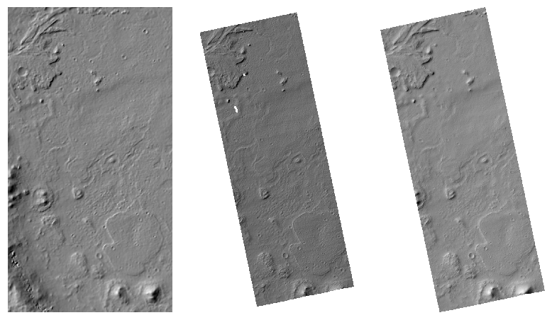

   Left: the CTX hillshaded DEM reference for Jezero. Middle: the prior aligned
   CaSSIS DEM. Right: ASP-produced CaSSIS DEM from the same source data. All are
   gridded at 18 m / pixel.

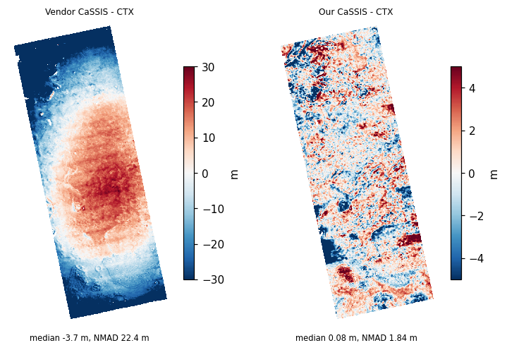

   Left: prior CaSSIS minus CTX (median -3.7 m, NMAD 22.4 m). Note the
   large-scale along-track and across-track warping. Right: ASP-produced
   CaSSIS minus CTX (median 0.09 m, NMAD 1.8 m). Note the different color ranges
   in the two plots. Both are in meters.

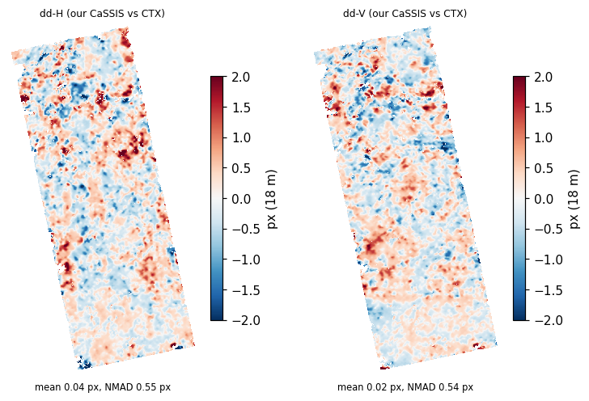

   Evaluation of ground-plane misregistration of our CaSSIS DEM to CTX, measured
   by image correlation of the DEMs after hillshading
   (:numref:`correlator-mode`). The plot shows the components of the filtered
   disparity in pixels (:numref:`raw_disp`). These have a mean within 0.03 px,
   and the NMAD values are about 0.5 px. The pixel size is 18 m.

Oxia Planum (site 1)
^^^^^^^^^^^^^^^^^^^^

Here we compare with the prior CaSSIS DEM product ``MY34_003806_019_1``.

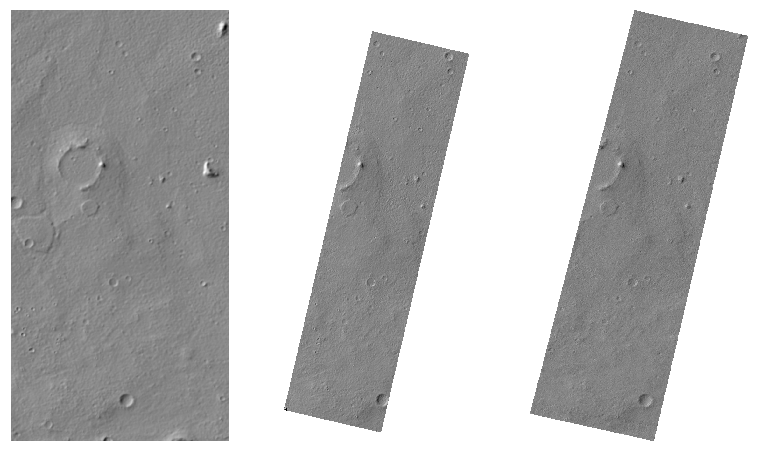

   Left: Reference CTX DEM. Middle: the prior aligned CaSSIS DEM. Right: our
   CaSSIS DEM.

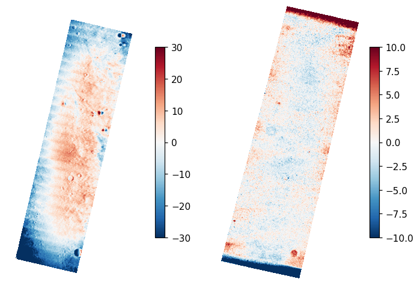

   Elevation difference to CTX, in meters. Left: prior CaSSIS minus CTX, median
   0.6 m, NMAD 8.3 m. Right: our CaSSIS minus CTX, median -0.1 m, NMAD 1.5 m,
   about 6 times tighter to CTX. Here, our result is less well controlled at the
   starting and ending framelets.

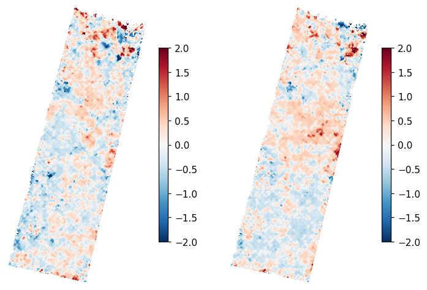

   Registration to CTX, horizontal and vertical disparity: sub-pixel (NMAD is
   about 0.5 px).

Oxia Planum (site 2)
^^^^^^^^^^^^^^^^^^^^

Here we compare with the prior CaSSIS DEM product ``MY34_004172_162_1``.

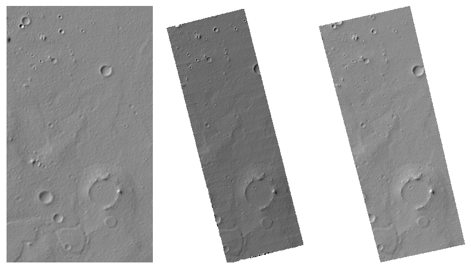

   Left: Hillshaded CTX reference DEM. Middle: the prior aligned CaSSIS DEM.
   Right: our CaSSIS DEM.

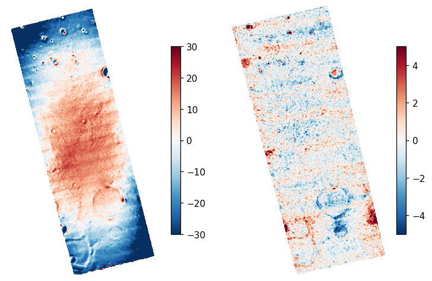

   Elevation difference to CTX, in meters. Left: prior CaSSIS minus CTX, median
   0.9 m, NMAD 15.5 m. Right: our CaSSIS minus CTX, median -0.1 m, NMAD 1.0 m,
   about 15 times tighter to CTX.

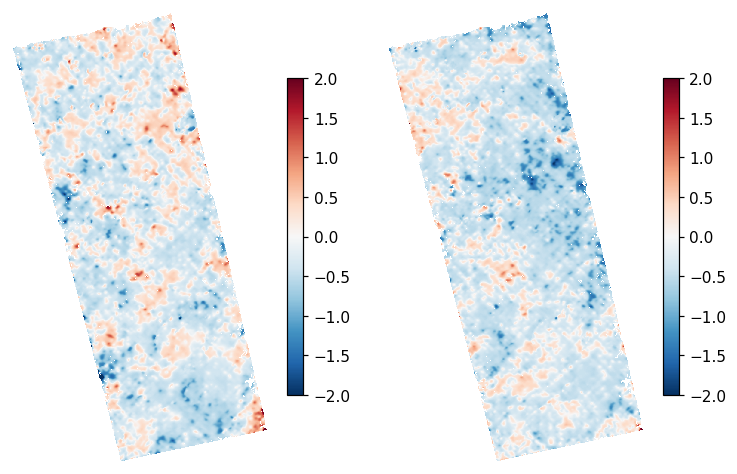

   Registration to CTX, horizontal and vertical disparity: sub-pixel (NMAD is
   about 0.3 px).

Gusev crater
^^^^^^^^^^^^

Here we compare with the prior CaSSIS DEM product ``MY34_003860_344_1``.

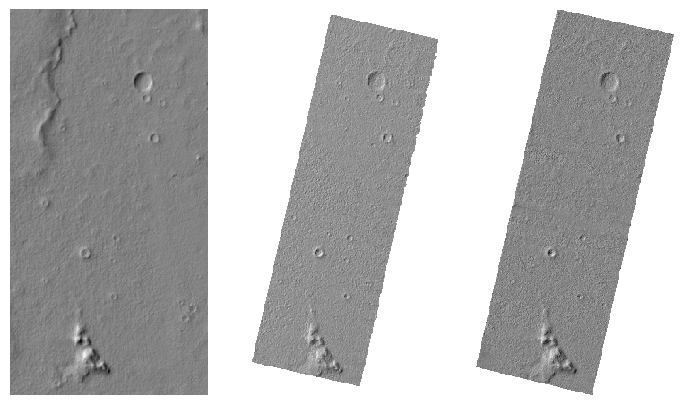

   Left: Hillshaded CTX reference DEM. Middle: the prior aligned CaSSIS DEM.
   Right: our CaSSIS DEM.

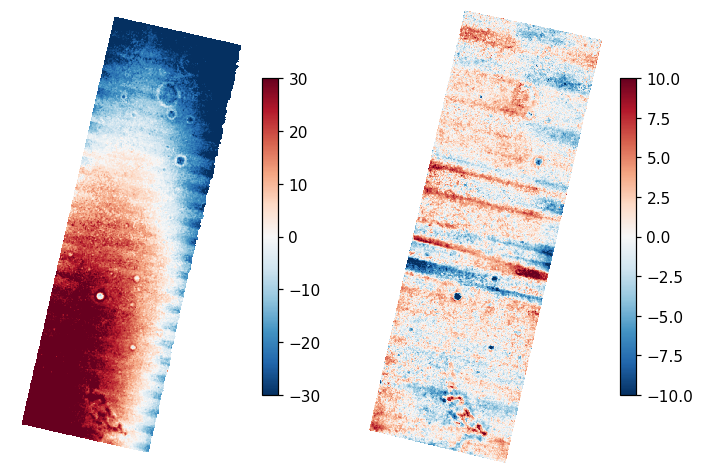

   Elevation difference to CTX, in meters. Left: prior CaSSIS minus CTX, median
   3.5 m, NMAD 26.6 m. Right: our CaSSIS minus CTX, median 0.4 m, NMAD 2.6 m.

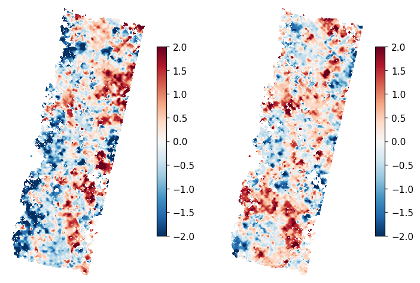

   Registration to CTX, horizontal and vertical disparity: NMAD is no more than 0.9 px.

Site 004756
^^^^^^^^^^^

Here we compare with the prior CaSSIS DEM product ``MY34_004756_354_1``.

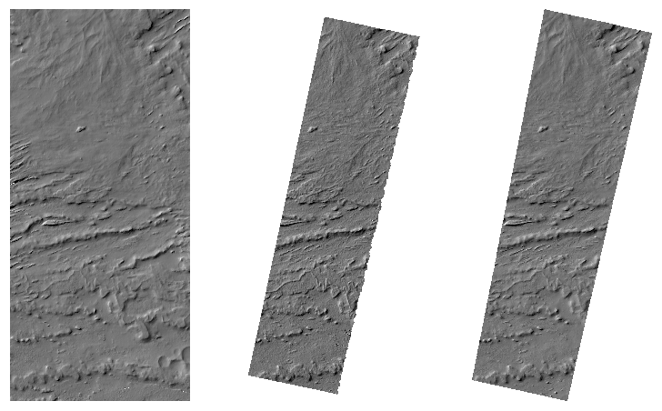

   Left: CTX. Middle: the prior aligned CaSSIS DEM. Right: our CaSSIS DEM.

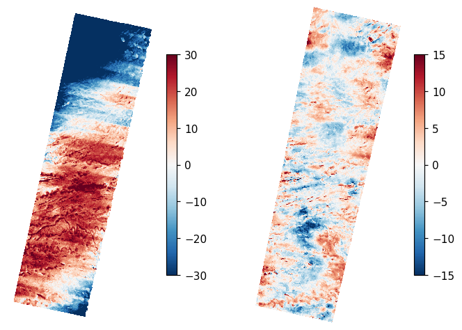

   Elevation difference to CTX, in meters. Left: prior CaSSIS minus CTX, median
   6.2 m, NMAD 21.5 m. Right: our CaSSIS minus CTX, median 0.0 m, NMAD 4.1 m
   (the wider spread is a blunder tail on steep terrain, not the core surface).

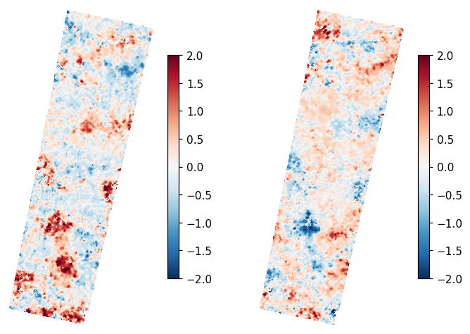

   Registration to CTX: NMAD 0.5 / 0.4 px, sub-pixel.

.. _cassis_approach:

Approach
~~~~~~~~

Our method assumes a CTX (:numref:`ctx_example`) reference DEM already exists
for a site. A wealth of such data is available, such as in the USGS Astrogeology
STAC catalog (see below).

A CaSSIS DEM is created by bundle adjustment, pairwise stereo, blending of
created DEMs, and registration to the CTX DEM by dense correlation of hillshaded
images.

The precise methodology is below. The key observation that made this process
successful is that one must ensure the framelets are tightly constrained at all
times. Otherwise they decouple which results in local warping.

To handle across-track warping the lens distortion was recalibrated. This was
done once, jointly for 3 sites (Jezero, Oxia Planum 1, Oxia Planum 2), then kept
fixed to the updated value during individual processing of the five sites above.
It should be kept fixed for future work.

The ground-sample distance of CaSSIS is about 4.6 m/pixel, which compares to CTX
(:numref:`ctx_example`) at about 6 m/pixel. These two sensors are close enough
in resolution to be comparable, and the DEM resolution of 18 m/pixel employed in
this processing is about 4x the CaSSIS image resolution.

.. _cassis_workflow:

Detailed workflow
~~~~~~~~~~~~~~~~~

This work is reproducible *end-to-end* with a collection of scripts and sample
data that is provided in the separate `CaSSIS pipeline
<https://github.com/NeoGeographyToolkit/CassisPipeline>`_ repository. What
follows is an overview of key steps.

.. _cassis_published_dem:

Prior CaSSIS DEM
^^^^^^^^^^^^^^^^

The published CaSSIS DEMs are found and downloaded from the CaSSIS DTM archive
(`cassis.oapd.inaf.it <https://cassis.oapd.inaf.it/archive/cassis/searchdtm.php>`_).
These are produced by the OAPD/INAF group with its 3D stereo pipeline
(3DPD, :cite:`simioni2021`).

The products vary in their horizontal projection (equirectangular or
stereographic) and in their stated vertical datum. In practice the heights are
referenced to the Mars areoid (the MOLA gravitational equipotential surface),
even when the accompanying metadata suggests otherwise, so that metadata should
be read with care and the datum verified. The areoid departs from a sphere by
more than a kilometer in places, varying with location, so this is not a small
offset.

For comparison with our results, which use the Mars reference sphere of radius
3396190 m (the ``D_MARS`` datum), a prior CaSSIS DEM is converted from areoid to
sphere heights with :numref:`dem_geoid` (option ``--reverse-adjustment`` with
the MOLA areoid).

The prior CaSSIS DEM is then regridded to the local stereographic projection at
18 m/pixel with ``gdalwarp``, following the same grid convention as ASP
(:numref:`mapproj_grid`). The command sets the projection with ``-t_srs``, the
grid size with ``-tr 18 18``, cubic-spline resampling with ``-r cubicspline``,
and an extent ``-te`` snapped to odd multiples of 9 m (half the grid size). The
regridded DEM then shares the grid phase of the CTX reference and our CaSSIS
DEM.

.. _cassis_ctx_ref:

Preparation of reference CTX DEM
^^^^^^^^^^^^^^^^^^^^^^^^^^^^^^^^

The reference is assembled from existing Context Camera (CTX) DEMs over the
site, rather than produced from raw CTX stereo. They are queried and downloaded
from the (`USGS Astrogeology STAC catalog
<https://stac.astrogeology.usgs.gov>`_), from the controlled MRO CTX DTM
collection, using its query API. A covering set of overlapping DEMs is selected
to span the CaSSIS footprint with margin.

The box for the reference is taken from the extent of the prior CaSSIS DEM (as
prepared above, in the local stereographic projection at 18 m/pixel), expanded
by a factor of six. This wide (and perhaps excessive) margin gives ample
surrounding terrain for the later hillshade correlation to lock onto, despite
any misregistration in the prior product.

The extent is snapped, following the same grid convention (:numref:`mapproj_grid`),
so its bounds are odd multiples of half the grid size (9 m). The pixel centers then
fall at integer multiples of the grid size, so the CTX and CaSSIS DEMs share one
grid phase, with no subpixel offset when they are compared or blended.

The DEMs are warped to this extent and seamlessly blended with
:numref:`dem_mosaic`. Each input is then compared to the blend with
:numref:`geodiff`, and any that disagrees badly is dropped (roughly, a mean
offset over 20 m or a spread over 30 m, against a CTX jitter floor of a few
meters). The curated set is re-blended and inspected by eye. 

CTX can be off the true ground by a few meters, and spacecraft jitter or a poor
pair alignment can show up as smeared craters and other features in the
hillshade. Such cases should be caught visually and handled.

.. _cassis_prior_align:

Alignment of prior CaSSIS DEMs to CTX
^^^^^^^^^^^^^^^^^^^^^^^^^^^^^^^^^^^^^

The regridded prior DEM is horizontally aligned to CTX by dense hillshade
correlation (:numref:`pc_corr`) with ``--num-iterations 0`` to skip subsequent
ICP-based alignment.

This worked better than ICP point-to-plane alignment (:numref:`align-method`),
which introduced a large lateral slide given the notable warping of the official
CaSSIS DEMs. 

This alignment is only for the comparisons above. It is not used in producing
our DEMs.

.. _cassis_cameras:

Creation of CaSSIS camera files
^^^^^^^^^^^^^^^^^^^^^^^^^^^^^^^

For each framelet a CSM camera model (:numref:`csm`) is created. It carries the
spacecraft pose, read from the TGO and CaSSIS SPICE kernels, and the CaSSIS lens
distortion.

This is done in two stages, each in its own conda environment. First the
framelets are downloaded and ingested to ISIS cubes, with ISIS. Then the CSM
cameras are created from the cubes, with `ALE
<https://github.com/DOI-USGS/ale>`_ (:numref:`cassis_csm`). The two stages need
different, and mutually incompatible, versions of the underlying libraries, so
they are kept in separate environments.

The commands below are spelled out for the Jezero observation
``MY36_016378_162_1`` (evaluated in :numref:`cassis_vendor`), and apply to any
site. The `CaSSIS pipeline
<https://github.com/NeoGeographyToolkit/CassisPipeline>`_ repository automates
all of this.

.. _cassis_isis_env:

ISIS environment
""""""""""""""""

The ingestion and kernel download below use ISIS. Create an environment with
ISIS 10.0.0 and ``rclone`` (needed by the kernel downloader), from the public
``usgs-astrogeology`` channel::

    conda config --set channel_priority flexible
    conda create -n isis10           \
      -c usgs-astrogeology -c conda-forge \
      isis=10.0.0 csm=3.0.3.3 rclone
    conda activate isis10
    export ISISROOT=$CONDA_PREFIX
    export ISISDATA=$HOME/projects/isisdata

The ``csm`` package is pinned to ``3.0.3.3``. The default solve pulls a newer
``csm`` whose shared library is not compatible with this ISIS release, which then
fails to load.

This environment provides ``tgocassis2isis`` and ``editlab`` for the ingestion,
and ``downloadIsisData`` for the kernels.

.. _cassis_fetch:

Fetching the framelets
""""""""""""""""""""""

The calibrated framelets are downloaded from the ESA Planetary Science Archive
(`PSA <https://archives.esac.esa.int/psa>`_, the ExoMars ``em16_tgo_cas``
collection). Each stereo observation has two looks (perspectives), which we call
left and right. Each look is a directory of about thirty ``.dat`` and ``.xml``
framelet pairs, under a sequence identifier.

Observation ``MY36_016378_162_1`` is on orbit 16378, with the left look under
sequence identifier ``838849161`` and the right under ``838849162``. The PSA
groups orbits into ranges of one hundred, so orbit 16378 is under
``Orbit_Range_16300_16399``. Fetch both looks with::

    base=https://archives.esac.esa.int/psa/ftp/ExoMars2016/em16_tgo_cas/data_calibrated/Science_Phase/Orbit_Range_16300_16399/Orbit_16378/Science

    n=1
    for sid in 838849161 838849162; do
      out=L${n}_$sid
      mkdir -p $out
      files=$(curl -sL "$base/$sid/PAN/"                   \
        | grep -ioE 'cas_cal[^"]*\.(dat|xml)' | grep -vi sti | sort -u)
      for f in $files; do
        curl -sL "$base/$sid/PAN/$f" -o "$out/$f"
      done
      n=$((n+1))
    done

Only the individual ``PAN`` framelets are used. The stitched ``sti`` products
are skipped. The PSA is slow, roughly one file per second, so this takes a few
minutes per look.

.. _cassis_kernels:

Downloading the SPICE kernels
"""""""""""""""""""""""""""""

The pose is obtained from the TGO and CaSSIS SPICE kernels. These are the
``base`` and ``tgo`` kernel sets in the `ISIS data area
<https://astrogeology.usgs.gov/docs/how-to-guides/environment-setup-and-maintenance/isis-data-area/>`_
(:numref:`planetary_images`). Download the two sets with ``downloadIsisData``,
which is shipped with ISIS::

    downloadIsisData base $ISISDATA
    downloadIsisData tgo  $ISISDATA

The mission name for CaSSIS is ``tgo``. Each call pulls from two upstream
archives at once and merges them: the spacecraft SPICE kernels themselves
(produced and hosted by ESA) and the ISIS-specific supplements (the instrument
addendum, which carries the CaSSIS focal length and detector geometry, and the
kernel database indexes, hosted by USGS). Both halves are needed. The addendum
in particular is not part of the ESA archive, so a bare ESA metakernel is not
sufficient by itself. The ``downloadIsisData`` tool assembles both halves into a
single tree without the user having to track where each file comes from.

The ``base`` set holds the shared body ephemeris and the leap-second kernel that
even the ingestion above needs. The ``tgo`` set holds the CaSSIS instrument,
pointing, and trajectory kernels.

The full ``tgo`` set is very large. The ESA-hosted kernels alone are about 230
GiB, some ten thousand files, most of it reconstructed spacecraft position and
pointing spanning the entire mission. A full download is only worth it for
repeated, multi-site work, and takes a long time.

For a single observation only a small subset is needed: the static kernels (leap
seconds, spacecraft clock, frames, the CaSSIS instrument kernel and its ISIS
addendum) plus the reconstructed position and pointing that cover the few
seconds of that observation. The observation date is encoded in the framelet
names and labels (for the Jezero example above, ``20210725``). A reconstructed
position or pointing kernel states its coverage window in its own file name, so
a targeted ``rclone`` of just the kernels whose window includes that date, using
the same configuration that ``downloadIsisData`` relies on
(:numref:`planetary_images`), brings the footprint down from hundreds of GiB to
a few hundred MiB. The `CaSSIS pipeline
<https://github.com/NeoGeographyToolkit/CassisPipeline>`_ repository shows this
date-scoped fetch.

.. _cassis_ingest:

Ingesting to ISIS cubes
"""""""""""""""""""""""

Each framelet is ingested to an ISIS cube with ``tgocassis2isis``. The
PSA-exported labels omit the spacecraft clock start count that ISIS camera
initialization needs, so it is recovered from the hex-encoded exposure timestamp
in the label and written into the cube with ``editlab``. This is a temporary
workaround, to be removed once the corresponding ISIS fix reaches the release::

    for xml in L1_838849161/*.xml L2_838849162/*.xml; do
      cub=${xml%.xml}.cub
      tgocassis2isis from=$xml to=$cub
      ts=$(grep -ioE '<em16_tgo_cas:exposuretimestamp>[0-9a-fA-F]+' $xml | sed 's/.*>//')
      clk=$(echo $ts | xxd -r -p)
      editlab from=$cub options=addkey grpname=Instrument \
        keyword=SpacecraftClockStartCount value=$clk
    done

The ingestion attaches no SPICE kernels, but ``ISISDATA`` must still be set, as
the label parsing reads the leap-second kernel from the ``base`` set.

.. _cassis_csm:

Creating the CaSSIS CSM cameras
^^^^^^^^^^^^^^^^^^^^^^^^^^^^^^^

With the cubes in hand, a CSM camera model is created for each framelet, from
the SPICE pose and the CaSSIS lens distortion.

This needs the CaSSIS-capable versions of ALE and `USGSCSM
<https://github.com/DOI-USGS/usgscsm>`_. These are custom-built conda packages,
with build string ``cassis``, on the ``nasa-ames-stereo-pipeline`` channel, as
the official releases of these packages (as of July 2026) do not yet support
CaSSIS. 

These packages are *newer* than with the ISIS environment above, with some logic
added specifically for CaSSIS, so care is needed not to mix the two. These go
in their own environment::

    conda config --set channel_priority flexible
    conda create -n usgscsm_cassis \
      -c nasa-ames-stereo-pipeline \
      -c usgs-astrogeology         \
      -c conda-forge               \
      'ale=1.2.0=cassis*'          \
      'usgscsm=2.1.0=cassis*'      \
      gdal

The camera is then created with ``isd_generate``, from this environment, reading
the cube and the TGO kernels in the ISIS data area::

    conda activate usgscsm_cassis
    export ISISDATA=$HOME/projects/isisdata
    export ALESPICEROOT=$ISISDATA

    cub=L1_838849161/cas_cal_sc_20210725T202818-20210725T202822-16378-10-PAN-838849161-0-0__4_0.cub
    isd_generate $cub

This writes a camera file with the same name but the ``.json`` extension in the
USGS CSM frame-sensor format, with the CaSSIS distortion. Repeat for every
framelet in both looks.

Future versions of ISIS and ASP will have all of this in a single package, so
the two separate environments above will no longer be needed.

.. _cassis_init_reg:

Initial registration of CaSSIS images
^^^^^^^^^^^^^^^^^^^^^^^^^^^^^^^^^^^^^

A CaSSIS stereo collection has about 30 framelets in each of two perspectives,
which we call the left and right looks. Within each look the framelets and their
published poses are self-consistent, yet the two looks can be misregistered by
hundreds of meters relative to each other and to the ground.

A simple bundle adjustment of all sixty framelets, especially with the initially
inaccurate lens distortion, gives an unstable, non-unique solution that is hard to
recover from. Instead, each look is first merged into a single image, for which a
CSM linescan model (:numref:`csm_linescan`) is created from the input poses and
intrinsics.

These two linescan images are bundle-adjusted and a DEM is made and aligned to
CTX with :numref:`pc_align`. It still has 10 to 20 pixels of warping (at 18
m/pixel), but that is close
enough to proceed. The alignment transform is applied to the bundle-adjusted
linescan cameras, which are then split back into individual framelet cameras
carrying the updated, registered poses.

.. _cassis_dense_matches:

Dense matches
^^^^^^^^^^^^^

Dense interest-point matches are computed once and reused across the passes.
Matches within a look, left-to-left and right-to-right, are found in the raw
image (pixel) domain. Matches across the two looks, left-to-right, are found in
the mapprojected domain (:numref:`mapproject`), which removes the large
cross-look convergence and makes the correlation reliable. These matches tie the
framelets together for bundle adjustment and for stereo.

.. _cassis_refit:

Distortion refit
^^^^^^^^^^^^^^^^

The steps up to here assume the published lens distortion is already calibrated.
A single transverse-distortion model is then refit from the dense matches and
set on the cameras with :numref:`cam_gen`, frozen and shared across all
framelets. This corrects the residual across-track warping that a fixed
distortion leaves behind.

.. _cassis_ba:

Bundle adjustment
^^^^^^^^^^^^^^^^^

The framelet frame cameras are then refined with :numref:`bundle_adjust`. This
uses the CTX DEM as a height constraint (heights-from-dem), ground control
points generated from it with :numref:`dem2gcp`, and a leash on the camera
positions to keep the solution from drifting. A single frozen
transverse-distortion lens is shared across all framelets.

Each refinement is done in two passes. The first pass holds the ground control
fixed, to anchor the horizontal registration. The second pass floats it and leans
on the height constraint, to settle the vertical while keeping the horizontal.

.. _cassis_stereo:

Pairwise stereo and blending
^^^^^^^^^^^^^^^^^^^^^^^^^^^^

The cross-look framelet pairs are correlated with :numref:`parallel_stereo` in the
mapprojected domain at the native image resolution. Each pair yields a small DEM
with :numref:`point2dem`, where a per-point triangulation-error cap removes
blunders without carving holes. The per-pair DEMs are blended into a seamless
result with :numref:`dem_mosaic` at 18 m/pixel, and the worst per-pair
triangulation errors are mosaicked as a diagnostic.

.. _cassis_refine:

Optional refinement
^^^^^^^^^^^^^^^^^^^

The whole sequence, bundle adjustment through stereo, can be run a second time,
with the current results as the input. The motivation is that we now have a
well-registered stereo DEM, rather than the approximation produced with the
linescan cameras. If this DEM still has residual issues, it can be used to
produce better ground control points than before, which then help fix those
issues.

We found limited additional payoff from this refinement, and the results higher
up this page do not use it. It did help somewhat in reducing the vertical
discrepancy at the top and bottom of the Oxia Planum 1 DEM.

.. _cassis_eval:

Evaluation
^^^^^^^^^^

The final DEM is compared to CTX with :numref:`geodiff` for the vertical
difference, and by image correlation of the two hillshades for the horizontal
registration (:numref:`correlator-mode`, :numref:`raw_disp`). A good result has
a near-zero median, a small robust spread (under 6 meters), and a sub-pixel
disparity median and NMAD in each band (at 18 m/pixel), with no systematic
shifts.

It is strongly suggested not to rely on statistics alone, but to inspect the
vertical difference map and the colorized disparity bands.

.. _cassis_opt_lens_dist:

Solving for lens distortion
^^^^^^^^^^^^^^^^^^^^^^^^^^^

The workflow above treats the lens distortion as solved once, ahead of time,
then fixed. It is suggested to run this pipeline with the provided optimized
distortion.

To optimize the distortion, starting with the values that are published in the
ESA Planetary Science Archive, which ASP converts to the transverse distortion
model in CSM, run the same two bundle adjustment commands from the workflow not
per site, but jointly, across the three sites (Jezero, Oxia Planum 1, and Oxia
Planum 2), with distortion solving enabled via ``--intrinsics-to-float
other_intrinsics``.

This uses the option ``--heights-from-dem-list`` in :numref:`bundle_adjust`
(added in the ASP build of 2026/7, :numref:`release`), which passes a
per-site list of reference DEMs. The three sites are widely spaced across Mars,
so a single merged DEM is not feasible.

The resulting lens distortion was then refined as in :numref:`cassis_refine`, so
this joint optimization process was repeated with the current lens distortion as
input. Validation on the other two sites showed it was good enough.

Note that the provided lens distortion implicitly tilts the camera poses, which
is compensated for by adjusting the camera pose when this distortion is applied
(:numref:`cassis_refit`). Presumably a tighter constraint on the camera position
could be used to rederive this optimized distortion while minimizing the tilt.
