.. _cassis:

TGO CaSSIS
----------

The Colour and Stereo Surface Imaging System (*CaSSIS*) is the high-resolution
stereo imager on the ESA `ExoMars Trace Gas Orbiter
<https://en.wikipedia.org/wiki/ExoMars_Trace_Gas_Orbiter>`_ (TGO). It is a
pushframe instrument, acquiring the surface as a sequence of overlapping
framelets (`Thomas et al. (2017) <https://doi.org/10.1007/s11214-017-0421-1>`_).

This documents how to create terrain models with CaSSIS images with ASP. The
resulting `CaSSIS pipeline
<https://github.com/NeoGeographyToolkit/CassisPipeline>`_ that allows
reproducible, end-to-end processing is made public, together with sample data.

This requires a recent build of ASP, from 2026/7 or later (:numref:`release`),
which has the CaSSIS camera support.

.. _cassis_vendor:

Results
~~~~~~~

The ASP-produced CaSSIS DEMs are notably more accurate than the published CaSSIS
DEMs as validated with 5 different products.

Jezero site
^^^^^^^^^^^

Here we compare with the prior CaSSIS DEM product ``MY36_016378_162_1``.

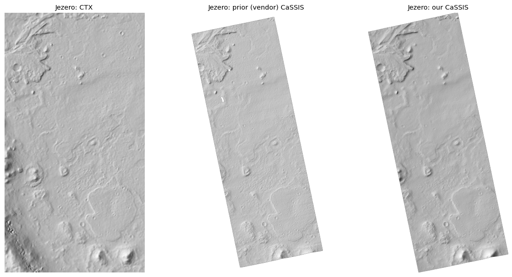

   Left: the CTX hillshaded DEM reference for Jezero. Middle: the prior aligned
   CaSSIS DEM. Right: ASP-produced CaSSIS DEM from the same source data. All are
   gridded at 18 m/pixel.

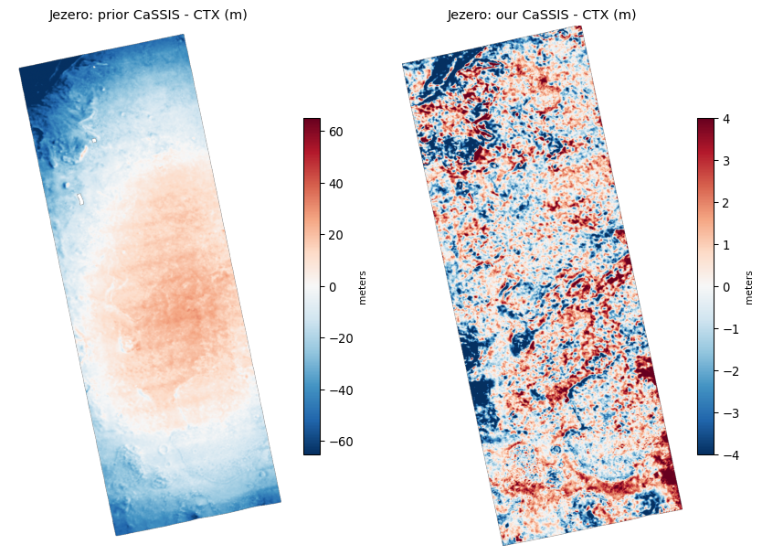

   Left: prior CaSSIS minus CTX (median -3.7 m, NMAD 22.4 m). Note the
   large-scale along-track and across-track warping. Right: ASP-produced
   CaSSIS minus CTX (median 0.0 m, NMAD 1.7 m). Note the different color ranges
   in the two plots. Both are in meters.

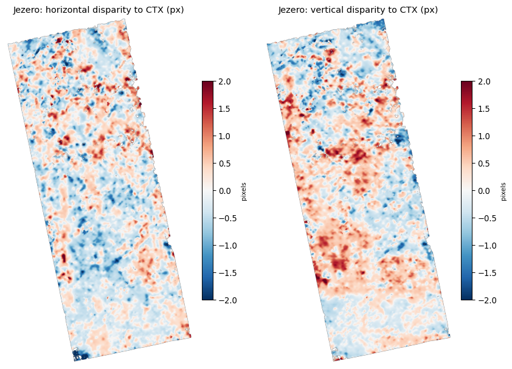

   Evaluation of ground-plane misregistration of our CaSSIS DEM to CTX, measured
   by image correlation of the DEMs after hillshading
   (:numref:`correlator-mode`). The plot shows the components of the filtered
   disparity in pixels (:numref:`raw_disp`). The horizontal disparity has median
   -0.1 px and NMAD 0.5 px; the vertical, median 0.1 px and NMAD 0.6 px. The
   pixel size is 18 m.

Oxia Planum (site 1)
^^^^^^^^^^^^^^^^^^^^

Here we compare with the prior CaSSIS DEM product ``MY34_003806_019_1``.

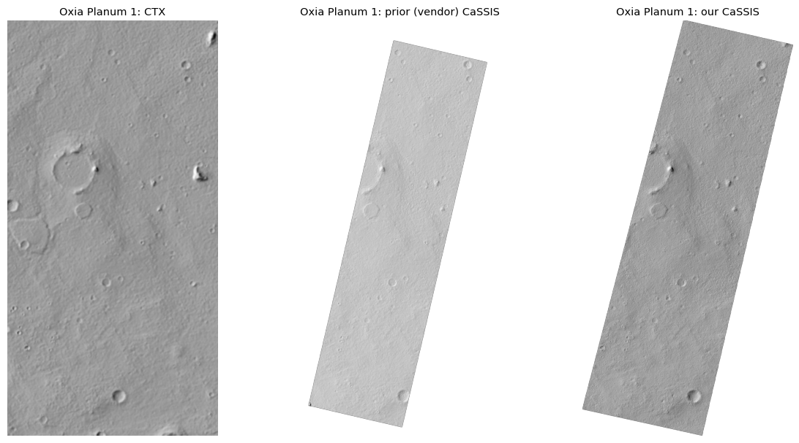

   Left: Reference CTX DEM. Middle: the prior aligned CaSSIS DEM. Right: our
   CaSSIS DEM.

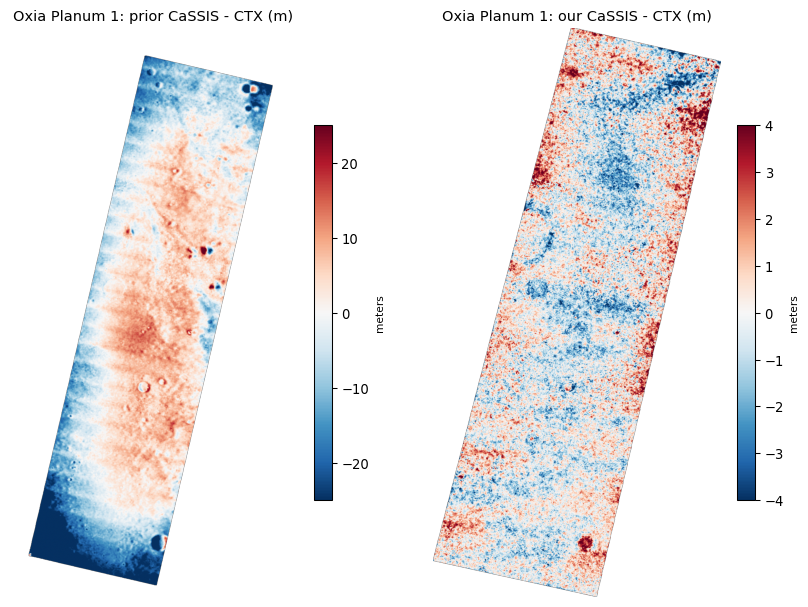

   Elevation difference to CTX, in meters. Left: prior CaSSIS minus CTX, median
   0.6 m, NMAD 8.3 m. Right: our CaSSIS minus CTX, median -0.1 m, NMAD 1.3 m,
   about 6 times tighter to CTX. Here, our result is less well controlled at the
   starting and ending framelets. This improved after a refinement pass
   (:numref:`cassis_refine`).

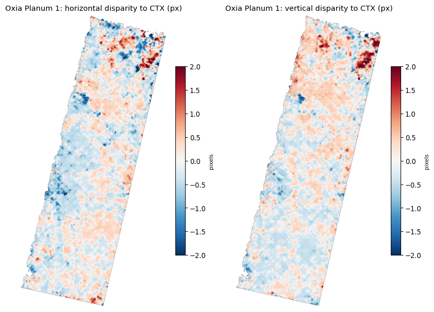

   Registration to CTX. Horizontal disparity median -0.1 px and NMAD 0.5 px;
   vertical median 0.0 px and NMAD 0.5 px.

Oxia Planum (site 2)
^^^^^^^^^^^^^^^^^^^^

Here we compare with the prior CaSSIS DEM product ``MY34_004172_162_1``.

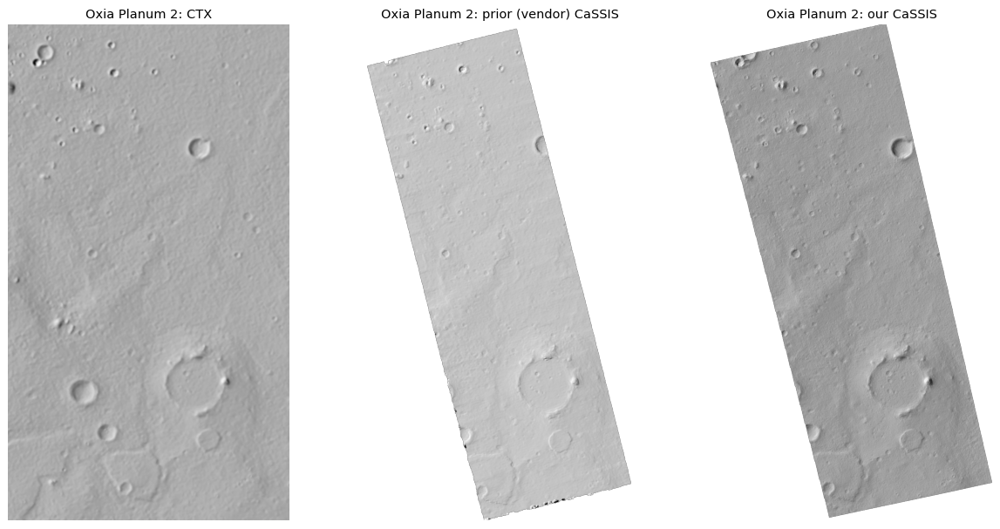

   Left: Hillshaded CTX reference DEM. Middle: the prior aligned CaSSIS DEM.
   Right: our CaSSIS DEM.

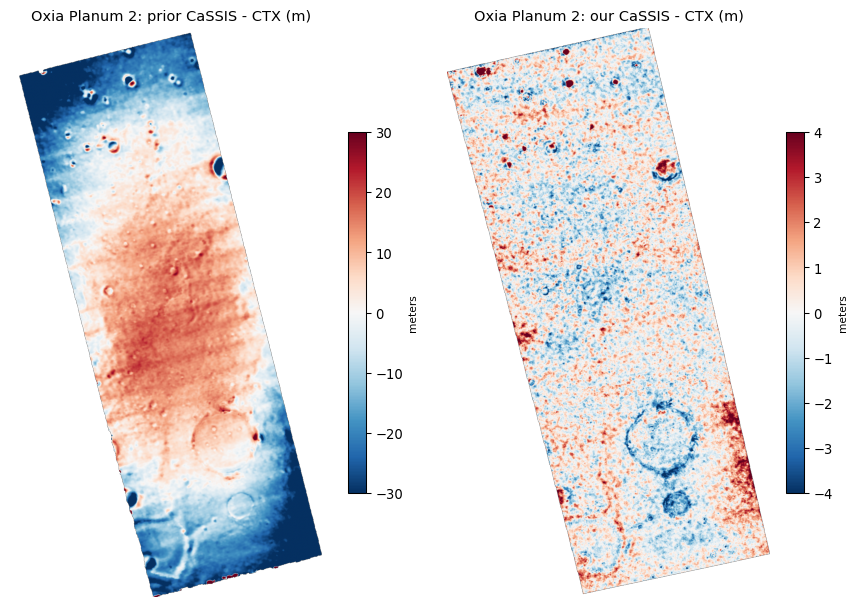

   Elevation difference to CTX, in meters. Left: prior CaSSIS minus CTX, median
   0.9 m, NMAD 15.5 m. Right: our CaSSIS minus CTX, median -0.1 m, NMAD 1.0 m,
   about 15 times tighter to CTX.

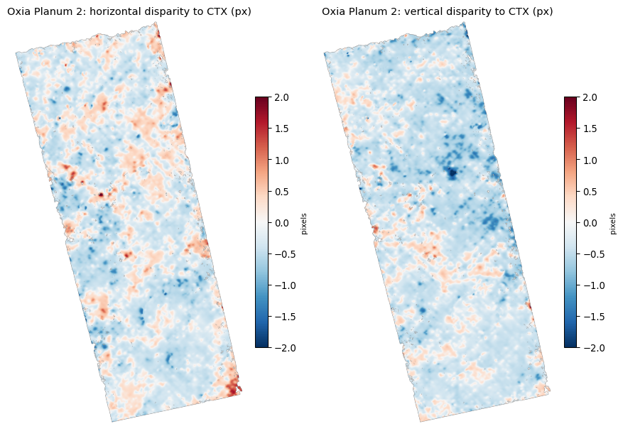

   Registration to CTX. Horizontal disparity median -0.3 px and NMAD 0.3 px;
   vertical median -0.4 px and NMAD 0.2 px.

Gusev crater
^^^^^^^^^^^^

Here we compare with the prior CaSSIS DEM product ``MY34_003860_344_1``.

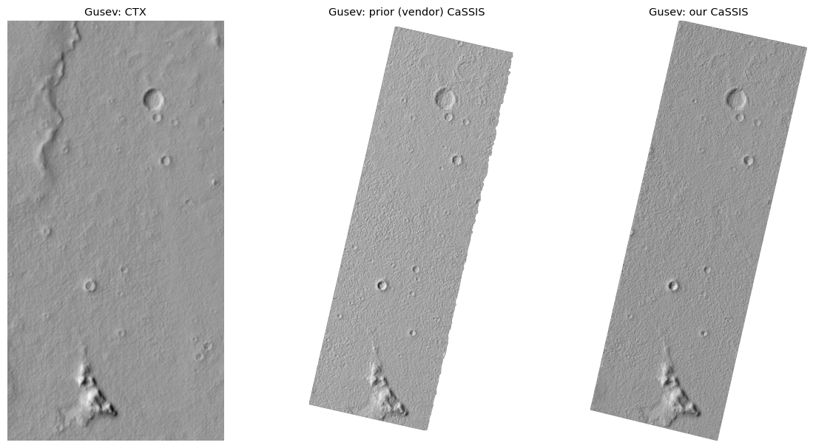

   Left: Hillshaded CTX reference DEM. Middle: the prior aligned CaSSIS DEM.
   Right: our CaSSIS DEM.

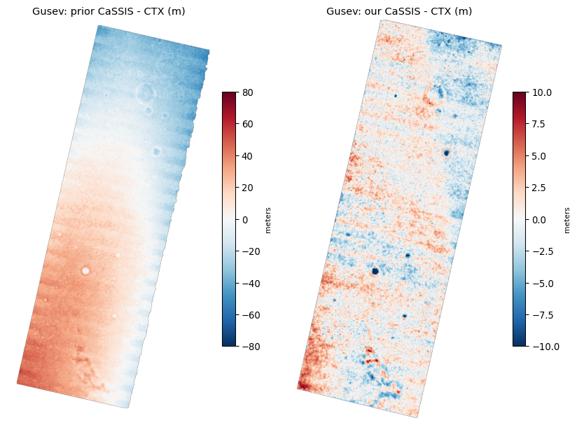

   Elevation difference to CTX, in meters. Left: prior CaSSIS minus CTX, median
   3.5 m, NMAD 26.6 m. Right: our CaSSIS minus CTX, median 0.1 m, NMAD 2.1 m.

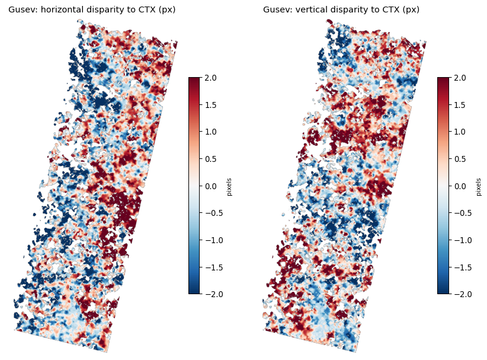

   Registration to CTX. Horizontal disparity median 0.1 px and NMAD 1.4 px;
   vertical median 0.1 px and NMAD 1.3 px. Gusev is smooth, so the hillshade
   correlation is noisier than at the other sites.

Site 004756
^^^^^^^^^^^

Here we compare with the prior CaSSIS DEM product ``MY34_004756_354_1``.

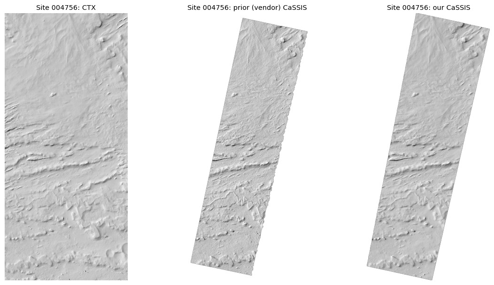

   Left: CTX. Middle: the prior aligned CaSSIS DEM. Right: our CaSSIS DEM.

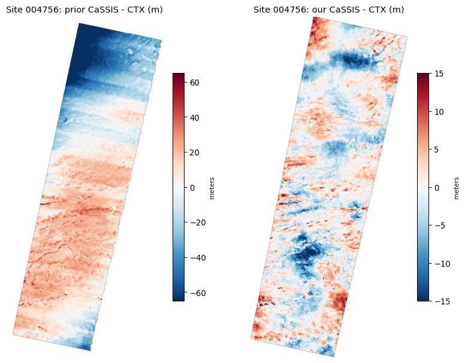

   Elevation difference to CTX, in meters. Left: prior CaSSIS minus CTX, median
   6.2 m, NMAD 21.5 m. Right: our CaSSIS minus CTX, median -0.2 m, NMAD 3.9 m
   (the wider spread is a blunder tail on steep terrain, not the core surface).

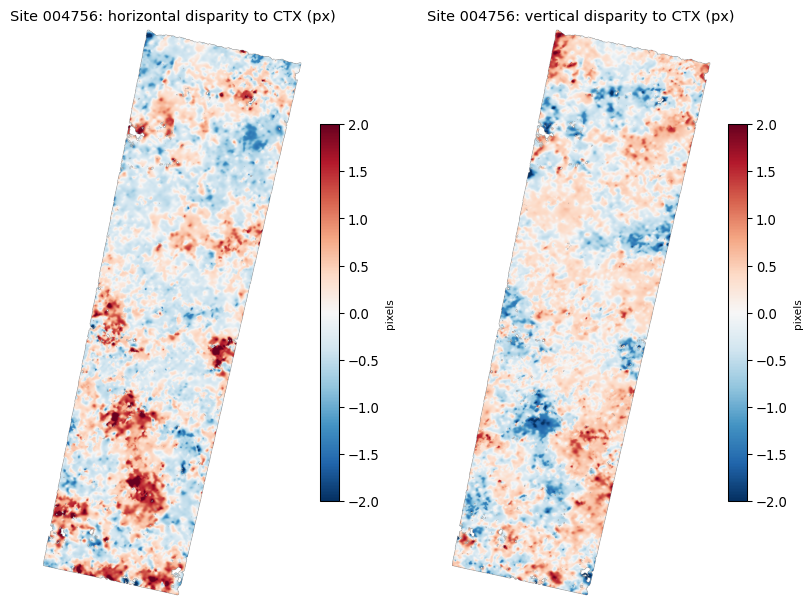

   Registration to CTX. Horizontal disparity median -0.1 px and NMAD 0.5 px;
   vertical median 0.1 px and NMAD 0.5 px.

.. _cassis_approach:

Approach
~~~~~~~~

Our method assumes a CTX (:numref:`ctx_example`) reference DEM already exists
for a site. A wealth of such data is available, such as in the USGS Astrogeology
STAC catalog (see below). When not present, such a DEM can be created with
stereo. We have observed however notable jitter for such products, so
preliminary jitter solving is suggested (:numref:`jitter_solve`).

A CaSSIS DEM is created by bundle adjustment, pairwise stereo, blending of
created DEMs, and registration to the CTX DEM by matching sparse interest points
on the hillshaded DEMs.

The precise methodology is below. The key observation that made this process
successful is that one must ensure the framelets are tightly constrained at all
times. Otherwise they decouple, which results in local warping.

To handle across-track warping the lens distortion was recalibrated. This was
done once, jointly for 3 sites (Jezero, Oxia Planum 1, Oxia Planum 2), then kept
fixed to the updated value during individual processing of the five sites above.
It should be kept fixed for future work.

The ground-sample distance of CaSSIS is about 4.6 m/pixel, which compares to CTX
(:numref:`ctx_example`) at about 6 m/pixel. These two sensors are close enough
in resolution to be comparable. The DEM resolution of 18 m/pixel employed in
this processing is about 4x the CaSSIS image resolution.

.. _cassis_workflow:

Detailed workflow
~~~~~~~~~~~~~~~~~

Reproducibility
^^^^^^^^^^^^^^^

This work is reproducible *end-to-end* with a collection of scripts that is
provided in the separate `CaSSIS pipeline
<https://github.com/NeoGeographyToolkit/CassisPipeline>`_ repository. A
ready-to-run `sample dataset for the Jezero site
<https://github.com/NeoGeographyToolkit/CassisPipeline/releases/tag/jezero-reference>`_
is also available, that has the input CaSSIS data, the reference CTX DEM, the
distortion-refitted, bundle-adjusted and aligned cameras that are ready for
stereo, and the output DEM and triangulation error mosaics.

All of this needs a recent ASP build, from 2026/7 or later (:numref:`release`).

.. _cassis_compute:

Compute requirements
^^^^^^^^^^^^^^^^^^^^

The preparation stages are light and can be run on a local machine. The heavy
stages, that include the distortion refit, creation of pairwise dense matches,
bundle adjustment, and stereo, are compute-intensive and could be run on a
supercomputer node (:numref:`pbs_slurm`). On a single node with 28 cores and
128 GB of memory the heavy stages took one to two hours of compute. Likely a lot
less memory is actually needed. The dense matching and the first
bundle-adjustment pass took most of the time.

.. _cassis_published_dem:

Prior CaSSIS DEM
^^^^^^^^^^^^^^^^

The published CaSSIS DEMs are found and downloaded from the CaSSIS DTM archive
(`cassis.oapd.inaf.it <https://cassis.oapd.inaf.it/archive/cassis/searchdtm.php>`_).
These are produced by the OAPD/INAF group with its 3D stereo pipeline
(3DPD, :cite:`simioni2021`).

The products vary in their horizontal projection (equirectangular or
stereographic) and in their stated vertical datum. In practice the heights are
referenced to the Mars areoid (the MOLA gravitational equipotential surface),
even when the accompanying metadata suggests otherwise, so that metadata should
be read with care and the datum verified. The areoid departs from a sphere by
more than a kilometer in places, varying with location, so this is not a small
offset.

For comparison with our results, which use the Mars reference sphere of radius
3396190 m (the ``D_MARS`` datum), a prior CaSSIS DEM is converted from areoid to
sphere heights with :ref:`dem_geoid` (option ``--reverse-adjustment`` with
the MOLA areoid).

The prior CaSSIS DEM is then regridded to a *local stereographic projection* at
18 m/pixel with ``gdalwarp`` (:numref:`gdal_tools`), following the same grid
convention as ASP (:numref:`mapproj_grid`). The command sets the projection with
``-t_srs``, the grid size with ``-tr 18 18``, cubic-spline resampling with ``-r
cubicspline``, and an extent ``-te`` snapped to odd multiples of 9 m (half the
grid size). The regridded DEM then shares the grid phase of the CTX reference
and of the CaSSIS DEM produced with ASP.

.. _cassis_ctx_ref:

Preparation of reference CTX DEM
^^^^^^^^^^^^^^^^^^^^^^^^^^^^^^^^

The reference is assembled from existing Context Camera (CTX) DEMs over the
site, rather than produced from raw CTX stereo. They are queried and downloaded
from the `USGS Astrogeology STAC catalog
<https://stac.astrogeology.usgs.gov>`_, from the controlled MRO CTX DTM
collection, using its query API. A covering set of overlapping DEMs is selected
to span the CaSSIS footprint with margin.

The box for the reference is taken from the extent of the prior CaSSIS DEM (as
prepared above, in the local stereographic projection at 18 m/pixel), expanded
by a factor of six. This wide (and perhaps excessive) margin gives ample
surrounding terrain to mapproject the framelets for each view that go beyond
their shared area where they create a terrain model.

The extent is snapped, following the same grid convention (:numref:`mapproj_grid`),
so its bounds are odd multiples of half the grid size (9 m). The pixel centers then
fall at integer multiples of the grid size, so the CTX and CaSSIS DEMs share one
grid phase, with no subpixel offset when they are compared or blended.

The DEMs are warped to this extent and seamlessly blended with
:ref:`dem_mosaic`. Each input is then compared to the blend with :ref:`geodiff`,
and any that disagrees badly is dropped (roughly, a mean offset over 20 m or a
spread over 30 m, which is above the few-meters of noise due to CTX jitter). The
curated set is re-blended and inspected by eye.

Misalignment between input CTX DEMs may exist, which will manifest itself as
smeared craters, etc. Offending DEMs should either be taken out or aligned before
blending.

The low-resolution DEM used later for mapprojection (:numref:`mapproj-example`)
is prepared from this reference CTX DEM by blurring it with ``dem_mosaic``
(:numref:`dem_mosaic_blur`). A blur sigma of 5 is suggested.

.. _cassis_prior_align:

Alignment of prior CaSSIS DEMs to CTX
^^^^^^^^^^^^^^^^^^^^^^^^^^^^^^^^^^^^^

The regridded prior CaSSIS DEM is horizontally aligned to the blended reference
CTX DEM. By now both are on the same 18 m/pixel grid and share one projection
(:numref:`cassis_ctx_ref`), and the CTX is cropped to the prior DEM footprint
expanded by 20 percent, as for the linescan DEM (:numref:`cassis_init_reg`).

The prior products can only be brought into approximate registration. A rigid
transform removes the bulk shift, of up to a hundred pixels, but a horizontal
residual on the order of ten or more pixels remains, because these products are
warped non-rigidly. This is the same warping seen in the vertical difference to
CTX in the results above, where the prior product is several times less tight to
CTX than the ASP result.

This prior aligned CaSSIS product is only used for the comparisons above and not
for production of CaSSIS DEMs with ASP.

.. _cassis_cameras:

Creation of CaSSIS camera files
^^^^^^^^^^^^^^^^^^^^^^^^^^^^^^^

For each framelet a CSM camera model (:numref:`csm`) is created. It carries the
spacecraft pose, read from the TGO and CaSSIS SPICE kernels, and the CaSSIS lens
distortion.

This is done in two stages, each in its own conda environment. First the
framelets are downloaded and ingested to ISIS cubes, with ISIS. Then the CSM
cameras are created from the cubes, with `ALE
<https://github.com/DOI-USGS/ale>`_ (:numref:`cassis_csm`). The two stages need
different versions of the underlying libraries (ALE is newer with some
additional bugfixes), so they are kept in separate environments.

The commands below are spelled out for the Jezero observation
``MY36_016378_162_1`` (evaluated in :numref:`cassis_vendor`), and apply to any
site. The `CaSSIS pipeline
<https://github.com/NeoGeographyToolkit/CassisPipeline>`_ repository automates
all of this.

.. _cassis_isis_env:

ISIS environment
""""""""""""""""

The ingestion and kernel download below use ISIS. Create an environment with
ISIS 10.0.0 and ``rclone`` (needed by the kernel downloader), from the public
``usgs-astrogeology`` channel::

    conda config --set channel_priority flexible
    conda create -n isis10                \
      -c usgs-astrogeology -c conda-forge \
      isis=10.0.0 csm=3.0.3.3 rclone
    conda activate isis10
    export ISISROOT=$CONDA_PREFIX
    export ISISDATA=$HOME/projects/isisdata

The ``csm`` package is pinned to ``3.0.3.3``. The default solve pulls a newer
``csm`` whose shared library is not compatible with this ISIS release, which then
fails to load.

This environment provides ``tgocassis2isis`` and ``editlab`` for the ingestion,
and ``downloadIsisData`` for the kernels.

.. _cassis_fetch:

Fetching the framelets
""""""""""""""""""""""

The calibrated framelets are downloaded from the ESA Planetary Science Archive
(`PSA <https://archives.esac.esa.int/psa>`_, the ExoMars ``em16_tgo_cas``
collection). Each stereo observation has two looks (perspectives), which we call
left and right. Each look is a directory of about thirty ``.dat`` and ``.xml``
framelet pairs, under a sequence identifier.

Observation ``MY36_016378_162_1`` is on orbit 16378, with the left look under
sequence identifier ``838849161`` and the right under ``838849162``. The PSA
groups orbits into ranges of one hundred, so orbit 16378 is under
``Orbit_Range_16300_16399``.

Set::

    base=https://archives.esac.esa.int/psa/ftp/ExoMars2016/em16_tgo_cas/data_calibrated/Science_Phase/Orbit_Range_16300_16399/Orbit_16378/Science

Fetch both looks with::

    n=1
    for sid in 838849161 838849162; do
      out=L${n}_$sid
      mkdir -p $out
      files=$(curl -sL "$base/$sid/PAN/"      \
        | grep -ioE 'cas_cal[^"]*\.(dat|xml)' \
        | grep -vi sti | sort -u)
      for f in $files; do
        curl -sL "$base/$sid/PAN/$f" -o "$out/$f"
      done
      n=$((n+1))
    done

Only the individual ``PAN`` framelets are used. The stitched ``sti`` products
are skipped. The PSA is slow, downloading roughly one file per second, so this
takes a few minutes per look.

.. _cassis_kernels:

Downloading the SPICE kernels
"""""""""""""""""""""""""""""

The camera poses and other metadata are obtained from the TGO and CaSSIS SPICE
kernels. These are the ``base`` and ``tgo`` kernel sets in the `ISIS data area
<https://astrogeology.usgs.gov/docs/how-to-guides/environment-setup-and-maintenance/isis-data-area/>`_
(:numref:`planetary_images`). Download the two sets with ``downloadIsisData``,
which is shipped with ISIS::

    downloadIsisData base $ISISDATA
    downloadIsisData tgo  $ISISDATA

The mission name for CaSSIS is ``tgo``. Each call pulls from two upstream
archives at once and merges them: the spacecraft SPICE kernels themselves
(produced and hosted by ESA) and the ISIS-specific supplements (the instrument
addendum, which carries the CaSSIS focal length and detector geometry, and the
kernel database indexes, hosted by USGS). Both halves are needed. The addendum
in particular is not part of the ESA archive, so a bare ESA metakernel is not
sufficient by itself. The ``downloadIsisData`` tool assembles both halves into a
single tree without the user having to track where each file comes from.

The ``base`` set holds the shared body ephemeris and the leap-second kernel that
even the ingestion above needs. The ``tgo`` set holds the CaSSIS instrument,
pointing, and trajectory kernels.

The full ``tgo`` set is very large. The ESA-hosted kernels alone are about 230
GiB, some ten thousand files, most of it reconstructed spacecraft position and
pointing spanning the entire mission. A full download is only worth it for
repeated, multi-site work, and takes a long time.

For a single observation only a small subset is needed: the static kernels (leap
seconds, spacecraft clock, frames, the CaSSIS instrument kernel and its ISIS
addendum) plus the reconstructed position and pointing that cover the few
seconds of that observation. The observation date is encoded in the framelet
names and labels (for the Jezero example above, ``20210725``). A reconstructed
position or pointing kernel states its coverage window in its own file name, so
a targeted ``rclone`` of just the kernels whose window includes that date, using
the same configuration that ``downloadIsisData`` relies on
(:numref:`planetary_images`), brings the footprint down from hundreds of GiB to
a few hundred MiB. The `CaSSIS pipeline
<https://github.com/NeoGeographyToolkit/CassisPipeline>`_ repository shows this
date-scoped fetch.

.. _cassis_ingest:

Ingesting to ISIS cubes
"""""""""""""""""""""""

Each framelet is ingested to an ISIS cube with ``tgocassis2isis``. The
PSA-exported labels omit the spacecraft clock start count that ISIS camera
initialization needs, so it is recovered from the hex-encoded exposure timestamp
in the label and written into the cube with ``editlab``. This is a temporary
workaround, to be removed once the corresponding ISIS fix reaches the release::

    for xml in L1_838849161/*.xml L2_838849162/*.xml; do
      cub=${xml%.xml}.cub
      tgocassis2isis from=$xml to=$cub
      ts=$(grep -ioE '<em16_tgo_cas:exposuretimestamp>[0-9a-fA-F]+' \
           $xml | sed 's/.*>//')
      clk=$(echo $ts | xxd -r -p)
      editlab from=$cub options=addkey grpname=Instrument \
        keyword=SpacecraftClockStartCount value=$clk
    done

The ingestion attaches no SPICE kernels, but ``ISISDATA`` must still be set, as
the label parsing reads the leap-second kernel from the ``base`` set.

.. _cassis_csm:

Creating the CaSSIS CSM cameras
^^^^^^^^^^^^^^^^^^^^^^^^^^^^^^^

A CSM camera model is created for each framelet cube file, from the SPICE pose
and the CaSSIS lens distortion.

This needs the CaSSIS-capable versions of ALE and `USGSCSM
<https://github.com/DOI-USGS/usgscsm>`_. These are custom-built conda packages,
with build string ``cassis``, on the ``nasa-ames-stereo-pipeline`` channel, as
the official releases of these packages (as of July 2026) do not yet support
CaSSIS.

These packages are *newer* than with the ISIS environment above, with some logic
added specifically for CaSSIS, so care is needed not to mix the two. These go
in their own environment::

    conda config --set channel_priority flexible
    conda create -n usgscsm_cassis \
      -c nasa-ames-stereo-pipeline \
      -c usgs-astrogeology         \
      -c conda-forge               \
      'ale=1.2.0=cassis*'          \
      'usgscsm=2.1.0=cassis*'      \
      gdal numpy scipy

The ``gdal``, ``numpy``, and ``scipy`` packages were added for convenience and
are needed for some processing steps.

Set up the environment::

    conda activate usgscsm_cassis
    export ISISDATA=$HOME/projects/isisdata
    export ALESPICEROOT=$ISISDATA

The cub file names are quite long. Set::

    cub=L1_838849161/cas_cal_sc_20210725T202818-20210725T202822-16378-10-PAN-838849161-0-0__4_0.cub

The camera is then created with ``isd_generate``, from this environment, reading
the cube and the TGO kernels in the ISIS data area::

    isd_generate $cub

This writes a camera file with the same name but the ``.json`` extension in the
USGS CSM frame-sensor format, with the CaSSIS distortion. Repeat for every
framelet in both looks.

Future versions of ISIS and ASP will have all of this in a single package, so
the two separate environments above will no longer be needed.

.. _cassis_init_reg:

Initial registration of CaSSIS images
^^^^^^^^^^^^^^^^^^^^^^^^^^^^^^^^^^^^^

A CaSSIS stereo collection has about 30 framelets in each of two perspectives,
which we call the left and right looks. Within each look the framelets and their
published poses are self-consistent, yet the two looks can be misregistered by
hundreds of meters relative to each other and to the ground.

A simple bundle adjustment of all sixty framelets, especially with the initially
inaccurate lens distortion, gives an unstable, non-unique solution that is hard
to recover from. Instead, in the earliest stage, each look is merged into a
single image, for which an *approximate* CSM linescan model
(:numref:`csm_linescan`) is created from the individual poses and intrinsics.
This results in some seams and pose artifacts, which will be removed later.

These two linescan images are bundle-adjusted and a DEM is made.

This DEM is registered to the reference CTX DEM by matching sparse interest
points on the two hillshades (:numref:`pc_hillshade`). It is assumed that both
DEMs are already on the same 18 m/pixel grid and share the same projection
(:numref:`cassis_ctx_ref`).

The reference CTX for this step is first cropped to the linescan DEM footprint,
expanded by 10 percent, and the linescan DEM is put on that same grid and
extent. This shared and rather tight crop extent is essential. On low-texture
terrain, matching over a wide surrounding area can lock onto a distant, wrong
feature and return a spurious transform of kilometers. That corrupts the seed
cameras and roughens the final DEM, while the vertical difference to CTX stays
small and hides the failure. Cropping to the footprint plus a small margin
bounds the matching to the region that actually overlaps::

    gdalwarp -te <window> -r cubicspline -t_srs "$proj" -tr 18 18 \
      ctx.tif ctx_win.tif
    gdalwarp -te <window> -r cubicspline -t_srs "$proj" -tr 18 18 \
      linescan.tif linescan_win.tif

The projection in ``$proj`` is here for completeness, as by now both sites
normally already have been regridded to the same local projection.

A rigid transform is fit with :ref:`pc_align`, which hillshades both DEMs,
matches sparse interest points between them, and fits the transform with RANSAC,
at zero iterations::

    pc_align --max-displacement -1 --num-iterations 0 \
      --initial-transform-from-hillshading rigid      \
      --initial-transform-ransac-params 1000 3        \
      --save-transformed-source-points                \
      ctx_win.tif linescan_win.tif -o align/run

The alignment is checked by the residual disparity between the two aligned
hillshades, from a dense correlation (``asp_mgm``, :ref:`correlator-mode`). 

On very smooth terrain this sparse method can lock onto a wrong feature and fail
this check. When it does, the pipeline falls through to the dense method from
:numref:`pc_corr`. We noticed however for that approach that the stereo
correlation with the ``asp_bm`` block-matching method is more robust than
``asp_mgm`` for terrains that have few features.

Careful visual inspection is suggested as well a automated methods can fail. 

Some warping, a few to about ten pixels at 18 m/pixel, can remain, but this is
close enough to proceed. The alignment transform is applied to the
bundle-adjusted linescan cameras, which are then split back into individual
framelet cameras carrying the updated and registered poses, that preserve the
consistency within each look.

.. _cassis_dense_matches:

Dense matches
^^^^^^^^^^^^^

Dense interest-point matches (:numref:`dense_ip`) are computed once and reused
across the bundle adjustment runs. They are found in two ways, by look. Both use
the option ``--num-matches-from-disparity``, which runs a dense correlation and
then keeps that many matches spread across the overlap. The cameras at this
stage are not yet bundle-adjusted.

Creating such matches is computationally intensive, but it is a required step
that ensures each framelet is tightly coupled with the next framelet in the
sequence, with which it may have only 50 pixels or so of overlap. Some
left-right stereo pairs may also overlap very little, and could not be
controlled otherwise either.

Cross-look matches (left-to-right) are found in the mapprojected domain
(:numref:`mapip`), which removes the large difference in perspective and makes
the correlation reliable.

Each framelet is mapprojected onto a low-resolution blurred CTX DEM
(:numref:`mapproj-example`), which is made from the reference CTX DEM
(:numref:`cassis_ctx_ref`). This process happens after the earlier alignment
step, so this DEM is reasonably well-registered with the data (up to some
warping due to lens distortion).

The overlapping pairs are correlated. Because the cameras still carry error, a
search collar is allowed with ``--mapproj-geolocation-uncertainty`` (about 30
pixels)::

    parallel_stereo                        \
      --processes 1                        \
      --threads-multiprocess 2             \
      --threads-singleprocess 2            \
      --alignment-method none              \
      --stereo-algorithm asp_mgm           \
      --subpixel-mode 9                    \
      --corr-seed-mode 1                   \
      --mapproj-geolocation-uncertainty 30 \
      --num-matches-from-disparity 20000   \
      --max-disp-spread 120                \
      left_map.tif right_map.tif           \
      left.json right.json                 \
      pair/run mapprojDem.tif

Same-look matches (left-to-left and right-to-right) are found in the raw image
domain, with affine-epipolar alignment::

    parallel_stereo                      \
      --processes 1                      \
      --threads-multiprocess 2           \
      --threads-singleprocess 2          \
      --alignment-method affineepipolar  \
      --stereo-algorithm asp_mgm         \
      --subpixel-mode 9                  \
      --corr-seed-mode 1                 \
      --ip-detect-method 0               \
      --ip-per-image 12000               \
      --num-matches-from-disparity 20000 \
      --min-triangulation-angle 1e-10    \
      left.cub right.cub                 \
      left.json right.json               \
      pair/run

The option ``--ip-detect-method 1`` (the SIFT detector) is important here. The
default interest-point detector barely matches CaSSIS imagery, while SIFT finds
many more matches on the same images.

The matches from both are written per pair, in original framelet pixel
coordinates. This is what :ref:`bundle_adjust` reads through
``--match-files-prefix`` (:numref:`cassis_ba`).

Here, ``parallel_stereo`` was called with one process only, because multiple
such invocations will run in parallel.

.. _cassis_refit:

Distortion refit
^^^^^^^^^^^^^^^^

The published CaSSIS lens distortion model uses separate polynomials for both
distortion operations. Simultaneous refinement of these is not supported in
:ref:`bundle_adjust`.

For this reason, we convert the cameras with :ref:`cam_gen` to the CSM
``transverse`` lens distortion mode (:numref:`csm_frame_def`). This preserves the
existing pose and all other intrinsics.

Because it is one physical lens, the fitted distortion comes out the same for
every framelet, so it is effectively one shared model, even when this is run
independently per camera::

    cam_gen framelet.cub             \
      --input-camera framelet.json   \
      --csm-refit-distortion         \
      --distortion-type transverse   \
      --refine-intrinsics distortion \
      --datum D_MARS                 \
      --num-pixel-samples 4000       \
      -o framelet_refit.json

Then the lens distortion model is replaced with a new one we optimized
(:numref:`cassis_opt_lens_dist`). The pose is refit to absorb the small tilt
this distortion introduces, with ``--csm-refit-pose``. The reference DEM and a
camera-position control keep the refit from drifting::

    cam_gen framelet.cub                               \
      --input-camera framelet_refit.json               \
      --csm-refit-pose                                 \
      --distortion-type transverse                     \
      --distortion <optimized distortion coefficients> \
      --reference-dem ctx.tif                          \
      --camera-position-uncertainty 100,100            \
      --datum D_MARS                                   \
      --num-pixel-samples 4000                         \
      -o framelet_start.json

The full optimized distortion coefficients are a fixed instrument constant, not
reproduced here. The complete set is in `cassis_common.conf
<https://github.com/NeoGeographyToolkit/CassisPipeline/blob/main/config/cassis_common.conf>`_
in the CaSSIS pipeline repository.

These start cameras go into bundle adjustment. This corrects the residual
across-track warping that a fixed distortion would otherwise leave behind.

.. _cassis_ba:

Bundle adjustment
^^^^^^^^^^^^^^^^^

The framelet frame cameras are then refined with :ref:`bundle_adjust`. This
uses the CTX DEM as a height constraint (heights-from-dem), ground control
points generated from it with :ref:`dem2gcp`, and a control on the camera
positions to keep the solution from drifting. A single frozen
transverse-distortion lens is shared across all framelets.

The refinement is done as two bundle adjustment runs. Both use the same three
inputs: a list of framelet images, the matching list of frame cameras (in the
same order, one per image), and the dense interest-point matches from
:numref:`cassis_dense_matches`, passed as a match-files prefix. The height
constraint in both is the CTX reference DEM.

The first run anchors the horizontal registration. It starts from the frame
cameras, adds the ground control points made with :ref:`dem2gcp`, and holds
their coordinates fixed with ``--fix-gcp-xyz``. The height constraint is kept
loose (uncertainty 200 m), so the fixed ground control drives the horizontal
fit::

    bundle_adjust                                 \
      --image-list images.txt                     \
      --camera-list cameras.txt                   \
      gcp.gcp                                     \
      --fix-gcp-xyz                               \
      --max-gcp-reproj-err 100                    \
      --inline-adjustments                        \
      --match-files-prefix dense/matches/run-disp \
      --heights-from-dem ctx.tif                  \
      --heights-from-dem-uncertainty 200          \
      --heights-from-dem-robust-threshold 0.1     \
      --camera-position-uncertainty 500,500       \
      --robust-threshold 0.5                      \
      --num-iterations 50                         \
      --num-passes 2                              \
      --remove-outliers-params "75 3 100 100"     \
      --min-triangulation-angle 1e-10             \
      --forced-triangulation-distance 392000      \
      --max-pairwise-matches 2000                 \
      -o ba_fixed_gcp/run

The value ``--heights-from-dem-uncertainty 200`` is likely unnecessarily loose,
even if the goal is prioritizing GCP.

The second run settles the vertical. It reuses the cameras from the first run
through the image and camera lists that run wrote, ``ba_fixed_gcp/run-image_list.txt``
and ``ba_fixed_gcp/run-camera_list.txt``. It uses no ground control, and tightens the
height constraint to an uncertainty of 1 m, so the heights lock onto the CTX DEM
while the matches hold the horizontal in place::

    bundle_adjust                                     \
      --image-list ba_fixed_gcp/run-image_list.txt    \
      --camera-list ba_fixed_gcp/run-camera_list.txt  \
      --inline-adjustments                            \
      --match-files-prefix dense/matches/run-disp     \
      --heights-from-dem ctx.tif                      \
      --heights-from-dem-uncertainty 10               \
      --heights-from-dem-robust-threshold 0.1         \
      --camera-position-uncertainty 500,500           \
      --robust-threshold 0.5                          \
      --num-iterations 50                             \
      --num-passes 2                                  \
      --remove-outliers-params "75 3 100 100"         \
      --min-triangulation-angle 1e-10                 \
      --forced-triangulation-distance 392000          \
      --max-pairwise-matches 2000                     \
      -o ba_tight_dem/run

The ``--inline-adjustments`` option writes each refined camera as a full camera
file, used directly by the next stage. The ``--camera-position-uncertainty``
control keeps the poses from drifting far. The lens distortion is not solved in
these runs and stays frozen (:numref:`cassis_opt_lens_dist`).

We found that decreasing ``--heights-from-dem-uncertainty`` from 10 to 1, for
example, does not make the vertical registration better globally. It introduces
seams and local tilts.

.. _cassis_stereo:

Pairwise stereo and blending
^^^^^^^^^^^^^^^^^^^^^^^^^^^^

The stereo runs on the cameras from the second bundle adjustment run. It has
three parts: mapproject each framelet, correlate the cross-look pairs into small
DEMs, and blend those into the frame DEM.

Each framelet is first mapprojected onto the low-resolution blurred CTX DEM, with
its refined camera, at the native image resolution (about 4.6 m/pixel). The
correlation grid must stay native. Mapprojecting onto a coarse grid blurs the
framelets and yields a blocky DEM::

    mapproject                   \
      --tr 4.59                  \
      mapprojDem.tif             \
      framelet.cub framelet.json \
      framelet_map.tif

Each cross-look pair is then correlated with :ref:`parallel_stereo` in the
mapprojected domain, with no further alignment, and turned into a small DEM with
:ref:`point2dem`. The triangulation-error cap removes blunders without carving
holes. The reference DEM used for mapprojection is passed as the last argument::

    parallel_stereo                       \
      --processes 1                       \
      --threads-multiprocess 2            \
      --threads-singleprocess 2           \
      --alignment-method none             \
      --stereo-algorithm asp_mgm          \
      --subpixel-mode 9                   \
      --corr-seed-mode 1                  \
      --min-matches 5                     \
      --ip-per-tile 2000                  \
      --ip-match-radius 20                \
      --mapproj-geolocation-uncertainty 0 \
      left_map.tif right_map.tif          \
      left.json right.json                \
      pair/run mapprojDem.tif

    point2dem                           \
      --errorimage                      \
      --max-valid-triangulation-error 8 \
      --t_srs "$proj"                   \
      --tr 18                           \
      pair/run-PC.tif -o pair/dem

The per-pair DEMs are blended into a seamless result with :ref:`dem_mosaic` at
18 m/pixel, then regridded onto the exact CTX grid. A blunder check first drops
any per-pair DEM whose mean elevation is more than 500 m from the median::

    dem_mosaic pair*/dem-DEM.tif \
      --t_srs "$proj"            \
      --tr 18                    \
      -o cassis_dem.tif

    gdalwarp         \
      -t_srs "$proj" \
      -te <extent>   \
      -tr 18 18      \
      -r cubicspline \
      cassis_dem.tif cassis_dem_on_ctx.tif

The ``pair*`` wildcard picks up the DEM from every per-pair directory. The worst
per-pair triangulation errors are mosaicked as a diagnostic, on the same grid::

    dem_mosaic --max pair*/dem-IntersectionErr.tif \
      --t_srs "$proj"                              \
      --tr 18                                      \
      -o max_tri_err.tif

The ``gdalwarp`` step is what puts the frame DEM on the exact CTX grid. Its
``$proj`` projection and ``-te`` extent are read from the CTX reference DEM. This
is done for ease of comparison. The frame DEM and CTX then share one grid, so the
evaluation (:numref:`cassis_eval`) is a direct difference with no further
resampling.

.. _cassis_refine:

Optional refinement
^^^^^^^^^^^^^^^^^^^

The whole sequence, bundle adjustment through stereo, can be run a second time,
with the current results as the inputs. The motivation is that we now have a
well-registered stereo DEM and cameras, rather than the approximations produced
with the linescan cameras. These can provide better GCP to fix any remaining
issues.

We found additional payoff from this refinement only for the Oxia Planum 1 DEM
example (:numref:`cassis_vendor`). The results higher up this page do not use
it.

.. _cassis_eval:

Evaluation
^^^^^^^^^^

The final DEM is compared to CTX in two ways.

The vertical difference is a direct :ref:`geodiff`, as the two are already on
the same grid (:numref:`cassis_stereo`)::

    geodiff cassis_dem_on_ctx.tif ctx.tif -o dz

The horizontal registration is measured by correlating the two hillshades. Both
DEMs are hillshaded, correlated with :ref:`parallel_stereo` in
:ref:`correlator-mode`, and the raw disparity is written with
:ref:`disparitydebug`::

    gdaldem hillshade   \
      -multidirectional \
      -compute_edges    \
      cassis_dem_on_ctx.tif cassis_hill.tif

    gdaldem hillshade   \
      -multidirectional \
      -compute_edges    \
      ctx.tif ctx_hill.tif

    parallel_stereo                      \
      --correlator-mode                  \
      --stereo-algorithm asp_mgm         \
      --corr-kernel 9 9                  \
      --ip-per-image 40000               \
      --subpixel-mode 9                  \
      --corr-search -25 -25 25 25        \
      --processes 8                      \
      --num-matches-from-disparity 40000 \
      cassis_hill.tif ctx_hill.tif run

    disparitydebug --raw run-F.tif --output-prefix run-F

A correlation search range of 25 pixels is enough here, given the small
misregistration expected between the two hillshades.

The two bands ``run-F-H.tif`` and ``run-F-V.tif`` are the across-track and
along-track disparity (:numref:`raw_disp`). A good result has a near-zero median
vertical difference, a small robust spread (under 6 meters), and a sub-pixel
disparity median and NMAD in each band at 18 m/pixel, with no systematic shifts.

Analyze these raw bands, not ``run-F.tif`` directly. Its third band is a validity
mask that plain statistics tools ignore, which would let invalid pixels pollute
the numbers. It is strongly suggested not to rely on statistics alone, but to
inspect the vertical difference map and the colorized disparity bands.

.. _cassis_opt_lens_dist:

Solving for lens distortion
^^^^^^^^^^^^^^^^^^^^^^^^^^^

The workflow above treats the lens distortion as solved once, ahead of time,
then fixed. It is suggested to run this pipeline with the provided optimized
distortion.

To optimize the distortion, starting with the values that are published in the
ESA Planetary Science Archive, which ASP converts to the transverse distortion
model in CSM, run the same two bundle adjustment commands from the workflow not
per site, but jointly, across the three sites (Jezero, Oxia Planum 1, and Oxia
Planum 2), with distortion solving enabled via ``--solve-intrinsics`` and
``--intrinsics-to-float other_intrinsics``.

This uses the option ``--heights-from-dem-list`` in :ref:`bundle_adjust`
(added in the ASP build of 2026/7, :numref:`release`), which passes a
per-site list of reference DEMs. The three sites are widely spaced across Mars,
so a single merged DEM is not feasible.

The resulting lens distortion was then refined as in :numref:`cassis_refine`, so
this joint optimization process was repeated with the current lens distortion as
input. Validation on the other two sites showed it was good enough.

Note that the provided lens distortion implicitly tilts the camera poses, which
is compensated for by adjusting the camera pose when this distortion is applied
(:numref:`cassis_refit`). Presumably a tighter constraint on the camera position
could be used to rederive this optimized distortion while minimizing the tilt.

.. _cassis_jitter:

Solving for jitter
^^^^^^^^^^^^^^^^^^

The CTX images that go into the reference DEM are from a linescan sensor, which
has a few meters of pose wobble along the track (:numref:`cassis_ctx_ref`). The
tool :ref:`jitter_solve` can refine the CTX linescan poses, tied to the CaSSIS
frame cameras, in a single joint solve, as it supports mixing linescan and frame
cameras (:numref:`jitter_linescan_frame_cam`).

Rather than registering the CaSSIS images against the reference CTX DEM, here they
are registered at the pixel level against the CTX *images* themselves. This works
best when the two sensors see similar illumination.

CTX is acquired in the early afternoon. At this site that gives a ground solar
azimuth of about 282 to 284 degrees and an incidence of about 49 degrees, as
reported by the ISIS ``caminfo`` and ``campt`` tools. The CaSSIS observation used
here was acquired about ten years later, in a different Mars season, but also in
the afternoon, so its ground solar azimuth is close, about 285 degrees. The
shadows fall in a similar direction, which is what lets the matching succeed.

This example uses the Oxia Planum CaSSIS observation ``MY34_004172_162``
(:numref:`cassis_ox2_geodiff`) and the contemporaneous CTX stereo pair
``B01_009880_1977_XN_17N024W`` and ``P22_009735_1977_XN_17N024W``, whose
convergence angle is about 16 degrees. It leverages the blended reference CTX DEM
from :numref:`cassis_ctx_ref`. When such a reference is not available, one is
built by collecting a few CTX stereo pairs, bundle-adjusting each, running pairwise
stereo, blending the DEMs, and aligning the blend to a global reference such as
HRSC or MOLA (:numref:`cassis_ctx_ref`).

Ingest each CTX image to an ISIS cube and a CSM linescan camera, following the CTX
recipe (:numref:`ctx_example`). That recipe includes the radiometric calibration
step ``ctxcal``, run after ``spiceinit``. It flattens the vignette that darkens one
side of a raw CTX image, which otherwise weakens the cross-sensor matching. Then
bundle-adjust the pair, run stereo with local epipolar alignment, and make a DEM::

    bundle_adjust                  \
      ctx_left.cub ctx_right.cub   \
      ctx_left.json ctx_right.json \
      -o ba/run

    parallel_stereo                     \
      --stereo-algorithm asp_mgm        \
      --alignment-method local_epipolar \
      ctx_left.cub ctx_right.cub        \
      ba/run-ctx_left.adjusted_state.json  \
      ba/run-ctx_right.adjusted_state.json \
      stereo/run

    point2dem --errorimage stereo/run-PC.tif -o stereo/ctx

Aligning this rough single-pair CTX DEM to the smooth reference was remarkably
tricky. It has a large horizontal offset from the reference, on the order of 18
km, inherited from the uncontrolled camera poses, and its surface carries fine
along-track corrugation from the correlator. A single alignment step, whether a sparse
hillshade interest-point match or a dense point-cloud match, failed on this
low-texture terrain. What worked was a two-stage alignment. First, coarsen both
DEMs by a factor of four, from 18 to 72 meters per pixel, with
``gdalwarp -r average``. The averaging removes the corrugation and leaves the
large craters, which match robustly. Then a single :ref:`pc_align` aligns the
coarse pair. The ``--initial-transform-from-hillshading`` option finds a rigid
transform from the hillshade interest points, then, because the iteration count is
nonzero, refines it with point-to-plane ICP in the same run. The ICP recovers the
rotation::

    gdalwarp -r average -tr 72 72 stereo/ctx-DEM.tif ctx_72.tif
    gdalwarp -r average -tr 72 72 ctx_ref.tif        ref_72.tif

    pc_align                                     \
      --initial-transform-from-hillshading rigid \
      --max-displacement 300                     \
      --num-iterations 2000                      \
      ref_72.tif ctx_72.tif                      \
      -o align/run

Getting the rotation right here is essential. A residual rotation propagates
through the jitter solve, and the sparse cross-sensor ties cannot undo it. On this
site the difference was a 7 m versus a 2 m final result. Check the alignment by eye,
never by a vertical difference. On low-texture terrain a vertical difference is
blind to horizontal shift and rotation. Overlay the two hillshades on one common
grid, with the same projection, extent, and pixel size, and look for co-located
craters. Fringes that flip direction across the frame signal a residual rotation.

The rigid transform is independent of the grid it was estimated on, so it applies
directly to the native-resolution cameras (:numref:`ba_pc_align`)::

    bundle_adjust                                 \
      ctx_left.cub ctx_right.cub                  \
      ba/run-ctx_left.adjusted_state.json         \
      ba/run-ctx_right.adjusted_state.json        \
      --initial-transform align/run-transform.txt \
      --apply-initial-transform-only              \
      -o align/run

Next, mapproject the two CTX images and all 60 CaSSIS framelets onto the
low-resolution blurred reference DEM, at the native CaSSIS resolution of 4.59
meters per pixel. The CTX native resolution, about 5 meters, is comparable, so a
single grid serves both. All inputs to the joint bundle adjustment then share this
grid::

    mapproject --tr 4.59 ctx_ref_blur.tif                 \
      ctx_left.cub align/run-ctx_left.adjusted_state.json \
      ctx_left.map.tif

(likewise for the right CTX image and each CaSSIS framelet, each with its own
camera).

Collect the aligned CTX cameras and the CaSSIS frame cameras into an image list
and a camera list, in the same order, with a matching list of the mapprojected
images. The three lists must be one-to-one. Match them using the mapprojected
inputs (:numref:`mapip`)::

    parallel_bundle_adjust                    \
      --image-list images.txt                 \
      --camera-list cameras.txt               \
      --mapprojected-data-list mapproj.txt    \
      --ip-detect-method 0                    \
      --individually-normalize                \
      --ip-per-tile 2000                      \
      --matches-per-tile 500                  \
      --remove-outliers-params '75 3 100 100' \
      --heights-from-dem ctx_ref.tif          \
      --heights-from-dem-uncertainty 10       \
      --camera-position-uncertainty 100,100   \
      --num-passes 2                          \
      --num-iterations 100                    \
      -o ba_joint/run

It is important to check that the cross-sensor matching actually succeeded, and to
give the camera solve enough iterations to converge. Here all 120 CTX-to-CaSSIS
framelet pairs matched, with about 17,900 clean points, at a sub-pixel reprojection
error. With too few iterations the solve does not converge, the cross-sensor ties
do not tighten, and they get discarded as outliers. The matches land on craters
shared between the two sensors (:numref:`cassis_ox2_jitter_matches`).

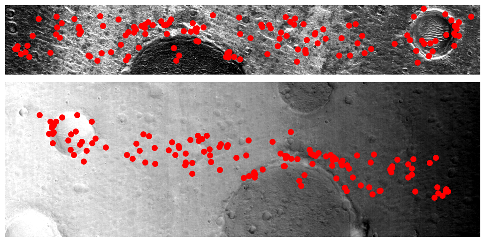

   Clean interest-point matches (red) between one full raw CaSSIS framelet (2018,
   top) and the raw CTX image over the same ground extent (2008, bottom). The
   similar afternoon illumination lets the pixel-level cross-sensor matching
   succeed. The raw CaSSIS framelet is flipped north-south relative to the raw CTX
   image, which the matching handles.

Run the joint jitter solve on the same image and camera lists, tied by the clean
matches from the bundle adjustment. The cross-sensor matches begin with a large
reprojection error, since that misregistration is what is being solved for, so
raise ``--max-initial-reprojection-error`` to keep them. Constrain the solve to
the jitter-free reference with ``--heights-from-dem`` and an anchor DEM
(:numref:`jitter_dem_constraint`, :numref:`jitter_anchor_points`), with a
per-camera position leash via ``--camera-position-uncertainty``::

    jitter_solve                              \
      --image-list images.txt                 \
      --camera-list cameras.txt               \
      --clean-match-files-prefix ba_joint/run \
      --heights-from-dem ctx_ref.tif          \
      --heights-from-dem-uncertainty 10       \
      --anchor-dem ctx_ref.tif                \
      --anchor-dem-uncertainty 100            \
      --num-anchor-points-per-tile 10         \
      --camera-position-uncertainty 100,100   \
      --num-lines-per-position 1000           \
      --num-lines-per-orientation 250         \
      --max-initial-reprojection-error 500    \
      --robust-threshold 0.5                  \
      --num-passes 2                        \
      --num-iterations 50                   \
      -o jitter/run

The goal is the CTX, so look at the two de-jittered surfaces side by side, then
at the CTX differences (:numref:`cassis_ox2_jitter_hillshade`).

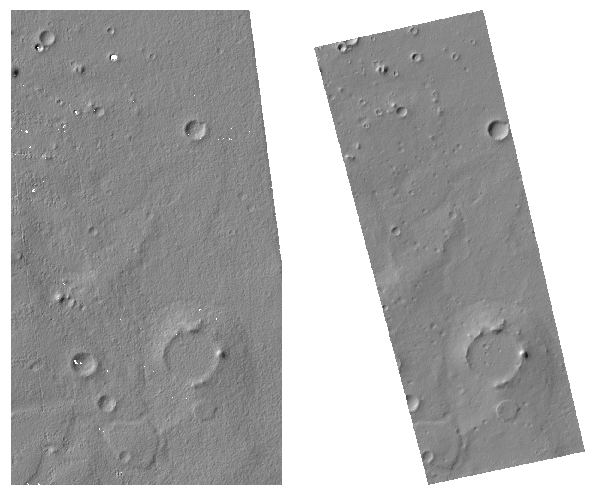

   Hillshades of the de-jittered CTX DEM (left) and the CaSSIS DEM (right), both
   cropped to the CaSSIS footprint.

Difference the CTX against the reference, before and after the solve
(:numref:`cassis_ox2_jitter_geodiff`). Before, the jitter shows as an along-track
banding, with a median of 0.1 m and an NMAD of 5.1 m. After, the banding is gone,
with a median of -0.5 m and an NMAD of 1.9 m. The residual is the single-pair CTX
roughness, not jitter, and no smoother than a single CTX pair can be. Correcting
the rotation before the solve is what makes the improvement this large; with a
residual rotation the after value was about 7 m.

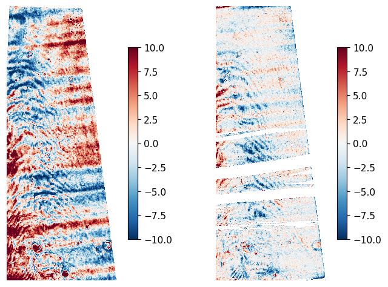

   CTX minus reference DEM, in meters, before (left) and after (right) the joint
   jitter solve. The along-track jitter banding, clear on the left with an NMAD of
   5.1 m, is removed on the right, NMAD 1.9 m.

The same holds against the CaSSIS DEM, over the smaller CaSSIS footprint
(:numref:`cassis_ox2_jitter_ctxcassis`). The CTX minus CaSSIS difference tightens
from a median of 0.4 m and an NMAD of 4.3 m to a median of -0.4 m and an NMAD of
1.9 m.

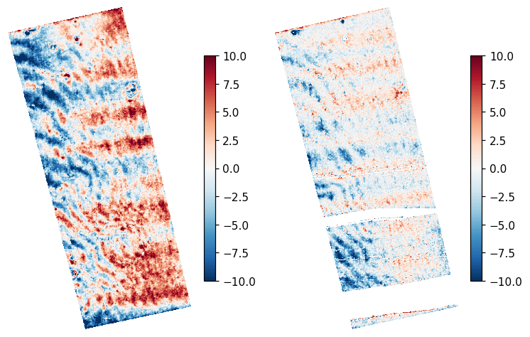

   CTX minus CaSSIS DEM, in meters, before (left) and after (right) the joint
   jitter solve, over the CaSSIS footprint.

The de-jittered CTX and the CaSSIS DEM register to each other at the sub-pixel
level. This is measured by correlating their hillshades in :ref:`correlator-mode`
and reading the raw disparity with :ref:`disparitydebug`, as in
:numref:`cassis_stereo` (:numref:`cassis_ox2_jitter_dd`).

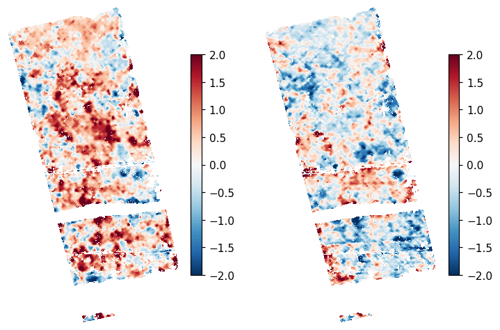

   Registration of the CaSSIS DEM to the de-jittered CTX, in pixels at 18 m/pixel.
   Left: horizontal disparity, mean 0.4 px and NMAD 0.7 px. Right: vertical
   disparity, mean -0.2 px and NMAD 0.6 px.

After the solve, mapproject the CaSSIS framelets at the native resolution onto the
smooth CTX DEM as usual (:numref:`cassis_stereo`), redo stereo, and make the DEM.
The joint solve de-jitters the CTX linescan over the area of interest. The CaSSIS
DEM stays essentially unchanged relative to the reference, its agreement moving
from an NMAD of 0.96 m to 0.97 m (:numref:`cassis_ox2_geodiff`). The CaSSIS
residual is the geometry of the individual frame cameras, which have no
along-track jitter degree of freedom, so a joint jitter solve does not reduce it.
