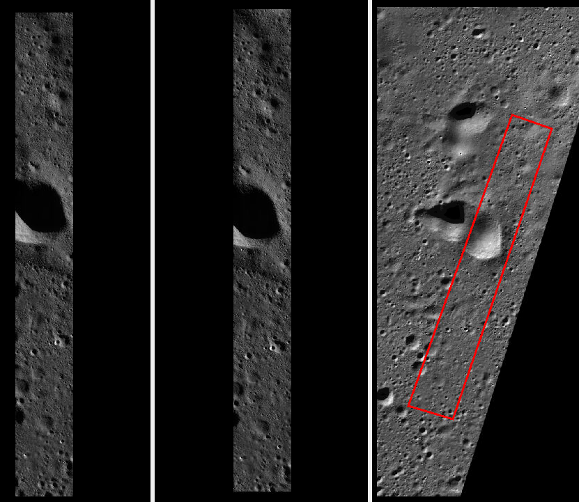
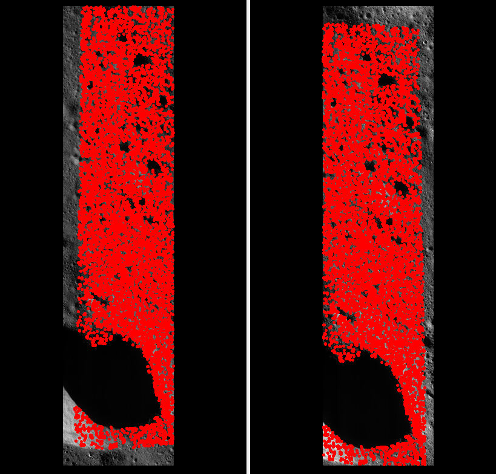
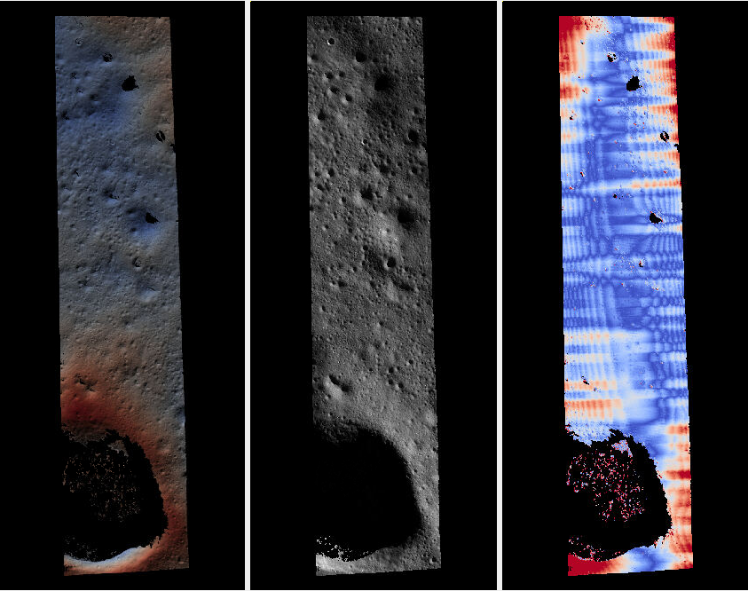
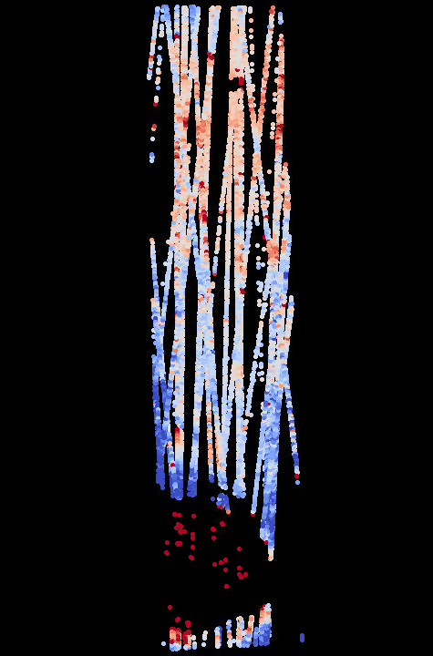

.. _chandrayaan2:

Chandrayaan-2 lunar orbiter
---------------------------

The example here shows how to create a 3D terrain model with `Chandrayaan-2 lunar
orbiter <https://en.wikipedia.org/wiki/Chandrayaan-2>`_ data. We will work with
the *Orbiter High Resolution Camera* (OHRC). A *Terrain Mapping Camera-2* (TMC-2)
example will be added at a later time.

For the moment, this exercise works only with the latest build of ASP
(:numref:`release`) on Linux. It requires that latest `ISIS
<https://github.com/DOI-USGS/ISIS3>`_ and `ALE
<https://github.com/DOI-USGS/ale>`_ are compiled
and installed from source (to separate locations), SPICE kernels are
downloaded from the `ISRO Science Data Archive
<https://pradan.issdc.gov.in/ch2/protected/browse.xhtml?id=spice>`_, and that
addendum (``iak``) directories for ISIS data are set up.

For now this is likely not reproducible, but is provided for reference.

Orbiter High Resolution Camera
~~~~~~~~~~~~~~~~~~~~~~~~~~~~~~

The OHRC instrument is a high-resolution camera with a 0.25 m ground sample
distance (GSD). It can adjust its look angle and acquire stereo pairs
(:numref:`stereo_pairs`).

Fetching the data
^^^^^^^^^^^^^^^^^

Raw and calibrated images for OHRC and TMC-2 cameras, as well as orthoimages and
Digital Elevation Models (DEMs) produced from TMC-2 camera data, can be
downloaded from `ISRO <https://chmapbrowse.issdc.gov.in/>`_.

The first step when using that portal is selecting the appropriate projection
for displaying the image footprints. Then, choose the instrument (OHRC or
TMC-2), data type (calibrated is suggested, but raw may do), and the area of
interest.

We selected the region of interest to be between 20 and 21 degrees in longitude,
and -70 to -67 degrees in latitude. The OHRC stereo pair we downloaded consisted
of images with the prefixes::

    ch2_ohr_nrp_20200827T0030107497_d_img_d18
    ch2_ohr_nrp_20200827T0226453039_d_img_d18

We also got a TMC-2 orthoimage and corresponding DEM with the prefixes::

    ch2_tmc_ndn_20231101T0125121377_d_oth_d18
    ch2_tmc_ndn_20231101T0125121377_d_dtm_d18

These are at lower resolution but useful for context.

  From left to right: The first and second OHRC images, and their approximate
  extent in the (many times larger) TMC-2 ortho image. Note that the illumination
  in the TMC-2 ortho image is very different.

Preprocessing
^^^^^^^^^^^^^

Each calibrated image dataset has ``.img`` and ``.xml`` files, with raw data and
a PDS-4 label. It will be convenient to rename these to ``ohrc/img1.img`` and
``ohrc/img1.xml`` for the first OHRC dataset, and analogously for the second
one.

The `isisimport <https://isis.astrogeology.usgs.gov/Application/presentation/Tabbed/isisimport/isisimport.html>`_ command converts the raw image to a .cub file::

    isisimport                 \
      from     = ohrc/img1.xml \
      to       = ohrc/img1.cub \
      template = ${template}

(and same for the second image). Here, the ``template`` variable is set such
as::

    template=/path/to/ISIS3/isis/appdata/import/PDS4/Chandrayaan2OHRC.tpl

If this command fails with a message about not being able to find a field in the
input xml file, it is suggested to edit that file and add a made-up entry for
that field. This is a temporary workaround for the problem of Chandrayaan-2 xml
files being rather diverse in what fields they record.

Then, the SPICE kernels are attached with `spiceinit <https://isis.astrogeology.usgs.gov/Application/presentation/Tabbed/spiceinit/spiceinit.html>`_::

    spiceinit from = ohrc/img1.cub

This expects the SPICE kernels for Chandrayaan-2 to exist locally (see the download link
above). For more information on ISIS data, see :numref:`planetary_images` and the
links from there.

Next, the CSM cameras are created (:numref:`csm`). This makes use of the `isd_generate <https://astrogeology.usgs.gov/docs/getting-started/using-ale/isd-generate/>`_ program installed with the latest ALE (link above). The command is::

    export ALESPICEROOT=$ISISDATA
    isd_generate -k ohrc/img1.cub ohrc/img1.cub

and same for ``img2.cub``. Here the .cub file is specified twice, with the
first file needed to read the SPICE kernels.

It is suggested to do a quick check on the produced ``ohrc/img1.json`` camera
with ``cam_test`` (:numref:`cam_test`).

The images can be inspected with ``stereo_gui`` (:numref:`stereo_gui`), as::

  stereo_gui ohrc/img1.cub ohrc/img2.cub

The resulting cub files are very large, on the order of 12,000 x 101,075 pixels.
For exploratory work, these can be cropped, with the ISIS `crop
<https://isis.astrogeology.usgs.gov/Application/presentation/Tabbed/crop/crop.html>`_
command, such as::

    crop                            \
      from     = ohrc/img1.cub      \
      to       = ohrc/img1_crop.cub \
      sample   = 1                  \
      line     = 1                  \
      nsamples = 12000              \
      nlines   = 50000

It is very important to ensure that the upper-left pixel (1, 1) is part of the
crop region, as otherwise the resulting images will be inconsistent with the CSM
camera models.

Bundle adjustment
^^^^^^^^^^^^^^^^^

We found that these images have notable pointing error, so bundle adjustment
(:numref:`bundle_adjust`) is needed::

    bundle_adjust                           \
      ohrc/img1_crop.cub ohrc/img2_crop.cub \
      ohrc/img1.json ohrc/img2.json         \
      --ip-per-image 30000                  \
      -o ba/run

This stereo pair was seen to have a decent convergence angle of 25 degrees
(:numref:`ba_conv_angle`).

  The left and right cropped OHRC images, and the interest point matches between
  them (as shown by ``stereo_gui``, :numref:`stereo_gui_view_ip`).

Stereo
^^^^^^

Next, we invoked ``parallel_stereo`` (:numref:`parallel_stereo`) to create a point cloud::

    parallel_stereo                     \
      --stereo-algorithm asp_mgm        \
      --clean-match-files-prefix ba/run \
      ohrc/img1_crop.cub                \
      ohrc/img2_crop.cub                \
      ba/run-img1.adjusted_state.json   \
      ba/run-img2.adjusted_state.json   \
      stereo/run

A DEM, orthoimage, and triangulation error image are made with ``point2dem``
(:numref:`point2dem`), as::

    point2dem           \
      --tr 1.0          \
      --errorimage      \
      stereo/run-PC.tif \
      --orthoimage      \
      stereo/run-L.tif

In a recent version of ASP these will, by default, have a local stereographic
projection.

  From left to right: Produced OHRC DEM (range of heights is 304 to 650 meters),
  orthoimage, and triangulation error image (blue = 0 m, red = 0.5 m). There is
  notable jitter, whose magnitude is on the order of image GSD (0.25 m), which
  is rather high, but which could be corrected (:numref:`jitter_solve`). Some
  unmodeled lens distortion also seems evident, which could be solved for
  (:numref:`kaguya_ba`).

Alignment
^^^^^^^^^

We will align the produced OHRC DEM to `LOLA
<https://ode.rsl.wustl.edu/moon/lrololadataPointSearch.aspx>`_, which is the
usual global reference coordinate system for the Moon.

The OHRC DEM turned out to be shifted relative to LOLA by about 4 km along the
satellite track, which resulted in failure to align with ``pc_align``
(:numref:`pc_align`).

Manual alignment was first performed (:numref:`manual-align`). The inputs were
the OHRC DEM and a LOLA point cloud, after gridding both with a 10 m grid size
and the same projection with ``point2dem``, and manually picking a few
visually similar features. That brought the cloud notably closer, and the output
transform from that alignment was used for aligning the full clouds as::

    pc_align                                  \
      --max-displacement 250                  \
      --initial-transform init-transform.txt  \
      --csv-format 2:lon,3:lat,4:radius_km    \
      --save-inv-transformed-reference-points \
      stereo/run-DEM.tif lola/lola.csv        \
      -o stereo/run-align

  The difference between the aligned OHRC DEM and LOLA point cloud. Blue: -5 m,
  red = 5 m. Given that the DEM, in principle, should have a vertical
  uncertainty of under 1 m, this could be better, but at least one is in the
  ballpark.

A terrain model created with the lower-resolution TMC-2 images would likely be
easier to align to LOLA, as it would have a much bigger extent.
