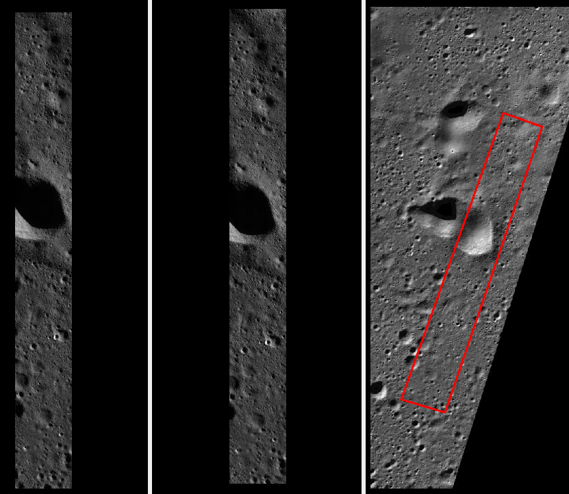
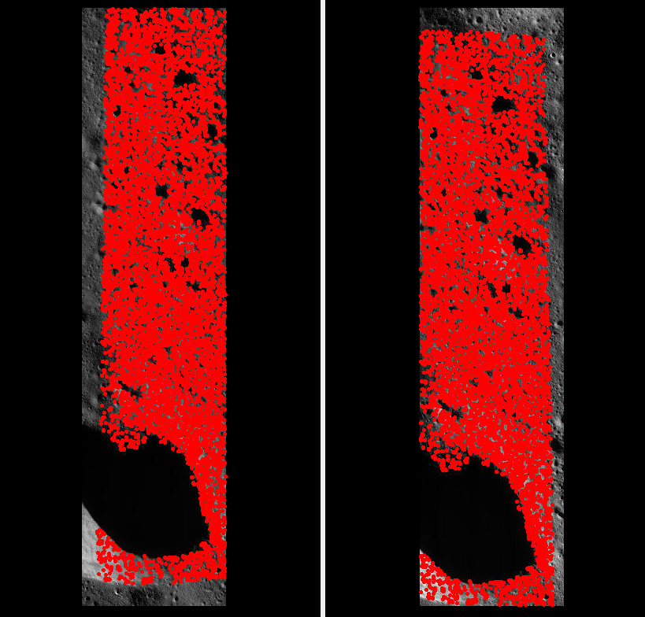
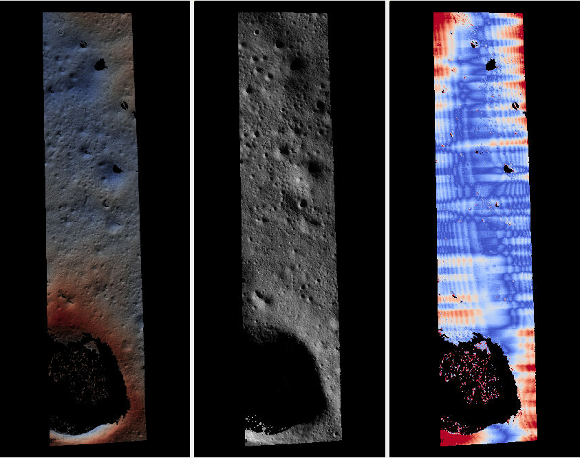
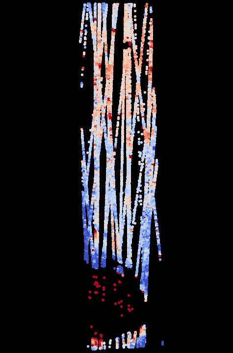
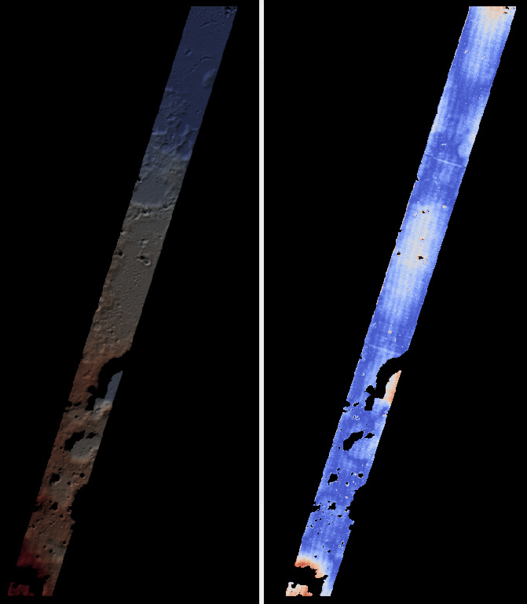

.. _chandrayaan2:

Chandrayaan-2 lunar orbiter
---------------------------

The example here shows how to create a 3D terrain model with `Chandrayaan-2
lunar orbiter <https://en.wikipedia.org/wiki/Chandrayaan-2>`_ data, using both
the *Orbiter High Resolution Camera* (OHRC) and the *Terrain Mapping Camera-2*
(TMC-2).

This workflow uses the Community Sensor Model (:numref:`csm`). It needs ASP
3.6.0 or later (:numref:`release`), `ISIS
<https://github.com/DOI-USGS/ISIS3>`_ 10.0.0_RC2 (or a later release-candidate
or stable version), `ALE <https://github.com/DOI-USGS/ale>`_ 1.1.3 or later, and
`USGSCSM <https://github.com/DOI-USGS/usgscsm>`_ 2.0.2 or later. All are available as
public conda packages (see below).

Chandrayaan-2 ISIS data should be downloaded as documented further down.

Environment setup
~~~~~~~~~~~~~~~~~

Fetch ISIS, ALE, USGSCSM, and ``rclone`` into a fresh conda environment::

    conda create -n isis10rc2                     \
       -c usgs-astrogeology/label/RC              \
       -c conda-forge                             \
       isis=10.0.0_RC2 ale=1.1.3 usgscsm=2.0.2 rclone

Activate the environment::

    conda activate isis10rc2
    export ISISROOT=$CONDA_PREFIX

Set the location of the ISIS data area (to be downloaded next)::

    export ISISDATA=$HOME/projects/isisdata
    export ALESPICEROOT=$ISISDATA

Install ASP, build 2026/5 or newer (:numref:`release`), as some
bugfixes for the Chandrayaan-2 cameras were incorporated at that
time. Set its path as documented there.

See also the `USGS ISIS TMC documentation
<https://astrogeology.usgs.gov/docs/getting-started/csm-stack/ingesting-tmc2/>`_.

ISIS kernels download 
~~~~~~~~~~~~~~~~~~~~~

The mission kernels are fetched with ``downloadIsisData``, which is shipped
with ISIS::

    downloadIsisData chandrayaan2 $ISISDATA

Note that the full ``chandrayaan2`` directory is large (about 200 GB), of which
essentially all is reconstructed attitude kernels (``ck``) covering the entire
mission since 2019. For a single OHRC image only one or two ``ck`` files are
needed. Fetching everything except ``ck`` takes only a few hundred MB::

    downloadIsisData chandrayaan2 $ISISDATA --exclude="kernels/ck/**"

The command::

    rclone --config $ISISROOT/etc/isis/rclone.conf \
      ls chandrayaan2:kernels/ck/

lists all available ``ck`` files. This can help pick the ones that span the
acquisition time of the products to be processed.

The ``ck`` files matching the orbit dates of interest can then be fetched
individually with ``rclone``, such as::

    rclone                                          \
      --config $ISISROOT/etc/isis/rclone.conf       \
      copy                                          \
      chandrayaan2:kernels/ck/                      \
      $ISISDATA/chandrayaan2/kernels/ck/            \
      --include="ch2_att_27Jul2020_04Sep2020_v1.bc" \
      --include="ch2_att_27Aug2020_04Oct2020_v1.bc" \
      --no-traverse -P

.. _isro_download:

Fetching images
~~~~~~~~~~~~~~~

Images, orthoimages, and DEMs for the OHRC and TMC-2 cameras can be
downloaded from `ISRO <https://chmapbrowse.issdc.gov.in/>`_.

Each download is a zip. After unzipping, locate the ``.img`` and ``.xml``
files and move them into a working directory. Keep the original ISRO
filenames; a rename can break ``isisimport``.

.. _chandra_ohrc:

Orbiter High Resolution Camera
~~~~~~~~~~~~~~~~~~~~~~~~~~~~~~

The OHRC instrument is a high-resolution camera with a 0.25 m ground sample
distance (GSD). It can adjust its look angle and acquire stereo pairs
(:numref:`stereo_pairs`).

Input data
^^^^^^^^^^

Download the OHRC stereo pair from ISRO as described in
:numref:`isro_download`. We selected the region of interest to be
between 20 and 21 degrees in longitude, and -70 to -67 degrees in latitude.
The prefixes are::

    ch2_ohr_nrp_20200827T0030107497_d_img_d18
    ch2_ohr_nrp_20200827T0226453039_d_img_d18

We also got a TMC-2 orthoimage and corresponding DEM with the prefixes::

    ch2_tmc_ndn_20231101T0125121377_d_oth_d18
    ch2_tmc_ndn_20231101T0125121377_d_dtm_d18

These are at lower resolution but useful for context.

  From left to right: The first and second OHRC images, and their approximate
  extent in the (many times larger) TMC-2 ortho image. Note that the illumination
  in the TMC-2 ortho image is very different.

Preprocessing
^^^^^^^^^^^^^

Each calibrated image dataset has ``.img`` and ``.xml`` files, with raw data and
a PDS-4 label.

The `isisimport <https://isis.astrogeology.usgs.gov/Application/presentation/Tabbed/isisimport/isisimport.html>`_ command converts the raw image to a .cub file::

    isisimport \
      from = ch2_ohr_nrp_20200827T0030107497_d_img_d18.xml \
      to   = ch2_ohr_nrp_20200827T0030107497_d_img_d18.cub

(and same for the second image). The PDS4 template is auto-detected in ISIS
10.

For simplicity, the output cub files are renamed to ``ohrc/img1.cub`` and
``ohrc/img2.cub``.

ISIS 10 is required for correct OHRC line exposure handling. Older
versions wrote a ``LineExposureDuration`` value 1000 times too large into
the cub label (the ISRO PDS4 label tags the field as ``unit="ms"`` but the
value is in microseconds), which then propagated into the CSM camera and
broke its time-vs-line mapping. Cubs and CSM JSONs created with older
ISIS should be rebuilt.

The ``isisimport`` command only works with raw images and not with ortho images.

The SPICE kernels are attached with `spiceinit <https://isis.astrogeology.usgs.gov/Application/presentation/Tabbed/spiceinit/spiceinit.html>`_::

    spiceinit from = ohrc/img1.cub

This expects the SPICE kernels for Chandrayaan-2 to exist locally under
``$ISISDATA/chandrayaan2/`` (see the download instructions above). For more
information on ISIS data, see :numref:`planetary_images` and the links from
there.

Next, CSM cameras are created with `isd_generate
<https://astrogeology.usgs.gov/docs/getting-started/using-ale/isd-generate/>`_
from the ALE package, following the linescan recipe in
:numref:`create_csm_linescan`::

    export ALESPICEROOT=$ISISDATA
    isd_generate -k ohrc/img1.cub ohrc/img1.cub
    isd_generate -k ohrc/img2.cub ohrc/img2.cub

It is expected that the environment is activated with ``conda activate``, with
``ISISROOT`` set to ``$CONDA_PREFIX``, and ``$ISISDATA`` and ``$ALESPICEROOT``
set, as described in the environment setup section above (not just the
environment's ``bin`` directory added to the path). Chandrayaan-2 uses the
SpiceQL mission database, and skipping ``conda activate`` can make
``isd_generate`` crash instead of printing a clear error, as SpiceQL then
cannot find its configuration under ``$CONDA_PREFIX``.

Check each produced CSM camera file with ``cam_test`` (:numref:`cam_test`),
against itself and against the ``.cub`` camera, before proceeding.

The images can be inspected with ``stereo_gui`` (:numref:`stereo_gui`), as::

  stereo_gui ohrc/img1.cub ohrc/img2.cub

The resulting cub files are very large, on the order of 12,000 x 101,075 pixels.
For exploratory work, these can be cropped, with the ISIS `crop
<https://isis.astrogeology.usgs.gov/Application/presentation/Tabbed/crop/crop.html>`_
command, such as::

    crop                            \
      from     = ohrc/img1.cub      \
      to       = ohrc/img1_crop.cub \
      sample   = 1                  \
      line     = 1                  \
      nsamples = 12000              \
      nlines   = 50000

It is very important to ensure that the upper-left pixel (1, 1) is part of the
crop region, as otherwise the resulting images will be inconsistent with the CSM
camera models.

Bundle adjustment
^^^^^^^^^^^^^^^^^

We found that these images have notable pointing error, so bundle adjustment
(:numref:`bundle_adjust`) is needed::

    bundle_adjust                           \
      ohrc/img1_crop.cub ohrc/img2_crop.cub \
      ohrc/img1.json ohrc/img2.json         \
      --ip-per-image 30000                  \
      -o ba/run

This stereo pair has a convergence angle of about 25 degrees
(:numref:`ba_conv_angle`).

  The left and right cropped OHRC images, and the interest point matches between
  them (as shown by ``stereo_gui``, :numref:`stereo_gui_view_ip`).

Stereo
^^^^^^

Just as for TMC (:numref:`chandra2_tmc`), it is suggested to run stereo with mapprojected
images (:numref:`mapproj-example`) for most reliable results.

Here we do a preliminary ``parallel_stereo`` (:numref:`parallel_stereo`) run on the crops from above without mapprojected images::

    parallel_stereo                     \
      --alignment-method affineepipolar \
      --stereo-algorithm asp_mgm        \
      --clean-match-files-prefix ba/run \
      --nodes-list nodes.txt            \
      ohrc/img1_crop.cub                \
      ohrc/img2_crop.cub                \
      ba/run-img1.adjusted_state.json   \
      ba/run-img2.adjusted_state.json   \
      stereo/run

See :numref:`pbs_slurm` for running on multiple nodes.

A DEM, orthoimage, and triangulation error image are made with ``point2dem``
(:numref:`point2dem`), as::

    point2dem           \
      --tr 1.0          \
      --errorimage      \
      stereo/run-PC.tif \
      --orthoimage      \
      stereo/run-L.tif

  From left to right: Produced OHRC DEM (range of heights is 304 to 650 meters),
  orthoimage, and triangulation error image (blue = 0 m, red = 0.5 m). There is
  notable jitter, whose magnitude is on the order of image GSD (0.25 m), which
  is rather high, but which could be corrected (:numref:`jitter_solve`). Some
  unmodeled lens distortion also seems evident, which could be solved for
  (as in :numref:`kaguya_ba`).

Alignment to LOLA
^^^^^^^^^^^^^^^^^

We aligned the produced OHRC DEM to `LOLA
<https://ode.rsl.wustl.edu/moon/tools?displaypage=lolardr>`_
(:numref:`csv_format`), which is the usual global reference coordinate system
for the Moon. See :numref:`ohrc_dem_align` for a strategy for alignment to a
prior DEM.

The OHRC DEM turned out to be shifted relative to LOLA by about 4 km along the
satellite track, which resulted in failure to align with ``pc_align``
(:numref:`pc_align`).

Manual alignment was first performed (:numref:`manual-align`). The inputs were
the OHRC DEM and a LOLA point cloud, after gridding both with a 10 m grid size
and the same projection with ``point2dem``, and manually picking a few
visually similar features. That brought the cloud notably closer, and the output
transform from that alignment was used for aligning the full clouds as::

    pc_align                                  \
      --max-displacement 250                  \
      --initial-transform init-transform.txt  \
      --csv-format 2:lon,3:lat,4:radius_km    \
      --save-inv-transformed-reference-points \
      stereo/run-DEM.tif lola/lola.csv        \
      -o stereo/run-align

  The difference between the aligned OHRC DEM and LOLA point cloud. Blue = -5 m,
  red = 5 m. Given that the DEM, in principle, should have a vertical
  uncertainty of under 1 m, this could be better, but at least we are in the
  ballpark.

A terrain model created with the lower-resolution TMC-2 images would likely be
easier to align to LOLA, as it would have a much bigger extent.

.. _ohrc_dem_align:

Alignment to a prior DEM
^^^^^^^^^^^^^^^^^^^^^^^^

For sites sufficiently close to the poles, a gridded LOLA product is available.
Some examples are given in :numref:`sfs_initial_terrain`. Alternatively, one
could try aligning to a DEM produced with LRO NAC or TMC-2 images.

Another option is a Kaguya TC DTM (~10 m/pixel, near-global; :numref:`kaguya`),
which is coarser than TMC-2 but finer than LOLA.

In either case, the large misalignment mentioned earlier will make ICP-based
alignment methods fail.

It is suggested to try the correlation-based alignment (:numref:`pc_corr`). This
requires gridding the input DEMs with cubic spline interpolation (``gdalwarp -r
cubicspline``) to a shared grid size and projection (the chosen grid size should
likely be closer to the grid size of the coarser DEM). Inspect the hillshades
visually for similarity before trying this method.

If this method succeeds, the produced alignment transform can be used to seed
the alignment to LOLA (:numref:`prevtrans`).

.. _chandra2_tmc:

Terrain Mapping Camera-2
~~~~~~~~~~~~~~~~~~~~~~~~

The TMC-2 instrument is a 3-line pushbroom camera, with separate forward (fwd),
downward-pointing (nadir), and backward (aft) detectors. The fwd detector looks
~25 degrees ahead of nadir and the aft detector looks ~25 degrees behind, a
setup which is well-suited to stereo with any of these image pairs. The ground
sample distance is about 5 meters at 100 km altitude.

All three detectors record simultaneously, so a substantial ground swath is
imaged by all of them.

Input data
^^^^^^^^^^

Download the TMC-2 forward, nadir, and aft stereo triplet from ISRO as
described in :numref:`isro_download`. The three acquisitions
cover a shared ground swath on the same orbit pass::

    ch2_tmc_ncf_20231101T0125121344_d_img_d18
    ch2_tmc_ncn_20231101T0125121377_d_img_d18
    ch2_tmc_nca_20231101T0125121377_d_img_d18

We use only the fwd/aft pair below for the largest stereo convergence angle.

The corresponding pre-existing DTM (``ch2_tmc_ndn_20231101T0125121377``,
mentioned earlier) covers the same orbit pass. These images include the
footprint of the OHRC images from earlier but extend well beyond them.

Preprocessing
^^^^^^^^^^^^^

We use only the CSM camera models (:numref:`csm`), as it appears that the
non-nadir TMC ISIS camera models in the .cub files are still problematic (as of
5/2026). The fix is to skip ``spiceinit`` entirely and run ``isd_generate``
directly.

ALE 1.1.3 (without ``spiceinit``-attached kernels) needs a metakernel file
under ``$ALESPICEROOT`` to locate SPICE kernels, but the USGS Chandrayaan-2
ISIS data area (as of 5/2026) does not ship one. The workaround is to create
a small metakernel locally at::

    $ISISDATA/chandrayaan2/kernels/mk/ch2_v01.tm

listing the kernel files. The values in ``PATH_VALUES`` should be absolute
due to limitations in ALE, and should be correct for the local file system.
See the NAIF `Metakernel reference
<https://naif.jpl.nasa.gov/pub/naif/toolkit_docs/FORTRAN/req/kernel.html>`_
for the file format and compare with existing ``.tm`` files for other
missions.

With the metakernel in place, the workflow is as follows::

    export ALESPICEROOT=$ISISDATA

    isisimport \
      from = ch2_tmc_ncf_20231101T0125121344_d_img_d18.xml \
      to   = ch2_tmc_ncf_20231101T0125121344_d_img_d18.cub

and same for the other ones.

For simplicity, the output cub files are renamed to ``tmc/fwd.cub`` and
``tmc/aft.cub``. Then run::

    isd_generate tmc/fwd.cub
    isd_generate tmc/aft.cub

We skipped the ``-k`` option (read kernels from a cub) here given the current
issue with ``spiceinit`` mentioned earlier.

As of ASP 3.7.0 (June 2026), with the custom-built ISIS 10.0.0, ALE 1.2.0, and
USGSCSM 2.0.2 shipped with it (:numref:`conda_intro`), this is resolved.
``spiceinit`` can be run on the TMC cubes and ``isd_generate`` invoked with the
``-k`` option, as done for OHRC above (:numref:`csm`). The alternative workflow
is then::

    spiceinit from = tmc/fwd.cub
    spiceinit from = tmc/aft.cub

    isd_generate -k tmc/fwd.cub tmc/fwd.cub
    isd_generate -k tmc/aft.cub tmc/aft.cub

For the non-nadir fwd channel, the resulting CSM camera agrees with the ISIS
camera to about 0.0001 pixels, and is equivalent to the metakernel-based ISD
above. Either workflow can be used.

Check each JSON with ``cam_test`` (:numref:`cam_test`).

Bundle adjustment
^^^^^^^^^^^^^^^^^

Bundle-adjust (:numref:`bundle_adjust`) the fwd/aft pair with the JSONs as
cameras::

    bundle_adjust                           \
      tmc/fwd.cub tmc/aft.cub               \
      tmc/fwd.json tmc/aft.json             \
      --num-iterations 100 --num-passes 2   \
      --camera-weight 0 --tri-weight 0.1    \
      --remove-outliers-params "75 3 50 50" \
      --ip-per-image 100000                 \
      --max-pairwise-matches 50000          \
      -o ba/run

It is suggested to inspect the produced report files (:numref:`ba_out_files`).

Stereo
^^^^^^

Stereo with mapprojected images (:numref:`mapproj-example`) is strongly
suggested for TMC. Using raw images with alignment-method ``affineepipolar`` or
``local_epipolar`` (:numref:`image_alignment`) is not recommended given the
extreme image aspect ratio (the images are about :math:`4000 \times 180000`
pixels) and the large change in perspective between the images.

The reference DEM for mapprojection can be a prior TMC DTM provided by ISRO
(``ch2_tmc_ndn_*_d_dtm_d18``), a LOLA gridded DEM
(:numref:`sfs_initial_terrain`), a DEM gridded from LOLA samples with
``point2dem`` (:numref:`point2dem_csv`), or a Kaguya TC DTM (~10 m/pixel,
near-global; :numref:`kaguya`), which is finer than LOLA and useful where no
local TMC DTM exists. Fill in holes
(:numref:`dem_mosaic_extrapolate`) and blur (``dem_mosaic --dem-blur-sigma 5``,
:numref:`dem_mosaic_blur`) such a DEM. Call it ``ref.tif``.

We employ a south polar stereographic projection given the location of the site.

::

    proj="+proj=stere +lat_0=-90 +lon_0=0 +k=1 +x_0=0 +y_0=0 +R=1737400 +units=m +no_defs"

Mapproject each cub at the native ~5 m/pixel resolution::

    mapproject --tr 5 --t_srs "$proj" \
      ref.tif                         \
      tmc/fwd.cub                     \
      ba/run-fwd.adjusted_state.json  \
      tmc/fwd.map.tif

    mapproject --tr 5 --t_srs "$proj" \
      ref.tif                         \
      tmc/aft.cub                     \
      ba/run-aft.adjusted_state.json  \
      tmc/aft.map.tif

Run stereo with ``--alignment-method none`` on the mapprojected pair,
the bundle-adjusted JSON state files, and the reference DEM as the last
argument::

    parallel_stereo                   \
      --alignment-method none         \
      --stereo-algorithm asp_mgm      \
      --subpixel-mode 9               \
      --nodes-list nodes.txt          \
      tmc/fwd.map.tif tmc/aft.map.tif \
      ba/run-fwd.adjusted_state.json  \
      ba/run-aft.adjusted_state.json  \
      stereo/run                      \
      ref.tif

See :numref:`pbs_slurm` for running on multiple nodes.

Produce a DEM at 20 m / pixel (4x input image resolution,
:numref:`post-spacing`) with ``point2dem`` (:numref:`point2dem`). The
``--errorimage`` flag writes the triangulation error image
(:numref:`point2dem_ortho_err`). This useful for inspecting along-track jitter
(:numref:`jitter_solve`).

::

    point2dem --tr 20 --t_srs "$proj"  \
      --errorimage --orthoimage       \
      stereo/run-L.tif stereo/run-PC.tif

   Left: portion of the colorized hillshaded DEM produced with mapprojected TMC
   images. Color range -1130 to 2400 m. Right: triangulation error image, range
   0 to 5 m (the ground sample distance).

The same recipe applies to fwd/nadir and nadir/aft once a triplet bundle
adjustment has produced ``run-nadir.adjusted_state.json``.

For preliminary investigations, run stereo with images mapprojected onto a
small cropped version of the reference DEM.
