.. _chandrayaan2:

Chandrayaan-2 lunar orbiter
---------------------------

The example here shows how to create a 3D terrain model with `Chandrayaan-2
lunar orbiter <https://en.wikipedia.org/wiki/Chandrayaan-2>`_ data, using both
the *Orbiter High Resolution Camera* (OHRC) and the *Terrain Mapping Camera-2*
(TMC-2).

This workflow needs ASP 3.7.0 or later, installed via conda together with its
bundled ISIS, ALE, and USGSCSM, as described in the environment setup below.

Chandrayaan-2 ISIS data should be downloaded as documented further down.

Environment setup
~~~~~~~~~~~~~~~~~

Install ASP 3.7.0 as documented in :numref:`conda_intro`. That release ships its
own custom-built ISIS 10.0.0, along with custom `ALE
<https://github.com/DOI-USGS/ale>`_, `USGSCSM
<https://github.com/DOI-USGS/usgscsm>`_, and SpiceQL, with the Chandrayaan-2
camera fixes already included. These are newer than the current public ISIS,
ALE, and USGSCSM releases, and are needed for the fore and aft TMC-2 cameras.
The conda environment (named ``asp`` there) already contains all of them.
Activate it and point ISIS at it::

    conda activate asp
    export ISISROOT=$CONDA_PREFIX

Set the location of the ISIS data area (to be downloaded next)::

    export ISISDATA=$HOME/projects/isisdata
    export ALESPICEROOT=$ISISDATA

The kernel download below uses ``rclone``. If it is not already in the
environment, install it with ``conda install -c conda-forge rclone``.

See also the `USGS ISIS TMC documentation
<https://astrogeology.usgs.gov/docs/getting-started/csm-stack/ingesting-tmc2/>`_.

ISIS kernels download 
~~~~~~~~~~~~~~~~~~~~~

The mission kernels are fetched with ``downloadIsisData``, which is shipped
with ISIS::

    downloadIsisData chandrayaan2 $ISISDATA

Note that the full ``chandrayaan2`` directory is large (about 200 GB), of which
essentially all is reconstructed attitude kernels (``ck``) covering the entire
mission since 2019. For a single OHRC image only one or two ``ck`` files are
needed. Fetching everything except ``ck`` takes only a few hundred MB::

    downloadIsisData chandrayaan2 $ISISDATA --exclude="kernels/ck/**"

The command::

    rclone --config $ISISROOT/etc/isis/rclone.conf \
      ls chandrayaan2:kernels/ck/

lists all available ``ck`` files. This can help pick the ones that span the
acquisition time of the products to be processed.

The ``ck`` files matching the orbit dates of interest can then be fetched
individually with ``rclone``, such as::

    rclone                                          \
      --config $ISISROOT/etc/isis/rclone.conf       \
      copy                                          \
      chandrayaan2:kernels/ck/                      \
      $ISISDATA/chandrayaan2/kernels/ck/            \
      --include="ch2_att_27Jul2020_04Sep2020_v1.bc" \
      --include="ch2_att_27Aug2020_04Oct2020_v1.bc" \
      --no-traverse -P

.. _isro_download:

Fetching images
~~~~~~~~~~~~~~~

Images, orthoimages, and DEMs for the OHRC and TMC-2 cameras can be
downloaded from `ISRO <https://chmapbrowse.issdc.gov.in/>`_.

Each download is a zip. After unzipping, locate the ``.img`` and ``.xml``
files and move them into a working directory. Keep the original ISRO
filenames; a rename can break ``isisimport``.

.. _chandra_ohrc:

Orbiter High Resolution Camera
~~~~~~~~~~~~~~~~~~~~~~~~~~~~~~

The OHRC instrument is a high-resolution camera with a 0.25 m ground sample
distance (GSD). It can adjust its look angle and acquire stereo pairs
(:numref:`stereo_pairs`).

Input data
^^^^^^^^^^

Download the OHRC stereo pair from ISRO as described in
:numref:`isro_download`. We selected the region of interest to be
between 20 and 21 degrees in longitude, and -70 to -67 degrees in latitude.
The prefixes are::

    ch2_ohr_nrp_20200827T0030107497_d_img_d18
    ch2_ohr_nrp_20200827T0226453039_d_img_d18

We also got a TMC-2 orthoimage and corresponding DEM with the prefixes::

    ch2_tmc_ndn_20231101T0125121377_d_oth_d18
    ch2_tmc_ndn_20231101T0125121377_d_dtm_d18

These are at lower resolution but useful for context.

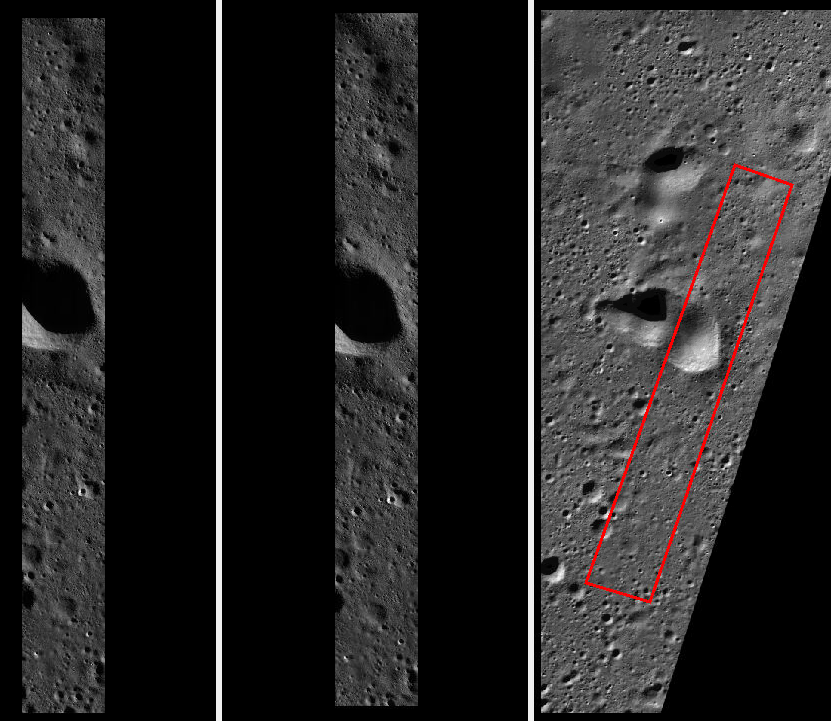

  From left to right: The first and second OHRC images, and their approximate
  extent in the (many times larger) TMC-2 ortho image. Note that the illumination
  in the TMC-2 ortho image is very different.

Preprocessing
^^^^^^^^^^^^^

The steps below assume the ASP 3.7.0 conda environment, which ships a custom
build of ISIS, ALE, and USGSCSM (:numref:`conda_intro`). If ``spiceinit`` or
``isd_generate -k`` errors, the active ISIS, ALE, or USGSCSM is likely too old,
or a separately installed ISIS is being used instead of the one bundled with
ASP. Activate the ASP 3.7.0 environment, or use a recent development ISIS build
from 2026.06.07 or later from the dev label of the ``usgs-astrogeology`` channel
(``usgs-astrogeology/label/dev``).

Each calibrated image dataset has ``.img`` and ``.xml`` files, with raw data and
a PDS-4 label.

The `isisimport <https://isis.astrogeology.usgs.gov/Application/presentation/Tabbed/isisimport/isisimport.html>`_ command converts the raw image to a .cub file::

    isisimport                                             \
      from = ch2_ohr_nrp_20200827T0030107497_d_img_d18.xml \
      to   = ch2_ohr_nrp_20200827T0030107497_d_img_d18.cub

(and same for the second image). The PDS4 template is auto-detected in ISIS
10.

For simplicity, the output cub files are renamed to ``ohrc/img1.cub`` and
``ohrc/img2.cub``.

The ``isisimport`` command only works with raw images and not with ortho images.

The SPICE kernels are attached with `spiceinit <https://isis.astrogeology.usgs.gov/Application/presentation/Tabbed/spiceinit/spiceinit.html>`_::

    spiceinit from = ohrc/img1.cub

This expects the SPICE kernels for Chandrayaan-2 to exist locally under
``$ISISDATA/chandrayaan2/`` (see the download instructions above). For more
information on ISIS data, see :numref:`planetary_images` and the links from
there.

Next, CSM cameras are created with `isd_generate
<https://astrogeology.usgs.gov/docs/getting-started/using-ale/isd-generate/>`_
from the ALE package, following the linescan recipe in
:numref:`create_csm_linescan`::

    export ALESPICEROOT=$ISISDATA
    isd_generate -k ohrc/img1.cub ohrc/img1.cub
    isd_generate -k ohrc/img2.cub ohrc/img2.cub

It is expected that the environment is activated with ``conda activate``, with
``ISISROOT`` set to ``$CONDA_PREFIX``, and ``$ISISDATA`` and ``$ALESPICEROOT``
set, as described in the environment setup section above (not just the
environment's ``bin`` directory added to the path). Chandrayaan-2 uses the
SpiceQL mission database, and skipping ``conda activate`` can make
``isd_generate`` crash instead of printing a clear error, as SpiceQL then
cannot find its configuration under ``$CONDA_PREFIX``.

Check each produced CSM camera file with ``cam_test`` (:numref:`cam_test`),
against itself and against the ``.cub`` camera, before proceeding.

The images can be inspected with ``stereo_gui`` (:numref:`stereo_gui`), as::

  stereo_gui ohrc/img1.cub ohrc/img2.cub

The resulting cub files are very large, on the order of 12,000 x 101,075 pixels.
The full images are processed throughout.

Bundle adjustment
^^^^^^^^^^^^^^^^^

We found that these images have notable pointing error, so bundle adjustment
(:numref:`bundle_adjust`) is needed::

    bundle_adjust                           \
      ohrc/img1.cub ohrc/img2.cub           \
      ohrc/img1.json ohrc/img2.json         \
      --num-iterations 100 --num-passes 2   \
      --camera-weight 0 --tri-weight 0.1    \
      --remove-outliers-params "75 3 50 50" \
      --ip-per-image 50000                  \
      --max-pairwise-matches 50000          \
      -o ba/run

This stereo pair has a convergence angle of about 25 degrees
(:numref:`ba_conv_angle`). Inspect the report files (:numref:`ba_out_files`);
the reprojection error should be sub-pixel.

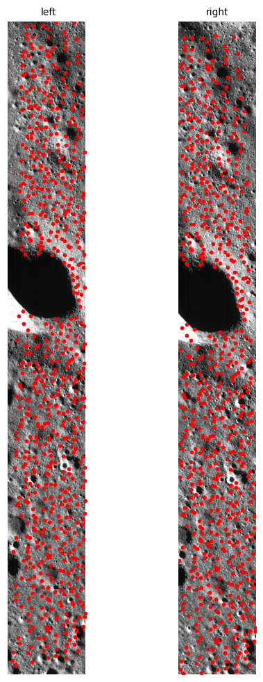

  The left and right OHRC images, and the interest point matches between them.
  These can be plotted with ``stereo_gui``, :numref:`stereo_gui_view_ip`).

Stereo
^^^^^^

The full-site DEM is made with local epipolar alignment
(:numref:`image_alignment`) on the raw images, with the bundle-adjusted
cameras. This handles the extreme aspect ratio per tile and covers the whole
strip::

    parallel_stereo                     \
      --alignment-method local_epipolar \
      --stereo-algorithm asp_mgm        \
      --subpixel-mode 9                 \
      --nodes-list nodes.txt            \
      ohrc/img1.cub ohrc/img2.cub       \
      ba/run-img1.adjusted_state.json   \
      ba/run-img2.adjusted_state.json   \
      stereo/run

See :numref:`pbs_slurm` for running on multiple nodes. 

This needs build 2026/08/08 (:numref:`release`) or later, which improved the
robustness of local-epipolar alignment.

Make the DEM at 1 m, with the orthoimage and triangulation error
(:numref:`point2dem`)::

    point2dem --tr 1.0 --errorimage --orthoimage \
      stereo/run-PC.tif stereo/run-L.tif

.. _ohrc_shadow_mask:

The deep-shadow crater on this strip has almost no image signal, so stereo
leaves an artifact there: a spurious block in the DEM with high triangulation
error. Mask it out with the orthoimage, which is near zero in shadow. First
build a binary mask that is 1 on lit terrain and 0 in shadow
(:numref:`image_calc_create_mask`)::

    thresh=0.1
    image_calc -c "gte(var_0, $thresh, 1, 0)" \
      --output-nodata-value -1e+6             \
      -d float32                              \
      stereo/run-DRG.tif                      \
      -o stereo/run-shadow_mask.tif

Choose the threshold from the orthoimage histogram, large enough to nuke the
black crater but not the lit terrain (here 0.1). Then apply the mask to the DEM,
the orthoimage, and the triangulation error, which share the same grid
(:numref:`image_calc_mask`)::

    image_calc -c "eq(var_1, 0, -9999, var_0)"      \
      --output-nodata-value -9999                   \
      -d float32                                    \
      stereo/run-DEM.tif stereo/run-shadow_mask.tif \
      -o stereo/run-DEM_masked.tif

The same command is applied to ``run-DRG.tif`` and ``run-IntersectionErr.tif``.
The masked products are used for all inspection and figures below.

.. _ohrc_dem_align:

Alignment to a reference DEM
^^^^^^^^^^^^^^^^^^^^^^^^^^^^

The OHRC DEM is shifted from the global reference by about 2.1 km along the
track. ICP (:numref:`align-method`) and sparse hillshade-feature alignment
(:numref:`pc_hillshade`) fail. The robust route is correlation-based alignment
(:numref:`pc_corr`). This can be fragile, so careful inspection is needed.

The chosen reference is produced by merging with ``dem_mosaic`` a set of Kaguya
TC DTMs (~32 m/pixel, :numref:`kaguya_products`).

Set a local south polar stereographic projection centered on the site::

    proj="+proj=stere +lat_0=-68.4 +lon_0=20.9 +k=1 +x_0=0 +y_0=0 +R=1737400 +units=m +no_defs"

Regrid the produced OHRC DEM and the reference to the same grid size,
projection, and extent with ``gdalwarp`` (:numref:`gdal_tools`), along
the lines of::

    gdalwarp -r cubicspline -t_srs "$proj" \
      -te <ref extent> -tr 32 32           \
      stereo/run-DEM.tif ohrc_on_ref.tif

Hillshade both (:numref:`gdal_hill`)::

    gdaldem hillshade -multidirectional ref.tif         ref_hill.tif
    gdaldem hillshade -multidirectional ohrc_on_ref.tif src_hill.tif

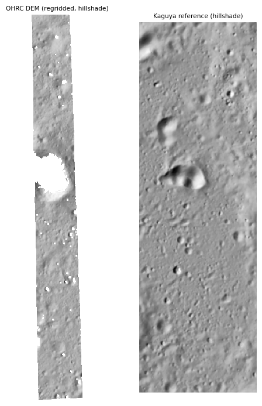

   The regridded OHRC DEM and the Kaguya reference, both hillshaded, with a
   shared projection, grid, and extent. They must look visually similar for the
   correlation to succeed. The reference goes beyond the OHRC DEM to take into
   account the initial misregistration.

Correlate the hillshades (:numref:`correlator-mode`) and extract a dense match
file. The search range must large enough to incorporate the expected
misalignment (shift). Here the shift was found visually to be about 66 px (2.1
km at 32 m), so ``--corr-search -100 -100 100 100`` is enough. For a larger
shift, increase this range. Too large a search range results in slow processing
and risks locking onto a wrong solution.

::

    parallel_stereo --correlator-mode    \
      --stereo-algorithm asp_mgm         \
      --subpixel-mode 9                  \
      --corr-kernel 9 9                  \
      --corr-search -100 -100 100 100    \
      --ip-per-image 40000               \
      --num-matches-from-disparity 40000 \
      ref_hill.tif src_hill.tif run_corr/run

Inspect the disparity ``run_corr/run-F.tif`` (:numref:`raw_disp`). A smoothly
varying, near-constant shift means a good lock. Inspect this dense match file
then pass it to ``pc_align`` (:numref:`pc_corr`)::

    pc_align --max-displacement -1 --num-iterations 0         \
      --max-num-reference-points 1000000                      \
      --match-file run_corr/run-disp-ref_hill__src_hill.match \
      --initial-transform-from-hillshading rigid              \
      --initial-transform-ransac-params 1000 3                \
      --save-transformed-source-points                        \
      ref.tif ohrc_on_ref.tif -o run_align/run

Grid the aligned cloud ``run_align/run-trans_source.tif`` with ``point2dem`` and
inspect it against the reference: a notable crater that was split before should
snap together.

Mapprojection
^^^^^^^^^^^^^

The transform ``run_align/run-transform.txt`` maps the OHRC DEM to the reference.
Apply it to the bundle-adjusted cameras (:numref:`prevtrans`,
:numref:`ba_pc_align`), so both cameras move into the reference frame::

    bundle_adjust                                     \
      ohrc/img1.cub ohrc/img2.cub                     \
      ba/run-img1.adjusted_state.json                 \
      ba/run-img2.adjusted_state.json                 \
      --initial-transform run_align/run-transform.txt \
      --apply-initial-transform-only                  \
      --inline-adjustments                            \
      -o ba_align/run

Mapproject each image at the native ~0.25 m/pixel resolution onto the reference
DEM, with the aligned cameras. The reference is gapless, so no hole filling is
needed. The command for the first image is below; the second is identical with
its own cub and camera::

    mapproject --tr 0.25                     \
      --t_srs "$proj"                        \
      ref.tif                                \
      ohrc/img1.cub                          \
      ba_align/run-img1.adjusted_state.json  \
      ohrc/img1.map.tif

The projection variable was set earlier in the text. Both mapprojected images
inherit the reference DEM's projection, so they are on a common grid.

Stereo with mapprojected images
^^^^^^^^^^^^^^^^^^^^^^^^^^^^^^^

Run stereo with mapprojected images (:numref:`mapproj-example`) and the aligned
CSM cameras::

    parallel_stereo                         \
      --alignment-method none               \
      --stereo-algorithm asp_mgm            \
      --subpixel-mode 9                     \
      --nodes-list nodes.txt                \
      ohrc/img1.map.tif ohrc/img2.map.tif   \
      ba_align/run-img1.adjusted_state.json \
      ba_align/run-img2.adjusted_state.json \
      stereo_map/run                        \
      ref.tif

Produce the DEM at 1 m per pixel, with the orthoimage and triangulation error::

    point2dem --tr 1.0      \
      --t_srs "$proj"       \
      --errorimage          \
      --orthoimage          \
      stereo_map/run-PC.tif \
      stereo_map/run-L.tif

As in the local-epipolar pass, the deep-shadow crater is a data void. Apply the
same shadow mask (:ref:`described above <ohrc_shadow_mask>`) to the DEM,
orthoimage, and triangulation error before inspecting.

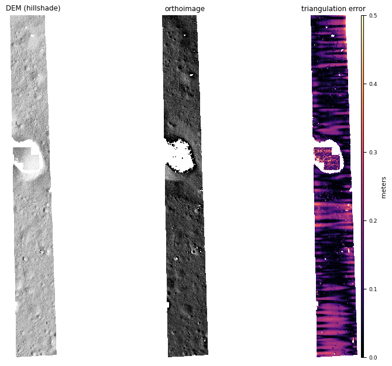

   The final DEM (hillshade), orthoimage, and triangulation error (0 to 0.5 m),
   after masking the shadow crater. The median triangulation error is 0.07 m. The
   horizontal striping in the error is along-track jitter at the 0.25 m GSD scale,
   which could be reduced by solving for jitter (:numref:`jitter_solve`).

This is a solid ~65.6 km^2 strip, improving on the first pass in both coverage
(65.6 vs 64.2 km^2) and triangulation error (0.070 vs 0.082 m).

Vertical accuracy vs LOLA
^^^^^^^^^^^^^^^^^^^^^^^^^

The reference itself may be slightly offset from LOLA (:numref:`lola_csv`), the
global standard, and the DEM inherits that.
Difference the aligned DEM and the reference against the raw LOLA shots
(:numref:`lola_csv`, :numref:`geodiff`) to check::

    geodiff dem.tif lola_shots.csv \
      --csv-format "2:lon 3:lat 4:radius_km" -o dem_vs_lola

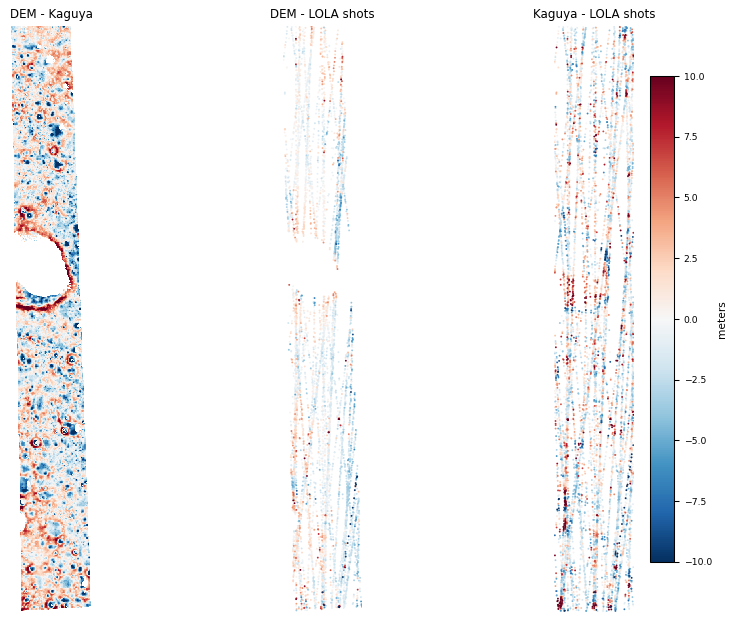

   Final DEM minus Kaguya (raster), and the DEM and Kaguya each minus the LOLA
   shots, all cropped to the DEM extent and clamped +-10 m. The masked crater is
   the empty hole. The DEM is essentially unbiased against Kaguya (median -0.02 m)
   and sub-meter against the raw LOLA shots (-0.47 m). Kaguya itself sits about
   -0.60 m below LOLA over this area, so the DEM matches true ground about as well
   as the reference it aligned to; the small residual is that reference offset,
   not a stereo error.

Refinement of alignment to LOLA
^^^^^^^^^^^^^^^^^^^^^^^^^^^^^^^

The DEM is now within about a meter of LOLA, the global standard. Since it is
already in the ballpark, the alignment can be refined directly against the LOLA
shots with ordinary point-to-plane ICP (:numref:`align-method`), which now
converges. Pass the DEM first, as the denser cloud (:numref:`pc_align`)::

    pc_align --max-displacement 250          \
      --csv-format "2:lon 3:lat 4:radius_km" \
      --save-transformed-source-points       \
      dem.tif lola_shots.csv                 \
      -o align_lola/run

The inverse transform (:numref:`prevtrans`) then maps the DEM onto LOLA and can
be carried onto the cameras (:numref:`ba_pc_align`). Here the DEM is already
sub-meter against LOLA, so this refinement is optional.

.. _chandra2_tmc:

Terrain Mapping Camera-2
~~~~~~~~~~~~~~~~~~~~~~~~

The TMC-2 instrument is a 3-line pushbroom camera, with separate forward (fwd),
downward-pointing (nadir), and backward (aft) detectors, The look angles differ
by about 25 degrees, which is well-suited to stereo. The ground sample distance
is about 5 meters at 100 km altitude.

All three detectors record simultaneously, so a substantial ground swath is
imaged by all of them.

Input data
^^^^^^^^^^

Download the TMC-2 forward, nadir, and aft stereo triplet from ISRO as
described in :numref:`isro_download`. The three acquisitions cover a shared
ground swath on the same orbit pass::

    ch2_tmc_ncf_20231101T0125121344_d_img_d18
    ch2_tmc_ncn_20231101T0125121377_d_img_d18
    ch2_tmc_nca_20231101T0125121377_d_img_d18

Each detector image is about 4000 by 190000 pixels. In this example the site is
near the lunar south pole, and the track runs from about -60 to -89 degrees
latitude. We process the full track (not a crop) and use all three looks,
forming two stereo pairs: fwd-nadir and nadir-aft.

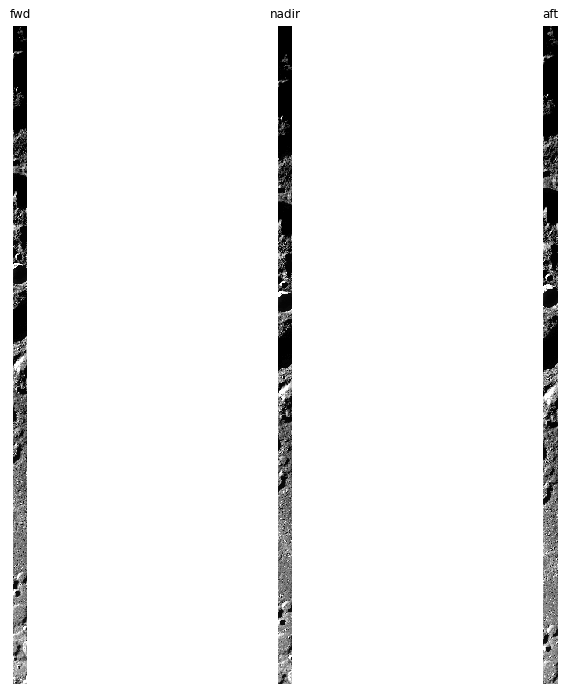

   The three raw TMC-2 looks (forward, nadir, aft), before any mapprojection.
   These are long and narrow push-broom images. Deeply shadowed terrain
   is recorded with a pixel value of 0 which is also the nodata value.

Preprocessing
^^^^^^^^^^^^^

These steps require the ASP 3.7.0 conda environment, which ships a custom build
of ISIS, ALE, and USGSCSM (:numref:`conda_intro`). 

The non-nadir TMC-2 cameras are processed the same way as OHRC above, using the
CSM camera models (:numref:`csm`). Convert the raw images to cubs::

    isisimport                                             \
      from = ch2_tmc_ncf_20231101T0125121344_d_img_d18.xml \
      to   = ch2_tmc_ncf_20231101T0125121344_d_img_d18.cub

and same for the other ones. For simplicity, the output cub files are renamed to
``tmc/fwd.cub`` and ``tmc/aft.cub``. Then attach the kernels and create the CSM
cameras, using ``isd_generate`` with the ``-k`` option::

    spiceinit from = tmc/fwd.cub
    spiceinit from = tmc/aft.cub

    isd_generate -k tmc/fwd.cub tmc/fwd.cub
    isd_generate -k tmc/aft.cub tmc/aft.cub

An error here likely means that the active ISIS is not the one bundled with ASP
3.7.0, such as a separately installed public ISIS 10.0.0 or 10.0.0_RC2.
Alteratively, install a recent development ISIS build from 2026.06.07 or later
from the dev label of the ``usgs-astrogeology`` channel
(``usgs-astrogeology/label/dev``).

Alternative creation of CSM cameras
^^^^^^^^^^^^^^^^^^^^^^^^^^^^^^^^^^^

With older ISIS, skip ``spiceinit`` altogether and follow the steps below.

Create for ALE a metakernel under ``$ALESPICEROOT`` (which is usually set to
``$ISISDATA``) to locate the SPICE kernels. That is needed since USGS
Chandrayaan-2 ISIS data area does not ship one (as of 2026-08-02). Its path 
should be::

    $ISISDATA/chandrayaan2/kernels/mk/ch2_v01.tm

It lists the kernel files. The values in ``PATH_VALUES`` should be absolute, due
to limitations in ALE, and correct for the local file system. See the NAIF
`Metakernel reference
<https://naif.jpl.nasa.gov/pub/naif/toolkit_docs/FORTRAN/req/kernel.html>`_ for
the format, and compare with existing ``.tm`` files for other missions. Then run
``isd_generate`` without the ``-k`` option::

    export ALESPICEROOT=$ISISDATA
    isd_generate tmc/fwd.cub
    isd_generate tmc/aft.cub

Check each JSON with ``cam_test`` (:numref:`cam_test`).

.. _chandra2_tmc_ref:

Reference DEM
^^^^^^^^^^^^^

A reference DEM is needed to align the cameras to a known coordinate system and
to mapproject the images after alignment (for a second stereo pass).

Near the lunar south pole, a gridded LOLA polar DEM is the natural choice
(:numref:`sfs_initial_terrain`). The product ``LDEM_60S_120M`` covers -60 to -90
degrees at 120 m per pixel in one tile, spanning the full track. A Kaguya TC DTM
(~10 m/pixel, :numref:`kaguya_products`) is at a finer resolution, but does not
reach the pole, and the wider-area LOLA products may be coarser than 120 m away
from poles. So ``LDEM_60S_120M`` at 120 m is the best available reference here.
Call it ``ref.tif``.

Choose a local projection that is then used for all steps below. Here we will go
with the south polar stereographic projection::

    proj="+proj=stere +lat_0=-90 +lon_0=0 +k=1 +x_0=0 +y_0=0 +R=1737400 +units=m +no_defs"

The reference DEM is already in this projection, otherwise it could be converted to it
with a command such as::

    gdalwarp -r cubicspline -t_srs "$proj" LDEM_60S_120M.tif ref.tif

Such DEMs can be very large. In that case it is suggested to pass an extent to this
command with the ``-te`` option.

A LOLA gridded DEM is already gap-free. For a reference DEM with holes (such as
a prior TMC or Kaguya DTM), fill them (:numref:`dem_mosaic_extrapolate`) and
optionally blur the DEM (``dem_mosaic --dem-blur-sigma 5``,
:numref:`dem_mosaic_blur`) before use.

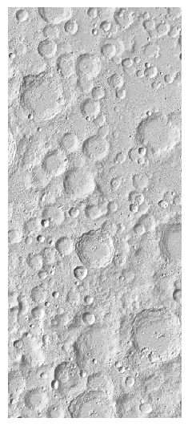

   Hillshade of the 120 m LOLA reference DEM, cropped to a region around the
   area of interest. This is coarse relative to TMC but has the correct absolute
   geometry, which is needed for alignment and mapprojection.

Bundle adjustment
^^^^^^^^^^^^^^^^^

These images have a notable pointing error, so a joint bundle adjustment of the
triplet is needed (:numref:`bundle_adjust`). The three images (.cub files) and
their CSM cameras are passed in the same order::

    bundle_adjust                              \
      tmc/fwd.cub tmc/nadir.cub tmc/aft.cub    \
      tmc/fwd.json tmc/nadir.json tmc/aft.json \
      --num-iterations 100 --num-passes 2      \
      --camera-weight 0 --tri-weight 0.1       \
      --remove-outliers-params "75 3 50 50"    \
      --ip-per-tile 400                        \
      --matches-per-tile 200                   \
      --max-pairwise-matches 200000            \
      -o ba/run

Inspect the match files (:numref:`stereo_gui_pairwise_matches`), the pixel
reprojection errors, and other metrics (:numref:`ba_out_files`).

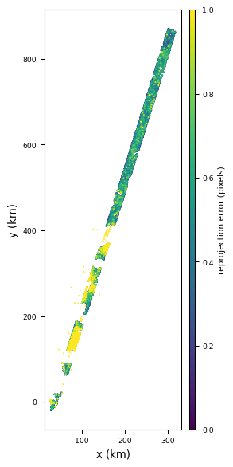

   Pixel reprojection errors per triangulated point, in a local projection. The
   residuals are sub-pixel almost everywhere.

.. _chandra2_tmc_le:

Stereo with local epipolar alignment
^^^^^^^^^^^^^^^^^^^^^^^^^^^^^^^^^^^^

A first DEM is produced from the raw images and bundle-adjusted cameras with
``local_epipolar`` image alignment (:numref:`image_alignment`). This method does
not require the cameras to be correctly registered to the ground but only
self-consistent.

This requires build 2026/08/08 or later (:numref:`release`), incorporating some
robustness fixes for this method.

Run each pair such as::

    parallel_stereo                       \
      --alignment-method local_epipolar   \
      --stereo-algorithm asp_mgm          \
      --subpixel-mode 9                   \
      --nodes-list nodes.txt              \
      tmc/fwd.cub tmc/nadir.cub           \
      ba/run-fwd.adjusted_state.json      \
      ba/run-nadir.adjusted_state.json    \
      stereo_fn/run

See :numref:`pbs_slurm` for running on multiple nodes.

Produce a DEM at 20 m per pixel (about 4x the input GSD, :numref:`post-spacing`),
with the triangulation error image (:numref:`point2dem_ortho_err`)::

    point2dem --tr 20      \
      --t_srs "$proj"      \
      --errorimage         \
      stereo_fn/run-PC.tif \
      stereo_fn/run-L.tif

The projection variable was set earlier in the text.

The two pair DEMs are then merged into one with ``dem_mosaic``
(:numref:`dem_mosaic`)::

    dem_mosaic stereo_fn/run-DEM.tif stereo_na/run-DEM.tif \
      -o tmc_merged.tif

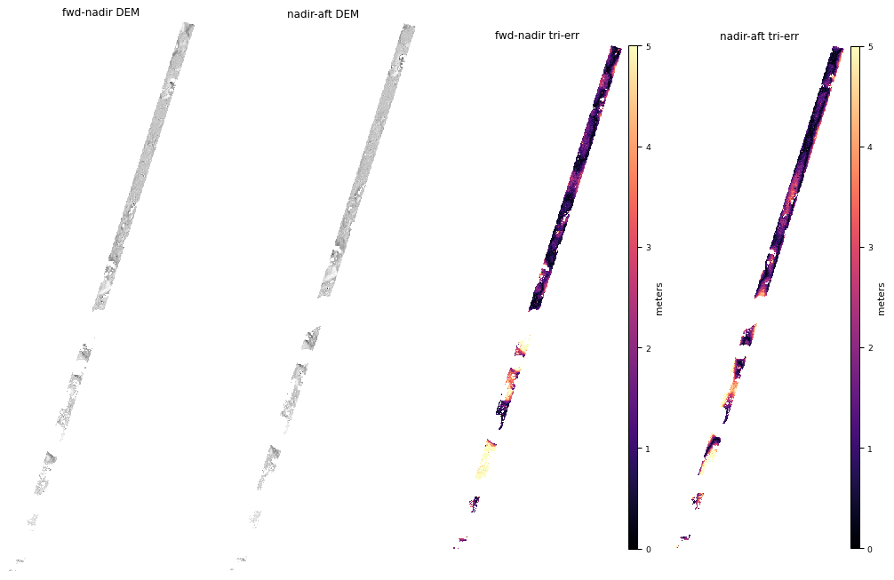

   Left to right: fwd-nadir hillshaded DEM, nadir-aft DEM, fwd-nadir
   triangulation error (:numref:`triangulation_error`), nadir-aft triangulation
   error. The coverage degrades in shadows. A later plot will have a close-up of
   a well-lit region.

.. _chandra2_tmc_align:

Alignment to LOLA
^^^^^^^^^^^^^^^^^

The merged DEM is shifted from the usual LOLA global reference (here by about 3
km along the track). This is quite large. Aligning to LOLA with the usual ICP
``point-to-plane`` method (:numref:`align-method`) fails. What worked is to do a
coarse alignment first. 

Coarsen the created merged TMC DEM to the same grid, projection, and extent as
``ref.tif``::

    gdalwarp -r average -tr 120 120 -t_srs "$proj" \
      tmc_merged.tif tmc_merged_120m.tif

Overlay this onto ``ref.tif`` and inspect both. They should appear similar and
with a visible shift.

Here we choose to do a first alignment with sparse matches produced 
from hillshades (:numref:`pc_hillshade`)::

    pc_align                                      \
      --initial-transform-from-hillshading rigid  \
      --max-displacement 3000                     \
      --num-iterations 0                          \
      ref.tif tmc_merged_120m.tif                 \
      -o align/seed

If this fails, consider correlation-based alignment (:numref:`pc_corr`),
with a search range based on the observed shift (:numref:`search_range`).

The alignment is refined with point-to-plane ICP, seeded by the first
transform::

    pc_align                                       \
      --initial-transform align/seed-transform.txt \
      --alignment-method point-to-plane            \
      --max-displacement 300                       \
      --num-iterations 1000                        \
      --save-transformed-source-points             \
      ref.tif tmc_merged_120m.tif                  \
      -o align/run

The output ``align/run-transform.txt`` is the combined transform of both calls.

Run ``point2dem`` on the transformed source cloud and overlay it on ``ref.tif``
for inspection.

Apply that transform to the three cameras, so all of them move into the LOLA
frame together (:numref:`ba_pc_align`)::

    bundle_adjust                                 \
      tmc/fwd.cub tmc/nadir.cub tmc/aft.cub       \
      ba/run-fwd.adjusted_state.json              \
      ba/run-nadir.adjusted_state.json            \
      ba/run-aft.adjusted_state.json              \
      --initial-transform align/run-transform.txt \
      --apply-initial-transform-only              \
      --inline-adjustments                        \
      -o ba_align/run

.. _chandra2_tmc_map:

Mapprojection
^^^^^^^^^^^^^

Mapproject each cub at the native ~5 m/pixel resolution onto the aligned
reference, with the aligned cameras. The command for the forward look is below;
the nadir and aft looks are identical with their own cub and camera::

    mapproject --tr 5                      \
      --t_srs "$proj"                      \
      ref.tif                              \
      tmc/fwd.cub                          \
      ba_align/run-fwd.adjusted_state.json \
      tmc/fwd.map.tif

The mapprojected images inherit the reference DEM's projection (the south polar
stereographic above), so all three are on a common grid.

Overlay these and the hillshaded reference DEM with georeference information in
``stereo_gui`` (:numref:`stereo_gui`) and confirm that they are all in
agreement.

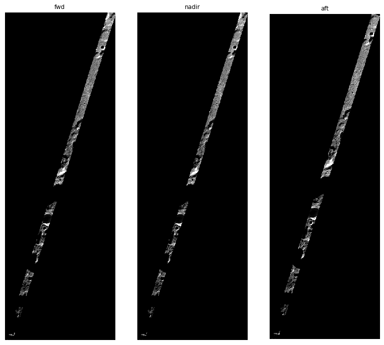

   The three mapprojected looks (forward, nadir, aft). Areas in shadow are set to
   no-data and appear black.

Stereo with mapprojected images
^^^^^^^^^^^^^^^^^^^^^^^^^^^^^^^

For each image pair, run stereo with mapprojected images
(:numref:`mapproj-example`) and the aligned CSM cameras, such as::

    parallel_stereo                          \
      --alignment-method none                \
      --stereo-algorithm asp_mgm             \
      --subpixel-mode 9                      \
      --nodes-list nodes.txt                 \
      tmc/fwd.map.tif tmc/nadir.map.tif      \
      ba_align/run-fwd.adjusted_state.json   \
      ba_align/run-nadir.adjusted_state.json \
      stereo_fn_map/run                      \
      ref.tif

Produce DEMs at 20 m per pixel::

    point2dem --tr 20 \
      --t_srs "$proj" \
      --errorimage    \
      stereo_fn_map/run-PC.tif

Merge the results as before::

    dem_mosaic stereo_fn_map/run-DEM.tif stereo_na_map/run-DEM.tif \
      -o tmc_merged_map.tif

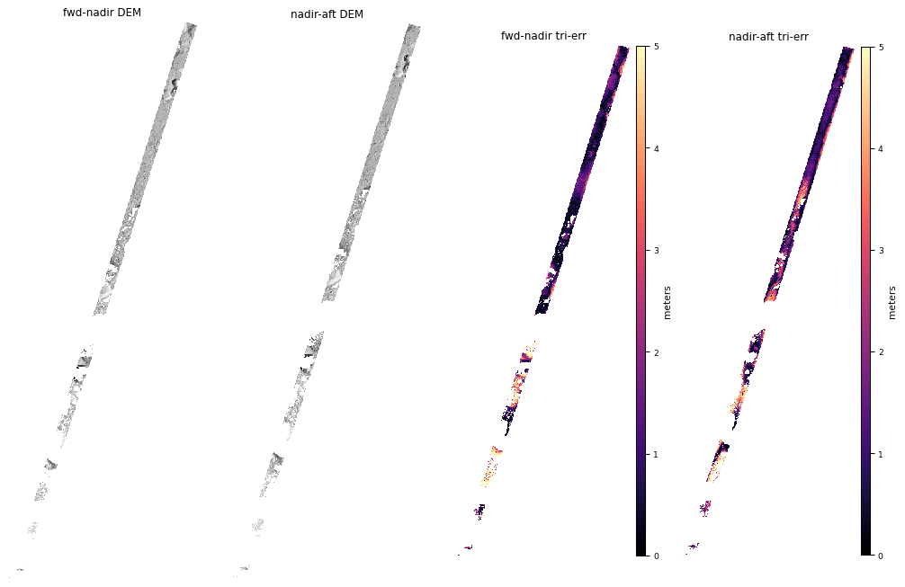

   Mapprojected-pass DEMs (hillshaded) and triangulation error (0 to 5 m), left to
   right: fwd-nadir DEM, nadir-aft DEM, fwd-nadir error, nadir-aft error. The
   triangulation error is visibly lower than in the local-epipolar pass (medians
   drop by roughly 10 to 25 percent), which is the payoff of mapprojected stereo.

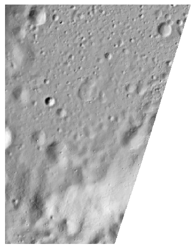

   A close-up DEM after stereo with mapprojection, showing the upper part of the
   track. The quality is very good on illuminated terrain, with small craters
   resolved. Results degrade gracefully toward shadowed areas.

Evaluation
^^^^^^^^^^

To validate the results, compare against LOLA. First difference the DEM against
the gridded LOLA reference (:numref:`geodiff`)::

    geodiff tmc_merged_map.tif ref.tif -o dem_vs_gridded

then against the raw LOLA shots (:numref:`lola_csv`)::

    geodiff tmc_merged_map.tif lola_shots.csv \
      --csv-format "2:lon 3:lat 4:radius_km"  \
      -o dem_vs_shots

The horizontal registration against the reference is checked separately: regrid
the created DEM and the reference to 120 m with ``gdalwarp -r average`` and
correlate their hillshades (``parallel_stereo --correlator-mode``,
:numref:`correlator-mode`), which computes horizontal and vertical
misregistration in the ground plane. The mean offset is near zero, with a robust
spread of about 0.07 pixel.

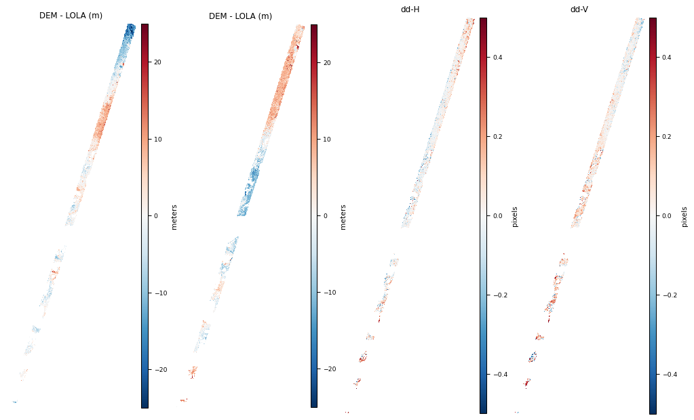

   Left to right: the two pair DEMs minus gridded LOLA (range +-25 m), and the
   fwd-nadir horizontal (dd-H) and vertical (dd-V) alignment residual to grided
   120 m / pixel LOLA (range +-0.5 pixel). The height difference is centered on
   zero; the residual disparity is sub-pixel with no low-frequency structure.

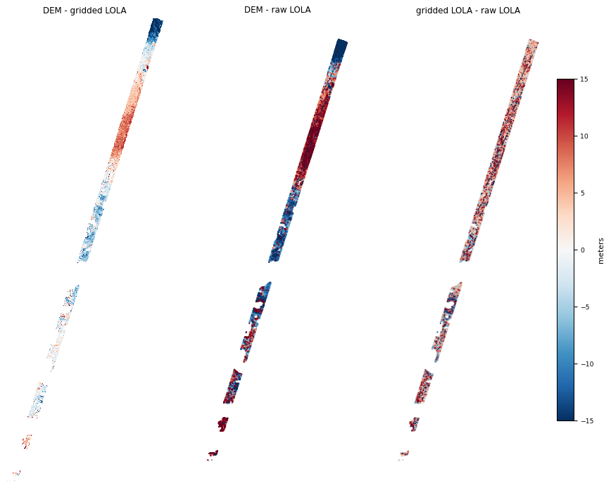

   A vertical-bias check, all at +-15 m. Left: merged mapprojected DEM minus
   gridded LOLA. Middle: the same DEM minus the raw LOLA shots. Right: gridded
   LOLA minus the shots. The medians are all sub-meter, so there is no constant
   bias against true ground. A low-amplitude along-track undulation appears in the
   DEM (left and middle) but not in gridded-minus-shots (right), so it is in the
   DEM, not LOLA; this is a mild residual-jitter signature that ``jitter_solve``
   (:numref:`jitter_solve`) could reduce.
