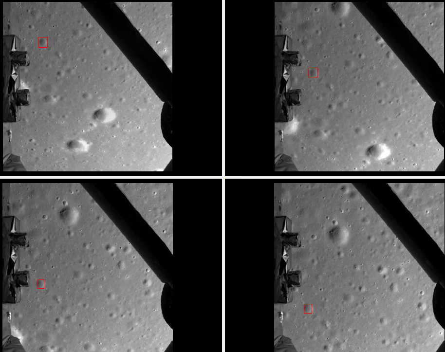
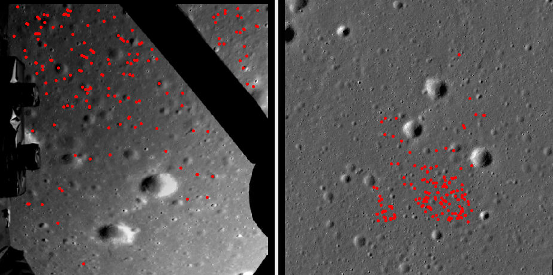
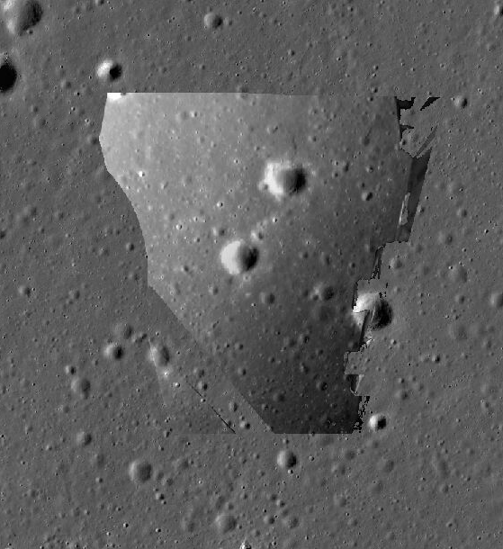
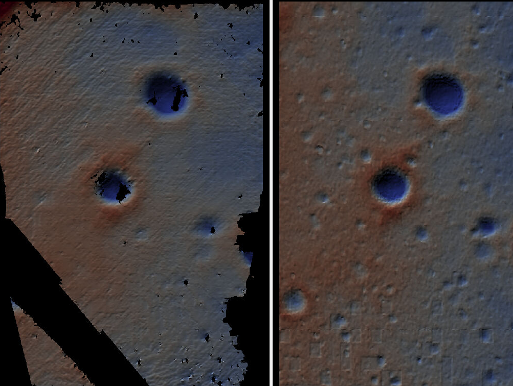

.. _change3:

Chang'e 3 landing camera
------------------------

This example discusses processing  
`Chang'e 3 <https://en.wikipedia.org/wiki/Chang%27e_3>`_ landing camera images.

This camera was mounted at the bottom of the lander and acquired images during
the descent phase.

The images we inspected had a very small convergence angle
(:numref:`stereo_pairs`), of under 1.5 degrees, which resulted in an unreliable
terrain model. 

Here we show how these images can be registered to LRO NAC images
(:numref:`lronac-example`), how to refine the landing camera intrinsics, and how
to produce a terrain model from a stereo pair consisting of a Chang'e landing
camera image and an LRO NAC image with similar illumination. This results in
elimination of lens distortion and misalignment errors between the two datasets. 

The `Chang'e3 landing video <https://www.youtube.com/watch?v=sKYrAM3EJh8>`_ is
very helpful when it comes to deciding which images to process.

Fetching the Chang'e 3 images
~~~~~~~~~~~~~~~~~~~~~~~~~~~~~

The images are available from China's `Lunar Planetary Data Release System
<https://moon.bao.ac.cn/ce5web/searchOrder_dataSearchData.search>`_. Select the
``CE3`` mission, the ``LCAM`` instrument, and the ``2A`` data level. The images
have names of the form::

  CE3_BMYK_LCAM-1801_SCI_N_20131214130807_20131214130807_0001_A.2A

The data is in the PDS3 format, with a plain text metadata header followed by a binary image.
The images can be converted to TIF with ``gdal_translate`` (:numref:`gdal_tools`)
as::

  mkdir -p img
  gdal_translate CE3_BMYK_LCAM-1801*.2A img/1801.tif

Here, ``1801`` is the index in the sequence. We stored the result in the ``img``
directory.

  Landing camera images 1801, 1831, 1861, and 1891. A crater seen in all four images
  is highlighted with a red box.

Some parts of the lander body are seen in the foreground. Most of those
artifacts can be masked with ``image_calc`` (:numref:`image_calc`) with a
command as::

  image_calc -c "max(var_0,70)" \
    --output-nodata-value 70    \
    -d float32                  \
    img/1801.tif                \
    -o img/1801_mask.tif 

This sets to no-data any pixel values not exceeding 70. 

A more careful processing could be done by opening an image in an image editor,
manually setting to black (zero pixel value) all undesirable pixels, and then
using the ``image_calc`` ``sign()`` function to create a mask of invalid (value
0) and valid (value 1) pixels. Those could be applied to each image by
multiplication, with ``image_calc`` with the option ``--output-nodata-value 0``.
The same mask would work for all of them.

LRO NAC data
~~~~~~~~~~~~

The Chang'e 3 images will be registered against LRO NAC images. These are larger,
with known camera information, and at higher resolution. 

It was quite tricky to find an LRO NAC image with similar illumination. This
required mapprojecting many such images and visual inspection. We settled on image
``M1154358210RE``. 

How to download and prepare LRO NAC images, including the application of ``lronaccal``
and ``lronacecho``, is described in :numref:`lronac-example`. A CSM camera model
can be produced as in :numref:`create_csm_linescan`. The resulting datasets will
be called ``img/lro.cub`` and ``img/lro.json``.

We will also fetch an `LRO NAC DEM
<https://pds.lroc.asu.edu/data/LRO-L-LROC-5-RDR-V1.0/LROLRC_2001/DATA/SDP/NAC_DTM/CHANGE3/NAC_DTM_CHANGE3.TIF>`_
produced specifically for this landing site. We call it ``ref/ref.tif``.

The LRO NAC image is very large, and sometimes images are also scanned in
reverse direction, appearing mirror-flipped. These result in failure in finding
matching features for registration. To make the work easier, we will mapproject
the needed image portion onto this DEM. 

Since these two datasets are not explicitly co-registered, we will blur the DEM
for mapprojection quite a bit to lessen the effect of artifacts due to
misregistration. Later, for alignment to the ground, we will use the original
DEM. 

The blur is done with ``dem_mosaic`` (:numref:`dem_mosaic`) as::

    dem_mosaic --dem-blur-sigma 10 \
      ref/ref.tif -o ref/ref_blur.tif

Define the extent on the ground and the projection::

    win="3497495 1340957 3503625 1334379"
    proj="+proj=eqc +lat_ts=44 +lat_0=0 +lon_0=180 +x_0=0 +y_0=0 +R=1737400 +units=m +no_defs"

Then, the mapprojection (:numref:`mapproject`) step follows::

    mapproject --tr 2.0 \
      --t_projwin $win  \
      --t_srs "$proj"   \
      ref/ref_blur.tif  \
      img/lro.cub       \
      img/lro.json      \
      img/lro.map.tif
  
The grid size of 2 meters was chosen to be similar to the resolution of the
Chang'e 3 images.

GCP creation
~~~~~~~~~~~~

We will find interest point matches between the Chang'e 3 and LRO NAC images,
based on which we will compute GCP (:numref:`bagcp`), that will be later used to
infer an approximate position and orientation of the Chang'e 3 camera at the
time of image acquisition.

GCP are found with the ``gcp_gen`` program (:numref:`gcp_gen`) as::

    gcp_gen                            \
      --ip-detect-method 1             \
      --inlier-threshold 100           \
      --ip-per-tile 20000              \
      --gcp-sigma 100                  \
      --individually-normalize         \
      --camera-image img/1801_mask.tif \
      --ortho-image img/lro.map.tif    \
      --dem ref/ref.tif                \
      --output-prefix run/run          \
      -o gcp/gcp_1801.gcp

The interest point matches can be visualized with ``stereo_gui``
(:numref:`stereo_gui_view_ip`) as::

    stereo_gui img/1801_mask.tif img/lro.map.tif \
      run/run-1801__lro.map.match

  Interest point matches between masked Chang'e image 1801 and mapprojected LRO
  NAC image M1154358210RE. Similar results are obtained for the other images.

Initial camera models
~~~~~~~~~~~~~~~~~~~~~

The Chang'e 3 landing camera is a frame camera. The input .2A datasets mention
that it has a focal length of 8.3 mm and a pixel size of 6.7 micrometers, which
makes the focal length in pixels be about 1238.805 pixels. 

The image dimensions are 1024 x 1024 pixels. It can be assumed that the optical
center is at the center of the image, so its coordinates are (511.5, 511.5).

The lens distortion model is not known. We will assume the standard radial-tangential
distortion model, and will initialize all distortion coefficients with small values,
such as 1e-7, that will be optimized later.

This allows us to build a Pinhole model (:numref:`pinholemodels`) with nominal
camera position and orientation. We will save it to a file called ``sample.tsai``,
with the following content::

    VERSION_4
    PINHOLE
    fu = 1238.805
    fv = 1238.805
    cu = 511.5
    cv = 511.5
    u_direction = 1 0 0
    v_direction = 0 1 0
    w_direction = 0 0 1
    C = 0 0 0
    R = 1 0 0 0 1 0 0 0 1
    pitch = 1
    Tsai
    k1 = 1e-7
    k2 = 1e-7
    p1 = 1e-7
    p2 = 1e-7
    k3 = 1e-7

We will make use of the GCP found earlier to infer the camera position and orientation.
This is done with ``bundle_adjust`` (:numref:`bundle_adjust`) as::

  bundle_adjust             \
    img/1801_mask.tif       \
    sample.tsai             \
    gcp/gcp_1801.gcp        \
    --datum D_MOON          \
    --inline-adjustments    \
    --init-camera-using-gcp \
    --threads 1             \
    --camera-weight 0       \
    --num-iterations 100    \
    -o ba/run

    cp ba/run-sample.tsai img/1801.tsai

The camera model was copied to ``img/1801.tsai``. 

We will convert this Pinhole model right away to a CSM model (:numref:`csm`), to
be in the same format as the LRO data. This is done with ``cam_gen``
(:numref:`cam_gen`)::

  cam_gen                        \
    --datum D_MOON               \
    img/1801_mask.tif            \
    --input-camera img/1801.tsai \
    -o img/1801.json 
    
The camera model can be validated by mapprojection onto the prior DEM::

    mapproject --tr 2.0 \
      --t_srs "$proj"   \
      ref/ref_blur.tif  \
      img/1801_mask.tif \
      img/1801.json     \
      img/1801.map.tif

The value of ``$proj`` is the same as before.

The resulting mapprojected image can be overlaid on top of the LRO NAC
mapprojected image. Some misalignment is expected at this stage.

More validation strategies are discussed in :numref:`cam_gcp_validation`.

  Mapprojected and masked Chang'e 3 image 1801 overlaid on top of the LRO NAC
  mapprojected image. The masked pixels are shown as transparent. A careful
  inspection shows good initial agreement, but some local deformation is seen,
  which is due to lens distortion not being modeled yet. This will be fixed
  later.

.. _change_opt:

Optimization of intrinsics
~~~~~~~~~~~~~~~~~~~~~~~~~~

We will optimize the intrinsics and extrinsics of the Chang'e 3 cameras,
including the lens distortion, with the LRO data serving as a constraint.
The general approach from :numref:`ba_frame_linescan` is followed, while
dense matches from disparity are employed, to ensure the best results.

Stereo will be run between any pair of images: ``1801``, ``1831``, ``lro``, and
dense matches from stereo correlation (disparity) will be produced
(:numref:`dense_ip`). 

::

    i=1801; j=1831

    parallel_stereo                      \
      img/${i}.map.tif img/${j}.map.tif  \
      img/${i}.json img/${j}.json        \
      --stereo-algorithm asp_mgm         \
      --num-matches-from-disparity 10000 \
      stereo_map_${i}_${j}/run           \
      ref/ref_blur.tif

This is repeated for ``i=1801; j=lro``, and ``i=1831; j=lro``.

The dense match files are copied to the same location::

  mkdir -p dense_matches
  cp stereo_map*/run-disp*match dense_matches

Separate lists are made of Chang'e 3 and LRO images and cameras::

    ls img/{1801,1831}_mask.tif > change3_images.txt
    ls img/lro.cub              > lro_images.txt
    
    ls img/{1801,1831}.json     > change3_cameras.txt
    ls img/lro.json             > lro_cameras.txt
    
Bundle adjustment is run::

    bundle_adjust                                             \
      --image-list change3_images.txt,lro_images.txt          \
      --camera-list change3_cameras.txt,lro_cameras.txt       \
      --solve-intrinsics                                      \
      --intrinsics-to-float                                   \
      '1:focal_length,optical_center,other_intrinsics 2:none' \
      --heights-from-dem ref/ref_blur.tif                     \
      --heights-from-dem-uncertainty 100                      \
      --match-files-prefix dense_matches/run-disp             \
      --num-iterations 50                                     \
      -o ba_dense/run

The value of ``--heights-from-dem-uncertainty`` is set to 200 meters, as
we know that the input cameras are not yet aligned to the input DEM,
so this accounts for the misregistration. This option would fail
for very large misregistration, when a preliminary alignment 
would be needed. 

Stereo is run between images ``1801`` and ``lro`` with the optimized
cameras and reusing the previous run from above::

    parallel_stereo                             \
      img/1801.map.tif img/lro.map.tif          \
      ba_dense/run-1801.adjusted_state.json     \
      ba_dense/run-lro.adjusted_state.json      \
      --stereo-algorithm asp_mgm                \
      --prev-run-prefix stereo_map_1801_lro/run \
      stereo_map_opt_1801_lro/run               \
      ref/ref_blur.tif

These two images have a convergence angle of 45 degrees, which is very good
for stereo (:numref:`stereo_pairs`).

The Chang'e 3 images are not going to produce a good DEM between themselves,
because of the very small convergence angle, as mentioned earlier.

A DEM is created, at 4 meters per pixel with ``point2dem`` (:numref:`point2dem`)::

    point2dem --tr 4.0 \
    --errorimage       \
    stereo_map_opt_1801_lro/run-PC.tif
    
It is good to inspect the resulting triangulation error image to ensure lens
distortion was solved for and no systematic errors are present
(:numref:`point2dem_ortho_err`).

The produced DEM can be aligned to the original DEM with ``pc_align``
(:numref:`pc_align`), and the aligned cloud can be made back into a DEM::

    pc_align --max-displacement 100           \
      --save-inv-transformed-reference-points \
      --alignment-method nuth                 \
      stereo_map_opt_1801_lro/run-DEM.tif     \
      ref/ref.tif                             \
      -o align/run
    point2dem --tr 4.0                        \
      align/run-trans_reference.tif

The resulting alignment transform can be applied to the optimized cameras in the
``ba_dense`` directory (:numref:`ba_pc_align`). After mapprojection with the
optimized and aligned cameras onto ``ref/ref.tif``, no distortion or
misalignment is seen.

  
  Left: The produced aligned DEM. Right: the original LRO NAC DEM.
  The Chang'e 3 images are are at a lower resolution, and somewhat
  differ in illumination from the LRO NAC image, so the quality 
  of the resulting DEM is lower. However, the larger features are 
  captured correctly, and the alignment is also very good.

