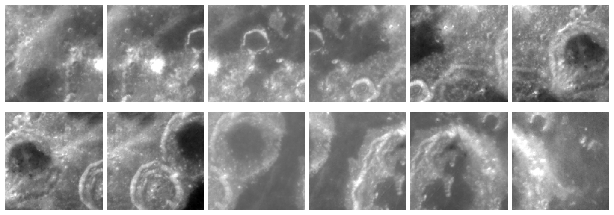
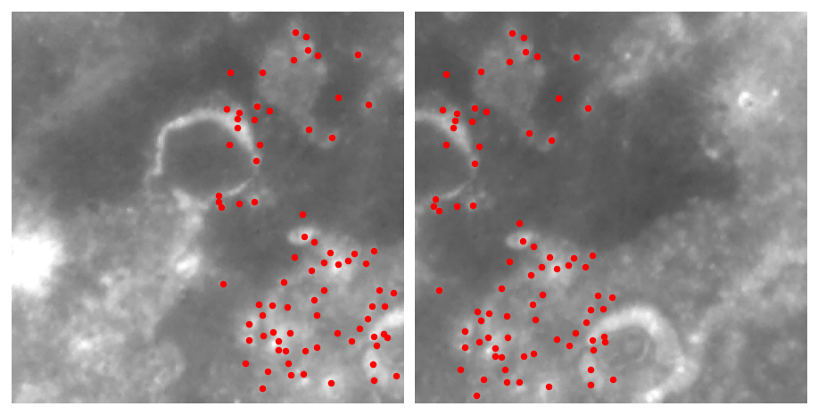
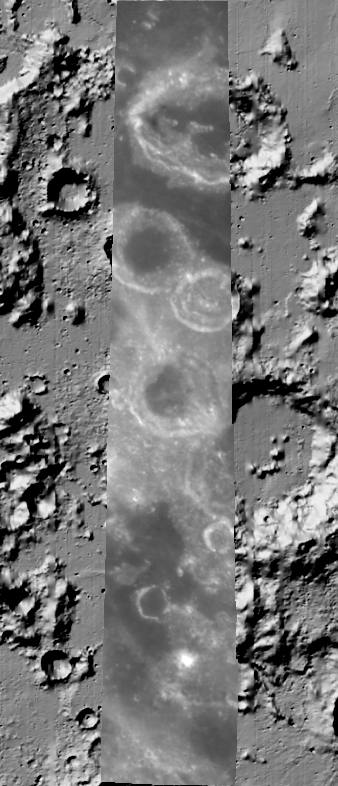

.. _clementine:

Clementine
----------

This example shows how to build CSM camera models for the Clementine Near
Infrared (NIR) camera, bundle-adjust an along-track sequence of frames, and
mapproject the sequence onto a reference lunar terrain model.

Clementine flew four framing cameras (UVVIS, NIR, HiRes, and LWIR) in a
near-nadir lunar mapping orbit in 1994. The mission was designed for global color
mapping, not for stereo, so the along-track convergence between frames is small
:cite:`cook2002clementine`. Coarse Clementine stereo topography has nonetheless
been produced from the parallax between adjacent frames, at about 1 km per pixel
and a few hundred meters of vertical accuracy :cite:`cook2002clementine`.

This example does not attempt creating a stereo terrain model. It demonstrates
that Ames Stereo Pipeline can process Clementine images and cameras, and it
shows how well the uncontrolled Clementine pointing georeferences the imagery
onto a more recent lunar DEM.

The NIR frames used here are 256 by 256 pixels, with a ground sample distance of
about 230 m/pixel.

Optical distortion
~~~~~~~~~~~~~~~~~~~

The ISIS Clementine NIR camera applies a single-parameter radial optical
distortion. As of ALE version 1.2.0, the Clementine driver assumes zero lens
distortion. The effect is minor, on the order of a fraction of a pixel, and this
will be fixed in a future ALE release. The CSM cameras in this example were
created with development ALE code that supports the Clementine NIR distortion, so
the CSM camera matches the ISIS camera model at subpixel level.

Fetching the data
~~~~~~~~~~~~~~~~~

This example uses a sequence of consecutive NIR frames from revolution 284, over the
lunar nearside near longitude 44 degrees East and latitudes 10 to 19 degrees
South. The frames overlap along-track by about half a frame. They can be found
with the `Orbital Data Explorer <https://ode.rsl.wustl.edu/moon>`_, searching for
the Clementine NIR EDR product type.

Set the base url::

    base=https://pds-geosciences.wustl.edu/geocopy/imaging/clem1-ley-abuhln-2-edr-v1.0/cl_0066/lun284/lnxxxxxx/lnxxxxxh

The ``xxxxxx`` strings in the path above are literal directory names in the PDS
archive, not placeholders to fill in.

Download a handful of images::

    for id in lna1571h lna1604h lna1637h lna1670h lna1703h \
              lna1736h lna1769h lna1802h lna1835h lna1868h; do
      wget $base/$id.284
    done

Preparing the data
~~~~~~~~~~~~~~~~~~

Ingest each raw frame into an ISIS cube, apply the radiometric calibration, remove
detector noise, and attach the SPICE data. The calibration and cleanup use
``clemnircal``, ``clemnirnoise``, and ``clemnirclean``. This needs the
``clementine1`` ISIS data area, including its calibration files, and the mission
kernels, fetched with ``downloadIsisData`` under ``$ISISDATA``
(:numref:`planetary_images`)::

    for f in lna*.284; do
      b=${f%.284}
      clem2isis    from=$f             to=${b}.raw.cub
      clemnircal   from=${b}.raw.cub.  to=${b}.cal.cub
      clemnirnoise from=${b}.cal.cub   to=${b}.noise.cub
      clemnirclean from=${b}.noise.cub to=${b}.cub
      spiceinit    from=${b}.cub
    done

The intermediate files ``.raw.cub``, ``.cal.cub``, and ``.noise.cub`` can be
deleted after this step.

   Twelve Clementine NIR frames, after calibration and noise removal,
   contrast-stretched for display, in along-track order (left to right, top to
   bottom). Adjacent frames share about half their area.

Creating the CSM cameras
~~~~~~~~~~~~~~~~~~~~~~~~~

Create a CSM camera (an ISD ``.json`` file, :numref:`csm`) for each cube. The
``-k`` option furnishes the kernels recorded by ``spiceinit``::

    for c in lna*.cub; do
      isd_generate -k $c $c
    done

The cub is passed as ``$c`` twice, with the first being a value for ``-k``.

Bundle adjustment
~~~~~~~~~~~~~~~~~

Refine the cameras with :ref:`bundle_adjust`. Because the frames were acquired
for color mapping, the baseline between them is small and the rays are close to
parallel, so a very small minimum triangulation angle is used, and a forced
triangulation distance (in meters, about the spacecraft slant distance) places
the triangulated points when the angle is below that threshold. The camera
position uncertainty is set large, as the absolute accuracy of the Clementine
pointing is assumed to be rather uncertain. A large number of interest points
are requested::

    ls lna*.cub > images.txt
    cat images.txt | sed 's/\.cub$/.json/' > cameras.txt

    bundle_adjust                             \
      --image-list images.txt                 \
      --camera-list cameras.txt               \
      -t csm                                  \
      --ip-detect-method 1                    \
      --ip-per-tile 5000                      \
      --matches-per-tile 2000                 \
      --min-triangulation-angle 1e-10         \
      --forced-triangulation-distance 617841  \
      --camera-position-uncertainty 1000,1000 \
      --robust-threshold 0.5                  \
      -o ba/run

Deriving the camera list from the image list with ``sed`` keeps the two in the
same order, as required.

This is a purely relative adjustment. It makes the cameras consistent with each
other, but does not tie them to the ground. The median reprojection error after
adjustment is about 0.16 pixel, from about 80 matches between adjacent frames.
The convergence angles between the frames are small, about 3.5 degrees between
adjacent frames, rising to a few tens of degrees for frames further apart in the
sequence (:numref:`ba_conv_angle`).

For CSM cameras, bundle adjustment writes an adjusted camera state file for each
camera, ``ba/run-<camera>.adjusted_state.json``. This is the CSM camera with the
adjustment applied inline (:numref:`ba_out_cams`). These files are passed directly
to the tools below.

   Interest point matches (red dots) between two overlapping NIR frames, lna1637h
   and lna1670h. The shared craters are matched well.

Mapprojection onto a reference DEM
~~~~~~~~~~~~~~~~~~~~~~~~~~~~~~~~~~~

To see how well the adjusted cameras georeference the imagery, mapproject the
frames onto a lunar reference DEM and overlay them on the DEM hillshade. Here the
reference is the global LOLA DEM at 128 pixels per degree that ships with ISIS,
under ``$ISISDATA/base/dems``. The SLDEM2015 LOLA and SELENE terrain camera merge
(:numref:`kaguya_tc`) is a higher-resolution alternative for latitudes within 60
degrees.

Set the projection string of the reference DEM::

    proj="+proj=eqc +lat_ts=0 +lat_0=0 +lon_0=180 +x_0=0 +y_0=0 +R=1737400 +units=m +no_defs"

Crop the reference DEM to the region and make a hillshade::

    dem=$ISISDATA/base/dems/LRO_LOLA_LDEM_global_128ppd_20100915.cub
    gdal_translate                               \
      -projwin -4310714 -242823 -3885643 -667765 \
      $dem lola_crop.tif
    gdaldem hillshade lola_crop.tif lola_hs.tif

Mapproject each frame with its adjusted CSM camera, at the native ground sample
distance, into the DEM projection, then mosaic the results::

    mkdir -p map
    for cub in $(cat images.txt); do
      prefix=${cub%.cub}
      cam=ba/run-${prefix}.adjusted_state.json
      mapproject            \
        --tr 237            \
        --t_srs "$proj"     \
        lola_crop.tif       \
        $cub                \
        $cam                \
        map/${prefix}_map.tif
    done
    dem_mosaic map/*_map.tif -o map/strip.tif

   The mapprojected Clementine NIR strip drawn over the LOLA hillshade of
   the same area. The craters in the strip line up with the same craters in the
   hillshade on either side, so the adjusted cameras register the imagery to the
   reference terrain well even without any additional alignment.
