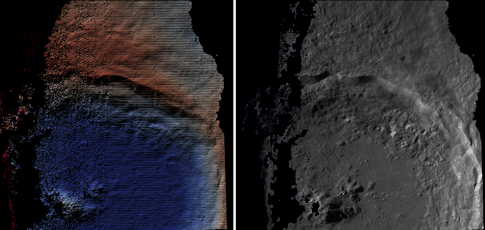
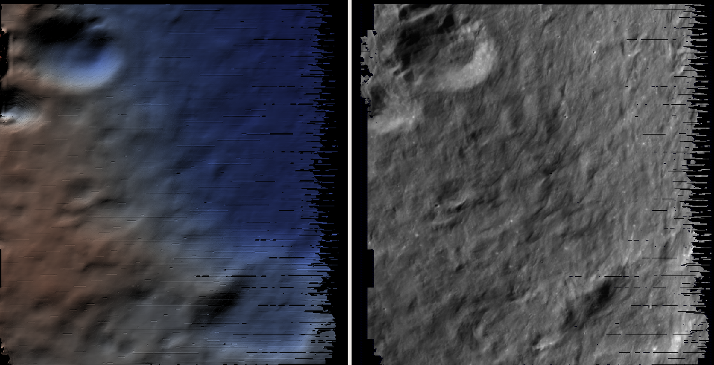
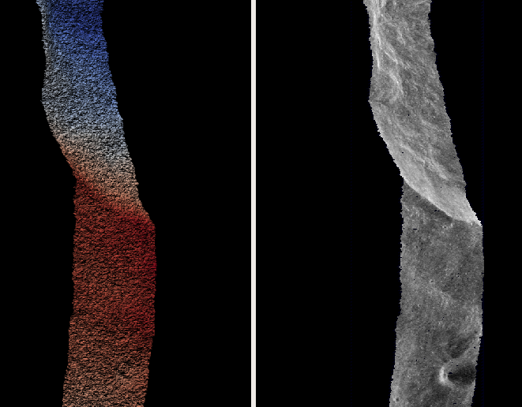
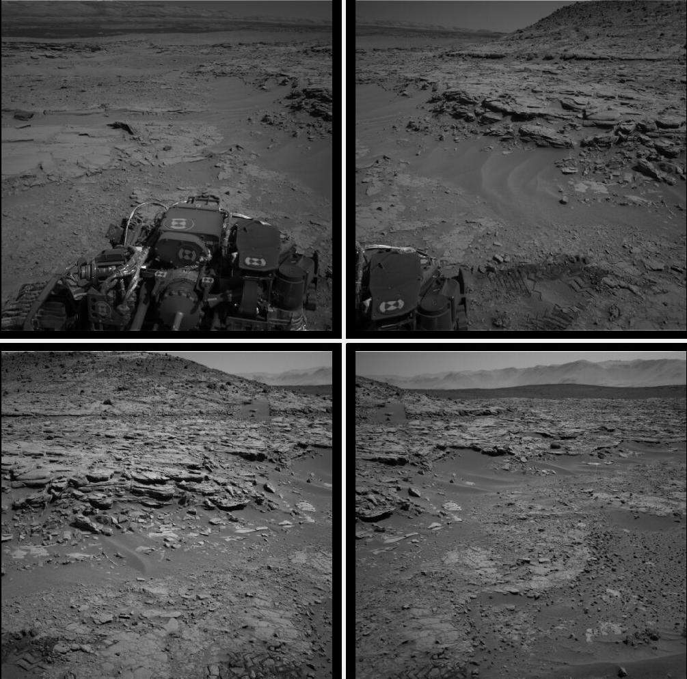
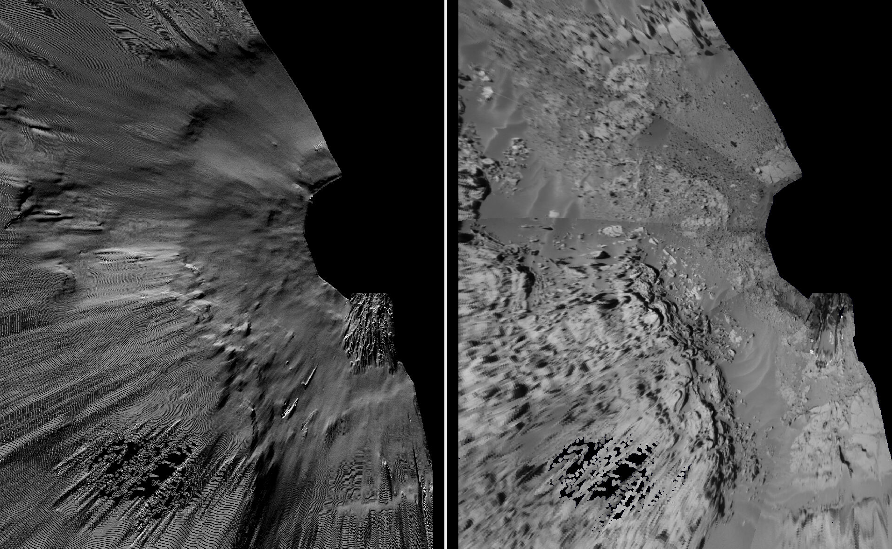

.. _csm:

Community Sensor Model
----------------------

The Community Sensor Model (CSM), established by the U.S. defense
and intelligence community, has the goal of standardizing camera
models for various remote sensor types :cite:`CSMTRD`. It provides
a well-defined application program interface (API) for multiple
types of sensors and has been widely adopted by Earth remote sensing
software systems :cite:`hare2017community,2019EA000713`.

ASP supports and ships the USGS implementation of CSM for planetary images
(https://github.com/USGS-Astrogeology/usgscsm), which provides
Linescan, Frame, Pushframe, and Synthetic Aperture Radar (SAR) implementations.

CSM is handled via dynamically loaded plugins. Hence, if a user has a
new sensor model, ASP should, in principle, be able to use it as soon
as a supporting plugin is added to the existing software, without
having to rebuild ASP or modify it otherwise. In practice, while this
logic is implemented, ASP defaults to using only the USGS
implementation, though only minor changes are needed to support
additional plugins.

Each stereo pair to be processed by ASP should be made up of two
images (for example ``.cub`` or ``.tif`` files) and two plain
text camera files with ``.json`` extension. The CSM information is
contained in the ``.json`` files and it determines which plugin to
load to use with those cameras.  More details are available at the
USGS CSM repository mentioned earlier.

.. _csm_frame:

The USGS CSM Frame sensor
~~~~~~~~~~~~~~~~~~~~~~~~~

The USGS CSM *Frame* sensor models a frame camera. All the
pixels get acquired at the same time, unlike for pushbroom and
pushframe cameras, which keep on acquiring image lines as they fly
(those are considered later in the text). Hence, a single camera
center and orientation is present. This model serves the same function
as ASP's own Pinhole camera model (:numref:`pinholemodels`).

In this example we will consider images acquired with the Dawn
Framing Camera instrument, which took pictures of the Ceres and Vesta
asteroids. This particular example will be for Vesta. Note that one
more example of this sensor is shown in this documentation, in
:numref:`dawn_isis`, which uses ISIS ``.cub`` camera models rather
than CSM ones.

This example can be downloaded from:

  https://github.com/NeoGeographyToolkit/StereoPipelineSolvedExamples

Creating the input images
^^^^^^^^^^^^^^^^^^^^^^^^^

Fetch the data from PDS then extract it::

    wget https://sbib.psi.edu/data/PDS-Vesta/Survey/img-1B/FC21B0004011_11224024300F1E.IMG.gz
    wget https://sbib.psi.edu/data/PDS-Vesta/Survey/img-1B/FC21B0004012_11224030401F1E.IMG.gz
      
    gunzip FC21B0004011_11224024300F1E.IMG.gz 
    gunzip FC21B0004012_11224030401F1E.IMG.gz

For simplicity of notation, we will rename these to ``left.IMG`` and ``right.IMG``.

Set up the ISIS environment. These will need adjusting for your system::

    export ISISROOT=$HOME/miniconda3/envs/isis6
    export PATH=$ISISROOT/bin:$PATH
    export ISISDATA=$HOME/isisdata

Create cub files and initialize the kernels::

    dawnfc2isis from = left.IMG  to = left.cub  target = VESTA
    dawnfc2isis from = right.IMG to = right.cub target = VESTA

    spiceinit from = left.cub  shape = ellipsoid
    spiceinit from = right.cub shape = ellipsoid

The ``target`` field is likely no longer needed in newer versions of
ISIS.

.. _create_csm_dawn:

Creation of CSM Frame camera files
^^^^^^^^^^^^^^^^^^^^^^^^^^^^^^^^^^

Some care is needed here, as the recipe provided below has some subtle
differences with the ones used later for linescan and SAR camera
models (:numref:`create_csm_linescan` and :numref:`create_csm_sar`).

Create a conda environment for the ``ale`` package::

    conda create -c conda-forge -n ale_env python=3.6 ale  
    conda activate ale_env

(other versions of Python may result in a runtime error later). 

Create a Python script named ``gen_csm_frame.py``::

    #!/usr/bin/python
    
    import os, sys
    import json
    import ale
    
    prefix = sys.argv[1]
    
    if prefix.lower().endswith(".cub") or prefix.lower().endswith(".img") \
        or prefix.lower().endswith(".lbl"):
        # Wipe extension
        prefix = os.path.splitext(prefix)[0]
    
    print("Prefix is: " + prefix)
    
    cub_file = prefix + '.cub'
    img_file = prefix + '.IMG'
    
    kernels = ale.util.generate_kernels_from_cube(cub_file, expand = True)
    
    usgscsm_str = ale.loads(img_file, props={'kernels': kernels},
                            formatter='ale', verbose = False)
    
    csm_isd = prefix + '.json'
    print("Writing: " + csm_isd)
    with open(csm_isd, 'w') as isd_file:
        isd_file.write(usgscsm_str)

Assuming that conda installed this environment in the default location,
run::

    $HOME/miniconda3/envs/ale_env/bin/python gen_csm_frame.py left.IMG
    $HOME/miniconda3/envs/ale_env/bin/python gen_csm_frame.py right.IMG

This will create ``left.json`` and ``right.json``.

As a sanity check, run ``cam_test`` to see how well the CSM camera
approximates the ISIS camera::

    cam_test --image left.cub  --cam1 left.cub  --cam2 left.json
    cam_test --image right.cub --cam1 right.cub --cam2 right.json

Note that for a handful of pixels these errors may be big. That is a
known issue, and it seems to be due to the fact that a ray traced from
the camera center towards the ground may miss the body of the asteroid.
That should not result in inaccurate stereo results.

Running stereo
^^^^^^^^^^^^^^

::

    parallel_stereo --stereo-algorithm asp_mgm \
      --left-image-crop-win 243 161 707 825    \
      --right-image-crop-win 314 109 663 869   \
      left.cub right.cub left.json right.json  \
      run/run

    point2dem run/run-PC.tif --orthoimage run/run-L.tif 
    hillshade run/run-DEM.tif 
    colormap run/run-DEM.tif -s run/run-DEM_HILLSHADE.tif 

See :numref:`nextsteps` for a discussion about various
speed-vs-quality choices when running stereo.

.. figure:: ../images/CSM_Frame.png
   :name: CSM_Frame_example

   The produced colorized DEM and orthoimage for the CSM Frame camera
   example. Likely using mapprojection (:numref:`mapproj-example`)
   may have reduced the number and size of the holes in the DEM.

The USGS CSM linescan sensor
~~~~~~~~~~~~~~~~~~~~~~~~~~~~

In this example we will use the Mars CTX linescan sensor. The images are regular
``.cub`` files as in the tutorial in :numref:`moc_tutorial`, hence the only
distinction compared to that example is that the cameras are stored as ``.json``
files.

We will work with the dataset pair::

     J03_045994_1986_XN_18N282W.cub J03_046060_1986_XN_18N282W.cub

which, for simplicity, we will rename to ``left.cub`` and ``right.cub``
and the same for the associated camera files.

.. _create_csm_linescan:

Creation CSM linescan cameras
^^^^^^^^^^^^^^^^^^^^^^^^^^^^^

Note that this recipe looks a little different for Frame and SAR cameras,
as can be seen in :numref:`create_csm_dawn` and :numref:`create_csm_sar`.

Run the ISIS ``spiceinit`` command on the .cub files as::

    spiceinit from = left.cub  shape = ellipsoid
    spiceinit from = right.cub shape = ellipsoid

Create a conda environment for the ``ale`` package::

    conda create -c conda-forge -n ale_env python=3.6 ale  
    conda activate ale_env

(other versions of Python may result in a runtime error later). 

Create a Python script named ``gen_csm_linescan.py``::

    #!/usr/bin/python
    
    import ale, os, sys
    
    # Get the input cub
    cub_file = sys.argv[1]
    
    # Form the output cub
    isd_file = os.path.splitext(cub_file)[0] + '.json'
    
    print("Reading: " + cub_file)
    usgscsm_str = ale.loads(cub_file)
    
    print("Writing: " + isd_file)
    with open(isd_file, 'w') as isd_file:
        isd_file.write(usgscsm_str)

Assuming that conda installed this environment in the default location,
run::

    $HOME/miniconda3/envs/ale_env/bin/python gen_csm_linescan.py camera.cub

This will produce ``left.json`` and ``right.json``.

Running stereo
^^^^^^^^^^^^^^

::

    parallel_stereo --stereo-algorithm asp_mgm         \
      --subpixel-mode 9                                \
       left.cub right.cub left.json right.json run/run    
    point2dem -r mars --stereographic --proj-lon 77.4  \
       --proj-lat 18.4 run/run-PC.tif

Check the stereo convergence angle as printed during preprocessing
(:numref:`stereo_pairs`). If that angle is small, the results are not
going to be great.

See :numref:`nextsteps` for a discussion about various stereo
algorithms and speed-vs-quality choices.

The actual stereo session used is ``csm``, and here it will be
auto-detected based on the extension of the camera files. For
``point2dem`` we chose to use a stereographic projection centered at
some point in the area of interest. The fancier MGM algorithm could be
used by running this example with ``--stereo-algorithm asp_mgm``.

One can also run ``parallel_stereo`` with mapprojected images
(:numref:`mapproj-example`). The first step would be to create a
low-resolution smooth DEM from the previous cloud::

     point2dem  -r mars --stereographic --proj-lon 77.4 \
       --proj-lat 18.4 run/run-PC.tif --tr 120          \
       -o run/run-smooth

followed by mapprojecting onto it and redoing stereo::

    mapproject --tr 6 run/run-smooth-DEM.tif left.cub  \
      left.json left.map.tif
    mapproject --tr 6 run/run-smooth-DEM.tif right.cub \
     right.json right.map.tif
    parallel_stereo --stereo-algorithm asp_mgm         \
      --subpixel-mode 9                                \
      left.map.tif right.map.tif left.json right.json  \
      run_map/run run/run-smooth-DEM.tif

Notice how we used the same resolution for both images when
mapprojecting. That helps making the resulting images more similar and
reduces the processing time (:numref:`mapproj-res`).

CSM Pushframe camera example
~~~~~~~~~~~~~~~~~~~~~~~~~~~~

.. _csm_wac:

Lunar Reconnaissance Orbiter (LRO) WAC
~~~~~~~~~~~~~~~~~~~~~~~~~~~~~~~~~~~~~~

This example, including the inputs, recipe, and produced terrain model
can be downloaded from:

    https://github.com/NeoGeographyToolkit/StereoPipelineSolvedExamples/releases/tag/LROWAC

Fetching the data
^^^^^^^^^^^^^^^^^

We will focus on the monochromatic images for this sensor. Visit:

   https://ode.rsl.wustl.edu/moon/indexproductsearch.aspx

Find the *Lunar Reconnaissance Orbiter -> Experiment Data Record Wide
Angle Camera - Mono (EDRWAM)* option.

Search either based on a longitude-latitude window, or near a notable
feature, such as a named crater.  We choose a couple of images having
the Tycho crater, with download links::

    http://pds.lroc.asu.edu/data/LRO-L-LROC-2-EDR-V1.0/LROLRC_0002/DATA/MAP/2010035/WAC/M119923055ME.IMG
    http://pds.lroc.asu.edu/data/LRO-L-LROC-2-EDR-V1.0/LROLRC_0002/DATA/MAP/2010035/WAC/M119929852ME.IMG

Get these with ``wget``.

Creation of .cub files
^^^^^^^^^^^^^^^^^^^^^^

We broadly follow the tutorial at :cite:`ohman2015procedure`. For a
dataset called ``image.IMG``, do::

    lrowac2isis from = image.IMG to = image.cub

This will create so-called *even* and *odd* datasets, with names like
``image.vis.even.cub`` and ``image.vis.odd.cub``.

Run ``spiceinit`` on them to set up the SPICE kernels::

    spiceinit from = image.vis.even.cub
    spiceinit from = image.vis.odd.cub

followed by ``lrowaccal`` to adjust the image intensity::

    lrowaccal from = image.vis.even.cub to = image.vis.even.cal.cub
    lrowaccal from = image.vis.odd.cub  to = image.vis.odd.cal.cub

All these .cub files can be visualized with ``stereo_gui``. It can be
seen that instead of a single contiguous image we have a set of narrow
horizontal framelets, with some of these in the even and some in the odd
cub file. The framelets may also be recorded in reverse.

Production of seamless mapprojected images
^^^^^^^^^^^^^^^^^^^^^^^^^^^^^^^^^^^^^^^^^^

This is not needed for stereo, but may be useful for readers who would
like to produce image mosaics using ``cam2map``.

::

    cam2map from = image.vis.even.cal.cub to = image.vis.even.cal.map.cub
    cam2map from = image.vis.odd.cal.cub  to = image.vis.odd.cal.map.cub  \
      map = image.vis.even.cal.map.cub matchmap = true

Note how in the second ``cam2map`` call we used the ``map`` and
``matchmap`` arguments. This is to ensure that both of these output
images have the same resolution and projection. In particular, if more
datasets are present, it is suggested for all of them to use the same
previously created .cub file as a map reference.  That because stereo
works a lot better on mapprojected images with the same ground
resolution. For more details see :numref:`mapproj-example` and
:numref:`mapproj_with_cam2map`.

To verify that the obtained images have the same ground resolution, do::

    gdalinfo image.vis.even.cal.map.cub | grep -i "pixel size"
    gdalinfo image.vis.odd.cal.map.cub  | grep -i "pixel size"

(see :numref:`gdal_tools` regarding this tool).

The fusion happens as::

    ls image.vis.even.cal.map.cub image.vis.odd.cal.map.cub  > image.txt
    noseam fromlist = image.txt to = image.noseam.cub SAMPLES=73 LINES=73

The obtained file ``image.noseam.cub`` may still have some small artifacts
but should be overall reasonably good. 

Stitching the raw even and odd images
^^^^^^^^^^^^^^^^^^^^^^^^^^^^^^^^^^^^^

This requires ISIS newer than version 6.0, or the latest development code.

For each image in the stereo pair, stitch the even and odd datasets::

    framestitch even = image.vis.even.cal.cub odd = image.vis.odd.cal.cub \
      to = image.cub flip = true num_lines_overlap = 2

The ``flip`` flag is needed if the order of framelets is reversed
relative to what the image is expected to show.

The parameter ``num_lines_overlap`` is used to remove a total of this
many lines from each framelet (half at the top and half at the bottom)
before stitching, in order to deal with the fact that the even and odd
framelets have a little overlap, and that they also tend to have artifacts
due to some pixels flagged as invalid in each first and last framelet
row.

The CSM camera models will assume that this parameter is set at 2, so
it should not be modified. Note however that WAC framelets may overlap
by a little more than that, so resulting DEMs may have some artifacts
at framelet borders, as can be seen further down.

Creation of CSM WAC cameras
^^^^^^^^^^^^^^^^^^^^^^^^^^^

CSM is a standard for describing camera models (:numref:`csm`).

The support in ISIS and ASP for pushframe sensors in CSM format is a work in
progress. For the time being one should fetch the latest ALE and its conda
environment from GitHub, at:

    https://github.com/USGS-Astrogeology/ale

then create a script named ``gen_csm_wac.py``::

    #!/usr/bin/python

    import os, sys
    import json
    import ale

    prefix = sys.argv[1]

    if prefix.endswith(".cub") or prefix.lower().endswith(".img") \
      or prefix.endswith(".lbl"):
      prefix = os.path.splitext(prefix)[0]

    cub_file = prefix + '.cub'

    print("Loading cub file: " + cub_file)

    kernels = ale.util.generate_kernels_from_cube(cub_file, expand = True)

    usgscsm_str = ale.loads(cub_file, formatter = "ale", \
                        props={"kernels": kernels},
                        verbose = True)

    csm_isd = prefix + '.json'
    print("Saving: " + csm_isd)
    with open(csm_isd, 'w') as isd_file:
      isd_file.write(usgscsm_str)
  
Invoke it with either the ``even`` or ``odd`` .cub file as an argument. For
example::

    $HOME/miniconda3/envs/ale_env/bin/python gen_csm_wac.py \
      image.vis.even.cal.cub

Do not use the stitched .cub file as that one lacks camera information.
The obtained .json files can be renamed to follow the same
convention as the stitched .cub images.

At some point when a new version of ISIS is released (version > 6),
it may have a tool for creation of CSM camera models.

Running stereo
^^^^^^^^^^^^^^

::

    parallel_stereo --stereo-algorithm asp_mgm   \
      --left-image-crop-win 341 179 727 781      \
      --right-image-crop-win 320 383 824 850     \
      M119923055ME.cub M119929852ME.cub          \
      M119923055ME.json M119929852ME.json        \
      run/run

    point2dem run/run-PC.tif --orthoimage run/run-L.tif 
    hillshade run/run-DEM.tif 
    colormap run/run-DEM.tif -s run/run-DEM_HILLSHADE.tif 

As printed by ``stereo_pprc``, the convergence angle is about 27
degrees, which is a good number.

See :numref:`nextsteps` for a discussion about various stereo
speed-vs-quality choices.

   The produced colorized DEM and orthoimage for the CSM WAC camera
   example. The artifacts are due to issues stitching of even and odd
   framelets.

It can be seen that the stereo DEM has some linear artifacts. That is
due to the fact that the stitching does not perfectly integrate the
framelets.

An improved solution can be obtained by creating a low-resolution
version of the above DEM, mapprojecting the images on it, and then
re-running stereo, per (:numref:`mapproj-example`).

::

    point2dem --tr 0.03 run/run-PC.tif --search-radius-factor 5 -o \
      run/run-low-res
    mapproject --tr 0.0025638 run/run-low-res-DEM.tif              \
      M119923055ME.cub M119923055ME.json M119923055ME.map.tif 
    mapproject --tr 0.0025638 run/run-low-res-DEM.tif              \
      M119929852ME.cub M119929852ME.json M119929852ME.map.tif    
    parallel_stereo --stereo-algorithm asp_mgm                     \
      M119923055ME.map.tif M119929852ME.map.tif                    \
      M119923055ME.json M119929852ME.json                          \
      run_map/run run/run-low-res-DEM.tif    
    point2dem run_map/run-PC.tif --orthoimage run_map/run-L.tif 
    hillshade run_map/run-DEM.tif 
    colormap run_map/run-DEM.tif -s run_map/run-DEM_HILLSHADE.tif 

To create the low-resolution DEM we used a grid size which is about 10
times coarser than the one for the DEM created earlier. Note that the
same resolution is used when mapprojecting both images; that is very
important to avoid a large search range in stereo later. This is discussed
in more detail in :numref:`mapproj-example`.

   The produced colorized DEM and orthoimage for the CSM WAC camera
   example, when mapprojected images are used.

As can be seen in the second figure, there are somewhat fewer artifacts.
The missing lines in the DEM could be filled in if ``point2dem`` was run
with ``--search-radius-factor 4``, for example. 

Given that there exists a wealth of WAC images, one could also try to
get several more stereo pairs with similar illumination, run bundle
adjustment for all of them (:numref:`bundle_adjust`), run pairwise
stereo, create DEMs (at the same resolution), and then merge them with
``dem_mosaic`` (:numref:`dem_mosaic`). This may further attenuate the
artifacts as each stereo pair will have them at different
locations. See :numref:`stereo_pairs` for guidelines about how to
choose good stereo pairs.

.. _csm_minirf:

The USGS CSM SAR sensor for LRO Mini-RF 
~~~~~~~~~~~~~~~~~~~~~~~~~~~~~~~~~~~~~~~

*Mini-RF* was a Synthetic Aperture Radar (SAR) sensor on the LRO
spacecraft. It is challenging to process its data with ASP for several
reasons:

 - The synthetic image formation model produces curved rays going from the
   ground to the pixel in the camera (:cite:`kirk2016semi`). To simplify the
   calculations, ASP finds where a ray emanating from the camera
   intersects the standard Moon ellipsoid with radius 1737.4 km and
   declares the ray to be a straight line from the camera center to this
   point.

 - This sensor very rarely acquires stereo pairs. The convergence angle
   (:numref:`stereo_pairs`) as printed by ``parallel_stereo`` in
   pre-processing is usually less than 5 degrees, which is little and
   results in noisy DEMs. In this example we will use a dataset
   intentionally created with stereo in mind. The images will cover a
   part of Jackson crater (:cite:`kirk2011radargrammetric`).

 - It is not clear if all modeling issues with this sensor were
   resolved. The above publication states that "Comparison of the stereo
   DTM with ~250 m/post LOLA grid data revealed (in addition to
   dramatically greater detail) a very smooth discrepancy that varied
   almost quadratically with latitude and had a peak-to-peak amplitude
   of nearly 4000 m."
  
 - The images are dark and have unusual appearance, which requires
   some pre-processing and a large amount of interest points. 

Hence, ASP's support for this sensor is experimental. The results
are plausible but likely not fully rigorous.

This example, including input images, produced outputs, and a recipe, is available
for download at:

    https://github.com/NeoGeographyToolkit/StereoPipelineSolvedExamples

No ISIS data are needed to run it.

Creating the input images
^^^^^^^^^^^^^^^^^^^^^^^^^

Fetch the data from PDS::

    wget https://pds-geosciences.wustl.edu/lro/lro-l-mrflro-4-cdr-v1/lromrf_0002/data/sar/03800_03899/level1/lsz_03821_1cd_xku_16n196_v1.img
    wget https://pds-geosciences.wustl.edu/lro/lro-l-mrflro-4-cdr-v1/lromrf_0002/data/sar/03800_03899/level1/lsz_03821_1cd_xku_16n196_v1.lbl
    wget https://pds-geosciences.wustl.edu/lro/lro-l-mrflro-4-cdr-v1/lromrf_0002/data/sar/03800_03899/level1/lsz_03822_1cd_xku_23n196_v1.img
    wget https://pds-geosciences.wustl.edu/lro/lro-l-mrflro-4-cdr-v1/lromrf_0002/data/sar/03800_03899/level1/lsz_03822_1cd_xku_23n196_v1.lbl

These will be renamed to ``left.img``, ``right.img``, etc., to simply
the processing.

Create .cub files::

    export ISISROOT=$HOME/miniconda3/envs/isis6
    export PATH=$ISISROOT/bin:$PATH
    export ISISDATA=$HOME/isis3data
   
    mrf2isis from = left.lbl  to = left.cub
    mrf2isis from = right.lbl to = right.cub

Run ``spiceinit``. Setting the shape to the ellipsoid makes it easier
to do image-to-ground computations and is strongly suggested::

    spiceinit from = left.cub  shape = ellipsoid
    spiceinit from = right.cub shape = ellipsoid

.. _create_csm_sar:

Creation of CSM SAR cameras
^^^^^^^^^^^^^^^^^^^^^^^^^^^

Fetch the latest ``ale`` from GitHub:

    https://github.com/USGS-Astrogeology/ale

or something newer than version 0.8.7 on conda-forge, which lacks
certain functionality for SAR. Below we assume a very recent version
of USGS CSM, as shipped with ASP. Version 1.5.2 of this package on
conda-forge is too old for the following to work.

Create a script called ``gen_csm_sar.py``. (Note that this script
differs somewhat for analogous scripts earlier in the text, at
:numref:`create_csm_dawn` and :numref:`create_csm_linescan`.)

::

    #!/usr/bin/python
    
    import os, sys
    import json
    import ale
    
    prefix = sys.argv[1]
    
    if prefix.lower().endswith(".cub") or prefix.lower().endswith(".img") \
      or prefix.lower().endswith(".lbl"):
      # Remove extension
      prefix = os.path.splitext(prefix)[0]
    
    cub_file = prefix + '.cub'
    print("Loading cub file: " + cub_file)
    
    kernels = ale.util.generate_kernels_from_cube(cub_file, expand = True)
    usgscsm_str = ale.loads(cub_file, formatter = "ale", \
      props={"kernels": kernels}, verbose = False)
    
    csm_isd = prefix + '.json'
    print("Saving: " + csm_isd)
    with open(csm_isd, 'w') as isd_file:
      isd_file.write(usgscsm_str)
    
Run it as::

   $HOME/miniconda3/envs/ale_env/bin/python gen_csm_sar.py left.cub
   $HOME/miniconda3/envs/ale_env/bin/python gen_csm_sar.py right.cub

The above paths will need adjusting for your system. The path to
Python should be such that the recently installed ``ale`` is picked
up.

Run ``cam_test`` (:numref:`cam_test`) as a sanity check::

    cam_test --image left.cub  --cam1 left.cub  --cam2 left.json
    cam_test --image right.cub --cam1 right.cub --cam2 right.json

Preparing the images
^^^^^^^^^^^^^^^^^^^^

ASP accepts only single-band images, while these .cub files have four of them.
We will pull the first band and clamp it to make it easier for stereo to find
interest point matches::

    gdal_translate -b 1 left.cub  left_b1.tif
    gdal_translate -b 1 right.cub right_b1.tif

    image_calc -c "min(var_0, 0.5)" left_b1.tif  -d float32 \
      -o left_b1_clamp.tif 
    image_calc -c "min(var_0, 0.5)" right_b1.tif -d float32 \
      -o right_b1_clamp.tif 

Running stereo
^^^^^^^^^^^^^^

It is simpler to first run a clip with ``stereo_gui``
(:numref:`stereo_gui`).  This will result in the following command::

    parallel_stereo --ip-per-tile 3500             \
      --left-image-crop-win 0 3531 3716 10699      \
      --right-image-crop-win -513 22764 3350 10783 \
      --stereo-algorithm asp_mgm --min-num-ip 10   \
      left_b1_clamp.tif right_b1_clamp.tif         \
      left.json right.json run/run  

The stereo convergence angle for this pair is 18.4 degrees which is
rather decent.

Create a colorized DEM and orthoimage::

    point2dem run/run-PC.tif --orthoimage run/run-L.tif 
    hillshade run/run-DEM.tif 
    colormap run/run-DEM.tif -s run/run-DEM_HILLSHADE.tif 

See :numref:`nextsteps` for a discussion about various
speed-vs-quality choices when running stereo.

   The produced colorized DEM and orthoimage for the CSM SAR example. 

.. _csm_msl:

Using CSM cameras with MSL
~~~~~~~~~~~~~~~~~~~~~~~~~~

This example shows how given a set of Mars Science Laboratory (MSL) Curiosity rover ``NavCam`` or ``MastCam`` images, CSM camera models can be created. Stereo pairs are then used (tested with ``NavCam`` only) to make DEMs and orthoimages.

It is important to note that, as long as the rover is fixed in place, the cameras corresponding to overlapping images are self-consistent. If the rover moves, however, the rover height above the Mars datum and the produced DEM can jump vertically by 60 meters or so, in some circumstances, which appears to be due to problems in the input SPICE data (a temporary fix is in :numref:`csm_msl_create`). 

There is also 10-20 degrees of uncertainty in orientation of the created DEMs. That is likely because the transform from the rover frame to the frame having the mounted cameras was estimated empirically. This will be resolved in the future.

Hence, for now this functionality can only be used to create DEMs from a handful of images.

See :numref:`rig_msl` for a Structure-from-Motion solution without using CSM cameras. That one results in self-consistent meshes that, unlike the DEMs produced here, are not geolocated.

Illustration
^^^^^^^^^^^^

  Four out of the 10 images (5 stereo pairs) used in this example.

  Produced DEM and orthoimage.

Fetch the images and metadata from PDS
^^^^^^^^^^^^^^^^^^^^^^^^^^^^^^^^^^^^^^

See :numref:`msl_image_prep`. Here we will work with .cub files rather than converting them to .png. The same Mars day will be used as there (SOL 597).

The dataset used in this example (having .LBL, .cub, and .json files) is available
`for download <https://github.com/NeoGeographyToolkit/StereoPipelineSolvedExamples/releases/tag/MSL_CSM>`_.

Download the SPICE data
^^^^^^^^^^^^^^^^^^^^^^^

The .LBL metadata files from PDS do not have the SPICE data that is needed to find the position and orientation of the MSL rover on Mars. For that, need to fetch the SPICE kernels from the USGS ISIS server. 

Get a recent version of ``rclone.conf`` for ISIS::
  
    wget https://raw.githubusercontent.com/USGS-Astrogeology/ISIS3/dev/isis/config/rclone.conf \ 
    -O rclone.conf 

Set the ISIS data environmental variable and download the kernels (adjust the path below)::

    export ISISDATA=/path/to/isisdata
    mkdir -p $ISISDATA
    downloadIsisData msl $ISISDATA --config rclone.conf

The ``downloadIsisData`` script is shipped with ISIS (:numref:`planetary_images`).

Set up ALE
^^^^^^^^^^

The functionality for creating CSM camera models is available in the ALE package. For the time being, handling the MSL cameras requires fetching a forked version of ALE, as this is not merged upstream yet. Run::

    git clone git@github.com:oleg-alexandrov/ale.git
    cd ale
    conda env create -n ale -f environment.yml

See :numref:`conda_intro` for how to install ``conda``.

Make sure Python can find the needed routines (adjust the path below)::

    export PYTHONPATH=/path/to/ale

.. _csm_msl_create:

Creation of CSM MSL cameras
^^^^^^^^^^^^^^^^^^^^^^^^^^^

ALE expects the following variable to be set::

    export ALESPICEROOT=$ISISDATA

Set the environmental variable::

    export HEIGHT_ABOVE_DATUM=-4898.515408052597

as a temporary workaround for the vertical datum issue mentioned in :numref:`csm_msl`. 
If set, this will move the rover position vertically to be at this height above the Mars datum (whose radius is assumed to be 3,396,190 meters).

A full-resolution MSL left ``NavCam`` image uses the naming convention::

      NLB_<string>_F<string>.cub

with the right image starting instead with ``NRB``. The metadata files downloaded from PDS end with ``.LBL``.

Create a Python script called ``gen_csm_msl.py`` with the following code::

    #!/usr/bin/python

    import os, sys, json, ale

    labelFile = sys.argv[1]
    prefix = os.path.splitext(labelFile)[0]
    usgscsm_str = ale.loads(labelFile, formatter = "ale",
                            verbose = True)

    csm_isd = prefix + '.json'
    print("Saving: " + csm_isd)
    with open(csm_isd, 'w') as isd_file:
      isd_file.write(usgscsm_str)

A CSM camera file can be created by running this script as::

    $HOME/miniconda3/envs/ale_env/bin/python gen_csm_msl.py image.LBL 

This will produce the file ``image.json``. We called the Python program from the newly created conda environment.

If you get an error saying::

    The first file 
    '/usgs/cpkgs/isis3/data/msl/kernels/lsk/naif0012.tls' 
    specified by KERNELS_TO_LOAD in the file 
    /path/to/isisdata/msl/kernels/mk/msl_v01.tm 
    could not be located.
  
that is due to a bug in the ISIS data. Edit that .tls file and specify the correct location of ``msl_v01.tm`` in your ISIS data directory. Once things are working, the ``verbose`` flag can be set to ``False`` in the above script.

Running stereo
^^^^^^^^^^^^^^

In this example the camera orientations are not refined using bundle adjustment, as the camera poses are reasonably good. If desired to do that, one could run ``bundle_adjust`` (:numref:`bundle_adjust`) as::
  
    bundle_adjust --no-datum --camera-weight 0 --tri-weight 0.1 \
      data/*.cub data/*.json -o ba/run
  
For each stereo pair, run ``parallel_stereo`` (:numref:`parallel_stereo`) as::

    parallel_stereo --stereo-algorithm asp_mgm \
      --subpixel-mode 3 --no-datum             \
      left.cub right.cub left.json right.json  \
      run/run

If bundle adjustment was used, the above command should be run with the option ``--bundle-adjust-prefix ba/run``.

This is followed by DEM and orthoimage creation (:numref:`point2dem`) with::

    point2dem --stereographic                \
      --proj-lon 137.402 --proj-lat -4.638   \
      --search-radius-factor 5 --orthoimage  \
      run/run-PC.tif run/run-L.tif
     
Here, the option ``--search-radius-factor 5`` is used to fill the point cloud when moving further from the rover. A local stereographic projection was used. 

The produced DEMs can be mosaicked together with ``dem_mosaic`` (:numref:`dem_mosaic`) as::

    dem_mosaic */*DEM.tif -o dem_mosaic.tif

For the orthoimages, one can use::

    dem_mosaic --first */*DRG.tif -o ortho_mosaic.tif

The option ``--first`` picks the first encountered image pixel at each location, rather than  blending them together which may blur the output mosaic. 

See an illustration in :numref:`csm_msl_figure2`, with the input images in :numref:`csm_msl_figure1`. 

Mapprojection
^^^^^^^^^^^^^

The input .cub image files and the camera .json files can be used to create
mapprojected images with the ``mapproject`` program (:numref:`mapproject`). That
tool can have a hard time with the MSL cameras, as these are not orbital cameras
and can point towards the horizon. It is suggested to use this tool with an
input DEM that is shifted vertically downward by about 50 meters relative to the
rover position for the rays from the ground to the camera to be traced
correctly.    

Use the option ``--t_projwin`` to avoid the produced images from extending for a very long distance towards the horizon.

.. _csm_state:

Exporting CSM model state
~~~~~~~~~~~~~~~~~~~~~~~~~

ASP's bundle adjustment program (:numref:`bundle_adjust`) normally writes plain
text ``.adjust`` files which encode how the position and orientation of the
cameras were modified (:numref:`adjust_files`). If invoked for CSM cameras,
additional files with extension ``.adjusted_state.json`` are saved in the same
output directory, which contain the model state from the input CSM cameras with
the optimization adjustments applied to them (use zero iterations in
``bundle_adjust`` to save the states of the original cameras).

This functionality is implemented for all USGS CSM sensors, so, for ``frame``,
``linescan``, ``pushframe``, and ``SAR`` models.

It is important to note that the ``model state`` of a CSM camera
and the CSM camera itself, while both stored on disk as JSON files,
are not the same thing. The CSM camera file (also called the ``CSM
ISD`` file) has the transforms from sensor coordinates to J2000 and from
J2000 to ECEF. These are then combined together to form the model
state, which has the transforms from the sensor to ECEF. The model
state is used to project ground points into the camera and vice-versa,
so it is sufficient for the purposes of bundle adjustment, stereo,
and mapprojection.

ASP's ``parallel_stereo`` and bundle adjustment programs can, in addition to CSM
ISD camera model files, also load such model state files, either as previously
written by ASP or from an external source (it will auto-detect the type from the
format of the JSON files). Hence, the model state is a convenient format for
data exchange, while being less complex than the ISD format.

If ASP's ``parallel_stereo`` program is used to create a point cloud from
images and CSM cameras, and then that point cloud has a transform
applied to it, such as with ``pc_align``, the same transform can be
applied to the model states for the two cameras, which are then saved
to disk as earlier.  That is accomplished by invoking bundle
adjustment with the input images and cameras as follows::

    bundle_adjust left.cub right.cub left.json right.json \
      --initial-transform transform.txt                   \
      --apply-initial-transform-only -o ba/run
 
This will save the state files ``ba/run-left.adjusted_state.json`` and
``ba/run-right.adjusted_state.json``. If it is desired to simply
export the model state of the initial cameras without any alignment,
then the transform passed in can be the identity matrix of size 4.

In case first bundle adjustment was used, then ``parallel_stereo`` was run with
bundle adjusted cameras, then ``pc_align`` was invoked on the
resulting point cloud, obtaining an alignment transform, and is
desired to create model state files having both the effect of bundle
adjustment and subsequent alignment, one can invoke bundle adjustment
just as above, with an initial transform and zero iterations, but use
not the original ``left.json`` and ``right.json`` camera files, but
the model state files after the initial bundle adjustment which encode
that adjustment. (See also :numref:`ba_pc_align` for how to combine
bundle adjustment with the alignment transform.) 

To evaluate how well the obtained CSM camera approximates the ISIS
camera model, run the program ``cam_test`` shipped with ASP
(:numref:`cam_test`) as follows::

    cam_test --sample-rate 100 --image camera.cub \
      --cam1 camera.cub --cam2 camera.json

The pixel errors are expected to be at most on the order of 0.2
pixels.

