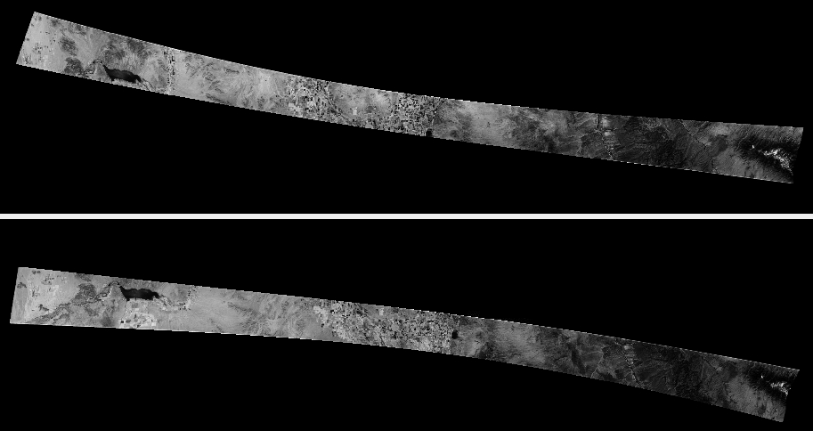
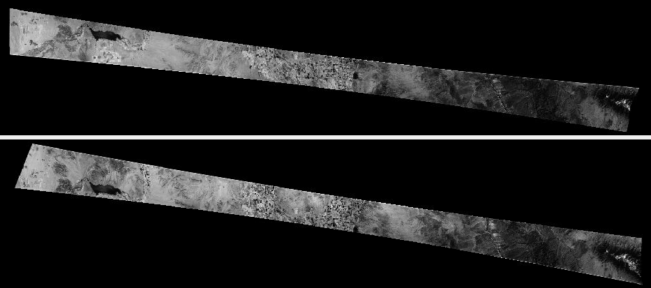

.. _kh4:

Declassified satellite images: KH-4B
------------------------------------

ASP has preliminary support for the declassified high-resolution CORONA KH-4B images. 

*This support is very experimental, and likely a lot of work is needed to make
it work reliably.*

For the latest suggested processing workflow, in the context of KH-9 images, see
:numref:`kh9`.
 
These images can be processed using either optical bar (panoramic) camera models
or as pinhole camera models with RPC distortion. Most of the steps are similar
to the example in :numref:`skysat-example`. The optical bar camera model is
based on :cite:`schenk2003rigorous` and :cite:`sohn2004mathematical`, whose
format is described in :numref:`panoramic`. For KH-9 images, the Improvements
suggested in :cite:`ghuffar2022pipeline` are incorporated (:numref:`kh9`).

Fetching the data
~~~~~~~~~~~~~~~~~

KH-4B images are available via the USGS Earth Explorer, at

https://earthexplorer.usgs.gov/

(an account is required to download the data). We will work with the
KH-4B image pair::

    DS1105-2248DF076
    DS1105-2248DA082

To get these from Earth Explorer, click on the ``Data Sets`` tab and
select the three types of declassified data available, then in the
``Additional Criteria`` tab choose ``Declass 1``, and in the
``Entity ID`` field in that tab paste the above frames (if no results
are returned, one can attempt switching above to ``Declass 2``, etc).
Clicking on the ``Results`` tab presents the user with information about
these frames.

Clicking on ``Show Metadata and Browse`` for every image will pop-up a
table with meta-information. That one can be pasted into a text file,
named for example, ``DS1105-2248DF076.txt`` for the first image, from
which later the longitude and latitude of each image corner will be
parsed. Then one can click on ``Download Options`` to download the data.

.. _resizing_images:

Resizing the images
~~~~~~~~~~~~~~~~~~~

Sometimes the input images can be so large, that either the ASP tools
or the auxiliary ImageMagick ``convert`` program will fail, or the machine
will run out of memory. 

It is suggested to resize the images to a more manageable size, at least for
initial processing. This is easiest to do by opening the images in
``stereo_gui`` (:numref:`stereo_gui`), which will create a pyramid of subsampled
("sub") images at 1/2 the full resolution, then 1/4th, etc. This resampling is
done using local averaging, to avoid aliasing effects.

Alternatively, one can call ``gdal_translate`` (:numref:`gdal_tools`), such as::

    gdal_translate -outsize 25% 25% -r average input.tif output.tif

This will reduce the image size by a factor of 4. The ``-r average`` option will,
as before, help avoid aliasing.

A camera model (pinhole or optical bar) created at one resolution can be
converted to a another resolution by adjusting the ``pitch`` parameter (a higher
value of pitch means bigger pixels so lower resolution). For optical bar cameras
the image dimensions and image center need to be adjusted as well, as those are
in units of pixels.

Stitching the images
~~~~~~~~~~~~~~~~~~~~

Each downloaded image will be made up of 2-4 portions, presumably due to
the limitations of the scanning equipment. They can be stitched together
using ASP's ``image_mosaic`` tool (:numref:`image_mosaic`).

For some reason, the KH-4B images are scanned in an unusual order. To
mosaic them, the last image must be placed first, the next to last
should be second, etc. In addition, as seen from the tables of metadata
discussed earlier, some images correspond to the ``Aft`` camera type.
Those should be rotated 180 degrees after mosaicking, hence below we use
the ``--rotate`` flag for that one. The overlap width is manually
determined by looking at two of the sub images in ``stereo_gui``.

With this in mind, image mosaicking for these two images will happen as
follows::

     image_mosaic DS1105-2248DF076_d.tif DS1105-2248DF076_c.tif \
       DS1105-2248DF076_b.tif  DS1105-2248DF076_a.tif           \
       -o DS1105-2248DF076.tif                                  \
       --ot byte --overlap-width 7000 --blend-radius 2000
     image_mosaic DS1105-2248DA082_d.tif DS1105-2248DA082_c.tif \
       DS1105-2248DA082_b.tif  DS1105-2248DA082_a.tif           \
       -o DS1105-2248DA082.tif                                  \
       --ot byte --overlap-width 7000 --blend-radius 2000       \
       --rotate

In order to process with the optical bar camera model these images need
to be cropped to remove the most of empty area around the image. The
four corners of the valid image area can be manually found by clicking
on the corners in ``stereo_gui``. Note that for some input images it can
be unclear where the proper location for the corner is due to edge
artifacts in the film. Do your best to select the image corners such
that obvious artifacts are kept out and all reasonable image sections
are kept in. 

ASP provides a simple Python tool called ``historical_helper.py`` to rotate the
image so that the top edge is horizontal while also cropping the boundaries.
This tool requires installing the ImageMagick software. See
:numref:`historical_helper` for more details.

Pass in the corner coordinates as shown below in the order top-left, top-right,
bot-right, bot-left (column then row). This is also a good opportunity to
simplify the file names going forwards.

::

     historical_helper.py rotate-crop                                     \
       --interest-points '4523 1506  114956 1450  114956 9355  4453 9408' \
       --input-path DS1105-2248DA082.tif                                  \
       --output-path aft.tif
     historical_helper.py rotate-crop                                     \
       --interest-points '6335 1093  115555 1315  115536 9205  6265 8992' \
       --input-path DS1105-2248DF076.tif                                  \
       --output-path for.tif 

See :numref:`resizing_images` if these steps failed, as perhaps the images
were too large.

Fetching a ground truth DEM
~~~~~~~~~~~~~~~~~~~~~~~~~~~

To create initial cameras to use with these images, and to later refine and
validate the terrain model made from them, we will need a ground truth source.
Several good sets of DEMs exist, including SRTM, ASTER, and TanDEM-X
(:numref:`initial_terrain`). Here we will work with SRTM, which provides DEMs
with a 30-meter grid size. The bounds of the region of interest are inferred
from the tables with meta-information from above. 

The SRTM DEM must be adjusted to be relative to the WGS84 datum, as discussed in
:numref:`conv_to_ellipsoid`.

The visualization of all images and DEMs can be done in ``stereo_gui``.

Creating camera files
~~~~~~~~~~~~~~~~~~~~~

ASP provides the tool named ``cam_gen`` (:numref:`cam_gen`) that, based on a
camera's intrinsics and the positions of the image corners on Earth's surface
will create initial camera models that will be the starting point for aligning
the cameras.

To create optical bar camera models, an example camera model file is
needed. This needs to contain all of the expected values for the camera,
though image_size, image_center, iC, and IR can be any value since they
will be recalculated. The pitch is determined by the resolution of the
scanner used, which is seven microns. The other values are determined by
looking at available information about the satellite. For the first
image (DS1105-2248DF076) the following values were used::

     VERSION_4
     OPTICAL_BAR
     image_size = 13656 1033
     image_center = 6828 517
     pitch = 7.0e-06
     f = 0.61000001430511475
     scan_time = 0.5
     forward_tilt = 0.2618
     iC = -1030862.1946224371 5468503.8842079658 3407902.5154047827
     iR = -0.95700845635275322 -0.27527006183758934 0.091439638698163225 -0.26345593052063937 0.69302501329766897 -0.67104940475144637 0.1213498543172795 -0.66629027007731101 -0.73575232847574434
     speed = 7700
     mean_earth_radius = 6371000
     mean_surface_elevation = 4000
     motion_compensation_factor = 1.0
     scan_dir = right

For a description of each value, see :numref:`panoramic`. For
the other image (aft camera) the forward tilt was set to -0.2618 and
scan_dir was set to 'left'. The correct values for scan_dir (left or
right) and use_motion_compensation (1.0 or -1.0) are not known for
certain due to uncertainties about how the images were recorded and may
even change between launches of the KH-4 satellite. You will need to
experiment to see which combination of settings produces the best
results for your particular data set.

The metadata table from Earth Explorer has the following entries for
DS1105-2248DF076::

     NW Corner Lat dec   31.266
     NW Corner Long dec  99.55
     NE Corner Lat dec   31.55
     NE Corner Long dec  101.866
     SE Corner Lat dec   31.416
     SE Corner Long dec  101.916
     SW Corner Lat dec   31.133
     SW Corner Long dec  99.55

These correspond to the upper-left, upper-right, lower-right, and
lower-left pixels in the image. We will invoke ``cam_gen`` as follows::

     cam_gen --sample-file sample_kh4b_for_optical_bar.tsai     \
       --camera-type opticalbar                                 \
       --lon-lat-values                                         \
       '99.55 31.266 101.866 31.55 101.916 31.416 99.55 31.133' \
       for.tif --reference-dem dem.tif --refine-camera -o for.tsai

     cam_gen --sample-file sample_kh4b_aft_optical_bar.tsai     \
       --camera-type opticalbar                                 \
       --lon-lat-values                                         \
       '99.566 31.266 101.95 31.55 101.933 31.416 99.616 31.15' \
       aft.tif --reference-dem dem.tif --refine-camera -o aft.tsai

It is very important to note that if, for example, the upper-left image
corner is in fact the NE corner from the metadata, then that corner
should be the first in the longitude-latitude list when invoking this
tool.

Bundle adjustment and stereo
~~~~~~~~~~~~~~~~~~~~~~~~~~~~

Before processing the input images it is a good idea to experiment with
reduced resolution copies in order to accelerate testing. You can easily
generate reduced resolution copies of the images using ``stereo_gui`` as
shown below. 

::

     stereo_gui for.tif aft.tif --create-image-pyramids-only
     ln -s for_sub8.tif  for_small.tif
     ln -s aft_sub8.tif  aft_small.tif
     cp for.tsai for_small.tsai
     cp aft.tsai aft_small.tsai

The new .tsai files need to be adjusted by updating the image_size,
image_center (divide by resolution factor, which is 8 here), and the
pitch (multiply by the resolution factor) to account for the
downsample amount.

You can now run bundle adjustment on the downsampled images::

     bundle_adjust for_small.tif aft_small.tif \
       for_small.tsai aft_small.tsai           \
       -t opticalbar                           \
       --max-iterations 100                    \
       --camera-weight 0                       \
       --tri-weight 0.1                        \
       --tri-robust-threshold 0.1              \
       --disable-tri-ip-filter                 \
       --skip-rough-homography                 \
       --inline-adjustments                    \
       --ip-detect-method 1                    \
       --datum WGS84                           \
       -o ba_small/run

Validation of cameras
~~~~~~~~~~~~~~~~~~~~~

An important sanity check is to mapproject the images with these
cameras, for example as::

     mapproject dem.tif for.tif for.tsai for.map.tif
     mapproject dem.tif aft.tif aft.tsai aft.map.tif

and then overlay the mapprojected images on top of the DEM in
``stereo_gui``. If it appears that the images were not projected
correctly, or there are gross alignment errors, likely the order of
image corners was incorrect. At this stage it is not unusual that the
mapprojected images are somewhat shifted from where they should be,
that will be corrected later.

This exercise can be done with the small versions of the images and
cameras, and also before and after bundle adjustment.

Running stereo
~~~~~~~~~~~~~~

Stereo with raw images::

     parallel_stereo --stereo-algorithm asp_mgm                \
       for_small.tif aft_small.tif                             \
       ba_small/run-for_small.tsai ba_small/run-aft_small.tsai \
       --subpixel-mode 9                                       \
       --alignment-method affineepipolar                       \
       -t opticalbar --skip-rough-homography                   \
       --disable-tri-ip-filter                                 \
       --ip-detect-method 1                                    \
       stereo_small_mgm/run

It is strongly suggested to run stereo with *mapprojected images*, per
:numref:`mapproj-example`. Ensure the mapprojected images have the same
resolution, and overlay them on top of the initial DEM first, to check for gross
misalignment.

See :numref:`nextsteps` for a discussion about various speed-vs-quality choices
in stereo.

.. _kh4_align:

DEM generation and alignment
~~~~~~~~~~~~~~~~~~~~~~~~~~~~

Next, a DEM is created, with an auto-determined UTM or polar
stereographic projection (:numref:`point2dem`)::

     point2dem --auto-proj-center \
       --tr 30 stereo_small_mgm/run-PC.tif

The grid size (``--tr``) is in meters. 

The produced DEM could be rough. It is sufficient however to align
to the SRTM DEM by hillshading the two and finding matching features::

     pc_align --max-displacement -1                    \
       --initial-transform-from-hillshading similarity \
       --save-transformed-source-points                \
       --num-iterations 0                              \
       dem.tif stereo_small_mgm/run-DEM.tif            \
       -o stereo_small_mgm/run

The resulting aligned cloud can be regridded as::

     point2dem --auto-proj-center \
       --tr 30                    \
       stereo_small_mgm/run-trans_source.tif

Consider examining in ``stereo_gui`` the left and right hillshaded files produced
by ``pc_align`` and the match file among them, to ensure tie points among
the two DEMs were found properly (:numref:`stereo_gui_view_ip`). 

There is a chance that this may fail as the two DEMs to align could be too
different. In that case, the two DEMs can be regridded as in :numref:`regrid`,
say with a grid size of 120 meters. The newly obtained coarser SRTM DEM can be
aligned to the coarser DEM from stereo.

The alignment transform could later be refined or applied to the initial clouds
(:numref:`prevtrans`).

Floating the intrinsics
~~~~~~~~~~~~~~~~~~~~~~~

The obtained alignment transform can be used to align the cameras as
well, and then one can experiment with floating the intrinsics.
See :numref:`intrinsics_ground_truth`.

Modeling the camera models as pinhole cameras with RPC distortion
~~~~~~~~~~~~~~~~~~~~~~~~~~~~~~~~~~~~~~~~~~~~~~~~~~~~~~~~~~~~~~~~~

Once sufficiently good optical bar cameras are produced and the
DEMs from them are reasonably similar to some reference terrain
ground truth, such as SRTM, one may attempt to improve the accuracy
further by modeling these cameras as simple pinhole models with the
nonlinear effects represented as a distortion model given by Rational
Polynomial Coefficients (RPC) of any desired degree (see
:numref:`pinholemodels`). The best fit RPC representation can be
found for both optical bar models, and the RPC can be further
optimized using the reference DEM as a constraint.

To convert from optical bar models to pinhole models with RPC distortion
one does::

    convert_pinhole_model for_small.tif for_small.tsai \
      -o for_small_rpc.tsai --output-type RPC          \
      --camera-to-ground-dist 300000                   \
      --sample-spacing 50 --rpc-degree 2

and the same for the other camera. Here, one has to choose carefully
the camera-to-ground-distance. Above it was set to 300 km.  

The obtained cameras should be bundle-adjusted as before. One can
create a DEM and compare it with the one obtained with the earlier
cameras. Likely some shift in the position of the DEM will be present,
but hopefully not too large. The ``pc_align`` tool can be used to make
this DEM aligned to the reference DEM.

Next, one follows the same process as outlined in :numref:`skysat` and
:numref:`floatingintrinsics` to refine the RPC coefficients. It is suggested to
use the ``--heights-from-dem`` option as in that example. Here we use the more
complicated ``--reference-terrain`` option. 

We will float the RPC coefficients of the left and right images independently,
as they are unrelated. The initial coefficients must be manually modified to be
at least 1e-7, as otherwise they will not be optimized. In the latest builds
this is done automatically by ``bundle_adjust`` (option ``--min-distortion``).

The command we will use is::

     bundle_adjust for_small.tif aft_small.tif                       \
       for_small_rpc.tsai aft_small_rpc.tsai                         \
       -o ba_rpc/run --max-iterations 200                            \
       --camera-weight 0 --disable-tri-ip-filter                     \
       --skip-rough-homography --inline-adjustments                  \
       --ip-detect-method 1 -t nadirpinhole --datum WGS84            \
       --force-reuse-match-files --reference-terrain-weight 1000     \
       --parameter-tolerance 1e-12 --max-disp-error 100              \
       --disparity-list stereo/run-unaligned-D.tif                   \
       --max-num-reference-points 40000 --reference-terrain srtm.tif \
       --solve-intrinsics                                            \
       --intrinsics-to-share 'focal_length optical_center'           \
       --intrinsics-to-float other_intrinsics --robust-threshold 10  \
       --initial-transform pc_align/run-transform.txt

Here it is suggested to use a match file with dense interest points
(:numref:`dense_ip`). The initial transform is the transform written by
``pc_align`` applied to the reference terrain and the DEM obtained with the
camera models ``for_small_rpc.tsai`` and ``aft_small_rpc.tsai`` (with the
reference terrain being the first of the two clouds passed to the alignment
program). The unaligned disparity in the disparity list should be from the
stereo run with these initial guess camera models (hence stereo should be used
with the ``--unalign-disparity`` option). It is suggested that the optical
center and focal lengths of the two cameras be kept fixed, as RPC distortion
should be able model any changes in those quantities as well.

One can also experiment with the option ``--heights-from-dem`` instead
of ``--reference-terrain``. The former seems to be able to handle better
large height differences between the DEM with the initial cameras and
the reference terrain, while the latter is better at refining the
solution.

Then one can create a new DEM from the optimized camera models and see
if it is an improvement.

Another example of using RPC and an illustration is in :numref:`kh7_fig`.

.. _kh7:

Declassified satellite images: KH-7
-----------------------------------

KH-7 was an effective observation satellite that followed the Corona program. It
contained an index (frame) camera and a single strip (pushbroom) camera. 

ASP has *no exact camera model for this camera.* An RPC distortion model can be
fit as in :numref:`dem2gcp`. See a figure in :numref:`kh7_fig`. 

*This produces an approximate solution, which goes the right way but is likely
not good enough.*

For the latest suggested processing workflow, see the section on KH-9 images
(:numref:`kh9`).

For this example we find the following images in Earth Explorer
declassified collection 2::

     DZB00401800038H025001
     DZB00401800038H026001

Make note of the latitude/longitude corners of the images listed in Earth Explorer,
and note which image corners correspond to which compass locations.

It is suggested to resize the images to a more manageable size. This can
avoid failures in the processing below (:numref:`resizing_images`).

We will merge the images with the ``image_mosaic`` tool. These images have a
large amount of overlap and we need to manually lower the blend radius so that
we do not have memory problems when merging the images. Note that the image
order is different for each image.

::

     image_mosaic DZB00401800038H025001_b.tif  DZB00401800038H025001_a.tif \
       -o DZB00401800038H025001.tif  --ot byte --blend-radius 2000         \
       --overlap-width 10000
     image_mosaic DZB00401800038H026001_a.tif  DZB00401800038H026001_b.tif \
       -o DZB00401800038H026001.tif  --ot byte --blend-radius 2000         \
       --overlap-width 10000

For this image pair we will use the following SRTM images from Earth
Explorer::

     n22_e113_1arc_v3.tif
     n23_e113_1arc_v3.tif
     dem_mosaic n22_e113_1arc_v3.tif n23_e113_1arc_v3.tif -o srtm_dem.tif

The SRTM DEM must be first adjusted to be relative to WGS84
(:numref:`conv_to_ellipsoid`).

Next we crop the input images so they only contain valid image area. We
use, as above, the ``historical_helper.py`` tool. See :numref:`historical_helper`
for how to install the ImageMagick software that it needs.

::

     historical_helper.py rotate-crop                                    \
       --interest-points '1847 2656  61348 2599  61338 33523  1880 33567'\
       --input-path DZB00401800038H025001.tif                            \
       --output-path 5001.tif
     historical_helper.py rotate-crop                                    \
       --interest-points '566 2678  62421 2683  62290 33596  465 33595'  \
       --input-path DZB00401800038H026001.tif                            \
       --output-path 6001.tif

We will try to approximate the KH-7 camera using a pinhole model. The
pitch of the image is determined by the scanner, which is 7.0e-06 meters
per pixel. The focal length of the camera is reported to be 1.96 meters,
and we will set the optical center at the center of the image. We need
to convert the optical center to units of meters, which means
multiplying the pixel coordinates by the pitch to get units of meters.

Using the image corner coordinates which we recorded earlier, use the
``cam_gen`` tool (:numref:`cam_gen`) to generate camera models for each image,
being careful of the order of coordinates.

::

     cam_gen --pixel-pitch 7.0e-06 --focal-length 1.96                             \
       --optical-center 0.2082535 0.1082305                                        \
       --lon-lat-values '113.25 22.882 113.315 23.315 113.6 23.282 113.532 22.85'  \
       5001.tif --reference-dem srtm_dem.tif --refine-camera -o 5001.tsai
     cam_gen --pixel-pitch 7.0e-06 --focal-length 1.96                             \
       --optical-center 0.216853 0.108227                                          \
       --lon-lat-values '113.2 22.95 113.265 23.382 113.565 23.35 113.482 22.915'  \
       6001.tif --reference-dem srtm_dem.tif --refine-camera -o 6001.tsai

A quick way to evaluate the camera models is to use the
``camera_footprint`` tool to create KML footprint files, then look at
them in Google Earth. For a more detailed view, you can mapproject them
and overlay them on the reference DEM in ``stereo_gui``.

::

     camera_footprint 5001.tif  5001.tsai  --datum  WGS_1984 --quick \
       --output-kml  5001_footprint.kml -t nadirpinhole --dem-file srtm_dem.tif
     camera_footprint 6001.tif  6001.tsai  --datum  WGS_1984 --quick \
       --output-kml  6001_footprint.kml -t nadirpinhole --dem-file srtm_dem.tif

The output files from ``cam_gen`` will be roughly accurate but they may
still be bad enough that ``bundle_adjust`` has trouble finding a
solution. One way to improve your initial models is to use ground
control points. For this test case I was able to match features along
the rivers to the same rivers in a hillshaded version of the reference
DEM. I used three sets of GCPs, one for each image individually and a
joint set for both images. I then ran ``bundle_adjust`` individually for
each camera using the GCPs.

::

    bundle_adjust 5001.tif 5001.tsai gcp_5001.gcp \
      -t nadirpinhole --inline-adjustments        \
      --num-passes 1 --camera-weight 0            \
      --ip-detect-method 1 -o bundle_5001/out     \
      --max-iterations 30 --fix-gcp-xyz

    bundle_adjust 6001.tif 6001.tsai gcp_6001.gcp \
      -t nadirpinhole --inline-adjustments        \
      --num-passes 1 --camera-weight 0            \
      --ip-detect-method 1 -o bundle_6001/out     \
      --max-iterations 30 --fix-gcp-xyz

Check the GCP pixel residuals at the end of the produced residual file
(:numref:`ba_err_per_point`).

At this point it is a good idea to experiment with lower-resolution copies of
the input images before running processing with the full size images. You can
generate these using ``stereo_gui``
::

     stereo_gui 5001.tif 6001.tif --create-image-pyramids-only
     ln -s 5001_sub16.tif  5001_small.tif
     ln -s 6001_sub16.tif  6001_small.tif
     
Make copies of the camera files for the smaller images::
     
     cp 5001.tsai  5001_small.tsai
     cp 6001.tsai  6001_small.tsai

Multiply the pitch in the produced cameras by the resolution scale factor.

Now we can run ``bundle_adjust`` and ``parallel_stereo``. If you are using the
GCPs from earlier, the pixel values will need to be scaled to match the
subsampling applied to the input images.

::

    bundle_adjust 5001_small.tif 6001_small.tif              \
       bundle_5001/out-5001_small.tsai                       \
       bundle_6001/out-6001_small.tsai                       \
       gcp_small.gcp -t nadirpinhole -o bundle_small_new/out \
       --force-reuse-match-files --max-iterations 30         \
       --camera-weight 0 --disable-tri-ip-filter             \
       --skip-rough-homography                               \
       --inline-adjustments --ip-detect-method 1             \
       --datum WGS84 --num-passes 2

    parallel_stereo --alignment-method homography                      \
      --skip-rough-homography --disable-tri-ip-filter                  \
      --ip-detect-method 1 --session-type nadirpinhole                 \
      --stereo-algorithm asp_mgm --subpixel-mode 9                     \
      5001_small.tif 6001_small.tif                                    \
      bundle_small_new/out-out-5001_small.tsai                         \
      bundle_small_new/out-out-6001_small.tsai                         \
      st_small_new/out

A DEM is created with ``point2dem`` (:numref:`point2dem`)::

    point2dem --auto-proj-center st_small_new/out-PC.tif

The above may produce a DEM with many holes. It is strongly suggested to run
stereo with *mapprojected images* (:numref:`mapproj-example`). Use the ``asp_mgm``
algorithm. See also :numref:`nextsteps` for a discussion about various
speed-vs-quality choices in stereo.

.. figure:: ../images/kh7_dem.png
   :name: kh7_fig
   
   An example of a DEM created from KH-7 images after modeling distortion with RPC
   of degree 3 (within the green polygon), on top of a reference terrain. GCP were used (:numref:`dem2gcp`), as well as mapprojected images and the ``asp_mgm``
   algorithm. 

Fitting an RPC model to the cameras with the help of GCP created by the
``dem2gcp`` program (:numref:`dem2gcp`) can greatly help improve the produced
DEM. See an illustration in :numref:`kh7_fig`, and difference maps in
:numref:`kh7_orig_vs_opt`.

.. _kh9:

Declassified satellite images: KH-9
-----------------------------------

The KH-9 satellite contained one frame camera and two panoramic cameras,
one pitched forward and one aft.

The frame camera is a regular pinhole model (:numref:`pinholemodels`). 
The images produced with it could be handled as for KH-7 (:numref:`kh7`), 
SkySat (:numref:`skysat`), or using Structure-from-Motion (:numref:`sfm`). 

This example describes how to process the KH-9 panoramic camera images. 
The workflow below is more recent than the one for KH-4B (:numref:`kh4`)
or KH-7, and it requires the latest build (:numref:`release`).

*The ASP support for panoramic images is highly experimental and is work in
progress.*

Image mosaicking
~~~~~~~~~~~~~~~~

For this example we use the following images from the Earth Explorer
declassified collection 3::

     D3C1216-200548A041
     D3C1216-200548F040

Make note of the latitude/longitude corners of the images listed in Earth
Explorer and corresponding raw image corners. 

It is suggested to resize the images to a more manageable size, such as 1/16th
the original image resolution, at least to start with
(:numref:`resizing_images`). This can avoid failures with ImageMagick in the
processing below when the images are very large.

We merge the images with ``image_mosaic`` (:numref:`image_mosaic`)::

    image_mosaic                                        \
      D3C1216-200548F040_a.tif D3C1216-200548F040_b.tif \
      D3C1216-200548F040_c.tif D3C1216-200548F040_d.tif \
      D3C1216-200548F040_e.tif D3C1216-200548F040_f.tif \
      D3C1216-200548F040_g.tif D3C1216-200548F040_h.tif \
      D3C1216-200548F040_i.tif D3C1216-200548F040_j.tif \
      D3C1216-200548F040_k.tif D3C1216-200548F040_l.tif \
      --ot byte --overlap-width 3000                    \
      -o D3C1216-200548F040.tif
      
    image_mosaic                                        \
      D3C1216-200548A041_a.tif D3C1216-200548A041_b.tif \
      D3C1216-200548A041_c.tif D3C1216-200548A041_d.tif \
      D3C1216-200548A041_e.tif D3C1216-200548A041_f.tif \
      D3C1216-200548A041_g.tif D3C1216-200548A041_h.tif \
      D3C1216-200548A041_i.tif D3C1216-200548A041_j.tif \
      D3C1216-200548A041_k.tif --overlap-width 1000     \
      --ot byte -o D3C1216-200548A041.tif --rotate

These images also need to be cropped to remove most of the area around
the images::

     historical_helper.py rotate-crop      \
       --input-path D3C1216-200548F040.tif \
       --output-path for.tif               \
       --interest-points '2414 1190 346001 1714 
                          345952 23960 2356 23174'
     historical_helper.py rotate-crop      \
       --input-path D3C1216-200548A041.tif \
       --output-path aft.tif               \
       --interest-points '1624 1333 346183 1812 
                          346212 24085  1538 23504'

We used, as above, the ``historical_helper.py`` tool. See
:numref:`historical_helper` for how to install the ImageMagick software that it
needs.

Reference terrain
~~~~~~~~~~~~~~~~~

Fetch a reference DEM for the given site (:numref:`initial_terrain`). It
should be converted to be relative to the WGS84 datum
(:numref:`conv_to_ellipsoid`) and to a local UTM projection with ``gdalwarp``
with bicubic interpolation (:numref:`gdal_tools`). We will call this terrain
``ref.tif``. This terrain will help with registration later.

For the purpose of mapprojection, the terrain should be blurred to attenuate any
misalignment (:numref:`dem_prep`). The blurred version of this will be called
``ref_blur.tif``.

.. _ghuffar_method:

Modeling the cameras
~~~~~~~~~~~~~~~~~~~~

We follow the approach in :cite:`ghuffar2022pipeline`. This work
makes the following additional improvements as compared to the prior 
efforts in :numref:`kh4`:

 - The satellite velocity is a 3D vector, which is solved for independently,
   rather than being tied to satellite pose and camera tilt.
 - It is not assumed that the satellite pose is fixed during scanning. Rather,
   there are two camera poses, for the starting and ending scan times, with
   *slerp* interpolation in between.    
 - The scan time and scalar speed are absorbed into the motion compensation factor.
 - The forward tilt is not modeled, hence only the camera pose is taken into 
   account, rather than the satellite pose and its relation to the camera pose.  

Sample camera format
~~~~~~~~~~~~~~~~~~~~

It is strongly advised to work at 1/16th resolution of the original images, as
the images are very large. Later, any optimized cameras can be adjusted to be at
a different resolution, as documented in :numref:`resizing_images`.

At 1/16th the resolution, a sample panoramic (OpticalBar) camera file, before
refinements of intrinsics and extrinsics, has the form::

  VERSION_4
  OPTICAL_BAR
  image_size = 21599 1363
  image_center = 10799.5 681.5
  pitch = 0.000112
  f = 1.52
  scan_time = 1
  forward_tilt = 0
  iC = 0 0 0 
  iR = 1 0 0 0 1 0 0 0 1
  speed = 0
  mean_earth_radius = 6371000
  mean_surface_elevation = 0
  motion_compensation_factor = 0
  scan_dir = right
  velocity = 0 0 0

We call this file ``sample_sub16.tsai``. 

There are several notable differences with the optical bar models before the
workflow and modeling was updated (:numref:`ghuffar_method`). Compared to the
sample file in :numref:`panoramic`, the scan time, forward tilt, speed, mean
surface elevation, and motion compensation factor are set to nominal values.

The additional ``velocity`` field is present, which for now has zero values. If
this field is not set, the prior optical bar logic will be invoked. Hence
internally both implementations are still supported.

The ``iR`` matrix has the starting camera pose. If the ending camera pose is not
provided, it is assumed to be the same as the starting one. When an optical bar
model is saved, the ending camera pose will be added as a line of the form::

  final_pose = 0.66695010211673467 2.3625446924332656 1.5976801601116621

This represents a rotation in the axis-angle format, unlike ``iR`` which is
shown in regular matrix notation.

The focal length is 1.52 m, per existing documentation. The pixel pitch (at
which the film is scanned) is known to be 7e-6 m. Here it is multiplied by 16 to
account for the fact that we work at 1/16th the resolution of the original
images.

The image size comes from the image file (at the current lower resolution). The
image center is set to half the image size.

Creation of initial cameras
~~~~~~~~~~~~~~~~~~~~~~~~~~~

Camera files are generated using ``cam_gen`` (:numref:`cam_gen`), with the help
of the sample file from above. Let the Fwd image at 1/16th resolution be
called ``fwd_sub16.tif``. The command is::

    cam_gen                               \
      --sample-file sample_sub16.tsai     \
      --camera-type opticalbar            \
      --lon-lat-values                    \
        '-151.954 61.999 -145.237 61.186 
         -145.298 60.944 -152.149 61.771' \
      fwd_sub16.tif                       \
      --reference-dem ref.tif             \
      --refine-camera                     \
      --gcp-file fwd_sub16.gcp            \
      -o fwd_sub16.tsai

The historical images are often cropped after being scanned, and the image size
and optical center (image center) will be different for each image. The command
above will write the correct image size in the output file, and will set the
optical center to half of that. Hence, the entries for these in the sample file
will be ignored.

An analogous command is run for the Aft camera.

The longitude-latitude corners must must correspond to the expected traversal of
the raw (non-mapprojected) image corners (:numref:`cam_gen_pinhole`). This
requires some care, especially given that the Fwd and Aft images have 180
degrees of rotation between them.

Validation of guessed cameras
~~~~~~~~~~~~~~~~~~~~~~~~~~~~~

The produced cameras should be verified by mapprojection (:numref:`mapproject`)::

    mapproject       \
      --tr 12        \
      ref_blur.tif   \
      fwd_sub16.tif  \
      fwd_sub16.tsai \
      fwd_sub16.map.tif

The grid size (``--tr``) is in meters. Here, it was known from existing information 
that the ground sample distance at full resolution was about 0.75 m / pixel.
This was multiplied by 16 given the lower resolution used here. If not known,
the grid size can be auto-guessed by this program.

The Fwd and Aft mapprojected images should be overlaid with georeference
information on top of the reference DEM. It is expected that the general
position and orientation would be good, but there would be a lot of warping due
to unknown intrinsics.

   
   An example of Fwd and Aft mapprojected images. Notable warping is observed.

Optimization of cameras
~~~~~~~~~~~~~~~~~~~~~~~

We will follow the bundle adjustment approach outlined in
:numref:`heights_from_dem`.

The quantities to be optimized are the extrinsics (camera position and starting
orientation), and the intrinsics, which include the image center (optical
offset), focal length, motion compensation factor, velocity vector, and the ending
orientation. The last three fall under the ``other_intrinsics`` category in
bundle adjustment. The command can be as follows::

    bundle_adjust                               \
      fwd_sub16.tif aft_sub16.tif               \
      fwd_sub16.tsai aft_sub16.tsai             \
      --mapprojected-data                       \
        'fwd_sub16.map.tif aft_sub16.map.tif'   \
      fwd_sub16.gcp aft_sub16.gcp               \
      --inline-adjustments                      \
      --solve-intrinsics                        \
      --intrinsics-to-float other_intrinsics    \
      --intrinsics-to-share none                \
      --heights-from-dem ref.tif                \
      --heights-from-dem-uncertainty 10000      \
      --ip-per-image 100000                     \
      --ip-inlier-factor 1000                   \
      --remove-outliers-params '75 3 1000 1000' \
      --num-iterations 250                      \
      -o ba/run

We passed in the GCP files produced earlier, that have information about the
ground coordinates of image corners. We made use of mapprojected images for
interest point matching (:numref:`mapip`).

The values for ``--heights-from-dem-uncertainty``, ``--ip-per-image``,
``--ip-inlier-factor``, and ``--remove-outliers-params`` are much larger than
usual, because of the very large distortion seen above. Otherwise too many valid
interest points may be eliminated. Later these parameters can be tightened.

Check the produced clean match files with ``stereo_gui``
(:numref:`stereo_gui_pairwise_matches`). It is very important to have many of
them in the corners and roughly uniformly distributed across the images. One
could also consider adding the ``--ip-per-tile`` and ``--matches-per-tile``
parameters (:numref:`ba_ip`). These would need some tuning at each resolution to
ensure the number of matches is not overly large. 

The updated cameras will be saved in the output directory. These should be
validated by mapprojection as before.

We did not optimize for now the focal length and optical center, as they
were known more reliably than the other intrinsics. All these can be optimized
together in a subsequent pass.

See :numref:`bundle_adjust` for more information about ``bundle_adjust`` and
the various report files that are produced.

   
   Fwd and Aft mapprojected images, after optimization of intrinsics. The images 
   are much better aligned.

Creation of a terrain model
~~~~~~~~~~~~~~~~~~~~~~~~~~~

Inspect the mapprojected images created with the new cameras. They will likely
be more consistent than before. Look at the convergence angles report
(:numref:`ba_conv_angle`). Hopefully this angle will have a reasonable value,
such as between 10 and 30 degrees, or so.

Run stereo and DEM creation with the mapprojected images and the ``asp_mgm``
algorithm. It is suggested to follow very closely the steps in
:numref:`mapproj-example`.

Fixing horizontal registration errors
~~~~~~~~~~~~~~~~~~~~~~~~~~~~~~~~~~~~~

It is quite likely that the mapprojected images after the last bundle adjustment
are much improved, but the stereo terrain model still shows systematic issues
relative to the reference terrain. 

Then, the ``dem2gcp`` program (:numref:`dem2gcp`) can be invoked to create 
GCP that can fix this misregistration.

Bundle adjustment can happen with these dense GCP, while optimizing all
intrinsics and extrinsics and sharing none of the intrinsics. Afterwards, a new
stereo DEM can be created as before.

If happy enough with results at a given resolution, the cameras can be rescaled
to a finer resolution and the process continued. See :numref:`resizing_images`
for how a camera model can be modified to work at a different resolution.

Fixing local warping
~~~~~~~~~~~~~~~~~~~~

The panoramic (OpticalBar) camera model we worked with may not have enough
degrees of freedom to fix issues with local warping that arise during the
storage of the film having the historical images or its subsequent digitization.

To address that, the cameras can be converted to CSM linescan format (and the
images rotated by 90 degrees). See :numref:`opticalbar2csm`. 

Then, the jitter solver (:numref:`jitter_solve`) can be employed. It is
suggested to set ``--num-lines-per-position`` and
``--num-lines-per-orientation`` for this program so that there exist about 10-40
position and orientation samples along the scan direction.

This program can also accept GCP files, just like ``bundle_adjust``.
We invoked it as follows::

    jitter_solve                           \
      fwd_sub16.tif aft_sub16.tif          \
      fwd_sub16.tsai aft_sub16.tsai        \
      fwd_sub16.gcp aft_sub16.gcp          \
      --match-files-prefix ba/run          \
      --num-lines-per-position 1000        \
      --num-lines-per-orientation 1000     \
      --heights-from-dem ref.tif           \
      --heights-from-dem-uncertainty 500   \
      --max-initial-reprojection-error 100 \
      --num-iterations 100                 \
      -o jitter_sub16/run

The GCP had a sigma of 100 or so, so less uncertainty than in
``--heights-from-dem-uncertainty``, by a notable factor. 

In practice we found that after one pass of the jitter solver and stereo DEM
creation, it may be needed to run GCP creation with ``dem2gcp`` and bundle
adjustment again to refine all the intrinsics, including focal length and lens
distortion, this time with the CSM linescan model. Then, one can invoke
``jitter_solve`` one more time. Each step should offer a further improvement in
results.

For fine-level control over interest point matches, dense matches from disparity
are suggested (:numref:`dense_ip`).

If the satellite acquired several overlapping pairs of images in quick
succession, it is suggested to use them together, as that can improve the
registration.

The linescan cameras are not as easy to convert to a different resolution
as the OpticalBar cameras, so they need to be recreated at each resolution
before being further refined.
