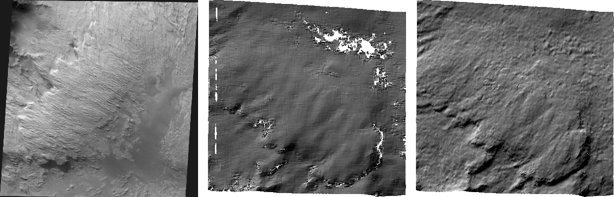

.. _hrsc_example:

Mars Express High Resolution Stereo Camera (HRSC)
-------------------------------------------------

The HRSC camera on the Mars Express satellite is a complicated system,
consisting of multiple channels pointed in different directions plus
another super resolution channel. The best option to create DEMs is to
use the two dedicated stereo channels. These are pointed ahead of and
behind the nadir channel and collect a stereo observation in a single
pass of the satellite.

Since each observation contains both stereo channels, one observation is
sufficient to create a DEM.

Data can be downloaded from the `HRSC node <http://pds-geosciences.wustl.edu/missions/mars_express/hrsc.htm>`_ in the Planetary Data System (PDS).

HRSC data is organized into categories. Level 2 is radiometrically
corrected, level 3 is corrected and mapprojected onto MOLA, and level 4
is corrected and mapprojected on to a DEM created from the HRSC data.
You should use the level 2 data for creating DEMs with ASP. If you would
like to download one of the already created DEMs, it may be easiest to
use the areoid referenced version (.da4 extension) since that is
consistent with MOLA.

Preparing the data
~~~~~~~~~~~~~~~~~~

Fetch the two stereo channels using ``wget`` from::

   https://pds-geosciences.wustl.edu/mex/mex-m-hrsc-3-rdr-v4/mexhrs_4000/data/1995/h1995_0000_s13.img
   https://pds-geosciences.wustl.edu/mex/mex-m-hrsc-3-rdr-v4/mexhrs_4000/data/1995/h1995_0000_s23.img

   Sample outputs from a cropped region of HRSC frame 1995.  Left: Cropped input.
   Center: Block matching with subpixel mode 3.  Right: MGM algorithm with cost
   mode 3.

See :numref:`planetary_images` for how to set up ISIS and download the needed
kernels. For HRSC, they are part of the ``mex`` dataset.

Run::

    hrsc2isis from=h1995_0000_s13.img to=h1995_0000_s13.cub
    hrsc2isis from=h1995_0000_s23.img to=h1995_0000_s23.cub
    spiceinit from=h1995_0000_s13.cub ckpredicted=true
    spiceinit from=h1995_0000_s23.cub ckpredicted=true

For ISIS prior to version 8.3.0, ``hrsc2isis`` cannot read the level 3 images
served by PDS. If ingestion fails, edit the .img files to change the level from
3 to 2, then rerun ``hrsc2isis``::

    perl -pi -e 's#(PROCESSING_LEVEL_ID\s+=) 3#$1 2#g' *.img

Here we added the ``ckpredicted=true`` flag to ``spiceinit``. Adding
``web=true`` can help avoid downloading the kernels, if this works. See the
(`spiceinit documentation <https://isis.astrogeology.usgs.gov/8.1.0/Application/presentation/Tabbed/spiceinit/spiceinit.html>`_).

Running stereo
~~~~~~~~~~~~~~

Consider running bundle adjustment before stereo (:numref:`bundle_adjust`).
This is not done here.

HRSC images are large and may have compression artifacts. It is suggested to
experiment running stereo on a small region with ``stereo_gui``
(:numref:`stereo_gui`). Invoke it as follows::

    stereo_gui                              \
      h1995_0000_s13.cub h1995_0000_s23.cub \
      --stereo-algorithm asp_mgm            \
      --cost-mode 3                         \
      mgm/out

Then select a clip in each image in the GUI, and run ``parallel_stereo`` from
the menu. The clips should be reasonably large, overlap well, and have notable
texture, to ensure enough interest point matches are found.

To run on the full images, replace ``stereo_gui`` with ``parallel_stereo`` in
the command above.

See :numref:`nextsteps` for other stereo algorithms, and information on
tradeoffs between them.

A DEM is created with ``point2dem`` (:numref:`point2dem`)::

    point2dem                            \
      --stereographic --auto-proj-center \
      mgm/out-PC.tif

Alignment to MOLA can be done with ``pc_align`` (:numref:`pc_align`).
