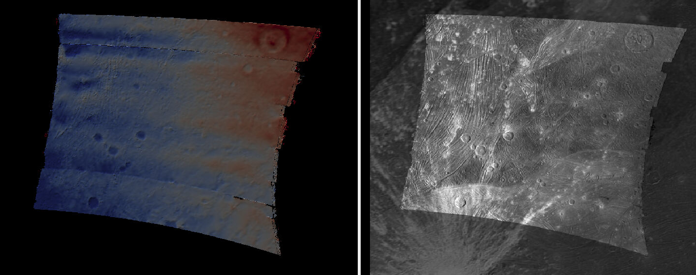

.. _junocam:

JunoCam
-------

JunoCam is an optical camera on the Juno spacecraft. It has been taking images
of Jupiter and its satellites since 2016.

This example shows how to produce terrain models and ortho images from JunoCam
images for Ganymede, the largest moon of Jupiter. These will be registered 
to the Voyager-Galileo global mosaic of Ganymede.

Fetching the data
~~~~~~~~~~~~~~~~~

Set (in bash)::

  url=https://planetarydata.jpl.nasa.gov/img/data/juno/JNOJNC_0018/DATA/RDR/JUPITER/ORBIT_34/
  
Download the .IMG and .LBL files for two observations::

    for f in JNCR_2021158_34C00001_V01 JNCR_2021158_34C00002_V01; do 
      for ext in .IMG .LBL; do 
        wget $url/$f$ext
      done
    done

Preparing the data
~~~~~~~~~~~~~~~~~~

Ensure ISIS is installed (:numref:`planetary_images`).

Create ISIS .cub files::

    for f in JNCR_2021158_34C00001_V01 JNCR_2021158_34C00002_V01; do 
        junocam2isis fr = $f.LBL to = $f.cub fullccd = yes
    done

This will result in many files, because JunoCam acquires multiple overlapping images
in quick succession.

Run ``spiceinit`` to get the camera pointing and other information::

    for f in *.cub; do
      spiceinit from = $f web = true
    done  

If the ``web = true`` option does not work, the ISIS data for the ``juno`` mission
needs to be downloaded, per the ISIS documentation.

We will put all these files into an ``img`` subdirectory.

  JunoCam images JNCR_2021158_34C00001_V01_0012 and
  JNCR_2021158_34C00002_V01_0010 as shown by ``stereo_gui``
  (:numref:`stereo_gui`). The shared area and a couple of matching craters are
  highlighted. 
  
A JunoCam image is made of 3 framelets, each about 128 pixels tall. The image
width is 1648 pixels. Consecutive images have overlapping areas, which helps
eliminate the effect of the gaps between the framelets.

External reference
~~~~~~~~~~~~~~~~~~

We will pixel-level register the JunoCam images to the 1 km / pixel Ganymede `Voyager -
Galileo global mosaic
<https://astrogeology.usgs.gov/search/map/ganymede_voyager_galileo_ssi_global_mosaic_1km>`_.

Crop from it a portion that covers our area of interest as::

    win="5745386 2069139 7893530 36002"
    gdal_translate -projwin $win                        \
      Ganymede_Voyager_GalileoSSI_global_mosaic_1km.tif \
      galileo_ortho.tif

This will be stored in a subdirectory named ``ref``. 

Initial DEM
~~~~~~~~~~~

Both image registration and stereo DEM creation benefit from mapprojecting the
JunoCam images onto a prior low-resolution DEM. A reasonably good such DEM can
be created by considering the surface zero height corresponding to the earlier
orthoimage clip.

Given that the elevations on Ganymede are on the order of 1 km, which is about
the image resolution, this works well enough. Such a DEM is produced with
``image_calc`` (:numref:`image_calc`) as::

    image_calc -c "var_0 * 0"     \
      --output-nodata-value -1e+6 \
      -d float32                  \
      ref/galileo_ortho.tif       \
      -o ref/flat_dem.tif

Image selection
~~~~~~~~~~~~~~~

We chose to focus on the highest resolution JunoCam images of Ganymede, as that
resulted in the best terrain model. The quality of the terrain model degraded
towards the limb, as expected. We worked with the images::

    JNCR_2021158_34C00001_V01_0009
    JNCR_2021158_34C00001_V01_0010
    JNCR_2021158_34C00001_V01_0011
    JNCR_2021158_34C00001_V01_0012
    JNCR_2021158_34C00001_V01_0013

and corresponding images that have ``34C00002`` in their name. 

Mapprojection
~~~~~~~~~~~~~

Each image was mapprojected (:numref:`mapproject`) at 1 km / pixel resolution,
with a command such as::

    mapproject --tr 1000                     \
      ref/flat_dem.tif                       \
      img/JNCR_2021158_34C00001_V01_0010.cub \
      map/JNCR_2021158_34C00001_V01_0010.map.tif

GCP creation
~~~~~~~~~~~~

We will create GCP that ties each JunoCam image to the reference
Voyager-Galileo image mosaic with ``gcp_gen`` (:numref:`gcp_gen`), 
invoked as follows::

    f=JNCR_2021158_34C00001_V01_0010

    gcp_gen                               \
      --ip-detect-method 0                \
      --inlier-threshold 50               \
      --ip-per-image 20000                \
      --individually-normalize            \
      --camera-image img/${f}.cub         \
      --mapproj-image map/${f}.map.tif    \
      --ortho-image ref/galileo_ortho.tif \
      --dem ref/flat_dem.tif              \
      --gcp-sigma 1000                    \
      --output-prefix gcp/run             \
      -o gcp/${f}.gcp
  
We set ``--gcp-sigma 1000``, which is rather high, as we do not know the exact
DEM that was employed to produce the reference image mosaic. The option ``--individually-normalize`` was essential, as these images come from different
sources.

  Interest point matches between mapprojected image 
  JNCR_2021158_34C00001_V01_0010 and the Voyager-Galileo mosaic. GCP are made
  from these matches.

Bundle adjustment
~~~~~~~~~~~~~~~~~

Bundle adjustment (:numref:`parallel_bundle_adjust`) was run with the 10 images
selected earlier and the GCP files::

    parallel_bundle_adjust                           \
      img/JNCR_2021158_34C0000[1-2]_V01_000[9-9].cub \
      img/JNCR_2021158_34C0000[1-2]_V01_001[0-3].cub \
      --ip-per-image 20000                           \
      --num-iterations 500                           \
      gcp/*.gcp                                      \
      -o ba/run

Stereo terrain creation
~~~~~~~~~~~~~~~~~~~~~~~

We ran ``parallel_stereo`` on each pair of images having ``34C00001`` vs
``34C00002`` in their names. Most of these overlap and result in a DEM::

    l=JNCR_2021158_34C00001_V01_0010
    r=JNCR_2021158_34C00002_V01_0010
    pref=stereo_map/${l}_${r}/run

    parallel_stereo                      \
      map/$l.map.tif map/$r.map.tif      \
      img/$l.cub img/$r.cub              \
      --bundle-adjust-prefix ba/run      \
      --ip-per-image 20000               \
      --stereo-algorithm asp_mgm         \
      --subpixel-mode 9                  \
      --subpixel-kernel 7 7              \
      --nodata-value 0                   \
      --num-matches-from-disparity 10000 \
      ${pref}                            \
      ref/flat_dem.tif

Here we used a small ``subpixel-kernel`` of 7 x 7 pixels, to ensure as little as
possible is eroded from the already narrow images. Note that the ``asp_mgm``
algorithm default ``corr-kernel`` value is 5 x 5 pixels
(:numref:`stereodefault`).

The stereo convergence angle (:numref:`stereo_pairs`) was about 35 degrees, which 
is very good.

Set the output projection (the same as in the reference image mosaic)::

    proj='+proj=eqc +lat_ts=0 +lat_0=0 +lon_0=180 +x_0=0 +y_0=0 +R=2632344.9707 +units=m +no_defs'
    
Then, ``point2dem`` was run::

  point2dem         \
    --t_srs "$proj" \
    --tr 1000       \
    ${pref}-PC.tif  \
    --orthoimage    \
    ${pref}-L.tif

This was followed by mosaicking of DEMs and orthoimages with ``dem_mosaic``
(:numref:`dem_mosaic`), and colorization with ``colormap`` (:numref:`colormap`).

  Left: Mosaicked DEM created from stereo of JunCam images. The color range
  corresponds to elevations between -1500 and 1500 meters. Right: produced
  JunoCam orthoimage overlaid on top of the Voyager-Galileo global mosaic.

The results of this processing are shown in the figure above. Three things are notable:

  - The image registration is pixel-level.
  - There are some seams at the top and bottom. Those can be eliminated
    with more images.
  - There are systematic artifacts in the elevations.
  
The latter issue is likely due to not well-modeled distortion and TDI effects,
given the JunoCam camera design. This will be fixed in the next section.

Intrinsics refinement
~~~~~~~~~~~~~~~~~~~~~

.. _junocam_opt:

  Left: The earlier mosaicked DEM created from stereo of JunCam images. Right:
  the produced DEM after optimizing the lens distortion with a DEM constraint.
  These are plotted with the same range of of elevations (-1500 to 1500 meters).
  The systematic artifacts are much less pronounced.

To address the systematic elevation artifacts, we will refine the intrinsics and
extrinsics of the cameras, while using the zero elevation DEM as a ground
constraint (with an uncertainty).

The approach in :numref:`ba_frame_linescan` is followed.

We will make use of dense matches from disparity, as in :numref:`dense_ip`. The
option for that, ``--num-matches-from-disparity``, was already set in the stereo
runs above. 

These matches will augment existing sparse matches in the ``ba`` directory. For
that, first the sparse matches will be copied to a new directory, called
``dense_matches``. Then, we will copy on top the small number of dense matches
from each stereo directory above, while removing the string ``-disp`` from each
such file name, and ensuring each corresponding sparse match file is overwritten.

It is necessary to create CSM cameras (:numref:`csm`) for the JunoCam images, to
be able to optimize the intrinsics. For the first camera, that is done with the
``cam_gen`` program (:numref:`cam_gen`), with a command such as::

    cam_gen img/JNCR_2021158_34C00001_V01_0010.cub          \
      --input-camera img/JNCR_2021158_34C00001_V01_0010.cub \
      --reference-dem ref/flat_dem.tif                      \
      --focal-length 1480.5905405405405405                  \
      --optical-center 814.21 600.0                         \
      --pixel-pitch 1                                       \
      --refine-camera                                       \
      --refine-intrinsics distortion                        \
      -o csm/JNCR_2021158_34C00001_V01_0010.json
      
The values for the focal length (in pixels) and optical center (in pixels) were
obtained by peeking in the .cub file metadata.

The resulting lens distortion model is not the one for JunoCam, which has two
distortion parameters, but rather the OpenCV radial-tangential model with five
parameters (:numref:`csm_frame_def`).

The ``cam_test`` program (:numref:`cam_test`) can help validate that the camera
is converted well. 

The intrinsics of this camera are transferred without further optimization 
to the other cameras as::

    sample=csm/JNCR_2021158_34C00001_V01_0010.json
    for f in                                         \
      img/JNCR_2021158_34C0000[1-2]_V01_0009.cub     \
      img/JNCR_2021158_34C0000[1-2]_V01_001[0-3].cub \
      ; do 
      g=${f/.cub/.json}
      g=csm/$(basename $g)
      cam_gen $f                                     \
        --input-camera $f                            \
        --sample-file $sample                        \
        --reference-dem ref/flat_dem.tif             \
        --pixel-pitch 1                              \
        --refine-camera                              \
        --refine-intrinsics none                     \
        -o $g
    done

Next, bundle adjustment is run, with the previously optimized adjustments that
reflect the registration to the reference Voyager-Galileo mosaic::

    bundle_adjust                                     \
      img/JNCR_2021158_34C0000[1-2]_V01_0009.cub      \
      img/JNCR_2021158_34C0000[1-2]_V01_001[0-3].cub  \
      csm/JNCR_2021158_34C0000[1-2]_V01_0009.json     \
      csm/JNCR_2021158_34C0000[1-2]_V01_001[0-3].json \
      --input-adjustments-prefix ba/run               \
      --match-files-prefix dense_matches/run          \
      --num-iterations 50                             \
      --solve-intrinsics                              \
      --intrinsics-to-float all                       \
      --intrinsics-to-share all                       \
      --heights-from-dem ref/flat_dem.tif             \
      --heights-from-dem-uncertainty 5000             \
      gcp/*.gcp                                       \
      -o ba_rfne/run

Lastly, stereo is run with the optimized model state camera files
(:numref:`csm_state`) saved in ``ba_rfne``.

The result is in :numref:`junocam_opt`.

It was found that better DEMs are produced by re-mapprojecting with latest
cameras and re-running stereo from scratch, rather than reusing stereo runs with
the option ``--prev-run-prefix`` (:numref:`parallel_stereo`). Likely that is
because the cameras change in non-small ways.

With ISIS 9.0.0 and later, a CSM file produced as above can be embedded in 
the .cub file to be used with ISIS (:numref:`embedded_csm`).
