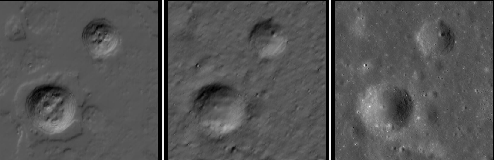
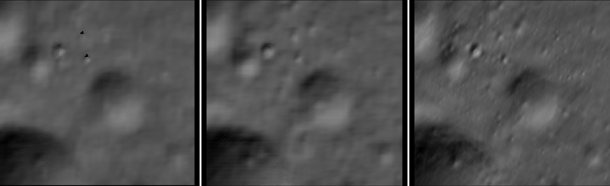
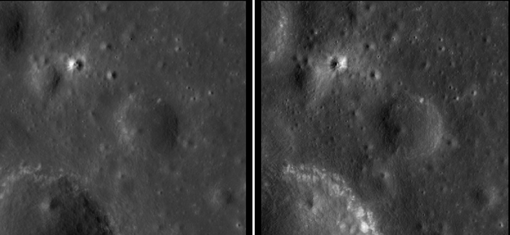
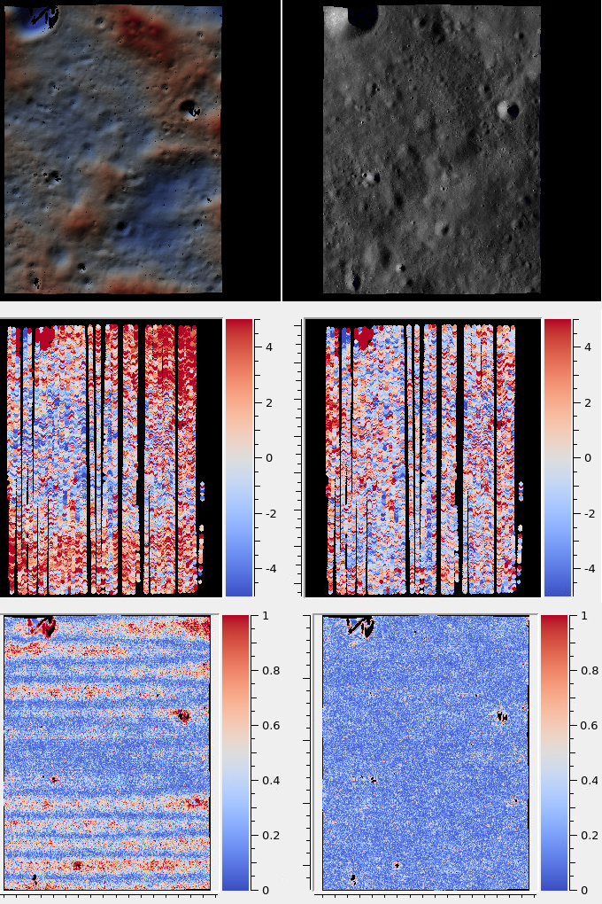

.. _kaguya_tc:

Kaguya Terrain Camera
---------------------

The Kaguya Terrain Camera (TC) is a push-broom imager, with a spatial resolution
of 10 m. The images are acquired from a 100 km altitude above the Moon. It was
part of the JAXA `Kaguya <https://en.wikipedia.org/wiki/SELENE>`_ orbiter.

Kaguya TC has two sensors, named TC1 and TC2, forming a stereo pair. They see
roughly the same region on the ground, with a convergence angle of about 30 degrees
(:numref:`stereo_pairs`). These sensors may have slightly different focal
lengths and distortion coefficients.

Fetching the data
~~~~~~~~~~~~~~~~~

Visit the `product search
<https://darts.isas.jaxa.jp/planet/pdap/selene/product_search.html>`_ page, and
enter a small search region.

Fetch the raw data sets for a desired stereo pair, starting with the *TC1* and
*TC2* prefixes (not the DEM or other products). Both the .img and .lbl files are needed. 

::

    wget https://darts.isas.jaxa.jp/pub/pds3/sln-l-tc-3-w-level2b0-v1.0/20080605/data/TC1W2B0_01_02936N034E0938.img.gz
    wget https://darts.isas.jaxa.jp/pub/pds3/sln-l-tc-3-w-level2b0-v1.0/20080605/data/TC1W2B0_01_02936N034E0938.lbl

    wget https://darts.isas.jaxa.jp/pub/pds3/sln-l-tc-3-w-level2b0-v1.0/20080605/data/TC2W2B0_01_02936N036E0938.img.gz
    wget https://darts.isas.jaxa.jp/pub/pds3/sln-l-tc-3-w-level2b0-v1.0/20080605/data/TC2W2B0_01_02936N036E0938.lbl

Preparing the data
~~~~~~~~~~~~~~~~~~

Unzip the .img.gz files with ``gunzip``.

Ensure that ISIS is installed, and that ISISROOT and ISISDATA are set, per
:numref:`planetary_images`. The Kaguya kernels can then be downloaded with the
command::

    $ISISROOT/bin/downloadIsisData kaguya $ISISDATA

For each image, run commands along the lines of::

    $ISISROOT/bin/kaguyatc2isis                     \
      from=TC1W2B0_01_02936N034E0938.lbl            \
      to=TC1W2B0_01_02936N034E0938.cub              \
      setnullrange=NO sethrsrange=NO sethisrange=NO \
      setlrsrange=NO setlisrange=NO

    $ISISROOT/bin/spiceinit from=TC1W2B0_01_02936N034E0938.cub \
        web=false attach=TRUE cksmithed=FALSE ckrecon=TRUE     \
        ckpredicted=FALSE cknadir=FALSE spksmithed=true        \
        spkrecon=TRUE spkpredicted=FALSE shape=SYSTEM          \
        startpad=0.0 endpad=0.0

Create CSM cameras (:numref:`csm`)::

    $ISISROOT/bin/isd_generate --only_naif_spice \
        TC1W2B0_01_02936N034E0938.cub            \
        -k TC1W2B0_01_02936N034E0938.cub

Bundle adjustment and stereo
~~~~~~~~~~~~~~~~~~~~~~~~~~~~

Run bundle adjustment (:numref:`bundle_adjust`) and stereo
(:numref:`parallel_stereo`)::

    bundle_adjust                                                   \
      TC1W2B0_01_02936N034E0938.cub TC2W2B0_01_02936N036E0938.cub   \
      TC1W2B0_01_02936N034E0938.json TC2W2B0_01_02936N036E0938.json \
      --tri-weight 0.1 --camera-weight 0.0                          \
      -o ba/run

    parallel_stereo --stereo-algorithm asp_mgm --subpixel-mode 9    \
      TC1W2B0_01_02936N034E0938.cub TC2W2B0_01_02936N036E0938.cub   \
      TC1W2B0_01_02936N034E0938.json TC2W2B0_01_02936N036E0938.json \
      --bundle-adjust-prefix ba/run                                 \
      stereo/run

For datasets with very oblique illumination, ``--subpixel-mode 2`` 
(:numref:`subpixel_options`) worked better, but is much slower.

Run ``point2dem`` (:numref:`point2dem`) to get a DEM. Consider using the
stereographic projection centered at the region of interest::

    point2dem --stereographic --proj-lon 93.8 --proj-lat 3.5 \
      --tr 10 stereo/run-PC.tif

See :numref:`sfs_kaguya_example` for a clip of the produced DEM.

It is suggested to rerun stereo with mapprojected images
(:numref:`mapproj-example`), to get a higher quality output. 

See :numref:`nextsteps` for a discussion about various speed-vs-quality choices
when running stereo. 

Alignment
~~~~~~~~~

The produced DEM can be aligned with ``pc_align`` (:numref:`pc_align`) to the
LOLA RDR product. 

.. _sfs_kaguya:

Shape-from-shading with Kaguya TC
~~~~~~~~~~~~~~~~~~~~~~~~~~~~~~~~~

Here it will be illustrated how to run shape-from-shading (:numref:`sfs`) on Kaguya
TC images. First, ensure that the data are fetched and a stereo terrain is created,
per :numref:`kaguya_tc`. 

Shape-from-shading expects a DEM with no holes which is also rather smooth. It
should be at the same ground resolution as the input images, which in this case is 10
meters per pixel. It is best to have it in a local projection, such as stereographic.

We will modify the DEM creation command from above to use a large search radius to fill 
any holes::

    point2dem --stereographic --proj-lon 93.8 --proj-lat 3.5 \
        --tr 10 --search-radius-factor 10 stereo/run-PC.tif

(adjust the projection center for your location).

Inspect the produced DEM ``stereo/run-DEM.tif`` in ``stereo_gui`` in hillshading
mode. Any additional holes can be filled with ``dem_mosaic``
(:numref:`dem_mosaic_extrapolate`).

It is also suggested to blur it a little, to make it smoother::

    dem_mosaic --dem-blur-sigma 2 stereo/run-filled-dem.tif \
      -o stereo/run-blurred-dem.tif  

Then crop a region with ``gdal_translate`` that has no missing data. 

Mapproject (:numref:`mapproject`) onto this DEM the left and right images with
the corresponding ``.json`` camera files, while using the adjustments in
``ba/run``. Overlay the resulting georeferenced images in ``stereo_gui``. This
is a very important sanity check to ensure that the cameras are registered
correctly. 

Run SfS as::

    parallel_sfs -i stereo/run-cropped-dem.tif \
      TC1W2B0_01_02936N034E0938.cub            \
      TC2W2B0_01_02936N036E0938.cub            \
      TC1W2B0_01_02936N034E0938.json           \
      TC2W2B0_01_02936N036E0938.json           \
      --bundle-adjust-prefix ba/run            \
      --reflectance-type 1                     \
      --blending-dist 10                       \
      --min-blend-size 50                      \
      --allow-borderline-data                  \
      --threads 4                              \
      --save-sparingly                         \
      --crop-input-images                      \
      --smoothness-weight 40000                \
      --initial-dem-constraint-weight 10       \
      --max-iterations 5                       \
      --shadow-thresholds "120 120"            \
      --tile-size 200                          \
      --padding 50                             \
      --processes 10                           \
      -o sfs/run

If there are artifacts in the produced DEM, increase the smoothness weight.
But if it is too large, it may blur the produced DEM too much.

The initial and final DEM can be inspected in ``stereo_gui``. The ``geodiff``
(:numref:`geodiff`) tool can be used to compare how much the DEM changed.

The initial DEM constraint was set rather high to ensure the DEM does not change
much as result of SfS. The shadow threshold depends on the pixel values and can
be very different for other images.

See, for comparison, the parameter choices made for LRO NAC
(:numref:`sfs-lola`). That example, and that entire chapter, also has the most
detailed discussion for how to run SfS, including the essential role of
alignment.

   From left to right: the stereo DEM, SfS DEM (hillshaded), and a mapprojected
   image. Some numerical noise is still seen, which can be removed by increasing
   the smoothing weight. See below for another example.

Using multiple images with diverse illumination results in more detail and fewer
artifacts. For such data, bundle adjustment and pairwise stereo need to be run
first, and the produced DEMs and cameras must be aligned to a common reference,
such as LOLA (:numref:`ba_pc_align`). Then the aligned DEMs are inspected and
merged with ``dem_mosaic``, a clip is selected, holes are filled, noise is
blurred, and SfS is run. The process is explained in detail in
:numref:`sfs-lola`.

Here is an example of running SfS with the datasets::

    TC{1,2}W2B0_01_02921S050E1100
    TC{1,2}W2B0_01_05936S048E1097

All four images were used, though likely the first of each pair would have 
been sufficient, given that images in each pair have the same illumination.

   SfS with Kaguya images with different illumination. From left to right: first
   pair stereo DEM, second pair stereo DEM, and the SfS DEM (all hillshaded). It
   can be seen that SfS adds more detail and removes numerical noise.

   
   The images used for SfS (one from each pair). The Sun is in the East and West, 
   respectively. 

Refining the camera intrinsics for Kaguya TC
~~~~~~~~~~~~~~~~~~~~~~~~~~~~~~~~~~~~~~~~~~~~

See :numref:`kaguya_ba`.

.. _jitter_kaguya:

Solving for jitter for Kaguya TC
~~~~~~~~~~~~~~~~~~~~~~~~~~~~~~~~

Kaguya TC cameras exhibit some jitter, but its effect is not as strong as the one of
lens distortion, which needs to be solved for first, as in :numref:`kaguya_ba`.

Then, jitter can be corrected as for CTX in :numref:`jitter_ctx`. The precise commands
are below.

   First row: the stereo DEM and orthoimage. Second row: The difference of
   stereo DEM to LOLA. Third row: the triangulation error
   (:numref:`triangulation_error`). These are before (left) and after (right)
   solving for jitter. The ranges in the colorbar are in meters.
   
Here we worked with the stereo pair::

   TC1W2B0_01_05324N054E2169
   TC2W2B0_01_05324N056E2169

Stereo was run with mapprojected images (:numref:`mapproj-example`). 

Dense matches were produced from stereo disparity (:numref:`dense_ip`).
Having on the order of 20,000 dense matches is suggested.

The DEM and cameras were aligned to LOLA, and lens distortion was solved
for as in :numref:`kaguya_ba` (using additional overlapping images).
The resulting optimized cameras were passed in to the jitter solver.

The DEM to constrain against was produced from LOLA, with a command as::

  point2dem                              \
    -r moon                              \
    --stereographic                      \
    --auto-proj-center                   \
    --csv-format 2:lon,3:lat,4:radius_km \
    --search-radius-factor 5             \
    --tr 25                              \
    lola.csv
    
Solving for jitter::

  jitter_solve                                           \
    TC1W2B0_01_05324N054E2169.cub                        \
    TC2W2B0_01_05324N056E2169.cub                        \
    ba/run-TC1W2B0_01_05324N054E2169.adjusted_state.json \
    ba/run-TC2W2B0_01_05324N056E2169.adjusted_state.json \
    --max-pairwise-matches 20000                         \
    --num-lines-per-position 300                         \
    --num-lines-per-orientation 300                      \
    --max-initial-reprojection-error 20                  \
    --match-files-prefix dense_matches/run               \
    --heights-from-dem lola-DEM.tif                      \
    --heights-from-dem-uncertainty 10                    \
    --anchor-dem lola-DEM.tif                            \
    --num-anchor-points 5000                             \
    --num-anchor-points-extra-lines 1000                 \
    --anchor-weight 0.01                                 \
    --num-iterations 20                                  \
    -o jitter/run

The value of ``--anchor-weight`` can be increased to 0.1 - 0.5, if oscillations
are seen at the starting and ending image lines.

