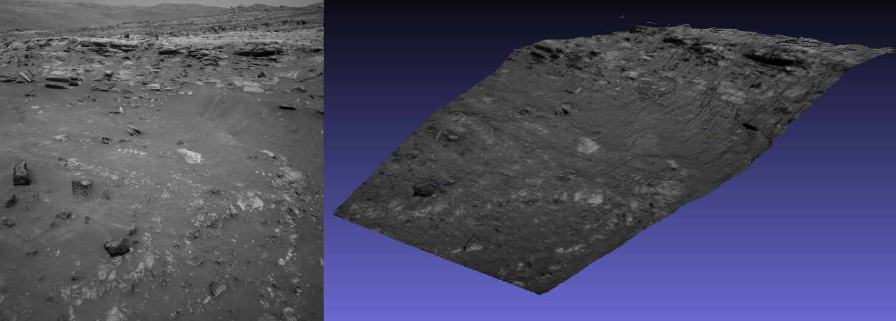

.. _mer-example:

Mars Exploration Rovers
-----------------------

The Mars Exploration Rovers (MER) have several cameras onboard that acquire
stereo pairs. The images come with CAHVOR camera models, that have local
positions and orientations. 

ASP can create point clouds and textured meshes from these cameras. DEMs cannot
be created right away, unlike for MSL, which has geolocation information
(:numref:`csm_msl`), but an SfM solution is likely to work as in
:numref:`rig_msl`.

PANCAM, NAVCAM, HAZCAM
~~~~~~~~~~~~~~~~~~~~~~

These are cameras on the rover and are all processed the same way. It is
preferred to use NAVCAM images, as those have less distortion than the HAZCAM.

   Left input image and produced textured mesh.

Recipe
^^^^^^

Download the data from the `PDS Image Atlas <https://pds-imaging.jpl.nasa.gov/search/>`_. 

::

   wget https://planetarydata.jpl.nasa.gov/img/data/mer/mer2no_0xxx/data/sol0766/edr/2n194370551effap00p0675l0m1.img
   wget https://planetarydata.jpl.nasa.gov/img/data/mer/mer2no_0xxx/data/sol0766/edr/2n194370551effap00p0675r0m1.img

Create the CAHVOR cameras::

   mer2camera 2n194370551effap00p0675l0m1.img
   mer2camera 2n194370551effap00p0675r0m1.img

Run stereo (:numref:`parallel_stereo`) and create a mesh with ``point2mesh`` (:numref:`point2mesh`)::

   parallel_stereo                       \
      2n194370551effap00p0675l0m1.img    \
      2n194370551effap00p0675r0m1.img    \
      2n194370551effap00p0675l0m1.cahvor \
      2n194370551effap00p0675r0m1.cahvor \
      run/run

    point2mesh -s 2 --texture-step-size 2 \
      run/run-PC.tif run/run-L.tif

See :numref:`nextsteps` for a discussion about various speed-vs-quality choices.

It is suggested to filter out points that are not triangulated well because they
are too far using the ``parallel_stereo`` option ``--min-triangulation-angle``
(:numref:`stereodefault`).

For finer-grained control, can use::

    --universe-center camera --near-universe-radius 0.7 \
       --far-universe-radius 80.0

These may be suggested as well::

    --alignment-method epipolar --force-use-entire-range

