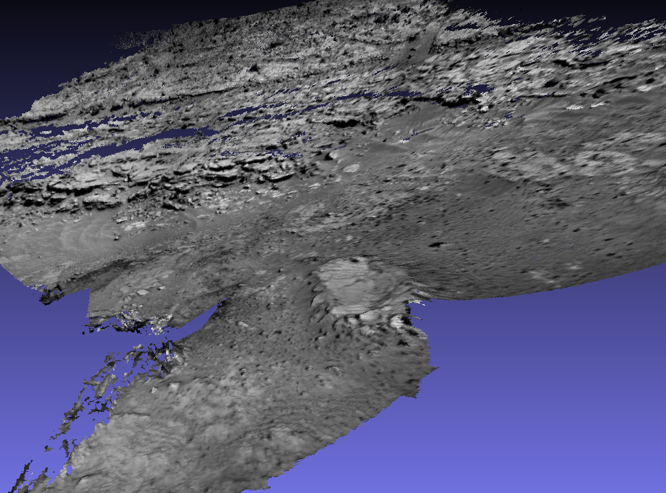
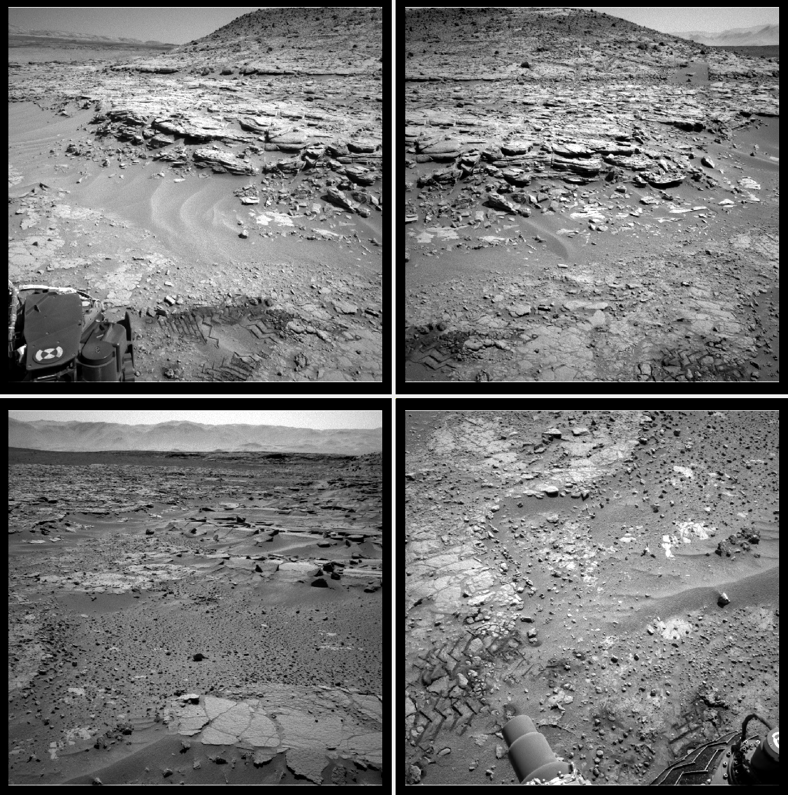

.. _rig_msl:

MSL navcam example
^^^^^^^^^^^^^^^^^^

This is an example of using the ASP tools to process images taken by the Mars
Science Laboratory (MSL) rover `Curiosity
<https://en.wikipedia.org/wiki/Curiosity_(rover)>`_. See :numref:`rig_examples` for
other examples.

.. _rig_msl_figure:

Illustration
------------

 

   A mesh created with 22 MSL navcam images acquired on SOL 597 (top),
   and several representative images from this set (bottom).

Sensor information
------------------

Curiosity has two navcam sensors (left and right) mounted on a stereo
rig. Each acquires images at a resolution of 1024 x 1024 pixels. The
field of view is 45 degrees.

.. _msl_challenges:

Challenges
----------

The navcam images are used to plan the path of the rover. They are not
acquired specifically for mapping.

While there is good overlap and perspective difference between images
that are acquired at the same time with the stereo rig, these
assumptions may not hold for images acquired at different times.
Moreover, after the rover changes position, there is usually a large
perspective difference and little overlap with earlier images.

A very useful reference on processing MSL images is
:cite:`caravaca20203d`. It uses the commercial Agisoft Photoscan
software.

To help with matching the images, this paper uses the global position and
orientation of each image and projects these onto the ground. Such
data is not fully present in the .LBL files in PDS, as those contain
only local coordinates, and would necessitate queering the SPICE
database.  It also incorporates lower-resolution "TRAV" images to tie
the data together.

In the current example only a small set of data from a single day is
used.

Data preparation
----------------

The images are fetched from PDS. For example, to get the data for day
(SOL) 597 on Mars, use the command::

    dir=data/msl/MSLNAV_0XXX/DATA/SOL00597
    wget -r -nH --cut-dirs=4 --no-parent    \
      --reject="index.html*"                \
      https://pds-imaging.jpl.nasa.gov/$dir \
      --include $dir

This will create the directory ``SOL00597`` containing .IMG data files
and .LBL metadata. Using the ISIS ``pds2isis`` program (see
:numref:`planetary_images` for installation), these can be converted to
.cub files as::

    pds2isis from = SOL00597/image.LBL to = SOL00597/image.cub
    
A .cub file obtained with the left navcam sensor will have a name like::

    SOL00597/NLB_451023553EDR_F0310946NCAM00492M1.cub

while for the right sensor the prefix will be instead ``NRB``. The
full-resolution images have ``_F`` as part of their name, as above.

We will convert the .cub files to the PNG format so that they can be
understood by image-processing programs. The ``rig_calibrator``
convention will be used, of storing each sensor's data in its own
subdirectory (:numref:`rig_calibrator_data_conv`). We will name the
left and right navcam sensors ``lnav`` and ``rnav``. Then, the conversion
commands are along the lines of::

    mkdir -p SOL00597/lnav
    isis2std from = SOL00597/left_image.cub \
      to = SOL00597/lnav/left_image.png

Image selection
---------------

A subset of 22 images was selected for SOL 597 (half for each of the
left and right navcam sensors). Images were chosen based on visual
inspection. A fully automatic approach may be challenging
(:numref:`msl_challenges`).

This dataset is available for
`download <https://github.com/NeoGeographyToolkit/StereoPipelineSolvedExamples/releases/tag/MSL>`_.

Setting up the initial rig
--------------------------

Given the earlier sensor information, the focal length can be found 
using the formula:

.. math::

    f = \frac{w}{2\tan(\frac{\theta}{2})}       

where :math:`w` is sensor width in pixels and :math:`\theta` is the field of
view. The focal length is then about 1236.0773 pixels. We will start
by assuming that the optical center is at the image center, and 
no distortion. Hence, the initial rig configuration (:numref:`rig_config`)
will look like::

    ref_sensor_name: lnav

    sensor_name: lnav
    focal_length:  1236.0773
    optical_center: 512 512
    distortion_coeffs: 
    distortion_type: no_distortion
    image_size: 1024 1024
    distorted_crop_size: 1024 1024
    undistorted_image_size: 1024 1024
    ref_to_sensor_transform: 1 0 0 0 1 0 0 0 1 0 0 0
    depth_to_image_transform: 1 0 0 0 1 0 0 0 1 0 0 0
    ref_to_sensor_timestamp_offset: 0

with an additional identical block for the ``rnav`` sensor (without
``ref_sensor_name``).

SfM map creation
----------------

Given the data and rig configuration, the image names in .png format
were put in a list, with one entry per line.  The ``theia_sfm``
program (:numref:`theia_sfm`) was run to find initial camera poses::

    theia_sfm                     \
      --rig_config rig_config.txt \
      --image_list list.txt       \
      --out_dir theia_rig

Next, ``rig_calibrator`` (:numref:`rig_calibrator`) is used, to
enforce the rig constraint between the left and right navcam sensors
and refine the intrinsics::

    params="focal_length,optical_center"
    float="lnav:${params} rnav:${params}"

    rig_calibrator                        \
      --rig_config rig_config.txt         \
      --nvm theia_rig/cameras.nvm         \
      --camera_poses_to_float "lnav rnav" \
      --intrinsics_to_float "$float"      \
      --num_iterations 30                 \
      --calibrator_num_passes 2           \
      --num_overlaps 5                    \
      --robust_threshold 3                \
      --out_dir rig_out

Here, ``--robust_threshold`` was increased from the default value of
0.5 to focus harder larger errors. To optimize the distortion,
one can adjust the rig configuration by setting initial distortion
values and type::

    distortion_coeffs: 1e-10 1e-10 1e-10 1e-10 1e-10
    distortion_type: radtan

and then defining the list of parameters to optimize as::

    params="focal_length,optical_center,distortion"

For this example, plausible solutions were obtained with and without
using distortion modeling, but likely for creation of pixel-level
registered textured meshes handling distortion is important.

The produced pairwise matches in ``rig_out/cameras.nvm`` can be
inspected with ``stereo_gui`` (:numref:`stereo_gui_nvm`).

Mesh creation
-------------

Here, a point cloud is created from every stereo pair consisting of a left
sensor image and corresponding right image, and those are fused into
a mesh. Some parameters are set up first.

Stereo options (:numref:`stereodefault`)::

    stereo_opts="
      --stereo-algorithm asp_mgm
      --alignment-method affineepipolar
      --ip-per-image 10000
      --min-triangulation-angle 0.1
      --global-alignment-threshold 5
      --session nadirpinhole
      --no-datum
      --corr-seed-mode 1
      --corr-tile-size 5000
      --max-disp-spread 300
      --ip-inlier-factor 0.4
      --nodata-value 0"

Point cloud filter options (:numref:`pc_filter`)::

    maxDistanceFromCamera=100.0
    pc_filter_opts="
      --max-camera-ray-to-surface-normal-angle 85 
      --max-valid-triangulation-error 10.0   
      --max-distance-from-camera $maxDistanceFromCamera
      --blending-dist 50 --blending-power 1"

Mesh generation options (:numref:`voxblox_mesh`)::

    mesh_gen_opts="
      --min_ray_length 0.1
      --max_ray_length $maxDistanceFromCamera
      --voxel_size 0.05"

Set up the pairs to run stereo on::

    outDir=stereo
    mkdir -p ${outDir}
    grep lnav list.txt > ${outDir}/left.txt
    grep rnav list.txt > ${outDir}/right.txt

The optimized rig, in ``${outDir}/rig_config.txt``, and optimized
cameras, in ``${outDir}/cameras.txt``, are passed to ``multi_stereo``
(:numref:`multi_stereo`)::

    multi_stereo                              \
      --rig_config ${outDir}/rig_config.txt   \
      --camera_poses ${outDir}/cameras.txt    \
      --undistorted_crop_win '1100 1100'      \
      --rig_sensor "lnav rnav"                \
      --first_step stereo                     \
      --last_step mesh_gen                    \
      --stereo_options "$stereo_opts"         \
      --pc_filter_options "$pc_filter_opts"   \
      --mesh_gen_options "$mesh_gen_opts"     \
      --left ${outDir}/left.txt               \
      --right ${outDir}/right.txt             \
      --out_dir ${outDir} 

This created::

    ${outDir}/lnav_rnav/fused_mesh.ply

See the produced mesh in :numref:`rig_msl_figure`.

Notes
-----

 - No ground registration was done, so neither the scale nor the
   pose of the produced mesh is accurate. The mesh is, however,
   self-consistent.
 - The voxel size for binning and meshing the point cloud was chosen
   manually. An automated approach for choosing a representative voxel
   size is to be implemented.
 - The ``multi_stereo`` tool does not use the interest points found
   during SfM map construction. That would likely result in a good
   speedup. It also does not run the stereo pairs in parallel.
