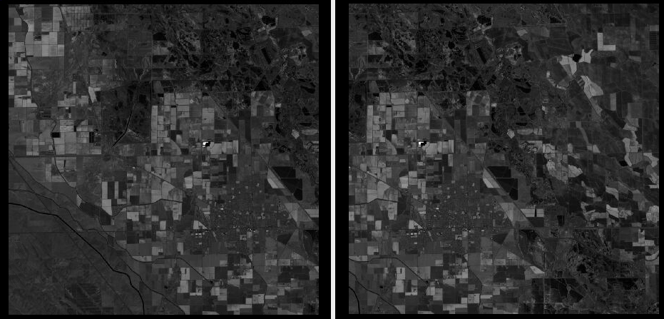

.. _orbital_rig:

Orbital rig
-----------

This example shows how to produce synthetic images and cameras that model an
orbital rig with two frame camera sensors, and how to use the
:ref:`rig_calibrator` tool to refine the rig parameters, camera intrinsics, and
camera poses. This example demonstrates the new DEM height constraint feature
that constrains triangulated points to a reference DEM for improved accuracy.

Input DEM and orthoimage
~~~~~~~~~~~~~~~~~~~~~~~~

The synthetic data for this example is created with :ref:`sat_sim`, which
requires a DEM and an orthoimage of a region of interest as input. 

To prepare this data, we obtained the free ASTER dataset::

  AST_L1A_00404012022185436_20250920182851.hdf

around the San Luis Reservoir in Northern California. A DEM was created following
the workflow in :numref:`aster`. The orthoimage was produced by invoking
:ref:`mapproject` at a nominal resolution of 15 m/pixel. This resolution
reflects the ground sample distance (GSD) of the ASTER images.

Synthetic images
~~~~~~~~~~~~~~~~

The synthetic images and cameras were created with ``sat_sim``, which can
simulate an orbital rig (:numref:`sat_sim_rig`).

The rig was designed with left and right frame cameras, named ``left`` and
``right``. The initial rig configuration was created as described in
:numref:`msl_init_rig`. The sensor dimensions were set to 1000 x 1000
pixels, with the principal point at the image center. No lens distortion
was assumed.

The satellite height was set to 700 km, and the focal length to 35000 pixels.
This results in an estimated GSD of about 20 meters (GSD is approximately
the satellite height divided by the focal length). These parameters are
consistent with the ASTER instrument.

The ``sat_sim`` command for the nadir images was::

    sat_sim                           \
        --dem aster_dem.tif           \
        --ortho aster_ortho.tif       \
        --rig-config aster_rig.txt    \
        --rig-sensor-ground-offsets   \
        -0.01,0,-4000,0,0.01,0,4000,0 \
        --first 1300 1200 700000      \
        --last  1300 1500 700000      \
        --first-ground-pos 1300 1200  \
        --last-ground-pos  1300 1500  \
        --roll 0 --pitch 0 --yaw 0    \
        --num 3                       \
        --velocity 7500               \
        -o sat_sim/run-nadir

The ``--rig-sensor-ground-offsets`` option places the left and right sensor
centers 0.01 m to each side of the rig center, and their footprints on the
ground are separated by 8000 m in the East-West direction. The satellite
itself follows a North-South orbit.

The rig configuration incorporating these controls is saved to the file::

    sat_sim/run-nadir-rig_config.txt
    
This file contains the relationship between the rig sensors in the
``ref_to_sensor_transform`` field, in addition to the intrinsics from the
input rig. More details are in :numref:`sat_sim_rig_adjust`.

A similar command is run to create forward-looking images, but with the
``--pitch`` value set to 30 degrees and the output prefix set to
``sat_sim/run-fwd``.

The produced images will have names like::

    sat_sim/run-nadir-0010000.418204756-left.tif
    sat_sim/run-fwd-0009939.411652856-right.tif

following the naming convention in :numref:`rig_data_conv`. The components
of these filenames are the output prefix, the timestamp, and the sensor
name. Time modeling is described in :numref:`sat_sim_time`, and all options
for this program are documented in :ref:`sat_sim_options`.

   A sample left and right image as produced by the rig (after mapprojection).
   The images have notable overlap. These show some fields and mountain
   foothills in California's Central Valley.

Interest point matches
~~~~~~~~~~~~~~~~~~~~~~

The ``rig_calibrator`` program expects the camera poses and the interest point
matches between images to be stored in an NVM file (a format commonly employed in
Structure-from-Motion applications). See :numref:`ba_nvm`.

Since there are 12 input images, and each must be matched against every other
one, the :numref:`parallel_bundle_adjust` program is called to ensure
parallelization::

    parallel_bundle_adjust       \
      --ip-per-image 10000       \
      --output-cnet-type nvm     \
      sat_sim/*{left,right}.tif  \
      sat_sim/*{left,right}.tsai \
      --camera-weight 1.0        \
      --tri-weight 1.0           \
      --num-iterations 100       \
      -o ba/run

Rig calibration
~~~~~~~~~~~~~~~

The :ref:`rig_calibrator` program is then run::

    rig_calibrator                                  \
      --rig-config sat_sim/run-nadir-rig_config.txt \
      --nvm ba/run.nvm                              \
      --camera-poses-to-float "left right"          \
      --intrinsics-to-float                         \
      "left:focal_length right:focal_length"        \
      --camera-position-uncertainty 1.0             \
      --heights-from-dem aster_dem.tif              \
      --heights-from-dem-uncertainty 2.0            \
      --heights-from-dem-robust-threshold 0.1       \
      --tri-weight 1.0                              \
      --save-pinhole-cameras                        \
      --num-iterations 100                          \
      --out-dir rig

Since the input data is perfect, very few changes are expected. The produced
pinhole cameras (:numref:`pinholemodels`), saved in the output ``rig`` directory
(via the ``--save-pinhole-cameras`` option), should be very similar to the
initial inputs in the ``sat_sim`` directory.

The ``--heights-from-dem`` options demonstrate the new DEM constraint feature.
The implementation is as for bundle adjustment (:numref:`heights_from_dem`).
