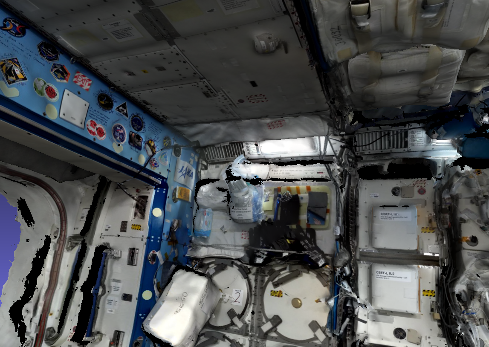
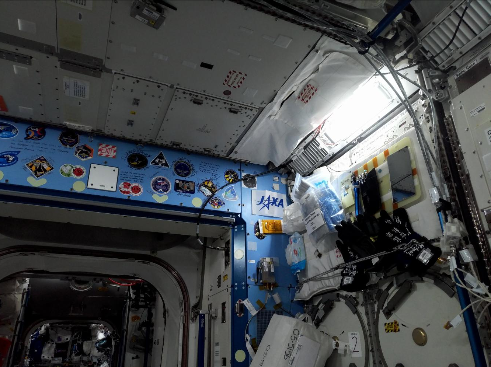

.. _sfm_iss:

Mapping the ISS using 2 rigs with 3 cameras each
------------------------------------------------

This example will show how to use the tools shipped with ASP to create
a 360-degree textured mesh of the `Japanese Experiment Module
<https://en.wikipedia.org/wiki/Kib%C5%8D_(ISS_module)>`_ (JEM, also
known as Kibo), on the International Space Station. See :numref:`rig_examples`
for more examples.

These tools were
created as part of the `ISAAC
<https://www.nasa.gov/directorates/spacetech/game_changing_development/projects/ISAAC>`_
project.

.. _sfm_iss_figure:

Illustration 
^^^^^^^^^^^^

 
.. figure:: ../images/sci_cam_large_texture.png
   :name: sfm_large_iss_texture
   :alt:  Rig calibrator texture.

   A mesh created with the ``haz_cam`` depth + image sensor 
   and textured with ``sci_cam`` (top). A zoomed-out version showing
   more of the module (middle). A ``sci_cam`` image that
   was used to texture the mesh (bottom). The JEM module has many cables
   and cargo, and the bot acquired the data spinning in place. This
   resulted in some noise and holes in the mesh. The ``sci_cam`` texture was,
   however, quite seamless, with very good agreement with the ``nav_cam``
   texture (not shown), which shows that the registration was done correctly.

Overview
^^^^^^^^

Two `Astrobee <https://github.com/nasa/astrobee>`_ robots, named
*bumble* and *queen*, scanned the JEM, with each doing a portion. Both
robots have a wide-field of view navigation camera (``nav_cam``), a
color camera (``sci_cam``), and a low-resolution depth+intensity camera
(``haz_cam``).

To record the data, the robots took several stops along the center
module axis, and at each stop acquired data from a multitude of
perspectives, while rotating in place. 

The data was combined into a sparse SfM map using ``theia_sfm``
(:numref:`theia_sfm`). The camera poses were refined with
``rig_calibrator`` (:numref:`rig_calibrator`). That tool models the
fact that each set of sensors is on a rig (contained within a rigid
robot frame). Then, the depth clouds were fused into a mesh 
with ``voxblox_mesh`` (:numref:`voxblox_mesh`), and textured with 
``texrecon`` (:numref:`texrecon`). 

.. _sfm_iss_acquisition:

Data acquisition strategy
^^^^^^^^^^^^^^^^^^^^^^^^^

If designing a mapping approach, it is best to:

 - Have the cameras face the surface being imaged while moving parallel to it,
   in a panning motion.
 - Ensure consecutively acquired images have about 75% - 90% overlap. This 
   and the earlier condition result in a solid perspective difference
   but enough similarity so that the images are registered successfully.
 - If more than one robot (rig) is used, there should be a
   decently-sized surface portion seen by more than rig, to be able to
   tie them reliably together.

Challenges
^^^^^^^^^^

This example required care to address the in-place rotations, which
resulted in very little perspective change between nearby images
(hence in uncertain triangulated points), a wide range of resolutions
and distances, and occlusions (which resulted in holes). Another
difficulty was the low resolution and unique imaging modality of
``haz_cam``, which made it tricky to find interest point matches
(tie points) to other sensor data.

.. _sfm_iss_processing:

Data processing strategy
^^^^^^^^^^^^^^^^^^^^^^^^

All sensors acquire the data at independent times. The color
``sci_cam`` sensor takes one picture every few seconds, the
``nav_cam`` takes about 2-3 pictures per second, and ``haz_cam`` takes
about 10 pictures per second.

The ``nav_cam`` sensor was chosen to be the *reference* sensor. A set
of images made by this sensor with both robots was selected, ideally
as in :numref:`sfm_iss_acquisition`, and a Structure-from-Motion
*sparse map* was built. 

Since the ``haz_cam`` sensor acquires images and depth data frequently
(0.1 seconds), for each ``nav_cam`` image the ``haz_cam`` frame
closest in time was selected and its acquisition timestamp was
declared to be the same as for the ``nav_cam``. Even if this
approximation may result in the geometry moving somewhat, it is likely
to not be noticeable in the final textured mesh.

The same approximation is likely to be insufficient for ``sci_cam``
when tying it to ``nav_cam``, as the time gap is now larger, and it
can result in at least a few pixels of movement whose outcome
will be a very noticeable registration error.

The approach that ``rig_calibrator`` uses is to bracket each
``sci_cam`` image by ``nav_cam`` images, as seen in
:numref:`rig_calibrator_example`, followed by pose interpolation in
time. This however doubles the number of ``nav_cam`` images and the
amount of time for the various iterations that may be needed to refine
the processing. To avoid that, we use the following approach.

We assume that a reasonably accurate rig configuration file for the
2-rig 6-sensor setup already exists, but it may not be fully precise.
It is shown in :numref:`sfm_iss_sample_rig_config`. It can be found
as described in the previous paragraph, on a small subset of the data.

Then, given the SfM sparse map created with ``nav_cam`` only, the
``haz_cam`` images (declared to be acquired at the same time as
``nav_cam``) were inserted into this map via the rig constraint. The
joint map was registered and optimized, while refining the rig
configuration (the transforms between rig sensors). A mesh was created
and textured, for each sensor. Any issues with mesh quality and
registration challenges can be dealt with at this time.

Then, the ``sci_cam`` images were also inserted via the rig
constraint, but not using ``nav_cam`` for bracketing, so the
placement was approximate. Lastly, the combined map was optimized,
while keeping the ``nav_cam`` and ``haz_cam`` poses fixed and refining
the ``sci_cam`` poses without the rig constraint or using the
timestamp information, which allows the ``sci_cam`` poses to move
freely to conform to the other already registered images.

This approach also helps with the fact that the ``sci_cam`` timestamp
can be somewhat unreliable, given that those images are acquired with
a different processor on the robot, so freeing these images from
the rig and time acquisition constraints helps with accuracy.

How all this is done will be shown in detail below.

Installing the software
^^^^^^^^^^^^^^^^^^^^^^^

See :numref:`installation`. The ``bin`` directory of the ASP software
should be added to the ``PATH`` environmental variable. Note that ASP
ships its own version of Python. That can cause conflicts if ROS
and ASP are run in the same terminal.

.. _sfm_isis_data_prep:

Data preparation
^^^^^^^^^^^^^^^^

The Astrobee data is stored in ROS bags (with an exception for
``sci_cam``), with multiple bags for each robot.

sci_cam
~~~~~~~

The ``sci_cam`` data is not stored in bags, but as individual images,
for performance reasons, as the images are too big to publish over ROS.
Their size is  5344 x 4008 pixels. It is suggested to resample them
using the GDAL tool suite shipped with ASP (:numref:`gdal_tools`) as::

    gdal_translate -r average -outsize 25% 25% -of jpeg \
      input.jpg output.jpg

The obtained images should be distributed in directories
corresponding to the robot, with names like ``my_data/bumble_sci``
and ``my_data/queen_sci`` (:numref:`rig_data_conv`).

nav_cam
~~~~~~~

For each ``sci_cam`` image, the ``nav_cam`` image closest in time will
be extracted, using the ``extract_bag`` tool
(:numref:`ros_tools_extract`). This is illustrated for one of the
robots::
 
    ls my_data/bumble_sci/*.jpg > bumble_sci.txt
    /usr/bin/python /path/to/ASP/libexec/extract_bag \
    --bag mybag.bag                                  \
    --timestamp_list bumble_sci.txt                  \
    --topics "/my/nav_cam/topic"                     \
    --dirs "my_data/bumble_nav"                      \
    --timestamp_tol 1.0

Here we used the fact that the ``sci_cam`` images have the acquisition
timestamp as part of their name (:numref:`rig_data_conv`).

This will create the directory ``my_data/bumble_nav``. The produced
files will contain, as for the other cameras, the timestamp as part of
their name, which will be different but close in time to the
``sci_cam`` timestamp.

The same command should be repeated for the other robot.

Examine the created images with the ``eog`` program on the local
system. Hopefully the images will have enough overlap. If not, images
with intermediate timestamps need to be extracted, with the help
of the timestamp-listing tool (:numref:`ros_tools_list`). 

If, on the other hand, the resulting images are very similar,
some may be deleted (also with ``eog``). It is suggested to follow
the principles outlined in :numref:`sfm_iss_acquisition`.

haz_cam
~~~~~~~

As mentioned in :numref:`sfm_iss_processing`, while the ``nav_cam``
and ``sci_cam`` timestamps are kept precise, it makes the problem
much simpler to find the closest ``haz_cam`` images to the chosen
``nav_cam`` images, and to change their timestamps to match ``nav_cam``.

For that, the data should be extracted as follows::

    ls my_data/bumble_nav/*.jpg > bumble_nav.txt
    /usr/bin/python /path/to/ASP/libexec/extract_bag       \
    --bag mybag.bag                                        \
    --timestamp_list bumble_nav.txt                        \
    --topics "/my/haz_intensity/topic /my/haz_depth/topic" \
    --dirs "my_data/bumble_haz my_data/bumble_haz"         \
    --timestamp_tol 0.2                                    \
    --approx_timestamp

Notice several important differences with the earlier command.  We use
the ``nav_cam`` timestamps for querying. The tolerance for how close
in time produced ``haz_cam`` timestamps are to input ``nav_cam``
images is much smaller, and we use the option ``--approx_timestamp``
to change the timestamp values (and hence the names of the produced
files) to conform to ``nav_cam`` timestamps.

This tool is called with two topics, to extract the intensity (image) and
depth (point cloud) datasets, with the outputs going to the same directory
(specified twice, for each topic). The format of the depth clouds
is described in :numref:`point_cloud_format`.

An analogous invocation should happen for the other rig, with the
outputs going to subdirectories for those sensors.

A first small run
^^^^^^^^^^^^^^^^^

The strategy in :numref:`sfm_iss_processing` will be followed.
Consider a region that is seen in all ``nav_cam`` and ``haz_cam``
images (4 sensors in total). We will take advantage of the fact that
each rig configuration is reasonably well-known, so we will create a
map with only the ``nav_cam`` data for both robots, and the other
sensors will be added later.  If no initial rig configuration exists,
see :numref:`rig_calibrator_example`.

The initial map
~~~~~~~~~~~~~~~

Create a text file having a few dozen ``nav_cam`` images from both
rigs in the desired region named ``small_nav_list.txt``, with one
image per line. Inspect the images in ``eog``. Ensure that each image
has a decent overlap (75%-90%) with some of the other ones, and they
cover a connected surface portion.

Run ``theia_sfm`` (:numref:`theia_sfm`) with the initial rig
configuration (:numref:`sfm_iss_sample_rig_config`), which we will
keep in a file called ``initial_rig.txt``::

    theia_sfm --rig_config initial_rig.txt \
      --image_list small_nav_list.txt      \
      --out_dir small_theia_nav_rig

The images and interest points can be examined in ``stereo_gui``
(:numref:`stereo_gui_nvm`) as::

    stereo_gui small_theia_nav_rig/cameras.nvm

Control points
~~~~~~~~~~~~~~

The obtained map should be registered to world coordinates. Looking
ahead, the full map will need registering as well, so it is good to
collect control points over the entire module, perhaps 6-12 of them
(the more, the better), with at least four of them in the small
desired area of interest that is being done now. The process is
described in :numref:`rig_calibrator_registration`. More specific
instructions can be found in the `Astrobee documentation
<https://nasa.github.io/astrobee/v/develop/map_building.html#autotoc_md357>`_.

If precise registration is not required, one could simply pick some
visible object in the scene, roughly estimate its dimensions, and
create control points based on that.  The produced 3D model will then
still be geometrically self-consistent, but the orientation and scale
may be off.

We will call the produced registration files ``jem_map.pto`` and
``jem_map.txt``. The control points for the images in the future map
that are currently not used will be ignored for the time being.

Adding haz_cam
~~~~~~~~~~~~~~

Create a list called ``small_haz_list.txt`` having the ``haz_cam`` images
with the same timestamps as the ``nav_cam`` images::

    ls my_data/*_haz/*.jpg > small_haz_list.txt

Insert these in the small map, and optimize all poses together as::

    float="bumble_nav bumble_haz queen_nav queen_haz"
    rig_calibrator                                  \
      --registration                                \
      --hugin_file jem_map.pto                      \
      --xyz_file jem_map.txt                        \
      --use_initial_rig_transforms                  \
      --extra_list small_haz_list.txt               \
      --rig_config initial_rig.txt                  \
      --nvm small_theia_nav_rig/cameras.nvm         \
      --out_dir small_rig                           \
      --camera_poses_to_float "$float"              \
      --depth_to_image_transforms_to_float "$float" \
      --float_scale                                 \
      --intrinsics_to_float ""                      \
      --num_iterations 100                          \
      --export_to_voxblox                           \
      --num_overlaps 5                              \
      --min_triangulation_angle 0.5

The depth files will the same names but with the .pc extension will
will be picked up automatically.

The value of ``--min_triangulation_angle`` filters out rays with a
very small angle of convergence. That usually makes the geometry more
stable, but if the surface is far from the sensor, and there is not
enough perspective difference between images, it may eliminate too many
features. The ``--max_reprojection_error`` option may eliminate
features as well.

Consider adding the option ``--bracket_len 1.0`` that decides the length of
time, in seconds, between reference images used to bracket the other sensor. The
option ``--bracket_single_image`` will allow only one image of any non-reference
sensor to be bracketed.

It is suggested to carefully examine the text printed on screen by this
tool. See :numref:`rig_calibrator_registration` and
:numref:`rig_calibration_stats` for the explanation of some statistics
being produced and their expected values.

Then, compare the optimized configuration file
``small_rig/rig_config.txt`` with the initial guess rig
configuration. The scales of the matrices in the
``depth_to_image_transform`` fields for both sensors should remain
quite similar to each other, while different perhaps from their
initial values in the earlier file, otherwise the results later will
be incorrect.  If encountering difficulties here, consider not
floating the scales at all, so omitting the ``--float_scale`` option
above. The scales will still be adjusted, but not as part of the
optimization but when the registration with control points
happens. Then they will be multiplied by the same factor.

Open the produced ``small_rig/cameras.nvm`` file in ``stereo_gui`` and
examine the features between the ``nav_cam`` and ``haz_cam``
images. Usually they are very few, but hopefully at least some are
present.

Notice that in this run we do not optimize the intrinsics, only the
camera poses and depth-to-image transforms. If desired to do so,
optimizing the focal length may provide the most payoff, followed by
the optical center. It can be tricky to optimize the distortion model,
as one needs to ensure there are many features at the periphery of
images where the distortion is strongest.

It is better to avoid optimizing the intrinsics unless the final
texture has subtle misregistration, which may due to intrinsics. Gross
misregistration is usually due to other factors, such as insufficient
features being matched between the images. Or, perhaps, not all images
that see the same view have been matched together.

Normally some unmodeled distortion in the images is tolerable
if there are many overlapping images, as then their central areas are
used the most, and the effect of distortion on the final textured
mesh is likely minimal. 

Mesh creation
~~~~~~~~~~~~~

The registered depth point clouds can be fused with ``voxblox_mesh``
(:numref:`voxblox_mesh`)::

    cat small_rig/voxblox/*haz*/index.txt >       \
      small_rig/all_haz_index.txt 

    voxblox_mesh                                  \
      --index small_rig/all_haz_index.txt         \
      --output_mesh small_rig/fused_mesh.ply      \
      --min_ray_length 0.1                        \
      --max_ray_length 2.0                        \
      --median_filter '5 0.01'                    \
      --voxel_size 0.01

The first line combines the index files for the ``bumble_haz`` and
``queen_haz`` sensors.

The produced mesh can be examined in ``meshlab``. Normally it should
be quite seamless, otherwise the images failed to be tied properly
together. There can be noise where the surface being imaged has black
objects (which the depth sensor handles poorly), cables, etc.
Some rather big holes can be created in the occluded areas.

To not use all the input images and clouds, the index file passed in
can be edited and entries removed. The names in these files are in
one-to-one correspondence with the list of ``haz_cam`` images used
earlier.

The options ``--min_ray_length`` and ``--max_ray_length`` are used to
filter out depth points that are too close or too far from the sensor.

The mesh should be post-processed with the CGAL tools
(:numref:`cgal_tools`).  It is suggested to first remove most small
connected components, then do some smoothing and hole-filling, in
this order. Several iterations of may be needed, and some tuning of
the parameters.

Texturing
~~~~~~~~~

Create the ``nav_cam`` texture with ``texrecon``
(:numref:`texrecon`)::

    sensor="bumble_nav haz queen_nav"
    texrecon                              \
    --rig_config small_rig/rig_config.txt \
    --camera_poses small_rig/cameras.txt  \
    --mesh small_rig/fused_mesh.ply       \
    --rig_sensor "${sensor}"              \
    --undistorted_crop_win '1300 1200'    \
    --skip_local_seam_leveling            \
    --out_dir small_rig

The same can be done for ``haz_cam``. Then reduce the undistorted crop
window to '250 200'. It is helpful to open these together in
``meshlab`` and see if there are seams or differences between them.

To use just a subset of the images, see the ``--subset`` option. That
is especially important if the robot spins in place, as then some of
the depth clouds have points that are far away and may be less
accurate.

When working with ``meshlab``, it is useful to save for the future
several of the "camera views", that is, the perspectives from which
the meshes were visualized, and load them next time around.  That is
done from the "Window" menu, in reasonably recent ``meshlab``
versions.

Adding sci_cam
~~~~~~~~~~~~~~

If the above steps are successful, the ``sci_cam`` images for the 
same region can be added in, while keeping the cameras for the sensors
already solved for fixed. This goes as follows::

    ls my_data/*_sci/*.jpg > small_sci_list.txt

    float="bumble_sci queen_sci"
    rig_calibrator                                  \
      --use_initial_rig_transforms                  \
      --nearest_neighbor_interp                     \
      --no_rig                                      \
      --bracket_len 1.0                             \
      --extra_list small_sci_list.txt               \
      --rig_config small_rig/rig_config.txt         \
      --nvm small_rig/cameras.nvm                   \
      --out_dir small_sci_rig                       \
      --camera_poses_to_float "$float"              \
      --depth_to_image_transforms_to_float "$float" \
      --intrinsics_to_float ""                      \
      --num_iterations 100                          \
      --export_to_voxblox                           \
      --num_overlaps 5                              \
      --min_triangulation_angle 0.5

The notable differences with the earlier invocation is that this time
only the ``sci_cam`` images are optimized (floated), the option
``--nearest_neighbor_interp`` is used, which is needed since the
``sci_cam`` images will not have the same timestamps as for the
earlier sensor, and the option ``--no_rig`` was added, which decouples
the ``sci_cam`` images from the rig, while still optimizing them with
the rest of the data, which is fixed and used as a constraint.  The
option ``--bracket_len`` helps with checking how far in time newly
added images are from existing ones.

The texturing command is::

    sensor="bumble_sci queen_sci"
    texrecon                                    \
      --rig_config small_sci_rig/rig_config.txt \
      --camera_poses small_sci_rig/cameras.txt  \
      --mesh small_rig/fused_mesh.ply           \
      --rig_sensor "${sensor}"                  \
      --undistorted_crop_win '1300 1200'        \
      --skip_local_seam_leveling                \
      --out_dir small_sci_rig

Notice how we used the rig configuration and poses from
``small_sci_rig`` but with the earlier mesh from ``small_rig``. The
sensor names now refer to ``sci_cam`` as well.

The produced textured mesh can be overlaid on top of the earlier ones
in ``meshlab``.

Results
^^^^^^^

See :numref:`sfm_iss`.

Scaling up the problem
^^^^^^^^^^^^^^^^^^^^^^

If all goes well, one can map the whole module. Create several lists
of ``nav_cam`` images corresponding to different module portions.  For
example, for the JEM, which is long in one dimension, one can
subdivide it along that axis.

Ensure that the portions have generous overlap, so many images 
show up in more than one list, and that each obtained group of images
forms a connected component. That is to say, the union of surface
patches as seen from all images in a group should be a contiguous
surface.

For example, each group can have about 150-200 images, with 50-75
images being shared with each neighboring group. More images being
shared will result in a tighter coupling of the datasets and in less
registration error.

Run ``theia_sfm`` on each group of ``nav_cam`` images. A run can take
about 2 hours.  While in principle this tool can be run on all images at
once, that may take longer than running it on smaller sets with
overlaps, unless one has under 500 images or so.

The obtained .nvm files can be merged with ``sfm_merge``
(:numref:`sfm_merge`) as::

    sfm_merge --fast_merge --rig_config small_rig/rig_config.txt \
      theia*/cameras.nvm --output_map merged.nvm

Then, given the large merged map, one can continue as earlier in the
document, with registration, adding ``haz_cam`` and ``sci_cam``
images, mesh creation, and texturing.

Fine-tuning
^^^^^^^^^^^

If the input images show many perspectives and correspond to many
distances from the surface being imaged, all this variety is good for
tying it all together, but can make texturing problematic. 

It is suggested to create the fused and textured meshes (using
``voxblox_mesh`` and ``texrecon``) only with subsets of the depth
clouds and images that are closest to the surface being imaged and
face it head-on.  Both of these tools can work with a subset of the
data. Manual inspection can be used to delete the low-quality inputs.

Consider experimenting with the ``--median_filter``,
``--max_ray_length``, and ``--distance_weight`` options in
``voxblox_mesh`` (:numref:`voxblox_mesh`).

Some experimentation can be done with the two ways of creating
textures given by the ``texrecon`` option ``--texture_alg``
(:numref:`texrecon`). The default method, named "center", uses the
most central area of each image, so, if there are any seams when the
the camera is panning, they will be when transitioning from a surface
portion using one image to a different one. The other approach, called
"area", tries for every small surface portion to find the camera whose
direction is more aligned with the surface normal. This may give
better results when imaging a round object from many perspectives.

In either case, seams are a symptom of registration having failed.
It is likely because not all images seeing the same surface have been
tied together. Or, perhaps the intrinsics of the sensors were
inaccurate.

.. _map_surgery:

Surgery with maps
^^^^^^^^^^^^^^^^^

If a produced textured mesh is mostly good, but some local portion has
artifacts and may benefit from more images and/or depth clouds, 
either acquired in between existing ones or from a new
dataset, this can be done without redoing all the work.

A small portion of the existing map can be extracted with the
``sfm_submap`` program (:numref:`sfm_submap`), having just ``nav_cam``
images.  A new small map can be made with images from this map and
additional ones using ``theia_sfm``. This map can be merged into the
existing small map with ``sfm_merge --fast_merge``
(:numref:`sfm_merge`). If the first map passed to this tool is the
original small map, its coordinate system will be kept, and the new
Theia map will conform to it.

Depth clouds for the additional images can be extracted. The combined
small map can be refined with ``rig_calibrator``, and depth clouds
corresponding to the new data can be inserted, as earlier. The option
``--fixed_image_list`` can be used to keep some images (from the
original small map) fixed to not change the scale or position of the
optimized combined small map.

These operations should be quite fast if the chosen subset of data is
small.

Then, a mesh can be created and textured just for this
data. If happy with the results, this data can then be merged into the
original large map, and the combined map can be optimized as before.

.. _sfm_iss_sample_rig_config:

Sample rig configuration
^^^^^^^^^^^^^^^^^^^^^^^^

This is a rig configuration file having two rigs, with the 
reference sensor for each given by ``ref_sensor_name``.  
The reference documentation is in :numref:`rig_config`.

::

    ref_sensor_name: bumble_nav
    
    sensor_name: bumble_nav
    focal_length: 608
    optical_center: 632.53683999999998 549.08385999999996
    distortion_coeffs: 0.99869300000000005
    distortion_type: fov
    image_size: 1280 960
    distorted_crop_size: 1200 900
    undistorted_image_size: 1200 1000
    ref_to_sensor_transform: 1 0 0 0 1 0 0 0 1 0 0 0
    depth_to_image_transform: 1 0 0 0 1 0 0 0 1 0 0 0
    ref_to_sensor_timestamp_offset: 0
    
    sensor_name: bumble_haz
    focal_length: 206.19094999999999
    optical_center: 112.48999000000001 81.216598000000005
    distortion_coeffs: -0.25949800000000001 -0.084849339999999995 0.0032980310999999999 -0.00024045673000000001
    distortion_type: radtan
    image_size: 224 171
    distorted_crop_size: 224 171
    undistorted_image_size: 250 200
    ref_to_sensor_transform: -0.99936179050661522 -0.011924032028375218 0.033672379416940734 0.013367103760211168 -0.99898730194891616 0.042961506978788616 0.033126005078727511 0.043384190726704089 0.99850912854240503 0.03447221364702744 -0.0015773141724172662 -0.051355063495492494
    depth_to_image_transform: 0.97524944805399405 3.0340999964032877e-05 0.017520679036474685 -0.0005022892199844 0.97505286059445628 0.026270283519653003 -0.017513503933106297 -0.02627506746113482 0.97489556315227599 -0.012739449966153971 -0.0033893213295227856 -0.062385053248766351
    ref_to_sensor_timestamp_offset: 0
    
    sensor_name: bumble_sci
    focal_length: 1023.6054
    optical_center: 683.97547 511.2185
    distortion_coeffs: -0.025598438 0.048258987 -0.00041380657 0.0056673533
    distortion_type: radtan
    image_size: 1336 1002
    distorted_crop_size: 1300 1000
    undistorted_image_size: 1300 1200
    ref_to_sensor_transform: 0.99999136796886101 0.0041467228570910052 0.00026206356569790089 -0.0041456529387620027 0.99998356891519313 -0.0039592248413610866 -0.00027847706785526265 0.0039581042406176921 0.99999212789968661 -0.044775738667823875 0.022844481744319863 0.016947323592326858
    depth_to_image_transform: 1 0 0 0 1 0 0 0 1 0 0 0
    ref_to_sensor_timestamp_offset: 0.0
    
    ref_sensor_name: queen_nav
    
    sensor_name: queen_nav
    focal_length: 604.39999999999998
    optical_center: 588.79561999999999 509.73835000000003
    distortion_coeffs: 1.0020100000000001
    distortion_type: fov
    image_size: 1280 960
    distorted_crop_size: 1200 900
    undistorted_image_size: 1200 1000
    ref_to_sensor_transform: 1 0 0 0 1 0 0 0 1 0 0 0
    depth_to_image_transform: 1 0 0 0 1 0 0 0 1 0 0 0
    ref_to_sensor_timestamp_offset: 0
    
    sensor_name: queen_haz
    focal_length: 210.7242
    optical_center: 124.59857 87.888262999999995
    distortion_coeffs: -0.37295935000000002 -0.011153150000000001 0.0029100743 -0.013234186
    distortion_type: radtan
    image_size: 224 171
    distorted_crop_size: 224 171
    undistorted_image_size: 250 200
    ref_to_sensor_transform: -0.99983878639670731 -0.0053134634698496939 -0.017151335887125228 0.0053588429200665524 -0.99998225876857605 -0.0026009518744718949 -0.017137211538534192 -0.0026924438805366263 0.9998495220415089 0.02589135325068561 0.0007771584936297031 -0.025089928702394019
    depth_to_image_transform: 0.96637484988953426 -0.0010183057117133798 -0.039142369279180113 0.00078683373128646066 0.96715045575148029 -0.005734923775739747 0.039147706343916511 0.0056983779719958138 0.96635836939244701 -0.0079348421014152053 -0.0012389803763148686 -0.053366194196969058
    ref_to_sensor_timestamp_offset: 0
    
    sensor_name: queen_sci
    focal_length: 1016.3726
    optical_center: 689.17409 501.88817
    distortion_coeffs: -0.019654579 0.024057067 -0.00060629998 0.0027509131
    distortion_type: radtan
    image_size: 1336 1002
    distorted_crop_size: 1300 1000
    undistorted_image_size: 1300 1200
    ref_to_sensor_transform: 0.99999136796886101 0.0041467228570910052 0.00026206356569790089 -0.0041456529387620027 0.99998356891519313 -0.0039592248413610866 -0.00027847706785526265 0.0039581042406176921 0.99999212789968661 -0.044775738667823875 0.022844481744319863 0.016947323592326858
    depth_to_image_transform: 1 0 0 0 1 0 0 0 1 0 0 0
    ref_to_sensor_timestamp_offset: 0
