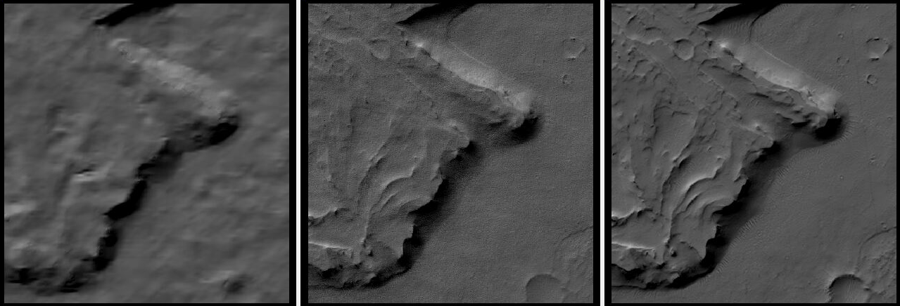
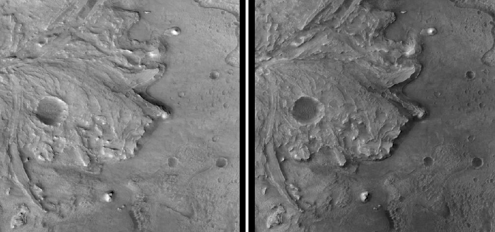

.. _sfs_ctx:

Shape-from-Shading with CTX images
----------------------------------

This example shows how to refine a stereo terrain model produced with CTX images
(:numref:`ctx_example`) with Shape-from-Shading (SfS, :numref:`sfs`). See
:numref:`sfs_usage` for an overview and examples for other planets.

.. _sfs_ctx_results:

Results
~~~~~~~

   
   From left to right: (a) a terrain model produced with CTX images and stereo, (b)
   the same terrain refined with SfS and CTX images, (c) corresponding terrain
   produced with stereo with HiRISE images. SfS adds notably more detail to the CTX
   DEM.

.. figure:: ../images/ctx_sfs_dem_err.png
   :name: ctx_sfs_dem_err
   :alt: ctx_sfs_dem_err
   :align: left
   
   A larger area (about 1100 x 1100 pixels, at 6 m/pixel). The site is inside the
   Jezero Crater. The top row shows, as before, the CTX stereo terrain, CTX
   SfS-refined terrain, and a HiRISE terrain for comparison. The bottom row has the
   differences to the HiRISE stereo DEM of the CTX stereo DEM (left) and SfS-refined
   DEM (right). The SfS-refined terrain shows somewhat improved agreement with
   the HiRISE terrain. The range of colors is from -10 to 10 meters. There seems to
   be some local vertical bias between the CTX and HiRISE terrains that is
   unrelated to SfS refinement.

   
   Two input CTX images with different illumination conditions. There are notable 
   lighting differences on the mound in the upper-right area.

Preparation
~~~~~~~~~~~

How to fetch and prepare the images is described in :numref:`ctx_example`.
The camera models are produced as in :numref:`create_csm_linescan`.

It is important to have images with very diverse illumination conditions (Sun
azimuth). The azimuth angle can be found with ``sfs --query``. More details are
in :numref:`sfs_azimuth`.

Some of these images will be used to create terrain models with stereo. Any
stereo pair should have similar illumination and a non-small convergence angle
(about 30 degrees is feasible for CTX). See :numref:`stereo_pairs`.

The full dataset for this area had 115 images. It is recommended to fetch a
lot of images first and then select a subset after inspection.

The Sun azimuth angle was between -141.5 and -72.8 degrees. This is diverse
enough, but a larger range would have been preferable. No data with the Sun
on the right was found. 

The images were bundle-adjusted (:numref:`bundle_adjust`). The resulting model
state files (:numref:`csm_state`) were used at all stages of subsequent
processing.

Three DEMs were produced with ``parallel_stereo`` (:numref:`parallel_stereo`)
and ``point2dem`` (:numref:`point2dem`). It is strongly advised to use the
``aspm_mgm`` algorithm (:numref:`nextsteps`) and mapprojection
(:numref:`mapproj-example`).

CTX images can have very notable jitter (:numref:`jitter_ctx`), and there may be
some unmodeled lens distortion. It is suggested to mosaic the produced DEMs
with ``dem_mosaic`` (:numref:`dem_mosaic`) and then run ``geodiff`` (:numref:`geodiff`)
to compare the mosaic with each individual DEM. The least consistent DEMs
should be discarded, and the remaining ones mosaicked together. 

Any holes in the produced DEM should be filled, and a bit of blur is suggested
(:numref:`dem_mosaic_extrapolate`).

The resulting mosaic will be the input for SfS refinement.

A HiRISE (:numref:`hirise_example`) stereo DEM needs to be created as well. It
will help evaluate the results, as it is at a much higher resolution. 
The HiRISE DEM can be brought into alignment with the CTX one with ``pc_align``
(:numref:`pc_align`).

Running SfS
~~~~~~~~~~~

The ids of the CTX images that were input to SfS were as follows. The Sun
azimuth and elevation are measured in degrees from the North and the horizon,
respectively.

.. list-table::
   :header-rows: 1

   * - image_id
     - azimuth
     - elevation
   * - J10_048842_1986_XN_18N282W
     - -141.468
     - 36.741
   * - D14_032794_1989_XN_18N282W
     - -117.901
     - 52.206
   * - F05_037752_2008_XN_20N282W
     - -102.218
     - 33.286
   * - F03_037119_2001_XN_20N283W
     - -90.224
     - 38.861
   * - J22_053233_1984_XN_18N282W
     - -72.785
     - 45.893

The ``parallel_sfs`` (:numref:`parallel_sfs`) command was::

    parallel_sfs                             \
      --processes 4                          \
      --threads 8                            \
      --save-sparingly                       \
      --tile-size 400                        \
      --padding 50                           \
      --nodes-list machines.txt              \
      -i ctx_dem.tif                         \
      --image-list image_list.txt            \
      --camera-list camera_list.txt          \
      --smoothness-weight 0.01               \
      --initial-dem-constraint-weight 0.0002 \
      --reflectance-type 0                   \
      --num-haze-coeffs 1                    \
      --max-iterations 5                     \
      --float-exposure                       \
      --float-haze                           \
      --float-albedo                         \
      --crop-input-images                    \
      -o sfs/run

This produced the DEM named ``sfs/run-DEM-final.tif``. See :numref:`sfs` for the
description of these options and the output files.

It was very important to model and optimize the albedo, image exposure, and
atmospheric haze.

There was notable sensitivity on the value of
``--initial-dem-constraint-weight``. That is likely because the input CTX DEM
and the reference HiRISE DEM appear to be somewhat inconsistent. Making this
value smaller resulted in the SfS DEM being in less agreement with HiRISE.

Somewhat surprisingly, the plain Lambertian reflectance (``--reflectance-type 0``)
worked about the same as the Lunar-Lambertian model (type 1),
with the Hapke model with default parameters (type 2) doing
just a very tiny bit better.

Co-optimizing the reflectance model coefficients (option
``--float-reflectance-model``) did not make a difference.

The value of ``--smoothness-weight`` could have been increased a bit, as
some numerical noise is visible. 

The results are in :numref:`sfs_ctx_results`.

Further thoughts
~~~~~~~~~~~~~~~~

The shadows were not modeled here. Given that the Sun was rather high in the sky,
with various azimuth and elevation values, their effect is likely not very
strong. Pixels in shadows can be given less weight with the ``sfs`` parameter
``--robust-threshold``. This will penalize pixels for which the disagreement
between the simulated and measured images is roughly more than this
quantity. See :numref:`sfs_earth` for an example and discussion.

The disagreement between the stereo CTX and HiRISE terrains (that is seen even
before SfS) can be made smaller by individually aligning SfS-refined small tiles
(with overlap) to HiRISE, followed by mosaicking. That can make it easier to see
where SfS still needs improvement. 
