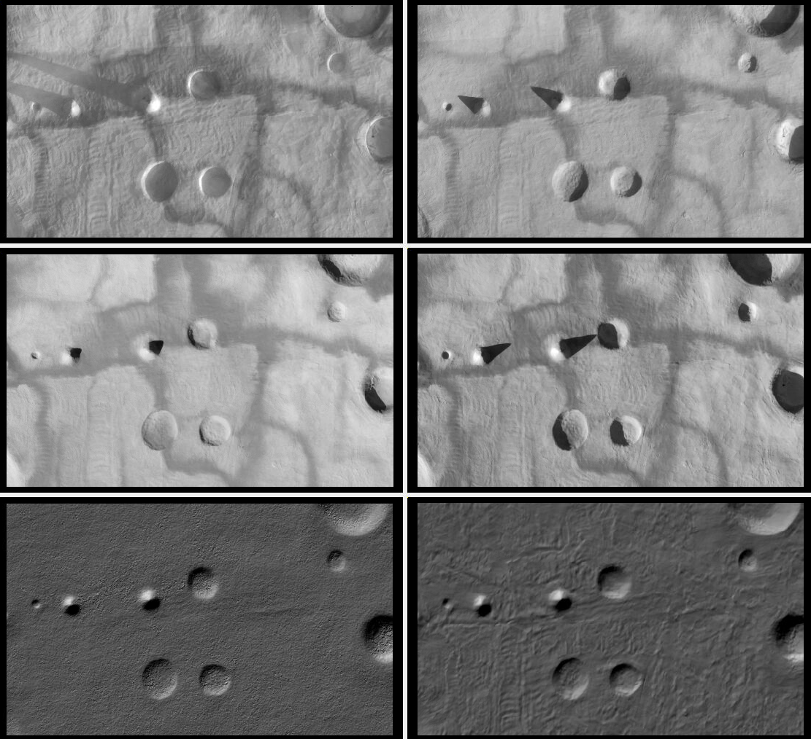
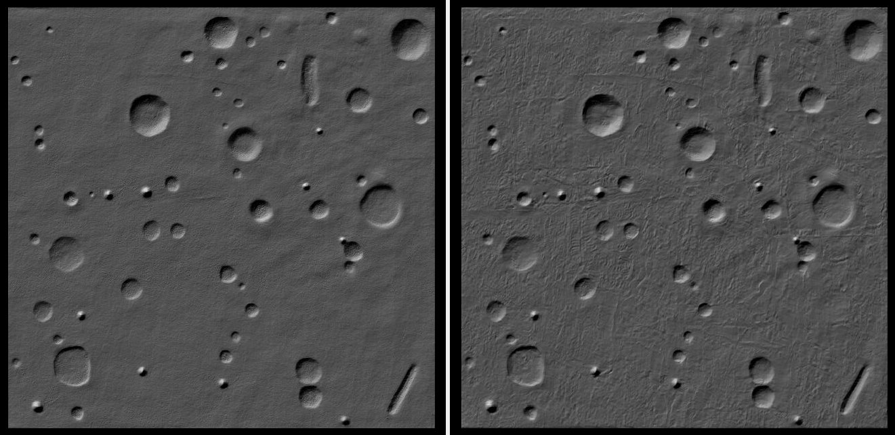
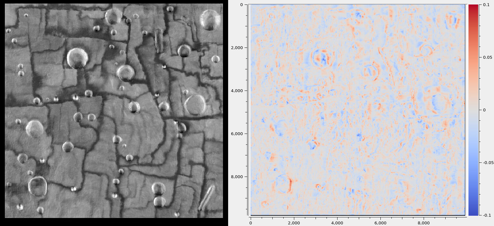

.. _sfs_earth:

Shape-from-Shading for Earth
----------------------------

This example shows how to refine a terrain model for Earth using
Shape-from-Shading (SfS, :numref:`sfs`). An overview and examples for other
planets are given in :numref:`sfs_usage`.

   
   Top: Four orthorectified input images showing the diversity of illumination. Bottom left: Hillshaded DEM produced with Agisoft Phtoscan. Bottom right: Hillshaded DEM refined with SfS. It can be seen that the SfS DEM has more detail. This is a small region of the test site.

   
   Left: Full-site hillshaded input stereo DEM (10k x 10k pixels at 0.01 m/pixel). Right: Refined full-site SfS DEM. More detail is seen. No shadow artifacts or strong dependence on albedo are observed.

   
   Left: Max-lit orthoimage (this eliminates shadows). Right: SfS DEM minus the input DEM. 
   The range of colors is between -0.1 to 0.1 meters. We do not have rigorous validation,
   but these results look plausible.

Earth-specific issues
~~~~~~~~~~~~~~~~~~~~~

We will produce a terrain model for the *Lunar Surface Proving Ground* (LSPG)
at the Mojave Air and Space Port in California (35.072321 N, -118.153957 W).
The site has dimensions of 100 x 100 meters.

This site is meant to mimic the topography and optical properties of Moon's
surface. It has very strong albedo variations that need modeling. Being on
Earth, the site has an atmosphere that scatters sunlight, that needs to be taken
into account as well.

It is likely that other rocky Earth terrains will have similar properties.
Surfaces with vegetation, fresh snow, or urban areas will be very different,
and likely for those the SfS method will not work well.

Input data
~~~~~~~~~~

The site was imaged with an UAS flying at an elevation of about 100 meters. The
images are acquired with a color frame camera, looking nadir, with dimensions of
9248 x 6944 pixels, JPEG-compressed. The ground resolution is 0.01 meters per
pixel.

The camera was carefully calibrated, with its intrinsic parameters (focal
length, optical center, lens distortion) known.

Five sets of images were recorded, at different times of day. Diverse
illumination is very important for separating the albedo from ground reflectance
and atmospheric effects.

Since SfS processes grayscale data, the red image band was used.

Registration and initial model
~~~~~~~~~~~~~~~~~~~~~~~~~~~~~~

SfS expects a reasonably accurate DEM as input, that will be refined. The camera
intrinsics, and their positions and orientations must be known very accurately
relative to the DEM. The ``mapproject`` program (:numref:`mapproject`) can be
invoked to verify the agreement between these data.

The usual process of producing such data with ASP is to run Structure-from-Motion
(:numref:`sfm`), including bundle adjustment (:numref:`bundle_adjust`), followed
by stereo (:numref:`tutorial`) for pairs of images with a good convergence angle
(:numref:`stereo_pairs`), terrain model creation (:numref:`point2dem`), and 
merge of the terrain models (:numref:`dem_mosaic`).

If desired to refine the intrinsics, the ``bundle_adjust`` program can be run
(:numref:`heights_from_dem`), with the terrain produced so far as a constraint. 
If needed, alignment to a prior terrain can be done (:numref:`pc_align`),
followed by carrying over the cameras (:numref:`ba_pc_align`).

The ``stereo_gui`` program (:numref:`stereo_gui`) can help visualize the inputs,
intermediate results, and final products.

Use of prior data
~~~~~~~~~~~~~~~~~

In this example, all this processing was done with Agisoft Photoscan, a commercial
package that automates the steps mentioned above. It produced a terrain model,
orthoimages, the camera intrinsics, and the camera positions and orientations.

Camera preparation
~~~~~~~~~~~~~~~~~~

A pinhole camera model file (:numref:`pinholemodels`) was created for each
image. 

To ensure tight registration, a GCP file (:numref:`bagcp`) was made for each
image with the ``gcp_gen`` program (:numref:`gcp_gen`). The inputs were the raw
images, orthoimages, and the existing DEM. The invocation was as follows, for
each image index ``i``::

   gcp_gen                          \
      --ip-detect-method 2          \
      --inlier-threshold 50         \
      --ip-per-tile 1000            \
      --gcp-sigma 0.1               \
      --camera-image image${i}.tif  \
      --ortho-image ortho_image.tif \
      --dem dem.tif                 \
      --output-prefix gcp/run       \
      -o gcp/image${i}.gcp

A single orthoimage was provided for all images with the same illumination.
      
This program's page has more information for how to inspect and validate 
the GCP file.

If the camera positions and orientations are not known, such a GCP
file can create the camera files from scratch (:numref:`cam_from_gcp`).

The images and cameras were then bundle-adjusted (:numref:`bundle_adjust`),
together with these GCP. The provided DEM was used as a constraint, with the
options ``--heights-from-dem dem.tif --heights-from-dem-uncertainty 1.0``. The
latter parameter's value was to give somewhat weight to the DEM than to the
GCP, though likely the precise values are not important.

The ``mapproject`` program (:numref:`mapproject`) was run to verify that the
produced cameras result in orthoimages that agree well with the input DEM and
each other.

It is strongly suggested to first run this process with a small subset of the
images, for example, one for each illumination. One should also inspect the
various ``bundle_adjust`` report files (:numref:`ba_out_files`).

Terrain model preparation
~~~~~~~~~~~~~~~~~~~~~~~~~

The input terrain was regridded to a resolution of 0.01 meters per pixel
with ``gdalwarp`` (:numref:`gdal_tools`)::

    gdalwarp         \
      -overwrite     \
      -r cubicspline \
      -tr 0.01 0.01  \
      dem.tif dem_tr0.01.tif

It is important to use a local projection in meters, such as UTM. This program
can also resample an input DEM that has a geographic projection
(longitude-latitude) to a local projection, with the option ``-t_srs``.

The produced DEM was smoothed a bit, to reduce the numerical noise::

    dem_mosaic            \
      --dem-blur-sigma 1  \
      dem_tr0.01.tif      \
      -o dem_tr0.01_smooth.tif

The resulting DEM can be hillshaded and visualized in ``stereo_gui`` (:numref:`stereo_gui_hillshade`).

Illumination angles
~~~~~~~~~~~~~~~~~~~

The illumination information was specified in a file named ``sfs_sun_list.txt``,
with each line having the image name and the Sun azimuth and elevation
(altitude) in degrees, in double precision, with a space as separator. The
azimuth is measured clockwise from the North, and the elevation is measured from
the horizon.
    
The `SunCalc <https://www.suncalc.org/>`_ site was very useful in determining
this information, given the coordinates of the site and the image acquisition
time as stored in the EXIF data. One has to be mindful of local vs UTC time.

It was sufficient to use the same Sun azimuth and elevation for all images
acquired in quick succession.

Input images
~~~~~~~~~~~~

The number of input images can be very large, which can slow down the SfS
program. It is suggested to divide them into groups, by illumination conditions,
and ignore those outside the area of interest. ASP has logic that can help
with that (:numref:`sfs_azimuth`).

Out of all images from a given group, a subset should be selected that covers
the site fully. That can be done by mapprojecting the images onto the DEM, and
then running the ``image_subset`` program (:numref:`image_subset`)::

    image_subset                           \
      --t_projwin min_x min_y max_x max_y  \
      --threshold 0.01                     \
      --image-list image_list.txt          \
      -o subset.txt

The values passed in via ``--t_projwin`` have the desired region extent (it can
be found with ``gdalinfo``, :numref:`gdal_tools`), or with ``stereo_gui``. It is
optional.

For an initial run, it is simpler to manually pick an image from each group.

The raw camera images corresponding to the union of all such subsets
were put in a file named ``sfs_image_list.txt``. The corresponding camera
model files were listed in the file ``sfs_camera_list.txt``, one per line.
These must be in the same order.

Running SfS
~~~~~~~~~~~

The best SfS results were produced by first solving for image exposure,
atmospheric haze, and albedo on individual small overlapping tiles, with the DEM
fixed, and then refining the albedo and DEM per-tile while keeping the per-tile
exposure and haze fixed. 

That global values of these parameters were not not as good likely suggests that
the modeling is not precise enough. The modeling is described in
:numref:`sfs_formulation`.

This two-step process was run as follows::

    parallel_sfs                            \
      -i dem.tif                            \
      --image-list sfs_image_list.txt       \
      --camera-list sfs_camera_list.txt     \
      --sun-angles sfs_sun_list.txt         \
      --processes 6                         \
      --threads 8                           \
      --tile-size 200                       \
      --padding 50                          \
      --smoothness-weight 3                 \
      --robust-threshold 10                 \
      --reflectance-type 0                  \
      --num-haze-coeffs 1                   \
      --initial-dem-constraint-weight 0.001 \
      --blending-dist 10                    \
      --crop-input-images                   \
      --save-sparingly                      \
      --max-iterations 5                    \
      --prep-step='--float-exposure
                   --float-haze
                   --float-albedo
                   --fix-dem'               \
      --main-step='--read-exposures
                   --read-haze
                   --read-albedo
                   --float-albedo'          \
      -o sfs/run

The descriptions of these options is in :numref:`parallel_sfs` and :numref:`sfs`. 
Another example is in :numref:`parallel_sfs_usage`.

This program can be very sensitive to the smoothness weight. A higher value will
produce blurred results, while a lower value will result in a noisy output. One
could try various values for it that differ by a factor of 10 before refining it
further.

The ``--robust-threshold`` parameter is very important for eliminating the
effect of shadows. Its value should be a fraction of the difference in intensity
between lit and shadowed pixels. Some experimentation may be needed to find the
right value. A large value will result in visible shadow artifacts. A smaller
value may require more iterations and may blur more the output.

It is strongly suggested to first run SfS on a small clip to get an intuition
for the parameters.

We used the Lambertian reflectance model (``--reflectance-type 0``). For the Moon,
usually the Lunar-Lambertian model is preferred (value 1).

The produced DEM will be named ``sfs/run-DEM-final.tif``. Other outputs are
listed in :numref:`sfs_outputs`.

The results are shown in :numref:`earth_input_images` and below.

