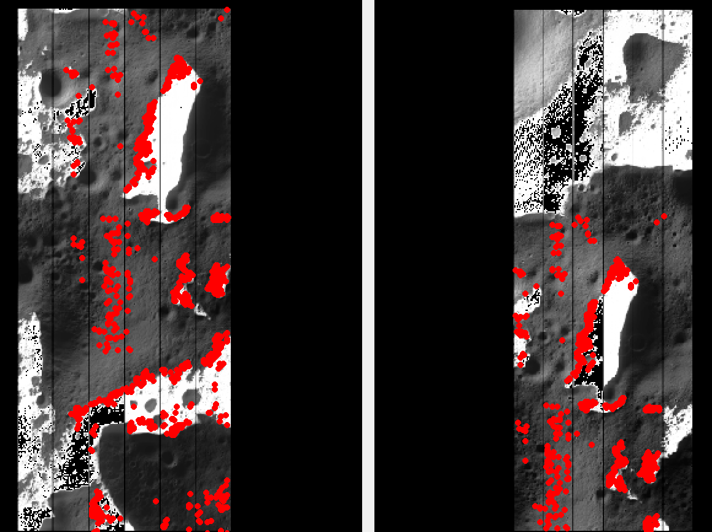
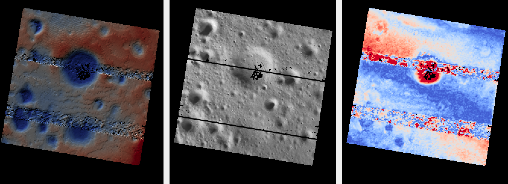

.. _shadowcam:

KPLO ShadowCam 
--------------

*ShadowCam* instrument is an instrument on the `Korea Pathfinder Lunar Orbiter
<https://en.wikipedia.org/wiki/Korea_Pathfinder_Lunar_Orbiter>`_ (KPLO). It is a
high-sensitivity push-broom imager, about 200 times more sensitive than the Lunar
Reconnaissance Orbiter Narrow Angle Camera (LRO NAC, :numref:`lronac-example`).
It was designed to image the floors of permanently shadowed regions (PSRs) using
only secondary illumination, such as earthshine or reflection from sunlit crater
walls. As a consequence, sunlit terrain typically saturates in ShadowCam images.

A more complete description is given in :cite:`humm2023shadowcam`.

*This processing example is work in progress and not reproducible*, as of
5/2026. Releases of ASP, ISIS, ISIS, ALE, USGSCSM, and SpiceQL, are required
before this can be replicated.
 
Data and software
~~~~~~~~~~~~~~~~~

PDS observations
^^^^^^^^^^^^^^^^

The mission archive is at https://pds.shadowcam.im-ldi.com. Each observation
ships:

  - ``<id>SC.cub`` -- full calibrated cube (about 1 GB)
  - ``<id>SE.cub`` -- the shadowed extract, a calibrated cube cropped to the
    portion of the strip that contains useful signal (about 255 MB)
  - ``<id>S_map_raw.tif`` -- map projected raw cube
  - ``<id>S_map_stretched.tif`` -- map projected cube with a visual stretch
    (for display only, not for measurement)
  - PDS4 XML labels for each product.

The ``SC.cub`` and ``SE.cub`` files are radiometrically calibrated and can be
used directly as ASP inputs. The PDS images are already organized by
acquisition date. 

The example below uses the south-polar pair acquired on 2024-12-11
(day 346): ``M074289249SE`` and ``M074296291SE``. The calibrated
shadowed-extract cubes, their PDS4 labels, and the map-projected stretched
orthoimages can be fetched as::

    base=https://pds.shadowcam.im-ldi.com/observation/2024/346

    curl -fsSL -O $base/M074289249S/M074289249SE.cub
    curl -fsSL -O $base/M074289249S/M074289249SE.xml
    curl -fsSL -O $base/M074289249S/M074289249S_map_stretched.tif

    curl -fsSL -O $base/M074296291S/M074296291SE.cub
    curl -fsSL -O $base/M074296291S/M074296291SE.xml
    curl -fsSL -O $base/M074296291S/M074296291S_map_stretched.tif

SPICE kernels
^^^^^^^^^^^^^

The KPLO kernels are not yet hosted in the `ISIS data area
<https://astrogeology.usgs.gov/docs/how-to-guides/environment-setup-and-maintenance/isis-data-area/>`_.
They can be downloaded with ``rsync`` module from the ShadowCam Science
Operations Center.

The ``kplo/kernels/`` tree below this endpoint mirrors the layout other missions
use under ``$ISISDATA``. Only the kernel files spanning the acquisition date of
interest are needed; a single day of reconstructed attitude and trajectory data
is typically only a few tens of MB.

To fetch the minimal set of kernels for the 2024-12-11 pair into the local
ISIS data area::

    mkdir -p $ISISDATA/kplo/kernels/{ck,spk,sclk,fk,ik,iak,pck,tspk}
    rsync rsync.im-ldi.com::kplo/kernels/ck/    \
      --include='kplo_sc_20241211_*' --exclude='*' \
      -P $ISISDATA/kplo/kernels/ck/
    rsync rsync.im-ldi.com::kplo/kernels/spk/   \
      --include='kplo_d_20241209_20241212_*' --exclude='*' \
      -P $ISISDATA/kplo/kernels/spk/
    rsync rsync.im-ldi.com::kplo/kernels/sclk/  \
      -P $ISISDATA/kplo/kernels/sclk/
    rsync rsync.im-ldi.com::kplo/kernels/fk/    \
      -P $ISISDATA/kplo/kernels/fk/
    rsync rsync.im-ldi.com::kplo/kernels/ik/    \
      -P $ISISDATA/kplo/kernels/ik/
    rsync rsync.im-ldi.com::kplo/kernels/iak/   \
      -P $ISISDATA/kplo/kernels/iak/
    rsync rsync.im-ldi.com::kplo/kernels/pck/   \
      -P $ISISDATA/kplo/kernels/pck/
    rsync rsync.im-ldi.com::kplo/kernels/tspk/  \
      -P $ISISDATA/kplo/kernels/tspk/

The full ``ck`` tree is several GB and grows daily; pull only the date range
of interest. The combined kernel size for a single observation day is about
25 MB.

The lunar planetary constants and base body ephemeris are shared with other
ISIS lunar missions; ensure the standard ``base/kernels/`` files (such as
``de430.bsp``) are present under ``$ISISDATA``.

Preprocessing
~~~~~~~~~~~~~

Attach the SPICE kernels to a calibrated extract cube::

    spiceinit from = M074289249SE.cub

Create a CSM (:numref:`csm`) camera with ``isd_generate`` from the ALE package,
using the ``-k`` flag so kernels are pulled from the cube itself::

    isd_generate -k M074289249SE.cub M074289249SE.cub

This produces ``M074289249SE.json``. Repeat for the second observation. Each
JSON is a USGS line-scanner ISD that ASP can use as a camera model.

Validate the CSM camera against the ISIS camera with ``cam_test``
(:numref:`cam_test`)::

    cam_test                    \
      --image M074289249SE.cub  \
      --cam1  M074289249SE.cub  \
      --cam2  M074289249SE.json \
      --session1 isis           \
      --session2 csm            \
      --sample-rate 50

The cube-to-CSM agreement should be on the order of 0.01 pixels. 

Sanity check against the PDS ortho
~~~~~~~~~~~~~~~~~~~~~~~~~~~~~~~~~~

A quick way to verify the kernels and the CSM model is to compare a locally
mapprojected version of the cube against the PDS-shipped map projected ortho.
Set up a South Polar projection::

    proj="+proj=stere +lat_0=-90 +lon_0=0 +k=1 +x_0=0 +y_0=0 +R=1737400 +units=m +no_defs"

Mapproject (:numref:`mapproject`)::
    
    mapproject          \
      --tr 50           \
      --t_srs "$proj"   \
      ref.tif           \
      M074289249SE.cub  \
      M074289249SE.json \
      M074289249SE.csm50.tif

Warp the PDS product to the same grid (each PDS map is in its own oblique
stereo frame, so a reprojection is required)::

    gdalwarp -t_srs "$proj" -tr 50 50 -r bilinear \
       M074289249S_map_stretched.tif M074289249SE.pds50.tif

The two GeoTiff images should agree when overlaid in ``stereo_gui``
(:numref:`stereo_gui`) up to some minor horizontal shift and radiometric
stretch.

The reference DEM ``ref.tif`` can be an existing LOLA gridded product
(:numref:`sfs_initial_terrain`). Or can be gridded with ``point2dem`` from `LOLA
RDR <https://ode.rsl.wustl.edu/moon/lrololadataPointSearch.aspx>`_ samples
(:numref:`point2dem_csv`).

Bundle adjustment
~~~~~~~~~~~~~~~~~

   Portions of the left and right ShadowCam images
   ``M074289249SE.cub`` and ``M074296291SE.cub``, with interest point
   matches overlaid in red. ShadowCam images tend to be saturated in
   well-lit areas and show texture only in shadowed pixels.

ShadowCam strips are pure pushbroom, and the kernels available at acquisition
have notable absolute pointing error. Interest point matching on the raw cubs
typically fails because the very low signal in PSR areas mixes with the
saturated stripes from sunlit ground, and SIFT descriptors do not survive the
left/right consistency check.

Run ``bundle_adjust`` (:numref:`bundle_adjust`) on the cubs and the CSM
JSONs, with a large interest-point budget so enough survive the matching
stage on the few well-textured (shadowed) parts of the strip::

    bundle_adjust                         \
      --ip-per-image 50000                \
      M074289249SE.cub  M074296291SE.cub  \
      M074289249SE.json M074296291SE.json \
      -o ba/run

We chose to ask for a large number of interest points, as these images may not
have a lot of features. 

If interest point matching fails or it is desired to process a specific region,
consider mapprojecting the left and right images on a DEM clip with a local
projection and the same ground sample distance (GSD) for both images
(:numref:`dg-mapproj`). The nominal GSD for ShadowCam is 1.7 m/pixel. 

Then, can add these mapprojected images to the ``bundle_adjust``
command as (:numref:`mapip`)::

  --mapprojected-data 'M074289249SE.map.tif M074296291SE.map.tif'

Stereo 
~~~~~~

The reported stereo convergence angle (:numref:`ba_conv_angle`) for this pair is
approximately 24 degrees, which is well-suited to stereo.

A quick preview run can be done with ``stereo_gui`` (:numref:`stereo_gui`) as::

  stereo_gui                                \
    --stereo-algorithm asp_mgm              \
    --subpixel-mode 9                       \
    --alignment-method local_epipolar       \
    M074289249SE.cub                        \
    M074296291SE.cub                        \
    ba/run-M074289249SE.adjusted_state.json \
    ba/run-M074296291SE.adjusted_state.json \
    stereo_nomap/run

Then one can select two clips with Control-Mouse drag and run
``parallel_stereo`` from the menu. The full images can be run without the GUI
help.

Here we made use of the using the bundle-adjusted CSM state files
(:numref:`csm_state`) produced earlier.

Set the same south-polar stereographic projection as before::

    proj="+proj=stere +lat_0=-90 +lon_0=0 +k=1 +x_0=0 +y_0=0 +R=1737400 +units=m +no_defs"

Produce a DEM (:numref:`point2dem`) at a grid size coarser than the image GSD.
Here we use 5 m, which is about 3x the 1.7 m image GSD
(:numref:`post-spacing`)::

    point2dem --tr 5 --t_srs "$proj" \
      --errorimage --orthoimage      \
      stereo_nomap/run-L.tif \
      stereo_nomap/run-PC.tif

   A small DEM clip (left), the corresponding orthoimage (middle), and the
   triangulation error image (right) produced by ``point2dem``
   (:numref:`point2dem`). Seam artifacts are visible across all three panels
   and are likely an effect of input data processing.

For datasets with steep terrain it is suggested to run ``parallel_stereo`` with
mapprojected images (:numref:`mapproj-example`). Here the DEM can be from the
earlier run, or a prior one, as earlier in the page, that is well-registered to
this data. In either case some hole-filling and blurring is suggested before
use.

Mapproject onto a DEM called ``ref.tif``, at the native ShadowCam ground sample
distance of 1.7 m::

    for f in M074289249SE M074296291SE; do
      mapproject --tr 1.7               \
        --t_srs "$proj"                 \
        ref.tif                         \
        ${f}.cub                        \
        ba/run-${f}.adjusted_state.json \
        ${f}.ba.map.tif
    done

Stereo with mapprojected images::

    parallel_stereo                           \
      --alignment-method none                 \
      --stereo-algorithm asp_mgm              \
      --subpixel-mode 9                       \
      M074289249SE.ba.map.tif                 \
      M074296291SE.ba.map.tif                 \
      ba/run-M074289249SE.adjusted_state.json \
      ba/run-M074296291SE.adjusted_state.json \
      stereo_map/run                          \
      ref.tif

Note the last argument is the reference DEM used at the mapproject stage.

A DEM can be made as before.

Alignment to LOLA
~~~~~~~~~~~~~~~~~

The produced DEM can be aligned to LOLA with ``pc_align`` (:numref:`pc_align`),
following the same procedure as :numref:`lronac_align`. 

LOLA produces measured in permanently-shadowed areas, which is especially
valuable with ShadowCam.
