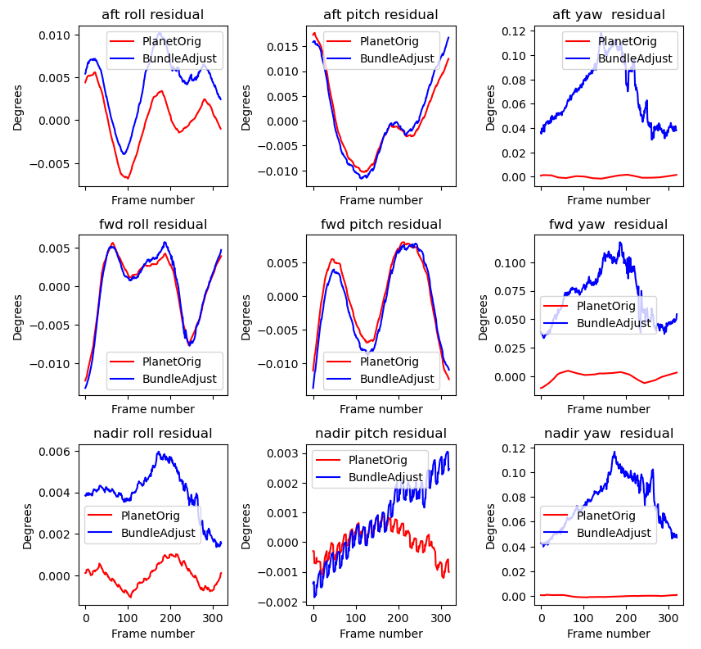

.. _skysat:

SkySat Stereo and Video data
----------------------------

SkySat is a constellation of sub-meter resolution Earth observation
satellites owned by *Planet*. There are two type of SkySat
products, *Stereo* and *Video*, with each made up of
sequences of overlapping images. Their processing is described in
:numref:`skysat_stereo` and :numref:`skysat_video`, respectively.

SkySat images are challenging to process with ASP because they come in
a very long sequence, with small footprints, and high focal length. It
requires a lot of care to determine and refine the camera positions
and orientations. 

A very informative paper on processing SkySat data with ASP is
:cite:`bhushan2021automated`, and their workflow is `publicly
available <https://github.com/uw-cryo/skysat_stereo>`_.

.. _skysat_stereo:

Stereo data
~~~~~~~~~~~

The SkySat *Stereo* products may come with Pinhole cameras
(stored in files with the ``_pinhole.json`` suffix) and/or with RPC
cameras (embedded in the TIF images or in files with the ``_RPC.txt``
suffix).

This product may have images acquired with either two or three
perspectives, and for each of those there are three sensors with
overlapping fields of view. Each sensor creates on the order of 300
images with much overlap among them.

Individual pairs of stereo images are rather easy to process with ASP,
following the example in :numref:`rpc`. Here we focus on creating
stereo from the full sequences of images.

Due to non-trivial errors in each provided camera's position and orientation,
it was found necessary to convert the given cameras to ASP's
Pinhole format (:numref:`pinholemodels`) and then run bundle
adjustment (:numref:`bundle_adjust`), to refine the camera
poses. (Note that for RPC cameras, this conversion decouples the
camera intrinsics from their poses.) Then, pairwise stereo is run, and
the obtained DEMs are mosaicked.

A possible workflow is as follows. (Compare this with the processing
of Video data in :numref:`skysat_video`. This section is newer, and if
in doubt, use the approach here.)

Creation of input cameras
^^^^^^^^^^^^^^^^^^^^^^^^^

Pinhole cameras can be created with ``cam_gen`` (:numref:`cam_gen`).
Two approaches can be used. The first is to ingest SkySat's provided
Pinhole cameras, which have a ``_pinhole.json`` suffix.

::

    pref=img/1259344359.55622339_sc00104_c2_PAN_i0000000320
    cam_gen ${pref}.tif                        \
        --input-camera ${pref}_pinhole.json    \
        -o ${pref}.tsai

This approach is preferred. Specify a .json extension if desired
to mix and match various sensor types (:numref:`ba_frame_linescan`).

With SkySat, it is suggested not to refine the vendor-provided cameras at this
stage, but do a straightforward conversion only. Note that this was tested only
with the L1A SkySat product.

Alternatively, if the ``pinhole.json`` files are not available, 
a Pinhole camera can be derived from each of their RPC
cameras.

::

    pref=img/1259344359.55622339_sc00104_c2_PAN_i0000000320
    cam_gen ${pref}.tif               \
        --input-camera ${pref}.tif    \
        --focal-length 553846.153846  \
        --optical-center 1280 540     \
        --pixel-pitch 1.0             \
        --reference-dem ref.tif       \
        --height-above-datum 4000     \
        --refine-camera               \
        --frame-index frame_index.csv \
        --parse-ecef                  \
        --cam-ctr-weight 1000         \
        --gcp-std 1                   \
        --gcp-file ${pref}.gcp        \
        -o ${pref}.tsai

It is very important to examine if the data is of type L1A or L1B. The
value of ``--pixel-pitch`` should be 0.8 in the L1B products, but 1.0
for L1A.

Above, we read the ECEF camera positions from the ``frame_index.csv``
file provided by Planet. These positions are more accurate than what
``cam_gen`` can get on its own based on the RPC camera.

The ``--cam-ctr-weight`` and ``--refine-camera`` options will keep
the camera position in place by penalizing any deviations with the given
weight, while refining the camera orientation.

The reference DEM ``ref.tif`` is a Copernicus 30 m DEM
(:numref:`initial_terrain`). Ensure the DEM is relative to WGS84 and
not EGM96, and convert it if necessary; see :numref:`conv_to_ellipsoid`.

The option ``--input-camera`` will make
use of existing RPC cameras to accurately find the pinhole camera
poses. The option ``--height-above-datum`` should not be necessary if
the DEM footprint covers fully the area of interest.

Bundle adjustment
^^^^^^^^^^^^^^^^^

For the next steps, it may be convenient to make symbolic links from
the image names and cameras to something shorter (once relevant
metatadata that needs the original names is parsed from
``frame_index.csv``). For example, if all the images and cameras just
produced are in a directory called ``img``, one can do::

    cd img
    ln -s ${pref}.tif n1000.tif

for the first Nadir-looking image, and similarly for Forward and
Aft-looking images and cameras, if available, and their associated RPC
metadata files.

For bundle adjustment it may be preferable to have the lists of images
and pinhole cameras stored in files, as otherwise they may be too many
to individually pass on the command line. 

::

    ls img/*.tif > images.txt
    ls img/*.tsai > cameras.txt

Then run ``parallel_bundle_adjust`` (:numref:`parallel_bundle_adjust`), rather
than ``bundle_adjust``, as there are very many pairs of images to match.

::

    nodesList=machine_names.txt
    parallel_bundle_adjust                    \
    --inline-adjustments                      \
    --num-iterations 200                      \
    --image-list images.txt                   \
    --camera-list cameras.txt                 \
    --tri-weight 0.1                          \
    --tri-robust-threshold 0.1                \
    --rotation-weight 0                       \
    --camera-position-weight 1000             \
    --auto-overlap-params "ref.tif 15"        \
    --min-matches 5                           \
    --remove-outliers-params '75.0 3.0 20 20' \
    --min-triangulation-angle 15.0            \
    --max-pairwise-matches 200                \
    --nodes-list $nodesList                   \
    -o ba/run

See :numref:`ba_validation` for important sanity checks and report
files to examine after bundle adjustment.

See :numref:`pbs_slurm` for more details on running ASP tools on multiple
machines. 

The ``--tri-weight`` option (:numref:`ba_ground_constraints`) prevents the
cameras from moving too much (a lower weight value will constrain less). The
value of ``--tri-robust-threshold`` (0.1) is intentionally set to be less than
the one used for ``--robust-threshold`` (0.5) to ensure pixel reprojection
errors are always given a higher priority than triangulation errors. 

The ``--camera-position-weight`` value was set to a large number to keep the
camera positions fixed  during bundle adjustment. This is important as 
it is assumed that the camera positions are already accurate and it is desired
to only refine the camera orientations.

The ``--rotation-weight`` value was set to 0, so the camera orientations can
change with no restrictions. See :numref:`ba_cam_constraints` for a discussion
of camera constraints.
 
If the input cameras are reasonably accurate to start with, for example,
consistent with a known DEM to within a small handful of meters, that DEM
can be used to constrain the cameras, instead of the triangulation
constraint. So, the above options can be replaced, for example, with::

    --heights-from-dem dem.tif              \
    --heights-from-dem-uncertainty 10.0     \
    --heights-from-dem-robust-threshold 0.1 \

The DEM must be relative to the WGS84 ellipsoid, rather than to a geoid,
and the weight and threshold above should be lower if the DEM has higher
uncertainty when it comes to its heights or alignment to the cameras. 
See also :numref:`heights_from_dem`.

The option ``--auto-overlap-params`` automatically determines which
image pairs overlap. We used ``--max-pairwise-matches 200`` as
otherwise too many interest point matches were found.

The option ``--mapproj-dem`` (:numref:`ba_mapproj_dem`) can be used to
preview the quality of registration of the images on the ground after
bundle adjustment.

The option ``--min-triangulation-angle 15.0`` filtered out interest
point matches with a convergence angle less than this. This is very
important for creating a reliable sparse set of triangulated points
based on interest point matches (:numref:`ba_out_files`). This one can
be used to compute the alignment transform to the reference terrain::

    pc_align --max-displacement 200                 \
      --csv-format 1:lon,2:lat,3:height_above_datum \
      --save-transformed-source-points              \
      ref.tif ba/run-final_residuals_pointmap.csv   \
     -o $dir/run

If desired, the obtained alignment transform can be applied to the
cameras as well (:numref:`ba_pc_align`).

Use ``stereo_gui`` to inspect the reprojection errors in the final
``pointmap.csv`` file (:numref:`plot_csv`). See the outcome in
:numref:`skysat_stereo_grand_mesa_pointmap`.

.. _skysat_stereo_grand_mesa_poses:

   The roll, pitch, and yaw of the camera orientations before and after bundle
   adjustment for the Aft, Forward, and Nadir cameras (for the center sensor of
   the Skysat triplet). Plotted with ``orbit_plot.py`` (:numref:`orbit_plot`). The
   best linear fit of this data before bundle adjustment was subtracted to
   emphasize the differences, which are very small. The cameras centers were
   very constrained and did not change. Yet, see
   :numref:`skysat_stereo_grand_mesa_pointmap` for the effect on the
   reprojection errors.

.. _skysat_stereo_grand_mesa_pointmap:
.. figure:: ../images/skysat_stereo_grand_mesa.png
   :name: skysat-stereo-example
   :alt: SkySat stereo example

   The colorized bundle adjustment camera reprojection errors (pointmap.csv)
   overlaid on top of the Copernicus 30 m DEM for Grand Mesa, Colorado, before
   optimization (left) and after (right). Plotted with ``stereo_gui``. Maximum
   shade of red is reprojection error of at least 5 pixels. The same set of
   clean interest points was used in both plots. It can be seen that while
   bundle adjustment changes the cameras very little, it makes a very big
   difference in how consistent the cameras become.

The camera positions and orientations (the latter in NED coordinates)
are summarized in two report files, before and after optimization
(:numref:`ba_cam_pose`). It is suggested to examine if these are
plausible. It is expected that the spacecraft position and orientation
will change in a slow and smooth manner, and that these will not change
drastically during bundle adjustment.

If desired to do further experiments in bundle adjustment, the
existing interest matches can be reused via the options
``--clean-match-files-prefix`` and ``--match-files-prefix``. The
matches can be inspected with ``stereo_gui``
(:numref:`stereo_gui_pairwise_matches`).

DEM creation
^^^^^^^^^^^^

Pairwise stereo then can be run among overlapping image pairs
(:numref:`nextsteps`), with ``dem_mosaic`` (:numref:`dem_mosaic`) used
for mosaicking the obtained DEMs. It may be necessary to eliminate the pairwise
DEMs which are created with images that barely overlap before mosaicking.

.. _skysat_video:

Video data
~~~~~~~~~~

The rest of this section will be concerned with the ``Video`` product,
which is a set of images recorded together in quick sequence. This is
a very capricious dataset, so some patience will be needed to work
with it. That is due to the following factors:

-  The baseline can be small, so the perspective of the left and right
   image can be too similar.

-  The footprint on the ground is small, on the order of 2 km.

-  The terrain can be very steep.

-  The known longitude-latitude corners of each image have only a few
   digits of precision, which can result in poor initial estimated
   cameras.

Below a recipe for how to deal with this data is described, together
with things to watch for and advice when things don't work. 

See also how the Stereo product was processed
(:numref:`skysat_stereo`).  That section is newer, and that product
was explored in more detail. Stereo products are better-behaved than
Video products, so it is suggested to work with Stereo data, if possible, 
or at least cross-reference with that section the logic below.

The input data
~~~~~~~~~~~~~~

We will use as an illustration a mountainous terrain close to
Breckenridge, Colorado. The dataset we fetched is called
``s4_20181107T175036Z_video.zip``. We chose to work with the following
four images from it::

     1225648254.44006968_sc00004_c1_PAN.tiff
     1225648269.40892076_sc00004_c1_PAN.tiff
     1225648284.37777185_sc00004_c1_PAN.tiff
     1225648299.37995577_sc00004_c1_PAN.tiff

A sample picture from this image set is shown in :numref:`skysat-example`.

It is very important to pick images that have sufficient difference in
perspective, but which are still reasonably similar, as otherwise the
procedure outlined in this section will fail.

.. figure:: ../images/Breckenridge.jpg
   :name: skysat-example
   :alt: SkySat example

   An image used in the SkySat example. Reproduced with permission.

.. _refdem:

Initial camera models and a reference DEM
~~~~~~~~~~~~~~~~~~~~~~~~~~~~~~~~~~~~~~~~~

Based on vendor's documentation, these images are
:math:`2560 \times 1080` pixels. We use the geometric center of the
image as the optical center, which turned out to be a reasonable enough
assumption (verified by allowing it to float later). Since the focal
length is given as 3.6 m and the pixel pitch is
:math:`6.5 \times 10^{-6}` m, the focal length in pixels is

.. math:: 3.6/6.5 \times 10^{-6} = 553846.153846.

Next, a reference DEM needs to be found. Recently we recommend getting
a Copernicus 30 m DEM (:numref:`initial_terrain`).

It is very important to note that SRTM DEMs can be relative to the WGS84
ellipsoidal vertical datum, or relative to the EGM96 geoid. In the latter case,
``dem_geoid`` (:numref:`dem_geoid`) needs to be used to first convert it to be
relative to WGS84. This may apply up to 100 meters of vertical adjustment.
See :numref:`conv_to_ellipsoid`.

It is good to be a bit generous when selecting the extent of the reference DEM.
We will rename the downloaded DEM to ``ref_dem.tif``. 

Using the ``cam_gen`` tool (:numref:`cam_gen`) bundled with ASP, we
create an initial camera model and a GCP file (:numref:`bagcp`) for
the first image as as follows::

     cam_gen 1225648254.44006968_sc00004_c1_PAN.tiff \
       --frame-index output/video/frame_index.csv    \
       --reference-dem ref_dem.tif                   \
       --focal-length 553846.153846                  \
       --optical-center 1280 540                     \
       --pixel-pitch 1 --height-above-datum 4000     \
       --refine-camera                               \
       --gcp-std 1                                   \
       --gcp-file v1.gcp                             \
       -o v1.tsai

This tool works by reading the longitude and latitude of each image
corner on the ground from the file ``frame_index.csv``, and finding the
position and orientation of the camera that best fits this data. The
camera is written to ``v1.tsai``. A GCP file is written to ``v1.gcp``.
This will help later with bundle adjustment.

If an input camera exists, such as embedded in the image file, it is
strongly suggested to pass it to this tool using the
``--input-camera`` option, as it will improve the accuracy of produced
cameras (:numref:`skysat-rpc`).

In the above command, the optical center and focal length are as mentioned
earlier. The reference SRTM DEM is used to infer the height above datum
for each image corner based on its longitude and latitude. The height
value specified via ``--height-above-datum`` is used as a fallback
option, if for example, the DEM is incomplete, and is not strictly
necessary for this example. This tool also accepts the longitude and
latitude of the corners as an option, via ``--lon-lat-values``.

The flag ``--refine-camera`` makes ``cam_gen`` solve a least square
problem to refine the output camera. In some cases it can get the
refinement wrong, so it is suggested experimenting with and without
using this option.

For simplicity of notation, we will create a symbolic link from this
image to the shorter name ``v1.tif``, and the GCP file needs to be
edited to reflect this. The same will apply to the other files. We will
have then four images, ``v1.tif, v2.tif, v3.tif, v4.tif``, and
corresponding camera and GCP files.

A good sanity check is to visualize the computed cameras.
ASP's ``sfm_view`` tool can be used (:numref:`sfm_view`). Alternatively, 
ASP's ``orbitviz`` program (:numref:`orbitviz`) can create KML files
that can then be opened in Google Earth. 

We very strongly recommend inspecting the camera positions and orientations,
since this may catch inaccurate cameras which will cause problems later.

Another important check is to mapproject these images using the cameras
and overlay them in ``stereo_gui`` on top of the reference DEM. Here is
an example for the first image::

     mapproject --t_srs \
     '+proj=stere +lat_0=39.4702 +lon_0=253.908 +k=1 +x_0=0 +y_0=0 +datum=WGS84 +units=m' \
     ref_dem.tif v1.tif v1.tsai v1_map.tif 

Notice that we used above a longitude and latitude around the area of
interest. This will need to be modified for your specific example.

Bundle adjustment
~~~~~~~~~~~~~~~~~

At this stage, the cameras should be about right, but not quite exact.
We will take care of this using bundle adjustment. We will invoke this
tool twice. In the first call we will make the cameras self-consistent.
This may move them somewhat, though the ``--tri-weight`` constraint 
that is used below should help. In the second call we will try to 
bring the back to the original location.

::

     parallel_bundle_adjust                \
       v[1-4].tif v[1-4].tsai              \
       -t nadirpinhole                     \
       --disable-tri-ip-filter             \
       --skip-rough-homography             \
       --force-reuse-match-files           \
       --ip-inlier-factor 2.0              \
       --ip-uniqueness-threshold 0.8       \
       --ip-per-image 20000                \
       --datum WGS84                       \
       --inline-adjustments                \
       --camera-weight 0                   \
       --tri-weight 0.1                    \
       --robust-threshold 2                \
       --remove-outliers-params '75 3 4 5' \
       --ip-num-ransac-iterations 1000     \
       --num-passes 2                      \
       --auto-overlap-params "ref.tif 15"  \
       --num-iterations 1000               \
       -o ba/run

     parallel_bundle_adjust                     \
       -t nadirpinhole                          \
       --datum WGS84                            \
       --force-reuse-match-files                \
       --inline-adjustments                     \
       --num-passes 1 --num-iterations 0        \
       --transform-cameras-using-gcp            \
       v[1-4].tif ba/run-v[1-4].tsai v[1-4].gcp \
       -o ba/run

It is very important to not use the ``pinhole`` session here, rather
``nadirpinhole``, as the former does not filter well interest points
in this steep terrain.

The ``--auto-overlap-params`` option used earlier is useful a very large
number of images is present and a preexisting DEM of the area is available,
which need not be perfectly aligned with the cameras. It can be used
to determine each camera's footprint, and hence, which cameras overlap.
Otherwise, use the ``--overlap-limit`` option to control how many subsequent
images to match with a given image. 

The output optimized cameras will be named ``ba/run-run-v[1-4].tsai``.
The reason one has the word "run" repeated is because we ran this tool
twice. The intermediate cameras from the first run were called
``ba/run-v[1-4].tsai``.

Here we use ``--ip-per-image 20000`` to create a lot of interest points.
This will help with alignment later. It is suggested that the user study
all these options and understand what they do. We also used
``--robust-threshold 10`` to force the solver to work the bigger errors.
That is necessary since the initial cameras could be pretty inaccurate.

It is very important to examine the residual file named::

     ba/run-final_residuals_pointmap.csv

Here, the third column are the heights of triangulated interest
points, while the fourth column are the reprojection errors. Normally
these errors should be a fraction of a pixel, as otherwise the
solution did not converge. The last entries in this file correspond to
the GCP, and those should be looked at carefully as well. The
reprojection errors for GCP should be on the order of tens of pixels
because the longitude and latitude of each GCP are not
well-known. This can be done with :numref:`stereo_gui`, which will
also colorize the residuals (:numref:`plot_csv`).

It is also very important to examine the obtained match files in the
output directory. For that, use ``stereo_gui`` with the option
``--pairwise-matches`` (:numref:`stereo_gui_view_ip`). If there are
too few matches, particularly among very similar images, one may need
to increase the value of ``--epipolar-threshold`` (or of
``--ip-inlier-factor`` for the not-recommended pinhole session). Note
that a large value here may allow more outliers, but those should normally
by filtered out by ``bundle_adjust``.

Another thing one should keep an eye on is the height above datum of the
camera centers as printed by bundle adjustment towards the end. Any
large difference in camera heights (say more than a few km) could be a
symptom of some failure.

.. _skysat_video_stereo:

Creating terrain models
~~~~~~~~~~~~~~~~~~~~~~~

The next steps are to run ``parallel_stereo`` and create DEMs.

We will run the following command for each pair of images. Note that we
reuse the filtered match points created by bundle adjustment, with the
``--clean-match-files-prefix`` option.

::

     i=1
     ((j=i+1))
     st=stereo_v${i}${j}
     rm -rfv $st
     mkdir -p $st
     parallel_stereo --skip-rough-homography       \
       -t nadirpinhole --stereo-algorithm asp_mgm  \
       v${i}.tif v${j}.tif                         \
       ba/run-run-v${i}.tsai ba/run-run-v${j}.tsai \
       --clean-match-files-prefix ba/run           \
       $st/run
     point2dem --stereographic --proj-lon 253.90793 --proj-lat 39.47021 \
       --tr 4 --errorimage $st/run-PC.tif

(Repeat this for other values of :math:`i`.)

See :numref:`nextsteps` for a discussion about various speed-vs-quality choices.

Here we chose to use a stereographic projection in ``point2dem``
centered at a point somewhere in the area of interest, in order to
create the DEM in units of meter. One can can also use a different
projection that can be passed to the option ``--t_srs``, or if doing
as above, the center of the projection would need to change if working
on a different region.

It is important to examine the mean intersection error for each DEM::

     gdalinfo -stats stereo_v12/run-IntersectionErr.tif | grep Mean

which should hopefully be no more than 0.5 meters, otherwise likely
bundle adjustment failed. One should also compare the DEMs among
themselves::

     geodiff --absolute stereo_v12/run-DEM.tif stereo_v23/run-DEM.tif -o tmp 
     gdalinfo -stats tmp-diff.tif | grep Mean

(And so on for any other pair.) Here the mean error should be on the
order of 2 meters, or hopefully less.

Mosaicking and alignment
~~~~~~~~~~~~~~~~~~~~~~~~

If more than one image pair was used, the obtained DEMs can be
mosaicked::

     dem_mosaic stereo_v12/run-DEM.tif stereo_v23/run-DEM.tif \
       stereo_v34/run-DEM.tif -o mosaic.tif

This DEM can be hillshaded and overlaid on top of the reference DEM.

The next step is aligning it to the reference.

::

     pc_align --max-displacement 1000 --save-transformed-source-points \
       --alignment-method similarity-point-to-point                    \
       ref_dem.tif mosaic.tif -o align/run

It is important to look at the errors printed by this tool before and
after alignment, as well as details about the alignment that was
applied. The obtained aligned cloud can be made into a DEM again::

     point2dem --stereographic --proj-lon 253.90793 --proj-lat 39.47021 --tr 4  \
       align/run-trans_source.tif

The absolute difference before and after alignment can be found as
follows::

     geodiff --absolute mosaic.tif ref_dem.tif -o tmp 
     gdalinfo -stats tmp-diff.tif | grep Mean

::

     geodiff --absolute  align/run-trans_source-DEM.tif ref_dem.tif -o tmp 
     gdalinfo -stats tmp-diff.tif | grep Mean

In this case the mean error after alignment was about 6.5 m, which is
not too bad given that the reference DEM resolution is about 30 m/pixel.

Alignment of cameras
~~~~~~~~~~~~~~~~~~~~

The transform computed with ``pc_align`` can be used to bring the
cameras in alignment to the reference DEM. That can be done as follows::

     parallel_bundle_adjust -t nadirpinhole --datum wgs84     \
       --force-reuse-match-files                              \
       --inline-adjustments                                   \
       --initial-transform align/run-transform.txt            \
       --apply-initial-transform-only                         \
       v[1-4].tif ba/run-run-v[1-4].tsai -o ba/run

creating the aligned cameras ``ba/run-run-run-v[1-4].tsai``. If
``pc_align`` was called with the reference DEM being the second cloud,
one should use above the file::

     align/run-inverse-transform.txt

as the initial transform.

Mapprojection
~~~~~~~~~~~~~

If the steep topography prevents good DEMs from being created, one can
mapproject the images first onto the reference DEM::

     for i in 1 2 3 4; do 
       mapproject --tr gridSize ref_dem.tif v${i}.tif \
         ba/run-run-run-v${i}.tsai v${i}_map.tif  
     done

It is very important to use the same resolution (option ``--tr``) for
both images when mapprojecting. That helps making the resulting images
more similar and reduces the processing time (:numref:`mapproj-res`). 

Then run ``parallel_stereo`` with the mapprojected images, such as::

     i=1
     ((j=i+1))
     rm -rfv stereo_map_v${i}${j}
     parallel_stereo v${i}_map.tif v${j}_map.tif                   \
       ba/run-run-run-v${i}.tsai ba/run-run-run-v${j}.tsai         \
       --session-type pinhole --alignment-method none              \
       --cost-mode 4 --stereo-algorithm asp_mgm --corr-seed-mode 1 \
       stereo_map_v${i}${j}/run ref_dem.tif
     point2dem --stereographic --proj-lon 253.90793                \
       --proj-lat 39.47021 --tr 4 --errorimage                     \
       stereo_map_v${i}${j}/run-PC.tif

It is important to note that here we used the cameras that were aligned
with the reference DEM. We could have as well mapprojected onto a
lower-resolution version of the mosaicked and aligned DEM with its holes
filled.

When things fail
~~~~~~~~~~~~~~~~

Processing SkySat images is difficult, for various reasons mentioned
earlier. A few suggestions were also offered along the way when things
go wrong.

Problems are usually due to cameras being initialized inaccurately by
``cam_gen`` or bundle adjustment not optimizing them well. The simplest
solution is often to just try a different pair of images from the
sequence, say from earlier or later in the flight, or a pair with less
overlap, or with more time elapsed between the two acquisitions.
Modifying various parameters may help as well.

We have experimented sufficiently with various SkySat datasets to be
sure that the intrinsics (focal length, optical center, and pixel pitch)
are usually not the issue, rather the positions and orientations of the
cameras.

Structure from motion
~~~~~~~~~~~~~~~~~~~~~

In case ``cam_gen`` does not create sufficiently good cameras, one
can attempt to use the ``camera_solve`` tool (:numref:`sfm`). This
will create hopefully good cameras but in an arbitrary coordinate
system. Then we will transfer those to the world coordinates using
GCP.

Here is an example for two cameras::

     out=out_v12 
     ba_params="--num-passes 1 --num-iterations 0
        --transform-cameras-using-gcp"
     theia_overdides="--sift_num_levels=6 --lowes_ratio=0.9 
       --min_num_inliers_for_valid_match=10 
       --min_num_absolute_pose_inliers=10 
       --bundle_adjustment_robust_loss_function=CAUCHY 
       --post_rotation_filtering_degrees=180.0 --v=2  
       --max_sampson_error_for_verified_match=100.0 
       --max_reprojection_error_pixels=100.0 
       --triangulation_reprojection_error_pixels=100.0 
       --min_num_inliers_for_valid_match=10 
       --min_num_absolute_pose_inliers=10"                  
     rm -rfv $out
     camera_solve $out --datum WGS84 --calib-file v1.tsai  \
         --bundle-adjust-params "$ba_params v1.gcp v2.gcp" \
         v1.tif v2.tif 

The obtained cameras should be bundle-adjusted as done for the outputs
of ``cam_gen``. Note that this tool is capricious and its outputs can be
often wrong. In the future it will be replaced by something more robust.

.. _skysat-rpc:

RPC models
~~~~~~~~~~

Some SkySat datasets come with RPC camera models, typically embedded in
the images. This can be verified by running::

     gdalinfo -stats output/video/frames/1225648254.44006968_sc00004_c1_PAN.tiff

We found that these models are not sufficiently robust for stereo. But
they can be used to create initial guess pinhole cameras 
(:numref:`pinholemodels`) with ``cam_gen``. 

We will use the RPC camera model instead of longitude and latitude of
image corners to infer the pinhole camera position and orientation.
This greatly improves the accuracy and reliability.

Here is an example::

    img=output/video/frames/1225648254.44006968_sc00004_c1_PAN.tiff
    cam_gen $img --reference-dem ref_dem.tif --focal-length 553846.153846  \
       --optical-center 1280 540 --pixel-pitch 1 --height-above-datum 4000 \
       --refine-camera --gcp-std 1 --input-camera $img                     \
       -o v1_rpc.tsai --gcp-file v1_rpc.gcp

Note that the Breckenridge dataset does not have RPC data, but other
datasets do. If the input camera is stored separately in a camera file,
use that one with ``--input-camera``.

If an RPC model is embedded in the image, one can validate how well the new Pinhole
camera approximates the existing RPC camera with ``cam_test``
(:numref:`cam_test`), with a command like::

  cam_test --image image.tif --cam1 image.tif --cam2 out_cam.tsai \
      --height-above-datum 4000

Then one can proceed as earlier (particularly the GCP file can be edited
to reflect the shorter image name).

One can also regenerate the provided SkySat RPC model as::

     cam2rpc -t rpc --dem-file dem.tif input.tif output.xml

Here, the reference DEM should go beyond the extent of the image. This
tool makes it possible to decide how finely to sample the DEM, and one
can simply use longitude-latitude and height ranges instead of the DEM.

We assumed in the last command that the input image implicitly stores
the RPC camera model, as is the case for SkySat.

Also, any pinhole camera models obtained using our software can be
converted to RPC models as follows::

     cam2rpc --dem-file dem.tif input.tif input.tsai output.xml 

Bundle adjustment using reference terrain
~~~~~~~~~~~~~~~~~~~~~~~~~~~~~~~~~~~~~~~~~

At this stage, if desired, but this is rather unnecessary, one can do
joint optimization of the cameras using dense and uniformly distributed
interest points, and using the reference DEM as a constraint. This
should make the DEMs more consistent among themselves and closer to the
reference DEM.

It is also possible to float the intrinsics, per
:numref:`floatingintrinsics`, which sometimes can improve the results
further.

For that, one should repeat the ``stereo_tri`` part of of the stereo
commands from :numref:`skysat_video_stereo` with the flags
``--num-matches-from-disp-triplets 10000`` and ``--unalign-disparity``
to obtain dense interest points and unaligned disparity.
(To not generate the triangulated point cloud after
this, add the option ``--compute-point-cloud-center-only``.)
Use ``--num-matches-from-disparity 10000`` if the images are large,
as the earlier related option can be very slow then.

The match points can be examined as::

     stereo_gui v1.tif v2.tif stereo_v12/run-disp-v1__v2.match

and the same for the other image pairs. Hopefully they will fill as much
of the images as possible. One should also study the unaligned
disparities, for example::

     stereo_v12/run-v1__v2-unaligned-D.tif

by invoking ``disparitydebug`` on it and then visualizing the two
obtained images. Hopefully these disparities are dense and with few
holes.

The dense interest points should be copied to the new bundle adjustment
directory, such as::

     mkdir -p ba_ref_terrain
     cp stereo_v12/run-disp-v1__v2.match ba_ref_terrain/run-v1__v2.match

and the same for the other ones (note the convention for match files in
the new directory). The unaligned disparities can be used from where
they are.

Then bundle adjustment using the reference terrain constraint proceeds
as follows::

     disp_list=$(ls stereo_v[1-4][1-4]/*-unaligned-D.tif)
     bundle_adjust v[1-4].tif  ba/run-run-run-v[1-4].tsai -o ba_ref_terrain/run    \
     --reference-terrain ref_dem.tif --disparity-list "$disp_list"                 \
     --max-num-reference-points 10000000 --reference-terrain-weight 50             \
     --parameter-tolerance 1e-12 -t nadirpinhole --max-iterations 500              \
     --overlap-limit 1 --inline-adjustments --robust-threshold 2                   \
     --force-reuse-match-files --max-disp-error 100 --camera-weight 0

If invoking this creates new match files, it means that the dense match
files were not copied successfully to the new location. If this
optimization is slow, perhaps too many reference terrain points were
picked.

This will create, as before, the residual file named::

     ba_ref_terrain/run-final_residuals_pointmap.csv

showing how consistent are the cameras among themselves, and in
addition, a file named::

     ba_ref_terrain/run-final_residuals_reference_terrain.txt

which tells how well the cameras are aligned to the reference terrain.
The errors in the first file should be under 1 pixel, and in the second
one should be mostly under 2-3 pixels (both are the fourth column in
these files).

The value of ``--reference-terrain-weight`` can be increased to make the
alignment to the reference terrain a little tighter.

It is hoped that after running ``parallel_stereo`` with these refined
cameras, the obtained DEMs will differ by less than 2 m among
themselves, and by less than 4 m as compared to the reference DEM.

Floating the camera intrinsics
~~~~~~~~~~~~~~~~~~~~~~~~~~~~~~

If desired to float the focal length as part of the optimization, one
should pass in addition, the options::

    --solve-intrinsics --intrinsics-to-float 'focal_length'

Floating the optical center can be done by adding it in as well.

It is important to note that for SkySat the intrinsics seem to be
already quite good, and floating them is not necessary and is only shown
for completeness. If one wants to float them, one should vary the focal
length while keeping the optical center fixed, and vice versa, and
compare the results. Then, with the result that shows most promise, one
should vary the other parameter. If optimizing the intrinsics too
aggressively, it is not clear if they will still deliver better results
with other images or if comparing with a different reference terrain.

Yet, if desired, one can float even the distortion parameters. For that,
the input camera files need to be converted to some camera model having
these (see :numref:`pinholemodels`), and their
values can be set to something very small. One can use the Brown-Conrady
model, for example, so each camera file must have instead of ``NULL`` at
the end the fields::

   BrownConrady
   xp  = -1e-12
   yp  = -1e-12
   k1  = -1e-10
   k2  = -1e-14
   k3  = -1e-22
   p1  = -1e-12
   p2  = -1e-12
   phi = -1e-12

There is always a chance when solving these parameters that the obtained
solution is not optimal. Hence, one can also try using as initial
guesses different values, for example, by negating the above numbers.

One can also try to experiment with the option ``--heights-from-dem``,
and also with ``--robust-threshold`` if it appears that the large errors
are not minimized enough.
