.. _spot14:

SPOT 1-4
--------

SPOT 1, 2, 3, and 4 are CNES (Space Agency of France) satellites launched
between 1986 and 1998. Each carried two high-resolution imaging instruments
(HRV on SPOT 1 to 3, HRVIR on SPOT 4), with a panchromatic ground resolution of
10 meters and a cross-track steering mirror. Unlike the along-track fore/aft
stereo of SPOT5 (:numref:`spot5`), a stereo pair is assembled from two
acquisitions of the same area on different dates, with different mirror pointing.

This workflow requires an ASP build from 2026-08-15 or later (:numref:`release`).

See also the examples for SPOT5 (:numref:`spot5`) and SPOT 6-7 (:numref:`spot67`).
See :numref:`spot_multi` for handling of multispectral data.

Camera model
~~~~~~~~~~~~

SPOT 1-4 broadly share the DIMAP v1 format with SPOT 5. They differ in two ways,
both handled automatically:

- Attitude is given as two absolute yaw, pitch, and roll samples (a
  ``Raw_Attitudes`` block) rather than a pre-corrected per-line table. These
  are interpolated across the scene. The magnitudes are of the order of
  microradians, so this is adequate; residual low-frequency attitude is
  discussed below.
- The look angles are listed for the first and last detector only. They are
  interpolated linearly to every column.

The geolocation encoded in the metadata is accurate to roughly one kilometer,
so bundle adjustment (:numref:`bundle_adjust`) is always needed, followed by
alignment to a reference (:numref:`pc_align`).

The cameras are converted internally to the CSM format (:numref:`csm`), and
saved this way by ``bundle_adjust`` and ``jitter_solve``
(:numref:`jitter_solve`).

Data access
~~~~~~~~~~~

The SPOT 1-5 archive is free from the CNES SPOT World Heritage (SWH) program at
https://regards.cnes.fr/user/swh. Create an account, accept the ETALAB 2.0
license, and download the level-1A SCENE product in DIMAP format. Do not use the
orthorectified level-2 product, as the rigorous camera needs the raw scene.

Scenes are identified in the catalogue by satellite, the SPOT grid reference K
(column) and J (row), date, instrument (HRV1 or HRV2), and incidence angle. The
scene identifier encodes all of these, for example ``11222858708240840372P`` is
satellite 1 (SPOT-1), K122, J285, 1987-08-24, 08:40:37, instrument 2 (HRV2),
panchromatic. A stereo pair is two scenes of the same K and J acquired with
different incidence angles.

Example stereo pair
~~~~~~~~~~~~~~~~~~~

The scenes below cover the Harrat volcanic field near Badia, northeast Jordan
(K122, J285), a site used for SPOT stereo DEM assessment by Al-Rousan and Petrie
:cite:`alrousan98`. All three are SPOT-1 HRV2 panchromatic:

.. list-table::
   :header-rows: 1

   * - Scene ID
     - Date
     - Incidence angle
   * - ``11222858704220824352P``
     - 1987-04-22
     - +2.2° (near-nadir)
   * - ``11222858708240840372P``
     - 1987-08-24
     - +28.2° (east look)
   * - ``11222858709050809462P``
     - 1987-09-05
     - -23.7° (west look)

Pairing either off-nadir scene with the near-nadir 1987-04-22 scene gives a
convergence of about 26°, which is easier to correlate. The example uses these two
pairs.

After download, each scene arrives as a directory with the image in
``IMAGERY.TIF`` and the metadata in ``METADATA.DIM``. Since bundle adjustment
identifies images by file name, rename each pair so the names are unique, as for
SPOT5 (:numref:`spot5`). Below the images are named ``nadir.tif``, ``east.tif``,
``west.tif`` with cameras ``nadir.dim``, ``east.dim``, ``west.dim``.

Bundle adjustment
~~~~~~~~~~~~~~~~~

Adjust all three scenes together, so the near-nadir scene ties the two off-nadir
looks::

    bundle_adjust -t spot         \
      nadir.tif east.tif west.tif \
      nadir.dim east.dim west.dim \
      --ip-per-image 30000        \
      -o ba/run

Inspect ``ba/run-final_residuals_stats.txt`` (:numref:`bundle_adjust`). The
median reprojection error should be well under a pixel.

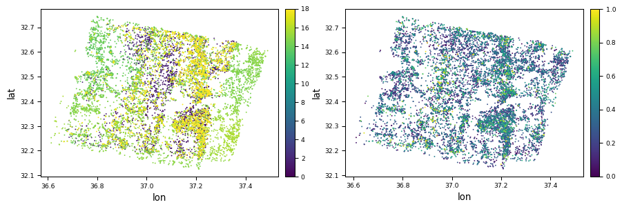

   Reprojection error per triangulated point (:numref:`ba_out_files`), in pixels,
   before bundle adjustment (left, 0 to 18) and after (right, 0 to 1), for the
   three Badia scenes. The metadata pointing is off by about 14 pixels; after
   adjustment the residual is sub-pixel across the whole footprint.

Stereo and DEM
~~~~~~~~~~~~~~

Define a single projection and reuse it for all gridded outputs. Use the UTM zone
that covers the site (Badia is in zone 37 north). Fix one zone for all images,
rather than letting it be auto-determined per image (:numref:`mapproj_auto_proj`),
since the mapprojected images of a pair must share the same projection::

    proj="+proj=utm +zone=37 +datum=WGS84 +units=m +no_defs"

Run stereo on each pair with local epipolar alignment
(:numref:`parallel_stereo`), then make a DEM with the triangulation error
(:numref:`point2dem`)::

    parallel_stereo -t spot             \
      --alignment-method local_epipolar \
      --stereo-algorithm asp_mgm        \
      --bundle-adjust-prefix ba/run     \
      nadir.tif east.tif                \
      nadir.dim east.dim                \
      st_pair1/run

    point2dem         \
      --errorimage    \
      --t_srs "$proj" \
      st_pair1/run-PC.tif

Repeat for the second pair. The triangulation (intersection) error is the key
camera-quality check. After bundle adjustment it should be a small fraction of
the ground sample distance.

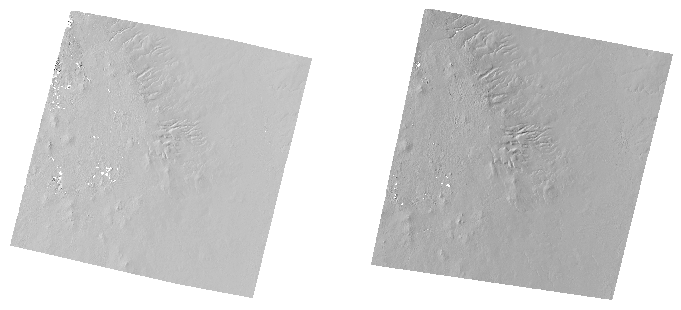

   Hillshades of the two stereo DEMs: the near-nadir plus east-look pair (left)
   and the near-nadir plus west-look pair (right). Both resolve the volcanic
   cones and drainage of the Harrat field.

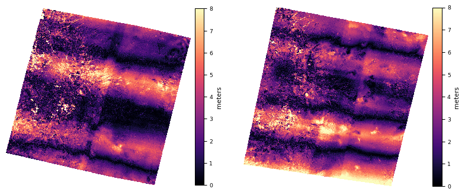

   Triangulation error (:numref:`triangulation_error`) for the two pairs, 0 to 8
   meters, at the same left and right order as above. The median is about 2.5
   meters, a quarter of the ground sample distance. The faint along-track banding
   is residual low-frequency attitude, discussed below.

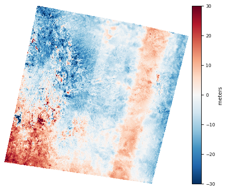

   The first DEM minus the second, clamped to plus or minus 30 meters. The
   west-to-east gradient is the residual low-frequency attitude tilt: the two
   opposite-side looks lean in opposite directions, so it largely cancels in the
   mosaic.

Alignment to a reference DEM
~~~~~~~~~~~~~~~~~~~~~~~~~~~~

A bundle adjustment without ground control leaves an absolute offset, so align
to a reference such as Copernicus GLO-30. Convert the reference to heights above
the ellipsoid first (:numref:`conv_to_ellipsoid`), and regrid both DEMs to a
common projection and grid (about 4 times the image ground sample distance) with
``gdalwarp -r cubicspline``.

Align with pc_align (:numref:`pc_align`), then regrid the aligned cloud to a DEM,
reusing the ``proj`` projection defined earlier::

    pc_align                           \
      --max-displacement 1000          \
      --num-iterations 1000            \
      --save-transformed-source-points \
      ref_dem.tif spot_dem.tif         \
      -o align/run

    point2dem                    \
      --t_srs "$proj"            \
      align/run-trans_source.tif \
      -o align/spot_aligned

The same transform can be applied to the cameras, so they move into the reference
frame without re-optimizing anything (:numref:`ba_pc_align`). Because the SPOT DEM
was the second argument to pc_align, the direct transform is used::

    bundle_adjust -t spot                         \
      nadir.tif east.tif west.tif                 \
      nadir.dim east.dim west.dim                 \
      --input-adjustments-prefix ba/run           \
      --initial-transform align/run-transform.txt \
      --apply-initial-transform-only              \
      -o ba_align/run

This writes ``ba_align/run-nadir.adjusted_state.json`` and so on, now in the
reference frame. These aligned cameras are refined once more and then used for the
mapprojected stereo below.

On low-texture terrain the option ``--initial-transform-from-hillshading`` can
lock onto a spurious rotation. If the DEM is already close to the reference, as
after bundle adjustment, plain point-to-plane alignment is more robust. Judge
the result by a hillshade overlay, not by the vertical difference alone
(:numref:`pc_align`).

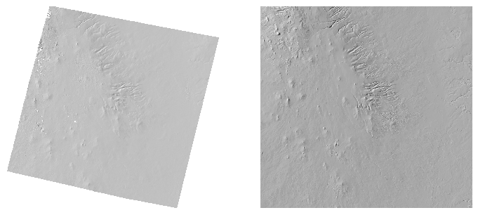

   Hillshade of the aligned SPOT DEM mosaic (left) and the Copernicus GLO-30
   reference (right), on the same projection, grid, and extent. The features
   coincide, which confirms the horizontal registration. The reference extends
   into the corners outside the SPOT footprint.

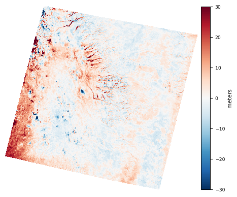

   Aligned SPOT DEM mosaic minus Copernicus, clamped to plus or minus 30 meters.
   The median vertical difference is about 0.5 meter. The residual signal at
   cone and drainage edges is the resolution difference, 10 meter SPOT against 30
   meter Copernicus, not a registration error.

Stereo with mapprojected images
~~~~~~~~~~~~~~~~~~~~~~~~~~~~~~~

The cameras are now aligned to the reference, but the two looks still disagree by
a low-frequency tilt (:numref:`spot14_pairdiff`). One might try to reduce it by
refining the cameras against the reference DEM. Do this with a bundle adjustment
that adds the Copernicus height as a soft constraint (:numref:`heights_from_dem`),
reusing the clean matches from the first adjustment, and also constrain the camera
positions (:numref:`ba_cam_constraints`): the height constraint alone leaves the
linescan position-attitude ambiguity free, so a near-nadir camera can drift along
its trajectory and misregister the later mapprojection. Then mapproject onto the
reference and redo stereo. As it turns out, this barely changes the tilt, because
the disagreement is a relative attitude error between the two looks, which a height
constraint cannot correct.

::

    bundle_adjust -t spot                     \
      nadir.tif east.tif west.tif             \
      nadir.dim east.dim west.dim             \
      --input-adjustments-prefix ba_align/run \
      --clean-match-files-prefix ba/run       \
      --heights-from-dem ref_dem.tif          \
      --heights-from-dem-uncertainty 30       \
      --camera-position-uncertainty 100,100   \
      -o ba_htdem/run

Mapproject both scenes at the native 10 meter resolution onto a smoothed copy of
the reference (:numref:`dem_mosaic`), using the refined cameras, then correlate
with ``--alignment-method none`` (:numref:`mapproj-example`), which handles steep
and low-texture terrain better::

    dem_mosaic --dem-blur-sigma 3 ref_dem.tif -o ref_blur.tif

    mapproject                               \
      --tr 10                                \
      --t_srs "$proj"                        \
      ref_blur.tif nadir.tif                 \
      ba_htdem/run-nadir.adjusted_state.json \
      nadir.map.tif
    mapproject                              \
      --tr 10                               \
      --t_srs "$proj"                       \
      ref_blur.tif east.tif                 \
      ba_htdem/run-east.adjusted_state.json \
      east.map.tif

    parallel_stereo                          \
      --alignment-method none                \
      --stereo-algorithm asp_mgm             \
      --subpixel-mode 9                      \
      nadir.map.tif east.map.tif             \
      ba_htdem/run-nadir.adjusted_state.json \
      ba_htdem/run-east.adjusted_state.json  \
      mp1/run                                \
      ref_blur.tif
    point2dem --errorimage --tr 40 --t_srs "$proj" mp1/run-PC.tif

Repeat for the second pair, then mosaic the two DEMs (:numref:`dem_mosaic`).

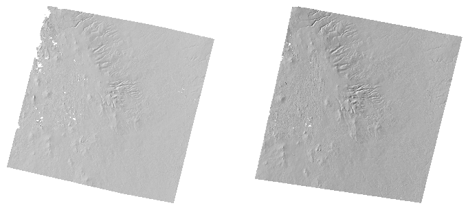

   Hillshades of the two mapprojected-stereo DEMs, near-nadir plus east look
   (left) and near-nadir plus west look (right). Both cover the volcanic field.
   The east-look pair is slightly more ragged at the northwest edge, where its
   oblique geometry is hardest.

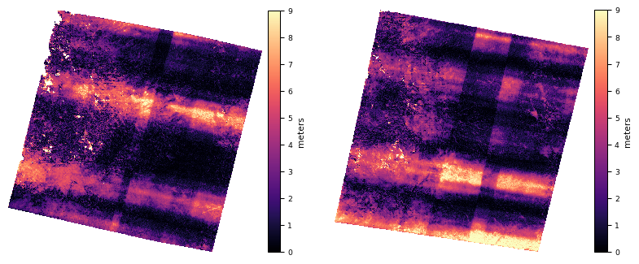

   Triangulation error (:numref:`triangulation_error`) for the two pairs, 0 to 9
   meters, in the same order. The medians are about 1.8 and 2.2 meters. The banding
   is residual low-frequency attitude (jitter): each look's bands run along its own
   scan direction, and the two cross-hatch into the block pattern seen here.

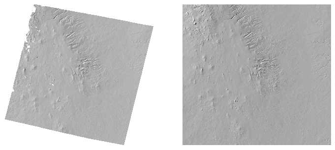

   Hillshade of the mosaicked mapprojected-stereo DEM (left) and the Copernicus
   reference (right), on the same projection, grid, and extent.

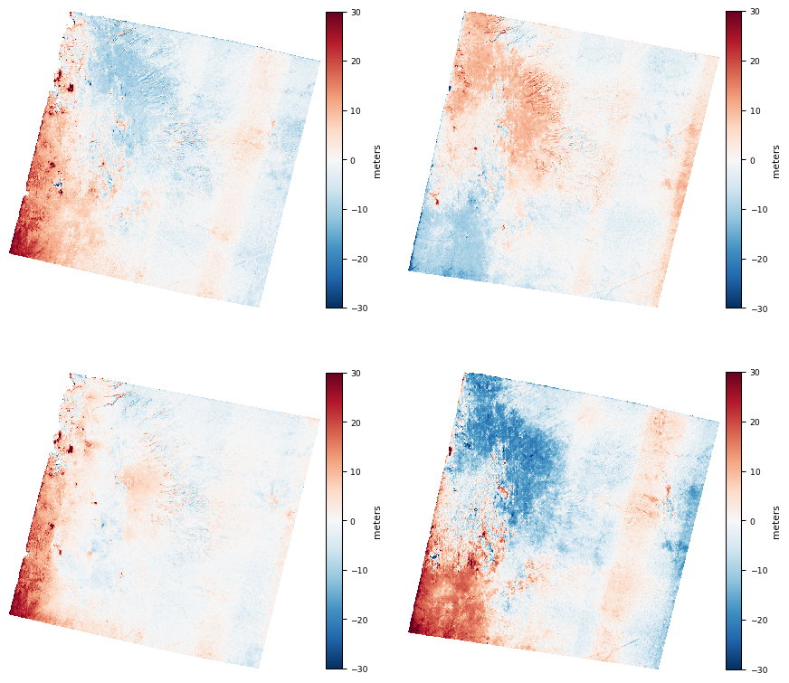

   DEM differences, plus or minus 30 meters. Top row: east-look pair and west-look
   pair minus Copernicus. Bottom row: the mosaic of the two DEMs minus Copernicus,
   and the first DEM minus the second. The west-look pair and the first-minus-second
   difference show a west-to-east tilt. The mosaic is much tighter, since the
   opposite-side tilts largely cancel.

The height constraint does tighten the absolute elevation: the mosaic matches
Copernicus to a median near zero, about 0.1 meter (:numref:`spot14_map_diffs`), and
since both looks cover the field, the opposite-side tilts largely cancel there. The
relative tilt itself remains, about 1.7 meters across the scene
(:numref:`spot14_map_diffs`); reducing it needs a jitter solve
(:numref:`jitter_solve`).

Solving for jitter
~~~~~~~~~~~~~~~~~~

The banding in the triangulation error and the tilt between the two looks both
come from attitude that varies faster than the two metadata samples can capture.
To model this finer variation, solve for jitter (:numref:`jitter_solve`): it
refines the attitude along the track, using dense interest points and the
reference DEM as constraints.

First create dense matches from disparity (:numref:`jitter_ip`) for each pair. Use
``--num-matches-from-disparity`` with ``--subpixel-mode 1``, which keeps the
matches sharp. Mode 9 gives a smoother DEM but smears them::

    parallel_stereo                          \
      --alignment-method none                \
      --stereo-algorithm asp_mgm             \
      --subpixel-mode 1                      \
      --num-matches-from-disparity 20000     \
      nadir.map.tif east.map.tif             \
      ba_htdem/run-nadir.adjusted_state.json \
      ba_htdem/run-east.adjusted_state.json  \
      dense_pair1/run                        \
      ref_blur.tif

Repeat for the second pair, writing to ``dense_pair2``. The matches are between the
raw images, even though stereo used the mapprojected ones. Collect both pairs'
match files under one prefix::

    mkdir -p dense
    cp dense_pair1/run-disp-nadir__east.match dense/
    cp dense_pair2/run-disp-nadir__west.match dense/

Solve for jitter. Pass the raw images and the latest cameras, the dense matches,
and constrain against Copernicus with a height term and with anchor points. The
images are 6000 lines tall, so ``--num-lines-per-orientation 600`` gives about ten
orientation samples along the track::

    jitter_solve                             \
      nadir.tif east.tif west.tif            \
      ba_htdem/run-nadir.adjusted_state.json \
      ba_htdem/run-east.adjusted_state.json  \
      ba_htdem/run-west.adjusted_state.json  \
      --match-files-prefix dense/run-disp    \
      --num-lines-per-position    600        \
      --num-lines-per-orientation 600        \
      --max-pairwise-matches 100000          \
      --camera-position-uncertainty 100,100  \
      --heights-from-dem ref_dem.tif         \
      --heights-from-dem-uncertainty 30      \
      --anchor-dem ref_dem.tif               \
      --num-anchor-points 5000               \
      --anchor-dem-uncertainty 50            \
      --tri-weight 0.1                       \
      --num-iterations 100                   \
      -o jitter/run

The anchor points tie the cameras to the reference DEM away from the match points.
They supply the low-frequency control that the two-look geometry lacks, so the
solver can separate the attitude error from the terrain.

Re-mapproject the three images with the solved cameras and redo stereo as in the
previous section, this time with ``--subpixel-mode 9``, then remake the DEMs. The
jitter solve lowers the triangulation error, which makes the default outlier cutoff
in ``point2dem`` tight; pass ``--remove-outliers-params 95 5`` (:numref:`point2dem`)
so it does not clip valid points at the edges.

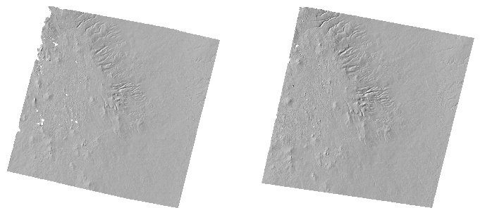

   Hillshades of the two mapprojected-stereo DEMs after the jitter solve, near-nadir
   plus east look (left) and near-nadir plus west look (right).

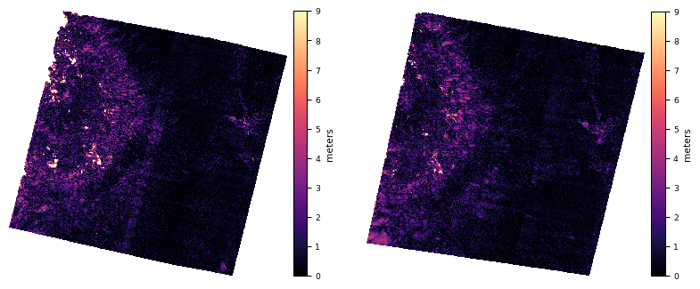

   Triangulation error after the jitter solve, east-look pair (left) and west-look
   pair (right), 0 to 9 meters, at the same scale as :numref:`spot14_map_trierr`.
   The along-track banding is gone and the median drops from about 2 meters to 0.5
   meter.

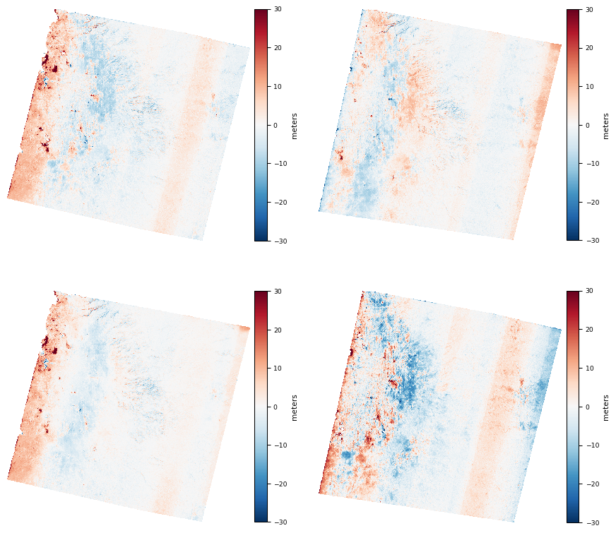

   DEM differences after the jitter solve, plus or minus 30 meters, in the same
   layout as :numref:`spot14_map_diffs`. Top row: east-look pair and west-look pair
   minus Copernicus. Bottom row: the mosaic of the two DEMs minus Copernicus, and
   the first DEM minus the second. The tilt and the west-to-east gradient largely
   flatten.

The improvement is large. The triangulation error drops from about 2 meters to
0.5 meter, and its banding disappears (:numref:`spot14_jitter_te`). The tilt
between the two looks falls from about 1.7 meters to 0.5 meter
(:numref:`spot14_jitter_dr`), while the mosaic stays centered on Copernicus.

Results and accuracy
~~~~~~~~~~~~~~~~~~~~

For the Badia pairs, bundle adjustment reduced the median reprojection error
from about 14 pixels to 0.26 pixel (:numref:`spot14_ba_resid`). Each DEM had a
triangulation error of about 0.25 of the ground sample distance
(:numref:`spot14_trierr`). After alignment, the median vertical difference to
Copernicus was about 0.5 meter (:numref:`spot14_ref_dz`).

A low-frequency tilt between the two looks comes from SPOT 1-4 carrying only two
absolute attitude samples (:numref:`spot14_pairdiff`). The jitter solve
(:numref:`jitter_solve`) removes most of it: the triangulation error drops to about
0.5 meter and the tilt to about 0.5 meter (:numref:`spot14_jitter_te`), with anchor
points against the reference DEM supplying the missing low-frequency control.

CCD corrections
~~~~~~~~~~~~~~~

SPOT 2 and SPOT 4 have known detector-to-detector misregistration on the HRV1
instrument that appears as faint striping. If a stereo pair from these
instruments shows striping in the triangulation error or the DEM, it should be
corrected before stereo. Panchromatic scenes from other SPOT 1-4 instruments in
this archive show little striping and can be used directly.

.. _spot_multi:

Multispectral data
~~~~~~~~~~~~~~~~~~

SPOT 4 carries the HRVIR instrument, whose multispectral products have four bands
(green, red, near-infrared, and shortwave-infrared) at 20 meters, in addition to
the 10 meter panchromatic band. SPOT 1 to 3 carry HRV, whose multispectral
products have three bands (green, red, and near-infrared) at 20 meters.

All bands of a scene share the same look geometry, so one camera model applies to
every band. ASP reads the camera from a multispectral DIMAP scene the same way as
from a panchromatic one, and ``cam_test`` (:numref:`cam_test`) round-trips to a
small fraction of a pixel.

``parallel_stereo`` processes one band at a time. By default it uses the first
band; to select another, pass ``--band <num>`` (:numref:`stereodefault`), with
the index starting at 1. The camera is the same regardless of the band.

The panchromatic band has twice the resolution of the multispectral bands, so
prefer the panchromatic product for stereo when it is available.

