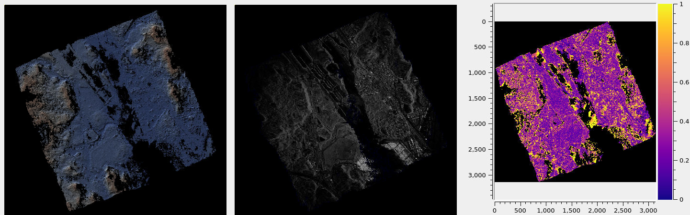

.. _umbra_sar:

Umbra SAR
---------

Here we describe processing Synthetic Aperture Radar (SAR) images for Earth
produced by `Umbra <https://help.umbra.space/product-guide>`_. A SAR example for
the Moon is in :numref:`csm_minirf`.

Overview
~~~~~~~~

Umbra images are acquired in `Spotlight mode
<https://help.umbra.space/product-guide/umbra-products>`_.

SAR image appearance can vary drastically depending on the perspective. It is
important to choose images that are acquired close in time and have similar
viewing angles. The latter is measured by the provided incidence and azimuth
angles. Another measure is the squint angle.

If the stereo convergence angle (:numref:`stereo_pairs`) is too small, the
produced terrain model may not be accurate. For the example below, this angle is
5.8 degrees (as printed by both ``parallel_stereo`` and ``bundle_adjust``). This
angle correlates well with the larger of the discrepancy in azimuth and
incidence angles between the images. We obtained acceptable results even with
convergence angles as low as 2.5 degrees.

Umbra provides GEC images that are corrected to be relative to an ellipsoid. More
raw products are available, including SICD, that have complex-valued pixels. 

GEC images come with RPC (:numref:`rpc`) camera models embedded in the images,
that we employ. ASP does not support the more rigorous SAR sensor models.

Example
~~~~~~~

   From left to right: hillshaded-terrain model, mapprojected
   (:numref:`mapproject`) SAR image, and triangulation error image
   (:numref:`triangulation_error`). The units in the colorbar on the right are
   in meters.

We downloaded the image pair::

  2024-02-01-03-28-13_UMBRA-06_GEC.tif
  2024-04-03-14-53-17_UMBRA-04_GEC.tif

showing a portion of the Panama Canal. Many other `Umbra datasets
<https://registry.opendata.aws/umbra-open-data/>`_ are available.

To make the notation shorter, we call these ``left.tif`` and ``right.tif``.

It was helpful to run bundle adjustment first (:numref:`bundle_adjust`), to make
the images more self-consistent and reduce the triangulation error
(:numref:`triangulation_error`).

It is suggested to run bundle adjustment based on mapprojected images
(:numref:`mapip`). Mapprojection should be done at the effective ground sample
distance (GSD), not nominal GSD, which can be so fine that the images may be noisy
at that level. How to find the effective resolution may require some inspection
and/or reading vendor's documentation.

The mapprojection step is as follows::

    proj="+proj=utm +zone=17 +ellps=WGS84 +units=m +no_defs"
    mapproject        \
      --tr 0.5        \
      --t_srs "$proj" \
      ref.tif         \
      left.tif        \
      left_proj.tif
    
and the same for the right image. 

How to find a DEM for mapprojection and how to adjust it to be relative to the
ellipsoid is descried in :numref:`initial_terrain` and
:numref:`conv_to_ellipsoid`. We call that DEM ``ref.tif``.

Then ``bundle_adjust`` was run::

    bundle_adjust -t rpc                       \
      left.tif right.tif                       \
      --remove-outliers-params                 \
        "75.0 3.0 50 50"                       \
      --mapprojected-data                      \
        "left_proj.tif right_proj.tif ref.tif" \
      -o ba/run 

The cameras are embedded in the images, so they are not specified separately.

Alternatively, one can try the SIFT feature detection method
(``--ip-detect-method 1``) rather the the default (method 0). One may also
search for more interest point matches with an option such as ``--ip-per-tile``.
SAR images can be noisy and features hard to find. More features may not always
result in more matches if they are inaccurate.

How to create new RPC cameras that incorporate the adjustments is discussed in
:numref:`rpc_and_ba`. The default solution is to create external ``.adjust``
files that are passed to ``parallel_stereo`` via ``--bundle-adjust-prefix``, as
below.

More details on the ``bundle_adjust`` options are in :numref:`ba_options`.

Next, ``parallel_stereo`` (:numref:`parallel_stereo`) was run. Mapprojecting the
images first, at the effective GSD, not the finer nominal one, as before, is
recommended (:numref:`mapproj-example`).

::

    parallel_stereo -t rpc          \
      --bundle-adjust-prefix ba/run \
      --stereo-algorithm asp_mgm    \
      --nodes-list machines.txt     \
      left_proj.tif right_proj.tif  \
      stereo/run                    \
      ref.tif 

The ``asp_mgm`` algorithm worked much better than the default ``asp_bm``
(:numref:`stereo_alg_overview`).

A terrain model was produced with ``point2dem`` (:numref:`point2dem`),
in a local UTM projection (:numref:`point2dem_proj`)::

    point2dem            \
      --auto-proj-center \
      --t_srs "$proj"    \
      --errorimage       \
      --tr 2.0           \
      stereo/run-PC.tif

It is suggested to compare the resulting terrain with the prior reference
terrain in ``ref.tif``.

The ASP-created DEM was aligned to the reference DEM with ``pc_align``
(:numref:`pc_align`)::

    pc_align                                  \
      --max-displacement 300                  \
      --save-inv-transformed-reference-points \
      stereo/run-DEM.tif ref.tif              \
      -o align/run

A good value for the ``--max-displacement`` option is perhaps 1.5 times the mean
elevation difference between the two input DEMs, that can be found with
``geodiff`` (:numref:`geodiff`)  and ``gdalinfo -stats``.

The transformed cloud can be gridded back to a DEM as::

  point2dem --tr 2.0 \
    --t_srs "$proj"  \
    align/run-trans_reference.tif
    
Here, the projection string in ``$proj`` can be the same as for the DEM created earlier
(the ``gdalinfo -proj4`` command invoked on that DEM can print it). 

The ``geodiff`` program can take the difference of the now-aligned DEMs.
Other inspections can be done as discussed in :numref:`visualising`.
