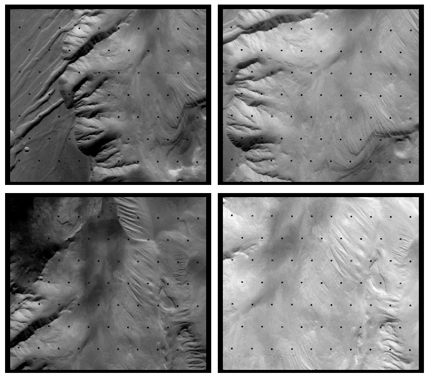
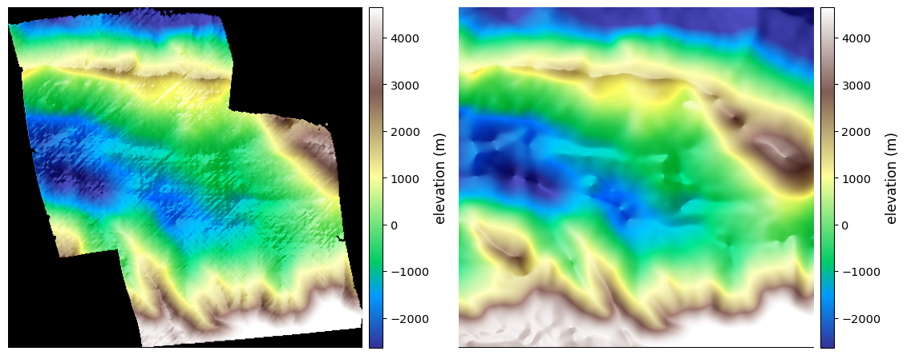
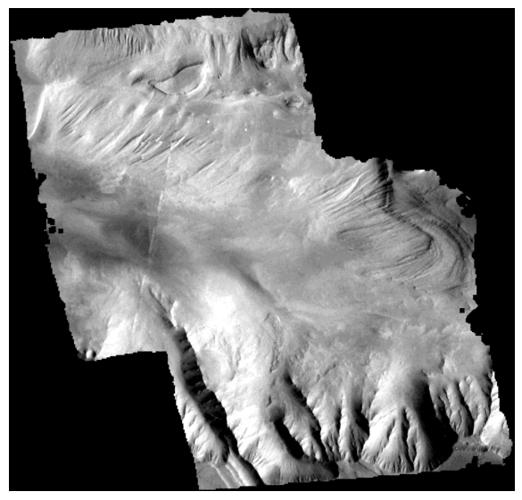

.. _viking:

Viking Orbiter
--------------

This example shows how to build a digital elevation model (DEM) mosaic of the
Ophir and Candor Chasma region of Valles Marineris, on Mars, from Viking Orbiter
1 frames, and how to align it to a global reference.

The Viking Orbiter Visual Imaging Subsystem (VIS) cameras are 1970s vidicon frame
cameras. They are low-contrast, have strong non-radial lens distortion, and carry
a grid of reseau (fiducial) marks. These make ingestion, camera modeling, and
interest-point matching more delicate than for modern sensors, so each step is
discussed in some detail.

Choosing a site and frames
~~~~~~~~~~~~~~~~~~~~~~~~~~

Viking Orbiter experimental data records (EDRs) can be searched with the Orbital
Data Explorer (ODE) or the PDS Imaging Atlas. For a stereo DEM, choose frames
that overlap, have a good convergence angle (:numref:`ba_conv_angle`), and, most
importantly, *similar illumination*.

This example uses four Viking Orbiter 1 frames acquired within one day, in
December 1978, over the same area: ``f912a14``, ``f912a57`` (orbit 912) and
``f913a15``, ``f913a56`` (orbit 913), from VIS cameras A and B. Their Sun angles
match, so they cross-correlate well.

Frames of the same area from a different season (for example the August 1977
orbits 427 and 428) have very different shadows, and mixing them with the
December frames yields no usable matches. A separate DEM could be made from 
these, and the resulting DEMs could be coregistered and merged.

Fetching and preparing the data
~~~~~~~~~~~~~~~~~~~~~~~~~~~~~~~

The frames are distributed as Huffman-compressed PDS images (``.imq``). Download
them from the PDS Imaging node. The download URL for each product is listed by
ODE; use ``curl -L`` (the server issues redirects)::

    base=https://pds-imaging.jpl.nasa.gov/data/viking_orbiter/vo_1031
    for id in f912a14 f912a57 f913a15 f913a56; do
      orbit=${id%a*}
      curl -L "$base/${orbit}axx/$id.imq" -o $id.imq
    done

The volume (``vo_1031`` here) and the ``f<orbit>axx`` subdirectory depend on the
orbit. The exact URL for each product is given by the PDS Imaging node ODE search.

Decompress each frame with ``vdcomp`` (shipped with ISIS), then ingest,
calibrate, and clean it. This needs the ``viking1`` ISIS data area and the
mission kernels, fetched with ``downloadIsisData`` under ``$ISISDATA``
(:numref:`planetary_images`). 

Example for one frame::

    vdcomp f912a14.imq f912a14.img
    vik2isis from = f912a14.img  to = f912a14.lev0.cub
    spiceinit from = f912a14.lev0.cub
    vikcal from = f912a14.lev0.cub to = f912a14.cal.cub
    findrx from = f912a14.cal.cub
    vikclean from = f912a14.cal.cub to = f912a14.cub

Here ``vikcal`` applies the radiometric calibration, ``findrx`` locates the
reseau marks, and ``vikclean`` runs the full Level 1 cleanup: removal of salt and
pepper noise, reseaus and tracks, and butterfly artifacts. Repeat for each frame.

Additional preprocessing
~~~~~~~~~~~~~~~~~~~~~~~~

The calibration and reseau removal leave a few percent of pixels with
out-of-range float values: a checkered pattern at the reseau nodes and scattered
vidicon speckle. These pollute both interest-point matching and stereo
correlation, so remove them in two steps.

First, null the pixels outside the valid terrain band with ISIS ``specpix``. The
terrain sits in a narrow band (roughly 0.09 to 0.16); values below 0.02 or above
0.30 are sent to Lrs and Hrs, which are treated as no-data::

    specpix                     \
      from   = f912a14.cub      \
      to     = f912a14.mask.cub \
      LRSMIN = -1.0             \
      LRSMAX = 0.02             \
      HRSMIN = 0.30             \
      HRSMAX = 100.0

Second, clamp the values to the terrain band with ``image_calc``
(:numref:`image_calc`), which also writes a plain TIFF. This caps the few percent
of pixels above and below the band, including saturated speckle::

    image_calc -c 'max(min(var_0, 0.16), 0.07)' f912a14.mask.cub -o f912a14_clamp.tif

These values may differ for other images. These could likely be relaxed somewhat, as
the heavy lifting is done by the median filter step below.

Third, denoise and infill with a median filter. What remains is salt-and-pepper
speckle and scattered no-data from the reseau removal, and this is what most
misleads ``asp_mgm`` correlation: it looks minor zoomed out but trips up the dense
matcher up close. A 3 by 3 median that replaces a pixel by the median of its
window when at least 6 of the 9 pixels are valid removes the speckle and fills the
small holes, while leaving clean terrain nearly unchanged::

    image_calc --median-filter '3 6' f912a14_clamp.tif -o f912a14.tif

Both steps handle ISIS special pixels correctly (they are masked using the cube's
valid range), so they can be run on the cube directly. Repeat all steps for each
frame. Denoising is the single biggest lever on this data: it roughly halves the
final DEM error against the reference.

The reseau grid sits at a fixed detector location, so in ground coordinates it
falls at a different place in each frame and is filled from neighboring frames
when the DEMs are mosaicked.

   The four cleaned and clamped frames, stretched to a pixel value range of 0.09
   to 0.16. Top row: ``f912a14`` and ``f912a57`` (orbit 912). Bottom row:
   ``f913a15`` and ``f913a56`` (orbit 913). The no-data holes are the masked
   reseau grid and speckle; they fall at different ground locations in each frame
   and are filled from neighboring frames in the mosaic.

.. _viking_ref_dem:

The reference DEM
~~~~~~~~~~~~~~~~~

A global reference DEM is used for the camera distortion refit below, for
mapprojection, and for final alignment. The `USGS HRSC/MOLA blended DEM
<https://planetarymaps.usgs.gov/mosaic/Mars/HRSC_MOLA_Blend/>`_ is a good choice,
being gap-free and global at 200 m/pixel.

Set the URL for the remote DEM location::

    url=https://planetarymaps.usgs.gov/mosaic/Mars/HRSC_MOLA_Blend/Mars_HRSC_MOLA_BlendDEM_Global_200mp_v2.tif

Crop the region of interest directly over the network with ``gdal_translate``
and ``/vsicurl`` (the global file is large)::

    gdal_translate            \
      -projwin -74 -4 -68 -10 \
      -co COMPRESS=DEFLATE    \
      /vsicurl/$url           \
      ref.tif

.. _viking_refit:

Camera models
~~~~~~~~~~~~~

The Viking lens distoortion is a custom so and so (claude please fill in) which does not handle
well extrapolation beyond image frame, which resutls in mapprojection arrtiafacts.

To handle this, build a CSM (:numref:`csm`) Frame camera (:numref:`csm_frame`)
that fits the ``transverse`` lens distortion model (:numref:`csm_frame_def`),
while keeping the reset of the camera parameters. 

This requires the 2026-07-27 ASP build or later (:numref:`release`)::

    cam_gen f912a14.cub              \
      --input-camera f912a14.cub     \
      --reference-dem ref.tif        \
      --csm-refit-distortion         \
      --distortion-type transverse   \
      --refine-intrinsics distortion \
      -o f912a14.json

The resulting camera model reproduces the ISIS camera to a few tenths of a
pixel, (which is better than if one tries a radial-tangential model, that leaves
a residual of about 2 pixels. Validate the agreement with ``cam_test``
(:numref:`cam_test`).

Do the same for each frame. The fitted distortion is nearly identical for all
cameras of the same VIS camera type (A or B), as expected.

Bundle adjustment
~~~~~~~~~~~~~~~~~

Interest-point matching requires some custom settings for this sensor. 

Set ``--ip-nodata-radius 0`` to reduce the effct of various nodata regions
that are obtained after removing the resaaue marks and specke.

Use the AKAZE interest point method (``--ip-detect-method 3``,
:numref:`stereodefault-pprc`).

Build the image and camera lists in the same loop, so they stay in the *same
order* (do not use ``ls``, which sorts the names)::

    rm -f images.txt cameras.txt
    for id in f912a14 f912a57 f913a15 f913a56; do
      echo ${id}.tif >> images.txt
      echo ${id}.json      >> cameras.txt
    done

Then run ``bundle_adjust`` (:numref:`bundle_adjust`)::

    bundle_adjust                             \
      --image-list images.txt                 \
      --camera-list cameras.txt               \
      --camera-position-uncertainty 1000,1000 \
      --datum D_MARS                          \
      --ip-per-tile 10000                     \
      --matches-per-tile 5000                 \
      --ip-detect-method 3                    \
      --ip-nodata-radius 0                    \
      --individually-normalize                \
      --num-iterations 100                    \
      --min-matches 1                         \
      -o ba/run

This writes camera files with names like ``ba/run-f912a14.adjusted_state.json``,
that are passed to stereo below.

Stereo and mosaicking
~~~~~~~~~~~~~~~~~~~~~

Stereo is done in two passes. The first pass creates a mosaicked terrain model.
This product is aligned to a reference terrain, and the alignemntks applied to
the caemras. Then stereo is redone. The second stereo pass uses mapprojected
images, but the first does not, as such images can only be employed after the
cameras are aligned to the reference DEM to mapprooect onto.

Of the six possible pairs from four frames, use the four with a convergence angle
(:numref:`ba_conv_angle`) above 20 degrees. Each frame then appears in two pairs.

Fix one local stereographic projection up front and pass it to every ``point2dem``
(and ``mapproject``) call below, so all the DEMs are created on the same grid.
Otherwise each DEM auto-computes its own projection (:numref:`point2dem_proj`).

::

    proj='+proj=stere +lat_0=-7.1 +lon_0=-70.4 +R=3396190 +units=m'

First pass. For each pair, run stereo (:numref:`parallel_stereo`) with the
bundle-adjusted camera files (passed explicitly) and
``--alignment-method affineepipolar``, with no mapprojection, then make a DEM::

    parallel_stereo                        \
      f912a14.tif f912a57.tif              \
      ba/run-f912a14.adjusted_state.json   \
      ba/run-f912a57.adjusted_state.json   \
      st1_912/run                          \
      --alignment-method affineepipolar    \
      --stereo-algorithm asp_mgm           \
      --subpixel-mode 9

    point2dem --t_srs "$proj" --tr 200 st1_912/run-PC.tif 

This is repeated for each pair with a good convergence angle and good overlap.

Combine the DEMs with ``dem_mosaic`` (:numref:`dem_mosaic`) into
``dem_mosaic_pass1.tif``. Align this mosaic to the reference with ``pc_align``
(:numref:`pc_align`). Because the Viking DEM is a small dense patch inside the
large coarse reference, the Viking DEM is the *source* and the reference is the
first argument. The raw pointing can be off by more than 10 km, so use a large
``--max-displacement``::

    pc_align                   \
      --max-displacement 25000 \
      --datum D_MARS           \
      ref.tif                  \
      dem_mosaic_pass1.tif     \
      -o al/run

Apply the resulting transform to the cameras, so they move into the reference
coordinate system. This does not re-optimize anything; it only applies the rigid
transform (:numref:`ba_pc_align`)::

    bundle_adjust                              \
      --image-list images.txt                  \
      --camera-list cameras.txt                \
      --initial-transform al/run-transform.txt \
      --apply-initial-transform-only           \
      -o cams/run

This writes ``cams/run-f912a14.adjusted_state.json`` and so on, now in the
reference frame.

Second pass is stereo wtih maprpojected iamges (:numref:`mapproj-example`), that improves
the quality of DEMs for steep terrain. The cameras are now aligned, so mapprojection for stereo is
meaningful. 

Mapproject each frame at full resolution with a common projection (needed so the
left and right images share one grid), then correlate with ``--alignment-method
none``::

    for id in f912a14 f912a57 f913a15 f913a56; do
      mapproject                         \
        ref.tif                          \
        ${id}.tif                        \
        cams/run-$id.adjusted_state.json \
        $id.map.tif                      \
        --t_srs "$proj"                  \
        --tr 50
    done

    parallel_stereo                          \
      f912a14.map.tif                        \
      f912a57.map.tif                        \
      cams/run-f912a14.adjusted_state.json   \
      cams/run-f912a57.adjusted_state.json   \
      st2_912/run                            \
      ref.tif                                \
      --alignment-method none                \
      --stereo-algorithm asp_mgm             \
      --subpixel-mode 9                      \
      --ip-per-tile 5000

    point2dem --t_srs "$proj" \
      --tr 200                \
      --errorimage            \
      st2_912/run-PC.tif 

Produce each DEM at about four times the image ground sample distance (roughly
200 m). The computed error image (:numref:`point2dem_ortho_err`) is a good predictor
of bundle adjustment accuracy and quality of the lens distortion fit.

Each second-pass pair triangulates a self-consistent surface, but a two-view pair
from this weak network can still be tilted or shifted as a whole relative to the
reference; a low triangulation error means the two rays meet, not that the pair is
absolutely correct. 

A single alignment of the merged mosaic cannot remove these per-pair tilts, so
we do not do it here, yet that would be the suggested approach if there images
ahve a lot of overlap and espeically for flat terrain, which is not the case
here. 

So align each second-pass DEM to the reference individually with ``pc_align``
(:numref:`pc_align`), the small dense Viking DEM being the *source* and the
reference the first argument, then combine the aligned DEMs with ``dem_mosaic``
(:numref:`dem_mosaic`)::

    pc_align                           \
      --max-displacement 3000          \
      --datum D_MARS                   \
      --save-transformed-source-points \
      ref.tif                          \
      st2_912/run-DEM.tif              \
      -o al2_912/run

    point2dem --t_srs "$proj"      \
      --tr 200                     \
      al2_912/run-trans_source.tif \
      -o al2_912/dem

Repeat for each pair, then mosaic the aligned DEMs::

    dem_mosaic al2_912/dem-DEM.tif al2_1557/dem-DEM.tif \
      al2_913/dem-DEM.tif al2_5614/dem-DEM.tif -o mosaic.tif

The resulting mosaic agrees with the reference to about 110 m (median absolute
difference), with a median bias of only a few meters, well within the reference's
resolution.

Comparison with the reference
~~~~~~~~~~~~~~~~~~~~~~~~~~~~~

The created DEM mosaic and the reference were gridded, for comparision, ``gdalwarp``,
with the opiton ``-r cubicspline`` to the same extent, grid, and projection. 
These were colorized and hillshaded, such as with ``colormap`` (:numref:`colormap`).

   Colorized hillshade on a common elevation range and identical grid. Left: the
   Viking four-pair DEM mosaic. Right: the HRSC/MOLA reference regridded to the
   same grid. The elevations agree (same color pattern), while the Viking DEM
   resolves considerably more detail than the coarser reference. The elevation
   range was -2889 to 5235 meters.

Orthoimage mosaic
~~~~~~~~~~~~~~~~~

The aligned cameras and the DEM mosaic also yield an orthoimage mosaic.
Mapproject each frame onto the DEM with its aligned camera at the estimated
ground sample distance grid::

    for id in f912a14 f912a57 f913a15 f913a56; do
      mapproject                             \
        mosaic.tif                           \
        $id.tif                              \
        cams/run-$id.adjusted_state.json     \
        $id.ortho.tif                        \
        --t_srs "$proj"                      \
        --tr 50
    done

The vidicon frames differ in overall brightness, which would show as a notable
discontinuity in the mosaic. In this case the orthoimage for ``f912a14`` was
adjsuted by a constant factor to match better the other ones with
``image_calc`` (:numref:`image_calc`). 

Combine the ortho images with ``dem_mosaic --first`` (:numref:`dem_mosaic`),
which keeps the first image at each pixel rather than blending, so a frame
overlap shows a seam rather than a smear::

    dem_mosaic --first f912a14.ortho_eq.tif f912a57.ortho_eq.tif \
      f913a15.ortho_eq.tif f913a56.ortho_eq.tif -o ortho_mosaic.tif

   Orthoimage mosaic of the four frames draped on the Viking DEM (exposure-matched).
