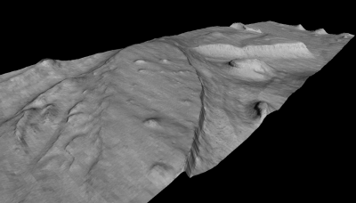

Introduction
============

The NASA Ames Stereo Pipeline (ASP) is a suite of free and open source automated
geodesy and stereogrammetry tools designed for processing images captured from
satellites, around Earth and other planets (:numref:`examples`), robotic rovers
(:numref:`rig_msl`, :numref:`csm_msl`), aerial cameras (:numref:`sfm`), low-cost
satellites (:numref:`skysat`), and historical images (:numref:`kh4`).

ASP supports a wide range of camera models, including linescan, frame, pushframe
(:numref:`cassis`), optical bar, RPC, and the USGS Community Sensor Model
(:numref:`csm`). It can create cameras from scratch and refine them with bundle
adjustment (:numref:`bundle_adjust`), solving for pose, jitter
(:numref:`jitter_solve`), lens distortion (:numref:`floatingintrinsics`), and
rig calibration (:numref:`rig_calibrator`).

It has functionality for 3D terrain creation from stereo (:numref:`tutorial`),
including shallow-water bathymetry (:numref:`bathy_intro`), alignment of point
clouds (:numref:`pc_align`), mapprojection (:numref:`mapproject`),
structure-from-motion (:numref:`sfm`), shape-from-shading (:numref:`sfs_usage`),
GCP generation (:numref:`gcp_gen`, :numref:`dem2gcp`), and a versatile GUI shell
(:numref:`stereo_gui`).

ASP produces cartographic products, including digital terrain models (DTMs) and
ortho-projected images (:numref:`builddem`), 3D models (:numref:`point2mesh`),
textured meshes (:numref:`sfm_iss`), and bundle-adjusted networks of cameras
(:numref:`control_network`).

ASP's data products are suitable for science analysis, mission planning, and
public outreach.

   This 3D model was generated from a image pair M01/00115 and E02/01461
   (34.66N, 141.29E). The complete stereo reconstruction process takes
   approximately thirty minutes on a 3.0 GHz workstation for input images of
   this size (1024 |times| 8064 pixels). This model, shown here without vertical
   exaggeration, is roughly 2 km wide in the cross-track dimension. 

Background
----------

ASP is developed by the Intelligent Robotics Group (IRG) at the NASA Ames
Research Center. It builds on more than two decades of planetary 3D surface
reconstruction, first demonstrated on the Mars Pathfinder mission and since
delivered to the :term:`MPL`, :term:`MER`, :term:`MRO`, and :term:`LRO` science
operations teams.

Software foundations
--------------------

NASA Vision Workbench
~~~~~~~~~~~~~~~~~~~~~

The Stereo Pipeline is built upon the Vision Workbench software which is a
general purpose image processing and computer vision library also developed by
the IRG. Some of the tools discussed in this document are actually Vision
Workbench programs, and any distribution of the Stereo Pipeline requires the
Vision Workbench. This distinction is important only if compiling this software.

The USGS Integrated Software for Imagers and Spectrometers
~~~~~~~~~~~~~~~~~~~~~~~~~~~~~~~~~~~~~~~~~~~~~~~~~~~~~~~~~~

For processing non-terrestrial NASA satellite images, Stereo Pipeline must be
installed alongside a copy of the Integrated Software for Imagers and
Spectrometers (:term:`ISIS`, :numref:`planetary_images`). ISIS is however not
required for processing terrestrial images (:numref:`dg_tutorial`).

ISIS is widely used in the planetary science community for processing raw
spacecraft images into high level data products of scientific interest such as
map-projected and mosaicked images
:cite:`2004LPI.35.2039A,1997LPI.28.387G,ISIS_website`.

.. _get-help:

Getting help and reporting bugs
-------------------------------

All bugs, feature requests, and general discussion should be posted on
the ASP support forum:

    https://groups.google.com/forum/#!forum/ames-stereo-pipeline-support

To contact the developers and project manager directly, send an email
to:

    stereo-pipeline-owner@lists.nasa.gov

When you submit a bug report, it may be helpful to attach the logs
output by ``parallel_stereo`` and other tools (:numref:`logging`).

Typographical conventions
-------------------------

Program names and their command line options are shown in a constant-width
font, such as ``parallel_stereo``.

Commands to type in a terminal are shown indented and constant-width. A ``>``
prompt is a regular shell. An ``ISIS>`` prompt is an ISIS-enabled shell
(``ISISROOT`` set and the ISIS startup script sourced)::

    > ls

    ISIS> pds2isis

In a command, ``<value>`` is an argument you supply, ``[ ]`` marks optional
items, ``a|b`` are alternatives, ``( )`` gives a default or note, and a trailing
backslash continues the command on the next line::

    point2dem [-h|--help] [-r moon|mars] [-s <float(default: 0.0)>] \
              [-o <output prefix>] <output prefix>-PC.tif

Citing the Ames Stereo Pipeline
-------------------------------

In general, use this reference:

  Beyer, Ross A., Oleg Alexandrov, and Scott McMichael. 2018. The Ames
  Stereo Pipeline: NASA's open source software for deriving and processing
  terrain data. *Earth and Space Science*, **5**.
  https://doi.org/10.1029/2018EA000409.

If you are using ASP for application to Earth images, or need a
reference which details the quality of output, then we suggest also
referencing:

  Shean, D. E., O. Alexandrov, Z. Moratto, B. E. Smith, I. R. Joughin, C.
  C. Porter, Morin, P. J. 2016. An automated, open-source pipeline for
  mass production of digital elevation models (DEMs) from very
  high-resolution commercial stereo satellite imagery. *ISPRS Journal of
  Photogrammetry and Remote Sensing.* **116**.

In addition to using the references above, in order to help you better
cite the specific version of ASP that you are using in a work, as of ASP
version 2.6.0, we have started using `Zenodo <https://zenodo.org>`__ to
create digital object identifiers (DOIs) for each ASP release. For
example, the DOI for version 2.6.2 is 10.5281/zenodo.3247734, and you
can cite it like this:

  Beyer, Ross A., Oleg Alexandrov, and Scott McMichael. 2019.
  NeoGeographyToolkit/StereoPipeline: Ames Stereo Pipeline version 2.6.2.
  *Zenodo*. `DOI:
  10.5281/zenodo.3247734 <https://doi.org/10.5281/zenodo.3247734>`__.

Of course, every new release of ASP will have its own unique DOI, and
this link should always point to the `latest
DOI <https://doi.org/10.5281/zenodo.598174>`__ for ASP.

If you publish a paper using ASP, please let us know. We'll cite your
work in this document, in :numref:`papersusingasp`.

Warnings to users of the Ames Stereo Pipeline
---------------------------------------------

Ames Stereo Pipeline is a research product. It may have bugs or incomplete
features, and its APIs and command line options may change between releases. Use
it at your own risk.

The algorithms are robust, but the tools have many adjustable parameters, and
even experienced operators can produce poor results. Inspect every product
before relying on it, and watch for errors from poor input data or unsuitable
settings. If you have concerns about a product, contact us (:numref:`get-help`).
We can help improve it, or describe the limitations of the data.

See each release's NEWS file (:numref:`news`) for a summary of recent changes.

.. |times| unicode:: U+00D7 .. MULTIPLICATION SIGN
