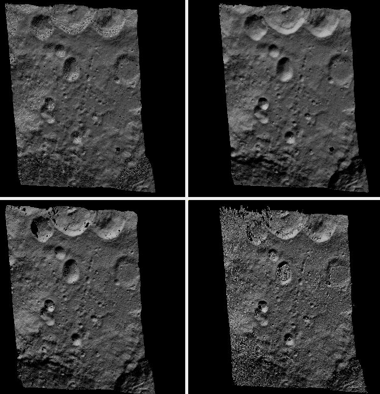

.. _nextsteps:

The next steps
==============

This chapter will discuss in more detail ASP's stereo process and
other tools available to either pre-process the input images/cameras
or to manipulate ``parallel_stereo``'s outputs, both in the context of
planetary ISIS data and for Earth images. This includes how to
customize ``parallel_stereo``'s settings (:numref:`running-stereo`),
use ``point2dem`` to create 3D terrain models (:numref:`visualising`),
visualize the results (:numref:`genhillshade`).

Other topics include bundle adjustment (:numref:`next_steps_ba`), align the
obtained point clouds to another data source (:numref:`pc-align-example`),
perform 3D terrain adjustments in respect to a geoid (:numref:`geoid_adj`),
converted to LAS (:numref:`gen_las`), etc.

It is suggested to read the tutorial (:numref:`tutorial`) before
this chapter.

.. _running-stereo:

Stereo Pipeline in more detail
------------------------------

.. _stereo_alg_overview:

Choice of stereo algorithm
~~~~~~~~~~~~~~~~~~~~~~~~~~

   A DEM produced (from top-left) with the ``asp_bm``, ``asp_mgm``,
   ``libelas``, and ``opencv_sgbm`` stereo algorithms. The ``libelas``
   algorithm is rather fast and the results are of good quality.
   No mapprojection (:numref:`mapproj-example`) was used here.

The most important choice a user has to make when running ASP is the 
stereo algorithm to use. By default, ASP runs as if invoked with::

   parallel_stereo --alignment-method affineepipolar  \
     --stereo-algorithm asp_bm --subpixel-mode 1      \
     <other options>
    
This invokes block-matching stereo with parabola subpixel mode, which
can be fast but not of high quality. Much better results are likely
produced with::

   parallel_stereo                     \
     --alignment-method affineepipolar \
     --stereo-algorithm asp_mgm        \
     --subpixel-mode 9                 \
     <other options>

which uses ASP's implementation of MGM (:numref:`asp_sgm`). Using
``--subpixel-mode 3`` will likely further improve the results, but
will be slower. For best results one can use ``--subpixel-mode 2``,
but that is very slow. Do not use ``--subpixel-mode 1`` with
``asp_mgm``/``asp_sgm`` as that produces artifacts. See
:numref:`subpixel` for more background on some subpixel modes.

For steep terrains *it is strongly suggested to mapproject the images*
(:numref:`mapproj-example`).

ASP also implements *local alignment*, when the input images are split
into tiles (with overlap) and locally aligned. This makes it possible
to use third-party algorithms in addition to the ones ASP implements. 

With ASP's own MGM algorithm, local alignment can be invoked as::

   parallel_stereo                     \
     --alignment-method local_epipolar \
     --stereo-algorithm asp_mgm        \
     --subpixel-mode 9                 \
     <other options>

ASP also ships with the following third-party stereo algorithms:
MGM (original author implementation), OpenCV SGBM, Libelas, MSMW,
MSMW2, and OpenCV BM. For more details see :numref:`stereo_algos`.

For example, the rather solid and reasonably fast Libelas
implementation can be called as::

   parallel_stereo                     \
     --alignment-method local_epipolar \
     --stereo-algorithm libelas        \
     --job-size-h 512 --job-size-w 512 \
     --sgm-collar-size 128             \
     <other options>

Above we used tiles of size 512 pixels with an extra padding of 128 pixels on
each side, for a total size of 768 pixels. Smaller tiles are easier to align
accurately, and also use less memory. The defaults in ``parallel_stereo`` are
double these values, which work well with ASP's MGM which is more conservative
with its use of memory but can be too much for some other implementations.

It is suggested to not specify here ``--subpixel-mode``, in which case
it will use each algorithm's own subpixel implementation. Using
``--subpixel-mode 3`` will refine that result using ASP's subpixel
implementation. Using ``--subpixel-mode 2`` will be much slower but
likely produce even better results.

Next we will discuss more advanced parameters which rarely need to be
set in practice.

.. _settingoptionsinstereodefault:

Setting options in the ``stereo.default`` file
~~~~~~~~~~~~~~~~~~~~~~~~~~~~~~~~~~~~~~~~~~~~~~

The ``parallel_stereo`` program can use a ``stereo.default`` file that
contains settings that affect the stereo reconstruction process.  Its
contents can be altered for your needs; details are found in
:numref:`stereodefault`. You may find it useful to save multiple
versions of the ``stereo.default`` file for various processing
needs. If you do this, be sure to specify the desired settings file by
invoking ``parallel_stereo`` with the ``-s`` option. If this option is
not given, the ``parallel_stereo`` program will search for a file
named ``stereo.default`` in the current working directory. If
``parallel_stereo`` does not find ``stereo.default`` in the current
working directory and no file was given with the ``-s`` option,
``parallel_stereo`` will assume default settings and continue.

An example ``stereo.default`` file is available in the top-level
directory of ASP. The actual file has a lot of comments to show you
what options and values are possible. Here is a trimmed version of the
important values in that file.

::

    alignment-method affineepipolar
    stereo-algorithm asp_bm 
    cost-mode 2
    corr-kernel 21 21
    subpixel-mode 1
    subpixel-kernel 21 21

For the ``asp_sgm`` and ``asp_mgm`` algorithms, the default correlation
kernel size is 5 x 5 rather than 21 x 21.

Note that the ``corr-kernel`` option does not apply to the external
algorithms.  Instead, each algorithm has its own options that need to
be set (:numref:`stereo_algos`).

All these options can be overridden from the command line, as described
in :numref:`cmdline`.

Alignment method
^^^^^^^^^^^^^^^^

For raw images, alignment is always necessary, as the left and right
images are from different perspectives.  Several alignment methods are
supported, including ``local_epipolar``, ``affineepipolar`` and
``homography`` (see :numref:`image_alignment` for details).

Alternatively, stereo can be performed with mapprojected images
(:numref:`mapproj-example`). In effect we take a smooth
low-resolution terrain and map both the left and right raw images onto
that terrain. This automatically brings both images into the same
perspective, and as such, for mapprojected images the alignment method
is always set to ``none``.

.. _stereo_algos:

Stereo algorithms
^^^^^^^^^^^^^^^^^

ASP can invoke several algorithms for doing stereo, some internally
implemented, some collected from the community, and the user can add
their own algorithms as well (:numref:`adding_algos`).

The list of algorithms is as follows. (See :numref:`stereo_algos_full`
for a full discussion.) 

**Algorithms implemented in ASP**

asp_bm (or specify the value '0')
   The ASP implementation of Block Matching. Search in the
   right image for the best match for a small image block in the
   left image. This is the fastest algorithm and works well for
   similar images with good texture coverage. How to set the block
   (kernel) size and subpixel mode is described further down.
   See also :numref:`asp_sgm`.

asp_sgm (or specify the value '1')
   The ASP implementation of the Semi-Global Matching (SGM)
   algorithm :cite:`hirschmuller_sgm_original`. This algorithm is
   slow and has high memory requirements but it performs better in
   images with less texture. See :numref:`asp_sgm` for important
   details on using this algorithm.

asp_mgm (or specify the value '2')
   The ASP implementation of the More Global Matching (MGM)
   variant of the SGM algorithm :cite:`facciolo2015mgm` to reduce
   high frequency artifacts in the output image at the cost of
   increased run time. See :numref:`asp_sgm` for important details on
   using this algorithm.

asp_final_mgm (or specify the value '3')
   Use MGM on the final resolution level and SGM on preceding
   resolution levels. This produces a result somewhere in between
   the pure SGM and MGM options.

**External implementations (shipped with ASP)**

mgm
   The MGM implementation by its authors. See :numref:`original_mgm`.

opencv_sgbm
   Semi-global block-matching algorithm from OpenCV 3. See
   :numref:`opencv_sgbm_options`.

libelas
   The LIBELAS algorithm :cite:`Geiger2010ACCV`. See
   :numref:`libelas`.

msmw and msmw2
   Multi-Scale Multi-Window algorithm (two versions provided). See
   :numref:`msmw`.

opencv_bm
   Classical block-matching algorithm from OpenCV 3. See
   :numref:`opencv_bm`.

Correlation parameters
^^^^^^^^^^^^^^^^^^^^^^

The option ``corr-kernel`` in ``stereo.default`` define what
correlation metric *(normalized cross correlation)* we'll be using and
how big the template or kernel size should be *(21 pixels square)*. A
pixel in the left image will be matched to a pixel in the right image
by comparing the windows of this size centered at them.

Making the kernel sizes smaller, such as 15 |times| 15, or even
11 |times| 11, may improve results on more complex features, such as steep
cliffs, at the expense of perhaps introducing more false matches or
noise.

These options only to the algorithms implemented in ASP (those whose
name is prefixed with ``asp_``). For externally implemented
algorithms, any options to them can be passed as part of the
``stereo-algorithm`` field, as discussed in
:numref:`stereo_algos_full`.

Subpixel refinement parameters
^^^^^^^^^^^^^^^^^^^^^^^^^^^^^^

A highly critical parameter in ASP is the value of
``subpixel-mode``. When set to 1, ``parallel_stereo`` performs
parabola subpixel refinement, which is very fast but not very
accurate. When set to 2, it produces very accurate results, but it is
about an order of magnitude slower. When set to 3, the accuracy and
speed will be somewhere in between the other methods.

For the algorithms not implemented in ASP itself, not specifying this
field will result in each algorithm using its own subpixel mode.

The option ``subpixel-kernel`` sets the kernel size to use during
subpixel refinement *(also 21 pixels square)*.

.. _search_range2:

Search range determination
^^^^^^^^^^^^^^^^^^^^^^^^^^

ASP will attempt to work out the minimum and maximum disparity it will search
for automatically. The search range can be explicitly set with a command-line
option such as::

    --corr-search -80 -2 20 2

These four integers define the minimum horizontal and vertical disparity and
then the maximum horizontal and vertical disparity (:numref:`corr_section`).

The search range can be tightened with the option ``--max-disp-spread``
before full-image resolution happens.

It is suggested that these settings be used only if the run-time is
high or the inputs are difficult. For more details see
:numref:`search_range`. The inner working of stereo correlation can be
found in :numref:`correlation`.

.. _perform-stereo:

Performing stereo correlation
~~~~~~~~~~~~~~~~~~~~~~~~~~~~~

.. figure:: images/p19-stereo-output_400px.png
   :name: p19-stereo-output
   :alt:  Outputs of the ``parallel_stereo`` program.

   These are the four viewable ``.tif`` files
   created by the ``parallel_stereo`` program. On the left are the two aligned,
   pre-processed images: (``results/output-L.tif`` and
   ``results/output-R.tif``). The next two are mask images
   (``results/output-lMask.tif`` and ``results/output-rMask.tif``),
   which indicate which pixels in the aligned images are good to use in
   stereo correlation. The image on the right is the "Good Pixel map",
   (``results/output-GoodPixelMap.tif``), which indicates (in gray)
   which were successfully matched with the correlator, and (in red)
   those that were not matched.

As already mentioned, the ``parallel_stereo`` program can be invoked for ISIS
images as::

     ISIS> parallel_stereo left_image.cub right_image.cub \
               -s stereo.default results/output

For DigitalGlobe/Maxar images the cameras need to be specified separately::

    parallel_stereo left.tif right.tif left.xml right.xml \
      -s stereo.default results/output

The string ``results/output`` is arbitrary, and in this case we will
simply make all outputs go to the ``results`` directory.

When ``parallel_stereo`` finishes, it will have produced a point cloud image.
:numref:`visualising` describes how to convert it to a digital
elevation model (DEM) or other formats.

The ``parallel_stereo`` program can be used purely for computing the
correlation (disparity) of two images, without cameras
(:numref:`correlator-mode`). 

The quality of correlation can be evaluated with the ``corr_eval``
program (:numref:`corr_eval`).

The ``parallel_stereo`` command can also take multiple input images,
performing multi-view stereo (:numref:`multiview`), though this
approach is rather discouraged as better results can be obtained with
bundle adjustment followed by pairwise stereo and merging of DEMs with
``dem_mosaic`` (:numref:`dem_mosaic`).

Running the GUI frontend
~~~~~~~~~~~~~~~~~~~~~~~~

The ``stereo_gui`` program (:numref:`stereo_gui`) is a GUI frontend to
``parallel_stereo``. It is invoked with the same options as ``parallel_stereo``
(except for the more specialized ones such as ``--job-size-h``, etc.). It
displays the input images, and makes it possible to zoom in and select smaller
regions to run stereo on. 

.. _cmdline:

Specifying settings on the command line
~~~~~~~~~~~~~~~~~~~~~~~~~~~~~~~~~~~~~~~

All the settings given via the ``stereo.default`` file can be
over-ridden from the command line. Just add a double hyphen (``--``) in
front the option's name and then fill out the option just as you would
in the configuration file. For options in the ``stereo.default`` file
that take multiple numbers, they must be separated by spaces (like
``corr-kernel 25 25``) on the command line. Here is an example in
which we override the search range and subpixel mode from the command
line.

::

     ISIS> parallel_stereo E0201461.map.cub M0100115.map.cub \
               -s stereo.map --corr-search -70 -4 40 4       \
               --subpixel-mode 3 results/output

Stereo on multiple machines
~~~~~~~~~~~~~~~~~~~~~~~~~~~

If the input images are really large it may desirable to distribute
the work over several computing nodes. For that, the ``--nodes-list``
option of ``parallel_stereo`` must be used. See
:numref:`pbs_slurm`.

.. _mapproj-example:

Stereo with mapprojected images
~~~~~~~~~~~~~~~~~~~~~~~~~~~~~~~

The way stereo correlation works is by matching a neighborhood of each
pixel in the left image to a similar neighborhood in the right image.
This matching process can fail or become unreliable if the two images
are too different, which can happen for example if the perspectives of
the two cameras are very different, the underlying terrain has steep
portions, or because of clouds and deep shadows. This can result in
large disparity search ranges, long run times, and ASP producing
3D terrains with noise or missing data.

ASP can mitigate this by *mapprojecting* the left and right images onto
some pre-existing low-resolution smooth terrain model without holes, and
using the output images to do stereo. In effect, this makes the images
much more similar and more likely for stereo correlation to succeed.

In this mode, ASP does not create a terrain model from scratch, but
rather uses an existing terrain model as an initial guess, and improves
on it.

.. _initial_terrain:

Choice of initial guess terrain model
^^^^^^^^^^^^^^^^^^^^^^^^^^^^^^^^^^^^^

For Earth, an existing terrain model can be, for example, the
Copernicus 30 m DEM from:

    https://portal.opentopography.org/raster?opentopoID=OTSDEM.032021.4326.3

or the NASA SRTM DEM (available on the same web site as above),
GMTED2010, USGS's NED data, or NGA's DTED data.

The Copernicus 30 m DEM heights are relative to the EGM96 geoid. 

*Any such DEM must be converted using* ``dem_geoid`` *to WGS84 ellipsoid heights,
for any processing to be accurate.* See (:numref:`conv_to_ellipsoid`).

There exist pre-made terrain models for other planets as well, for
example the Moon LRO LOLA global DEM and the Mars MGS MOLA
DEM. Additionally, for Mars, consider downloading HRSC DEMs from:

   http://i-mars.eu/imars-datasets.php

or DEMs based on HRSC, CTX, and HiRISE cameras from:

    https://www.cosmos.esa.int/web/psa/ucl-mssl_meta-gsf

Check, as before, if your DEM is relative to the areoid rather than an
ellipsoid (:numref:`conv_to_ellipsoid`). Some Mars DEMs may have an
additional 190 meter vertical offset (such as the dataset
``molaMarsPlanetaryRadius0001.cub`` shipped with ISIS data), which can
be taken care of with ``image_calc`` (:numref:`image_calc`).

Alternatively, a low-resolution smooth DEM can be obtained by running ASP itself
(:numref:`isis_map_proj`). In such a run, subpixel mode may be set to parabola
(``subpixel-mode 1``) for speed. To make it sufficiently coarse and smooth, the
resolution can be set to about 40 times coarser than either the default
``point2dem`` (:numref:`point2dem`) resolution or the resolution of the input
images. If the resulting DEM turns out to be noisy or have holes, one could
change in ``point2dem`` the search radius factor, use hole-filling, invoke more
aggressive outlier removal, and erode pixels at the boundary (those tend to be
less reliable). 

.. _conv_to_ellipsoid:

Conversion of initial guess terrain to ellipsoid heights
^^^^^^^^^^^^^^^^^^^^^^^^^^^^^^^^^^^^^^^^^^^^^^^^^^^^^^^^

It is very important that your DEM be relative to a datum/ellipsoid (such as
WGS84), and *not* to a geoid/areoid, such as EGM96 for Earth. Otherwise there
will be a systematic offset of several tens of meters between the images and the
DEM, which can result in artifacts in mapprojection and stereo.

A DEM relative to a geoid/areoid must be converted so that its heights are
relative to an ellipsoid. This must be done for any Copernicus and SRTM DEMs.
For others, consult the documentation of the source of the DEM to see this
operation is needed.

The ``gdalwarp`` program in recent versions of GDAL and our own ``dem_geoid``
tool (:numref:`dem_geoid`) can be used to perform the necessary conversions, if
needed. For example, with ``dem_geoid``, one can convert EGM96 heights to WGS84
with the command::

     dem_geoid --geoid egm96 --reverse-adjustment \
       dem.tif -o dem

This will create ``dem-adj.tif``.

.. _dem_prep:

Hole-filling and smoothing the input DEM
^^^^^^^^^^^^^^^^^^^^^^^^^^^^^^^^^^^^^^^^

It is suggested to inspect and then hole-fill the input DEM
(:numref:`dem_mosaic_fill` and :numref:`dem_mosaic_extrapolate`).

If the input DEM has too much detail, and those features do not agree with the
images mapprojected on it, this can result in artifacts in the final DEM. A blur
is suggested, after the holes are filled. Example::

   dem_mosaic --dem-blur-sigma 5 dem.tif -o dem_blur.tif

The amount of blur may depend on the input DEM resolution, image ground sample
distance, and how misregistered the initial DEM is relative to the images. One
can experiment on a clip with values of 5 and 10 for sigma, for example.

.. _mapproj-res:

Grid size and projection
^^^^^^^^^^^^^^^^^^^^^^^^

It is very important to specify the *same* grid size (ground sample distance,
ground resolution) and projection string when mapprojecting the images (options
``--tr`` and ``--t_srs`` for ``mapproject``, :numref:`mapproject`), to avoid big
search range issues later in correlation.

Normally, ``mapproject`` is rather good at auto-guessing the resolution,
so this tool can be invoked with no specification of the resolution 
for the left image, then then ``gdalinfo`` can be used to find
the obtained pixel size, and that value can be used with the right image.

In the latest build ASP, these quantities can be borrowed from the first 
mapprojected image with the option ``--ref-map`` (:numref:`mapproj_refmap`).

Invoking ``mapproject`` with the ``--query-projection`` option will print the
estimated ground sample distance (output pixel size) without doing the
mapprojection.

If these two images have rather different auto-determined resolutions,
it is suggested that the smaller ground sample distance be used for both,
or otherwise something in the middle. 

Using a ground sample distance which is too different than what is
appropriate can result in aliasing in mapprojected images and
artifacts in stereo.

.. _isis_map_proj:

Example for ISIS images
^^^^^^^^^^^^^^^^^^^^^^^

.. figure:: images/stereo_mapproj_400px.png
   :name: mapproj-example-fig
   :alt: DEMs from camera geometry images and from mapprojected images.

   A DEM obtained using plain stereo (left) and stereo with mapprojected images
   (right). Their quality will be comparable for relatively flat terrain and the
   second will be much better for rugged terrain. The right image has some
   artifacts at the boundary, which could have been avoided by running without
   clipping the input images or by cropping the input DEM. We used the ``asp_mgm``
   algorithm (:numref:`running-stereo`).

This example illustrates how to run stereo with mapprojected images for ISIS
data. For an alternative approach using ``cam2map``, see
:numref:`mapproj_with_cam2map`.

We start with LRO NAC Lunar images M1121224102LE and M1121209902LE from ASU's
LRO NAC web site (https://wms.lroc.asu.edu/lroc/search), fetching them as::

    wget http://pds.lroc.asu.edu/data/LRO-L-LROC-2-EDR-V1.0/LROLRC_0015/DATA/ESM/2013111/NAC/M1121224102LE.IMG
    wget http://pds.lroc.asu.edu/data/LRO-L-LROC-2-EDR-V1.0/LROLRC_0015/DATA/ESM/2013111/NAC/M1121209902LE.IMG

We convert them to ISIS cubes using the ISIS program ``lronac2isis``,
then we use the ISIS tools ``spiceinit``, ``lronaccal``, and
``lrnonacecho`` to update the SPICE kernels and to do radiometric and
echo correction. This process is described in
:numref:`lro_nac_no_stitch`.  We name the two obtained .cub files
``left.cub`` and ``right.cub``.

Here we decided to run ASP to create the low-resolution DEM needed for
mapprojection, rather than get them from an external source. For speed,
we process just a small portion of the images::

     parallel_stereo left.cub right.cub            \
       --left-image-crop-win 1984 11602 4000 5000  \
       --right-image-crop-win 3111 11027 4000 5000 \
       --job-size-w 1024 --job-size-h 1024         \
       --subpixel-mode 1                           \
       run_nomap/run

(the crop windows can be determined using ``stereo_gui``,
:numref:`image_bounds`). The input images have resolution of about 1 meter. 

We create the low-resolution DEM using a resolution 40 times as coarse,
with a local stereographic projection::

    point2dem --stereographic --auto-proj-center --tr 40.0 \
      --search-radius-factor 5 run_nomap/run-PC.tif 

Or, the projection center can be passed to ``point2dem`` such as::

     point2dem --stereographic --proj-lon <lon_ctr> --proj-lat <lat_ctr> 

Some experimentation with the parameters used by ``point2dem`` may be necessary
for this low-resolution DEM to be smooth enough and with no holes.
For Earth, a projection such as UTM can be used.

We used ``--search-radius-factor 5`` to expand the DEM a
bit, to counteract future erosion at image boundary in stereo due to
the correlation kernel size. This is optional. 
By calling ``gdalinfo -proj4``, the PROJ string of the obtained DEM
can be found, which can be used in mapprojection later, and with the
resolution switched to meters from degrees (see :numref:`dg-mapproj`
for more details).

This DEM can be hole-filled and blurred with ``dem_mosaic`` if needed
(:numref:`dem_mosaic_extrapolate`), producing a DEM called
``run_nomap/run-smooth.tif``. Inspect the result. It should be smooth and with
no holes.

Next, we mapproject the left image onto this DEM with the ``mapproject`` program
(:numref:`mapproject`):: 

     mapproject run_nomap/run-smooth.tif \
       left.cub left_proj.tif

The resolution of mapprojection is automatically determined, and can be later
inspected with ``gdalinfo`` (:numref:`gdal_tools`). The projection may be
auto-determined as well (:numref:`mapproj_auto_proj`).

It is very important to use the *same resolution and projection* for
mapprojecting the right image (:numref:`mapproj-res`), and to adjust these
below (``--tr`` and ``--t_srs``).

In the latest builds of ASP, ``mapproject`` can borrow the resolution and
projection for the right image from the left one that was already mapprojected,
with the ``--ref-map`` option::

     mapproject                 \
       --ref-map left_proj.tif  \
       run_nomap/run-smooth.tif \
       right.cub right_proj.tif 

Next, we do stereo with these mapprojected images, with the mapprojection
DEM as the last argument::

     parallel_stereo                \
       --stereo-algorithm asp_mgm   \
       --subpixel-mode 9            \
       --sgm-collar-size 256        \
       left_proj.tif right_proj.tif \
       left.cub right.cub           \
       run_map/run                  \
       run_nomap/run-smooth.tif

Even though we use mapprojected images, we still specified the original images
as the third and fourth arguments. That because we need the camera information
from those files. The fifth argument is the output prefix, while the sixth is
the low-resolution DEM we used for mapprojection. We have used here
``--subpixel-mode 9`` with the ``asp_mgm`` algorithm as this will be the final
point cloud and we want the increased accuracy.

See :numref:`running-stereo` for more details about the various 
speed-vs-accuracy tradeoffs for stereo.

Lastly, we create a DEM at 1 meter resolution with ``point2dem``
(:numref:`point2dem`)::

     point2dem --stereographic \
       --auto-proj-center      \
       --tr 1.0                \
       run_map/run-PC.tif

We could have used a coarser resolution for the final DEM, such as 4
meters/pixel, since we won't see detail at the level of 1 meter in this DEM, as
the stereo process is lossy. This is explained in more detail in
:numref:`post-spacing`.

In :numref:`mapproj-example-fig` we show the effect of using
mapprojected images on accuracy of the final DEM.

Some experimentation on a small area may be necessary to obtain the best
results. Once images are mapprojected, they can be cropped to a small
shared region using ``gdal_translate -projwin`` and then stereo with
these clips can be invoked.

We could have mapprojected the images using the ISIS tool ``cam2map``,
as described in :numref:`mapproj_with_cam2map`.  The current approach
may be preferable since it allows us to choose the DEM to mapproject
onto, and it is faster, since ASP's ``mapproject`` uses multiple
processes, while ``cam2map`` is restricted to one process and one
thread.

.. _dg-mapproj:

Example for DigitalGlobe/Maxar images
^^^^^^^^^^^^^^^^^^^^^^^^^^^^^^^^^^^^^

In this section we will describe how to run stereo with mapprojected
images for DigitalGlobe/Maxar cameras for Earth. The same process can
be used for any satellite images from any vendor
(:numref:`other-mapproj`).

Unlike the previous section, here we will use an external DEM to
mapproject onto, rather than creating our own. We will use a variant of
NASA SRTM data with no holes. See :numref:`initial_terrain` for how
to fetch such a terrain. We will name this DEM ``ref_dem.tif``. 

It is important to note that ASP expects the input low-resolution DEM
to be in reference to a datum ellipsoid, such as WGS84 or NAD83. If
the DEM is in respect to either the EGM96 or NAVD88 geoids, the ASP
tool ``dem_geoid`` can be used to convert the DEM to WGS84 or NAD83
(:numref:`dem_geoid`). See :numref:`conv_to_ellipsoid` for more
details.

Not applying this conversion might not properly negate the parallax seen
between the two images, though it will not corrupt the triangulation
results. In other words, sometimes one may be able to ignore the
vertical datums on the input but we do not recommend doing that. Also,
you should note that the geoheader attached to those types of files
usually does not describe the vertical datum they used. That can only be
understood by careful reading of your provider's documents.

.. figure:: images/examples/dg/Mapped.png
   :name: fig:dg-map-example
   :figwidth: 100%

   Example colorized height map and ortho image output.

A DigitalGlobe/Maxar camera file contains both an exact (linescan) camera
model and an approximate RPC camera model.

In this example, we use the RPC model for mapprojection (``-t rpc``). In recent
ASP the exact linescan model is almost as fast and can be used instead (``-t
dg``). Triangulation will happen either way with the exact model. Mapprojection
does not need the precise model as it can be seen as a form of
orthorectification that is undone when needed.

It is *strongly suggested* to use a local projection for the mapprojection,
especially around poles, as there the default longitude-latitude
projection is not accurate.

The *same* appropriately chosen resolution setting (option ``--tr``)
must be used for both images to avoid long run-times and artifacts
(:numref:`mapproj-res`).

The ``ref_dem.tif`` dataset should be at a coarser resolution, such as 40 times
coarser than the input images, as discussed earlier, to ensure no
misregistration artifacts transfer over to the mapprojected images. Ensure the
input DEM is relative to an ellipsoid and not a geoid
(:numref:`conv_to_ellipsoid`). 

Fill and blur the input DEM if needed (:numref:`dem_mosaic_extrapolate`).

Mapprojection commands::

    proj='+proj=utm +zone=11 +datum=WGS84 +units=m +no_defs'

    mapproject -t rpc                                  \
      --t_srs "$proj"                                  \
      --tr 0.5                                         \
      ref_dem.tif                                      \
      12FEB12053305-P1BS_R2C1-052783824050_01_P001.TIF \
      12FEB12053305-P1BS_R2C1-052783824050_01_P001.XML \
      left_mapproj.tif

    mapproject -t rpc                                  \
      --t_srs "$proj"                                  \
      --tr 0.5                                         \
      ref_dem.tif                                      \
      12FEB12053341-P1BS_R2C1-052783824050_01_P001.TIF \
      12FEB12053341-P1BS_R2C1-052783824050_01_P001.XML \
      right_mapproj.tif

If the ``--t_srs`` option is not specified, the projection string will be read
from the low-resolution input DEM, unless the DEM is in a geographic projection,
when a projection in meters will be found (:numref:`mapproj_auto_proj`). See
:numref:`mapproj_refmap` for how to ensure both images share the same projection
and grid size.

The zone of the UTM projection depends on the location of the images. Hence, if
not relying on projection auto-determination, the zone should be set
appropriately.

The complete list of options for ``mapproject`` is described in
:numref:`mapproject`.

Running ``parallel_stereo`` with these mapprojected images, and the 
DEM used for mapprojection as the last argument::
      
    parallel_stereo                                    \
      --stereo-algorithm asp_mgm                       \
      --subpixel-mode 9                                \
      --alignment-method none                          \
      --nodes-list nodes_list.txt                      \
      left_mapproj.tif right_mapproj.tif               \
      12FEB12053305-P1BS_R2C1-052783824050_01_P001.XML \
      12FEB12053341-P1BS_R2C1-052783824050_01_P001.XML \
      dg/dg                                            \
      ref_dem.tif

See :numref:`running-stereo` for more details about the various
speed-vs-accuracy tradeoffs. See :numref:`pbs_slurm` for running on multiple
machines.

We have used ``alignment-method none``, since the images are mapprojected onto
the same terrain with the same resolution, thus no additional alignment is
necessary. More details about how to set these and other ``parallel_stereo``
parameters can be found in :numref:`settingoptionsinstereodefault`.

DEM creation (:numref:`point2dem`)::

     point2dem --tr 0.5 dg/dg-PC.tif

This DEM will inherit the projection from the mapprojected images. To auto-guess
a local UTM projection, see :numref:`point2dem_proj`.

.. _other-mapproj:

Mapprojection with other camera models
^^^^^^^^^^^^^^^^^^^^^^^^^^^^^^^^^^^^^^

Stereo with mapprojected images can be used with any camera model
supported by ASP, including RPC (:numref:`rpc`), Pinhole
(:numref:`sfmgeneric`), CSM (:numref:`csm`), OpticalBar
(:numref:`kh4`), etc.  The ``mapproject`` command needs to be invoked
with ``-t rpc``, ``-t pinhole``, etc., and normally it auto-detects
this option (except when a camera file has both ``DG`` and ``RPC``
cameras). 

The cameras can also be bundle-adjusted, as discussed later.

As earlier, when invoking ``parallel_stereo`` with mapprojected images, the
first two arguments should be these images, followed by the camera
models, output prefix, and the name of the DEM used for mapprojection.

The session name (``-t``) passed to ``parallel_stereo`` should be
``rpcmaprpc``, ``pinholemappinhole``, or just ``rpc``, ``pinhole``,
etc. Normally this is detected and set automatically.

The stereo command with mapprojected images when the cameras are
stored separately is along the lines of::

    parallel_stereo              \
      -t rpc                     \
      --stereo-algorithm asp_mgm \
      --nodes-list nodes_list.txt \
      left.map.tif right.map.tif \
      left.xml right.xml         \
      run/run                    \
      ref_dem.tif

or::

    parallel_stereo              \
      -t pinhole                 \
      --stereo-algorithm asp_mgm \
      --subpixel-mode 9          \
      --nodes-list nodes_list.txt \
      left.map.tif right.map.tif \
      left.tsai right.tsai       \
      run/run                    \
      ref_dem.tif

When the cameras are embedded in the images, the command is::

    parallel_stereo               \
      -t rpc                      \
      --stereo-algorithm asp_mgm  \
      --subpixel-mode 9           \
      --nodes-list nodes_list.txt \
      left.map.tif right.map.tif  \
      run/run                     \
      ref_dem.tif

If your cameras have been corrected with bundle adjustment
(:numref:`bundle_adjust`), one should pass ``--bundle-adjust-prefix``
to all ``mapproject`` and ``parallel_stereo`` invocations. See also
:numref:`ba_pc_align` for when alignment was used as well.

Then, ``point2dem`` can be run, as above, to create a DEM.

.. _mapproj_reuse:

Reusing a run with mapprojected images
^^^^^^^^^^^^^^^^^^^^^^^^^^^^^^^^^^^^^^

Mapprojection of input images is a preprocessing step, to help rectify them. The
camera model type, bundle adjust prefix, and even camera names used in
mapprojection are completely independent of the camera model type, bundle adjust
prefix, and camera names used later in stereo with these mapprojected images.

Moreover, once stereo is done with one choices of these, the produced run can 
be reused with a whole new set of choices, with only the triangulation step 
needing to be redone. That because the correlation between the images is still
valid when the cameras change. 

This works best when the cameras do not change a lot after the initial run is
made. Otherwise, it is better to redo the mapprojection and the full run from
scratch.

As an example, in the scenario in :numref:`dg-mapproj`, we mapprojected with 
the RPC camera model, so with ``-t rpc``, and no bundle adjustment. For stereo,
one can use ``-t dg`` or ``-t rpc``, and add or not ``--bundle-adjust-prefix``.

Once such a run is done, using say the output prefix ``dg/dg``,
``parallel_stereo`` can be done with the option ``--prev-run-prefix dg/dg``,
a new output prefix, and modifications to the variables above, which will
redo only the triangulation step. 

Even the camera files can be changed for stereo (only with ASP 3.3.0 or later).
For example, ``jitter_solve`` (:numref:`jitter_solve`) can produce CSM cameras
given input cameras in Maxar / DigitalGlobe .xml files or input CSM .json files
(:numref:`csm`). So, if stereo was done with mapprojected images named
``left_mapproj.tif`` and ``right_mapproj.tif``, with cameras with names like
``left.xml`` and ``right.xml``, before solving for jitter, and this solver
produced cameras of the form ``adjusted_left.json``, ``adjusted_right.json``,
the reuse of the previous run can be done as::

   parallel_stereo -t csmmaprpc             \
     left_mapproj.tif right_mapproj.tif     \
     adjusted_left.json adjusted_right.json \
     --prev-run-prefix dg/dg                \
     jitter/run                             \
     ref_dem.tif

Under the hood, this will read the metadata from the mapprojected images
(:numref:`mapproj_metadata`), will look up the original ``left.xml`` and
``right.xml`` cameras, figure out what camera model was used in mapprojection
(in this case, ``rpc``), will undo the mapprojection with this data, and then
will do the triangulation with the new cameras.

It is very important that ``--bundle-adjust-prefix`` needs to be used or not
depending on the circumstances. For example, jitter-solved cameras already
incorporate any prior bundle adjustment that ``jitter_solve`` was passed on
input, so it was not specified in the above invocation, and in fact the results
would be wrong if it was specified.  

An example without mapprojected images is shown in :numref:`bathy_reuse_run`.

.. _mapproj_ortho:

Stereo with ortho-ready images
^^^^^^^^^^^^^^^^^^^^^^^^^^^^^^

Some vendors offer orthoimages that have been projected onto surfaces of constant
height above a datum. Examples are Maxar's OR2A product and the Airbus Pleiades
ortho product. These can be processed with ASP after some preparation.

The orthoimages may have different pixel sizes (as read with ``gdalinfo``,
:numref:`gdal_tools`). The coarser one must be regridded to the pixel size of
the finer one, with a command such as::

  gdalwarp -r cubicspline -overwrite -tr 0.4 0.4 \ 
    ortho.tif ortho_regrid.tif 

The orthoimages must have the same projection, in units of meters (such as UTM).
If these are different, the desired projection string can be added to the
``gdalwarp`` command above via the option ``-t_srs``. If desired to also clip
both images to a region, add the option ``-te <xmin> <ymin> <xmax> <ymax>``.
 
The stereo command is::

    parallel_stereo                    \
      -t rpc                           \
      --stereo-algorithm asp_mgm       \
      --ortho-heights 23.5 27.6        \
      left_regrid.tif right_regrid.tif \
      left.xml right.xml               \
      run/run

The values passed in via ``--ortho-heights`` are the heights above the
datum that were used to project the images. The datum is read from the
geoheader of the images.

For Maxar OR2A data (as evidenced by the ``ORStandard2A`` tag in the XML camera
files), the option ``--ortho-heights`` need not be set, as the entries will be
auto-populated from the ``<TERRAINHAE>`` field in the camera files.

The option ``--ortho-heights``, if set, takes priority over fields in those
camera files.

For Pleiades data, the needed values need to be looked up as described in
:numref:`pleiades_projected`, and then set as above.

All products we encountered (both Maxar and Airbus Pleiades) employed the RPC
camera model. If that model is of a different type, adjust the ``-t`` option
above (:numref:`ps_options`).

After stereo, ``point2dem`` (:numref:`point2dem`) is run as usual. It is
suggested to inspect the triangulation error created by that program, and to
compare with a prior terrain, such as in :numref:`initial_terrain`.

.. _diagnosing_problems:

Diagnosing problems
~~~~~~~~~~~~~~~~~~~

Once invoked, ``parallel_stereo`` proceeds through several stages that are
detailed in :numref:`entrypoints`. Intermediate and final output
files are generated as it goes. See :numref:`outputfiles`, page for
a comprehensive listing. Many of these files are useful for diagnosing
and debugging problems.  For example, as :numref:`p19-stereo-output`
shows, a quick look at some of the TIFF files in the ``results/``
directory provides some insight into the process.

Perhaps the most accessible file for assessing the quality of your
results is the good pixel image (``results/output-GoodPixelMap.tif``).
If this file shows mostly good, gray pixels in the overlap area
(the area that is white in both the ``results/output-lMask.tif``
and ``results/output-rMask.tif`` files), then your results are just
fine. If the good pixel image shows lots of failed data, signified
by red pixels in the overlap area, then you need to go back and
tune your ``stereo.default`` file until your results improve. This
might be a good time to make a copy of ``stereo.default`` as you
tune the parameters to improve the results.

.. _p19-disparity:

.. figure:: images/p19-disparity_400px.png
   :alt: Disparity images produced using the ``disparitydebug`` tool.

   Disparity images produced using the
   ``disparitydebug`` tool. The two images on the left are the
   ``results/output-D-H.tif`` and ``results/output-D-V.tif`` files,
   which are normalized horizontal and vertical disparity components
   produced by the disparity map initialization phase. The two images on
   the right are ``results/output-F-H.tif`` and
   ``results/output-F-V.tif``, which are the final filtered,
   sub-pixel-refined disparity maps that are fed into the Triangulation
   phase to build the point cloud image. Since these MOC images were
   acquired by rolling the spacecraft across-track, most of the
   disparity that represents topography is present in the horizontal
   disparity map. The vertical disparity map shows disparity due to
   "wash-boarding", which is not due to topography but because of spacecraft
   movement. Note however that the horizontal and vertical disparity
   images are normalized independently. Although both have the same
   range of gray values from white to black, they represent
   significantly different absolute ranges of disparity.

Whenever ``parallel_stereo``, ``point2dem``, and other executables are run, they
create log files in given tool's results directory, containing a copy of the
configuration file, the command that was run, your system settings, and tool's
console output. This will help track what was performed so that others in the
future can recreate your work.

Another handy debugging tool is the ``disparitydebug`` program
(:numref:`disparitydebug`), which allows you to generate viewable
versions of the intermediate results from the stereo correlation
algorithm. ``disparitydebug`` converts information in the disparity
image files into two TIFF images that contain horizontal and vertical
components of the disparity (i.e.  matching offsets for each pixel in
the horizontal and vertical directions). There are actually three
flavors of disparity map: the ``-D.tif``, the ``-RD.tif``, and
``-F.tif``. You can run ``disparitydebug`` on any of them. Each shows
the disparity map at the different stages of processing.

::

    disparitydebug results/output-F.tif

If the output H and V files from ``disparitydebug`` look good, then the
point cloud image is most likely ready for post-processing. You can
proceed to make a mesh or a DEM by processing ``results/output-PC.tif``
using the ``point2mesh`` or ``point2dem`` tools, respectively.

:numref:`p19-disparity` shows the outputs of ``disparitydebug``.

If the input images are mapprojected (georeferenced) and the alignment
method is ``none``, all images output by stereo are georeferenced as
well, such as GoodPixelMap, D_sub, disparity, etc. As such, all these
data can be overlaid in ``stereo_gui``. ``disparitydebug`` also
preserves any georeference.

.. _longrun:

Dealing with long run-times and failures
~~~~~~~~~~~~~~~~~~~~~~~~~~~~~~~~~~~~~~~~

If ``stereo_corr`` takes unreasonably long, it may have encountered a portion of
the image where, due to noise (such as clouds, shadows, etc.) the determined
search range is much larger than what it should be. The search range is
displayed in a terminal and saved to ``stereo_corr`` log files
(:numref:`out_log_files`). A width and height over 100 pixels is generally too
large. 
  
In this case it is suggested to mapproject the images
(:numref:`mapproj-example`). This will make the images more similar and reduce
the search range. 

A few other strategies, with or without mapprojected images, are as follows.

If running on multiple machines, ensure the ``--nodes-list`` option is used
(:numref:`pbs_slurm`).

With the default block-matching algorithm, ``--stereo-algorithm
asp_bm``, the option ``--corr-timeout integer`` can be used to limit
how long each 1024 |times| 1024 pixel tile can take. A good value here
could be 300 (seconds) or more if your terrain is expected to have
large height variations.

With the ``asp_sgm`` or ``asp_mgm`` algorithms, set a value 
for ``--corr-memory-limit-mb`` (:numref:`asp_sgm`) for the number 
of megabytes of memory to use for each correlation process.
This needs to take into account how much memory is available 
and how many processes are running in parallel per node.

To remove outliers one can tighten ``--outlier-removal-params``
(:numref:`stereodefault`), or mapproject the images (:numref:`mapproj-example`). 

A smaller manual search range can be specified (:numref:`search_range2`).
In particular, with mapprojected images, the option ``--max-disp-spread``
can be very useful (:numref:`corr_section`).

If a run failed partially during correlation, it can be resumed with the
``parallel_stereo`` option ``--resume-at-corr`` (:numref:`parallel_stereo`). A
ran can be started at the triangulation stage after making changes to the
cameras while reusing a previous run with the option ``--prev-run-prefix``.

If a run failed due to running out of memory with
``asp_mgm``/``asp_sgm``, also consider lowering the value of
``--processes``.

See also :numref:`handling_clouds` with considers the situation
that clouds are present in the input images. The suggestions there
may apply in other contexts as well.

On Linux, the ``parallel_stereo`` program writes in each output tile
location a file of the form::

    <tile prefix>-<program name>-resource-usage.txt

having the elapsed time and memory usage, as output by ``/usr/bin/time``.
This can guide tuning of parameters to reduce resource usage.

.. _next_steps_ba:

Correcting camera positions and orientations
~~~~~~~~~~~~~~~~~~~~~~~~~~~~~~~~~~~~~~~~~~~~

The ``bundle_adjust`` program (:numref:`bundle_adjust`) can be used to
adjust the camera positions and orientations before running
stereo. These adjustments makes the cameras self-consistent, but not
consistent with the ground.

A stereo terrain created with bundle-adjusted cameras can be aligned
to an existing reference using ``pc_align``
(:numref:`pc-align-example`).  The same alignment transform can be
applied to the bundle-adjusted cameras (:numref:`ba_pc_align`).

.. _pc-align-example:

Alignment to point clouds from a different source
~~~~~~~~~~~~~~~~~~~~~~~~~~~~~~~~~~~~~~~~~~~~~~~~~

Often the 3D terrain models output by ``parallel_stereo`` (point
clouds and DEMs) can be intrinsically quite accurate yet their actual
position on the planet may be off by several meters or several
kilometers, depending on the spacecraft. This can result from small
errors in the position and orientation of the satellite cameras taking
the pictures.

Such errors can be corrected in advance using bundle adjustment, as
described in the previous section. That requires using ground control
points, that may not be easy to collect. Alternatively, the images and
cameras can be used as they are, and the absolute position of the output
point clouds can be corrected in post-processing. For that, ASP provides
a tool named ``pc_align`` (:numref:`pc_align`).

This program aligns a 3D terrain to a much more accurately positioned (if
potentially sparser) dataset. Such datasets can be made up of GPS measurements
(in the case of Earth), or from laser altimetry instruments on satellites, such
as ICESat/GLASS for Earth, LRO/LOLA on the Moon, and MGS/MOLA on Mars. Under the
hood, ``pc_align`` uses the Iterative Closest Point algorithm (ICP) (both the
point-to-plane and point-to-point flavors are supported, and with point-to-point
ICP it is also possible to solve for a scale change).

The ``pc_align`` tool requires another input, an a priori guess for the
maximum displacement we expect to see as result of alignment, i.e., by
how much the points are allowed to move when the alignment transform is
applied. If not known, a large (but not unreasonably so) number can be
specified. It is used to remove most of the points in the source
(movable) point cloud which have no chance of having a corresponding
point in the reference (fixed) point cloud.

.. figure:: images/examples/align_compare_500px.png
   :alt:  pc_align results
   :name: pc-align-fig

   Example of using ``pc_align`` to align a DEM obtained using stereo
   from CTX images to a set of MOLA tracks. The MOLA points are colored
   by the offset error initially (left) and after pc align was applied
   (right) to the terrain model. The red dots indicate more than 100 m
   of error and blue less than 5 m. The ``pc_align`` algorithm
   determined that by moving the terrain model approximately 40 m south,
   70 m west, and 175 m vertically, goodness of fit between MOLA and the
   CTX model was increased substantially.

Here is an example. Recall that the denser *reference* cloud is specified first,
the sparser *source* cloud to be aligned is specified second, and that this
program is very sensitive to the value of ``--max-displacement``
(:numref:`pc_align_max_displacement`)::

    pc_align --max-displacement 200           \
      --datum MOLA                            \
      --save-transformed-source-points        \
      --save-inv-transformed-reference-points \
      --csv-format '1:lon 2:lat 3:radius_m'   \
      stereo-PC.tif mola.csv                  \
      -o align/run

The cloud ``mola.csv`` will be transformed to the coordinate system 
of ``stereo-PC.tif`` and saved as ``run/run-trans_source.csv``.

The cloud ``stereo-PC.tif`` will be transformed to to the coordinate system of
``mola.csv`` and saved as ``align/run-trans_reference.tif``. It can 
then be gridded with ``point2dem`` (:numref:`point2dem`) and compared to
``mola.csv`` using ``geodiff`` (:numref:`geodiff`).

Validation and error metrics are discussed in :numref:`pc_align_validation`
and :numref:`pc_align_error`.

It is important to note here that there are two widely used Mars datums, and if
your CSV file has, unlike above, the heights relative to a datum, the correct
datum name must be specified via ``--datum``.  :numref:`molacmp` talks in more
detail about the Mars datums.

See an illustration in :numref:`pc-align-fig`.

An alignment transform can be applied to cameras models
(:numref:`ba_pc_align`). The complete documentation for this program
is in :numref:`pc_align`.

Validation of alignment
~~~~~~~~~~~~~~~~~~~~~~~

The ``pc_align`` program saves some error report files in the output directory
(:numref:`pc_align_error`). The produced aligned cloud can be compared to the
cloud it was aligned to.

:numref:`pc_align_validation` has more details on this, including how to use
the ``geodiff`` program (:numref:`geodiff`) to take the difference between clouds,
which can then be colorized.

Alignment and orthoimages
~~~~~~~~~~~~~~~~~~~~~~~~~

After ASP has created a DEM, and the left and right images are mapprojected to
it, they are often shifted in respect to each other. That is due to the errors
in camera positions. To rectify this, one has to run ``bundle_adjust``
(:numref:`bundle_adjust`) first, then rerun stereo, DEM creation, followed by 
mapprojection onto the new DEM. For each of these, the bundle-adjusted cameras must
be passed in via ``--bundle-adjust-prefix``.

Note that this approach will create self-consistent outputs, but which are not
necessarily aligned with pre-existing ground truth. That can be accomplished as
follows.

First, need to align the DEM to the ground truth with ``pc_align``
(:numref:`pc_align`). Then, invoke ``bundle_adjust`` on the two input images and
cameras, while passing to it the transform obtained from ``pc_align`` via the
``--initial-transform`` option. This will move the cameras to be consistent
with the ground truth. Then one can mapproject with the updated cameras. 
This approach is described in detail in :numref:`ba_pc_align`.

If the alignment is applied not to a DEM, but to the triangulated point cloud
produced by stereo, one can use ``point2dem`` with the ``--orthoimage`` option,
with the point cloud after alignment and the ``L`` image before alignment.
See :numref:`point2dem` for the description of this option and an example.
If the alignment was done with the DEM produced from a triangulated point 
cloud, it can be applied with ``pc_align`` to the point cloud and then
continue as above.

.. _visualising:

Visualizing and manipulating the results
----------------------------------------

When ``parallel_stereo`` finishes, it will have produced a point cloud image,
with a name like ``results/output-PC.tif`` (:numref:`outputfiles`), which can be
used to create many kinds of data products, such as DEMs and orthoimages
(:numref:`point2dem`), textured meshes (:numref:`point2mesh`), LAS files
(:numref:`point2las`), colormaps (:numref:`colormap`), hillshaded images
(:numref:`genhillshade`), etc. 

The ``stereo_gui`` program (:numref:`stereo_gui`) is a very versatile
viewer that can overlay hillshaded DEMs, orthoimages, interest point matches,
ASP's report files in CSV format, polygons, etc.

Produced DEMs can also be mosaicked (:numref:`dem_mosaic`), subtracted from
other DEMs or CSV files (:numref:`geodiff`), aligned to a reference
(:numref:`pc-align-example`), etc.

.. _p19-osg:

.. figure:: images/p19-osg_400px.png
   :alt:  A visualization of a mesh.

   A visualization of a mesh.

Building a 3D mesh model
~~~~~~~~~~~~~~~~~~~~~~~~

The ``point2mesh`` command (:numref:`point2mesh`) can create a 3D textured mesh
in the plain text ``.obj`` format that can be opened in a mesh viewer such as
MeshLab. The ``point2mesh`` program takes the point cloud file and the left
normalized image as inputs::

     point2mesh --center results/output-PC.tif results/output-L.tif

The option ``--center`` shifts the points towards the origin, as otherwise the
mesh may have rendering artifacts because of the large values of the vertices.
Each mesh will have its own shift, however, so this option will result in meshes
that are not aligned with each other. 

An example visualization is shown in :numref:`p19-osg`.

If you already have a DEM and an ortho image (:numref:`builddem`),
they can be used to build a mesh as well, in the same way as done
above::

     point2mesh --center results/output-DEM.tif results/output-DRG.tif

.. _builddem:

Building a digital elevation model and ortho image
~~~~~~~~~~~~~~~~~~~~~~~~~~~~~~~~~~~~~~~~~~~~~~~~~~

Running the ``point2dem`` program (:numref:`point2dem`)::

     point2dem --auto-proj-center results/output-PC.tif

will creates a Digital Elevation Model (DEM) named ``results/output-DEM.tif``.

The default projection will be in units of meters. See :numref:`point2dem_proj`
for how to set a projection or how auto-guessing it works. The planetary 
body is usually auto-guessed as well, or can be set explicitly with the 
an option such as ``-r mars``.

The DEM can be transformed into a hill-shaded image for visualization
(:numref:`genhillshade`). The DEM can be examined in ``stereo_gui``, as::

    stereo_gui --hillshade results/output-DEM.tif

The ``point2dem`` program can also be used to orthoproject raw satellite
images onto the DEM. To do this, invoke ``point2dem`` just as before,
but add the ``--orthoimage`` option and specify the use of the left
image file as the texture file to use for the projection::

     point2dem --auto-proj-center \
       results/output-PC.tif      \
       --orthoimage results/output-L.tif

The texture file ``L.tif`` must always be specified after the point
cloud file ``PC.tif`` in this command.

This produces ``results/output-DRG.tif``, which can be visualized in
``stereo_gui``.  See :numref:`p19-norm_ortho` on the right for the
output image.

To fill in any holes in the obtained orthoimage, one can invoke it with
a larger value of the grid size (the ``--tr`` option) and/or with a
variation of the options::

    --no-dem --orthoimage-hole-fill-len 100 --search-radius-factor 2 

The ``point2dem`` program is also able to accept output projection
options the same way as the tools in GDAL. Well-known EPSG, IAU2000
projections, and custom PROJ or WKT strings can applied with the target
spatial reference set flag, ``--t_srs``. If the target spatial reference
flag is applied with any of the reference spheroid options, the
reference spheroid option will overwrite the datum defined in the target
spatial reference set. 

The following two examples produce the same output. However, the last one will
also show correctly the name of the datum in the geoheader, not just the values
of its axes.

::

    point2dem --t_srs "+proj=longlat +a=3396190 +b=3376200"          \
       results/output-PC.tif

    point2dem --t_srs                                                \
      'GEOGCS["Geographic Coordinate System",                     
         DATUM["D_Mars_2000",
         SPHEROID["Mars_2000_IAU_IAG",3396190,169.894447223611]],
         PRIMEM["Greenwich",0],
         UNIT["degree",0.0174532925199433]]'                         \
      results/output-PC.tif

The ``point2dem`` program can be used in many different ways. The
complete documentation is in :numref:`point2dem`.

.. _p19-norm_ortho:

.. figure:: images/p19-norm_ortho_500px.png
   :alt: Normalized DEM and orthoimage.

   The image on the left is a normalized DEM (generated using 
   the ``point2dem`` option ``-n``), which shows low terrain
   values as black and high terrain values as white. The image on the
   right is the left input image projected onto the DEM (created using
   the ``--orthoimage`` option to ``point2dem``).

Orthorectification of an image from a different source
~~~~~~~~~~~~~~~~~~~~~~~~~~~~~~~~~~~~~~~~~~~~~~~~~~~~~~

If you have already obtained a DEM, using ASP or some other approach,
and have an image and camera pair which you would like to overlay on top
of this terrain, use the ``mapproject`` tool (:numref:`mapproject`).

.. _geoid_adj:

Creating DEMs relative to the geoid/areoid
~~~~~~~~~~~~~~~~~~~~~~~~~~~~~~~~~~~~~~~~~~

The DEMs generated using ``point2dem`` are in reference to a datum
ellipsoid. If desired, the ``dem_geoid`` (:numref:`dem_geoid`)
program can be used to convert
this DEM to be relative to a geoid/areoid on Earth/Mars respectively.
Example usage::

    dem_geoid results/output-DEM.tif

.. _gen_las:

Converting to the LAS format
~~~~~~~~~~~~~~~~~~~~~~~~~~~~

If it is desired to use the ``parallel_stereo`` generated point cloud outside of
ASP, it can be converted to the LAS file format, which is a public file
format for the interchange of 3-dimensional point cloud data. The tool
``point2las`` can be used for that purpose (:numref:`point2las`). Example usage::

    point2las --compressed -r Earth results/output-PC.tif

.. _genhillshade:

Generating color hillshade maps
~~~~~~~~~~~~~~~~~~~~~~~~~~~~~~~

Once you have generated a DEM file, you can use the ``colormap``
(:numref:`colormap`) and ``hillshade`` (:numref:`hillshade`) programs to create
colorized and/or shaded relief images.

To create a colorized version of the DEM, you need only specify the DEM
file to use. The colormap is applied to the full range of the DEM, which
is computed automatically. Alternatively you can specify your own min
and max range for the color map.

::

    colormap results/output-DEM.tif -o colorized.tif

See :numref:`colormap` for available colormap styles and illustrations
for how they appear.

To create a hillshade of the DEM, specify the DEM file to use. You can
control the azimuth and elevation of the light source using the ``-a``
and ``-e`` options.

::

    hillshade results/output-DEM.tif -o shaded.tif -e 25 -a 300

To create a colorized version of the shaded relief file, specify the DEM
and the shaded relief file that should be used::

    colormap results/output-DEM.tif -s shaded.tif -o color-shaded.tif

This program can also create the hillshaded file first, and then apply it, if
invoked with the option ``--hillshade``.

See :numref:`hrad-color` showing the images obtained with these
commands.

.. _hrad-color:

.. figure:: images/p19-colorized-shaded_500px.png

   The colorized DEM, the shaded relief image, and the
   colorized hillshade.

Building overlays for Moon and Mars mode in Google Earth
~~~~~~~~~~~~~~~~~~~~~~~~~~~~~~~~~~~~~~~~~~~~~~~~~~~~~~~~

Sometimes it may be convenient to see how the DEMs and orthoimages
generated by ASP look on top of existing images in Google Earth. ASP
provides a tool named ``image2qtree`` for that purpose. It creates
multi-resolution image tiles and a metadata tree in KML format that can
be loaded into Google Earth from your local hard drive or streamed from
a remote server over the Internet.

The ``image2qtree`` program can only be used on 8-bit image files with
georeferencing information (e.g. grayscale or RGB GeoTIFF images). In
this example, it can be used to process

| ``results/output-DEM-normalized.tif``, ``results/output-DRG.tif``,
  ``shaded.tif``,
| ``colorized.tif``, and ``shaded-colorized.tif``.

These images were generated respectively by using ``point2dem`` with the
``-n`` option creating a normalized DEM, the ``--orthoimage`` option to
``point2dem`` which projects the left image onto the DEM, and the images
created earlier with ``colormap``.

Here's an example of how to invoke this program::

    image2qtree shaded-colorized.tif -m kml --draw-order 100

:numref:`hrad-kml` shows the obtained KML files in Google
Earth.

The complete documentation is in :numref:`image2qtree`.

.. _hrad-kml:

.. figure:: images/p19-googlemars_500px.png

   The colorized hillshade DEM as a KML overlay.

Using DERT to visualize terrain models
~~~~~~~~~~~~~~~~~~~~~~~~~~~~~~~~~~~~~~

The open source Desktop Exploration of Remote Terrain (DERT) software
tool can be used to explore large digital terrain models, like those
created by the Ames Stereo Pipeline. For more information, visit
https://github.com/nasa/DERT.

.. _blender:

Using Blender to visualize meshes
~~~~~~~~~~~~~~~~~~~~~~~~~~~~~~~~~

The :ref:`point2mesh` program will create ``.obj`` and ``.mtl`` files
that you can import directly into Blender (https://www.blender.org/).
Remember that ``.obj`` files don't particularly have a way to
specify 'units' but the 'units' of an ``.obj`` file written out by ASP
are going to be 'meters.'  If you open a large .obj model created by
ASP (like HiRISE), you'll need to remember to move the default
viewpoint away from the origin, and extend the clipping distance to a
few thousand (which will be a few kilometers), otherwise it may
'appear' that the model hasn't loaded (because 
your viewpoint is inside of it, and you can't see far enough).

The default step size for :ref:`point2mesh` is 10, which only samples
every 10th point, so you may want to read the documentation which
talks more about the ``-s`` argument to :ref:`point2mesh`.  Depending on how
big your model is, even that might be too small, and I'd be very
cautious about using ``-s 1`` on a HiRISE model that isn't cropped
somehow first.

You can also use :ref:`point2mesh` to pull off this trick with
terrain models you've already made (maybe with SOCET or something
else).  Our :ref:`point2mesh` program certainly knows how to read
our ASP ``*-PC.tif`` files, but it can also read GeoTIFFs.  So if
you have a DEM as a GeoTIFF, or an ISIS cube which is a terrain
model (you can use ``gdal_translate`` to convert them to GeoTIFFs),
then you can run :ref:`point2mesh` on them to get ``.obj`` and
``.mtl`` files.

.. _meshlab:

Using MeshLab to visualize meshes
~~~~~~~~~~~~~~~~~~~~~~~~~~~~~~~~~

MeshLab is another program that can view meshes in 
``.obj`` files. It can be downloaded from::

  https://github.com/cnr-isti-vclab/meshlab/releases

and can be installed and run in user's directory without needing
administrative privileges.

Using QGIS to visualize terrain models
~~~~~~~~~~~~~~~~~~~~~~~~~~~~~~~~~~~~~~

The free and open source geographic information system QGIS
(https://qgis.org) as of version 3.0 has a 3D Map View feature that
can be used to easily visualize perspective views of terrain models.

After you use :ref:`point2dem` to create a terrain model (the
``*-DEM.tif`` file), or both the terrain model and an ortho image
via ``--orthoimage`` (the ``*-DRG.tif`` file), those files can be
loaded as raster data files, and the 'New 3D Map View' under the
View menu will create a new window, and by clicking on the wrench
icon, you can set the DEM file as the terrain source, and are able
to move around a perspective view of your terrain.

.. _existing_terrain:

Use of existing terrain data
----------------------------

ASP's tools can incorporate prior ground data, such as DEMs, 
lidar point clouds, or GCP files.

ASP assumes such data is well-aligned with the input images and cameras. To
perform such alignment, one may first run bundle adjustment
(:numref:`bundle_adjust`), followed by stereo (:numref:`parallel_stereo`), DEM
creation (:numref:`point2dem`), alignment of DEM to existing terrain
(:numref:`pc-align-example`), and then the aligment can be applied to the
bundle-adjusted cameras (:numref:`ba_pc_align`).

Any input terrain is assumed to be relative to a datum ellipsoid,
otherwise it should be converted with ``dem_geoid`` (:numref:`conv_to_ellipsoid`).
This applies, in particular, to OpenTopography DEMs (:numref:`initial_terrain`).

These are the various approaches of integrating well-aligned prior terrain data.

 - Bundle adjustment can be performed with a terrain constraint. If the terrain
   is a DEM, use the ``--heights-from-dem`` option (:numref:`heights_from_dem`).
   This also works for a rather dense point cloud in various formats, after
   gridding it with ``point2dem``. 
 
 - The ``jitter_solve`` program (:numref:`jitter_solve`) can be called in the
   same way with the option ``--heights-from-dem``.
   
 - For sparse point clouds or DEM data, the ``bundle_adjust`` option named
   ``--reference-terrain`` can be invoked (:numref:`reference_terrain`).
   This one is harder to use as it takes as input stereo disparities.
 
 - The ``jitter_solve`` program also has the option ``--reference-terrain``.
   This one is easier to use than the analogous ``bundle_adjust`` option, as the
   unaligning of the disparity is done for the user on the fly
   (:numref:`jitter_ref_terrain`).
  
 - Low-resolution stereo disparity can be initialized from a DEM, with the
   option ``--corr-seed-mode 2`` (:numref:`d_sub_dem`).
    
 - Stereo can be run with mapprojected images. The DEM for mapprojection can be
   external, or from a previous stereo run (:numref:`mapproj-example`).

 - GCP files (:numref:`bagcp`) can be incorporated into bundle adjustment and
   jitter solving. These can also be used for aligment with ``pc_align`` (as the
   *source* cloud).
 
 - Given a prior DEM and an ASP-produced DEM, ASP can create dense correspondences
   between hillshaded versions of these, that can be passed to the
   ``dem2gcp`` program (:numref:`dem2gcp`) to produce dense GCP. This can help
   correct warping in the ASP-produced DEM, by either solving for lens distortion
   or jitter.
  
.. _multiview:

Multi-view stereo
~~~~~~~~~~~~~~~~~

ASP supports multi-view stereo at the triangulation stage. This mode is
*discouraged*. 

See instead :numref:`sfm_multiview` for an approach based on pairwise stereo.

If using this multiview stereo mode (not suggested), the first image is set as
reference, disparities are computed from it to all the other images, and then
joint triangulation is performed :cite:`slabaugh2001optimal`. A single point
cloud is generated with one 3D point for each pixel in the first image. The
inputs to multi-view stereo and its output point cloud are handled in the same
way as for two-view stereo (e.g., inputs can be mapprojected, the output can be
converted to a DEM, etc.).

It is suggested that images be bundle-adjusted (:numref:`baasp`)
before running multi-view stereo.

Example (for ISIS with three images)::

     parallel_stereo file1.cub file2.cub file3.cub results/run

Example (for DigitalGlobe/Maxar data with three mapprojected images)::

     parallel_stereo file1.tif file2.tif file3.tif \
       file1.xml file2.xml file3.xml               \
       results/run input-DEM.tif

For a sequence of images, multi-view stereo can be run several times
with each image as a reference, and the obtained point clouds combined
into a single DEM using ``point2dem`` (:numref:`point2dem`).

The ray intersection error, the fourth band in the point cloud file, is
computed as twice the mean of distances from the optimally computed
intersection point to the individual rays. For two rays, this agrees
with the intersection error for two-view stereo which is defined as the
minimal distance between rays. For multi-view stereo this error is much
less amenable to interpretation than for two-view stereo, since the
number of valid rays corresponding to a given feature can vary across
the image, which results in discontinuities in the intersection error.

.. |times| unicode:: U+00D7 .. MULTIPLICATION SIGN
