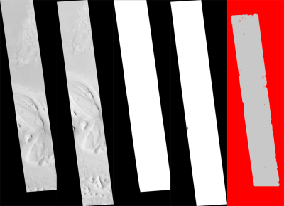
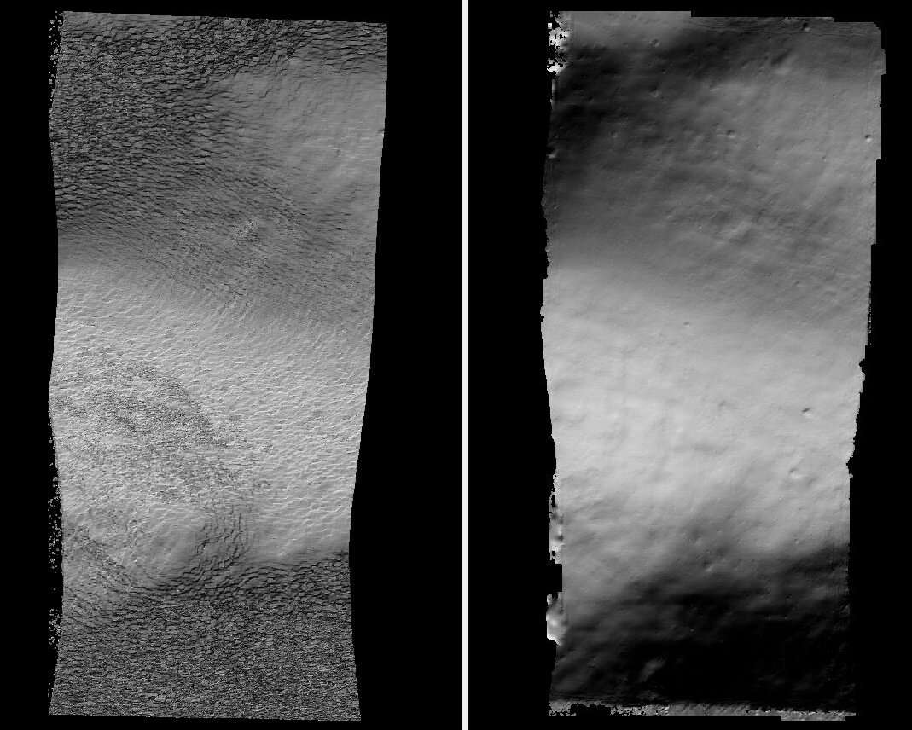
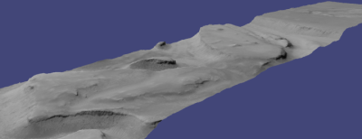
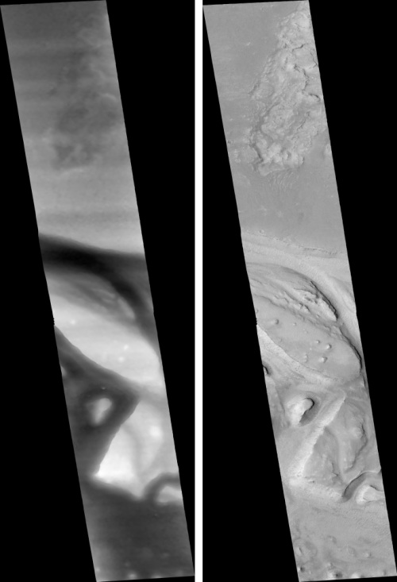
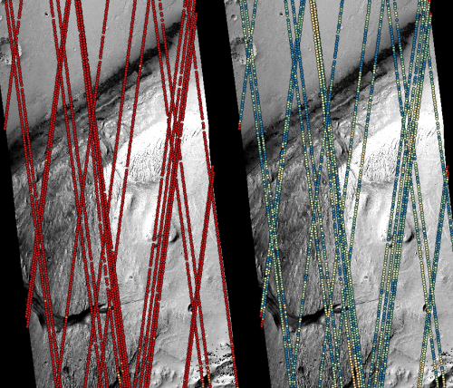
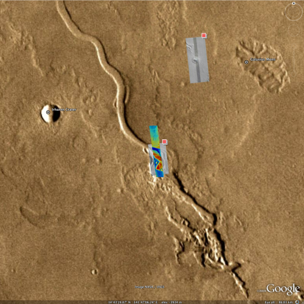

.. _nextsteps:

The Next Steps
==============

This chapter will discuss in more detail ASP’s stereo process and other
tools available to either pre-process the input images/cameras or to
manipulate ``stereo``'s outputs, both in the context of planetary ISIS
data and for Earth images. This includes how to (a) customize
``stereo``'s settings (b) use ``point2dem`` to create 3D terrain
models, (c) visualize the results, (d) align the obtained point clouds
to another data source, (e) perform 3D terrain adjustments in respect to
a geoid, etc.

.. _running-stereo:

Stereo Pipeline in More Detail
------------------------------

Stereo Algorithms
~~~~~~~~~~~~~~~~~

The default stereo algorithm in ASP is block-matching, with various
values for subpixel refinement, as seen below. The latest version of ASP
includes the SGM and MGM algorithms, which overall can perform better,
but are more experimental. For details about how to invoke these
algorithms, see :numref:`sgm`.

.. _settingoptionsinstereodefault:

Setting Options in the ``stereo.default`` File
~~~~~~~~~~~~~~~~~~~~~~~~~~~~~~~~~~~~~~~~~~~~~~

The ``stereo`` program requires a ``stereo.default`` file that
contains settings that affect the stereo reconstruction process.
Its contents can be altered for your needs; details are found in
:numref:`stereodefault`. You may find it useful to save multiple
versions of the ``stereo.default`` file for various processing
needs. If you do this, be sure to specify the desired settings file
by invoking ``stereo`` with the ``-s`` option. If this option is
not given, the ``stereo`` program will search for a file named
``stereo.default`` in the current working directory. If ``stereo``
does not find ``stereo.default`` in the current working directory
and no file was given with the ``-s`` option, ``stereo`` will assume
default settings and continue.

An example ``stereo.default`` file is available in the ``examples/``
directory of ASP. The actual file has a lot of comments to show you what
options and values are possible. Here’s a trimmed version of the
important values in that file.

::

           alignment-method affineepipolar
           cost-mode 2
           corr-kernel 21 21
           subpixel-mode 1
           subpixel-kernel 21 21

All these options can be overridden from the command line, as described
in :numref:`cmdline`.

Alignment Method
^^^^^^^^^^^^^^^^

The most important line in ``stereo.default`` is the first one,
specifying the alignment method. For raw images, alignment is always
necessary, as the left and right images are from different perspectives.
Several alignment methods are supported, including ``affineepipolar``
and ``homography`` (see :numref:`stereo-default-preprocessing` for
details).

Alternatively, stereo can be performed with map-projected images
(:numref:`mapproj-example`). In effect we take a smooth
low-resolution terrain and map both the left and right raw images onto
that terrain. This automatically brings both images into the same
perspective, and as such, for map-projected images the alignment method
is always set to ``none``.

Correlation Parameters
^^^^^^^^^^^^^^^^^^^^^^

The second and third lines in ``stereo.default`` define what correlation
metric *(normalized cross correlation)* we’ll be using and how big the
template or kernel size should be *(21 pixels square)*. A pixel in the
left image will be matched to a pixel in the right image by comparing
the windows of this size centered at them.

Making the kernel sizes smaller, such as 15 |times| 15, or even
11 |times| 11, may improve results on more complex features, such as steep
cliffs, at the expense of perhaps introducing more false matches or
noise.

Subpixel Refinement Parameters
^^^^^^^^^^^^^^^^^^^^^^^^^^^^^^

A highly critical parameter in ASP is the value of ``subpixel-mode``, on
the fourth line. When set to 1, ``stereo`` performs parabola subpixel
refinement, which is very fast but not very accurate. When set to 2, it
produces very accurate results, but it is about an order of magnitude
slower. When set to 3, the accuracy and speed will be somewhere in
between the other methods.

The fifth line sets the kernel size to use during subpixel refinement
*(also 21 pixels square)*.

Search Range Determination
^^^^^^^^^^^^^^^^^^^^^^^^^^

Using these settings alone, ASP will attempt to work out the minimum and
maximum disparity it will search for automatically. However if you wish
to, you can explicitly set the extent of the search range by adding the
option::

    corr-search -80 -2 20 2

More details about this option and the inner workings of stereo
correlation can be found in :numref:`correlation`.

.. _perform-stereo:

Performing Stereo Correlation
~~~~~~~~~~~~~~~~~~~~~~~~~~~~~

   These are the four viewable ``.tif`` files
   created by the ``stereo`` program. On the left are the two aligned,
   pre-processed images: (``results/output-L.tif`` and
   ``results/output-R.tif``). The next two are mask images
   (``results/output-lMask.tif`` and ``results/output-rMask.tif``),
   which indicate which pixels in the aligned images are good to use in
   stereo correlation. The image on the right is the “Good Pixel map”,
   (``results/output-GoodPixelMap.tif``), which indicates (in gray)
   which were successfully matched with the correlator, and (in red)
   those that were not matched.

As already mentioned, the ``stereo`` program can be invoked for ISIS
images as::

     ISIS> stereo left_image.cub right_image.cub \
               -s stereo.default results/output

For Digital Globe images the cameras need to be specified separately:

::

     > stereo left.tif right.tif left.xml right.xml \
         -s stereo.default results/output

As stated in :numref:`moc_tutorial`, the string
``results/output`` is arbitrary, and in this case we will simply make
all outputs go to the ``results`` directory.

When ``stereo`` finishes, it will have produced a point cloud image.
:numref:`visualising` describes how to convert it to a digital
elevation model (DEM) or other formats.

The ``stereo`` command can also take multiple input images, performing
multi-view stereo (:numref:`multiview`).

Running the GUI Frontend
~~~~~~~~~~~~~~~~~~~~~~~~

The ``stereo_gui`` program is a GUI frontend to ``stereo``. It is
invoked with the same options as ``stereo``. It displays the input
images, and makes it possible to zoom in and select smaller regions to
run stereo on. The GUI is described in :numref:`stereo_gui`.

.. _cmdline:

Specifying Settings on the Command Line
~~~~~~~~~~~~~~~~~~~~~~~~~~~~~~~~~~~~~~~

All the settings given via the ``stereo.default`` file can be
over-ridden from the command line. Just add a double hyphen (``--``) in
front the option’s name and then fill out the option just as you would
in the configuration file. For options in the ``stereo.default`` file
that take multiple numbers, they must be separated by spaces (like
‘``corr-kernel 25 25``’) on the command line. Here is an example in
which we override the search range and subpixel mode from the command
line.

::

     ISIS> stereo E0201461.map.cub M0100115.map.cub  \
               -s stereo.map --corr-search -70 -4 40 4 \
               --subpixel-mode 0 results/output

Stereo on Multiple Machines
~~~~~~~~~~~~~~~~~~~~~~~~~~~

If the input images are really large it may desirable to distribute
the work over several computing nodes. ASP provides a tool named
``parallel_stereo`` for that purpose. Its usage is described in
:numref:`parallel_stereo`.

.. _mapproj-example:

Running Stereo with Map-projected Images
~~~~~~~~~~~~~~~~~~~~~~~~~~~~~~~~~~~~~~~~

The way stereo correlation works is by matching a neighborhood of each
pixel in the left image to a similar neighborhood in the right image.
This matching process can fail or become unreliable if the two images
are too different, which can happen for example if the perspectives of
the two cameras are very different or the underlying terrain has steep
portions. This will result in ASP producing terrains with noise or
missing data.

ASP can mitigate this by *map-projecting* the left and right images onto
some pre-existing low-resolution smooth terrain model without holes, and
using the output images to do stereo. In effect, this makes the images
much more similar and more likely for stereo correlation to succeed.

In this mode, ASP does not create a terrain model from scratch, but
rather uses an existing terrain model as an initial guess, and improves
on it.

For Earth, an existing terrain model can be, for example, NASA SRTM,
GMTED2010, USGS’s NED data, or NGA’s DTED data. There exist pre-made
terrain models for other planets as well, for example the Moon LRO LOLA
global DEM and the Mars MGS MOLA DEM.

Alternatively, a low-resolution smooth DEM can be obtained by running
ASP itself as described in previous sections. In such a run, subpixel
mode may be set to parabola (``subpixel-mode 1``) for speed. To make it
sufficiently coarse and smooth, the resolution can be set to about 40
times coarser than either the default ``point2dem`` resolution or the
resolution of the input images. If the resulting DEM turns out to be
noisy or have holes, one could change in ``point2dem`` the search radius
factor, use hole-filling, invoke more aggressive outlier removal, and
erode pixels at the boundary (those tend to be less reliable).
Alternatively, holes can be filled with ``dem_mosaic``.

The tool used for map-projecting the images is called ``mapproject``
(:numref:`mapproject`). It is very important to specify correctly
the output resolution (the ``--tr`` option for ``mapproject``) when
creating map-projected images. For example, if the input images are
about 1 meter/pixel, the same number should be used in ``mapproject``
(if the desired projection is in degrees, this value should be
converted to degrees). If the output resolution is not correct,
there will be artifacts in the stereo results.

Some experimentation on a small area may be necessary to obtain the best
results. Once images are map-projected, they can be cropped to a small
shared region using ``gdal_translate -projwin`` and then stereo with
these clips can be invoked.

Example for ISIS images
^^^^^^^^^^^^^^^^^^^^^^^

   A DEM obtained using plain stereo (left) and stereo with
   map-projected images (right). Their quality will be comparable for
   relatively flat terrain and the second will be much better for rugged
   terrain. The right image has some artifacts, but those are limited to
   areas close to the boundary.

In this example we illustrate how to run stereo with map-projected
images for ISIS data. We start with LRO NAC Lunar images M1121224102LE
and M1121209902LE from ASU’s LRO NAC web site (http://lroc.sese.asu.edu).
We convert them to ISIS cubes using the ISIS
program ``lronac2isis``, then we use the ISIS tools ``spiceinit``,
``lronaccal``, and ``lrnonacecho`` to update the SPICE kernels and to do
radiometric and echo correction. We name the two obtained .cub files
``left.cub`` and ``right.cub``.

Here we decided to run ASP to create the low-resolution DEM needed for
map-projection, rather than get them from an external source. For speed,
we process just a small portion of the images::

     parallel_stereo left.cub right.cub            \
       --left-image-crop-win 1984 11602 4000 5000  \
       --right-image-crop-win 3111 11027 4000 5000 \
       --job-size-w 1024 --job-size-h 1024         \
       --subpixel-mode 1                           \
       run_nomap/run

(the crop windows can be determined using ``stereo_gui``). The input
images have resolution of about 1 meter, or :math:`3.3 \times 10^{-5}` 
degrees on the Moon. We create the low-resolution DEM using a
resolution 40 times as coarse, so we use a grid size of 0.0013
degrees (we use degrees since the default ``point2dem`` projection
invoked here is ``longlat``).

::

     point2dem --search-radius-factor 5 --tr 0.0013 run_nomap/run-PC.tif 

As mentioned earlier, some tweaks to the parameters used by
``point2dem`` may be necessary for this low-resolution DEM to be smooth
enough and with no holes.

Note that we used ``--search-radius-factor 5`` to expand the DEM a bit,
to counteract future erosion in stereo due to the correlation kernel
size.

If this terrain is close to the poles, say within 25 degrees of
latitude, it is advised to use a stereographic projection, centered
either at the nearest pole, or close to the center of the current DEM.
Its center’s longitude and latitude can be found with
``gdalinfo -stats``, which can then be passed to ``point2dem`` such as::

     point2dem --stereographic --proj-lon <lon_ctr> --proj-lat <lat_ctr> ...

By calling ``gdalinfo -proj4``, the PROJ.4 string of the obtained DEM
can be found, which can be used in mapprojection later, and with the
resolution switched to meters from degrees (see :numref:`dg-mapproj`
for more details).

Next, we map-project the images onto this DEM, using the original
resolution of :math:`3.3 \times 10^{-5}` degrees::

     mapproject --tr 0.000033 run_nomap/run-DEM.tif left.cub left_proj.tif \
       --t_projwin 3.6175120 25.5669989 3.6653695 25.4952127
     mapproject --tr 0.000033 run_nomap/run-DEM.tif right.cub right_proj.tif \
       --t_projwin 3.6175120 25.5669989 3.6653695 25.4952127

Notice that we restricted the area of computation using ``--t_projwin``
to again make the process faster.

Next, we do stereo with these map-projected images::

     parallel_stereo --job-size-w 1024 --job-size-h 1024 \
       --subpixel-mode 3                                 \
       left_proj.tif right_proj.tif left.cub right.cub   \
       run_map/run run_nomap/run-DEM.tif

Notice that even though we use map-projected images, we still specified
the original images as the third and fourth arguments. That because we
need the camera information from those files. The fifth argument is the
output prefix, while the sixth is the low-resolution DEM we used for
map-projection. We have used here ``--subpixel-mode 3`` as this will be
the final point cloud and we want the increased accuracy.

Lastly, we create a DEM at 1 meter resolution::

     point2dem --nodata-value -32768 --tr 0.000033 run_map/run-PC.tif

Note here that we could have used a coarser resolution for the final
DEM, such as 4 meters/pixel, since we won’t see detail at the level of 1
meter in this DEM, as the stereo process is lossy. This is explained in
more detail in :numref:`post-spacing`.

In :numref:`mapproj-example` we show the effect of using
map-projected images on accuracy of the final DEM.

It is important to note that we could have map-projected the images
using the ISIS tool ``cam2map``, as described in :numref:`aligning-images`.
The current approach could be
preferable since it allows us to choose the DEM to map-project onto, and
it is much faster, since ASP’s ``mapproject`` uses multiple processes,
while ``cam2map`` is restricted to one process and one thread.

.. _dg-mapproj:

Example for Digital Globe Images
^^^^^^^^^^^^^^^^^^^^^^^^^^^^^^^^

In this section we will describe how to run stereo with map-projected
images for Digital Globe cameras for Earth. The same process can be used
with very minor modifications for any satellite images that use the
the RPC camera model. All that is needed is to replace the stereo
session when invoking ``stereo`` below with ``rpcmaprpc`` from
``dgmaprpc``.

Unlike the previous section, here we will use an external DEM to
map-project onto, rather than creating our own. We will use a variant of
NASA SRTM data with no holes. Other choices have been mentioned earlier.

It is important to note that ASP expects the input low-resolution DEM to
be in reference to a datum ellipsoid, such as WGS84 or NAD83. If the DEM
is in respect to either the EGM96 or NAVD88 geoids, the ASP tool
``dem_geoid`` can be used to convert the DEM to WGS84 or NAD83 (:numref:`dem_geoid`).
(The same tool can be used to convert back
the final output ASP DEM to be in reference to a geoid, if desired.)

Not applying this conversion might not properly negate the parallax seen
between the two images, though it will not corrupt the triangulation
results. In other words, sometimes one may be able to ignore the
vertical datums on the input but we do not recommend doing that. Also,
you should note that the geoheader attached to those types of files
usually does not describe the vertical datum they used. That can only be
understood by careful reading of your provider’s documents.

In this example we use as an input low-resolution DEM the file
``srtm_53_07.tif``, a 90 meter resolution tile from the CGIAR-CSI
modification of the original NASA SRTM product
:cite:`cgiar:srtm90m`. The NASA SRTM square for this example
spot in India is N26E080.

Below are the commands for map-projecting the input and then running
through stereo. You can use any projection you like as long as it
preserves detail in the images. Note that the last parameter in the
stereo call is the input low-resolution DEM. The dataset is the same as
the one used in :numref:`rawdg`.

For best quality results, the resolution used for mapprojection should
be very similar to the documented ground sample distance (GSD) for your
camera.

.. figure:: images/examples/dg/Mapped.png
   :name: fig:dg-map-example
   :figwidth: 100%

   Example colorized height map and ortho image output.

Commands
^^^^^^^^

::

       mapproject -t rpc --t_srs "+proj=eqc +units=m +datum=WGS84" \
         --tr 0.5 srtm_53_07.tif                            \
         12FEB12053305-P1BS_R2C1-052783824050_01_P001.TIF   \
         12FEB12053305-P1BS_R2C1-052783824050_01_P001.XML   \
         left_mapped.tif
       mapproject -t rpc --t_srs "+proj=eqc +units=m +datum=WGS84" \
         --tr 0.5 srtm_53_07.tif                            \
         12FEB12053341-P1BS_R2C1-052783824050_01_P001.TIF   \
         12FEB12053341-P1BS_R2C1-052783824050_01_P001.XML   \
         right_mapped.tif
       stereo -t dgmaprpc --subpixel-mode 1 --alignment-method none  \
              left_mapped.tif right_mapped.tif                 \
              12FEB12053305-P1BS_R2C1-052783824050_01_P001.XML \
              12FEB12053341-P1BS_R2C1-052783824050_01_P001.XML \
              dg/dg srtm_53_07.tif

If the ``--t_srs`` option is not specified, it will be read from the
low-resolution input DEM.

The complete list of options for ``mapproject`` is described in
:numref:`mapproject`.

In the ``stereo`` command, we have used ``subpixel-mode 1`` which is
less accurate but reasonably fast. We have also used
``alignment-method none``, since the images are map-projected onto the
same terrain with the same resolution, thus no additional alignment is
necessary. More details about how to set these and other ``stereo``
parameters can be found in :numref:`settingoptionsinstereodefault`.

It is important to note here that any Digital Globe camera file has two
models in it, the exact linescan model (which we name ``DG``), and its
``RPC`` approximation. Above, we have used the approximate RPC model for
map-projection, since map-projection is just a pre-processing step to
make the images more similar to each other, this step will be undone
during stereo triangulation, and hence using the RPC model is good
enough, while being much faster than the exact ``DG`` model. At the
stereo stage, we see above that we invoked the ``dgmaprpc`` session,
which suggests that we have used the RPC model during map-projection,
but we would like to use the accurate DG model when performing actual
triangulation from the cameras to the ground.

RPC and Pinhole Camera Models
^^^^^^^^^^^^^^^^^^^^^^^^^^^^^

Map-projected images can also be used with RPC and Pinhole camera
models. The ``mapproject`` command needs to be invoked with ``-t rpc``
and ``-t pinhole`` respectively. As earlier, when invoking ``stereo``
the the first two arguments should be the map-projected images, followed
by the camera models, output prefix, and the name of the DEM used for
map-projection. The session name passed to ``stereo`` should be
``rpcmaprpc`` and ``pinholemappinhole`` respectively.

.. _multiview:

Multi-View Stereo
~~~~~~~~~~~~~~~~~

ASP supports multi-view stereo at the triangulation stage. This mode is
somewhat experimental, and not used widely. We have obtained higher
quality results by doing pairwise stereo and merging the result, as
described later on in thi section.

In the multiview scenario, the first image is set as reference,
disparities are computed from it to all the other images, and then joint
triangulation is performed :cite:`slabaugh2001optimal`. A
single point cloud is generated with one 3D point for each pixel in the
first image. The inputs to multi-view stereo and its output point cloud
are handled in the same way as for two-view stereo (e.g., inputs can be
map-projected, the output can be converted to a DEM, etc.).

It is suggested that images be bundle-adjusted (:numref:`baasp`)
before running multi-view stereo.

Example (for ISIS with three images)::

     stereo file1.cub file2.cub file3.cub results/run

Example (for Digital Globe data with three map-projected images)::

     stereo file1.tif file2.tif file3.tif file1.xml file2.xml file3.xml \
       results/run input-DEM.tif

The ``parallel_stereo`` tool can also be used with multiple images
(:numref:`parallel_stereo`).

For a sequence of images, multi-view stereo can be run several times
with each image as a reference, and the obtained point clouds combined
into a single DEM using ``point2dem`` (:numref:`point2dem`).

The ray intersection error, the fourth band in the point cloud file, is
computed as twice the mean of distances from the optimally computed
intersection point to the individual rays. For two rays, this agrees
with the intersection error for two-view stereo which is defined as the
minimal distance between rays. For multi-view stereo this error is much
less amenable to interpretation than for two-view stereo, since the
number of valid rays corresponding to a given feature can vary across
the image, which results in discontinuities in the intersection error.

Other ways of combining multiple images
^^^^^^^^^^^^^^^^^^^^^^^^^^^^^^^^^^^^^^^

As an alternative to multi-view stereo, point clouds can be generated
from multiple stereo pairs, and then a single DEM can be created with
``point2dem`` (:numref:`builddem`). Or, multiple DEMs can be
created, then combined into a single DEM with ``dem_mosaic``
(:numref:`dem_mosaic`).

In both of these approaches, the point clouds could be registered to a
trusted dataset using ``pc_align`` before creating a combined terrain
model (:numref:`pc-align-example`).

The advantage of creating separate DEMs and then merging them (after
alignment) with ``dem_mosaic``, compared to multiview triangulation, is
that this approach will not create visible seams, while likely it will
still increase the accuracy compared to the individual input DEMs.

Diagnosing Problems
~~~~~~~~~~~~~~~~~~~

Once invoked, ``stereo`` proceeds through several stages that are
detailed in :numref:`entrypoints`. Intermediate and final output
files are generated as it goes. See :numref:`outputfiles`, page for
a comprehensive listing. Many of these files are useful for diagnosing
and debugging problems.  For example, as :numref:`p19-stereo-output`
shows, a quick look at some of the TIFF files in the ``results/``
directory provides some insight into the process.

Perhaps the most accessible file for assessing the quality of your
results is the good pixel image (``results/output-GoodPixelMap.tif``).
If this file shows mostly good, gray pixels in the overlap area
(the area that is white in both the ``results/output-lMask.tif``
and ``results/output-rMask.tif`` files), then your results are just
fine. If the good pixel image shows lots of failed data, signified
by red pixels in the overlap area, then you need to go back and
tune your ``stereo.default`` file until your results improve. This
might be a good time to make a copy of ``stereo.default`` as you
tune the parameters to improve the results.

.. _p19-disparity:

.. figure:: images/p19-disparity_400px.png
   :alt: Disparity images produced using the ``disparitydebug`` tool.

   Disparity images produced using the
   ``disparitydebug`` tool. The two images on the left are the
   ``results/output-D-H.tif`` and ``results/output-D-V.tif`` files,
   which are normalized horizontal and vertical disparity components
   produced by the disparity map initialization phase. The two images on
   the right are ``results/output-F-H.tif`` and
   ``results/output-F-V.tif``, which are the final filtered,
   sub-pixel-refined disparity maps that are fed into the Triangulation
   phase to build the point cloud image. Since these MOC images were
   acquired by rolling the spacecraft across-track, most of the
   disparity that represents topography is present in the horizontal
   disparity map. The vertical disparity map shows disparity due to
   “wash-boarding,” which is not from topography but from spacecraft
   movement. Note however that the horizontal and vertical disparity
   images are normalized independently. Although both have the same
   range of gray values from white to black, they represent
   significantly different absolute ranges of disparity.

Whenever ``stereo``, ``point2dem``, and other executables are run, they
create log files in given tool’s results directory, containing a copy of
the configuration file, the command that was run, your system settings,
and tool’s console output. This will help track what was performed so
that others in the future can recreate your work.

Another handy debugging tool is the ``disparitydebug`` program, which
allows you to generate viewable versions of the intermediate results
from the stereo correlation algorithm. ``disparitydebug`` converts
information in the disparity image files into two TIFF images that
contain horizontal and vertical components of the disparity (i.e.
matching offsets for each pixel in the horizontal and vertical
directions). There are actually three flavors of disparity map: the
``-D.tif``, the ``-RD.tif``, and ``-F.tif``. You can run
``disparitydebug`` on any of them. Each shows the disparity map at the
different stages of processing.

::

     >  disparitydebug results/output-F.tif

If the output H and V files from ``disparitydebug`` look good, then the
point cloud image is most likely ready for post-processing. You can
proceed to make a mesh or a DEM by processing ``results/output-PC.tif``
using the ``point2mesh`` or ``point2dem`` tools, respectively.

:numref:`p19-disparity` shows the outputs of ``disparitydebug``.

If the input images are map-projected (georeferenced) and the alignment
method is ``none``, all images output by stereo are georeferenced as
well, such as GoodPixelMap, D_sub, disparity, etc. As such, all these
data can be overlayed in ``stereo_gui``. ``disparitydebug`` also
preserves any georeference.

.. _longrun:

Dealing with Long Run-times
~~~~~~~~~~~~~~~~~~~~~~~~~~~

If ``stereo_corr`` takes unreasonably long, it may have encountered a
portion of the image where, due to noise (such as clouds, shadows, etc.)
the determined search range is much larger than what it should be. The
option ``--corr-timeout integer`` can be used to limit how long each
1024 |times| 1024 pixel tile can take. A good value here could
be 300 (seconds) or more if your terrain is expected to have large
height variations.

.. _visualising:

Visualizing and Manipulating the Results
----------------------------------------

When ``stereo`` finishes, it will have produced a point cloud image. At
this point, many kinds of data products can be built from the
``results/output-PC.tif`` point cloud file.

.. _p19-osg:

   A visualization of a mesh.

Building a 3D Mesh Model
~~~~~~~~~~~~~~~~~~~~~~~~

The ``point2mesh`` command (:numref:`point2mesh`) can be used to
create a 3D textured mesh in the plain text ``.obj`` format that can be
opened in a mesh viewer such as MeshLab. The ``point2mesh`` program
takes the point cloud file and the left normalized image as inputs::

     > point2mesh results/output-PC.tif results/output-L.tif

An example visualization is shown in :numref:`p19-osg`.

If you already have a DEM and an ortho image (:numref:`builddem`),
they can be used to build a mesh as well, in the same way as done
above::

     > point2mesh results/output-DEM.tif results/output-DRG.tif

.. _builddem:

Building a Digital Elevation Model and Ortho Image
~~~~~~~~~~~~~~~~~~~~~~~~~~~~~~~~~~~~~~~~~~~~~~~~~~

The ``point2dem`` program (page ) creates a Digital Elevation Model
(DEM) from the point cloud file.

::

     >  point2dem results/output-PC.tif

The resulting TIFF file is map-projected and will contain georeferencing
information stored as GeoTIFF tags.

The tool will infer the datum and projection from the input images, if
present. You can explicitly specify a coordinate system (e.g., mercator,
sinusoidal) and a reference spheroid (i.e., calculated for the Moon,
Mars, or Earth). Alternatively, the datum semi-axes can be set or a
PROJ.4 string can be passed in.

::

     >  point2dem -r mars results/output-PC.tif

The output DEM will be named ``results/output-DEM.tif``. It can be
imported into a variety of GIS platforms. The DEM can be transformed
into a hill-shaded image for visualization (:numref:`genhillshade`).
Both the DEM itself and its hill-shaded version can be examined in
``stereo_gui``.

The ``point2dem`` program can also be used to orthoproject raw satellite
images onto the DEM. To do this, invoke ``point2dem`` just as before,
but add the ``--orthoimage`` option and specify the use of the left
image file as the texture file to use for the projection::

     >  point2dem results/output-PC.tif --orthoimage results/output-L.tif

The texture file must always be specified after the point cloud file in
this command. See :numref:`p19-norm_ortho` on the
right for the output image.

To fill in any holes in the obtained orthoimage, one can invoke it with
a larger value of the grid size (the ``--tr`` option) and/or with a
variation of the options::

      --no-dem --orthoimage-hole-fill-len 100 --search-radius-factor 2 

The ``point2dem`` program is also able to accept output projection
options the same way as the tools in GDAL. Well-known EPSG, IAU2000
projections, and custom PROJ.4 strings can applied with the target
spatial reference set flag, ``--t_srs``. If the target spatial reference
flag is applied with any of the reference spheroid options, the
reference spheroid option will overwrite the datum defined in the target
spatial reference set. The following examples produce the same output.
However, the last two results will also show correctly the name of the
datum in the geoheader, not just the values of its axes.

::

     point2dem --t_srs "+proj=longlat +a=3396190 +b=3376200"
        results/output-PC.tif

     point2dem --t_srs http://spatialreference.org/ref/iau2000/49900/ \
        results/output-PC.tif

      point2dem --t_srs 'GEOGCS["Geographic Coordinate System",                     
                            DATUM["D_Mars_2000",
                            SPHEROID["Mars_2000_IAU_IAG",3396190,169.894447223611]],
                            PRIMEM["Greenwich",0],
                            UNIT["degree",0.0174532925199433]]' results/output-PC.tif

The ``point2dem`` program can be used in many different ways. The
complete documentation is in :numref:`point2dem`.

.. _p19-norm_ortho:

   The image on the left is a normalized DEM (generated using 
   ``point2dem``’s ``-n`` option), which shows low terrain
   values as black and high terrain values as white. The image on the
   right is the left input image projected onto the DEM (created using
   the ``--orthoimage`` option to ``point2dem``).

Orthorectification of an Image From a Different Source
~~~~~~~~~~~~~~~~~~~~~~~~~~~~~~~~~~~~~~~~~~~~~~~~~~~~~~

If you have already obtained a DEM, using ASP or some other approach,
and have an image and camera pair which you would like to overlay on top
of this terrain, use the ``mapproject`` tool (:numref:`mapproject`).

Correcting Camera Positions and Orientations
~~~~~~~~~~~~~~~~~~~~~~~~~~~~~~~~~~~~~~~~~~~~

The ``bundle_adjust`` program can be used to adjust the camera positions
and orientations before running stereo. These adjustments only makes the
cameras self-consistent. For the adjustments to be absolute, it is
necessary to use ``bundle_adjust`` with ground control points. This tool
is described in :numref:`bundle_adjust`.

.. _pc-align-example:

Alignment to Point Clouds From a Different Source
~~~~~~~~~~~~~~~~~~~~~~~~~~~~~~~~~~~~~~~~~~~~~~~~~

Often the 3D terrain models output by ``stereo`` (point clouds and DEMs)
can be intrinsically quite accurate yet their actual position on the
planet may be off by several meters or several kilometers, depending on
the spacecraft. This can result from small errors in the position and
orientation of the satellite cameras taking the pictures.

Such errors can be corrected in advance using bundle adjustment, as
described in the previous section. That requires using ground control
points, that may not be easy to collect. Alternatively, the images and
cameras can be used as they are, and the absolute position of the output
point clouds can be corrected in post-processing. For that, ASP provides
a tool named ``pc_align``. It aligns a 3D terrain to a much more
accurately positioned (if potentially sparser) dataset. Such datasets
can be made up of GPS measurements (in the case of Earth), or from laser
altimetry instruments on satellites, such as ICESat/GLASS for Earth,
LRO/LOLA on the Moon, and MGS/MOLA on Mars. Under the hood, ``pc_align``
uses the Iterative Closest Point algorithm (ICP) (both the
point-to-plane and point-to-point flavors are supported, and with
point-to-point ICP it is also possible to solve for a scale change).

The ``pc_align`` tool requires another input, an a priori guess for the
maximum displacement we expect to see as result of alignment, i.e., by
how much the points are allowed to move when the alignment transform is
applied. If not known, a large (but not unreasonably so) number can be
specified. It is used to remove most of the points in the source
(movable) point cloud which have no chance of having a corresponding
point in the reference (fixed) point cloud.

Here is how ``pc_align`` can be called (the denser cloud is specified
first).

   Example of using ``pc_align`` to align a DEM obtained using stereo
   from CTX images to a set of MOLA tracks. The MOLA points are colored
   by the offset error initially (left) and after pc align was applied
   (right) to the terrain model. The red dots indicate more than 100 m
   of error and blue less than 5 m. The ``pc_align`` algorithm
   determined that by moving the terrain model approximately 40 m south,
   70 m west, and 175 m vertically, goodness of fit between MOLA and the
   CTX model was increased substantially.

::

     >  pc_align --max-displacement 200 --datum MOLA   \
          --save-inv-transformed-reference-points      \
          --csv-format '1:lon 2:lat 3:radius_m'        \
          stereo-PC.tif mola.csv

It is important to note here that there are two widely used Mars datums,
and if your CSV file has, unlike above, the heights relative to a datum,
the correct datum name must be specified via ``--datum``.  :numref:`molacmp`
talks in more detail about the Mars datums.

:numref:`pc-align-fig` shows an example of using ``pc_align``.
The complete documentation for this program is in :numref:`pc_align`.

Alignment and Orthoimages
~~~~~~~~~~~~~~~~~~~~~~~~~

Two related issues are discussed here. The first is that sometimes,
after ASP has created a DEM, and the left and right images are
map-projected to it, they are shifted in respect to each other. That is
due to the errors in camera positions. To rectify it, one has to run
``bundle_adjust`` first, then rerun the stereo and mapprojection tools,
with the adjusted cameras being passed to both via
``--bundle-adjust-prefix``.

Note that this approach will create self-consistent outputs, but not
necessarily aligned with pre-existing ground truth. That we deal with
next.

Once an ASP-generated DEM has been aligned to known ground data using
``pc_align``, it may be desired to create orthoimages that are also
aligned to the ground. That can be accomplished in two ways.

The ``point2dem --orthoimage`` approach be used, and one can pass to it
the point cloud after alignment and the ``L`` image before alignment
(all this tool does is copy pixels from the texture image, so position
errors are not a problem).

Alternatively, one can invoke the ``mapproject`` tool again. Yet, there
is a challenge, because this tool uses the original cameras, before
alignment, but will project onto the DEM after alignment, so the
obtained orthoimage location on the ground will be wrong.

The solution is to invoke ``bundle_adjust`` on the two input images and
cameras, while passing to it the transform obtained from ``pc_align``
via the ``--initial-transform`` option. This will shift the cameras to
the right place, and then ``mapproject`` can be called with the adjusted
cameras, using again the ``--bundle-adjust-prefix`` option. If all that
is wanted is to shift the cameras, without doing any actual adjustments,
the tool can be invoked with 0 iterations.

Creating DEMs Relative to the Geoid/Areoid
~~~~~~~~~~~~~~~~~~~~~~~~~~~~~~~~~~~~~~~~~~

The DEMs generated using ``point2dem`` are in reference to a datum
ellipsoid. If desired, the ``dem_geoid`` program can be used to convert
this DEM to be relative to a geoid/areoid on Earth/Mars respectively.
Example usage::

     >  dem_geoid results/output-DEM.tif

Converting to the LAS Format
~~~~~~~~~~~~~~~~~~~~~~~~~~~~

If it is desired to use the ``stereo`` generated point cloud outside of
ASP, it can be converted to the LAS file format, which is a public file
format for the interchange of 3-dimensional point cloud data. The tool
``point2las`` can be used for that purpose (:numref:`point2las`). Example usage::

     >  point2las --compressed -r Earth results/output-PC.tif

.. _genhillshade:

Generating Color Hillshade Maps
~~~~~~~~~~~~~~~~~~~~~~~~~~~~~~~

Once you have generated a DEM file, you can use the ``colormap`` and
``hillshade`` tools to create colorized and/or shaded relief images.

To create a colorized version of the DEM, you need only specify the DEM
file to use. The colormap is applied to the full range of the DEM, which
is computed automatically. Alternatively you can specify your own min
and max range for the color map.

::

     >  colormap results/output-DEM.tif -o hrad-colorized.tif

To create a hillshade of the DEM, specify the DEM file to use. You can
control the azimuth and elevation of the light source using the ``-a``
and ``-e`` options.

::

     >  hillshade results/output-DEM.tif -o hrad-shaded.tif -e 25 -a 300

To create a colorized version of the shaded relief file, specify the DEM
and the shaded relief file that should be used::

     >  colormap results/output-DEM.tif -s hrad-shaded.tif -o hrad-color-shaded.tif

See :numref:`hrad-color` showing the images obtained with these
commands.

The complete documentation for ``colormap`` is in :numref:`colormap`,
and for ``hillshade`` in :numref:`hillshade`.

.. _hrad-color:

.. figure:: images/p19-colorized-shaded_500px.png

   The colorized DEM, the shaded relief image, and the
   colorized hillshade.

Building Overlays for Moon and Mars Mode in Google Earth
~~~~~~~~~~~~~~~~~~~~~~~~~~~~~~~~~~~~~~~~~~~~~~~~~~~~~~~~

Sometimes it may be convenient to see how the DEMs and orthoimages
generated by ASP look on top of existing images in Google Earth. ASP
provides a tool named ``image2qtree`` for that purpose. It creates
multi-resolution image tiles and a metadata tree in KML format that can
be loaded into Google Earth from your local hard drive or streamed from
a remote server over the Internet.

The ``image2qtree`` program can only be used on 8-bit image files with
georeferencing information (e.g. grayscale or RGB GeoTIFF images). In
this example, it can be used to process

| ``results/output-DEM-normalized.tif``, ``results/output-DRG.tif``,
  ``hrad-shaded.tif``,
| ``hrad-colorized.tif``, and ``hrad-shaded-colorized.tif``.

These images were generated respectively by using ``point2dem`` with the
``-n`` option creating a normalized DEM, the ``--orthoimage`` option to
``point2dem`` which projects the left image onto the DEM, and the images
created earlier with ``colormap``.

Here’s an example of how to invoke this program::

     >  image2qtree hrad-shaded-colorized.tif -m kml --draw-order 100

:numref:`hrad-kml` shows the obtained KML files in Google
Earth.

The complete documentation is in :numref:`image2qtree`.

.. _hrad-kml:

   The colorized hillshade DEM as a KML overlay.

Using DERT to Visualize Terrain Models
~~~~~~~~~~~~~~~~~~~~~~~~~~~~~~~~~~~~~~

The open source Desktop Exploration of Remote Terrain (DERT) software
tool can be used to explore large digital terrain models, like those
created by the Ames Stereo Pipeline. For more information, visit
https://github.com/nasa/DERT.

.. _blender:

Using Blender to Visualize Meshes
~~~~~~~~~~~~~~~~~~~~~~~~~~~~~~~~~

The :ref:`point2mesh` program will create ``.obj`` and ``.mtl`` files
that you can import directly into Blender (https://www.blender.org/).
Remember that ``.obj`` files don’t particularly have a way to
specify 'units' but the 'units' of an ``.obj`` file written out by ASP
are going to be 'meters.'  If you open a large .obj model created by
ASP (like HiRISE), you’ll need to remember to move the default
viewpoint away from the origin, and extend the clipping distance to a
few thousand (which will be a few kilometers), otherwise it may
‘appear’ that the model hasn’t loaded (because 
your viewpoint is inside of it, and you can’t see far enough).

The default step size for :ref:`point2mesh` is 10, which only samples
every 10th point, so you may want to read the documentation which
talks more about the ``-s`` argument to :ref:`point2mesh`.  Depending on how
big your model is, even that might be too small, and I’d be very
cautious about using ``-s 1`` on a HiRISE model that isn’t cropped
somehow first.

You can also use :ref:`point2mesh` to pull off this trick with
terrain models you've already made (maybe with SOCET or something
else).  Our :ref:`point2mesh` program certainly knows how to read
our ASP ``*-PC.tif`` files, but it can also read GeoTIFFs.  So if
you have a DEM as a GeoTIFF, or an ISIS cube which is a terrain
model (you can use ``gdal_translate`` to convert them to GeoTIFFs),
then you can run :ref:`point2mesh` on them to get ``.obj`` and
``.mtl`` files.

.. _meshlab:

Using MeshLab to Visualize Meshes
~~~~~~~~~~~~~~~~~~~~~~~~~~~~~~~~~

Alternatively, MeshLab is another program that can view meshes in 
``.obj`` files. It can be downloaded from::

  https://github.com/cnr-isti-vclab/meshlab/releases

and can be installed and run in user's directory without needing
administrative priveledges.

Using QGIS to Visualize Terrain Models
~~~~~~~~~~~~~~~~~~~~~~~~~~~~~~~~~~~~~~

The free and open source geographic information system QGIS
(https://qgis.org) as of version 3.0 has a 3D Map View feature that
can be used to easily visualize perspective views of terrain models.

After you use :ref:`point2dem` to create a terrain model (the
``*-DEM.tif`` file), or both the terrain model and an ortho image
via ``--orthoimage`` (the ``*-DRG.tif`` file), those files can be
loaded as raster data files, and the 'New 3D Map View' under the
View menu will create a new window, and by clicking on the wrench
icon, you can set the DEM file as the terrain source, and are able
to move around a perspective view of your terrain.

.. |times| unicode:: U+00D7 .. MULTIPLICATION SIGN
