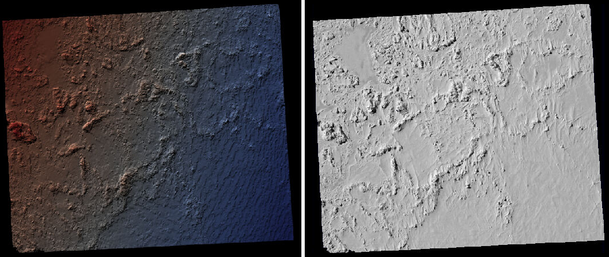

.. _sfm:

SfM examples with orbital images
================================

The Structure-from-Motion (SfM) ASP tool ``camera_solve`` offers
several ways to find the pose of frame camera images that do
not come with any attached pose metadata. This can be useful with
aerial, hand-held, and historical images for which such information
may be incomplete or inaccurate.

An overview of ``camera_solve`` and examples are provided in this chapter.
Reference information for this tool can be found in :numref:`camera_solve`.

This program can be optionally bypassed if, for example, 
a similar orthoimage and a DEM are available (:numref:`camera_solve_gcp`),
or if the longitude and latitude of the corners of all images are known
(:numref:`cam_gen`).

ASP offers another tool to build reconstructions, named ``theia_sfm``
(:numref:`theia_sfm`). That one more geared to work with a rig
mounted on a robot (:numref:`rig_calibrator`). See examples
of that in :numref:`rig_examples`.

Camera solving overview
-----------------------

The ``camera_solve`` tool is implemented as a Python wrapper around two other
tools that we ship. The first of these is `TheiaSfM
<http://www.theia-sfm.org/index.html>`_. It generates initial camera position
estimates in a local coordinate space. The second one is ``bundle_adjust``
(:numref:`bundle_adjust`).  This program improves the solution to account for
lens distortion and transforms the solution from local to global coordinates by
making use of additional input data.

The ``camera_solve`` program only solves for the extrinsic camera parameters
(camera position and orientation) and the user must provide intrinsic camera
information, such as focal length, optical center, and distortion parameters.

The ``camera_calibrate`` tool (see :numref:`camera_calibrate`) can solve for
intrinsic parameters if you have access to the camera in question. 

The ``rig_calibrator`` (:numref:`rig_calibrator`) program can calibrate a rig
with one more cameras based on data acquired in situ, without a calibration
target. It can handle a mix of optical images and depth clouds.

The ``bundle_adjust`` program can also solve for the intrinsics, without using a
rig or a calibration target. It can optionally constrain the solution against
a well-aligned prior terrain (:numref:`floatingintrinsics`).

The camera calibration information must be contained in a .tsai pinhole camera
model file and must passed in using the ``--calib-file`` option. 

:numref:`camera_solve_gcp` has an example of a pinhole camera model file and
discusses some heuristics for how to guess the intrinsics. A description of our
supported pinhole camera models in :numref:`pinholemodels`.

In order to transform the camera models from local to world coordinates,
one of three pieces of information may be used. These sources are listed
below and described in more detail in the examples that follow:

-  A set of ground control points (:numref:`bagcp`). GCP can also be used 
   to bypass SfM altogether, if there are many (:numref:`camera_solve_gcp`).
 
-  A set of estimated camera positions (perhaps from a GPS unit) stored in a csv
   file (see :numref:`sfmicebridge`).

-  A DEM or lidar datset that a local point cloud can be registered to using
   ``pc_align`` (:numref:`pc_align`). This method can be more accurate if
   estimated camera positions are also used.

Power users can tweak the individual steps that ``camera_solve`` goes
through to optimize their results. This primarily involves setting up a
custom flag file for Theia and/or passing in settings to
``bundle_adjust``.

.. _sfmgeneric:

Example: Apollo 15 Metric Camera
--------------------------------

Preparing the inputs
^^^^^^^^^^^^^^^^^^^^

To demonstrate the ability of the Ames Stereo Pipeline to process a
generic frame camera we use images from the Apollo 15 Metric camera. The
calibration information for this camera is available online and we have
accurate digital terrain models we can use to verify our results.

First, download with ``wget`` the two images at::

  http://apollo.sese.asu.edu/data/metric/AS15/png/AS15-M-0114_MED.png
  http://apollo.sese.asu.edu/data/metric/AS15/png/AS15-M-0115_MED.png

.. figure:: images/examples/pinhole/AS15-M-combined.png
   :name: pinhole-a15-input-images

   The two Apollo 15 images

In order to make the example run faster we use downsampled versions of
the original images. The images at those links have already been
downsampled by a factor of :math:`4 \sqrt{2}` from the original images.
This means that the effective pixel size has increased from five microns
(0.005 millimeters) to 0.028284 millimeters.

The next step is to fill out the rest of the pinhole camera model information we
need, based on the `Apollo 15 photographic equipment and mission summary report
<http://apollo.sese.asu.edu/SUPPORT_DATA/AS15_SIMBAY_SUMMARY.pdf>`_. 

Looking at the ASP lens distortion models in :numref:`pinholemodels`, we see
that the description matches ASP's Brown-Conrady model. This model is, not
recommended in general, as the distortion operation is slow (see a discussion in
:numref:`brown_conrady`), but here we have to conform to what is expected.

Using the example in the appendix we can fill out the rest of the sensor model
file (metric_model.tsai) so it looks as follows::

   VERSION_3
   fu = 76.080
   fv = 76.080
   cu = 57.246816
   cv = 57.246816
   u_direction = 1  0  0
   v_direction = 0  1  0
   w_direction = 0  0  1
   C = 0 0 0
   R = 1 0 0 0 1 0 0 0 1
   pitch = 0.028284
   BrownConrady
   xp = -0.006
   yp = -0.002
   k1 = -0.13361854e-5
   k2 = 0.52261757e-09
   k3 = -0.50728336e-13
   p1 = -0.54958195e-06
   p2 = -0.46089420e-10
   phi = 2.9659070

These parameters use units of millimeters so we have to convert the
nominal center point of the images from 2024 pixels to units of
millimeters. Note that for some older images like these the nominal
image center can be checked by looking for some sort of marking around
the image borders that indicates where the center should lie. For these
pictures there are black triangles at the center positions and they line
up nicely with the center of the image. Before we try to solve for the
camera positions we can run a simple tool to check the quality of our
camera model file::

   undistort_image AS15-M-0114_MED.png metric_model.tsai \
     -o corrected_414.tif

It is difficult to tell if the distortion model is correct by using this
tool but it should be obvious if there are any gross errors in your
camera model file such as incorrect units or missing parameters. In this
case the tool will fail to run or will produce a significantly distorted
image. For certain distortion models the ``undistort_image`` tool may
take a long time to run.

If your input images are not all from the same camera or were scanned
such that the center point is not at the same pixel, you can run
``camera_solve`` with one camera model file per input image. To do so
pass a space-separated list of files surrounded by quotes to the
``--calib-file`` option such as
``--calib-file "c1.tsai c2.tsai c3.tsai"``.

Creation of cameras in an arbitrary coordinate system
^^^^^^^^^^^^^^^^^^^^^^^^^^^^^^^^^^^^^^^^^^^^^^^^^^^^^

If we do not see any obvious problems we can go ahead and run the
``camera_solve`` tool::

    camera_solve out/ AS15-M-0114_MED.png AS15-M-0115_MED.png \
      --theia-overrides '--matching_strategy=CASCADE_HASHING' \
      --datum D_MOON --calib-file metric_model.tsai

The reconstruction can be visualized as::

    view_reconstruction --reconstruction out/theia_reconstruction.dat

One may need to zoom out to see all cameras. See an illustration in :numref:`view_reconstruction`.

.. _sfm_world_coords:

Creation of cameras in world coordinates
^^^^^^^^^^^^^^^^^^^^^^^^^^^^^^^^^^^^^^^^

In order to generate a useful DEM, we need to move our cameras from
local coordinates to global coordinates. The easiest way to do this
is to obtain known ground control points (GCPs) which can be
identified in the frame images. This will allow an accurate positioning
of the cameras provided that the GCPs and the camera model parameters
are accurate. 

We use ``stereo_gui`` to create GCP (:numref:`creatinggcp`). The input DEM is
generated from LRO NAC images. An arbitrary DEM for the desired planet can make
do for the purpose of transforming the cameras to plausible orbital coordinates.
(See :numref:`camera_solve_gcp` for more on GCP.) 

For GCP to be usable, they can be one of two kinds. The preferred
option is to have at least three GCP, with each seen in at least two
images.  Then their triangulated positions can be determined in local
coordinates and in global (world) coordinates, and ``bundle_adjust``
will be able to compute the transform between these coordinate
systems, and convert the cameras to world coordinates. 

The ``camera_solve`` program will automatically attempt this
transformation. This amounts to invoking ``bundle_adjust`` with the
option ``--transform-cameras-with-shared-gcp``.

If this is not possible, then at least two of the images should have
at least three GCP each, and they need not be shared among the
images. For example, for each image the longitude, latitude, and
height of each of its four corners can be known. Then, one can pass
such a GCP file to ``camera_solve`` together with the flag::

     --bundle-adjust-params "--transform-cameras-using-gcp"

This may not be as robust as the earlier approach. Consider the option
``--fix-gcp-xyz``, to not move the GCP during optimization.

Solving for cameras when using GCP::

    camera_solve out_gcp/                                     \
      AS15-M-0114_MED.png AS15-M-0115_MED.png                 \
      --datum D_MOON --calib-file metric_model.tsai           \
      --theia-overrides '--matching_strategy=CASCADE_HASHING' \
      --gcp-file ground_control_points.gcp

Examine the lines ending in ``# GCP`` in the file::

    out_gcp/asp_ba_out-final_residuals_pointmap.csv
    
(:numref:`ba_err_per_point`). If the residuals are no more than a handful pixels,
and ideally less than a pixel, the GCP were used successfully. 

Increase the value of ``--robust-threshold`` in ``bundle_adjust``
(via ``--bundle-adjust-params`` in ``camera_solve``)
if desired to bring down the big residuals in that file at the expense
of increasing the smaller ones. Consider also deleting GCP corresponding
to large residuals, as those may be inaccurate.

Running stereo
^^^^^^^^^^^^^^

::

    parallel_stereo                          \
      AS15-M-0114_MED.png                    \
      AS15-M-0115_MED.png                    \
      out_gcp/AS15-M-0114_MED.png.final.tsai \
      out_gcp/AS15-M-0115_MED.png.final.tsai \
      -t pinhole                             \
      --skip-rough-homography                \
      --stereo-algorithm asp_mgm             \
      --subpixel-mode 9                      \
      --sgm-collar-size 256                  \
      s_global/out

Create a terrain model and orthoimage::

     point2dem -r moon                    \
       --stereographic --auto-proj-center \
       s_global/out-PC.tif                \
       --orthoimage s_global/out-L.tif    \
       --errorimage

See :numref:`parallel_stereo` and :numref:`point2dem` for more information on
the options used here. 

The error image can be useful to see if the intrinsics are good. Big errors in
the corners of the images may indicate that the intrinsics need refinement
(:numref:`floatingintrinsics`).

.. figure:: images/examples/pinhole/a15_fig.png
   :name: pinhole-a15-result-image

   Produced hillshaded DEM (left) and orthoimage (right). See
   :numref:`stereo_alg_fig` for a comparison of stereo algorithms.

:numref:`nextsteps` will discuss the ``parallel_stereo`` program
in more detail and the other tools in ASP.

.. _sfm_multiview:

Multiview reconstruction
^^^^^^^^^^^^^^^^^^^^^^^^

The ``bundle_adjust`` program produces a report file having the convergence
angle and number of matches between any two images in a given set
(:numref:`ba_conv_angle`).

That data can be used to decide on promising stereo pairs to consider
(:numref:`stereo_pairs`). After pairwise stereo and DEM creation is run, the
DEMs can be mosaicked together with ``dem_mosaic`` (:numref:`dem_mosaic`). 

The input DEMs should agree quite well if the intrinsics are accurate, there is
enough overlap between the images, many interest point matches were found, and
the cameras were bundle-adjusted (with GCP). Refining intrinsics is discussed
in :numref:`floatingintrinsics`.

The produced mosaicked DEM (and cameras) can be aligned to a reference terrain with
``pc_align`` (:numref:`pc_align`).

The creation of a fused mesh is discussed in :numref:`multi_stereo`.

.. _sfmicebridge:

Example: IceBridge DMS Camera
-----------------------------

The DMS (Digital Mapping System) Camera is a frame camera flown on as part of
the `NASA IceBridge program <http://nsidc.org/icebridge/portal/>`_, whose goal
was to collect images of polar terrain.

The approach is, with a few exceptions, very similar to the one for the Apollo
Metric camera. 

The DMS images are available for download at the `IceBridge ftp site
<ftp://n5eil01u.ecs.nsidc.org/SAN2/ICEBRIDGE_FTP/IODMS0_DMSraw_v01/>`_. A list
of the available data types can be found at the `mission data summary
<https://nsidc.org/data/icebridge/instr_data_summary.html>`_ page.

This example uses data from the November 5, 2009 flight over Antarctica. The
following camera model (icebridge_model.tsai) was used (see
:numref:`pinholemodels` on Pinhole camera models)::

   VERSION_3
   fu = 28.429
   fv = 28.429
   cu = 17.9712
   cv = 11.9808
   u_direction = 1  0  0
   v_direction = 0  1  0
   w_direction = 0  0  1
   C = 0 0 0
   R = 1 0 0 0 1 0 0 0 1
   pitch = 0.0064
   Photometrix
   xp = 0.004
   yp = -0.191
   k1 = 1.31024e-04
   k2 = -2.05354e-07
   k3 = -5.28558e-011
   p1 = 7.2359e-006
   p2 = 2.2656e-006
   b1 = 0.0
   b2 = 0.0

Note that these images are RGB format which is not supported by all ASP
tools. To use the files with ASP, first convert them to single channel
images using a tool such as ImageMagick's ``convert``,
``gdal_translate``, or ``gdal_edit.py``. Different conversion methods
may produce slightly different results depending on the contents of your
input images. Some conversion command examples are shown below::

   convert rgb.jpg -colorspace Gray gray.jpg
   gdal_calc.py  --overwrite --type=Float32 --NoDataValue=-32768       \
     -A rgb.tif --A_band=1 -B rgb.tif --B_band=2 -C rgb.tif            \
     --C_band=3 --outfile=gray.tif --calc="A*0.2989+B*0.5870+C*0.1140"
   gdal_translate -b 1 rgb.jpg gray.jpg

In the third command we used ``gdal_translate`` to pick a single band rather
than combining the three. This tool is shipped with ASP (:numref:`gdal_tools`).

Obtaining ground control points for icy locations on Earth can be
particularly difficult because they are not well surveyed or because
the terrain shifts over time. This may force you to use estimated
camera positions to convert the local camera models into global
coordinates. To make this easier for IceBridge data sets, ASP
provides the ``icebridge_kmz_to_csv`` tool (see
:numref:`icebridgekmztocsv`) which extracts a list of estimated
camera positions from the kmz files available for each IceBridge
flight at http://asapdata.arc.nasa.gov/dms/missions.html.

For such logic based on camera positions to work well, the camera positions
must not be along a line, as then the 3D transform computed based on these
positions will not be well-defined.

Another option which is useful when processing IceBridge data is the
``--position-filter-dist`` option for ``bundle_adjust`` (measured in meters).
IceBridge data sets contain a large number of images and when processing many at
once you can significantly decrease your processing time by using this option to
limit interest-point matching to image pairs which are actually close enough to
overlap. A good way to determine what distance to use is to load the camera
position kmz file from their website into Google Earth and use the ruler tool to
measure the distance between a pair of frames that are as far apart as you want
to match. 

Commands using these options may look like this::

    icebridge_kmz_to_csv 1000123_DMS_Frame_Events.kmz \
      camera_positions.csv
      
    camera_solve out                                          \
      2009_11_05_00667.JPG 2009_11_05_00668.JPG               \
      2009_11_05_00669.JPG 2009_11_05_00670.JPG               \
      2009_11_05_02947.JPG 2009_11_05_02948.JPG               \
      2009_11_05_02949.JPG 2009_11_05_02950.JPG               \
      2009_11_05_01381.JPG 2009_11_05_01382.JPG               \
      --theia-overrides '--matching_strategy=CASCADE_HASHING' \
      --datum WGS84 --calib-file icebridge_model.tsai         \
      --bundle-adjust-params                                  \
        '--no-datum 
         --camera-positions camera_positions.csv 
         --csv-format "1:file 2:lon 3:lat 4:height_above_datum" 
         --position-filter-dist 0'

Run ``orbitviz`` (:numref:`orbitviz`) to visualize the camera positions::
     
    orbitviz out --load-camera-solve --hide-labels    \
     -r wgs84 -t nadirpinhole

Alternatively, the ``camera_solve`` executable can be bypassed altogether. If a
given image has already an orthoimage associated with it (check the IceBridge
portal page), that provides enough information to guess an initial position of
the camera, using the ``ortho2pinhole`` (:numref:`ortho2pinhole`) tool. Later,
the obtained cameras can be bundle-adjusted. Here is how this tool can be used,
on grayscale images::

    ortho2pinhole raw_image.tif ortho_image.tif \
      icebridge_model.tsai output_pinhole.tsai

This needs the camera height above the datum. If not specified, it will be read
from the orthoimage metadata, if set there. See this tool's manual for more
information.

.. figure:: images/examples/pinhole/icebridge_camera_results.png
   :name: pinhole-icebridge-camera-results

   Left: Measuring the distance between estimated frame locations using Google
   Earth and an IceBridge kmz file. The kmz file is from the IceBridge website
   with no modifications. A well-chosen position filter distance will mostly
   limit image IP matching in this case to each image's immediate "neighbors".
   Right: Display of ``camera_solve`` results for ten IceBridge images using
   ``orbitviz``.

Some IceBridge flights contain data from the Land, Vegetation, and Ice
Sensor (LVIS) lidar which can be used to register DEMs created using DMS
images. LVIS data can be downloaded at
ftp://n5eil01u.ecs.nsidc.org/SAN2/ICEBRIDGE/ILVIS2.001/. The lidar data
comes in plain text files that ``pc_align`` and ``point2dem`` can parse
using the following option:: 

     --csv-format "5:lat 4:lon 6:height_above_datum"  

ASP provides the ``lvis2kml`` tool to help visualize the coverage and
terrain contained in LVIS files, see :numref:`lvis2kml`
for details. The LVIS lidar coverage is sparse compared to the image
coverage and you will have difficulty getting a good registration unless
the region has terrain features such as hills or you are registering
very large point clouds that overlap with the lidar coverage across a
wide area. Otherwise ``pc_align`` will simply slide the flat terrain to
an incorrect location to produce a low-error fit with the narrow lidar
tracks. This test case was specifically chosen to provide strong terrain
features to make alignment more accurate but ``pc_align`` still failed
to produce a good fit until the lidar point cloud was converted into a
smoothed DEM.

Run ``parallel_stereo`` (:numref:`parallel_stereo`) on the DMS images::

   parallel_stereo -t nadirpinhole             \
     --sgm-collar-size 256                     \
     --skip-rough-homography                   \
     --stereo-algorithm asp_mgm                \
     --subpixel-mode 9                         \
     --sgm-collar-size 256                     \
     2009_11_05_02948.JPG 2009_11_05_02949.JPG \
     out/2009_11_05_02948.JPG.final.tsai       \
     out/2009_11_05_02949.JPG.final.tsai       \
     st_run/out

Create a DEM and orthoimage from the stereo results with ``point2dem``
(:numref:`point2dem`)::

   point2dem --datum WGS_1984                    \
     --stereographic --proj-lon 0 --proj-lat -90 \
     st_run/out-PC.tif --orthoimage st_run/out-L.tif

Colorize and hillshade the DEM::
     
   colormap --hillshade st_run/out-DEM.tif
   
Create a DEM from the LVIS data::

   point2dem ILVIS2_AQ2009_1105_R1408_055812.TXT     \
     --datum WGS_1984                                \
     --stereographic --proj-lon 0 --proj-lat -90     \
     --csv-format "5:lat 4:lon 6:height_above_datum" \
     --tr 30                                         \
     --search-radius-factor 2.0                      \
     -o lvis

Align the produced stereo point cloud to the LVIS data using ``pc_align``
(:numref:`pc_align`)::
        
   pc_align --max-displacement 1000                         \
     st_run/out-DEM.tif ILVIS2_AQ2009_1105_R1408_055812.TXT \
     --csv-format "5:lat 4:lon 6:height_above_datum"        \
     --save-inv-transformed-reference-points                \
     --datum wgs84 --outlier-ratio 0.55                     \
     -o align_run/out
  
A DEM can be produced from the aligned point cloud, that
can then be overlaid on top of the LVIS DEM.

For processing multiple images, see :numref:`sfm_multiview`.

   A DEM and orthoimage produced with IceBridge data. The wavy artifacts in the
   bottom-right should go away if running a second-pass stereo with mapprojected
   images (:numref:`mapproj-example`), with a blurred version of this DEM
   as an initial guess.

Other IceBridge flights contain data from the Airborne Topographic
Mapper (ATM) lidar sensor. Data from this sensor comes packed in one of
several formats (variants of .qi or .h5) so ASP provides the
``extract_icebridge_ATM_points`` tool to convert them into plain text
files, which later can be read into other ASP tools using the
formatting::

     --csv-format "1:lat 2:lon 3:height_above_datum"

To run the tool, just pass in the name of the input file as an argument
and a new file with a csv extension will be created in the same
directory. Using the ATM sensor data is similar to using the LVIS sensor
data.

For some IceBridge flights, lidar-aligned DEM files generated from the
DMS image files are available, see the web page here:
http://nsidc.org/data/iodms3 These files are improperly formatted and
cannot be used by ASP as is. To correct them, run the
``correct_icebridge_l3_dem`` tool as follows::

   correct_icebridge_l3_dem IODMS3_20120315_21152106_07371_DEM.tif \
     fixed_dem.tif 1  

The third argument should be 1 if the DEM is in the northern hemisphere
and 0 otherwise. The corrected DEM files can be used with ASP like any
other DEM file.

:numref:`nextsteps` will discuss the ``parallel_stereo`` program
in more detail and the other tools in ASP.

.. _camera_solve_gcp:

Solving for pinhole cameras using GCP
-------------------------------------

A quick alternative to SfM with ``camera_solve`` is to create correctly oriented
cameras using ground control points (GCP, :numref:`bagcp`), an initial camera
having intrinsics only, and bundle adjustment. Here we outline this process.

Given the camera image, a similar-enough orthoimage, and a DEM, the ``gcp_gen``
program (:numref:`gcp_gen`) can create a GCP file for it::

    gcp_gen --camera-image img.tif \
      --ortho-image ortho.tif      \
      --dem dem.tif                \
      -o gcp.gcp

If only a DEM is known, but in which one could visually discern roughly the same
features seen in the camera image, GCP can be created with point-and-click in
``stereo_gui`` (:numref:`creatinggcp`). Such an input DEM can be found
as shown in :numref:`initial_terrain`. If the geolocations of image corners are 
known, use instead ``cam_gen`` (:numref:`cam_gen`).

We use the GCP to find the camera pose. For that, first create a Pinhole camera
(:numref:`pinholemodels`) file, say called ``init.tsai``, with only the
intrinsics (focal length and optical center), and using trivial values for the
camera center and rotation matrix::

   VERSION_3
   fu = 28.429
   fv = 28.429
   cu = 17.9712
   cv = 11.9808
   u_direction = 1  0  0
   v_direction = 0  1  0
   w_direction = 0  0  1
   C = 0 0 0
   R = 1 0 0 0 1 0 0 0 1
   pitch = 0.0064
   NULL

The entries ``fu``, ``fv``, ``cu``, ``cv``, amd ``pitch`` must be in the same
units (millimeters or pixels). When the units are pixels, the pixel pitch must
be set to 1. 

The optical center can be half the image dimensions, and the focal length can be
determined using the observation that the ratio of focal length to image width
in pixels is the same as the ratio of camera elevation to ground footprint width
in meters.

Here we assumed no distortion. Distortion can be refined later, if needed
(:numref:`floatingintrinsics`). 
  
For each camera image, run bundle adjustment with this data::

    bundle_adjust -t nadirpinhole \
      img.tif init.tsai gcp.gcp   \
      --datum WGS84               \
      --inline-adjustments        \
      --init-camera-using-gcp     \
      --threads 1                 \
      --camera-weight 0           \
      --max-iterations 100        \
      --robust-threshold 2        \
      -o ba/run

This will write the desired correctly oriented camera file as
``ba/run-init.tsai``. The process can be repeated for each camera with an
individual output prefix.

The datum field must be adjusted depending on the planet.

It is very important to inspect the file::

  ba/run-final_residuals_pointmap.csv

and look at the 4th column. Those will be the pixel residuals (reprojection
error into cameras). They should be under a few pixels each, otherwise there is
a mistake. 
  
If bundle adjustment is invoked with a positive number of iterations, and with a
small value for the robust threshold, it tends to optimize only some of the
corners and ignore the others, resulting in a large reprojection error, which is
not desirable. If however, this threshold is too large, it may try to optimize
GCP that may be outliers, resulting in a poorly placed camera.

One can use the bundle adjustment option ``--fix-gcp-xyz`` to not
move the GCP during optimization, hence forcing the cameras to move more
to conform to them.

Validate the produced camera with ``mapproject``::

  mapproject dem.tif img.tif ba/run-init.tsai img.map.tif

and overlay the result on top of the DEM.
  
ASP provides a tool named ``cam_gen`` which can also create a pinhole
camera as above, and, in addition, is able to extract the heights of the
corners from a DEM (:numref:`cam_gen`).

See also the ``bundle_adjust`` option ``--transform-cameras-with-shared-gcp``.
This applies a wholesale transform to a self-consistent collection of cameras.

.. _findintrinsics:

Refining the camera poses and intrinsics
----------------------------------------

The poses of the produced camera models can be jointly optimized with
``bundle_adjust`` (:numref:`bundle_adjust`).

Optionally, the intrinsics can be refined as well. Detailed recipes are in
:numref:`floatingintrinsics`. 
