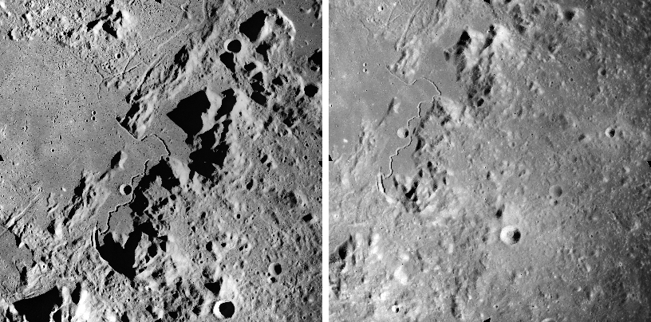
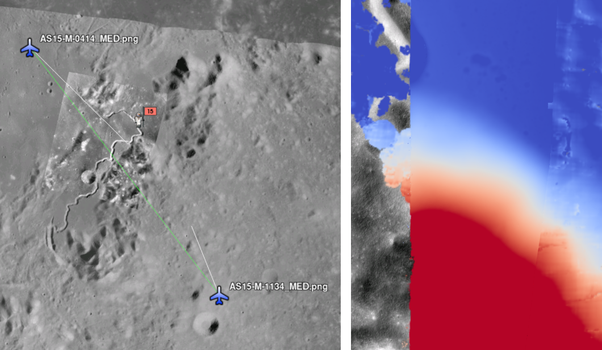
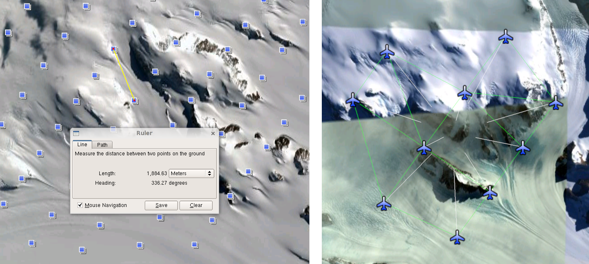
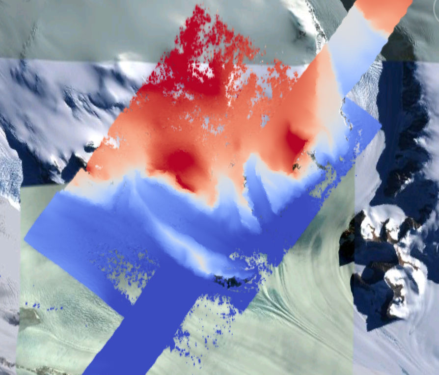

.. _sfm:

Solving for camera poses based on images
========================================

The ASP tool ``camera_solve`` offers several ways to find the true
position of frame camera images that do not come with any attached pose
metadata. This can be useful with aerial, hand-held, and historical
images for which such information may be incomplete or inaccurate.

An overview of the tool and examples are provided in this chapter.
Reference information for this tool can be found in :numref:`camera_solve`.

This tool can be optionally bypassed if, for example, the longitude and
latitude of the corners of all images are known (:numref:`imagecorners`).

Camera solve overview
---------------------

The ``camera_solve`` tool is implemented as a Python wrapper around two
other tools. The first of these is the the THEIA software library, which
is used to generate initial camera position estimates in a local
coordinate space. You can learn more about THEIA at
http://www.theia-sfm.org/index.html. The second tool is ASP's own
``bundle_adjust`` tool. The second step improves the solution to account
for lens distortion and transforms the solution from local to global
coordinates by making use of additional input data.

The tool only solves for the extrinsic camera parameters and the
user must provide intrinsic camera information. You can use the
``camera_calibrate`` tool (see :numref:`camera_calibrate`) or other
camera calibration software to solve for intrinsic parameters if
you have access to the camera in question. The camera calibration
information must be contained in a .tsai pinhole camera model file
and must passed in using the ``--calib-file`` option. You can find
descriptions of our supported pinhole camera models in
:numref:`pinholemodels`.

If no intrinsic camera information is known, it can be guessed by doing
some experimentation. This is discussed in :numref:`findintrinsics`.

In order to transform the camera models from local to world coordinates,
one of three pieces of information may be used. These sources are listed
below and described in more detail in the examples that follow:

-  A set of ground control points of the same type used by ``pc_align``.
   The easiest way to generate these points is to use the ground control
   point writer tool available in the ``stereo-gui`` tool.

-  A set of estimated camera positions (perhaps from a GPS unit) stored
   in a csv file.

-  A DEM which a local point cloud can be registered to using
   ``pc_align``. This method can be more accurate if estimated camera
   positions are also used. The user must perform alignment to a DEM,
   that step is not handled by ``camera_solve``.

Power users can tweak the individual steps that ``camera_solve`` goes
through to optimize their results. This primarily involves setting up a
custom flag file for THEIA and/or passing in settings to
``bundle_adjust``.

.. _sfmgeneric:

Example: Apollo 15 Metric Camera
--------------------------------

To demonstrate the ability of the Ames Stereo Pipeline to process a
generic frame camera we use images from the Apollo 15 Metric camera. The
calibration information for this camera is available online and we have
accurate digital terrain models we can use to verify our results.

First download a pair of images::

   > wget http://apollo.sese.asu.edu/data/metric/AS15/png/AS15-M-0414_MED.png
   > wget http://apollo.sese.asu.edu/data/metric/AS15/png/AS15-M-1134_MED.png

   The two Apollo 15 images (AS15-M-0414 and AS15-M-1134).

In order to make the example run faster we use downsampled versions of
the original images. The images at those links have already been
downsampled by a factor of :math:`4 \sqrt{2}` from the original images.
This means that the effective pixel size has increased from five microns
(0.005 millimeters) to 0.028284 millimeters.

The next step is to fill out the rest of the pinhole camera model
information we need. Using the data sheets available at
http://apollo.sese.asu.edu/SUPPORT_DATA/AS15_SIMBAY_SUMMARY.pdf we can
find the lens distortion parameters for metric camera. Looking at the
ASP lens distortion models in :numref:`pinholemodels`, we see that the description
matches ASP's Brown-Conrady model. Using the example in the appendix we
can fill out the rest of the sensor model file (metric_model.tsai) so it
looks as follows::

   VERSION_3
   fu = 76.080
   fv = 76.080
   cu = 57.246816
   cv = 57.246816
   u_direction = 1  0  0
   v_direction = 0  1  0
   w_direction = 0  0  1
   C = 0 0 0
   R = 1 0 0 0 1 0 0 0 1
   pitch = 0.028284
   BrownConrady
   xp = -0.006
   yp = -0.002
   k1 = -0.13361854e-5
   k2 = 0.52261757e-09
   k3 = -0.50728336e-13
   p1 = -0.54958195e-06
   p2 = -0.46089420e-10
   phi = 2.9659070

These parameters use units of millimeters so we have to convert the
nominal center point of the images from 2024 pixels to units of
millimeters. Note that for some older images like these the nominal
image center can be checked by looking for some sort of marking around
the image borders that indicates where the center should lie. For these
pictures there are black triangles at the center positions and they line
up nicely with the center of the image. Before we try to solve for the
camera positions we can run a simple tool to check the quality of our
camera model file::

   > undistort_image AS15-M-0414_MED.png metric_model.tsai -o corrected_414.tif

It is difficult to tell if the distortion model is correct by using this
tool but it should be obvious if there are any gross errors in your
camera model file such as incorrect units or missing parameters. In this
case the tool will fail to run or will produce a significantly distorted
image. For certain distortion models the ``undistort_image`` tool may
take a long time to run.

If your input images are not all from the same camera or were scanned
such that the center point is not at the same pixel, you can run
``camera_solve`` with one camera model file per input image. To do so
pass a space-separated list of files surrounded by quotes to the
``--calib-file`` option such as
``--calib-file "c1.tsai c2.tsai c3.tsai"``.

If we do not see any obvious problems we can go ahead and run the
``camera_solve`` tool::

   > camera_solve out/ AS15-M-0414_MED.png AS15-M-1134_MED.png --datum D_MOON \
     --calib-file metric_model.tsai

We should get some camera models in the output folder and see a printout
of the final bundle adjustment error among the program output
information::

   Cost:
   Initial                          1.450385e+01
   Final                            7.461198e+00
   Change                           7.042649e+00

We can't generate a DEM with these local camera models but we can run
stereo anyways and look at the intersection error in the fourth band of
the ``PC.tif`` file. While there are many speckles in this example where
stereo correlation failed the mean intersection error is low and we
don't see any evidence of lens distortion error.

::

   > stereo AS15-M-0414_MED.png AS15-M-1134_MED.png out/AS15-M-0414_MED.png.final.tsai \
     out/AS15-M-1134_MED.png.final.tsai -t pinhole s_local/out  --corr-timeout 300 \
     --erode-max-size 100
   > gdalinfo -stats s_local/out-PC.tif
   ...
   Band 4 Block=256x256 Type=Float32, ColorInterp=Undefined
     Minimum=0.000, Maximum=56.845, Mean=0.340, StdDev=3.512
     Metadata:
       STATISTICS_MAXIMUM=56.844654083252
       STATISTICS_MEAN=0.33962282293374
       STATISTICS_MINIMUM=0
       STATISTICS_STDDEV=3.5124044818554

The tool ``point2mesh`` (:numref:`point2mesh`) can be
used to obtain a visualizable mesh from the point cloud.

In order to generate a useful DEM, we need to move our cameras from
local coordinates to global coordinates. The easiest way to do this
is to obtain known ground control points (GCPs) which can be
identified in the frame images. This will allow an accurate positioning
of the cameras provided that the GCPs and the camera model parameters
are accurate. To create GCPs see the instructions for the ``stereo_gui``
tool in :numref:`bagcp`. For the Moon there are several ways to get
DEMs and in this case we generated GCPs using ``stereo_gui`` and a
DEM generated from LRONAC images.

After running this command::

   > camera_solve out_gcp/ AS15-M-0414_MED.png AS15-M-1134_MED.png --datum D_MOON \
     --calib-file metric_model.tsai --gcp-file ground_control_points.gcp

we end up with results that can be compared with the a DEM created from
LRONAC images. The stereo results on the Apollo 15 images leave
something to be desired but the DEM they produced has been moved to the
correct location. You can easily visualize the output camera positions
using the ``orbitviz`` tool with the ``--load-camera-solve`` option as
shown below. Green lines between camera positions mean that a sufficient
number of matching interest points were found between those two images.

For GCP to be usable, they can be one of two kinds. The preferred option
is for each of at least three GCP to show up in more than one image.
Then their triangulated positions can be determined in local coordinates
and in global (world) coordinates, and ``bundle_adjust`` will be able to
compute the transform between these coordinate systems, and convert the
cameras to world coordinates.

If this is not possible, then at least two of the images should have at
least three GCP each, and they need not be shared among the images. For
example, for each image the longitude, latitude, and height of each of
its four corners can be known. Then, one can pass such a GCP file to
``camera_solve`` and also with the flag::

     --bundle-adjust-params "--transform-cameras-using-gcp"

and it will attempt to transform the cameras to world coordinates.

Next, one can run stereo.
::

   > stereo AS15-M-0414_MED.png AS15-M-1134_MED.png out_gcp/AS15-M-0414_MED.png.final.tsai \
     out_gcp/AS15-M-1134_MED.png.final.tsai -t nadirpinhole s_global/out  --corr-timeout 300 \
     --erode-max-size 100
   > orbitviz -t nadirpinhole -r moon out_gcp --load-camera-solve

   Left: Solved-for camera positions plotted using orbitviz.  Right:
   A narrow LRONAC DEM overlaid on the resulting DEM, both colormapped
   to the same elevation range.

ASP also supports the method of initializing the ``camera_solve`` tool
with estimated camera positions. This method will not move the cameras
to exactly the right location but it should get them fairly close and at
the correct scale, hopefully close enough to be used as-is or to be
refined using ``pc_align`` or some other method. To use this method,
pass additional bundle adjust parameters to ``camera_solve`` similar to
the following line::

   --bundle-adjust-params '--camera-positions nav.csv \
    --csv-format "1:file 12:lat 13:lon 14:height_above_datum" --camera-weight 0.2'

The nav data file you use must have a column (the "file" column)
containing a string that can be matched to the input image files passed
to ``camera_solve``. The tool looks for strings that are fully contained
inside one of the image file names, so for example the field value
``2009_10_20_0778`` would be matched with the input file
``2009_10_20_0778.JPG``.

:numref:`nextsteps` will discuss the ``parallel_stereo`` program
in more detail and the other tools in ASP.

.. _sfmicebridge:

Example: IceBridge DMS Camera
-----------------------------

The DMS (Digital Mapping System) Camera is a frame camera flown on as
part of the NASA IceBridge program to collect images of
polar and Antarctic terrain (http://nsidc.org/icebridge/portal/) that
we can use to produce digital terrain.

To process this data the steps are very similar to the steps described
above for the Apollo Metric camera but there are some aspects which
are particular to IceBridge. You can download DMS images from
ftp://n5eil01u.ecs.nsidc.org/SAN2/ICEBRIDGE_FTP/IODMS0_DMSraw_v01/. A
list of the available data types can be found at
https://nsidc.org/data/icebridge/instr_data_summary.html. This
example uses data from the November 5, 2009 flight over Antarctica.
The following camera model (icebridge_model.tsai) was used (see
:numref:`pinholemodels` on Pinhole camera models)::

   VERSION_3
   fu = 28.429
   fv = 28.429
   cu = 17.9712
   cv = 11.9808
   u_direction = 1  0  0
   v_direction = 0  1  0
   w_direction = 0  0  1
   C = 0 0 0
   R = 1 0 0 0 1 0 0 0 1
   pitch = 0.0064
   Photometrix
   xp = 0.004
   yp = -0.191
   k1 = 1.31024e-04
   k2 = -2.05354e-07
   k3 = -5.28558e-011
   p1 = 7.2359e-006
   p2 = 2.2656e-006
   b1 = 0.0
   b2 = 0.0

Note that these images are RGB format which is not supported by all ASP
tools. To use the files with ASP, first convert them to single channel
images using a tool such as ImageMagick's ``convert``,
``gdal_translate``, or ``gdal_edit.py``. Different conversion methods
may produce slightly different results depending on the contents of your
input images. Some conversion command examples are shown below::

   convert rgb.jpg -colorspace Gray gray.jpg
   gdal_calc.py  --overwrite --type=Float32 --NoDataValue=-32768       \
     -A rgb.tif --A_band=1 -B rgb.tif --B_band=2 -C rgb.tif            \
     --C_band=3 --outfile=gray.tif --calc="A*0.2989+B*0.5870+C*0.1140"
   gdal_translate -b 1 rgb.jpg gray.jpg

In the third command we used ``gdal_translate`` to pick a single band
rather than combining the three.

Obtaining ground control points for icy locations on Earth can be
particularly difficult because they are not well surveyed or because
the terrain shifts over time. This may force you to use estimated
camera positions to convert the local camera models into global
coordinates. To make this easier for IceBridge data sets, ASP
provides the ``icebridge_kmz_to_csv`` tool (see
:numref:`icebridgekmztocsv`) which extracts a list of estimated
camera positions from the kmz files available for each IceBridge
flight at http://asapdata.arc.nasa.gov/dms/missions.html.

Another option which is useful when processing IceBridge data is the
``--position-filter-dist`` option for ``bundle_adjust``. IceBridge data
sets contain a large number of images and when processing many at once
you can significantly decrease your processing time by using this option
to limit interest-point matching to image pairs which are actually close
enough to overlap. A good way to determine what distance to use is to
load the camera position kmz file from their website into Google Earth
and use the ruler tool to measure the distance between a pair of frames
that are as far apart as you want to match. Commands using these options
may look like this::

   icebridge_kmz_to_csv  1000123_DMS_Frame_Events.kmz  camera_positions.csv
   camera_solve out 2009_11_05_00667.JPG 2009_11_05_00668.JPG  \
     2009_11_05_00669.JPG 2009_11_05_00670.JPG  2009_11_05_02947.JPG 2009_11_05_02948.JPG \
     2009_11_05_02949.JPG  2009_11_05_02950.JPG  2009_11_05_01381.JPG 2009_11_05_01382.JPG  \
     --datum WGS84 --calib-file icebridge_model.tsai  \
     --bundle-adjust-params '--camera-positions camera_positions.csv \
     --csv-format "1:file 2:lon 3:lat 4:height_above_datum" --position-filter-dist 2000'
   orbitviz out --load-camera-solve --hide-labels -r wgs84 -t nadirpinhole

Alternatively, the ``camera_solve`` executable can be bypassed
altogether. If a given image has already an orthoimage associated with
it (check the IceBridge portal page), that provides enough information
to guess an initial position of the camera, using the ``ortho2pinhole``
tool. Later, the obtained cameras can be bundle-adjusted. Here is how
this tool can be used, on grayscale images::

    ortho2pinhole raw_image.tif ortho_image.tif icebridge_model.tsai output_pinhole.tsai

   Left: Measuring the distance between estimated frame locations using Google Earth
   and an IceBridge kmz file.  The kmz file is from the IceBridge website with no modifications.
   Using a position filter distance of 2000 meters will mostly limit image IP matching
   in this case to each image's immediate "neighbors".  Right: Display of ``camera_solve``
   results for ten IceBridge images using ``orbitviz``.

Some IceBridge flights contain data from the Land, Vegetation, and Ice
Sensor (LVIS) lidar which can be used to register DEMs created using DMS
images. LVIS data can be downloaded at
ftp://n5eil01u.ecs.nsidc.org/SAN2/ICEBRIDGE/ILVIS2.001/. The lidar data
comes in plain text files that ``pc_align`` and ``point2dem`` can parse
using the following option:: 

     --csv-format "5:lat 4:lon 6:height_above_datum"  

ASP provides the ``lvis2kml`` tool to help visualize the coverage and
terrain contained in LVIS files, see :numref:`lvis2kml`
for details. The LVIS lidar coverage is sparse compared to the image
coverage and you will have difficulty getting a good registration unless
the region has terrain features such as hills or you are registering
very large point clouds that overlap with the lidar coverage across a
wide area. Otherwise ``pc_align`` will simply slide the flat terrain to
an incorrect location to produce a low-error fit with the narrow lidar
tracks. This test case was specifically chosen to provide strong terrain
features to make alignment more accurate but ``pc_align`` still failed
to produce a good fit until the lidar point cloud was converted into a
smoothed DEM.

::

   stereo 2009_11_05_02948.JPG  2009_11_05_02949.JPG  out/2009_11_05_02948.JPG.final.tsai \
     out/2009_11_05_02949.JPG.final.tsai st_run/out -t nadirpinhole
   point2dem ILVIS2_AQ2009_1105_R1408_055812.TXT --datum WGS_1984 \
     --t_srs "+proj=stere +lat_0=-90 +lon_0=0 +k=1 +x_0=0 +y_0=0 +datum=WGS84 +units=m +no_defs" \
     --csv-format "5:lat 4:lon 6:height_above_datum"  --tr 30  \
     --search-radius-factor 2.0 -o lvis
   pc_align  --max-displacement 1000 lvis-DEM.tif st_run/out-PC.tif  -o align_run/out \
     --save-transformed-source-points --datum wgs84 --outlier-ratio 0.55
   point2dem align_run/out-trans_source.tif --datum WGS_1984 \
     --t_srs "+proj=stere +lat_0=-90 +lon_0=0 +k=1 +x_0=0 +y_0=0 +datum=WGS84 +units=m +no_defs"
   colormap align_run_big/out-trans_source-DEM.tif --min 200 --max 1500
   colormap lvis-DEM.tif --min 200 --max 1500
   image2qtree lvis-DEM_CMAP.tif
   image2qtree align_run_big/out-trans_source-DEM_CMAP.tif

   LVIS lidar DEM overlaid on the ASP created DEM, both colormapped to
   the same elevation range. The ASP DEM could be improved but the
   registration is accurate. Notice how narrow the LVIS lidar coverage
   is compared to the field of view of the camera. You may want to
   experiment using the SGM algorithm to improve the coverage.

Other IceBridge flights contain data from the Airborne Topographic
Mapper (ATM) lidar sensor. Data from this sensor comes packed in one of
several formats (variants of .qi or .h5) so ASP provides the
``extract_icebridge_ATM_points`` tool to convert them into plain text
files, which later can be read into other ASP tools using the
formatting::

     --csv-format "1:lat 2:lon 3:height_above_datum"

To run the tool, just pass in the name of the input file as an argument
and a new file with a csv extension will be created in the same
directory. Using the ATM sensor data is similar to using the LVIS sensor
data.

For some IceBridge flights, lidar-aligned DEM files generated from the
DMS image files are available, see the web page here:
http://nsidc.org/data/iodms3 These files are improperly formatted and
cannot be used by ASP as is. To correct them, run the
``correct_icebridge_l3_dem`` tool as follows::

   correct_icebridge_l3_dem IODMS3_20120315_21152106_07371_DEM.tif  fixed_dem.tif 1  

The third argument should be 1 if the DEM is in the northern hemisphere
and 0 otherwise. The corrected DEM files can be used with ASP like any
other DEM file.

:numref:`nextsteps` will discuss the ``parallel_stereo`` program
in more detail and the other tools in ASP.

.. _imagecorners:

Solving for pinhole cameras using GCP
-------------------------------------

If for a given image the intrinsics of the camera are known, and also
the longitude and latitude (and optionally the heights above the datum)
of its corners (or of some other pixels in the image), one can bypass
the ``camera_solve`` tool and use ``bundle_adjust`` to get a rough
initial camera position and orientation. This simple approach is often
beneficial when, for example, one has historical images with rough
geo-location information. Once a rough camera is created for each image,
the cameras can then be bundle-adjusted jointly to refine them.

To achieve this, one creates a camera file, say called ``init.tsai``,
with only the intrinsics, and using trivial values for the camera center
and rotation matrix::

   VERSION_3
   fu = 28.429
   fv = 28.429
   cu = 17.9712
   cv = 11.9808
   u_direction = 1  0  0
   v_direction = 0  1  0
   w_direction = 0  0  1
   C = 0 0 0
   R = 1 0 0 0 1 0 0 0 1
   pitch = 0.0064
   Photometrix
   xp = 0.004
   yp = -0.191
   k1 = 1.31024e-04
   k2 = -2.05354e-07
   k3 = -5.28558e-011
   p1 = 7.2359e-006
   p2 = 2.2656e-006
   b1 = 0.0
   b2 = 0.0

Next, one creates a ground control points (GCP) file (:numref:`bagcp`),
named, for example, ``gcp.gcp``, containing the pixel positions and
longitude and latitude of the corners or other known pixels (the
heights above datum can be set to zero if not known). Here is a
sample file, where the image is named ``img.tif`` (below the latitude
is written before the longitude).

::

   # id   lat     lon   height  sigmas  image   corners    sigmas
      1  37.62  -122.38   0     1 1 1  img.tif 0     0     1 1 
      2  37.62  -122.35   0     1 1 1  img.tif 2560  0     1 1 
      3  37.61  -122.35   0     1 1 1  img.tif 2560 1080   1 1 
      4  37.61  -122.39   0     1 1 1  img.tif 0    1080   1 1 

Such a file can be created with ``stereo_gui`` (:numref:`creatinggcp`).

One runs bundle adjustment with this data::

   bundle_adjust -t nadirpinhole img.tif init.tsai gcp.gcp -o ba/run           \
      --datum WGS84 --inline-adjustments --camera-weight 0 --max-iterations 0  \
      --robust-threshold 10

which will write the desired correctly oriented camera file. Using a
positive number of iterations will refine the camera.

It is important to look at the residual file::

     run/run-final_residuals_pointmap.csv

after this. The third column in this file is the optimized heights above
the datum, while the fourth column has the reprojection errors from the
corners on the ground into the camera.

If bundle adjustment is invoked with a positive number of iterations,
and with a small value for the robust threshold, it tends to optimize
only some of the corners and ignore the others, resulting in a large
reprojection error, which is not desirable. If however, this threshold
is too large, it may try to optimize the camera too aggressively,
resulting in a poorly placed camera.

Sometimes it works to just get a rough camera estimate from this tool
for each image individually, using zero iterations, as above, and then
bundle adjust all images together with the obtained rough cameras and
possibly also using the GCP files, this time with a positive number of
iterations.

One can also use the bundle adjustment option ``--fix-gcp-xyz`` to not
move the GCP during optimization, hence forcing the cameras to move more
to conform to them.

ASP provides a tool named ``cam_gen`` which can also create a pinhole
camera as above, and, in addition, is able to extract the heights of the
corners from a DEM (:numref:`cam_gen`).

.. _findintrinsics:

Solving for intrinsic camera parameters
---------------------------------------

If nothing is known about the intrinsic camera parameters, it may be
possible to guess them with some experimentation. One can assume that
the distortion is non-existent, and that the optical center is at the
image center, which makes it possible to compute *cu* and
*cv*. The pitch can be set to some small number, say
:math:`10^{-3}` or :math:`10^{-4}.` The focal length can be initialized
to equal *cu* or a multiple of it. Then ``camera_solve`` can be
invoked, followed by ``parallel_stereo``, ``point2mesh``, and
``point2dem --errorimage``. If, at least towards the center of the
image, things are not exploding, we are on a good track.

Later, the camera parameters, especially the focal length, can be
modified manually, and instead of using ``camera_solve`` again, just
``bundle_adjust`` can be called using the camera models found earlier,
with the options to float some of the intrinsics, that is using
``--solve-intrinsics`` and ``--intrinsics-to-float``.

If the overall results look good, but the intersection error after
invoking ``point2dem`` around the image corners looks large, it is time
to use some distortion model and float it, again using
``bundle_adjust``. Sometimes if invoking this tool over many iterations
the optical center and focal length may drift, and hence it may be
helpful to have them fixed while solving for distortion.

If a pre-existing DEM is available, the tool ``geodiff`` can be used to
compare it with what ASP is creating.

Such a pre-existing DEM can be used as a constraint when solving for
intrinsics, as described in :numref:`floatingintrinsics`.
