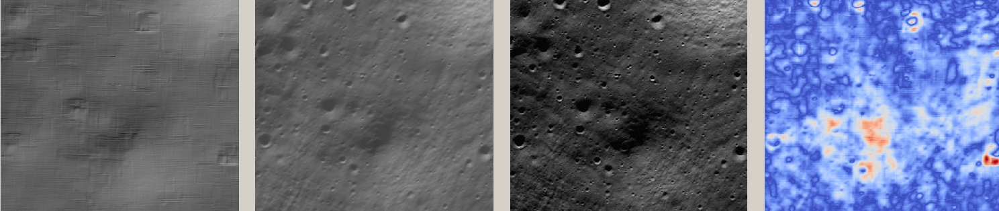
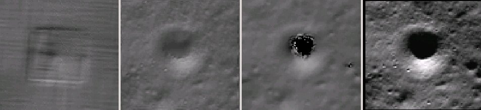

.. sfs:

Shape-from-Shading
==================

ASP provides a tool, named ``sfs``, that can improve the level of detail
of DEMs created by ASP or any other source using *shape-from-shading*
(SfS). The tool takes as input one or more camera images, a DEM at
roughly the same resolution as the images, and returns a refined DEM.

``sfs`` works only with ISIS cub images. It has been tested thoroughly
with Lunar LRO NAC datasets, and some experiments were done with Mars
HiRISE images and with pictures from Charon, Pluto’s moon. As seen later
in the text, it returns reasonable results on the Moon as far as
85° and even 89.6° South.

Currently, ``sfs`` is computationally expensive, and is practical only
for DEMs whose width and height are several thousand pixels. It can be
sensitive to errors in the position and orientation of the cameras, the
accuracy of the initial DEM, and to the value of the two weights it
uses. Yet, with some effort, it can work quite well.

A tool named ``parallel_sfs`` is provided (:numref:`parallel_sfs`)
that parallelizes ``sfs`` using multiple processes (optionally on
multiple machines) by splitting the input DEM into tiles with padding,
running ``sfs`` on each tile, and then blending the results.

The ``sfs`` program can model position-dependent albedo, different
exposure values for each camera, shadows in the input images, and
regions in the DEM occluded from the Sun. It can refine the positions
and orientations of the cameras.

The tool works by minimizing the cost function

.. math::

   \label{cost}
     % \begin{multline}\label{cost}
     \int\!\! \int \! \sum_k \left[ I_k(\phi)(x, y) - T_k A(x, y)
       R_k(\phi)(x, y) \right]^2\,  
     % R_k(\phi)(x, y) \right]^2\,  \\
     + \mu \left\|\nabla^2 \phi(x, y) \right\|^2  
     + \lambda  \left[ \phi(x, y) - \phi_0(x, y) \right]^2
     \, dx\, dy.

Here, :math:`I_k(\phi)(x, y)` is the :math:`k`-th camera image
interpolated at pixels obtained by projecting into the camera 3D points
from the terrain :math:`\phi(x, y)`, :math:`T_k` is the :math:`k`-th
image exposure, :math:`A(x, y)` is the per-pixel albedo,
:math:`R_k(\phi)(x, y)` is the reflectance computed from the terrain for
:math:`k`-th image, :math:`\left\|\nabla^2 \phi(x, y) \right\|^2` is the
sum of squares of all second-order partial derivatives of :math:`\phi`,
:math:`\mu > 0` is a smoothing term, and :math:`\lambda > 0` determines
how close we should stay to the input terrain :math:`\phi_0` (smaller
:math:`\mu` will show more detail but may introduce some artifacts, and
smaller :math:`\lambda` may allow for more flexibility in optimization
but the terrain may move too far from the input).

We use either the regular Lambertian reflectance model, or the
Lunar-Lambertian model :cite:`mcewen1991photometric`, more
specifically as given in :cite:`lohse2006derivation`
(equations (3) and (4)). Also supported is the Hapke model,
:cite:`johnson2006spectrophotometric`,
:cite:`fernando2013surface`,
:cite:`hapke2008bidirectional`,
:cite:`hapke1993opposition`. Custom values for the
coefficients of these models can be passed to the program.

How to get good test images
---------------------------

We obtain the images from http://wms.lroc.asu.edu/lroc/search (we search
for EDR images of type NACL and NACR).

A faster (but not as complete) interface is provided by
http://ode.rsl.wustl.edu/moon/indexproductsearch.aspx. The related site
http://ode.rsl.wustl.edu/moon/indextools.aspx?displaypage=lolardr can
provide LOLA datasets which can be used as (sparse) ground truth.

We advise the following strategy for picking images. First choose a
small longitude-latitude window in which to perform a search for
images. Pick two images that are very close in time and with a big
amount of overlap (ideally they would have consecutive orbit numbers).
Those can be passed to ASP’s ``stereo`` tool to create an initial DEM.
Then, search for other images close to the center of the maximum overlap
of the first two images. Pick one or more of those, ideally with
different illumination conditions than the first two. Those (together
with one of the first two images) can be used for SfS.

To locate the area of spatial overlap, the images can be map-projected
(either with ``cam2map`` with a coarse resolution) or with
``mapproject``, using for example the LOLA DEM as the terrain to project
onto, or the DEM obtained from running ``stereo`` on those images. Then
the images can be overlayed in ``stereo_gui``. A good sanity check is to
examine the shadows in various images. If they point in different
directions in the images and perhaps also have different lengths, that
means that illumination conditions are different enough, which will help
constrain the ``sfs`` problem better.

Running sfs at 1 meter/pixel using a single image
-------------------------------------------------

In both this and the next sections we will work with LRO NAC images
taken close to the Lunar South Pole, at a latitude of 85°
South (the tool was tested on equatorial regions as well). We will use
four images, M139939938LE, M139946735RE, M173004270LE, and M122270273LE.

We first retrieve the data sets.

::

     wget http://lroc.sese.asu.edu/data/LRO-L-LROC-2-EDR-V1.0/ \
          LROLRC_0005/DATA/SCI/2010267/NAC/M139939938LE.IMG
     wget http://lroc.sese.asu.edu/data/LRO-L-LROC-2-EDR-V1.0/ \
          LROLRC_0005/DATA/SCI/2010267/NAC/M139946735RE.IMG
     wget http://lroc.sese.asu.edu/data/LRO-L-LROC-2-EDR-V1.0/ \
          LROLRC_0009/DATA/SCI/2011284/NAC/M173004270LE.IMG
     wget http://lroc.sese.asu.edu/data/LRO-L-LROC-2-EDR-V1.0/ \
          LROLRC_0002/DATA/MAP/2010062/NAC/M122270273LE.IMG

Then we convert them to ISIS cubes, initialize the SPICE kernels, and
perform radiometric calibration and echo correction. Here are the steps,
illustrated on the first image::

     lronac2isis from = M139939938LE.IMG     to = M139939938LE.cub
     spiceinit   from = M139939938LE.cub
     lronaccal   from = M139939938LE.cub     to = M139939938LE.cal.cub
     lronacecho  from = M139939938LE.cal.cub to = M139939938LE.cal.echo.cub

We rename, for simplicity, the obtained four processed datasets to
A.cub, B.cub, C.cub, and D.cub.

The first step is to run stereo to create an initial guess DEM. We
picked for this the first two of these images. These form a stereo pair,
that is, they have a reasonable baseline and sufficiently close times of
acquisition (hence very similar illuminations). These conditions are
necessary to obtain a good stereo result.

::

   parallel_stereo --job-size-w 1024 --job-size-h 1024 A.cub B.cub    \
                   --left-image-crop-win 0 7998 2728 2696             \
                   --right-image-crop-win 0 9377 2733 2505            \
                   --threads 16 --corr-seed-mode 1  --subpixel-mode 3 \
                   run_full1/run

Next we create a DEM at 1 meter/pixel, which is about the resolution of
the input images. We use the stereographic projection since this dataset
is very close to the South Pole. Then we crop it to the region we’d like
to do SfS on.

::

     point2dem -r moon --stereographic --proj-lon 0 \
       --proj-lat -90 run_full1/run-PC.tif
     gdal_translate -projwin -15471.9 150986 -14986.7 150549  \
       run_full1/run-DEM.tif run_full1/run-crop-DEM.tif

This creates a DEM of size 456 |times| 410 pixels.

Then we run ``sfs``::

     sfs -i run_full1/run-crop-DEM.tif A.cub -o sfs_ref1/run           \
        --reflectance-type 1                                           \
       --smoothness-weight 0.08 --initial-dem-constraint-weight 0.0001 \
       --max-iterations 10 --use-approx-camera-models                  \
       --crop-input-images

The smoothness weight is a parameter that needs tuning. If it is too
small, SfS will return noisy results, if it is too large, too much
detail will be blurred. Here we used the Lunar Lambertian model. The
meaning of the other ``sfs`` options can be looked up in :numref:`sfs`.

We show the results of running this program in :numref:`sfs1`. The
left-most figure is the hill-shaded original DEM, which was obtained
by running::

     hillshade --azimuth 300 --elevation 20 run_full1/run-crop-DEM.tif \
       -o run_full1/run-crop-hill.tif 

The second image is the hill-shaded DEM obtained after running ``sfs``
for 10 iterations.

The third image is, for comparison, the map-projection of A.cub onto the
original DEM, obtained via the command::

     mapproject --tr 1 run_full1/run-crop-DEM.tif A.cub A_map.tif --tile-size 128

The forth image is the colored absolute difference between the original
DEM and the SfS output, obtained by running::

     geodiff --absolute sfs_ref1/run-DEM-final.tif run_full1/run-crop-DEM.tif
     colormap --min 0 --max 2 --colormap-style binary-red-blue \
       run-DEM-final__run-crop-DEM-diff.tif

   An illustration of ``sfs``. The images are, from left to right, the
   original hill-shaded DEM, the hill-shaded DEM obtained from ``sfs``,
   the image A.cub map-projected onto the original DEM, and the absolute
   difference of the original and final DEM, where the brightest shade
   of red corresponds to a 2 meter height difference.

It can be seen that the optimized DEM provides a wealth of detail and
looks quite similar to the input image. It also did not diverge
significantly from the input DEM. We will see in the next section that
SfS is in fact able to make the refined DEM more accurate than the
initial guess (as compared to some known ground truth), though that is
not guaranteed, and most likely did not happen here where just one image
was used.

SfS with multiple images in the presence of shadows
---------------------------------------------------

In this section we will run ``sfs`` with multiple images. We would like
to be able to see if SfS improves the accuracy of the DEM rather than
just adding detail to it. We evaluate this using the following
(admittedly imperfect) approach. We resample the original images by a
factor of 10, run stereo with them, followed by SfS using the stereo
result as an initial guess and with the resampled images. As ground
truth, we create a DEM from the original images at 1 meter/pixel, which
we bring closer to the initial guess for SfS using ``pc_align``. We
would like to know if running SfS brings us even closer to this “ground
truth” DEM.

The most significant challenge in running SfS with multiple images is
that shape-from-shading is highly sensitive to errors in camera position
and orientation. The ``sfs`` tool can improve these by floating them
during optimization and by using a coarse-to-fine scheme, where the
problem is first solved using subsampled images and terrain then it is
successively refined.

If possible, it may still be desirable to bundle-adjust the cameras
first (:numref:`bundle_adjust`). It is important to
note that bundle adjustment may fail if the images have sufficiently
different illumination, as it will not be able to find matches among
images. A solution to this is discussed in :numref:`sfs-lola`.

To make bundle adjustment and stereo faster, we first crop the images,
such as shown below (the crop parameters can be determined via
``stereo_gui``).

::

     crop from = A.cub to = A_crop.cub sample = 1 line = 6644 nsamples = 2192 nlines = 4982
     crop from = B.cub to = B_crop.cub sample = 1 line = 7013 nsamples = 2531 nlines = 7337
     crop from = C.cub to = C_crop.cub sample = 1 line = 1 nsamples = 2531 nlines = 8305
     crop from = D.cub to = D_crop.cub sample = 1 line = 1 nsamples = 2531 nlines = 2740

Then we bundle-adjust and run stereo

::

     bundle_adjust A_crop.cub B_crop.cub C_crop.cub D_crop.cub    \
       --min-matches 1 -o run_ba/run
     stereo A_crop.cub B_crop.cub run_full2/run --subpixel-mode 3 \
       --bundle-adjust-prefix run_ba/run

This will result in a point cloud, ``run_full2/run-PC.tif``, which will
lead us to the “ground truth” DEM. As mentioned before, we’ll in fact
run SfS with images subsampled by a factor of 10. Subsampling is done by
running the ISIS ``reduce`` command::

     for f in A B C D; do 
       reduce from = ${f}_crop.cub to = ${f}_crop_sub10.cub sscale = 10 lscale = 10
     done

We run bundle adjustment and stereo with the subsampled images using
commands analogous to the above::

     bundle_adjust A_crop_sub10.cub B_crop_sub10.cub C_crop_sub10.cub D_crop_sub10.cub \
       --min-matches 1 -o run_ba_sub10/run --ip-per-tile 100000
     stereo A_crop_sub10.cub B_crop_sub10.cub run_sub10/run --subpixel-mode 3           \
      --bundle-adjust-prefix run_ba_sub10/run

We’ll obtain a point cloud named ``run_sub10/run-PC.tif``.

We’ll bring the “ground truth” point cloud closer to the initial guess
for SfS using ``pc_align``::

     pc_align --max-displacement 200 run_full2/run-PC.tif run_sub10/run-PC.tif \
       -o run_full2/run --save-inv-transformed-reference-points

This step is extremely important. Since we ran two bundle adjustment
steps, and both were without ground control points, the resulting clouds
may differ by a large translation, which we correct here. Hence we would
like to make the “ground truth” terrain aligned with the datasets on
which we will perform SfS.

Next we create the “ground truth” DEM from the aligned high-resolution
point cloud, and crop it to a desired region::

     point2dem -r moon --tr 10 --stereographic --proj-lon 0 --proj-lat -90 \
       run_full2/run-trans_reference.tif
     gdal_translate -projwin -15540.7 151403 -14554.5 150473               \
       run_full2/run-trans_reference-DEM.tif run_full2/run-crop-DEM.tif

We repeat the same steps for the initial guess for SfS::

     point2dem -r moon --tr 10 --stereographic --proj-lon 0 --proj-lat -90 \
       run_sub10/run-PC.tif
     gdal_translate -projwin -15540.7 151403 -14554.5 150473               \
       run_sub10/run-DEM.tif run_sub10/run-crop-DEM.tif

After this, we run ``sfs`` itself. Since our dataset has many shadows,
we found that specifying the shadow thresholds for the tool improves the
results. The thresholds can be determined using ``stereo_gui``. This can
be done by turning on shadow-threshold mode from the GUI menu, and then
clicking on a few points in the shadows. Then the thresholded images can
be visualized/updated from the menu as well, and this process can be
iterated.

::

     sfs -i run_sub10/run-crop-DEM.tif A_crop_sub10.cub C_crop_sub10.cub \
       D_crop_sub10.cub -o sfs_sub10_ref1/run --threads 4                \
       --smoothness-weight 0.12 --initial-dem-constraint-weight 0.0001   \
       --reflectance-type 1 --float-exposure                             \
       --float-cameras --use-approx-camera-models                        \
       --max-iterations 10  --crop-input-images                          \
       --bundle-adjust-prefix run_ba_sub10/run                           \
       --shadow-thresholds "0.00162484 0.0012166 0.000781663"

We compare the initial guess to ``sfs`` to the “ground truth” DEM
obtained earlier and the same for the final refined DEM using
``geodiff`` as in the previous section. Before SfS::

     geodiff --absolute run_full2/run-crop-DEM.tif run_sub10/run-crop-DEM.tif
     gdalinfo -stats run-crop-DEM__run-crop-DEM-diff.tif | grep Mean=  

and after SfS::

     geodiff --absolute run_full2/run-crop-DEM.tif sfs_sub10_ref1/run-DEM-final.tif
     gdalinfo -stats run-crop-DEM__run-DEM-final-diff.tif | grep Mean=

The mean error goes from 2.64 m to 1.29 m, while the standard deviation
decreases from 2.50 m to 1.29 m. Visually the refined DEM looks more
detailed as well as seen in :numref:`sfs2`. The same
experiment can be repeated with the Lambertian reflectance model
(reflectance-type 0), and then it is seen that it performs a little
worse.

We also show in this figure the first of the images used for SfS,
``A_crop_sub10.cub``, map-projected upon the optimized DEM. Note that we
use the previously computed bundle-adjusted cameras when map-projecting,
otherwise the image will show as shifted from its true location::

     mapproject sfs_sub10_ref1/run-DEM-final.tif A_crop_sub10.cub A_crop_sub10_map.tif \
       --bundle-adjust-prefix run_ba_sub10/run

   An illustration of ``sfs``. The images are, from left to right, the
   hill-shaded initial guess DEM for SfS, the hill-shaded DEM obtained
   from ``sfs``, the “ground truth” DEM, and the first of the images
   used in SfS map-projected onto the optimized DEM.

.. _sfs-lola:

Dealing with large camera errors and LOLA comparison
----------------------------------------------------

SfS is very sensitive to errors in camera positions and orientations.
These can be optimized as part of the problem, but if they are too far
off, the solution will not be correct. In the previous section we used
bundle adjustment to correct these errors, and then we passed the
adjusted cameras to ``sfs``. However, bundle adjustment may often fail,
simply because the illumination conditions can be very different among
the images, and interest point matching may not succeed.

The option ``-–coarse-levels int`` can be passed to ``sfs``, to solve
for the terrain using a multi-resolution approach, first starting at a
coarse level, where camera errors have less of an impact, and then
jointly optimizing the cameras and the terrain at ever increasing levels
of resolution. Yet, this may still fail if the terrain does not have
large and pronounced features on the scale bigger than the errors in the
cameras.

The approach that we found to work all the time is to find interest
points in the images, first automatically, and if that fails then
manually, as the human eye is much more skilled at identifying a given
landmark in multiple images, even when the lightning changes
drastically. Picking about 4 landmarks in each image (if doing it
manually) is sufficient. Ideally they should be positioned far from each
other, to improve the accuracy.

Below is one example of how we select interest points, run SfS, and then
compare to LOLA, which is an independently acquired sparse dataset of 3D
points on the Moon. According to :cite:`smith2011results`,
the LOLA accuracy is on the order of 1 m. To ensure a meaningful
comparison of stereo and SfS with LOLA, we resample the LRO NAC images
by a factor of 4, making them nominally 4 m/pixel. This is not strictly
necessary, the same exercise can be repeated with the original images,
but it is easier to see the improvement due to SfS when comparing to
LOLA when the images are coarser than the LOLA error itself.

We work with the same images as before. They are resampled as follows::

     for f in A B C D; do 
       reduce from = ${f}_crop.cub to = ${f}_crop_sub4.cub sscale=4 lscale=4
     done

The ``stereo`` and ``point2dem`` tools are run to get a first-cut DEM.
Bundle adjustment is not done at this stage yet.

::

     stereo A_crop_sub4.cub B_crop_sub4.cub run_stereo_noba_sub4/run --subpixel-mode 3
     point2dem --stereographic --proj-lon -5.7113451 --proj-lat -85.000351 \
       run_stereo_noba_sub4/run-PC.tif --tr 4 

We would like now to automatically or manually pick interest points
for the purpose of doing bundle adjustment. It much easier to compute
these if the images are first mapprojected, which brings them all
into the same perspective. This approach is described in :numref:`mapip`,
and here just the relevant commands are shown.

::

     for f in A B C D; do 
       mapproject --tr 4 run_stereo_noba_sub4/run-DEM.tif ${f}_crop_sub4.cub \
         ${f}_crop_sub4_v1.tif --tile-size 128
     done

(Optional manual interest point picking in the mapprojected images can
happen here.)

::

     P='A_crop_sub4_v1.tif B_crop_sub4_v1.tif' # to avoid long lines below
     Q='C_crop_sub4_v1.tif D_crop_sub4_v1.tif run_stereo_noba_sub4/run-DEM.tif'
     bundle_adjust A_crop_sub4.cub B_crop_sub4.cub C_crop_sub4.cub D_crop_sub4.cub  \
       -o run_ba_sub4/run --mapprojected-data  "$P $Q"                              \
       --min-matches 1

An illustration is shown in :numref:`sfs3`.

.. figure:: images/sfs3.jpg
   :name: sfs3
   :alt: interest points manually picked manually

   An illustration of how interest points are picked manually for the
   purpose of bundle adjustment and then SfS.

A good sanity check to ensure that at this stage cameras are aligned
properly is to map-project using the newly obtained camera adjustments
and then overlay the obtained images in the GUI. The features in all
images should be perfectly on top of each other.

::

     for f in A B C D; do 
       mapproject --tr 4 run_stereo_noba_sub4/run-DEM.tif ${f}_crop_sub4.cub  \
        ${f}_crop_sub4_v2.tif --tile-size 128 --bundle-adjust-prefix run_ba_sub4/run
     done

This will also show where the images overlap, and hence on what portion
of the DEM we can run SfS.

Then we run stereo, followed by SfS.

::

     stereo A_crop_sub4.cub B_crop_sub4.cub run_stereo_yesba_sub4/run             \
       --subpixel-mode 3 --bundle-adjust-prefix run_ba_sub4/run
     point2dem --stereographic --proj-lon -5.7113451 --proj-lat -85.000351        \
       run_stereo_yesba_sub4/run-PC.tif --tr 4
     gdal_translate -srcwin 138 347 273 506 run_stereo_yesba_sub4/run-DEM.tif     \
       run_stereo_yesba_sub4/run-crop1-DEM.tif 
     sfs -i run_stereo_yesba_sub4/run-crop1-DEM.tif A_crop_sub4.cub               \
       C_crop_sub4.cub D_crop_sub4.cub -o sfs_sub4_ref1_th_reg0.12_wt0.001/run    \
       --shadow-thresholds '0.00149055 0.00138248 0.000747531'                    \
       --threads 4 --smoothness-weight 0.12 --initial-dem-constraint-weight 0.001 \
       --reflectance-type 1 --float-exposure --float-cameras --max-iterations 20  \
       --use-approx-camera-models --crop-input-images                             \
       --bundle-adjust-prefix run_ba_sub4/run

We fetch the portion of the LOLA dataset around the current DEM from the
site described earlier, and save it as
``RDR_354E355E_85p5S84SPointPerRow_csv_table.csv``. It is necessary to
align our stereo DEM with this dataset to be able to compare them. We
choose to bring the LOLA dataset into the coordinate system of the DEM,
using::

     pc_align --max-displacement 280 run_stereo_yesba_sub4/run-DEM.tif             \
       RDR_354E355E_85p5S84SPointPerRow_csv_table.csv -o run_stereo_yesba_sub4/run \
       --save-transformed-source-points

Then we compare to the aligned LOLA dataset the input to SfS and its
output::

     geodiff --absolute -o beg --csv-format '1:lon 2:lat 3:radius_km' \
       run_stereo_yesba_sub4/run-crop1-DEM.tif run_stereo_yesba_sub4/run-trans_source.csv
     geodiff --absolute -o end --csv-format '1:lon 2:lat 3:radius_km' \
       sfs_sub4_ref1_th_reg0.12_wt0.001/run-DEM-final.tif             \
       run_stereo_yesba_sub4/run-trans_source.csv

We see that the mean error between the DEM and LOLA goes down, after
SfS, from 1.14 m to 0.90 m, while the standard deviation decreases from
1.18 m to 1.06 m.

Running SfS with an external initial guess DEM and extreme illumination
-----------------------------------------------------------------------

Here we will illustrate how SfS can be run in a very difficult
situation. We chose a site very close to the Lunar South Pole, at around
89.7° South. We used an external DEM as an initial guess
terrain, in this case the LOLA gridded DEM, as such a DEM has values in
permanently shadowed regions. The terrain size is 5 km by 5 km at 1
meter/pixel (we also ran a 10 km by 10 km region in the same location).

Here the topography is very steep, the shadows are very long and vary
drastically from image to image, and some portions of the terrain show
up only in some images. All this makes it very hard to register images
to each other and to the ground. We solved this by choosing very
carefully a large set of representative images.

The first step is to fetch the underlying LOLA DEM. We use the 20
meter/pixel one, resampled to 1 meter/pixel, creating a DEM named
``ref.tif``.

::

      wget http://imbrium.mit.edu/DATA/LOLA_GDR/POLAR/IMG/LDEM_80S_20M.IMG
      wget http://imbrium.mit.edu/DATA/LOLA_GDR/POLAR/IMG/LDEM_80S_20M.LBL
      pds2isis from = LDEM_80S_20M.LBL to = ldem_80s_20m.cub
      image_calc -c "0.5*var_0" ldem_80s_20m.cub -o ldem_80s_20m_scale.tif
      gdal_translate -projwin -7050.500 -5759.500 -1919.500 -10890.500 \
        ldem_80s_20m_scale.tif ldem_80s_20m_scale_crop.tif
      gdalwarp -r cubicspline -tr 1 1 ldem_80s_20m_scale_crop.tif ref.tif

Note that we scaled its heights by 0.5 per the information in the LBL
file.

By far the hardest part of this exercise is choosing the images. We
downloaded several hundred of them by visiting the web site noted
earlier and searching by the longitude-latitude bounds. The .IMG images
were converted to .cub as before, and they were mapprojected onto the
reference DEM, initially at a lower resolution to get a preview of
things.

The mapprojected images were mosaicked together using ``dem_mosaic``
with the option ``--block-max``, with a large value of ``--block-size``
(larger than the image size), and using the ``--t_projwin`` option to
specify the region of interest (in ``stereo_gui`` one can find this
region by selecting it with Control-Mouse). When the mosaicking tool
runs, the sum of pixels in the current region for each image will be
printed to the screen. Images with a positive sum of pixels are likely
to contribute to the desired region.

The obtained subset of images should be sorted by the Sun azimuth (this
angle is printed when running ``sfs`` with the ``--query`` option on the
.cub files). Out of those, the following were kept::

     M114859732RE.cal.echo.cub       73.1771
     M148012947LE.cal.echo.cub       75.9232
     M147992619RE.cal.echo.cub       78.7806
     M152979020RE.cal.echo.cub       96.895
     M117241732LE.cal.echo.cub       97.9219
     M152924707RE.cal.echo.cub       104.529
     M150366876RE.cal.echo.cub       104.626
     M152897611RE.cal.echo.cub       108.337
     M152856903RE.cal.echo.cub       114.057
     M140021445LE.cal.echo.cub       121.838
     M157843789LE.cal.echo.cub       130.831
     M157830228LE.cal.echo.cub       132.74
     M157830228RE.cal.echo.cub       132.74
     M157809893RE.cal.echo.cub       135.604
     M139743255RE.cal.echo.cub       161.014
     M139729686RE.cal.echo.cub       162.926
     M139709342LE.cal.echo.cub       165.791
     M139695762LE.cal.echo.cub       167.704
     M142240314RE.cal.echo.cub       168.682
     M142226765RE.cal.echo.cub       170.588
     M142213197LE.cal.echo.cub       172.497
     M132001536LE.cal.echo.cub       175.515
     M103870068LE.cal.echo.cub       183.501
     M103841430LE.cal.echo.cub       187.544
     M142104686LE.cal.echo.cub       187.765
     M162499044LE.cal.echo.cub       192.747
     M162492261LE.cal.echo.cub       193.704
     M162485477LE.cal.echo.cub       194.662
     M162478694LE.cal.echo.cub       195.62
     M103776992RE.cal.echo.cub       196.643
     M103776992LE.cal.echo.cub       196.643

(the Sun azimuth is shown on the right, in degrees). These were then
mapprojected onto the reference DEM at 1 m/pixel using the South Pole
stereographic projection specified in this DEM. The
``parallel_bundle_adjust`` tool is employed to co-register the images
and correct camera errors.

::

        parallel_bundle_adjust --processes 8 --ip-per-tile 1000 --overlap-limit 30   \
          --num-iterations 100 --num-passes 2 --min-matches 1 --datum D_MOON         \
          <images> --mapprojected-data '<mapprojected images> ref.tif' -o ba/run

For bundle adjustment we in fact used even more images that overlap with
this area, but likely this set is sufficient, and it is this set that
was used later for shape-from-shading. Here more bundle adjustment
iterations are desirable, but this step takes too long. And a large
``--ip-per-tile`` can make a difference in images with rather different
different illumination conditions but it can also slow down the process
a lot.

It is very important to have a lot of images during bundle adjustment,
to ensure that there are enough overlaps and sufficiently similar
illumination conditions among them for bundle adjustment to
succeed. Later, just a subset can be used for shape-from-shading, enough
to cover the entire region, preferable with multiple illumination
conditions at each location.

Towards the poles the sun may describe a full loop in the sky, and hence
the earliest images (sorted by azimuth) may become similar to the latest
ones. To find matches between these, one could re-run the command above
with say 15 images from the beginning of the list and 15 images from the
end of the list, using again 30 as the overlap limit, just to create
extra matches. Then, one can run the bundle adjust command again,
setting this time the overlap limit to something very large, and in
addition using the option ``--skip-matching``. This won't create
new matches, but will ensure, due to the earlier commands, that each
image is matched to a few subsequent images in the list, and images from
the top of the list are also matched to images from the bottom of the
list. In the future a less manual way of achieving this may be used.

A very critical part of the process is aligning the obtained cameras to
the ground::

       pc_align --max-displacement 400 --save-transformed-source-points              \
         --compute-translation-only --csv-format '1:lon 2:lat 3:height_above_datum'  \
         ref.tif ba/run-final_residuals_no_loss_function_pointmap_point_log.csv      \
         -o ba/run 

The value of ``--max-displacement`` could be too high perhaps, it is
suggested to also experiment with half of that and keep the result that
has the smaller error.

The flag ``--compute-translation-only`` turned out to be necessary as
``pc_align`` was introducing a bogus rotation.

The obtained alignment transform can be applied to the cameras to make
them aligned to the ground::

       mkdir -p ba_align
       /bin/cp -fv ba/run* ba_align
       bundle_adjust --skip-matching --num-iterations 0 --force-reuse-match-files \
         --num-passes 1 --initial-transform ba/run-transform.txt                  \
         --input-adjustments-prefix ba/run <images> -o ba_align/run

The images should now be projected onto this DEM as::

      mapproject --tr 1 --bundle-adjust-prefix ba_align/run \
        ref.tif image.cub image.map.tif

are precisely on top of each other and on top of the LOLA DEM. If any
shifts are noticed, with the images relative to each other, or to this
DEM, that is a sign of some issues.  If the shift is relative to this
DEM, perhaps one can try the alignment above with a different value of
the max displacement.

There are occasions in which the alignment transform is still not
accurate enough. Then, one can refine the cameras using the reference
terrain as a constraint in bundle adjustment::

       mkdir -p ba_align_ref
       /bin/cp -fv ba_align/run* ba_align_ref
       bundle_adjust --skip-matching --num-iterations 5 --force-reuse-match-files   \
         --num-passes 1 --input-adjustments-prefix ba_align/run <images>            \
         --camera-weight 0 --heights-from-dem ref.tif --heights-from-dem-weight 0.1 \ 
          --heights-from-dem-robust-threshold 10 -o ba_align_ref/run

After mapprojecting with the newly refined cameras in ``ba_align_ref``,
any residual alignment errors should go away. The value used for
``--heights-from-dem-weight`` may need some experimentation. The
reference DEM has vertical error as well, so of this value is too high,
it may bind too tightly to this somewhat inaccurate DEM. Yet, making it
too low may not constrain sufficiently the uncertainty that exists in
the height of triangulated points after bundle adjustment, which is
rather high since LRO NAC is mostly looking down so the convergence
angle among any rays going through matching interest points is small.

It is suggested that the user examine the file::

     ba_align_ref/run-final_residuals_no_loss_function_pointmap_point_log.csv

to see if the reprojection errors (column 4) are reasonably small, say
mostly on the order of 0.1 pixels. The triangulated point cloud from
this file should also hopefully be close to the reference DEM. Their
difference is found as::

     geodiff --absolute                                                         \
       --csv-format '1:lon 2:lat 3:height_above_datum' ref.tif                  \
       ba_align_ref/run-final_residuals_no_loss_function_pointmap_point_log.csv \
       -o ba_align_ref/run

Some of the differences that will be saved to disk are likely outliers,
but mostly they should be small, perhaps on the order of 1 meter.

The file 

   ba_align_ref/run-final_residuals_no_loss_function_raw_pixels.txt

should also be examined. It has the ``x`` and ``y`` pixel residuals for each pixel.
The norm of each pixel residual can be computed, and their median 
can be found (at some point this will be done automatically). Images
for which the median pixel residual is larger than 1 pixel or which 
have too few such residuals should be excluded from running SfS,
as likely for those the cameras are not correctly positioned. 

If, even after this step, the mapprojected images fail to be perfectly
on top of each other, or areas with poor coverage exist, more images
with intermediate illumination conditions and more terrain coverage
should be added and the process should be restarted. As a last resort,
any images that do not overlay correctly must be removed from
consideration for the shape-from-shading step.

Next, SfS follows::

      parallel_sfs -i ref.tif <images> --shadow-thresholds '<thresholds>'  \
        --bundle-adjust-prefix ba_align_ref/run -o sfs/run                 \ 
        --use-approx-camera-models --crop-input-images                     \
        --blending-dist 10 --min-blend-size 100 --threads 4                \
        --smoothness-weight 0.08 --initial-dem-constraint-weight 0.0001    \
        --reflectance-type 1 --max-iterations 5  --save-sparingly          \
        --tile-size 200 --padding 50 --num-processes 20                    \
        --nodes-list <machine list>

The shadow thresholds were chosen here to be 0.003.

The first step that will happen when this is launched is computing the
exposures. That one can be a bit slow, and can be done offline, using
the flag ``--compute-exposures-only`` in this tool, and then the
computed exposures can be passed to the command above via the
``--image-exposures-prefix`` option.

The obtained shape-from-shading terrain should be studied carefully to
see if it shows any systematic shift or rotation compared to the initial
LOLA gridded terrain. If that is the case, another step of alignment can
be used. This time one can do features-based alignment rather than based
on point-to-point calculations. This one works better on
lower-resolution versions of the inputs (say at sub8 versions of the
DEMs, as created ``stereo_gui``), as follows:

  pc_align --initial-transform-from-hillshading rigid                   \
     ref_sub8.tif sfs_dem_sub8.tif -o align_sub8/run --num-iterations 0 \
     --max-displacement -1

That alignment transform can then be applied to the full SfS DEM:

 pc_align --initial-transform align_sub8/run-transform.txt \
   ref.tif sfs_dem.tif -o align/run --num-iterations 0     \
   --max-displacement -1 --save-transformed-source-points

The aligned SfS DEM can be regenerated from the obtained cloud as:

  point2dem --tr 1 --search-radius-factor 2 --t_srs projection_str \
    align/run-trans_source.tif

Here, the projection string should be the same one as in the reference 
LOLA DEM named ref.tif. It can be found by invoking 

  gdalinfo -proj4 ref.tif

and looking for the value of the ``PROJ.4`` field.

The obtained alignment transform can also be applied to the camera
adjustments, as done earlier in the text, and one can regenerate the SfS
DEM and mapprojected images using the updated cameras.

The ``geodiff`` tool can be deployed to see how the SfS DEM compares
to the initial guess or to the raw ungridded LOLA measurements.

To create a maximally lit mosaic one can mosaic together all the mapprojected
images using the same camera adjustments that were used for SfS. That is
done as follows:

  dem_mosaic --max -o max_lit.tif image1.map.tif .... imageN.map.tif

.. _sfsinsights:

Insights for getting the most of SfS
------------------------------------

Here are a few suggestions we have found helpful when running ``sfs``:

-  First determine the appropriate smoothing weight :math:`\mu` by
   running a small clip, and using just one image. A value between 0.06
   and 0.12 seems to work all the time with LRO NAC, even when the
   images are subsampled. The other weight, :math:`\lambda,` can be set
   to something small, like :math:`0.0001.` This can be increased to
   :math:`0.001` if noticing that the output DEM strays too far.

-  As stated before, more images with more diverse illumination
   conditions result in more accurate terrain. Ideally there should be
   at least 3 images, with the shadows being, respectively, on the left,
   right, and then perhaps missing or small.

-  Bundle-adjustment for multiple images is crucial, to eliminate camera
   errors which will result in ``sfs`` converging to a local minimum.
   This is described in :numref:`sfs-lola`.

-  Floating the albedo (option ``--float-albedo``) can introduce
   instability and divergence, it should be avoided unless obvious
   albedo variation is seen in the images.

-  Floating the DEM at the boundary (option ``--float-dem-at-boundary``)
   is also suggested to be avoided.

-  Overall, the best strategy is to first use SfS for a single image and
   not float any variables except the DEM being optimized, and then
   gradually add images and float more variables and select whichever
   approach seems to give better results.

-  If an input DEM is large, it may not be completely covered by a
   single set of images with various illumination conditions. It should
   then be broken up into smaller regions (with overlap), the SfS
   problem can be solved on each region, and then every output terrain
   can be transformed using ``pc_align`` into LOLA’s global coordinate
   system, where they can be mosaicked together using ``dem_mosaic``.
   Or, ``sfs`` can be run not on one clip, but on an entire collection
   of clips covering this area to get the adjustments, and then
   ``parallel_sfs`` can be run as described in the previous section.

   The easier case is when at least the two images in the stereo pair
   cover the entire terrain. Then, portions of this terrain can be used
   as an initial guess for each SfS sub-problem (even as the other
   images used for SfS change), the results can be mosaicked, and the
   alignment to LOLA can happen just once, after mosaicking. This
   approach is preferable, if feasible, as alignment to LOLA is more
   accurate if the terrain to align is larger in extent.

-  The ``mapproject`` program can be used to map-project each image onto
   the resulting SfS DEM (with the camera adjustments solved using SfS).
   These orthoimages can be mosaicked using ``dem_mosaic``. If the
   ``--max`` option is used with this tool, it create a mosaic with the
   most illuminated pixels from this image. If during SfS the camera
   adjustments were solved accurately, this mosaic should have little or
   no blur.

-  For challenging datasets it is suggested to first work at 1/4th of
   the full resolution (the resolution of an ISIS cube can be changed
   using the ``reduce`` command, and the DEM can be made coarser with
   ``gdalwarp`` or by converting it to a cloud with ``pc_align`` with
   zero iterations and then regenerated with ``point2dem``). This should
   make the whole process perhaps an order of magnitude faster. Any
   obtained camera adjustment files are still usable at the full
   resolution (after an appropriate rename), but it is suggested that
   these adjustments be reoptimized using the full resolution cameras,
   hence these should be initial guesses for ``bundle_adjust``'s
   ``--input-adjustments-prefix`` option.

 .. |times| unicode:: U+00D7 .. MULTIPLICATION SIGN
