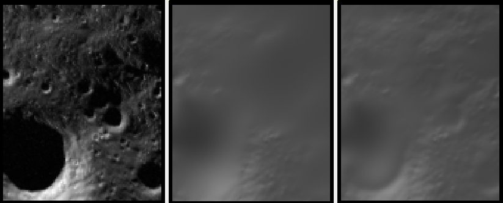
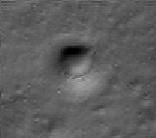
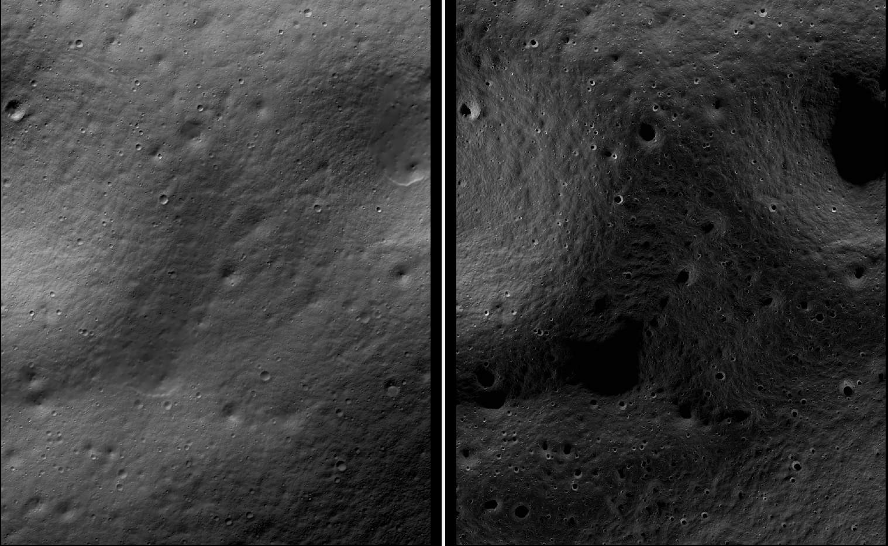

.. _sfs_usage:

Overview of SfS
---------------

ASP provides a tool, named ``sfs`` (:numref:`sfs`), that can improve the level
of detail of DEMs created by ASP or any other source using *shape-from-shading*
(SfS). This program takes as input one or more images and cameras, a DEM at
roughly the same resolution as the images, and returns a refined DEM.

The modeling approach is described in :cite:`alexandrov2018multiview`.

The ``sfs`` program works with any cameras supported by ASP, for Earth and other
planets. The option ``--sun-angles`` can be used to to specify the Sun
information for each image. For ISIS and CSM cameras, if this option is not set,
the needed information is read from the camera files.

The ``sfs`` program can model position-dependent albedo (:numref:`sfs_albedo`),
exposure values for each camera, atmospheric haze, shadows in the input images,
and regions in the DEM occluded from the Sun.

A program named ``parallel_sfs`` is provided (:numref:`parallel_sfs`)
that parallelizes ``sfs`` using multiple processes (optionally on
multiple machines) by splitting the input DEM into tiles with padding,
running ``sfs`` on each tile, and then blending the results. It was used
to create DEMs of dimensions 10,000 by 10,000 pixels.

.. _sfs_examples:

Examples
--------

 - A single image example with LRO NAC Lunar images (:numref:`sfs_single_image`).
 - A small example with multiple LRO NAC images (:numref:`sfs_multiview`).
 - Large-scale SfS with LRO NAC images (:numref:`sfs-lola`).
 - Kaguya Lunar images (:numref:`sfs_kaguya`).
 - Earth example, with atmospheric haze (:numref:`sfs_earth`).
 - CTX Mars example (:numref:`sfs_ctx`).

Limitations
-----------

This program is experimental. It assumes a certain reflectance model
of the surface, which may or may not be accurate for a given setting. 

``sfs`` is very sensitive to errors in the position and
orientation of the cameras, the accuracy of the initial DEM, and to
the value of the weights it uses.

``sfs`` has been tested thoroughly with Lunar LRO NAC datasets.
As can be seen below, ``sfs`` returns reasonable results on the Moon
as far as 85 degrees and even 89.6 degrees South.

SfS was shown to give reasonable results with CTX Mars images
(:numref:`sfs_ctx`). The improvement is real, but somewhat modest. 

An example for Earth is :numref:`sfs_earth`, that shows that our program can
give plausible results.

The program was employed successfully for Mercury (:cite:`bertone2023highly`).

It is suggested to invoke this tool with a terrain model that is
already reasonably accurate, and with images with diverse illumination
conditions registered to it, when ``sfs`` can do fine-level
refinements.

.. _sfs_formulation:

Mathematical model
------------------

This program works by minimizing the cost function

.. math::

   \label{cost}
     \int\!\! \int \! \sum_k \left[ I_k(\phi(x, y)) - T_k A(x, y)
       R_k(\phi(x, y)) - H_k\right]^2\, \\ 
     + \mu \left\|\nabla^2 \phi(x, y) \right\|^2  
     + \lambda  \left[ \phi(x, y) - \phi_0(x, y) \right]^2
     \, dx\, dy.

Here, :math:`I_k(\phi(x, y))` is the :math:`k`-th camera image
interpolated at pixels obtained by projecting into the camera 3D points
from the terrain :math:`\phi(x, y)`, :math:`T_k` is the :math:`k`-th
image exposure, :math:`A(x, y)` is the per-pixel normalized albedo,
:math:`R_k(\phi(x, y))` is the reflectance computed from the terrain for
:math:`k`-th image, :math:`\left\|\nabla^2 \phi(x, y) \right\|^2` is the
sum of squares of all second-order partial derivatives of :math:`\phi`.

The term :math:`H_k` is the atmospheric haze, which is assumed to be zero
for the Moon but is modeled for Earth and Mars.

The value :math:`\mu > 0` is a smoothness weight, and :math:`\lambda > 0`
determines how close we should stay to the input terrain :math:`\phi_0` (smaller
:math:`\mu` will show more detail but may introduce some artifacts, and smaller
:math:`\lambda` may allow for more flexibility in optimization but the terrain
may move too far from the input).

We use either the regular Lambertian reflectance model, or the
Lunar-Lambertian model :cite:`mcewen1991photometric`, more
specifically as given in :cite:`lohse2006derivation` (equations (3)
and (4)). Also supported is the Hapke model,
:cite:`johnson2006spectrophotometric`, :cite:`fernando2013surface`,
:cite:`hapke2008bidirectional`, :cite:`hapke1993opposition`. Custom
values for the coefficients of these models can be passed to the
program.

Note that the albedo in the above expression is normalized, its
nominal value is 1.  The image intensity ideally equals the image
exposure times albedo times reflectance, hence the image exposure
absorbs any existing constant multiplier.

The exposure value for a camera is computed as the average of the image
intensity divided by the average reflectance, both computed over the DEM.
If the problem is parallelized using ``parallel_sfs``, the exposures
are found just once, over the entire DEM, rather than for each tile.
The exposures can be optimized while solving for the DEM.

It is important to note that the default Lunar-Lambertian model may
not be the right choice for other planetary bodies, hence some
research may be needed to decide the correct model for your
application.

.. _fetch_lro_images:

How to get images
-----------------

We obtain the images from http://wms.lroc.asu.edu/lroc/search (search
for EDR images of type NACL and NACR).

A faster (but not as complete) interface is provided by
http://ode.rsl.wustl.edu/moon/indexproductsearch.aspx.
This site allows for bulk downloads, but does not permit datasets
bigger than several tens of GB, so several attempts may be necessary.

The related site http://ode.rsl.wustl.edu/moon/indextools.aspx?displaypage=lolardr 
can provide LOLA datasets which can be used as (sparse) ground truth.

If desired to use a gridded LOLA DEM as an initial guess, see
:numref:`sfs-lola`.

We advise the following strategy for picking images. First choose a
small longitude-latitude window in which to perform a search for
images. Pick two images that are very close in time and with a big
amount of overlap (ideally they would have consecutive orbit numbers).
A good convergence angle is expected (:numref:`stereo_pairs`).
Those images can be passed to ASP's ``parallel_stereo`` tool to create an
initial DEM.  Then, search for other images close to the center of the
maximum overlap of the first two images. Pick one or more of those,
ideally with different illumination conditions than the first
two. Those (together with one of the first two images) can be used for
SfS.

To locate the area of spatial overlap, the images can be map-projected
(either with ``cam2map`` with a coarse resolution) or with
``mapproject``, using for example the LOLA DEM as the terrain to
project onto, or the DEM obtained from running ``parallel_stereo`` on
those images. Then the images can be overlaid as georeferenced images
in ``stereo_gui`` (:numref:`stereo_gui`). A good sanity check is to
examine the shadows in various images. If they point in different
directions in the images and perhaps also have different lengths, that
means that illumination conditions are different enough, which will
help constrain the ``sfs`` problem better.

An example for how to download and prepare the datasets is shown
in :numref:`sfs_single_image`.

.. _sfs_isis_vs_csm:

ISIS vs CSM models
------------------

CSM (:numref:`csm`) is a modern sensor model which can be used with
multiple threads, and can be on the order of 7-15 times faster than the
ISIS .cub model it is meant to replace, as benchmarked with
``mapproject``, ``bundle_adjust``, and ``sfs``.

Given a dataset of ISIS .cub camera files it is desired to run SfS on,
it is suggested to attempt to convert them to corresponding CSM models
as described in :numref:`create_csm_linescan`, and if the pixel errors as
output by ``cam_test`` are no more than the order of 0.5 pixels, to
use the CSM models instead of the ISIS ones in all the tools outlined
below (``parallel_bundle_adjust``, ``parallel_stereo``,
``mapproject``, and ``parallel_sfs``). The SfS DEMs obtained with
these two methods were observed to differ by several millimeters at
most, on average, but an evaluation may be necessary for your
particular case.

This will work only for the datasets of the original dimensions, so
not when the ``reduce`` or ``crop`` commands were used on the data.

Any of the commands further down which only use .cub files can be
adapted for use with CSM cameras by appending to those commands the
CSM .json cameras in the same order as the .cub files, from which only
the image information will then be used, with the camera information
coming from the .json files.

For example, if ``sfs`` is run with an ISIS camera as::

  sfs --use-approx-camera-models\
   --crop-input-images          \
    -i input_dem.tif image.cub  \
    -o sfs_isis/run

then, the corresponding command using the CSM model will be::

  sfs --crop-input-images \
    -i input_dem.tif      \
    image.cub image.json  \
    -o sfs_csm/run

The option ``--use-approx-camera-models`` is no longer necessary
as the CSM model is fast enough. It is however suggested to still
keep the ``--crop-input-images`` option. 

.. _sfs_single_image:

SfS at 1 meter/pixel using a single image
-----------------------------------------

In both this and the next sections we will work with LRO NAC images
taken close to the Lunar South Pole, at a latitude of 85 degrees
South (the tool was tested on equatorial regions as well). We will use
four images, M139939938LE, M139946735RE, M173004270LE, and M122270273LE.

Data preparation
^^^^^^^^^^^^^^^^

Fetch the images::

    wget http://lroc.sese.asu.edu/data/LRO-L-LROC-2-EDR-V1.0/LROLRC_0005/DATA/SCI/2010267/NAC/M139939938LE.IMG
    wget http://lroc.sese.asu.edu/data/LRO-L-LROC-2-EDR-V1.0/LROLRC_0005/DATA/SCI/2010267/NAC/M139946735RE.IMG
    wget http://lroc.sese.asu.edu/data/LRO-L-LROC-2-EDR-V1.0/LROLRC_0009/DATA/SCI/2011284/NAC/M173004270LE.IMG
    wget http://lroc.sese.asu.edu/data/LRO-L-LROC-2-EDR-V1.0/LROLRC_0002/DATA/MAP/2010062/NAC/M122270273LE.IMG

We convert these to ISIS cubes, initialize the SPICE kernels, and
perform radiometric calibration and echo correction. That is explained
in :numref:`lro_nac_no_stitch`.

It can be convenient to create preview versions of these datasets, at
10% of original resolution, for the purpose of inspection. That is
done as follows::

    f=M139939938LE
    reduce from = ${f}.cal.echo.cub to = ${f}.cal.echo.sub10.cub  \
      sscale = 10 lscale = 10

For simplicity, we create we create shorter aliases for these images::

    ln -s M139939938LE.cal.echo.cub A.cub
    ln -s M139946735RE.cal.echo.cub B.cub
    ln -s M173004270LE.cal.echo.cub C.cub
    ln -s M122270273LE.cal.echo.cub D.cub

.. _initial_sfs_dem:

Initial DEM creation
^^^^^^^^^^^^^^^^^^^^

The first step is to run bundle adjustment (:numref:`bundle_adjust`) and stereo
(:numref:`parallel_stereo`) to create an initial guess DEM. We picked for this
the first two of these images. These form a stereo pair
(:numref:`stereo_pairs`), that is, they have a reasonable baseline and
sufficiently close times of acquisition hence very similar illuminations). These
conditions are necessary to obtain a good stereo result.

Below we assume CSM cameras are used (:numref:`sfs_isis_vs_csm`).
Otherwise the ``.json`` files should be omitted. 

::

    bundle_adjust A.cub B.cub A.json B.json   \
      --num-iterations 100 -o ba/run

    parallel_stereo                           \
      --left-image-crop-win 0 7998 2728 2696  \
      --right-image-crop-win 0 9377 2733 2505 \
      --stereo-algorithm asp_mgm              \
      --subpixel-mode 9                       \
      --bundle-adjust-prefix ba/run           \
      A.cub B.cub A.json B.json               \
      run_full1/run

See :numref:`running-stereo` for a discussion about various speed-vs-quality
choices in stereo. See :numref:`mapproj-example` about handling artifacts in
steep terrain. 

The crop windows above were chosen with ``stereo_gui`` (:numref:`stereo_gui`).

Next we create a DEM. We use the stereographic projection since this dataset is
very close to the South Pole. Normally a projection centered close to area of
interest is suggested (:numref:`point2dem_proj`).

::

    point2dem -r moon --stereographic --proj-lon 0  \
      --proj-lat -90 run_full1/run-PC.tif

It is very important that the resolution of the DEM be comparable to the ground
sample distance (GSD) of the images. This will ensure optimal sampling.

SfS can only be run on a DEM with valid data at each grid point.  The
DEM obtained above should be opened in ``stereo_gui``, and the bounds
of a clip having only valid data should be determined
(:numref:`image_bounds`). Such a clip is cropped using
``gdal_translate`` (:numref:`gdal_tools`) as::

    gdal_translate -projwin -15471.9 150986 -14986.7 150549  \
      run_full1/run-DEM.tif run_full1/run-crop-DEM.tif

This creates a DEM clip of size 456 |times| 410 pixels.  

The ``point2dem`` program auto-determines the DEM resolution (grid
size), as an estimate of the image *ground sample distance
(GSD)*. This is the optimal resolution to run SfS at. If creating your
input DEM some other way, it is strongly suggested to use a DEM grid
size not too different from the GSD, in order to get the best
quality. The ``mapproject`` program (:numref:`mapproject`), when
invoked with no input grid size, computes the grid size as the image
GSD, and that value can then be used when creating the input SfS DEM.

If this DEM has holes, those can be filled in ``dem_mosaic``
(:numref:`dem_mosaic_extrapolate`). 

The ``dem_mosaic`` program can also apply some blur to attenuate big artifacts
(:numref:`dem_mosaic_blur`). Use, for example, ``--dem-blur-sigma 2``. Note that
``sfs`` has a smoothness term which should take care of very small
imperfections in the input.

See :numref:`sfs_initial_terrain` for how to use a third-party DEM as input to
SfS. Then, alignment of the cameras to that DEM is needed. This is a multi-step
process, outlined in detail in :numref:`sfs-lola`.

Running SfS
^^^^^^^^^^^

Then we run ``sfs`` on this clip (for a larger clip ``parallel_sfs``
should be used instead, see :numref:`parallel_sfs`)::

    sfs -i run_full1/run-crop-DEM.tif       \
      A.cub A.json                          \
      --use-approx-camera-models            \
      --crop-input-images                   \
      --reflectance-type 1                  \
      --smoothness-weight 0.08              \
      --initial-dem-constraint-weight 0.001 \
      --max-iterations 10                   \
      -o sfs_ref1/run

The smoothness weight is a parameter that needs tuning. If it is too small, SfS
will return noisy results, if it is too large, too much detail will be blurred.
One can experiment with values between 0.01 and 100,000 with a factor of 10 to
find this weight, and then refine it in smaller steps. A discussion of this
term is in :cite:`lesage2021constraints`.

Here we used the Lunar-Lambertian model. The meaning of the other ``sfs``
options can be looked up in :numref:`sfs`.

Normally 5-10 iterations is enough, even when convergence is not reached, as the
solution usually improves quickly at first and only very fine refinements
happen later.

The value of ``--initial-dem-constraint-weight`` is best set to 0 when the
initial DEM is not very reliable, as otherwise defects from it can be inherited
by the SfS result. Otherwise a value between 0.0001 and 0.001 may be good
enough. Use a higher value when the input DEM is reliable but the reflectance
model is not.

See :numref:`sfs_albedo` for modeling of albedo. Shadow thresholds may be needed
to avoid artifacts in shadow. See :numref:`sfs_crater_bottoms` for a potential
solution to flat crater bottoms in areas in shadow.

In the next sections, where SfS will be done with multiple images, more
parameters which can control the quality of the result will be explored.

See :numref:`sfs_outputs` for where ``sfs`` stores its outputs.

See :numref:`sfs_kaguya` for an example of running SfS on Kaguya TC images.

.. _sfs_inspection:

Inspecting the results
^^^^^^^^^^^^^^^^^^^^^^

We show the results of running this program in :numref:`sfs1`. The
left-most figure is the hill-shaded original DEM, which was obtained
by running::

    hillshade --azimuth 300 --elevation 20 run_full1/run-crop-DEM.tif \
      -o run_full1/run-crop-hill.tif 

The second image is the hill-shaded DEM obtained after running ``sfs``
for 10 iterations.

The third image is, for comparison, the map-projection of A.cub onto the
original DEM, obtained via the command::

    mapproject --tr 1 run_full1/run-crop-DEM.tif A.cub A_map.tif \
      --tile-size 1024

(For small DEMs one can use a smaller ``--tile-size`` to start more
subprocesses in parallel to do the mapprojection. That is not needed
with CSM cameras as then ``mapproject`` is multithreaded.)

The fourth image is the colored absolute difference between the
original DEM and the SfS output, obtained by running ``geodiff``
(:numref:`geodiff`)::

    geodiff --absolute sfs_ref1/run-DEM-final.tif \
      run_full1/run-crop-DEM.tif -o out
    colormap --min 0 --max 2 out-diff.tif

.. figure:: images/sfs1.jpg
   :name: sfs1
   :alt: An sfs illustration 

   An illustration of ``sfs``. The images are, from left to right, the
   original hill-shaded DEM, the hill-shaded DEM obtained from ``sfs``,
   the image A.cub map-projected onto the original DEM, and the absolute
   difference of the original and final DEM, where the brightest shade
   of red corresponds to a 2 meter height difference.

It can be seen that the optimized DEM provides a wealth of detail and
looks quite similar to the input image. It also did not diverge
significantly from the input DEM. We will see in the next section that
SfS is in fact able to make the refined DEM more accurate than the
initial guess (as compared to some known ground truth), though that is
not guaranteed, and most likely did not happen here where just one image
was used.

.. _sfs_albedo:

Albedo modeling with one or more images
---------------------------------------

When using a single input image, it may be preferable to avoid floating
(solving for) the albedo (option ``--float-albedo``), hence to have it
set to 1 and kept fixed. The reason for that is because for a single
image it is not possible to distinguish if a bright image area comes
from lighter-colored terrain or from having an inclination which makes
it face the Sun more.

If desired to float the albedo with one image, it is suggested to use
a higher value of ``--initial-dem-constraint-weight`` to constrain the
terrain better in order to make albedo determination more reliable.
The albedo can be prevented from changing too much if the
``--albedo-constraint-weight`` parameter is used.

Albedo should be floated with two or more images, if albedo variations
are clearly visible, and if those images have sufficiently different
illumination conditions, as then the albedo and slope effects can be
separated more easily. For images not having obvious albedo variations
it may be prudent to keep the albedo fixed at the nominal value of 1.

It is important to use appropriate values for the
``--shadow-thresholds`` parameter, as otherwise regions in shadow will
be interpreted as lit terrain with a pitch-black color, and the computed
albedo and terrain will have artifacts.

See :numref:`sfs_outputs` for the produced file having the albedo.

An example showing modeling of albedo (and atmospheric haze) is in
:numref:`sfs_earth`.

.. _sfs_multiview:

SfS with multiple images in the presence of shadows
---------------------------------------------------

In this section we will run ``sfs`` with multiple images. We would
like to be able to see if SfS improves the accuracy of the DEM rather
than just adding detail to it. We evaluate this using the following
(admittedly imperfect) approach. We reduce the resolution of the
original images by a factor of 10, run stereo with them, followed by
SfS using the stereo result as an initial guess and with the resampled
images. As ground truth, we create a DEM from the original images at
the higher resolution of 1 meter/pixel, which we bring closer to the
initial guess for SfS using ``pc_align``. We would like to know if
running SfS brings us even closer to this "ground truth" DEM.

The most significant challenge in running SfS with multiple images is
that shape-from-shading is highly sensitive to errors in camera
position and orientation. It is suggested to bundle-adjust the cameras
first (:numref:`bundle_adjust`). 

It is important to note that bundle adjustment may fail if the images
have very different illumination, as it will not be able to
find matches among images. A solution to this is discussed in
:numref:`sfs-lola`, and it amounts to bridging the gap with more
images of intermediate illumination.

It is strongly suggested that, when doing bundle adjustment, the
images should be specified in the order given by Sun azimuth angle
(see :numref:`sfs_azimuth`). The images should also be mapprojected
and visualized (in the same order), to verify that the illumination is
changing gradually.

To make bundle adjustment and stereo faster, we first crop the images,
such as shown below (the crop parameters can be determined via
``stereo_gui``, :numref:`stereo_gui`).

::

    crop from = A.cub to = A_crop.cub sample = 1 line = 6644 \
      nsamples = 2192 nlines = 4982
    crop from = B.cub to = B_crop.cub sample = 1 line = 7013 \
        nsamples = 2531 nlines = 7337
    crop from = C.cub to = C_crop.cub sample = 1 line = 1    \
      nsamples = 2531 nlines = 8305
    crop from = D.cub to = D_crop.cub sample = 1 line = 1    \
      nsamples = 2531 nlines = 2740

Note that manual cropping is not practical for a very large number of
images. In that case, it is suggested to mapproject the input images
onto some smooth DEM whose extent corresponds to the terrain to be
created with ``sfs`` (with some extra padding), then run bundle
adjustment with mapprojected images (option ``--mapprojected-data``,
illustrated in :numref:`sfs-lola`) and stereo also with
mapprojected images (:numref:`mapproj-example`). This will not only be
automated and faster, but also more accurate, as the inputs will be
more similar after mapprojection.

Bundle adjustment (:numref:`bundle_adjust`) and stereo happens as
follows::

    bundle_adjust A_crop.cub B_crop.cub C_crop.cub D_crop.cub \
      --num-iterations 100 --save-intermediate-cameras        \
      --ip-per-image 20000 --max-pairwise-matches 2000        \
      --min-matches 1 --num-passes 1 -o run_ba/run
    parallel_stereo A_crop.cub B_crop.cub run_full2/run       \
      --subpixel-mode 3 --bundle-adjust-prefix run_ba/run

One can try using the stereo option ``--nodata-value``
(:numref:`stereodefault`) to mask away shadowed regions, which may
result in more holes but less noise in the terrain created from
stereo.

See :numref:`running-stereo` for a discussion about various
speed-vs-quality choices, and :numref:`mapproj-example` about handling
artifacts in steep terrain.  Consider using CSM cameras instead of
ISIS cameras (:numref:`sfs_isis_vs_csm`).

The resulting cloud, ``run_full2/run-PC.tif``, will be used to create
the "ground truth" DEM. As mentioned before, we'll in fact run SfS
with images subsampled by a factor of 10. Subsampling is done by
running the ISIS ``reduce`` command::

    for f in A B C D; do 
      reduce from = ${f}_crop.cub to = ${f}_crop_sub10.cub \
        sscale = 10 lscale = 10
    done

We run bundle adjustment and parallel_stereo with the subsampled
images using commands analogous to the above. It was quite challenging
to find match points, hence the ``--mapprojected-data`` option in
``bundle_adjust`` was used, to find interest matches among
mapprojected images. The the process went as follows::

    # Prepare mapprojected images (see note in the text below)
    parallel_stereo A_crop_sub10.cub B_crop_sub10.cub \
      --subpixel-mode 3 run_sub10_noba/run
    point2dem -r moon --tr 10 --stereographic         \
      --proj-lon 0 --proj-lat -90                     \
      run_sub10_noba/run-PC.tif
    for f in A B C D; do 
      mapproject run_sub10_noba/run-DEM.tif --tr 10   \
        ${f}_crop_sub10.cub ${f}_sub10.map.noba.tif
    done

    # Run bundle adjustment
    bundle_adjust A_crop_sub10.cub B_crop_sub10.cub     \
      C_crop_sub10.cub D_crop_sub10.cub --min-matches 1 \
      --num-iterations 100 --save-intermediate-cameras  \
      -o run_ba_sub10/run --ip-per-image 20000          \
      --max-pairwise-matches 2000 --overlap-limit 50    \
      --match-first-to-last --num-passes 1              \
      --mapprojected-data                               \
      "$(ls [A-D]_sub10.map.noba.tif) run_sub10_noba/run-DEM.tif"
 
It is suggested to use above a DEM not much bigger than the eventual
area of interest, otherwise interest points which are far away may be
created. While that may provide robustness, in some occasions, given
that LRO NAC images are very long and can have jitter, interest points far
away could actually degrade the quality of eventual registration in 
the desired smaller area.

The same resolution should be used for both mapprojected images
(option ``--tr``), and it should be similar to the ground sample
distance of these images.

The option ``--mapprojected-data`` assumes that the images have
been mapprojected without bundle adjustment.

The option ``--max-pairwise-matches`` in ``bundle_adjust`` should
reduce the number of matches to the set value, if too many were
created originally.  

The option ``--overlap-limit`` reduces the number of subsequent images to be
matched to the current one to this value. For a large number of images consider
using the option ``--auto-overlap-params`` which will find which images overlap.
 
Run stereo and create a DEM::

    parallel_stereo A_crop_sub10.cub B_crop_sub10.cub   \
      run_sub10/run --subpixel-mode 3                   \
     --bundle-adjust-prefix run_ba_sub10/run
     point2dem -r moon --tr 10 --stereographic          \
        --proj-lon 0 --proj-lat -90 run_sub10/run-PC.tif 

This will create a point cloud named ``run_sub10/run-PC.tif`` and
a DEM ``run_sub10/run-DEM.tif``.

It is *strongly suggested* to mapproject the bundle-adjusted images
onto this DEM and verify that the obtained images agree::

   for f in A B C D; do 
      mapproject run_sub10/run-DEM.tif               \
        ${f}_crop_sub10.cub ${f}_sub10.map.yesba.tif \
        --bundle-adjust-prefix run_ba_sub10/run
    done
    stereo_gui --use-georef --single-window *yesba.tif

We'll bring the "ground truth" point cloud closer to the initial
guess for SfS using ``pc_align``::

    pc_align --max-displacement 200 run_full2/run-PC.tif \
      run_sub10/run-PC.tif -o run_full2/run              \
      --save-inv-transformed-reference-points

This step is extremely important. Since we ran two bundle adjustment
steps, and both were without ground control points, the resulting
clouds may differ by a large translation, which we correct here. Hence
we would like to make the "ground truth" terrain aligned with the
datasets on which we will perform SfS.

Next we create the "ground truth" DEM from the aligned high-resolution
point cloud, and crop it to a desired region::

    point2dem -r moon --tr 10 --stereographic  \
      --proj-lon 0 --proj-lat -90              \
      run_full2/run-trans_reference.tif
    gdal_translate                             \
      -projwin -15540.7 151403 -14554.5 150473 \
      run_full2/run-trans_reference-DEM.tif    \
      run_full2/run-crop-DEM.tif

We repeat the same steps for the initial guess for SfS::

    point2dem -r moon --tr 10 --stereographic  \
      --proj-lon 0 --proj-lat -90              \
      run_sub10/run-PC.tif
    gdal_translate                             \
      -projwin -15540.7 151403 -14554.5 150473 \
      run_sub10/run-DEM.tif                    \
      run_sub10/run-crop-DEM.tif

Since our dataset has many shadows, we found that specifying the
shadow thresholds for the tool improves the results. The thresholds
can be determined using ``stereo_gui``. This can be done by turning on
threshold mode from the GUI menu, and then clicking on a few points in
the shadows. The largest of the determined pixel values will be the
used as the shadow threshold. Then, the thresholded images can be
visualized/updated from the menu as well, and this process can be
iterated. See :numref:`thresh` for more details. We also found that
for LRO NAC a shadow threshold value of 0.003 works well enough
usually.

Alternatively, the ``otsu_threshold`` tool (:numref:`otsu_threshold`)
can be used to find the shadow thresholds automatically. It can
overestimate them somewhat.

Then, we run ``sfs``::

    sfs -i run_sub10/run-crop-DEM.tif                    \
      A_crop_sub10.cub C_crop_sub10.cub D_crop_sub10.cub \
      -o sfs_sub10_ref1/run --threads 4                  \
      --smoothness-weight 0.12                           \
      --initial-dem-constraint-weight 0.001              \
      --reflectance-type 1 --use-approx-camera-models    \
      --max-iterations 5  --crop-input-images            \
      --bundle-adjust-prefix run_ba_sub10/run            \
      --blending-dist 10 --allow-borderline-data         \
      --min-blend-size 20                                \
      --shadow-thresholds '0.00162484 0.0012166 0.000781663'

Varying the exposures and haze is not suggested in a first attempt.

Note the two "blending" parameters, those help where there are seams
or light-shadow boundaries. The precise numbers may need
adjustment. In particular, decreasing ``--min-blend-size`` may result
in more seamless terrain models at the expense of some erosion.

One should experiment with floating the albedo (option
``--float-albedo``) if noticeable albedo variations are seen in the
images. See :numref:`sfs_albedo` for a longer discussion.

After this command finishes, we compare the initial guess to ``sfs`` to
the "ground truth" DEM obtained earlier and the same for the final
refined DEM using ``geodiff`` as in the previous section. Before SfS::

    geodiff --absolute run_full2/run-crop-DEM.tif \
      run_sub10/run-crop-DEM.tif -o out
    gdalinfo -stats out-diff.tif | grep Mean=  

and after SfS::

    geodiff --absolute run_full2/run-crop-DEM.tif \
      sfs_sub10_ref1/run-DEM-final.tif -o out
    gdalinfo -stats out-diff.tif | grep Mean=

The mean error goes from 2.64 m to 1.29 m, while the standard deviation
decreases from 2.50 m to 1.29 m. 

See :numref:`sfs2_fig` for an illustration. Visually the
refined DEM looks more detailed. The same
experiment can be repeated with the Lambertian reflectance model
(reflectance-type 0), and then it is seen that it performs a little
worse.

We also show in this figure the first of the images used for SfS,
``A_crop_sub10.cub``, map-projected upon the optimized DEM. Note that we
use the previously computed bundle-adjusted cameras when map-projecting,
otherwise the image will show as shifted from its true location::

    mapproject sfs_sub10_ref1/run-DEM-final.tif A_crop_sub10.cub   \
      A_crop_sub10_map.tif --bundle-adjust-prefix run_ba_sub10/run

See :numref:`sfs-lola` for a large-scale example.

.. _sfs_borderline:

Handling borderline areas
^^^^^^^^^^^^^^^^^^^^^^^^^

With the option ``--allow-borderline-data``, ``sfs`` is able to do a
better job at resolving the terrain at the border of regions that have
no lit pixels in any images. It works by not letting the image
blending weights decay to 0 at at this boundary, which is normally the
case when ``--blending-dist`` is used. These weights still decrease
to 0 at other image boundaries.

In the example in
:numref:`sfs_borderline_fig`, in some input images the top terrain
portion was lit, and in some the bottom portion. With this option, as
it can be seen, the blur in the transition zone is removed. The
craters are still too shallow, but that is a known issue with weak
illumination, and something to to be addressed at a future time.

The value of ``--blending-dist`` should be set to 10 or so. A smaller
value may result in seams. Increasing this will allow the seams to be
attenuated, but may result in more erosion.

The tool ``sfs_blend`` tool (:numref:`sfs_blend`) can be used to tune
the areas in complete shadow after doing SfS.

   The SfS result without option ``--allow-borderline-data`` (left),
   with it (center), and the max-lit mosaic (right). It can be seen
   in the max-lit mosaic that the illumination direction (position of
   lit crater rim) is quite different in the top and bottom halves
   (which appear to be separated by a horizontal ridge), which was
   causing issues for the algorithm.

.. _sfs_crater_bottoms:

Handling lack of data in shadowed crater bottoms
^^^^^^^^^^^^^^^^^^^^^^^^^^^^^^^^^^^^^^^^^^^^^^^^

As seen in :numref:`sfs2_fig`, ``sfs`` makes the crater bottoms
flat in shadowed areas, where is no data. 

A *very experimental* way of fixing this is to add a new
curvature term in the areas in shadow, of the form

.. math::

   \label{curvature}
     w \left(\frac{\partial^2 \phi}{\partial x^2} + 
      \frac{\partial^2 \phi}{\partial y^2} - c\right)

to the SfS formulation in :numref:`sfs_formulation`. As an example, running::

    sfs -i run_sub10/run-crop-DEM.tif                      \
        A_crop_sub10.cub C_crop_sub10.cub D_crop_sub10.cub \
        -o sfs_sub10_v2/run                                \
        --threads 4 --smoothness-weight 0.12               \
        --max-iterations 5                                 \
        --initial-dem-constraint-weight 0.0001             \
        --reflectance-type 1                               \
        --use-approx-camera-models                         \
        --crop-input-images                                \
        --bundle-adjust-prefix run_ba_sub10/run            \
        --shadow-thresholds '0.002 0.002 0.002'            \
        --curvature-in-shadow 0.15                         \
        --curvature-in-shadow-weight 0.1                   \
        --lit-curvature-dist 10                            \
        --shadow-curvature-dist 5

will produce the terrain in :numref:`sfs2_fix_fig`.
 
The curvature ``c`` is given by option ``--curvature-in-shadow``, its
weight ``w`` by ``--curvature-in-shadow-weight``, and the parameters
``--lit-curvature-dist`` and ``--shadow-curvature-dist`` help gradually
phase in this term at the light-shadow interface, this many pixels
inside each corresponding region.

Some tuning of these parameters should be done depending on the
resolution. They could be made larger if no effect is seen.

.. _sfs2_fig:
.. figure:: images/sfs2.jpg
   :alt: Another sfs illustration 

   An illustration of ``sfs``. The images are, from left to right, the
   hill-shaded initial guess DEM for SfS, the hill-shaded DEM obtained
   from ``sfs``, the "ground truth" DEM, and the first of the images
   used in SfS map-projected onto the optimized DEM.

.. _sfs2_fix_fig:

   An illustration of adding a curvature term to the SfS cost
   function, per :numref:`sfs_crater_bottoms`. It can be seen that,
   compared to the earlier figure, the crater bottom is now curved,
   rather than flat, but more modeling is needed to ensure a seamless
   transition.

.. _sfs-lola:

Large-scale SfS
---------------

SfS has been run successfully on a site close to the Lunar South Pole,
at around 85.5 degrees South. Its size was 14336 x 11008 pixels, at 1
m/pixel. It used 814 LRO NAC images for bundle adjustment and 420 of
those for SfS. The shadows on the ground were observed to make a full
360 degree loop. A seamless terrain was created (see the `LPSC
poster <https://www.hou.usra.edu/meetings/lpsc2023/pdf/2377.pdf>`_).

   A portion of a large-scale terrain produced with SfS showing a challenging
   area with very diverse illumination around some permanently-shadowed
   regions. Left: hillshaded SfS terrain. Right: max-lit mosaic. The
   quality of the produced terrain gracefully degrades as illumination
   gets worse.

Challenges
^^^^^^^^^^

The challenges encountered were that the shadows were extensive and
varied drastically from image to image, and some portions of the
terrain showed up only in some images. All this made it difficult to
register the images to each other and to the ground.

We solved this by doing bundle adjustment with a large number of
images that were sorted by illumination conditions. We made sure that
there exist images close to each other in the image list that overlap
and have similar enough illumination, which resulted in all
images being tied together.

The user is strongly cautioned that the difficulty of getting things
right and figuring out what went wrong greatly increases with dataset
complexity.

It is strongly suggested to first try SfS on a site of size perhaps
2000 x 2000 pixels, with a dozen carefully inspected images with
slowly varying illumination, and having at least one stereo pair among
them (:numref:`stereo_pairs`) that can be used for alignment to the
ground.

If happy with the results, more images can be added and the site size
increased, while the camera poses determined so far may be kept fixed
during bundle adjustment (options ``--input-adjustments-prefix`` and
``--fixed-image-list``). Newly added cameras can be given the nominal
adjustment (:numref:`adjust_files`).

.. _sfs_initial_terrain:

The initial terrain
^^^^^^^^^^^^^^^^^^^

A LOLA DEM was used as an initial guess terrain for SfS and as
reference ground truth. A mosaic of several stereo DEMs with
bundle-adjusted cameras can be used as well.

Fetch the 20 meter/pixel LOLA product:

::

    wget http://imbrium.mit.edu/DATA/LOLA_GDR/POLAR/IMG/LDEM_80S_20M.IMG
    wget http://imbrium.mit.edu/DATA/LOLA_GDR/POLAR/IMG/LDEM_80S_20M.LBL
    pds2isis from = LDEM_80S_20M.LBL to = ldem_80s_20m.cub

The site::

    https://core2.gsfc.nasa.gov/PGDA/LOLA_5mpp/

has higher-accuracy LOLA DEMs but only for a few locations.

Multiply the DEM heights by 0.5 per the information in the LBL file using
``image_calc`` (:numref:`image_calc`)::

    image_calc -c "0.5*var_0" ldem_80s_20m.cub -o ldem_80s_20m_scale.tif

The documentation of your DEM needs to be carefully studied to see if
this applies to your case.

Resample the DEM to 1 m/pixel using ``gdalwarp``
(:numref:`gdal_tools`), creating a DEM named ``ref.tif``::

    gdalwarp -overwrite -r cubicspline -tr 1 1              \
      -co COMPRESSION=LZW -co TILED=yes -co INTERLEAVE=BAND \
      -co BLOCKXSIZE=256 -co BLOCKYSIZE=256                 \
      -te -7050.5 -10890.5 -1919.5 -5759.5                  \
      ldem_80s_20m_scale.tif ref.tif

The values passed to ``-te`` are the bounds of the area of interest. 
See a discussion about them below.

It is suggested to use a `stereographic projection
<https://proj.org/operations/projections/stere.html>`_ centered around
the area of interest when resampling the terrain. For example, set::

    proj="+proj=stere +lat_0=-85.3643 +lon_0=31.2387 +R=1737400 +units=m +no_defs"

then run ``gdalwarp`` with the option ``-t_srs "$proj"``.

The interpolated DEM was created with bicubic spline interpolation,
which is preferable to the default nearest neighbor interpolation, and
it was saved internally using blocks of size 256 x 256, which ASP
handles better than the GDAL default with each block as tall or wide
as a row or column.

The DEM grid size should be not too different from the *ground sample
distance (GSD)* of the images, for optimal results. That one can be found
with ``mapproject`` (:numref:`mapproject`).

Inspect this DEM with ``stereo_gui`` (:numref:`stereo_gui`) in hillshade mode.
Any spikes or other artifacts should be blurred, such as by running::

    dem_mosaic --dem-blur-sigma 2 ref.tif -o ref_blur.tif
    
Any holes can also be filled ``dem_mosaic`` (:numref:`dem_mosaic_extrapolate`,
:numref:`dem_mosaic_fill`). A subsequent blur with a sigma of 2 pixels is
suggested (:numref:`dem_mosaic_blur`).

See :numref:`initial_sfs_dem` for how to create an initial DEM using stereo.
A stereo DEM can also be blended with the LOLA DEM using ``dem_mosaic``
(after alignment, :numref:`sfs_ground_align`).

Terrain bounds
^^^^^^^^^^^^^^

Later when we mapproject images onto this DEM, those will be computed at integer
multiples of the grid size, with each ground pixel centered at a grid point.
Given that the grid size is 1 m, the extent of those images as displayed by
``gdalinfo`` will have a fractional value of 0.5.

The ``sfs_blend`` program will fail later unless the resampled initial
DEM also has this property, as it expects a one-to-one
correspondence between mapprojected images and the ground. Hence,
``gdalwarp`` was used earlier with the ``-te`` option, with the bounds
having a fractional part of 0.5. Note that the bounds passed to
``-te`` are in the order::

    xmin, ymin, xmax, ymax

Ensure the min and max values are not swapped, as ``gdalwarp`` will not give a
warning if they are, but the resulting DEM will be incorrect.

The ``dem_mosaic`` program (:numref:`dem_mosaic`) can be used to
automatically compute the bounds of a DEM or orthoimage and change
them to integer multiples of pixel size. It can be invoked, for
example, as::

    dem_mosaic --tr 1 --tap input.tif -o output.tif

This will use bilinear interpolation.    

.. _sfs_azimuth:

Image selection and sorting by illumination
^^^^^^^^^^^^^^^^^^^^^^^^^^^^^^^^^^^^^^^^^^^

By far the hardest part of this exercise is choosing the images. We downloaded
up to 1,400 of them, as described in :numref:`fetch_lro_images`, given the
desired longitude-latitude bounds. The PDS .IMG files were converted to ISIS
.cub cameras as in :numref:`sfs_single_image`, and they were mapprojected onto
the reference DEM, initially at a lower resolution to get a preview of things
(:numref:`sfs_inspection`).

It is very strongly recommended to use the CSM camera models instead
of ISIS models (:numref:`sfs_isis_vs_csm`).

Inspection of a large number of images and choosing those that have
valid pixels in the area of interest can be very arduous. To make this
easier, we make use of the reporting facility of ``dem_mosaic``
(:numref:`dem_mosaic`) when invoked with the the option
``--block-max``, with a large value of ``--block-size`` (larger than
the image size), and using the ``--t_projwin`` option to specify the
region of interest (in ``stereo_gui`` one can find this region by
selecting it with Control-Mouse).

When the mosaicking tool runs, the sum of pixels in the current region
for each image will be printed to the screen. Images with a positive
sum of pixels are likely to contribute to the desired
region. Example::

   dem_mosaic --block-max --block-size 10000 --threads 1   \
     --t_projwin -7050.500 -10890.500 -1919.500 -5759.500  \
     M*.map.lowres.tif -o tmp.tif | tee pixel_sum_list.txt

The obtained subset of images must be sorted by illumination conditions, that
is, the Sun azimuth, measured from true North. This angle is printed when
running ``sfs`` with the ``--query`` option on the .cub files. Here is an
example::

    M114859732RE.cal.echo.cub       73.1771
    M148012947LE.cal.echo.cub       75.9232
    M147992619RE.cal.echo.cub       78.7806
    M152979020RE.cal.echo.cub       96.895
    M117241732LE.cal.echo.cub       97.9219
    M152924707RE.cal.echo.cub       104.529
    M150366876RE.cal.echo.cub       104.626
    M152897611RE.cal.echo.cub       108.337
    M152856903RE.cal.echo.cub       114.057
    M140021445LE.cal.echo.cub       121.838
    M157843789LE.cal.echo.cub       130.831
    M157830228LE.cal.echo.cub       132.74
    M157830228RE.cal.echo.cub       132.74
    M157809893RE.cal.echo.cub       135.604
    M139743255RE.cal.echo.cub       161.014
    M139729686RE.cal.echo.cub       162.926
    M139709342LE.cal.echo.cub       165.791
    M139695762LE.cal.echo.cub       167.704
    M142240314RE.cal.echo.cub       168.682
    M142226765RE.cal.echo.cub       170.588
    M142213197LE.cal.echo.cub       172.497
    M132001536LE.cal.echo.cub       175.515
    M103870068LE.cal.echo.cub       183.501
    M103841430LE.cal.echo.cub       187.544
    M142104686LE.cal.echo.cub       187.765
    M162499044LE.cal.echo.cub       192.747
    M162492261LE.cal.echo.cub       193.704
    M162485477LE.cal.echo.cub       194.662
    M162478694LE.cal.echo.cub       195.62
    M103776992RE.cal.echo.cub       196.643
    M103776992LE.cal.echo.cub       196.643

(the Sun azimuth is shown on the right, in degrees).

The primary reason why registration can fail later is illumination
varying too drastically between nearby images, and not being able to
find matching interest points. Hence, there must be sufficient images
so that the illumination conditions over the entire site change slowly
as one goes down the list.

A representative subset of the produced images can be found with the 
program ``image_subset`` (:numref:`image_subset`). That tool must
be invoked once the images have been registered to each other and
to the ground, so later in the process (:numref:`parallel_sfs_usage`). 

The paper :cite:`bertone2023highly` discusses how to automate
the process of selecting images. 

Bundle adjustment
^^^^^^^^^^^^^^^^^

The ``parallel_bundle_adjust`` tool (:numref:`parallel_bundle_adjust`)
is employed to co-register the images and correct camera errors. The
images must be, as mentioned earlier, ordered by Sun azimuth angle.

It is very important to have interest point matches that tie all images
together. To make the determination of such matches more successful, the images
were first mapprojected at 1 m/pixel (LRO NAC nominal resolution) to have them
in the same perspective. 

The mapprojected images must all be at the same resolution. Once images are 
mapprojected, the cameras used for that should not change, as that will result
in incorrect results. See :numref:`mapip` for more details.

Create three lists, each being a plain text file with one file name on
each line, having the input images (sorted by illumination),
corresponding cameras (in .json or .cub format), and corresponding
mapprojected images. Append to the last list also the input DEM that
was used in mapprojection.

Run bundle adjustment::

    parallel_bundle_adjust                           \
      --image-list image_list.txt                    \
      --camera-list camera_list.txt                  \
      --mapprojected-data-list mapprojected_list.txt \
      --processes 4                                  \
      --ip-per-image 20000                           \
      --overlap-limit 50                             \
      --num-iterations 100                           \
      --num-passes 2                                 \
      --min-matches 1                                \
      --max-pairwise-matches 2000                    \
      --camera-weight 0                              \
      --robust-threshold 2                           \
      --tri-weight 0.05                              \
      --tri-robust-threshold 0.05                    \
      --remove-outliers-params "75.0 3.0 100 100"    \
      --save-intermediate-cameras                    \
      --match-first-to-last                          \
      --min-triangulation-angle 0.1                  \
      --datum D_MOON                                 \
      --nodes-list <list of computing nodes>         \
      -o ba/run 

Here more bundle adjustment iterations are desirable,
but this step takes too long. A large ``--ip-per-image`` can make a
difference in images with rather different different illumination
conditions but it can also slow down the process a lot. Note that the
value of ``--max-pairwise-matches`` was set to 2000. That should
hopefully create enough matches among any two images. A higher value
here will make bundle adjustment run slower and use more memory.

Towards the poles the Sun may describe a full loop in the sky, and
hence the earliest images (sorted by Sun azimuth angle) may become
similar to the latest ones. That is the reason above we used the
option ``--match-first-to-last``.

The ``--auto-overlap-params`` option can help determine which images overlap.

Note that this invocation may run for more than a day, or even
more. And it may be necessary to get good convergence. If the process
gets interrupted, or the user gives up on waiting, the adjustments
obtained so far can still be usable, if invoking bundle adjustment,
as above, with ``--save-intermediate-cameras``. 

As before, using the CSM model can result in much-improved performance. 

Here we used ``--camera-weight 0`` and ``--robust-threshold 2`` to
give cameras which start far from the solution more chances to
converge. We are very generous with outlier filtering in the option
``--remove-outliers-params``. That will ensure that in case the
solution did not fully converge, valid matches with large
reprojection error are not thrown out as outliers.

.. _sfs_ba_validation:

Validation of bundle adjustment
^^^^^^^^^^^^^^^^^^^^^^^^^^^^^^^

The file::

   ba/run-final_residuals_stats.txt

should be examined. The median reprojection error per camera must be at most 1-2
pixels (the mean error could be larger). If that is not the case, bundle
adjustment failed to converge. To help it, consider doing a preliminary step of
bundle adjustment with ``--robust-threshold 5`` to force the larger errors to go
down, and then do a second invocation to refine the cameras with
``--robust-threshold 2`` as earlier. 

In the second invocation, either use the original cameras and with the option
``--input-adjustments-prefix``, pointing to the latest adjustments, or use the
latest optimized cameras, if in CSM format. 

Reuse the match files with the option ``--match-files-prefix``.

It is best to avoid throwing out images at this stage. More images means a
higher chance that the images will be tied together. The images that have a zero
count in the stats file can be thrown out. 

.. _sfs_ground_align:

Alignment to the ground
^^^^^^^^^^^^^^^^^^^^^^^

A very critical part of the process is to move from the coordinate
system of the cameras to the coordinate system of the initial guess
terrain in ``ref.tif``. The only reliable approach for this is to
create a terrain model using stereo with some of the images and
bundle-adjusted cameras produced so far, align that one to ``ref.tif``,
and then apply this alignment to the cameras.

Examine the file having the stereo convergence angles for each pair of images as
produced by bundle adjustment (:numref:`ba_conv_angle`). Eliminate those with a
convergence angle of under 10 degrees or so, and sort the rest in decreasing
number of matches (if not enough pairs left, can decrease this angle to 5
degrees).

Produce a few dozen stereo DEMs. It is very important that the camera
adjustments created so far are used in stereo, by passing them via
``--bundle-adjust-prefix``. Or, with CSM cameras, can use the latest optimized
cameras instead, without the ``--bundle-adjust-prefix`` option. Stereo with
mapprojected images is preferable (:numref:`mapproj-example`).

So, the stereo command can look as follows::

    parallel_stereo A.map.tif B.map.tif \
      ba/run-A.adjusted_state.json      \
      ba/run-B.adjusted_state.json      \
      --stereo-algorithm asp_mgm        \
      --subpixel-mode 9                 \
      run_stereo/run                    \
      ref.tif

Here, ``ref.tif`` is the DEM used for mapprojection. Note that the mapprojected
images won't fully agree with the DEM or each other yet, as they are not
registered to the DEM, but stereo should still run fine.

When invoking ``point2dem`` on the resulting point clouds, use the same
projection (``--t_srs``) as in the reference terrain and a grid size (``--tr``)
of 1 meter. Inspect the triangulation error (:numref:`point2dem`). Ideally its
average should not be more than 1 meter.

The created DEMs can be mosaicked with ``dem_mosaic``
(:numref:`dem_mosaic`) as::

    dem_mosaic -o stereo_mosaic.tif dem1.tif dem2.tif ...

The ``geodiff`` program (:numref:`geodiff`) can help inspect how well the
individual DEMs agree with their mosaic. This can help catch problems early.

Align the mosaicked DEM to the initial LOLA terrain in ``ref.tif``
using ``pc_align`` (:numref:`pc_align`)::
 
    pc_align --max-displacement 500           \
      stereo_mosaic.tif ref.tif               \
      --save-inv-transformed-reference-points \
      -o run_align/run 

The output 50th *error percentile of smallest errors* as printed by
this tool should be under 1-2 meters, and ideally less. Otherwise
likely something is not right, and the registration of images may fail
later.

The ``pc_align`` tool can be quite sensitive to the
``--max-displacement`` value. It should be somewhat larger than the
total estimated translation (horizontal + vertical) among the two
datasets. The option ``--compute-translation-only`` may be necessary
if ``pc_align`` introduces a bogus rotation.

The resulting transformed cloud ``run_align/run-trans_reference.tif``
needs to be regridded with ``point2dem`` with the same projection
and grid size as before.

This DEM should be hillshaded and overladed on top of the LOLA DEM and
see if there is any noticeable shift, which would be a sign of
alignment not being successful. The ``geodiff`` tool can be used to
examine any discrepancy among the two (:numref:`geodiff`), followed by
``colormap`` (:numref:`colormap`) and inspection in ``stereo_gui``.

If happy with the results, the alignment transform can be applied
to the cameras. With CSM cameras, that goes as follows::

    bundle_adjust                                             \
      --image-list ba/run-image_list.txt                      \
      --camera-list ba/run-camera_list.txt                    \
      --initial-transform run_align/run-inverse-transform.txt \
      --apply-initial-transform-only                          \
      -o ba_align/run

It is very important to note that we used above
``run-inverse-transform.txt``, which goes from the stereo DEM
coordinate system to the LOLA one. This is discussed in detail in
:numref:`ba_pc_align`. We used the latest optimized cameras
in the ``ba`` directory.

It is suggested to mapproject the images using the obtained
bundle-adjusted cameras in ``ba_align/run`` onto ``ref.tif``, and
check for alignment errors in ``stereo_gui`` by overlaying the images
using georeference information. Small errors (under 5-10 pixels) are
likely fine and will be corrected at the next step.

If the images are too many, inspect at least a dozen of them. The
report file introduced at the next step will help with a large number
of images. 

The following command can be used to quickly overlay a few
dozen mapprojected images::

  stereo_gui --hide-all --single-window --use-georef $(cat list.txt)

Then individual images can be toggled on and off.

Registration refinement
^^^^^^^^^^^^^^^^^^^^^^^

If the images mapproject reasonably well onto the reference DEM, with no
shift across the board, but there are still some registration errors,
one can refine the cameras using the reference terrain as a constraint
in bundle adjustment (:numref:`heights_from_dem`)::

    bundle_adjust                                 \
      --image-list ba_align/run-image_list.txt    \
      --camera-list ba_align/run-camera_list.txt  \
      --max-pairwise-matches 2000                 \
      --min-matches 1                             \
      --skip-matching                             \
      --num-iterations 100                        \
      --num-passes 2                              \
      --camera-weight 0                           \
      --save-intermediate-cameras                 \
      --heights-from-dem ref.tif                  \
      --heights-from-dem-uncertainty 10.0         \
      --heights-from-dem-robust-threshold 0.1     \
      --mapproj-dem ref.tif                       \
      --remove-outliers-params "75.0 3.0 100 100" \
      --match-first-to-last                       \
      --match-files-prefix ba/run                 \
      -o ba_align_ref/run

Note how we use the match files with the original ``ba/run`` prefix,
and also use ``--skip-matching`` to save time by not recomputing
them. But the cameras come from ``ba_align/run``, as the
ones with the ``ba/run`` prefix are before alignment.
We used the CSM cameras (:numref:`sfs_isis_vs_csm`).

The option ``--mapproj-dem`` is very helpful for identifying
misregistered images (see below).

The switch ``--save-intermediate cameras`` is helpful, as before, if
desired to stop if things take too long.

The value used for ``--heights-from-dem-uncertainty`` may need some
experimentation. A good range is likely 2 - 10 meters. Making it very small may
result in a tight coupling to the reference DEM at the expense of
self-consistency between the cameras. Yet making it too high may not constrain
sufficiently the cameras to the ground. See also :numref:`heights_from_dem`.

.. _sfs_registration_validation:

Validation of registration
^^^^^^^^^^^^^^^^^^^^^^^^^^

Mapproject the input images with the latest aligned cameras::

    mapproject --tr 1.0                          \
      ref.tif                                    \
      image.cub                                  \
      ba_align_ref/run*image.adjusted_state.json \
      image.align.map.tif 

Above, the correct camera for the given image should be picked up
from the latest bundle-adjusted and aligned camera directory.

These resulting mapprojected images can be overlaid in ``stereo_gui`` with
georeference information and checked for misregistration. A maximally-lit mosaic
can be created with the command::

  dem_mosaic --max -o max_lit.tif *.align.map.tif

Misregistered images will create ghosting in this mosaic.

Given, for example, a few hundred input images, it is very
time-consuming to do pairwise inspections to find the misaligned
images. Bundle adjustment created a report file with the name::

     ba_align_ref/run-mapproj_match_offset_stats.txt

which greatly simplifies this job. See :numref:`ba_mapproj_dem` for
its description.

This file shows how much each mapprojected image disagrees with the rest, in
meters. 

Images with too few matches (say under 100), should be thrown out. If
the 85th percentile of registration errors for an image is over 1.5
meters (assuming a 1 meter ground resolution), it likely registered
badly. Those can be thrown out too.

However, the more images are eliminated, the more one risks loss of
coverage. It is suggested to sort the images in increasing order of
these percentiles, and create a few candidate sets, with each set
having a different threshold for what is considered an acceptable
registration error. For example, use cutoffs of 1.25 m, 1.5 m, 1.75 m.

Create the maximally lit mosaic for each of these and overlay them
in ``stereo_gui``. Inspect them carefully. Choose the set which
does not sacrifice coverage and has a small amount of misregistration.
Some images with a larger registration error could be added after
careful inspection, to increase the coverage.

See also the earlier section of validation of bundle adjustment
(:numref:`sfs_ba_validation`). That one discusses a report file
that measures the errors in the pixel space rather than on the ground.

When registration fails
^^^^^^^^^^^^^^^^^^^^^^^

If the maximally lit mosaic has registration errors, there can be
several causes:

 - Images were not sorted by illumination in bundle adjustment.
 - There are not enough images of intermediate illumination to tie the
   data together.
 - Some images may have bad jitter (:numref:`jitter_solve`).
 - Lower-resolution images with large footprint may not register well.
   The command ``mapproject --query-projection`` can be used to find 
   the ground sample distance (resolution) of an image.

Here are several possible strategies, apart from the high-level
overview earlier in :numref:`sfs-lola`:

 - See if many mapprojected images are misregistered with the DEM. If 
   yes, bundle adjustment and/or alignment failed and needs to be redone.
 - Throw out images with a high error in report files
   (:numref:`sfs_registration_validation`, :numref:`sfs_ba_validation`).
 - Crop all mapprojected images produced with bundle-adjusted cameras to a small
   site, and overlay them while sorted by illumination (solar azimuth angle).
   See for which images the registration failure occurs.
 - Inspect the match files for unprojected images (.match and
   -clean.match) in ``stereo_gui`` (:numref:`stereo_gui`). Perhaps
   there were not enough matches or too many of them were thrown
   out as outliers.
 - Fallback to a smaller subset of images which are self-consistent,
   even if losing coverage that way. 
 - See if more images can be added with intermediate illumination
   conditions and to increase coverage.
 - Change some bundle adjustment parameters.

If no luck, break up a large site into 4 quadrants, and create a
solution for each. If these are individually self-consistent and
consistent with the ground, but have some misregistration
among them, do a combined bundle adjustment using the .adjust files
for the quadrants as initial guesses by copying them to a single
directory. Ensure that the match files cover the combined region in
that case.

If some optimized camera files occur in more than one quadrant, a certain
quadrant may be chosen as an anchor, and its cameras files be given
preference, so have them overwrite those from the other quadrants,
before a joint bundle adjustment (during which the cameras from that
quadrant can also be kept fixed). Ensure, as always, that the joint
bundle adjustment has the images sorted by illumination.

The ``image_align`` program (:numref:`image_align`) was reported to be of help in
co-registering images. Note however that failure of registration is almost
surely because not all images are connected together using tie points, or the
images are consistent with each other but not with the ground.

.. _parallel_sfs_usage:

Running SfS in parallel
^^^^^^^^^^^^^^^^^^^^^^^

Next, SfS follows, using ``parallel_sfs`` (:numref:`parallel_sfs`)::

    parallel_sfs -i ref.tif                          \
      --nodes-list nodes_list.txt                    \
      --processes 10                                 \
      --threads 4                                    \
      --tile-size 200                                \
      --padding 50                                   \
      --image-list ba_align_ref/run-image_list.txt   \
      --camera-list ba_align_ref/run-camera_list.txt \
      --shadow-threshold 0.005                       \
      --use-approx-camera-models                     \
      --crop-input-images                            \
      --blending-dist 10                             \
      --min-blend-size 50                            \
      --allow-borderline-data                        \
      --smoothness-weight 0.08                       \
      --initial-dem-constraint-weight 0.001          \
      --reflectance-type 1                           \
      --max-iterations 5                             \
      --save-sparingly                               \
      -o sfs/run

For this step not all images need to be used, just a representative
enough subset. Normally, having two or three sufficiently different
illumination conditions at each location is good enough, ideally with 
the shadows from one image being roughly perpendicular to shadows
from other images. 

A representative subset of the produced images can be found with the 
program ``image_subset`` (:numref:`image_subset`). Invoke that program
with low-resolution versions of the mapprojected co-registered input 
images. That program's page has more details. 

SfS should work fine with a few hundred input images, but it can be slow.

It is best to avoid images with very low illumination angles as those
can result in artifacts in the produced SfS terrain.

The first step that will happen when this is launched is computing the image
exposures. This is a serial step running on a single node, but is reasonably
fast. The exposures can be computed ahead of time by using the flag
``--compute-exposures-only`` in this tool. Then the computed exposures can be
passed to the command above via the ``--image-exposures-prefix`` option.

The option ``--allow-borderline-data`` improves the level of detail
close to permanently shadowed areas. See :numref:`sfs_borderline`.

It was found empirically that a shadow threshold of 0.005 was good
enough.  It is also possible to specify individual shadow thresholds
if desired, via ``--custom-shadow-threshold-list``. This may be useful
for images having diffuse shadows cast from elevated areas that are
far-off. For those, the threshold may need to be raised to as much as
0.01.

Use a larger ``--blending-dist`` if the produced terrain has visible artifacts
around shadow regions which do not go away after increasing the shadow
thresholds. To get more seamless results around small shadowed craters reduce
the value of ``--min-blend-size``. This can result in more erosion.

The option ``--use-approx-camera-models`` is not necessary with CSM
cameras.

One should experiment with floating the albedo (option
``--float-albedo``) if noticeable albedo variations are seen in the
images. See :numref:`sfs_albedo` for a longer discussion. It is suggested
to run SfS without this flag first and inspect the results.

When it comes to selecting the number of nodes to use, it is good to
notice how many tiles the ``parallel_sfs`` program produces (the tool
prints that), as a process will be launched for each tile. Since above
it is chosen to run 10 processes on each node, the number of nodes can
be the number of tiles over 10, or perhaps half or a quarter of that,
in which case it will take longer to run. One should examine
how much memory these processes use and adjust this number
accordingly.

See :numref:`sfs_crater_bottoms` for a potential solution for SfS
producing flat crater bottoms where there is no illumination to guide
the solver. See :numref:`sfs_borderline` for a very preliminary
solution for how one can try to improve very low-lit areas (it only
works on manually selected clips and 1-3 images for each clip).

See an illustration of the produced terrain in :numref:`large_scale_sfs`.

Inspection and further iterations
^^^^^^^^^^^^^^^^^^^^^^^^^^^^^^^^^

The obtained shape-from-shading terrain should be studied carefully to
see if it shows any systematic shift or rotation compared to the
initial LOLA gridded terrain. For that, the SfS terrain can be
overlaid as a hillshaded and georeferenced image on top of the
initial terrain in ``stereo_gui``, and the SfS terrain can be toggled
on and off.

If a shift is found, another step of alignment can be used. This time
one can do features-based alignment rather than based on
point-to-point calculations. This works better on lower-resolution
versions of the inputs, when the high-frequency discrepancies do not
confuse the alignment, so, for example, at 1/4 or 1/8 resolution of
the DEMs, as created ``stereo_gui``::

    pc_align --initial-transform-from-hillshading rigid \
      ref_sub4.tif sfs_dem_sub4.tif -o align_sub4/run   \
      --num-iterations 0 --max-displacement -1

Another option is to use the Nuth and Kaab ``pc_align`` algorithm, as it can be
more accurate than the default ``point-to-plane`` ICP method (:numref:`nuth`).
That is available in the latest build (:numref:`release`).

That alignment transform can then be applied to the full SfS DEM::

    pc_align --initial-transform align_sub4/run-transform.txt      \
      ref.tif sfs_dem.tif -o align/run --num-iterations 0          \
      --max-displacement -1 --save-transformed-source-points       \
      --max-num-reference-points 1000 --max-num-source-points 1000

The number of points being used is not important since we will just
apply the alignment and transform the full DEM.

The aligned SfS DEM can be regenerated from the obtained transformed
cloud as::

    point2dem --tr 1 --search-radius-factor 2 --t_srs projection_str \
      align/run-trans_source.tif

Here, the projection string should be the same one as in the reference 
LOLA DEM named ``ref.tif``. It can be found by invoking::

    gdalinfo -proj4 ref.tif

and looking for the value of the ``PROJ`` field.

It is worth experimenting repeating this experiment at sub2 and sub8,
and examine visually the obtained hillshaded DEMs overlaid on top of
the reference DEM and see which agree with the reference the most
(even though the SfS DEM and the reference DEM can be quite different,
it is possible to notice subtle shifts upon careful inspection).

Another approach is to find the stereo disparity from the hillshaded SfS DEM to
the hillshaded reference DEM (at 1/4th the resolution) with ``parallel_stereo
--correlator-mode``, then invoke ``image_align`` (:numref:`image_align`) on the
disparity. It appears that the stereo correlation works better if the first
cloud is the SfS DEM, as it has more detail. This can produce an alignment
transform (:numref:`image_align_ecef_trans`) that can be passed in to
``pc_align`` with zero iterations to align the SfS DEM to the reference DEM
(:numref:`prevtrans`).

If these approaches fails to remove the visually noticeable displacement
between the SfS and LOLA terrain, one can try to nudge the SfS terrain
manually, by using ``pc_align`` as::

    pc_align --initial-ned-translation                             \
      "north_shift east_shift down_shift"                          \
      ref.tif sfs_dem.tif -o align/run --num-iterations 0          \
      --max-displacement -1 --save-transformed-source-points       \
      --max-num-reference-points 1000 --max-num-source-points 1000

Here, value of ``down_shift`` should be 0, as we attempt a horizontal
shift. For the other ones one may try some values and observe their
effect in moving the SfS terrain to the desired place. The transform
obtained by using these numbers will be saved in
``align/run-transform.txt`` (while being converted from the local
North-East-Down coordinates to ECEF) and can be used below instead of
the transform obtained with invoking
``--initial-transform-from-hillshading``.

If a manual rotation nudge is necessary, use ``pc_align`` with
``--initial-rotation-angle``.

The transformed cloud then need to be regridded with ``point2dem``
as before.

It is very recommended to redo the whole process using the improved
alignment. First, the alignment transform must be applied to the
camera adjustments, by invoking bundle adjustment as earlier, with the
best cameras so far provided via ``--input-adjustments-prefix`` and
the latest ``pc_align`` transform passed to ``--initial-transform``
and the switch ``--apply-initial-transform-only``. Then, another pass of
bundle adjustment while doing registration to the ground should take
place as earlier, with ``--heights-from-dem`` and other related
options. Lastly mapprojection and SfS should be repeated. (Any bundle
adjustment operation can reuse the match files from previous attempts
if the ``--match-files-prefix`` option is used.)

Ideally, after all this, there should be no systematic offset
between the SfS terrain and the reference LOLA terrain.
 
Comparison with initial terrain
^^^^^^^^^^^^^^^^^^^^^^^^^^^^^^^

The ``geodiff`` tool can be deployed to see how the SfS DEM compares
to the initial guess or to the raw ungridded LOLA measurements.
One can use the ``--absolute`` option for this tool and then invoke
``colormap`` to colorize the difference map. By and large, the SfS
DEM should not differ from the reference DEM by more than 1-2 meters.

It is also suggested to produce produce a maximally-list mosaic, as in
:numref:`sfs_registration_validation`. This should not look too
different if projecting on the initial guess DEM or on the refined one
created with SfS.

Handling issues in the SfS result
^^^^^^^^^^^^^^^^^^^^^^^^^^^^^^^^^

Misregistration errors between the images can result in craters or
other features being duplicated in the SfS terrain. Then, registration
must be redone as discussed in the earlier sections.

If in some low-light locations the SfS DEM still has seams, removing some of the
offending images, or using larger value for ``--shadow-threshold`` (such as
0.007 or 0.015) for those images, or a larger value for ``--blending-dist``. A
per-image shadow threshold which overrides the globally set value can be
specified via ``--custom-shadow-threshold-list``. Sometimes this improves the
solution in some locations while introducing artifacts in other. One can also
try invoking ``sfs`` with ``--robust-threshold`` (try values of 0.1 and 0.005,
perhaps).

Use a larger ``--blending-dist`` and smaller ``--min-blend-size`` if the
produced terrain has a visible artifact which does not go away after increasing
shadow thresholds. This can result in more erosion, however.

Artifacts around permanently shadowed areas can be fixed with ``sfs_blend``
(:numref:`sfs_blend`).

See :numref:`sfs_borderline` for how to increase the coverage in areas 
with very low illumination.

If the SfS DEM has localized defects, those can be fixed in a small region and
then blended in. For example, a clip around the defect, perhaps of dimensions
250 pixels, can be cut from the input DEM. If that clip has noise which affects
the final SfS result, it can be blurred with ``dem_mosaic``, using for example,
``--dem-blur-sigma 2`` (or a larger sigma value). Then one can try to run SfS on just
this clip, and if needed vary some of the SfS parameters or exclude some images. 

If happy enough with the result, this small SfS clip can be blended back to the
larger SfS DEM with ``dem_mosaic`` as::

    dem_mosaic --priority-blending-length 50         \
      small_sfs.tif large_sfs.tif -o merged_sfs.tif
      
Blending the SfS result with the initial terrain
^^^^^^^^^^^^^^^^^^^^^^^^^^^^^^^^^^^^^^^^^^^^^^^^

After computing a satisfactory SfS DEM, it can be processed to replace
the values in the permanently shadowed areas with values from the
original LOLA DEM, with a transition region. That can be done as::

    sfs_blend --lola-dem lola_dem.tif --sfs-dem sfs_dem.tif      \
      --max-lit-image-mosaic max_lit.tif --image-threshold 0.005 \
      --lit-blend-length 25 --shadow-blend-length 5              \
      --min-blend-size 50 --weight-blur-sigma 5                  \
      --output-dem sfs_blend.tif --output-weight sfs_weight.tif

Here, the inputs are the LOLA and SfS DEMs, the maximally lit mosaic
provided as before, the shadow threshold (the same value as in
invoking SfS should be used). These are expected to have
precisely the same extent, projection, and resolution.

The outputs are the blended DEM as described earlier, and the weight
which tells how much the SfS DEM contributed to the blended DEM. That
weight equals to 1 where only the SfS DEM was used, is between 0 and 1
in the transition region between the lit and shadowed areas, which is
determined by the values of the ``--lit-blend-length`` and
``--shadow-blend-length`` parameters (it grows somewhat depending on
the value of ``--weight-blur-sigma``), and is 0 where only the LOLA
values contribute to the solution. The weight function is the
truncated signed Euclidean distance to the lit boundary, scaled to have
values between 0 and 1, then blurred with a Gaussian kernel with the
above-mentioned sigma. No blending happens for shadowed regions of
dimensions less than ``--min-blend-size``, where the SfS DEM is
kept. See :numref:`sfs_blend` for more details.

Note that if one tries to blend an SfS terrain obtained after
``pc_align``, that won't have the same extent as the LOLA terrain,
which will make this command fail. It is suggested that the input LOLA
terrain be prepared with ``gdalwarp -te <corners>`` as described
earlier, and then the SfS terrain be regenerated starting with this
terrain, with any desired transform applied to the cameras before
``parallel_sfs`` is rerun, and then the extent of the LOLA and SfS
terrains will agree. Or, though this is not recommended, the SfS
terrain which exists so far and the LOLA terrain can both be
interpolated using the same ``gdalwarp -te <corners>`` command, or with 
``dem_mosaic --tap`` as mentioned above.) Any invocation of ``gdalwarp``
should be used with bicubic or other smooth interpolation.

Creation of mask of SfS pixels
^^^^^^^^^^^^^^^^^^^^^^^^^^^^^^

The SfS DEM used the information from images where the ground
was lit, so above the shadow threshold. In the shadowed areas just 
the smoothness constraint and initial DEM constraint were used.
To create the mask of such lit pixels, with value of 1 where
lit and 0 where unlit, use the maximally-lit mosaic found earlier,
and run::

    thresh=0.005
    image_calc -c "sign(max(var_0, $thresh) - $thresh)" \
      max_lit.tif -o sfs_mask.tif

Here, the shadow threshold used during SfS should be used, separating
lit and unlit pixels.

SfS height uncertainty map
^^^^^^^^^^^^^^^^^^^^^^^^^^

The error in the SfS DEM (before or after the blending with LOLA) 
can be estimated as::

   parallel_sfs --estimate-height-errors -i sfs_dem.tif \
    -o sfs_error/run <other options as above>

See :numref:`sfs` describing how the estimation is implemented. This
uncertainty may be somewhat optimistic (:cite:`jindal2024measuring_v2`).

A useful exercise can be to run SfS with two sets of images, each with 
diverse-enough illumination conditions, compare the produced
terrain models, and see how that compares with the estimated
uncertainty map.

.. _sfsinsights:

Insights for getting the most of SfS
------------------------------------

Here are a few suggestions we have found helpful when running ``sfs``:

- First determine the appropriate smoothing weight :math:`\mu` by
  running a small clip, and using just one image. A value between 0.06
  and 0.12 seems to work all the time with LRO NAC, even when the
  images are subsampled. The other weight, :math:`\lambda`, 
  that is, the value of ``--initial-dem-constraint-weight``, can be
  set to something small, like :math:`0.0001.` This can be increased to
  :math:`0.001` if noticing that the output DEM strays too far.

- Having images with diverse illumination conditions results in a more accurate
  terrain. 

- Floating the albedo (option ``--float-albedo``) can introduce instability and
  divergence, unless the images have very diverse illumination. See
  :numref:`sfs_albedo` for a longer discussion.

-  Floating the exposures was useful for the Earth and Mars examples, but less
   so for the Moon.

 .. |times| unicode:: U+00D7 .. MULTIPLICATION SIGN
