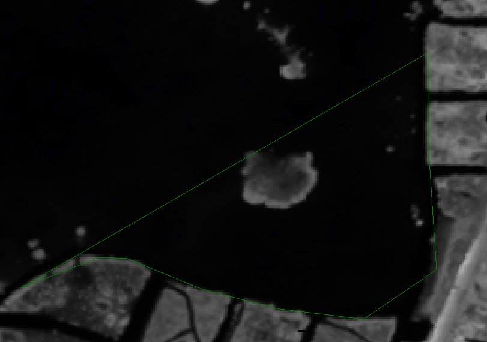

.. _bathy_plane_calc:

bathy_plane_calc
----------------

The ``bathy_plane_calc`` program estimates the surface of a body of
water. It can take inputs in three ways. In one, a DEM is given, a
camera model, and a mask obtained from a raw image with that camera
model. The mask has the value 1 on land and 0 where there is water, or
positive values on land and no-data values on water. 

Alternatively, one can pass a set of water height measurements, and the 
tool will fit a plane through them.

In the third way of specifying the inputs, a DEM and a shapefile are
provided, with the latter's vertices at the water-land interface.

The output water surface produced by this program is parameterized as
a plane in a local stereographic projection. This plane can be
slightly non-horizontal due to imperfections in the positions and
orientations of the cameras that were used to create the input DEM.

Further context is given in :numref:`shallow_water_bathy`.

.. _bathy_plane_calc_example1:

Example 1 (using a camera, a mask, and a DEM)
~~~~~~~~~~~~~~~~~~~~~~~~~~~~~~~~~~~~~~~~~~~~~

Preparation and running the program
^^^^^^^^^^^^^^^^^^^^^^^^^^^^^^^^^^^

Given a multispectral stereo dataset, a DEM obtained from a pair of
images for one of the bands, a camera file from that pair, and a mask
for the corresponding image delineating water from land, the water
plane can be found as follows::

     bathy_plane_calc --session-type dg --mask mask.tif      \
       --camera camera.xml --dem dem.tif --num-samples 10000 \
       --outlier-threshold 0.5 --bathy-plane plane.txt       \
       --output-inlier-shapefile inliers.shp

Such a mask can be obtained by thresholding an image where the water
shows up darker than the land. A good example for this is the band 7
of Digital Globe multispectral images. The thresholding happens as
follows::

    thresh=155
    image_calc -c "max($thresh, var_0)" --output-nodata-value $thresh \
      image.tif -o mask.tif

It is important that the image be raw, not projected, and if the image
is part of a stereo pair, the corresponding camera for that image be
used. In particular, since the image is multispectral, the camera must
be for this dataset, not for the PAN one.

For a stereo pair, this tool can be run done with both the left image
and left camera, then separately for the right image and right camera.
Ideally the results should be very similar.

The ``--session-type`` option determines which camera model to
use (Digital Globe files have both an exact ``dg`` model and an
approximate ``rpc`` model).

See the next section for when it is possible to use the PAN DEM and/or
data with alignments applied to them.

Running this command will produce an output as follows::

    Found 5017 / 13490 inliers.
    Max distance to the plane (meters): 6.00301
    Max inlier distance to the plane (meters): 0.499632
    Mean plane height above datum (meters): -22.2469
    Writing: plane.txt

The file ``plane.txt`` will look like this::

  -0.0090 0.0130 0.9998 22.2460
  # Latitude and longitude of the local stereographic projection with the WGS_1984 datum:
  24.5836 -81.7730

The last line has the center of the local stereographic projection in which
the plane is computed, and the first line has the equation of the plane
in that local coordinate system as::

    a * x + b * y + c * z + d = 0.

The value of ``c`` is almost 1, hence this plane is almost perfectly
horizontal in local coordinates and the value of ``-d/c`` gives its
height above the datum (The small deviation from the horizontal may be
due to the orientations of the satellites taking the pictures not
being perfectly known.)

It is important to decide carefully what outlier threshold to use and
to check the number of resulting inliers. If too few, that may mean
that the outlier threshold is too strict. Above, the inliers are saved
as a shapefile and can be inspected. The inliers should be
well-distributed over the entire shoreline.

Handling adjusted cameras and alignment
^^^^^^^^^^^^^^^^^^^^^^^^^^^^^^^^^^^^^^^

The DEM and camera to be passed to ``bathy_plane_calc`` must be 
in the same coordinate system. 

That is the case, for example, for Digital Globe images, when no
bundle adjustment or alignment is performed by the user. Without
these, given a stereo pair having multispectral and PAN images, the
DEM obtained with the multispectral images and cameras themselves are
consistent with the DEM obtained from the PAN images and corresponding
cameras, with the only difference being that the multispectral images
are coarser by a factor of 4, hence the resulting DEM is less
precise. Therefore, it is possible to use the PAN DEM instead of
multispectral DEM with this tool, while still using the multispectral
cameras.

Great care must be used if bundle adjustment or alignment takes place,
to keep all datasets consistent. If the multispectral images were
bundle-adjusted, the same adjustments can be used with all
multispectral bands. If the DEM above is obtained with bundle-adjusted
multispectral images, then ``--bundle-adjust-prefix`` must be passed
to ``bathy_plane_calc`` above.

If it is desired to use the PAN DEM with ``bathy_plane_calc``, but
bundle adjustment or alignment happened, with one or both of the multispectral
and PAN pairs, the produced multispectral and PAN DEMs will no longer be aligned
to each other. Thus, these must be individually aligned to a chosen
reference DEM, the alignments applied to the cameras, as discussed in
:numref:`ba_pc_align`, and then the updated multispectral camera
adjustments must be passed to ``bathy_plane_calc`` via
``--bundle-adjust-prefix``.

.. _bathy_plane_calc_example2:

Example 2 (using water height measurements)
~~~~~~~~~~~~~~~~~~~~~~~~~~~~~~~~~~~~~~~~~~~

In this example, a set of actual measurements of the water surface is
provided, as the longitude and latitude (in degrees, in decimal
format), and water height above the WGS_1984 datum (ellipsoid
heights), measured in meters.

If the water heights are given relative to a geoid (such as EGM2008),
or some other datum (such as NAD83), those need to be converted to
WGS_1984.

It is expected that the measurements are given in a CSV file, with
commas or spaces used as separators. A procedure for collecting such
data is outlined further down this document
(:numref:`water_meas_collection`). Here is an sample file, named
``meas.csv``, for Florida Keys::
    
   FID,Lon,Lat,WGS84_m
   0,-81.59864018,24.58775288,-23.86539
   1,-81.62377319,24.58180388,-23.84653
   2,-81.62987019,24.57838388,-23.8864
   3,-81.6745502,24.56443387,-23.86815
   4,-81.71131321,24.55574886,-23.86031
   5,-81.75447022,24.55158486,-23.85464
   6,-81.75601722,24.55176286,-23.89892
   7,-81.77999023,24.54843186,-23.89824

Any lines starting with the pound sign (``#``) will be ignored as
comments. If the first line does not start this way but does not have
valid data it will be ignored as well.

The program is called as follows::

    bathy_plane_calc --water-height-measurements meas.csv \
      --csv-format "2:lon 3:lat 4:height_above_datum"     \
      --num-samples 10000 --outlier-threshold 0.5         \
      --bathy-plane meas_plane.txt                        \
      --output-inlier-shapefile meas_inliers.shp

Note the ``--csv-format`` option, which should be set correctly. As
specified here, it will result in columns 2, 3, and 4, being read,
having the longitude, latitude, and height above datum (WGS84
ellipsoid).  The order in which the columns show up is not important,
as long as ``--csv-format`` correctly reflects that. Any extraneous
columns will be ignored, such as the ID in column 1.

Care must be taken to ensure all the measurements, resulting bathy
plane, and any DEMs are in the same coordinate system. This is
discussed further in :numref:`bathy_and_align`.

.. _bathy_plane_calc_example3:

Example 3 (using a DEM and shapefile)
~~~~~~~~~~~~~~~~~~~~~~~~~~~~~~~~~~~~~

This example uses a DEM and a shapefile tracing the water edge as
inputs::

     bathy_plane_calc --shapefile shape.shp --dem dem.tif    \
       --outlier-threshold 0.5                               \ 
       --output-inlier-shapefile inliers.shp                 \
       --bathy-plane plane.txt 

As earlier, it is important to consider carefully what outlier
threshold to use, and to examine the number and distribution of
inliers.

Here it is suggested that the DEM be obtained as in the previous
example, from a stereo pair, and the shapefile delineating the
water-land interface be drawn on top of an orthoimage created with the
same stereo pair. The commands for that can be as follows::

     parallel_stereo -t dg left.tif right.tif left.xml right.xml \
       run/run
     point2dem --orthoimage run/run-PC.tif run/run-L.tif

See :numref:`nextsteps` for a discussion about various
speed-vs-quality choices.

Here is an example of a shapefile created on top of an orthoimage:

   Example of a shapefile whose vertices are at the water-land boundary.

Example 4 (pick a sample set of points at mask boundary)
~~~~~~~~~~~~~~~~~~~~~~~~~~~~~~~~~~~~~~~~~~~~~~~~~~~~~~~~

In this example, the ``bathy_plane_calc`` tool will take as inputs a
DEM, a mask, and a camera (with the latter two corresponding to same
image), as in :numref:`bathy_plane_calc_example1`, but instead of
computing the best-fitting plane it finds a set of samples (given by
``--num-samples``) at the mask boundary (water-land interface), and
saves them as a shapefile of points, having longitude-latitude
pairs relative to the WGS_1984 datum (ellipsoid). 

Example::

     bathy_plane_calc --session-type dg --mask mask.tif    \
       --camera camera.xml --dem dem.tif --num-samples 100 \
       --mask-boundary-shapefile samples.shp

This shapefile may then be passed to some external tool for looking
up water level heights at these points.

Command-line options for bathy_plane_calc
~~~~~~~~~~~~~~~~~~~~~~~~~~~~~~~~~~~~~~~~~

-h, --help
    Display the help message.

--shapefile <filename>
    The shapefile with vertices whose coordinates will be looked up in
    the DEM.

--dem <filename>
    The DEM to use.

--mask <string (default: "")>
    A input mask, created from a raw camera image and hence having the
    same dimensions, with values of 1 on land and 0 on water, or
    positive values on land and no-data values on water.

--camera <string (default: "")>
    The camera file to use with the mask.

--bundle-adjust-prefix <string (default: "")>
    Use the camera adjustment at this output prefix, if the cameras
    changed based on bundle adjustment or alignment.

-t, --session-type <string (default: "")>
    Select the stereo session type to use for processing. Usually
    the program can select this automatically by the file extension, 
    except for xml cameras. See :numref:`parallel_stereo_options` for
    options.

--outlier-threshold <double>
    A value, in meters, to determine the distance from a sampled point
    on the DEM to the best-fit plane to determine if it will be marked as 
    outlier and not included in the calculation of that plane. The default
    is 0.2.

--num-ransac-iterations <integer>
    Number of RANSAC iterations to use to find the best-fitting plane.
    The default is 1000.

--num-samples <integer>
    Number of samples to pick at the water-land interface if using a
    mask. The default is 10000.

--water-height-measurements <string (default: "")>
    Use this CSV file having longitude, latitude, and height
    measurements for the water surface, in degrees and meters,
    respectively, relative to the WGS84 datum. The option --csv-format
    must be used.

--csv-format <string (default: "")>
    Specify the format of the CSV file having water height
    measurements. The format should have a list of entries
    with syntax column_index:column_type (indices start from
    1). Example: '2:lon 3:lat 4:height_above_datum'.

--bathy-plane arg                     
    The output file storing the computed plane as four coefficients
    a, b, c, d, with the plane being a*x + b*y + c*z + d = 0.

--output-inlier-shapefile <string (default: "")>
    If specified, save at this location the shape file with the inlier
    vertices.

--output-outlier-shapefile <string (default: "")>
    If specified, save at this location the shape file with the outlier
    vertices.

--mask-boundary-shapefile <string (default: "")>
    If specified together with a mask, camera, and DEM, save a random
    sample of points (their number given by ``--num-samples``) at the
    mask boundary (water-land interface) to this shapefile and exit.

--save-shapefiles-as-polygons
    Save the inlier and outlier shapefiles as polygons, rather than
    made of of discrete vertices. May be more convenient for processing
    in a GIS tool.

--dem-minus-plane <string (default: "")>
    If specified, subtract from the input DEM the best-fit plane and save the 
    obtained DEM to this GeoTiff file.

--use-ecef-water-surface
    Compute the best fit plane in ECEF coordinates rather than in a
    local stereographic projection. Hence don't model the Earth
    curvature. Not recommended.

.. _water_meas_collection:

Acquisition of water height data
~~~~~~~~~~~~~~~~~~~~~~~~~~~~~~~~

This section descries how to acquire a set of water height measurements,
which then could be used to create the best-fit water plane
for the purpose of shallow-water bathymetry. An example of using
this data is given in :numref:`bathy_plane_calc_example2`.

Absent direct measurements of water surface level at the date and time of
satellite image acquisition, it is suggested to use the
discrete tidal zoning information provided by the 
`National Ocean Service 
<https://noaa.maps.arcgis.com/home/webmap/viewer.html?webmap=21d7b399e6fa42e18a72ee30be9aa5c9>`_
, while for the metadata use the  
`CO-OPS Discrete Tidal Zoning Map <https://noaa.maps.arcgis.com/home/item.html?id=21d7b399e6fa42e18a72ee30be9aa5c9>`_. An organizational Esri GIS online login is needed to access the data.

Each polygon on the map is a discrete tidal zone, within which NOAA
considers the tide characteristics the same. If the user clicks a
polygon on the map, a window will pop up and show the control tide
station (ControlStn) for that zone, average time corrector
(AvgTimeCorr, in minutes), and range ratio (RangeRatio). Note that:

 - The control station is usually an active water level station of NOAA.
 - ``Average time corrector`` is the time difference (phase difference)
   between the tide at the tide zone and at the control
   station. Positive time means the tide level is this many minutes
   later in the tidal zone polygon than at the control station
   (and vice versa).
 - ``Range ratio`` is the ratio of tide range at the tidal zone
   divided by that at the control station.

The user can access tidal gauge data for
the satellite day and time of acquisition at the 
`Center for Operational Oceanographic Products and Services 
<https://opendap.co-ops.nos.noaa.gov/axis/>`_. Choose Verified Data->
Six Minutes Data->Try me. 

The user can download tide data in any
reference as long as the value is expressed in meters. This value
needs to be transformed into an ellipsoid heights value relative to the WGS_1984 datum. For
this the `NOAA VDATUM Java program <https://vdatum.noaa.gov/>`_ can be used,
or the `NOAA online app <https://www.vdatum.noaa.gov/vdatumweb/>`_. 

Please note that even if lots of points on the land/water limit belong to the
same tidal zone polygon, so they will have same elevation value, the
transformation in ellipsoid heights with VDATUM will result in
different ellipsoid heights since VDATUM uses the position of the
point in latitude/longitude besides the height of the point.

Export your data in a CSV file with a header having ID, longitude, latitude, and
WGS_1984 height measurements.

.. |times| unicode:: U+00D7 .. MULTIPLICATION SIGN

