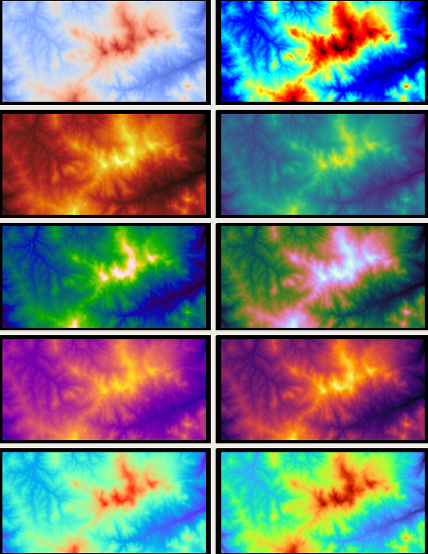

.. _colormap:

colormap
--------

The ``colormap`` tool reads a DEM or some other single-channel image,
and writes a corresponding color-coded image that can be used
for visualization.

Usage::

    colormap [options] <input DEM>

Example::

    colormap --min -5 --max 10 image.tif

This will produce ``image_CMAP.tif``, with the "hottest" color
corresponding to pixel values at least 10, and the "coolest" color
representing pixel values less than or equal to -5.

To create a hillshaded (:numref:`hillshade`) colormap of a DEM, run::

    hillshade  -e 25 -a 300 dem.tif -o shaded.tif
    colormap dem.tif -s shaded.tif -o color-shaded.tif

See :numref:`visualising` for a discussion of ASP's visualization
tools, including this one.

   Example of images produced with the following colormaps (left to
   right, and top-down): ``binary-red-blue`` (default), 
   ``jet``, ``black-body``, ``viridis``, ``kindlmann``,
   ``cubehelix``, ``plasma``, ``inferno``, ``rainbow``, ``turbo``
   (`source1
   <http://www.kennethmoreland.com/color-advice/>`_, `source2
   <https://matplotlib.org/stable/tutorials/colors/colormaps.html>`_).

Using your own colormap
^^^^^^^^^^^^^^^^^^^^^^^

Both this tool and ``stereo_gui`` (:numref:`stereo_gui`) accept a
user-defined colormap. It should be in a file named, for example,
``mycolormap``, and can be passed to these tools via ``--colormap-style
mycolormap``.  Such a file must be in plain text, with four columns
having on each row a floating point number (increasing from 0 to 1),
then 3 integers between 0 and 255, corresponding to the RGB components
of a color.

Here's an example Python code which creates a custom colormap, by 
exporting it from a `matplotlib colormap
<https://matplotlib.org/stable/tutorials/colors/colormaps.html>`_::

    #!/usr/bin/python
    
    from matplotlib import cm
    
    # colormap name goes here, e.g., 'turbo'
    cmap = cm.turbo 
    num = cmap.N
    for i in range(num):
       rgba = cmap(i)
       print(i / 255.0,
             round(255 * rgba[0]),
             round(255 * rgba[1]),
             round(255 * rgba[2]))

Save this script as ``export_colormap.py``, and run it as::

    python ~/bin/export_colormap.py > mycolormap

Command-line options for ``colormap``
^^^^^^^^^^^^^^^^^^^^^^^^^^^^^^^^^^^^^

-s, --shaded-relief-file <filename>
    Specify a shaded relief image (grayscale) to apply to the
    colorized image.

-o, --output-file <filename>
    Specify the output file.

--colormap-style <string (default="binary-red-blue")>
    Specify the colormap style.  Options: ``binary-red-blue``
    (default), ``jet``, ``black-body``, ``viridis``, ``kindlmann``,
    ``cubehelix``, ``plasma``, ``inferno``, ``rainbow``, ``turbo``.
    Or specify the name of a file having the colormap, on each line of
    which there must be a normalized or percentage intensity and the
    three integer RGB values it maps to.

--nodata-value <arg>
    Remap the DEM default value to the min altitude value.

--min <arg>
    Minimum height of the color map.

--max <arg>
    Maximum height of the color map.

--moon
    Set the min and max height to good values for the Moon.

--mars
    Set the min and max height to good values for Mars.

--legend
    Generate an unlabeled legend, will be saved as ``legend.png``.

--threads <integer (default: 0)>
    Select the number of threads to use for each process. If 0, use
    the value in ~/.vwrc.

--cache-size-mb <integer (default = 1024)>
    Set the system cache size, in MB.

--tile-size <integer (default: 256 256)>
    Image tile size used for multi-threaded processing.

--no-bigtiff
    Tell GDAL to not create bigtiffs.

--tif-compress <None|LZW|Deflate|Packbits (default: LZW)>
    TIFF compression method.

-v, --version
    Display the version of software.

-h, --help
    Display this help message.
