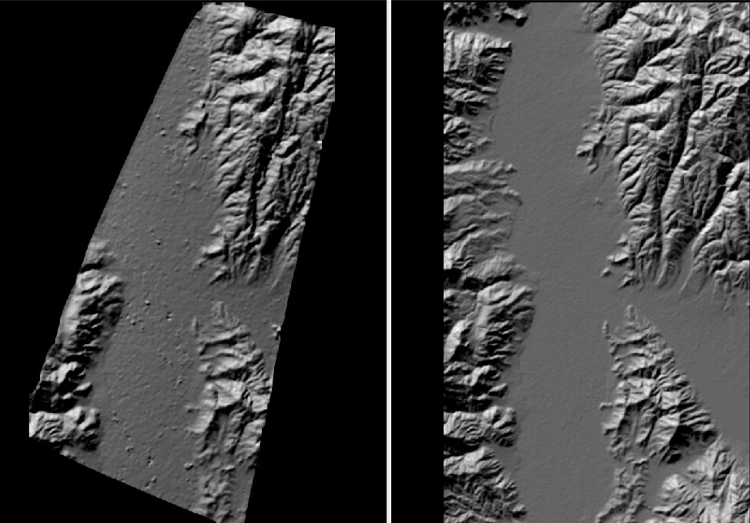
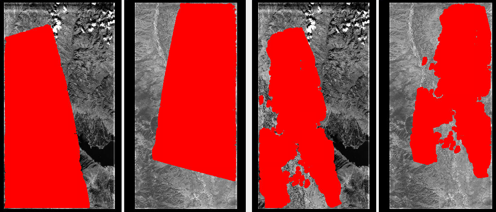
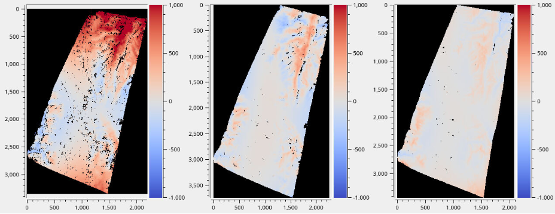
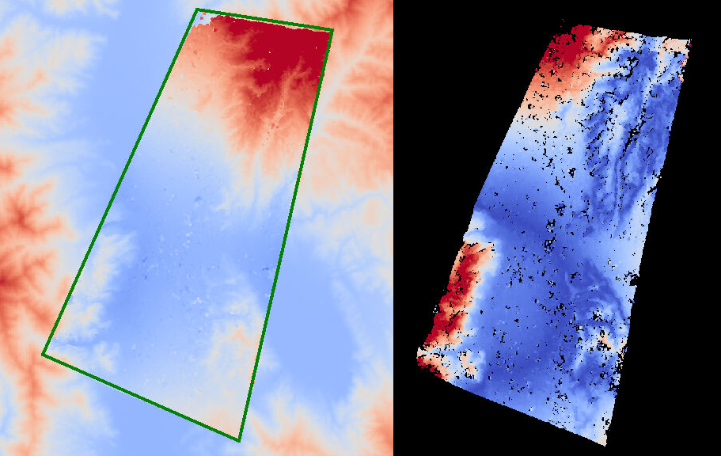

.. _dem2gcp:

dem2gcp
-------

This program generates GCP (:numref:`bagcp`) based on densely measuring the
misregistration and/or warping between two DEMs, which helps correct these
effects. The cause is usually inaccuracies in camera extrinsics or intrinsics,
including lens distortion.

The approach is as follows. The dense disparity from an ASP-produced
misregistered or warped DEM to a correct reference DEM is found. This program
will take as input that disparity and interest point matches between the raw
images, and will produce GCP with correct ground positions based on the
disparity and the reference DEM.

Bundle adjustment with intrinsics optimization
(:numref:`intrinsics_ground_truth`) or the jitter solver
(:numref:`jitter_solve`) can then be invoked with the GCP. That will help
correct the issues.

This program was motivated by the processing of historical images
(:numref:`kh4`), particularly the KH-7 and KH-9 panoramic images.

ASP DEM creation
~~~~~~~~~~~~~~~~

Prepare the images and camera models, such as in :numref:`kh7`. This workflow
expects the cameras to already incorporate any prior alignment or adjustments.
Such cameras can be made during bundle adjustment (:numref:`bundle_adjust`) for
Pinhole (:numref:`pinholemodels`) and CSM (:numref:`csm`) cameras. OpticalBar
cameras can be first converted to CSM linescan (:numref:`opticalbar2csm`).

Mapproject the images at the same appropriate resolution (close to native image
GSD) onto the reference DEM with the cameras produced by bundle adjustment. Do
not use, here, and below, the original cameras and the .adjust files.

Use a local projection for mapprojection, such as stereographic. Run stereo with
the mapprojected images (:numref:`mapproj-example`). Use the ``asp_mgm``
algorithm with ``--subpixel-mode 9`` (:numref:`stereo_alg_overview`). This will
ensure the best quality. If more than two images, pairwise stereo can be run and
the DEMs can be mosaicked with ``dem_mosaic`` (:numref:`dem_mosaic`).

Overlay the mapprojected images, produced DEM, and reference DEM in
``stereo_gui``. These should be roughly in the same place, but with some
misregistration or warping.

The produced DEM can be aligned with the reference DEM (:numref:`pc_align`), and
the same alignment can be applied to the cameras (:numref:`ba_pc_align`).
Mapproject the images with the latest cameras onto the DEM, and run stereo again
(with the option ``--prev-run-prefix`` to reuse the previous run,
:numref:`mapproj_reuse`), and see if the new DEM is better-aligned with the
reference DEM. 

For small misalignment, likely this alignment is not necessary, as the GCP
produced later should be able to take care of misalignment as well.
 
Ensure ``parallel_stereo`` was invoked to generate dense matches from disparity
(:numref:`dense_ip`). It is suggested to use ``--num-matches-from-disparity
100000`` or so. That is a very large number of interest points, but will help
produce sufficient GCP later on. The number of matches can be reduced later for
bundle adjustment with the option ``--max-pairwise-matches``, and fewer GCP can
be created with the option ``--max-num-gcp``.

Ensure that the dense match files are renamed according to the *naming
convention* for the original raw images (:numref:`ba_match_files`). Such matches
can be produced after stereo already finished, by re-running ``stereo_tri`` only
(:numref:`entrypoints`). Sufficiently numerous sparse matches may likely work
too.

Comparison with the reference DEM
~~~~~~~~~~~~~~~~~~~~~~~~~~~~~~~~~

The level of detail and overall appearance of the hillshaded DEMs in ``stereo_gui``
must be very similar. 

   
   A low-resolution KH-7 DEM produced by ASP (left) and a reference DEM (right).
   These must be visually similar and with enough features for ``dem2gcp`` to work.
   The DEMs can be overlaid to see if there is significant local warping. Difference
   maps are in :numref:`kh7_orig_vs_opt`.

Some hole-filling and blur can be applied to the ASP DEM with ``dem_mosaic``
(:numref:`dem_mosaic_blur` and :numref:`dem_mosaic_extrapolate`).

A command as::

    gdal_translate -r average -outsize 50% 50% dem.tif dem_small.tif
    
can reduce the resolution. This likely will do a better job than ``gdalwarp``,
which uses interpolation. 

The two DEMs must be re-gridded to the same local projection and grid size.
Example (adjust the projection center)::

   proj='+proj=stere +lat_0=27.909 +lon_0=102.226 +k=1 +x_0=0 +y_0=0 +datum=WGS84 +units=m +no_defs'
   gdalwarp -tr 20 20 -t_srs "$proj" -r cubicspline dem_in.tif dem_out.tif

It is not necessary for the produced DEMs to have precisely the same extent, but
cropping to similar regions is suggested. 

The DEMs should be hillshaded. It is suggested to use the GDAL (:numref:`gdal_tools`)
hillshading method, as it is more accurate than ASP's own ``hillshade``. Here's an
example invocation, to be applied to both DEMs::

    gdaldem hillshade   \
      -multidirectional \
      -compute_edges    \
      input_dem.tif     \
      output_dem_hill.tif

Inspect the hillshaded images in ``stereo_gui``. They should be similar enough
in appearance.

Find the dense disparity from the warped hillshaded DEM to the reference
hillshaded DEM with ASP's correlator mode (:numref:`correlator-mode`)::

  parallel_stereo              \
    --correlator-mode          \
    --stereo-algorithm asp_mgm \
    --subpixel-mode 9          \
    --ip-per-tile 500          \
    warped_hill.tif            \
    ref_hill.tif               \
    warp/run

The order here is very important. Increase ``--ip-per-tile`` if not enough
matches are found. One could consider experimenting with ASP's various stereo
algorithms (:numref:`stereo_alg_overview`).

Inspect the bands of the produced disparity image ``warp/run-F.tif``. This
requires extracting the horizontal and vertical disparities, and masking the
invalid values, as in :numref:`mask_disparity`. Then run::

    stereo_gui --colorbar      \
      --min -100 --max 100     \
      warp/run-F_b1_nodata.tif \
      warp/run-F_b2_nodata.tif

Running ``dem2gcp``
~~~~~~~~~~~~~~~~~~~

This command must be invoked with the warped ASP DEM and the reference DEM whose
hillshaded versions were used to produce the disparity. Do not use here DEMs
before cropping/regridding/blur applications, as those are not consistent with
the disparity.

:: 

    dem2gcp                                            \
      --warped-dem asp_dem.tif                         \
      --ref-dem ref_dem.tif                            \
      --warped-to-ref-disparity warp/run-F.tif         \
      --left-image left.tif                            \
      --right-image right.tif                          \
      --left-camera left.tsai                          \
      --right-camera right.tsai                        \
      --match-file dense_matches/run-left__right.match \
      --gcp-sigma 1.0                                  \
      --max-num-gcp 20000                              \
      --output-gcp out.gcp

Here we passed in the left and right raw images, the latest left and right
camera models that produced the warped DEM, and the dense matches between the
raw images. 

If there are more than two images, first run stereo pairwise, produce a single
mosaicked DEM with ``dem_mosaic`` (:numref:`dem_mosaic`), and then run this
program pairwise with that DEM. This assumes that the pairwise DEMs are
reasonably self-consistent.

The match file also need not have dense matches. All that is assumed
is that the images and cameras are consistent with the warped DEM, and there are
plenty of interest point matches. Then, all produced GCP files could be passed together
with all images and cameras to ``bundle_adjust``, as below.

   
   Interest point matches (left, in red) and produced GCP (right), on top of the raw images.
   Flat areas do not have GCP. Plotted with ``stereo_gui`` (:numref:`stereo_gui`). 

Plotted in :numref:`dem2gcp_ip_vs_gcp` are the interest point matches and the
resulting GCP. Their numbers are likely excessive here, though the bigger concern
is if they are lacking over featureless terrain. 

Solving for extrinsics and intrinsics
~~~~~~~~~~~~~~~~~~~~~~~~~~~~~~~~~~~~~

We employ the recipe from :numref:`heights_from_dem`, that mostly takes care
of the vertical component of disagreement between the ASP-produced and reference
DEMs. The added GCP mostly take care of the horizontal component.

The most recent bundle-adjusted and aligned cameras can be converted to use the
RPC lens distortion model (:numref:`rpc_distortion`) as in
:numref:`convert_pinhole_model`. Or, the cameras can be used as is.

If solving for intrinsics and using RPC lens distortion, the small RPC
coefficients *must be changed manually to be at least 1e-7* in older builds,
otherwise they will not get optimized. Here, RPC of degree 3 is used. A higher
degree can be employed, either initially, or for subsequent iterations. In the
latest builds this is done automatically by ``bundle_adjust`` (option
``--min-distortion``).

The command when it is desired to refine the intrinsics as well::

    bundle_adjust                                 \
      left_image.tif right_image.tif              \
      left_rpc_camera.tsai right_rpc_camera.tsai  \
      --inline-adjustments                        \
      --solve-intrinsics                          \
      --intrinsics-to-float all                   \
      --intrinsics-to-share none                  \
      --num-iterations 100                        \
      --match-files-prefix dense_matches/run      \
      --max-pairwise-matches 100000               \
      --remove-outliers-params '75.0 3.0 100 100' \
      --heights-from-dem ref_dem.tif              \
      --heights-from-dem-uncertainty 250          \
      out.gcp                                     \
      -o ba_rpc_gcp_ht/run
     
Note how we employ *both* the match file and the GCP created earlier. A higher
value in ``--heights-from-dem-uncertainty`` gives less weight to the vertical
constraint. Likely it is better to prioritize the GCP instead. Reducing
``--max-pairwise-matches`` will sparse out the interest point matches, but not
the GCP. 

This invocation can be sensitive to inaccurate GCP, as those do not use a robust
cost function.

For linescan cameras, the jitter solver can be invoked instead with a very
similar command to the above (:numref:`jitter_solve`).

Examine the pixel residuals before and after bundle adjustment
(:numref:`ba_err_per_point`) in ``stereo_gui`` as::

  stereo_gui --colorbar --min 0 --max 10             \
    ba_rpc_gcp_ht/run-initial_residuals_pointmap.csv \
    ba_rpc_gcp_ht/run-final_residuals_pointmap.csv

It should be rather obvious to see which residuals are from the GCP. These are
also flagged in those csv files.

   Difference between the ASP DEM and reference DEM. The vertical range is -1000
   m to 1000 m. From left-to-right: (a) no distortion modeling (b) modeling
   distortion with RPC of degree 3 and optimizing with ``--heights-from-dem``
   (c) additionally, use the GCP produced by ``dem2gcp``. The differences are
   found with ``geodiff`` (:numref:`geodiff`) and plotted with ``stereo_gui``.

   
   The unwarped ASP DEM that results in the right-most difference in the above
   figure (within the green polygon), on top of the reference DEM. 

Then, one can rerun stereo with the optimized cameras and the original images
(again with the option ``--prev-run-prefix``, or by doing a new run from
scratch). The results are in :numref:`kh7_orig_vs_opt`. The warping is much
reduced but not eliminated. 

We further improved the results for KH-7 and KH-9 cameras by creating
linescan cameras (:numref:`opticalbar2csm`) and running ``jitter_solve``
with GCP (:numref:`jitter_solve`).

Command-line options
~~~~~~~~~~~~~~~~~~~~
  
--warped-dem <string (default: "")>
    The DEM file produced by stereo, that may have warping due to unmodeled distortion.
    
--ref-dem <string (default: "")>
    The reference DEM file, which is assumed to be accurate.

--warped-to-ref-disparity <string (default: "")>
    The stereo disparity from the warped DEM to the reference DEM (use the first
    band of the hillshaded DEMs as the inputs for the disparity).

--left-image <string (default: "")>
    The left raw image that produced the warped DEM.
    
--right-image <string (default: "")>
    The right raw image that produced the warped DEM.
    
--left-camera <string (default: "")>
    The left camera that was used for stereo.    
    
--right-camera <string (default: "")>
    The right camera that was used for stereo.
    
--match-file <string (default: "")>
    A match file between the left and right raw images with many dense matches.
    
--search-len <int (default: 0)>
    How many DEM pixels to search around to find a valid DEM disparity (pick the
    closest). This may help with a spotty disparity but should not be overused.

--gcp-sigma <double (default: 1.0)>
    The sigma to use for the GCP points. A smaller value will give to GCP more weight.

--max-num-gcp <int (default: -1)>
    The maximum number of GCP to write. If negative, all GCP are written. If
    more than this number, a random subset will be picked. The same subset will
    be selected if this program is called again.
        
--output-gcp <string (default: "")>
    The produced GCP file with ground coordinates from the reference DEM.
    
-v, --version
    Display the version of software.

-h, --help
    Display this help message.
