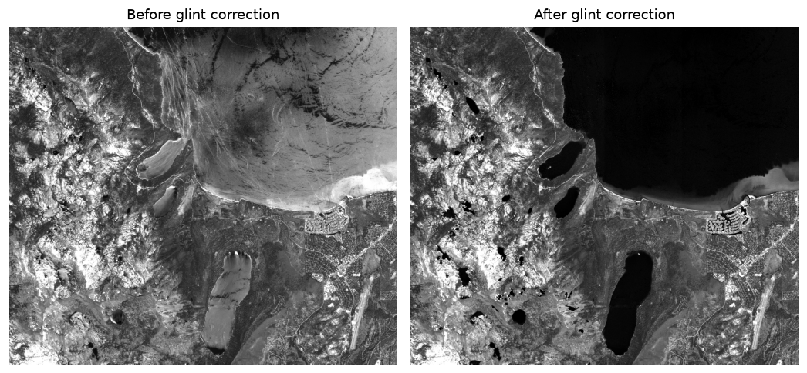

.. _glint_correct:

glint_correct
-------------

The ``glint_correct`` program removes sun glint from a visible band
(for example the green band of a WorldView multispectral image) using
the method of Hedley et al. :cite:`hedley2005simple`. Glint is the
specular reflection of sunlight from the water surface. It brightens the
water and washes out the submerged features that stereo correlation
needs, so removing it can help bathymetry (:numref:`bathy_intro`).

This is a Python program. It runs in the same ``bathy`` conda environment
as ``bathy_threshold_calc`` (:numref:`bathy_threshold_calc`).

How it works
~~~~~~~~~~~~

Water is opaque in the near-infrared (NIR), so over water any NIR
brightness above a glint-free baseline is due to surface glint, not the
bottom. Because the amount of glint in a visible band is proportional to
that NIR excess, the corrected band is::

    corrected = image - b * (NIR - NIR_min)

The slope ``b`` and the baseline ``NIR_min`` are found automatically over
optically deep water, which is selected by eroding the water mask inward
from the shore by ``--deep-water-buffer`` pixels (so no bottom return
contaminates the fit). Where the NIR equals ``NIR_min`` (no glint) the
correction is zero, so glint-free pixels are left unchanged. Only water
pixels are corrected, unless ``--correct-land`` is set.

When it helps
~~~~~~~~~~~~~

The correction restores the radiometry of the visible band. The submerged
texture that glint had washed out reappears (:numref:`glint_correct_fig`).

Its effect on stereo depends on how strong the glint is. Where glint is
strong enough to block matching, removing it recovers a meaningful amount
of stereo coverage over water. Where glint is mild, ASP's correlator
already tolerates the one-sided radiometric difference, so the correction
adds little and can even reduce coverage slightly, since it lowers the
contrast of the water. 

Fully saturated glint cannot be recovered at all. The true radiance was lost
when the image was acquired.

Example
~~~~~~~

The program takes single-channel inputs. The green (band 3) and NIR (band 7)
of an 8-band WorldView image can be extracted with ``gdal_translate``::

    gdal_translate -co TILED=YES -b 3 image.tif green.tif
    gdal_translate -co TILED=YES -b 7 image.tif nir.tif

A land-water mask (land = 1, water = 0) on the same grid is also needed.
See :numref:`bathy_thresh` for how to produce one.

Install the ``bathy`` conda environment (:numref:`glint_correct_dependencies`),
then run::

    ~/miniconda3/envs/bathy/bin/python $(which glint_correct) \
        --image green.tif --nir-image nir.tif --mask mask.tif \
        --output-image green_deglint.tif

Here it is assumed that ASP's ``bin`` directory is in the path, otherwise
the full path to this Python script must be specified above.

The corrected band can then be used in stereo in place of the original.

   A green band with strong glint (left) and after correction (right). The
   glint that brightens the lake is removed, restoring the dark water and
   the submerged detail.

.. _glint_correct_dependencies:

Dependencies
~~~~~~~~~~~~

This tool needs Python 3 with ``numpy``, ``scipy``, ``matplotlib``, and
``gdal``. These are the same packages as for ``bathy_threshold_calc.py``
(:numref:`bathy_threshold_calc`), so its ``bathy`` environment can be reused. To
create it, run::

     conda create --name bathy -c conda-forge \
       python gdal numpy scipy matplotlib
     conda activate bathy

Command-line options for glint_correct
~~~~~~~~~~~~~~~~~~~~~~~~~~~~~~~~~~~~~~

-h, --help
    Display the help message.

--image <filename>
    The visible band to correct (for example the green band), as a
    single-channel GeoTIFF.

--nir-image <filename>
    The near-infrared band, as a single-channel GeoTIFF, on the same grid
    as the visible band.

--mask <filename>
    The land-water mask, as a single-channel GeoTIFF on the same grid,
    with land = 1 and water = 0.

--output-image <filename>
    The output corrected band. Default: the input image name with a
    ``_deglint`` suffix.

--slope <double>
    The regression slope. If not set, it is computed over deep water.

--nir-min <double>
    The glint-free NIR baseline. If not set, it is computed over deep
    water.

--deep-water-buffer <integer (default: 50)>
    Erode the water mask inward by this many pixels to select deep water
    (free of bottom return) for the regression.

--nir-min-percentile <double (default: 5)>
    Set ``NIR_min`` to this percentile of the deep-water NIR values. A
    lower value is a more conservative baseline.

--sample-fraction <double (default: 1.0)>
    Fraction of deep-water pixels to use in the regression. Reduce for
    very large scenes.

--correct-land
    Apply the correction to all pixels, not just water.

--regression-method <ols|theilsen (default: ols)>
    Slope estimation method: ``ols`` (ordinary least squares, fast) or
    ``theilsen`` (median-based, robust to outliers).

--multiband <filenames>
    Correct several visible bands at once. Each gets its own slope but
    they share one ``NIR_min``. Pass the band GeoTIFFs after this option.

--output-dir <directory (default: deglint)>
    Output directory for multiband mode.

--nodata-value <double>
    Output nodata value. Default: inherited from the input band.
