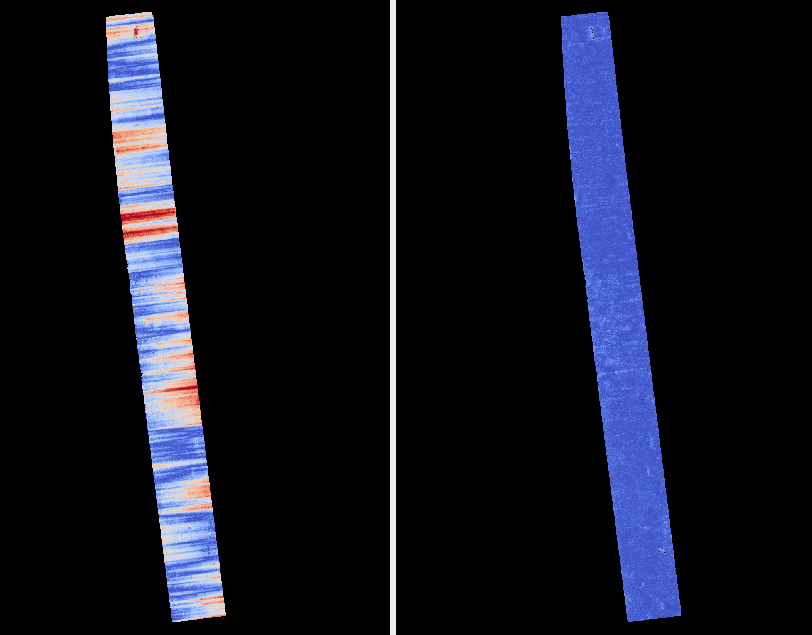
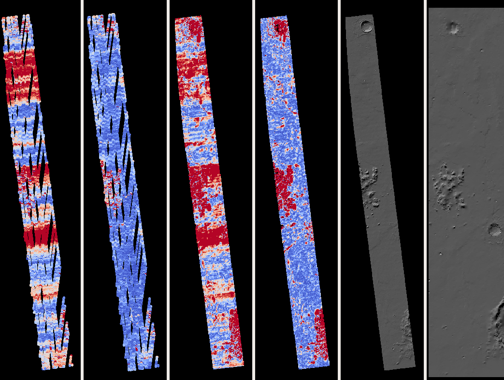
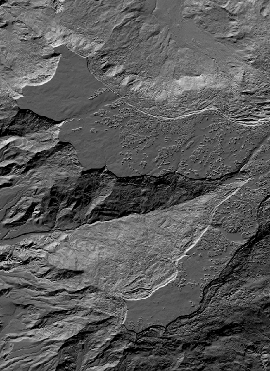
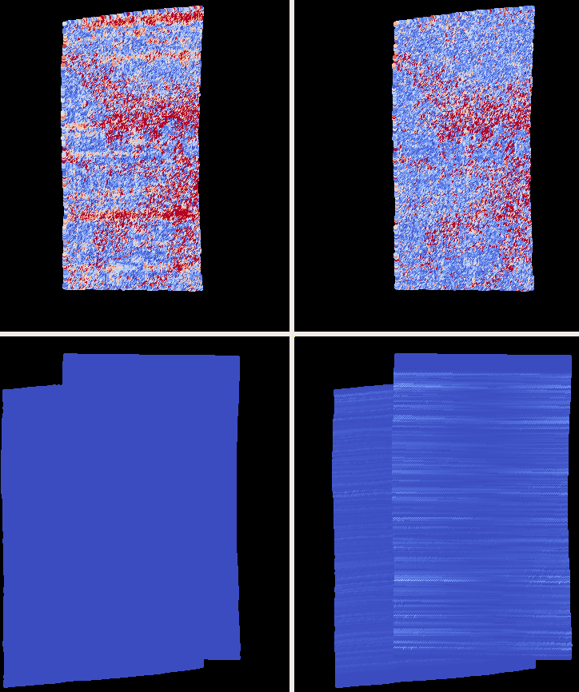
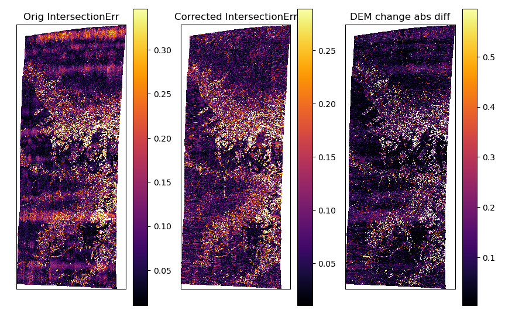

.. _jitter_solve:

jitter_solve
-------------

The ``jitter_solve`` program takes as input several overlapping images
and linescan camera models in CSM format (such as for LRO NAC, CTX,
HiRISE, Airbus Pleiades, DigitalGlobe, etc.) and adjusts each
individual camera position and orientation in the linescan model to
make them more consistent to each other and to the ground.

The goal is to reduce the effect of unmeasured perturbations in the
linescan sensor as it acquires the data. This is quite analogous to
what ``bundle_adjust`` does (:numref:`bundle_adjust`), except that the
latter tool has just a single position and orientation per camera,
instead of a sequence of them.

Usage::

     jitter_solve <images> <cameras> <input adjustments> \
       -o <output prefix> [options]

Ground constraints
~~~~~~~~~~~~~~~~~~

Optimizing the cameras to reduce the jitter and make them
self-consistent can result in the camera system moving away from the
initial location or warping in any eventually produced DEM.

Hence, ground constraints are very important. This tool uses several
kinds of constraints.

Intrinsic constraint
^^^^^^^^^^^^^^^^^^^^

Triangulated ground points obtained from interest point matches are
kept, during optimization, close to their initial values.  This works
well when the images have very good overlap. To use it, set a positive
value to ``--tri-weight``. An example is given in
:numref:`jitter_dg`. See :numref:`jitter_options` for reference
documentation.

Extrinsic constraint
^^^^^^^^^^^^^^^^^^^^

This ties the triangulated ground points obtained from interest point
matches to an external DEM, which may be at a lower resolution than
the images. It is expected that this external DEM is *well-aligned*
with the input cameras. This option is named ``--heights-from-dem``,
and it is controlled via ``--heights-from-dem-weight`` and
``--heights-from-dem-robust-threshold``. How to perform alignment and
use these options is shown in :numref:`jitter_ctx`.

Only one of these two constraints can be used at a time. If both are
specified, the intrinsic constraint will be used where the
triangulated points are not above the provided DEM.

The intrinsic constraint is preferred. If desired to use the DEM
constraint, specify a low weight and robust threshold (such as
0.05) and increase these only if desired to tighten the constraint.

Anchor points
^^^^^^^^^^^^^

The anchor points constraint also use a well-aligned external DEM,
with important differences. These points are created based on pixels
that are uniformly distributed over each image, not just where the images
overlap, and can even go beyond the first and last image line. This
ensures that the optimized poses do not oscillate where the images
overlap very little or not at all.

This constraint works by projecting rays to the ground from the chosen
uniformly distributed pixels, finding the *anchor points* where the
rays intersect the DEM, then adding to the cost function to optimize
reprojection errors (:numref:`bundle_adjustment`) for the anchor
points. This complements the reprojection errors from triangulated
interest point matches, and the external DEM constraint (if used).

Anchor points are strongly encouraged either with an intrinsic
constraint or an external DEM constraint. Their number should be
similar to the number of interest points, and it should be large if
the poses are resampled very finely (see next section).

The relevant options are ``--num-anchor-points``,
``--anchor-weight``, ``--anchor-dem``, and
``--num-anchor-points-extra-lines``.  An example is given in
:numref:`jitter_dg`.

Resampling the poses
~~~~~~~~~~~~~~~~~~~~

Often times, the number of tabulated camera positions and orientations
in the CSM file is very small. For example, for Airbus Pleiades, the
position is sampled every 30 seconds, while acquiring the whole image
can take only 1.6 seconds. For CTX the opposite problem happens, the
orientations are sampled too finely, resulting in too many variables
to optimize.

Hence, it is strongly suggested to resample the provided positions and
orientations before the solver optimizes them. Use the options:
``--num-lines-per-position`` and ``--num-lines-per-orientation``. The
estimated number of lines per position and orientation will be printed
on screen, before and after resampling.

In the two examples below drastically different sampling rates will be
used. Inspection of residual files (:numref:`jitter_out_files`),
and of intersection errors and DEM differences after solving for jitter
(:numref:`jitter_dg`) can help decide the sampling rate.

.. _jitter_ctx:

Example 1: CTX images on Mars
~~~~~~~~~~~~~~~~~~~~~~~~~~~~~

A CTX stereo pair will be used which has quite noticeable jitter.
See :numref:`jitter_multiple_images` for a discussion of multiple images.

Input images
^^^^^^^^^^^^

The pair consists of images with ids::

    J03_045820_1915_XN_11N210W
    K05_055472_1916_XN_11N210W

See :numref:`ctx_example` for how to prepare the image files and
:numref:`create_csm_linescan` for how to create CSM camera models.

All produced images and cameras were stored in a directory named
``img``.

Reference datasets
^^^^^^^^^^^^^^^^^^

The MOLA dataset from:

    https://ode.rsl.wustl.edu/mars/datapointsearch.aspx

is used for alignment. The data for the following (very generous)
longitude-latitude extent was fetched: 146E to 152E, and 7N to 15N.
The obtained CSV file was saved as ``mola.csv``.

A gridded DEM produced from this unorganized set of points
is shipped with the ISIS data. It is gridded at 463 meters
per pixel, which is quite coarse compared to CTX images,
which are at 6 m/pixel, but it is good enough to constrain
the cameras when solving for jitter. A clip can be cut out of 
it with the command::

    gdal_translate -co compress=lzw -co TILED=yes              \
     -co INTERLEAVE=BAND -co BLOCKXSIZE=256 -co BLOCKYSIZE=256 \
     -projwin -2057237.6 1077503.1 -1546698.4 275566.33        \
     $ISISDATA/base/dems/molaMarsPlanetaryRadius0005.cub       \
     ref_dem_shift.tif

This one has a 190 meter vertical shift relative to the preferred Mars
radius of 3396190 meters, which can be removed as follows::

    image_calc -c "var_0-190" -d float32 ref_dem_shift.tif \
      -o ref_dem.tif

As a sanity check, one can take the absolute difference of this DEM
and the MOLA csv file as::

    geodiff --absolute --csv-format 1:lon,2:lat,5:radius_m \
      mola.csv ref_dem.tif

This will give a median difference of 3 meters, which is about right,
given the uncertainties in these datasets.

Uncorrected DEM creation
^^^^^^^^^^^^^^^^^^^^^^^^

Bundle adjustment is run first::

    bundle_adjust                               \
      --ip-per-image 20000                      \
      --max-pairwise-matches 10000              \
      --tri-weight 0.05                         \
      --tri-robust-threshold 0.1                \
      --camera-weight 0                         \
      --remove-outliers-params '75.0 3.0 20 20' \
      img/J03_045820_1915_XN_11N210W.cal.cub    \
      img/K05_055472_1916_XN_11N210W.cal.cub    \
      img/J03_045820_1915_XN_11N210W.cal.json   \
      img/K05_055472_1916_XN_11N210W.cal.json   \
      -o ba/run

The triangulation weight was used to help the cameras from drifting.
Outlier removal was allowed to be more generous (hence the values of
20 pixels above) as perhaps due to jitter some triangulated points
obtained from interest point matches may not project perfectly in the
cameras.

Stereo is run next. The ``local_epipolar`` alignment
(:numref:`running-stereo`) here did a flawless job, unlike
``affineepipolar`` alignment which resulted in some blunders.
::

    parallel_stereo                           \
      --bundle-adjust-prefix ba/run           \
      --stereo-algorithm asp_mgm              \
      --num-matches-from-disp-triplets 40000  \
      --alignment-method local_epipolar       \
      img/J03_045820_1915_XN_11N210W.cal.cub  \
      img/K05_055472_1916_XN_11N210W.cal.cub  \
      img/J03_045820_1915_XN_11N210W.cal.json \
      img/K05_055472_1916_XN_11N210W.cal.json \
      stereo/run
    point2dem --errorimage stereo/run-PC.tif

Note how above we chose to create dense interest point matches from
disparity. They will be used to solve for jitter. The option used
``--num-matches-from-disp-triplets`` can be very slow for images
larger than 50,000 pixels on the side, or so. Then, use
``--num-matches-from-disparity``.

See :numref:`nextsteps` for a discussion about various
speed-vs-quality choices for stereo. Close to the poles a polar
stereographic projection may be preferred in ``point2dem``
(:numref:`point2dem`).

This DEM was aligned to MOLA and recreated, as::

    pc_align --max-displacement 400           \
      --csv-format 1:lon,2:lat,5:radius_m     \
      stereo/run-DEM.tif mola.csv             \
      --save-inv-transformed-reference-points \
      -o stereo/run-align
    point2dem stereo/run-align-trans_reference.tif

The value in ``--max-displacement`` may need tuning
(:numref:`pc_align`).

This transform was applied to the cameras, to make them aligned to
MOLA (:numref:`ba_pc_align`)::

    bundle_adjust                                                \
      --input-adjustments-prefix ba/run                          \
      --initial-transform stereo/run-align-inverse-transform.txt \
      img/J03_045820_1915_XN_11N210W.cal.cub                     \
      img/K05_055472_1916_XN_11N210W.cal.cub                     \
      img/J03_045820_1915_XN_11N210W.cal.json                    \
      img/K05_055472_1916_XN_11N210W.cal.json                    \
      --apply-initial-transform-only                             \
    -o ba_align/run

Solving for jitter
^^^^^^^^^^^^^^^^^^

Then, jitter was solved for, using the aligned cameras::

    jitter_solve                               \
      img/J03_045820_1915_XN_11N210W.cal.cub   \
      img/K05_055472_1916_XN_11N210W.cal.cub   \
      img/J03_045820_1915_XN_11N210W.cal.json  \
      img/K05_055472_1916_XN_11N210W.cal.json  \
      --input-adjustments-prefix ba_align/run  \
      --max-pairwise-matches 100000            \
      --match-files-prefix stereo/run-disp     \
      --num-lines-per-position    1000         \
      --num-lines-per-orientation 1000         \
      --max-initial-reprojection-error 20      \
      --heights-from-dem ref_dem.tif           \
      --heights-from-dem-weight 0.05           \
      --heights-from-dem-robust-threshold 0.05 \
      --num-iterations 50                      \
      --anchor-weight 0                        \
      --tri-weight 0                           \
    -o jitter/run

It was found that using about 1000 lines per pose (position and
orientation) sample gave good results, and if using too few lines, the
poses become noisy. Dense interest point matches appear necessary for
a good result, though perhaps the number produced during stereo could
be lowered.

The constraint relative to the reference DEM is needed, to make sure
the DEM produced later agrees with the reference one.  Otherwise, the
final solution may not be unique, as a long-wavelength perturbation
consistently applied to all obtained camera trajectories may work just
as well.

The model states (:numref:`csm_state`) of optimized cameras are saved
with names like::

    jitter/run-*.adjusted_state.json

Then, stereo can be redone, just at the triangulation stage, which
is much faster than doing it from scratch. The optimized cameras were
used::

    parallel_stereo                                                 \
      --prev-run-prefix stereo/run                                  \
      --stereo-algorithm asp_mgm                                    \
      --alignment-method local_epipolar                             \
      img/J03_045820_1915_XN_11N210W.cal.cub                        \
      img/K05_055472_1916_XN_11N210W.cal.cub                        \
      jitter/run-J03_045820_1915_XN_11N210W.cal.adjusted_state.json \
      jitter/run-K05_055472_1916_XN_11N210W.cal.adjusted_state.json \
      stereo_jitter/run
      point2dem --errorimage stereo_jitter/run-PC.tif

To validate the results, first the ray intersection error
(:numref:`point2dem`) was plotted, before and after solving for
jitter. These were colorized as::

    colormap --min 0 --max 10 stereo/run-IntersectionErr.tif
    colormap --min 0 --max 10 stereo_jitter/run-IntersectionErr.tif

The result is below.

   The colorized intersection error (max shade of red is 10 m)
   before and after optimization for jitter.

Then, the absolute difference was computed between the sparse MOLA
dataset and the DEM after alignment and before solving for jitter, and
the same was done with the DEM produced after solving for it::

    geodiff --absolute                                  \
      --csv-format 1:lon,2:lat,5:radius_m               \
      stereo/run-align-trans_reference-DEM.tif mola.csv \
      -o stereo/run

    geodiff --absolute                                  \
      --csv-format 1:lon,2:lat,5:radius_m               \
      stereo_jitter/run-DEM.tif mola.csv                \
      -o stereo_jitter/run

Similar commands are used to find differences with the
reference DEM::

    geodiff --absolute ref_dem.tif                \
      stereo/run-align-trans_reference-DEM.tif -o \
      stereo/run
    colormap --min 0 --max 20 stereo/run-diff.tif

    geodiff --absolute ref_dem.tif                \
      stereo_jitter/run-DEM.tif                   \
      -o stereo_jitter/run
    colormap --min 0 --max 20 stereo_jitter/run-diff.tif

Plot with::

    stereo_gui --colorize --min 0 --max 20 \
       stereo/run-diff.csv                 \
       stereo_jitter/run-diff.csv          \
       stereo/run-diff_CMAP.tif            \
       stereo_jitter/run-diff_CMAP.tif     \
       stereo_jitter/run-DEM.tif           \
       ref_dem.tif

DEMs can later be hillshaded. 

   From left to right are shown colorized absolute differences of
   (a) jitter-unoptimized but aligned DEM and MOLA (b)
   jitter-optimized DEM and MOLA
   (c) unoptimized DEM and reference DEM (d) jitter-optimized
   DEM and reference DEM. Then, (e) hillshaded optimized DEM (f)
   hillshaded reference DEM . The max shade of red is 20 m difference.

It can be seen that the banded systematic error due to jitter is gone,
both in the intersection error maps and DEM differences. The produced
DEM still disagrees somewhat with the reference, but we believe that
this is due to the reference DEM being very coarse, per plots (e) and
(f) in the figure.

.. _jitter_multiple_images:

Using multiple images
^^^^^^^^^^^^^^^^^^^^^

At a future time an analysis can be done where more images
for that area are used. The following overlap with the above pair
quite well::

    B19_016902_1913_XN_11N210W
    F04_037367_1929_XN_12N211W
    N14_067737_1928_XI_12N210W
    P06_003347_1894_XI_09N210W

Bundle adjustment can be run on all of them, and pairwise DEMs can be
created from the pairs with a convergence angle between 10 and 30 degrees
(``bundle_adjust`` saves the list of convergence angles). 

Then, the obtained DEMs could be merged with ``dem_mosaic``, which
will hopefully result in a solid high-resolution reference DEM due to
jitter canceling out.  Then, jitter could be solved either
simultaneously for all these, or in pairs, and the logic in the 
earlier example could be repeated, but with a higher quality reference
DEM.

.. _jitter_dg:

Example 2: WorldView-3 DigitalGlobe images on Earth
~~~~~~~~~~~~~~~~~~~~~~~~~~~~~~~~~~~~~~~~~~~~~~~~~~~

Jitter was successfully solved for a pair of WorldView-3 images
over a mountainous site in Grand Mesa, Colorado, US.

This is a much more challenging example than the earlier one for CTX,
because:

 - Images are much larger, at 42500 x 71396 pixels, compared to 5000 x
   52224 pixels for CTX.
 - The jitter appears to be at much higher frequency, necessitating
   using 50 image lines for each position and orientation to optimize
   rather than 1000.
 - Many dense interest point matches and anchor points are needed
   to capture the high-frequency jitter Many anchor points are needed
   to prevent the solution from becoming unstable at earlier and later
   image lines.
 - The terrain is very steep, which introduces some extraneous signal
   in the problem to optimize.
   
We consider a datatset with two images named 1.tif and 2.tif, and corresponding
camera files 1.xml and 2.xml, having the exact DigitalGlobe linescan model.

Bundle adjustment was invoked first to reduce any gross errors between
the cameras::

    bundle_adjust                               \
      -t dg                                     \
      --ip-per-image 10000                      \
      --tri-weight 0.1                          \
      --tri-robust-threshold 0.1                \
      --camera-weight 0                         \
      --remove-outliers-params '75.0 3.0 20 20' \
      1.tif 2.tif                               \
      1.xml 2.xml                               \
      -o ba/run

A lot of interest points were used, and the outlier filter threshold
was generous, since because of trees and shadows in the images likely
some interest points may not be too precise but they could still be
good.

Because of the steep terrain, the images were mapprojected onto the
Copernicus 30 m DEM (:numref:`initial_terrain`). We name that DEM
``ref.tif``. (Ensure the DEM is relative to WGS84 and not EGM96,
and convert if necessary; see :numref:`conv_to_ellipsoid`.)

   The Copernicus 30 DEM for the area of interest. Some of the
   topographic signal, including cliff edges and trees will be
   noticeable in the error images produced below.

Mapprojection of the two images (:numref:`mapproj-example`)::

    proj="+proj=utm +zone=13 +datum=WGS84 +units=m +no_defs"
    for i in 1 2; do
      mapproject -t rpc                         \
      --nodes-list nodes_list.txt               \
      --tr 0.4                                  \
      --t_srs "$proj"                           \
      --bundle-adjust-prefix ba/run             \
      ref.tif ${i}.tif ${i}.xml ${i}.map.ba.tif
    done

Stereo was done with the ``asp_mgm`` algorithm. It was very important
to use ``--subpixel-mode 9``. Using ``--subpixel-mode 1`` was
resulting in subpixel artifacts which were dominating the jitter. Mode
3 (or 2) would have worked as well but it is a lot slower. It also appears
that it is preferable to use mapprojected images than some other
alignment methods as those would result in more subpixel artifacts which would
obscure the jitter signal which we will solve for.

The option ``--max-disp-spread 100`` was used because the images
had many clouds (:numref:`handling_clouds`).

A large number of dense matches from stereo disparity were created, to
be used later to solve for jitter.

::

    parallel_stereo                         \
      -t dgmaprpc                           \
      --max-disp-spread 100                 \
      --nodes-list $PBS_NODEFILE            \
      --ip-per-image 10000                  \
      --stereo-algorithm asp_mgm            \
      --subpixel-mode 9                     \
      --processes 6                         \
      --alignment-method none               \
      --num-matches-from-disparity 60000    \
      --keep-only '.exr L.tif F.tif PC.tif' \
      1.map.tif 2.map.tif 1.xml 2.xml       \
      run_1_2_map/run                       \
      ref.tif

    proj="+proj=utm +zone=13 +datum=WGS84 +units=m +no_defs"
    point2dem --tr 0.4 --t_srs "$proj" --errorimage \ 
      run_1_2_map/run-PC.tif

Align the stereo DEM to the reference DEM::

    pc_align --max-displacement 100           \
      run_1_2_map/run-DEM.tif ref.tif         \
      --save-inv-transformed-reference-points \
      -o align/run
    proj="+proj=utm +zone=13 +datum=WGS84 +units=m +no_defs"
    point2dem --tr 0.4 --t_srs "$proj" align/run-trans_reference.tif

It is suggested to hillshade and inspect the obtained DEM and overlay
it onto the hillshaded reference DEM. The ``geodiff`` command
(:numref:`geodiff`) can be used to take their difference.

Apply the alignment transform to the bundle-adjusted cameras,
to align them with the reference terrain::

    bundle_adjust                                         \
      --input-adjustments-prefix ba/run                   \
      --match-files-prefix ba/run                         \
      --skip-matching                                     \
      --initial-transform align/run-inverse-transform.txt \
      1.tif 2.tif 1.xml 2.xml                             \
      --apply-initial-transform-only                      \
      -o align/run

Copy the produced dense interest point matches for use in
solving for jitter::

    mkdir -p dense
    cp run_1_2_map/run-disp-1.map__2.map.match \
      dense/run-1__2.match

Solve for jitter::

    jitter_solve                           \
      1.tif 2.tif                          \
      1.xml 2.xml                          \
      --input-adjustments-prefix align/run \
      --match-files-prefix dense/run       \
      --num-iterations 10                  \
      --max-pairwise-matches 1000000       \
      --max-initial-reprojection-error 10  \
      --robust-threshold 0.2               \
      --tri-weight 0.1                     \
      --tri-robust-threshold 0.1           \
      --num-lines-per-position    50       \
      --num-lines-per-orientation 50       \
      --num-anchor-points 40000            \
      --num-anchor-points-extra-lines 500  \
      --anchor-dem ref.tif                 \
      --anchor-weight 1.0                  \
    -o jitter/run

The robust threshold was set to 0.2 because the jitter signal is rather
weak. This allows the optimization to focus on this signal and not on
the larger errors due to the steep terrain. 

Here ``--translation-weight 0`` is used. If the camera positions are
trusted, and it is suspected that jitter is primarily due to
high-frequency oscillations in orientations, this should be set to a
positive value, perhaps between 1.0 and 100.0 (in the latter case
the camera centers will move very little or not at all).

.. _fig_dg_jitter_pointmap_anchor_points:

   The pixel reprojection errors per triangulated point (first row) 
   and per anchor point (second row)
   before and after (left and right) solving for jitter. Blue shows an
   error of 0, and red is an error of at least 0.3 pixels.

It can be seen in :numref:`fig_dg_jitter_pointmap_anchor_points` that
after optimization the jitter (oscillatory pattern) goes away, but the
errors per anchor point do not increase much. The remaining red points
are because of the steep terrain. See :numref:`jitter_out_files` for
description of these output files and how they were plotted.

Mapproject the optimized CSM cameras::

    proj="+proj=utm +zone=13 +datum=WGS84 +units=m +no_defs"
    for i in 1 2; do 
      mapproject -t csm                     \
        --nodes-list nodes_list.txt         \
        --tr 0.4 --t_srs "$proj"            \
        ref.tif ${i}.tif                    \
        jitter/run-${i}.adjusted_state.json \
        ${i}.jitter.map.tif
    done
 
Run stereo::

    parallel_stereo                                 \
      --max-disp-spread 100                         \
      --nodes-list $PBS_NODEFILE                    \
      --ip-per-image 20000                          \
      --stereo-algorithm asp_mgm                    \
      --subpixel-mode 9                             \
      --processes 6                                 \
      --alignment-method none                       \
      --keep-only '.exr L.tif F.tif PC.tif map.tif' \
      1.jitter.map.tif 2.jitter.map.tif             \
      jitter/run-1.adjusted_state.json              \
      jitter/run-2.adjusted_state.json              \
      stereo_jitter/run                             \
      ref.tif
    point2dem --tr 0.4 --t_srs "$proj"              \
      --errorimage                                  \
      stereo_jitter/run-PC.tif

The geodiff command (:numref:`geodiff`) can be used to take the absolute
difference of the aligned DEM before jitter correction and the one
after it::

    geodiff --float --absolute align/run-trans_reference-DEM.tif \
      stereo_jitter/run-DEM.tif -o stereo_jitter/run

See :numref:`fig_dg_jitter_intersection_err_dem_diff` for results.
 
.. _fig_dg_jitter_intersection_err_dem_diff:

   The colorized intersection error before and after solving for jitter,
   and the absolute difference of the DEMs before and after solving for jitter
   (left-to-right). It can be seen that the oscillatory pattern in the
   intersection error is gone, and the DEM changes as a result. The
   remaining signal is due to the steep terrain, and is
   rather small.

.. _jitter_out_files:

Output files
~~~~~~~~~~~~

The optimized CSM model state files (:numref:`csm_state`), which
reduce the jitter and also incorporate the initial adjustments as
well, are saved in the directory for the specified output prefix.

This program saves, just like ``bundle_adjust``
(:numref:`ba_out_files`), two .csv error files, before and after
optimization. Each has the triangulated world position for every
feature being matched in two or more images, the mean absolute
residual error (reprojection error in the cameras,
:numref:`bundle_adjustment`) for each triangulated position, and the
number of images in which the triangulated position is seen. The files
are named::

     {output-prefix}-initial_residuals_pointmap.csv

and::

     {output-prefix}-final_residuals_pointmap.csv

Such CSV files can be colorized and overlaid with ``stereo_gui``
(:numref:`plot_csv`) to see at which pixels the residual error is
large.

If anchor points are used, the coordinates of each anchor point and
the norm of the pixel residual at those points are saved as well, to::

     {output-prefix}-initial_residuals_anchor_points.csv

and::

     {output-prefix}-final_residuals_anchor_points.csv

These have almost the same format as the earlier file. The key
distinction is that each anchor point corresponds to just one
pixel, so the last field from above (the count) is not present. 

When being optimized, the reprojection errors of anchor points are
multiplied by the anchor weight. In this file they are saved without
that weight multiplier, so they are in units of pixel.

These can be plotted and colorized in ``stereo_gui`` as well,
for example, with::

    stereo_gui --colorize --min 0 --max 0.5   \
      --plot-point-radius 2                   \
      {output-prefix}-final_residuals_anchor_points.csv

.. _jitter_options:

Command-line options for jitter_solve
~~~~~~~~~~~~~~~~~~~~~~~~~~~~~~~~~~~~~

-o, --output-prefix <filename>
    Prefix for output filenames.

-t, --session-type <string>
    Select the stereo session type to use for processing. Usually
    the program can select this automatically by the file extension, 
    except for xml cameras. See :numref:`parallel_stereo_options` for
    options.

--robust-threshold <double (default:0.5)>
    Set the threshold for robust cost functions. Increasing this
    makes the solver focus harder on the larger errors.

--min-matches <integer (default: 30)>
    Set the minimum number of matches between images that will be
    considered.

--max-pairwise-matches <integer (default: 10000)>
    Reduce the number of matches per pair of images to at most this
    number, by selecting a random subset, if needed. This happens
    when setting up the optimization, and before outlier filtering.

--num-iterations <integer (default: 100)>
    Set the maximum number of iterations.

--parameter-tolerance <double (default: 1e-8)>
    Stop when the relative error in the variables being optimized
    is less than this.

--input-adjustments-prefix <string>
    Prefix to read initial adjustments from, written by ``bundle_adjust``.
    Not required. Cameras in .json files in ISD or model state format
    can be passed in with no adjustments. 

--num-lines-per-position
    Resample the input camera positions and velocities, using this
    many lines per produced position and velocity. If not set, use the
    positions and velocities from the CSM file as they are.

--num-lines-per-orientation
    Resample the input camera orientations, using this many lines per
    produced orientation. If not set, use the orientations from the
    CSM file as they are.

--tri-weight <double (default: 0.0)>
    The weight to give to the constraint that optimized triangulated
    points stay close to original triangulated points. A positive
    value will help ensure the cameras do not move too far, but a
    large value may prevent convergence. Does not apply to GCP or
    points constrained by a DEM. This adds a robust cost function 
    with the threshold given by ``--tri-robust-threshold``. 
    The suggested value is 0.1 to 0.5 divided by the image ground
    sample distance.

--tri-robust-threshold <double (default: 0.1)>
    Use this robust threshold to attenuate large
    differences between initial and optimized triangulation points,
    after multiplying them by ``--tri-weight``.

--heights-from-dem <string>
    If the cameras have already been bundle-adjusted and aligned
    to a known DEM, in the triangulated points obtained from 
    interest point matches replace the heights with the ones from this
    DEM before optimizing them while tying the points to this DEM via
    ``--heights-from-dem-weight`` and
    ``--heights-from-dem-robust-threshold``.

--heights-from-dem-weight <double (default: 0.5)>
    How much weight to give to keep the triangulated points close
    to the DEM if specified via ``--heights-from-dem``. This value
    should be about 0.1 to 0.5 divided by the image ground sample
    distance, as then it will convert the measurements from meters to
    pixels, which is consistent with the pixel reprojection error term.

--heights-from-dem-robust-threshold <double (default: 0.5)> 
    The robust threshold to use keep the triangulated points close to
    the DEM if specified via ``--heights-from-dem``. This is applied
    after the point differences are multiplied by
    ``--heights-from-dem-weight``. It should help with attenuating
    large height difference outliers. It is suggested to make this 
    equal to ``--heights-from-dem-weight``.

--match-files-prefix <string (default: "")>
    Use the match files from this prefix. Matches are typically dense
    ones produced by stereo or sparse ones produced by bundle
    adjustment.

--clean-match-files-prefix <string (default: "")>
    Use as input match files the \*-clean.match files from this
    prefix.

--max-initial-reprojection-error <integer (default: 10)> 
    Filter as outliers triangulated points project using initial cameras with 
    error more than this, measured in pixels. Since jitter corrections are 
    supposed to be small and cameras bundle-adjusted by now, this value 
    need not be too big.

--num-anchor-points <integer (default: 0)>
    How many anchor points to create tying each pixel to a point on
    a DEM along the ray from that pixel to the ground. These points
    will be uniformly distributed across each input image. (This is
    being tested.) Set also ``--anchor-weight`` and ``--anchor-dem``.

--anchor-weight <double (default: 0.0)>
    How much weight to give to each anchor point. Anchor points are
    obtained by intersecting rays from initial cameras with the DEM
    given by ``--heights-from-dem``. A larger weight will make it
    harder for the cameras to move, hence preventing unreasonable
    changes.

--anchor-dem <string (default: "")>
    Use this DEM to create anchor points.

--num-anchor-points-extra-lines <integer (default: 0)>
    Start placing anchor points this many lines before first image line 
    and after last image line.

--quat-norm-weight <double (default: 1.0)>
    How much weight to give to the constraint that the norm of each
    quaternion must be 1.

--rotation-weight <double (default: 0.0)>
    A higher weight will penalize more deviations from the
    original camera orientations.

--translation-weight <double (default: 0.0)>
    A higher weight will penalize more deviations from
    the original camera positions.

--reference-dem <string>
    If specified, constrain every ground point where rays from
    matching pixels intersect to be not too far from the average of
    intersections of those rays with this DEM. This is being tested.

--reference-dem-weight <double (default: 1.0)>
    Multiply the xyz differences for the ``--reference-dem`` option by
    this weight. This is being tested.

--reference-dem-robust-threshold <double (default: 0.5)> 
    Use this robust threshold for the weighted xyz differences
    with the ``--reference-dem`` option. This is being tested.

--min-triangulation-angle <degrees (default: 0.1)>
    The minimum angle, in degrees, at which rays must meet at a
    triangulated point to accept this point as valid. It must
    be a positive value.

--overlap-limit <integer (default: 0)>
    Limit the number of subsequent images to search for matches to
    the current image to this value.  By default try to match all
    images.

--match-first-to-last
    Match the first several images to last several images by extending
    the logic of ``--overlap-limit`` past the last image to the earliest
    ones.

--threads <integer (default: 0)>
    Set the number threads to use. 0 means use the default defined
    in the program or in ``~/.vwrc``. Note that when using more
    than one thread and the Ceres option the results will vary
    slightly each time the tool is run.

--cache-size-mb <integer (default = 1024)>
    Set the system cache size, in MB, for each process.

-h, --help
    Display the help message.

-v, --version
    Display the version of software.

.. |times| unicode:: U+00D7 .. MULTIPLICATION SIGN

