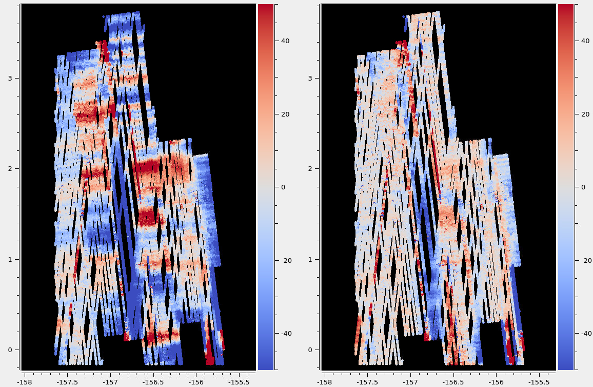
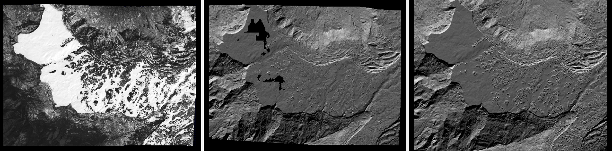
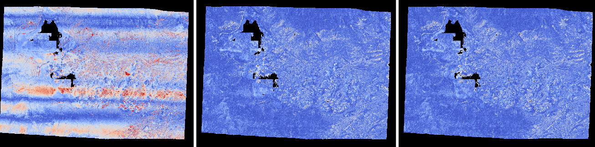
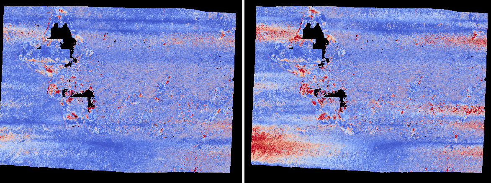
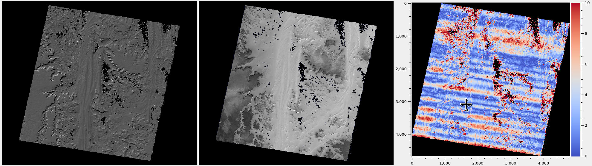
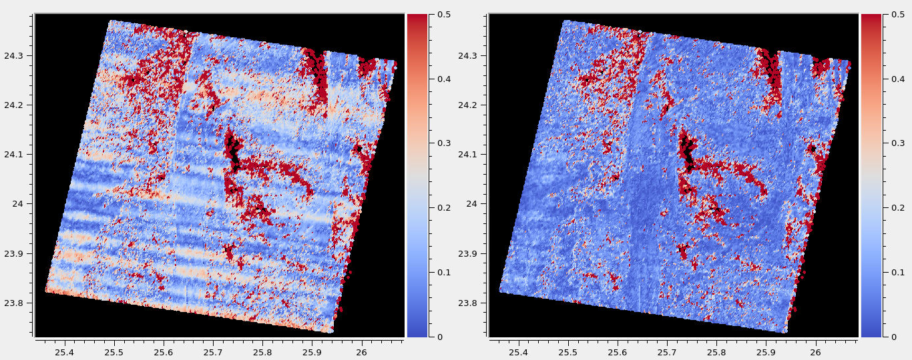
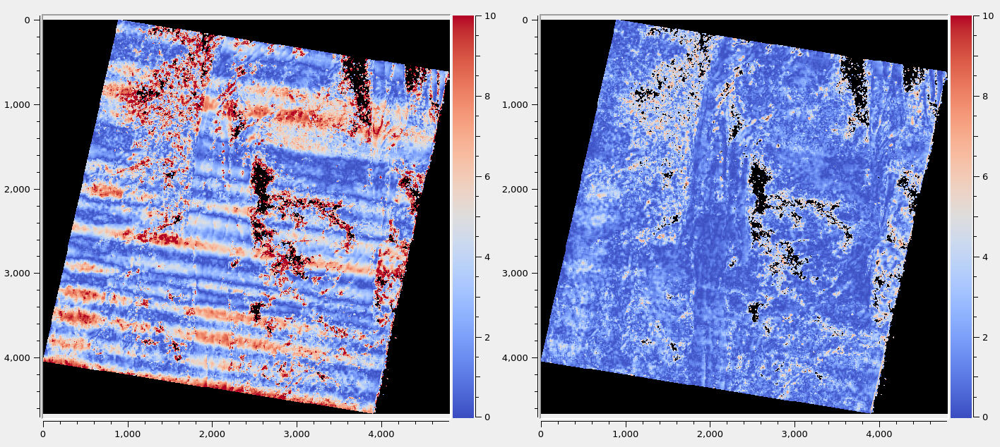
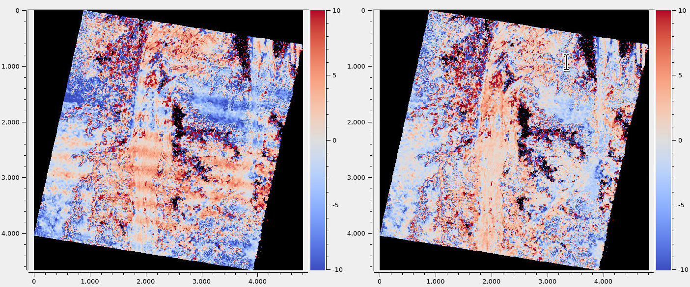

.. _jitter_solve:

jitter_solve
-------------

The ``jitter_solve`` program takes as input several overlapping images and
linescan and/or frame camera models in CSM format (such as for LRO NAC, CTX,
HiRISE, Airbus Pleiades, DigitalGlobe, etc., :numref:`csm`) and adjusts each
individual camera position and orientation in the linescan model to make them
more consistent to each other and to the ground.

The goal is to reduce the effect of unmeasured perturbations in the
linescan sensor as it acquires the data. This is quite analogous to
what ``bundle_adjust`` does (:numref:`bundle_adjust`), except that the
latter tool has just a single position and orientation per camera,
instead of a sequence of them.

Usage::

     jitter_solve <images> <cameras> <input adjustments> \
       -o <output prefix> [options]

.. _jitter_ground:

Ground constraints
~~~~~~~~~~~~~~~~~~

Optimizing the cameras to reduce the jitter and make them self-consistent can
result in the camera system moving away from the initial location or warping in
any eventually produced DEM.

Hence, ground and camera constraints are very important. This tool uses
several kinds of constraints. They are described below, and an example of
comparing different ground constraints is given in :numref:`jitter_pleiades`.

.. _jitter_tri_constraint:

Intrinsic constraint
^^^^^^^^^^^^^^^^^^^^

Triangulated ground points obtained from interest point matches are kept, during
optimization, close to their initial values. This works well when the images
have very good overlap. 

This is controlled by the option ``--tri-weight`` whose default value is 0.1.
This is divided by the image GSD when computing the cost function, to make the
distances on the ground in units of pixel.

A report file having the change in triangulated points is written to disk
(:numref:`jitter_cam_offsets`). It can help evaluate the effect of this
constraint. Also check the pixel reprojection errors per camera
(:numref:`jitter_errors_per_camera`) and per triangulated point
(:numref:`jitter_err_per_point`), before and after solving for jitter.

Triangulated points that are constrained via a DEM (option
``--heights-from-dem``, :numref:`jitter_dem_constraint`), that is, those that
are near a valid portion of this DEM, are not affected by the triangulation
constraint.

The implementation is just as for bundle adjustment
(:numref:`ba_ground_constraints`). 

An example is given in :numref:`jitter_dg`. See :numref:`jitter_options` for the
full description of this option.

.. _jitter_dem_constraint:

Extrinsic constraint
^^^^^^^^^^^^^^^^^^^^

This ties the triangulated ground points obtained from interest point matches to
an external DEM, which may be at a lower resolution than the images. It is
expected that this external DEM is *well-aligned* with the input cameras (see
:numref:`ba_pc_align` for how do the alignment). 

This option is named ``--heights-from-dem``, and it is controlled via
``--heights-from-dem-uncertainty`` and ``--heights-from-dem-robust-threshold``.
The use these options is shown in :numref:`jitter_ctx`.

The previously mentioned intrinsic constraint will be employed where the
triangulated points are not close to the DEM given by this option. 

The DEM constraint is preferred, if a decent DEM that is well-aligned with the
cameras is available.

The implementation is the same as for bundle adjustment
(:numref:`heights_from_dem`).

.. _jitter_camera:

Camera constraints
~~~~~~~~~~~~~~~~~~

Jitter is believed to be caused by vibrations in the linescan camera as it
acquires the image. If that is the case, the camera positions are likely
accurate, and can be constrained to not move much, while the orientations can
move more. 

The default behavior is to have no camera position constraint. This is
controlled by the option ``--camera-position-weight``, whose default value is
0.0. This option scales appropriately with the number of interest points, the
local averaged GSD, anchor points, and their weight. This can impede the
optimization, so should be used with care.

More details can be found in the ``bundle_adjust`` documentation, as the same
logic is used for both tools (:numref:`ba_cam_constraints`).

This program writes a report file that records the changes in camera position
(:numref:`jitter_cam_offsets`). It is suggested to examine it and adjust the
camera constraints, if appropriate.

Camera position and ground constraints should be sufficient. It is suggested not
to use the experimental ``--rotation-weight`` option.

Resampling the poses
~~~~~~~~~~~~~~~~~~~~

Often times, the number of tabulated camera positions and orientations
in the CSM file is very small. For example, for Airbus Pleiades, the
position is sampled every 30 seconds, while acquiring the whole image
can take only 1.6 seconds. For CTX the opposite problem happens, the
orientations are sampled too finely, resulting in too many variables
to optimize.

Hence, it is strongly suggested to resample the provided positions and
orientations before the solver optimizes them. Use the options:
``--num-lines-per-position`` and ``--num-lines-per-orientation``. The
estimated number of lines per position and orientation will be printed
on screen, before and after resampling.

In the two examples below drastically different sampling rates will be
used. Inspection of residual files (:numref:`jitter_out_files`),
and of triangulation errors (:numref:`triangulation_error`)
and DEM differences after solving for jitter
(:numref:`jitter_dg`) can help decide the sampling rate.

.. _jitter_ip:

Interest point matches
~~~~~~~~~~~~~~~~~~~~~~

Since solving for jitter is a fine-grained operation, modifying many positions
and orientations along the satellite track, many dense and uniformly distributed
interest points are necessary. It is suggested to create these with *pairwise
stereo*, with the option ``--num-matches-from-disparity`` (:numref:`dense_ip`).
An example is shown in :numref:`jitter_ctx`.

The most accurate interest points are obtained when the images are mapprojected.
This is illustrated in :numref:`jitter_dg`. The produced interest point
matches will be, however, between the original, unprojected images, as expected
by the solver. 

All interest point matches from disparity must be copied to a single directory
and *renamed according ot the naming convention* (:numref:`ba_match_files`).
The jitter solver is passed the prefix of these files with the option
``--match-files-prefix``.

If having more than two images, one can do pairwise stereo to get dense matches.
For a large number of images this is prohibitive, so a representative subset may
do.

It is suggested to call ``jitter_solve`` with a large value of
``--max-pairwise-matches``, such as 40000.

Examine the produced ``pointmap.csv`` files to see the residuals for the
interest points (:numref:`jitter_out_files`).

This program can read interest point matches in the ISIS control network format,
using the option ``--isis-cnet``. See :numref:`ba_out_files` in the the
``bundle_adjust``  manual for more details about control networks and this
format. Unlike that program, ``jitter_solve`` does not save an updated control
network, as this tool changes the triangulated points only in very minor ways.

.. _jitter_anchor_points:

Anchor points
~~~~~~~~~~~~~

The anchor points constraint uses a well-aligned external DEM, but with
important differences, as compared to interest point matches. 

The anchor points are created based on pixels that are uniformly distributed
over each image, not just where the images overlap, and can even go beyond the
first and last image line. This ensures that the optimized poses do not
oscillate where the images overlap very little or not at all.

This constraint works by projecting rays to the ground from the chosen
uniformly distributed pixels, finding the *anchor points* where the
rays intersect the DEM, then adding to the cost function to optimize
reprojection errors (:numref:`bundle_adjustment`) for the anchor
points. This complements the reprojection errors from triangulated
interest point matches, and the external DEM constraint (if used).

Anchor points are strongly encouraged either with an intrinsic
constraint or an external DEM constraint. Their number should be
similar to the number of interest points, and it should be large if
the poses are resampled very finely (see next section).

The relevant options are ``--num-anchor-points``,
``--num-anchor-points-per-tile``, ``--anchor-weight``, ``--anchor-dem``, and
``--num-anchor-points-extra-lines``.  An example is given in
:numref:`jitter_dg`.

Solving for intrinsics 
~~~~~~~~~~~~~~~~~~~~~~

For some datasets there can be both jitter and lens distortion effects, such
as for Kaguya TC (:numref:`kaguya_ba`, :numref:`jitter_kaguya`). In such cases,
the stronger phenomenon should be solved for first. 

The ``bundle_adjust`` and ``jitter_solve`` programs can use each other's output
cameras as inputs, as each saves image and optimized camera lists
(:numref:`ba_out_cams`), which can then be passed in to the other program the
via the ``--image-list`` and ``--camera-list`` options.

.. _jitter_ctx:

Example 1: CTX images on Mars
~~~~~~~~~~~~~~~~~~~~~~~~~~~~~

A CTX stereo pair will be used which has quite noticeable jitter.
See :numref:`jitter_multiple_images` for a discussion of multiple images,
and a similar example for KaguyaTC in :numref:`jitter_kaguya`.

Input images
^^^^^^^^^^^^

The pair consists of images with ids::

    J03_045820_1915_XN_11N210W
    K05_055472_1916_XN_11N210W

See :numref:`ctx_example` for how to prepare the image files and
:numref:`create_csm_linescan` for how to create CSM camera models.

All produced images and cameras were stored in a directory named
``img``.

.. _jitter_solve_ctx_dem:

Reference datasets
^^^^^^^^^^^^^^^^^^

The MOLA dataset from:

    https://ode.rsl.wustl.edu/mars/datapointsearch.aspx

is used for alignment. The data for the following (very generous)
longitude-latitude extent was fetched: 146E to 152E, and 7N to 15N.
The obtained CSV file was saved as ``mola.csv``.

A gridded DEM produced from this unorganized set of points
is shipped with the ISIS data. It is gridded at 463 meters
per pixel, which is quite coarse compared to CTX images,
which are at 6 m/pixel, but it is good enough to constrain
the cameras when solving for jitter. A clip can be cut out of 
it with the command::

    gdal_translate -co compress=lzw -co TILED=yes              \
     -co INTERLEAVE=BAND -co BLOCKXSIZE=256 -co BLOCKYSIZE=256 \
     -projwin -2057237.6 1077503.1 -1546698.4 275566.33        \
     $ISISDATA/base/dems/molaMarsPlanetaryRadius0005.cub       \
     ref_dem_shift.tif

This one has a 190 meter vertical shift relative to the preferred Mars
radius of 3396190 meters, which can be removed as follows::

    image_calc -c "var_0-190" -d float32 ref_dem_shift.tif \
      -o ref_dem.tif

As a sanity check, one can take the absolute difference of this DEM
and the MOLA csv file as::

    geodiff --absolute --csv-format 1:lon,2:lat,5:radius_m \
      mola.csv ref_dem.tif

This will give a median difference of 3 meters, which is about right, given the
uncertainties in these datasets.

A DEM can can also be created from MOLA data as::

    point2dem -r mars --tr 500            \
      --stereographic --auto-proj-center  \
      --csv-format 1:lon,2:lat,5:radius_m \
      --search-radius-factor 10           \
      mola.csv

This DEM can be blurred with ``dem_mosaic``, with the option ``--dem-blur-sigma
5``.
 
Uncorrected DEM creation
^^^^^^^^^^^^^^^^^^^^^^^^

Bundle adjustment is run first::

    bundle_adjust                               \
      --ip-per-image 20000                      \
      --max-pairwise-matches 100000             \
      --tri-weight 0.1                          \
      --tri-robust-threshold 0.1                \
      --camera-weight 0                         \
      --remove-outliers-params '75.0 3.0 10 10' \
      img/J03_045820_1915_XN_11N210W.cal.cub    \
      img/K05_055472_1916_XN_11N210W.cal.cub    \
      img/J03_045820_1915_XN_11N210W.cal.json   \
      img/K05_055472_1916_XN_11N210W.cal.json   \
      -o ba/run

The triangulation weight was used to help the cameras from drifting.
Outlier removal was allowed to be more generous (hence the values of
10 pixels above) as perhaps due to jitter some triangulated points
obtained from interest point matches may not project perfectly in the
cameras.

Here we chose to use a large value for ``--max-pairwise-matches`` and
we will do the same when solving for jitter below. That is because
jitter-solving is a finer-grained operation than bundle adjustment,
and a lot of interest point matches are needed. 

It is very important to inspect the ``final_residuals_stats.txt`` report file to
ensure each image has had enough features and has small enough reprojection
errors (:numref:`ba_out_files`).

Stereo is run next. The ``local_epipolar`` alignment
(:numref:`running-stereo`) here did a flawless job, unlike
``affineepipolar`` alignment which resulted in some blunders.
::

    parallel_stereo                              \
      --bundle-adjust-prefix ba/run              \
      --stereo-algorithm asp_mgm                 \
      --num-matches-from-disparity 40000         \
      --alignment-method local_epipolar          \
      img/J03_045820_1915_XN_11N210W.cal.cub     \
      img/K05_055472_1916_XN_11N210W.cal.cub     \
      img/J03_045820_1915_XN_11N210W.cal.json    \
      img/K05_055472_1916_XN_11N210W.cal.json    \
      stereo/run
    point2dem --stereographic --auto-proj-center \
      --errorimage stereo/run-PC.tif

Note how above we chose to create dense interest point matches from
disparity. They will be used to solve for jitter. We used the option
``--num-matches-from-disparity``. See :numref:`jitter_ip` for
more details.

See :numref:`nextsteps` for a discussion about various speed-vs-quality choices
for stereo. Consider using mapprojected images (:numref:`mapproj-example`).

We chose to use here a local stereographic projection (:numref:`point2dem`). 

This DEM was aligned to MOLA and recreated, as::

    pc_align --max-displacement 400              \
      --csv-format 1:lon,2:lat,5:radius_m        \
      stereo/run-DEM.tif mola.csv                \
      --save-inv-transformed-reference-points    \
      -o stereo/run-align
    point2dem --stereographic --auto-proj-center \
      stereo/run-align-trans_reference.tif

The value in ``--max-displacement`` may need tuning
(:numref:`pc_align`).

This transform was applied to the cameras (note that this approach is applicable *only*
when the first cloud in ``pc_align`` was the ASP-produced DEM, otherwise see :numref:`ba_pc_align`)::

    bundle_adjust                                                \
      --input-adjustments-prefix ba/run                          \
      --initial-transform stereo/run-align-inverse-transform.txt \
      img/J03_045820_1915_XN_11N210W.cal.cub                     \
      img/K05_055472_1916_XN_11N210W.cal.cub                     \
      img/J03_045820_1915_XN_11N210W.cal.json                    \
      img/K05_055472_1916_XN_11N210W.cal.json                    \
      --apply-initial-transform-only                             \
      -o ba_align/run

Solving for jitter
^^^^^^^^^^^^^^^^^^

Then, jitter was solved for, using the *original cameras*, with the adjustments prefix
having the latest refinements and alignment::

    jitter_solve                               \
      img/J03_045820_1915_XN_11N210W.cal.cub   \
      img/K05_055472_1916_XN_11N210W.cal.cub   \
      img/J03_045820_1915_XN_11N210W.cal.json  \
      img/K05_055472_1916_XN_11N210W.cal.json  \
      --input-adjustments-prefix ba_align/run  \
      --max-pairwise-matches 1000000           \
      --match-files-prefix stereo/run-disp     \
      --num-lines-per-position    1000         \
      --num-lines-per-orientation 1000         \
      --max-initial-reprojection-error 20      \
      --heights-from-dem ref_dem.tif           \
      --heights-from-dem-uncertainty 20.0      \
      --num-iterations 10                      \
      --num-anchor-points 0                    \
      --anchor-weight 0                        \
      --tri-weight 0.1                         \
      -o jitter/run

It was found that using about 1000 lines per pose (position and
orientation) sample gave good results, and if using too few lines, the
poses become noisy. 

*Dense interest point matches* appear necessary for a good result, though perhaps
the number produced during stereo could be lowered. See :numref:`jitter_ip`.

Here *anchor points* were not used. They can be necessary to stabilize the
solution (:numref:`jitter_anchor_points`).

The constraint relative to the reference DEM is needed, to make sure
the DEM produced later agrees with the reference one.  Otherwise, the
final solution may not be unique, as a long-wavelength perturbation
consistently applied to all obtained camera trajectories may work just
as well.

The camera position is controlled with the default value of
``--camera-position-weight`` (:numref:`jitter_camera`), and that, together with
the ground constraint, is sufficient.

The model states (:numref:`csm_state`) of optimized cameras are saved
with names like::

    jitter/run-*.adjusted_state.json

Then, stereo can be redone, just at the triangulation stage, which
is much faster than doing it from scratch. The optimized cameras were
used::

    parallel_stereo                                                 \
      --prev-run-prefix stereo/run                                  \
      --stereo-algorithm asp_mgm                                    \
      --alignment-method local_epipolar                             \
      img/J03_045820_1915_XN_11N210W.cal.cub                        \
      img/K05_055472_1916_XN_11N210W.cal.cub                        \
      jitter/run-J03_045820_1915_XN_11N210W.cal.adjusted_state.json \
      jitter/run-K05_055472_1916_XN_11N210W.cal.adjusted_state.json \
      stereo_jitter/run
    point2dem --stereographic --auto-proj-center                    \
      --errorimage stereo_jitter/run-PC.tif

To validate the results, first the triangulation (ray intersection) error
(:numref:`point2dem`) was plotted, before and after solving for jitter. These
were colorized as::

    colormap --min 0 --max 10 stereo/run-IntersectionErr.tif
    colormap --min 0 --max 10 stereo_jitter/run-IntersectionErr.tif

The result is below.

.. figure:: ../images/jitter_intersection_error.png
   :name: ctx_jitter_intersection_error

   The colorized triangulation error (max shade of red is 10 m)
   before and after optimization for jitter.

Then, the absolute difference was computed between the sparse MOLA
dataset and the DEM after alignment and before solving for jitter, and
the same was done with the DEM produced after solving for it::

    geodiff --absolute                                  \
      --csv-format 1:lon,2:lat,5:radius_m               \
      stereo/run-align-trans_reference-DEM.tif mola.csv \
      -o stereo/run

    geodiff --absolute                                  \
      --csv-format 1:lon,2:lat,5:radius_m               \
      stereo_jitter/run-DEM.tif mola.csv                \
      -o stereo_jitter/run

Similar commands are used to find differences with the
reference DEM::

    geodiff --absolute ref_dem.tif                \
      stereo/run-align-trans_reference-DEM.tif -o \
      stereo/run
    colormap --min 0 --max 20 stereo/run-diff.tif

    geodiff --absolute ref_dem.tif                \
      stereo_jitter/run-DEM.tif                   \
      -o stereo_jitter/run
    colormap --min 0 --max 20 stereo_jitter/run-diff.tif

Plot with::

    stereo_gui --colorize --min 0 --max 20 \
       stereo/run-diff.csv                 \
       stereo_jitter/run-diff.csv          \
       stereo/run-diff_CMAP.tif            \
       stereo_jitter/run-diff_CMAP.tif     \
       stereo_jitter/run-DEM.tif           \
       ref_dem.tif

DEMs can later be hillshaded. 

.. figure:: ../images/jitter_dem_diff.png
   :name: ctx_jitter_dem_diff_error

   From left to right are shown colorized absolute differences of
   (a) jitter-unoptimized but aligned DEM and MOLA (b)
   jitter-optimized DEM and MOLA
   (c) unoptimized DEM and reference DEM (d) jitter-optimized
   DEM and reference DEM. Then, (e) hillshaded optimized DEM (f)
   hillshaded reference DEM . The max shade of red is 20 m difference.

It can be seen that the banded systematic error due to jitter is gone,
both in the triangulation error maps and DEM differences. The produced
DEM still disagrees somewhat with the reference, but we believe that
this is due to the reference DEM being very coarse, per plots (e) and
(f) in the figure.

.. _jitter_multiple_images:

Multiple CTX images
^^^^^^^^^^^^^^^^^^^

Jitter was solved jointly for a set of 27 CTX images with much overlap.
The extent was roughly between -157.8 and -155.5 degrees of longitude, and from
-0.3 to 3.8 degrees of latitude. 

Bundle adjustment for the entire set was run as before. The
``convergence_angles.txt`` report file (:numref:`ba_conv_angle`) was used to
find stereo pairs. Only stereo pairs with a median convergence angle of at least
5 degrees were processed, and which had at least several dozen shared interest
points. This produced in 42 stereo pairs.

The resulting stereo DEMs can be mosaicked with ``dem_mosaic``
(:numref:`dem_mosaic`). Alignment to MOLA can be done as before, and the 
alignment transform must be applied to the cameras (:numref:`ba_pc_align`).

Then, jitter was solved for, as earlier, but for the entire set at once. The
dense pairwise matches were used. They were copied from individual stereo
directories to a single directory. It is important to use the proper naming
convention (:numref:`ba_match_files`).

One could augment the dense matches with all *clean* sparse matches from bundle
adjustment, if renamed to the proper convention. This can be helpful to ensure
all images are tied together.

The DEM used as a constraint can be either the existing gridded MOLA product, or
it can be created from MOLA with ``point2dem`` (:numref:`jitter_solve_ctx_dem`).
Here the second option was used. Consider adjusting the value of
``--heights-from-dem-uncertainty``. Tightening the DEM constraint is
usually not problematic, if the alignment to the DEM is good.

.. figure:: ../images/jitter_ctx_dem_drg.png
   :name: jitter_ctx_dem_drg

   DEM and orthoimage produced by mosaicking the results for the 27 stereo
   pairs. Some seams in the DEMs are seen. Perhaps it is due to insufficiently
   good distortion modeling. For the orthoimages, the first encountered pixel
   was used at a given location.

.. figure:: ../images/jitter_ctx_error_image.png
   :name: jitter_ctx_error_image

   Mosaicked triangulation error image (:numref:`triangulation_error`), before
   (left) and after (right) solving for jitter. The range of values is between 0
   and 15 meters. It can be seen that the triangulation error greatly decreases.
   This was produced with ``dem_mosaic --max``.

   Signed difference of the mosaicked DEM and MOLA before (left) and after
   (right) solving for jitter. It can be seen that the jitter artifacts are
   greatly attenuated. Some systematic error is seen in the vertical direction,
   roughly in the middle of the image. It is in the area where the MOLA data is
   sparsest, and maybe that results in the ground constraint not working as
   well. Or could be related to the seams issue noted earlier.

.. _jitter_dg:

Example 2: WorldView-3 DigitalGlobe images on Earth
~~~~~~~~~~~~~~~~~~~~~~~~~~~~~~~~~~~~~~~~~~~~~~~~~~~

Jitter was successfully solved for a pair of WorldView-3 images over a
mountainous site in `Grand Mesa
<https://en.wikipedia.org/wiki/Grand_Mesa>`_, Colorado, US.

This is a much more challenging example than the earlier one for CTX,
because:

 - Images are much larger, at 42500 x 71396 pixels, compared to 5000 x
   52224 pixels for CTX.
 - The jitter appears to be at much higher frequency, necessitating
   using 50 image lines for each position and orientation to optimize
   rather than 1000.
 - Many dense interest point matches and anchor points are needed
   to capture the high-frequency jitter Many anchor points are needed
   to prevent the solution from becoming unstable at earlier and later
   image lines.
 - The terrain is very steep, which introduces some extraneous signal
   in the problem to optimize.
   
We consider a dataset with two images named 1.tif and 2.tif, and corresponding
camera files 1.xml and 2.xml, having the exact DigitalGlobe linescan model.

Bundle adjustment
^^^^^^^^^^^^^^^^^

Bundle adjustment was invoked first to reduce any gross errors between
the cameras::

    bundle_adjust                               \
      -t dg                                     \
      --ip-per-image 10000                      \
      --tri-weight 0.1                          \
      --tri-robust-threshold 0.1                \
      --camera-weight 0                         \
      --remove-outliers-params '75.0 3.0 10 10' \
      1.tif 2.tif                               \
      1.xml 2.xml                               \
      -o ba/run

A lot of interest points were used, and the outlier filter threshold
was generous, since because of trees and shadows in the images likely
some interest points may not be too precise but they could still be
good.

Mapprojection
^^^^^^^^^^^^^

Because of the steep terrain, the images were mapprojected onto the
Copernicus 30 m DEM (:numref:`initial_terrain`). We name that DEM
``ref.tif``. (Ensure the DEM is relative to WGS84 and not EGM96,
and convert if necessary; see :numref:`conv_to_ellipsoid`.)

.. figure:: ../images/grand_mesa_copernicus_dem.png
   :scale: 50%
   :name: grand_mesa_copernicus_dem

   The Copernicus 30 DEM for the area of interest. Some of the
   topographic signal, including cliff edges and trees will be
   noticeable in the error images produced below.

Mapprojection of the two images (:numref:`mapproj-example`)::

    proj="+proj=utm +zone=13 +datum=WGS84 +units=m +no_defs"
    for i in 1 2; do
      mapproject -t rpc                         \
      --nodes-list nodes_list.txt               \
      --tr 0.4                                  \
      --t_srs "$proj"                           \
      --bundle-adjust-prefix ba/run             \
      ref.tif ${i}.tif ${i}.xml ${i}.map.ba.tif
    done

Stereo
^^^^^^

Stereo was done with the ``asp_mgm`` algorithm. It was very important
to use ``--subpixel-mode 9``. Using ``--subpixel-mode 1`` was
resulting in subpixel artifacts which were dominating the jitter. Mode
3 (or 2) would have worked as well but it is a lot slower. It also appears
that it is preferable to use mapprojected images than some other
alignment methods as those would result in more subpixel artifacts which would
obscure the jitter signal which we will solve for.

The option ``--max-disp-spread 100`` was used because the images
had many clouds (:numref:`handling_clouds`).

A large number of dense matches from stereo disparity will be created, to
be used later to solve for jitter.

::

    parallel_stereo                                \
      -t dgmaprpc                                  \
      --max-disp-spread 100                        \
      --nodes-list nodes_list.txt                  \
      --ip-per-image 10000                         \
      --stereo-algorithm asp_mgm                   \
      --subpixel-mode 9                            \
      --processes 6                                \
      --alignment-method none                      \
      --num-matches-from-disparity 60000           \
      --keep-only '.exr L.tif F.tif PC.tif .match' \
      1.map.tif 2.map.tif 1.xml 2.xml              \
      run_1_2_map/run                              \
      ref.tif

    proj="+proj=utm +zone=13 +datum=WGS84 +units=m +no_defs"
    point2dem --tr 0.4 --t_srs "$proj" --errorimage \ 
      run_1_2_map/run-PC.tif

Alignment
^^^^^^^^^

Align the stereo DEM to the reference DEM::

    pc_align --max-displacement 100           \
      run_1_2_map/run-DEM.tif ref.tif         \
      --save-inv-transformed-reference-points \
      -o align/run
    proj="+proj=utm +zone=13 +datum=WGS84 +units=m +no_defs"
    point2dem --tr 0.4 --t_srs "$proj" align/run-trans_reference.tif

It is suggested to hillshade and inspect the obtained DEM and overlay
it onto the hillshaded reference DEM. The ``geodiff`` command
(:numref:`geodiff`) can be used to take their difference.

Apply the alignment transform to the bundle-adjusted cameras,
to align them with the reference terrain::

    bundle_adjust                                         \
      --input-adjustments-prefix ba/run                   \
      --match-files-prefix ba/run                         \
      --skip-matching                                     \
      --initial-transform align/run-inverse-transform.txt \
      1.tif 2.tif 1.xml 2.xml                             \
      --apply-initial-transform-only                      \
      -o align/run

If the clouds in ``pc_align`` were in reverse order, the direct transform must
be used, *not the inverse* (:numref:`ba_pc_align`).

Solving for jitter
^^^^^^^^^^^^^^^^^^

Copy the produced dense interest point matches for use in solving for jitter::

    mkdir -p dense
    cp run_1_2_map/run-disp-1.map__2.map.match \
      dense/run-1__2.match

See :numref:`jitter_ip` for a longer explanation regarding dense interest point
matches.

Solve for jitter::

    jitter_solve                              \
      1.tif 2.tif                             \
      1.xml 2.xml                             \
      --input-adjustments-prefix align/run    \
      --match-files-prefix dense/run          \
      --num-iterations 10                     \
      --max-pairwise-matches 1000000          \
      --max-initial-reprojection-error 10     \
      --tri-weight 0.1                        \
      --tri-robust-threshold 0.1              \
      --num-lines-per-position    200         \
      --num-lines-per-orientation 200         \
      --heights-from-dem ref.tif              \
      --heights-from-dem-uncertainty 10       \
      --num-anchor-points 10000               \
      --num-anchor-points-extra-lines 500     \
      --anchor-dem ref.tif                    \
      --anchor-weight 1.0                     \
    -o jitter/run

See :numref:`jitter_camera` regarding camera constraints.
See :numref:`jitter_anchor_points` regarding anchor points.

.. _fig_dg_jitter_pointmap_anchor_points:

.. figure:: ../images/dg_jitter_pointmap_anchor_points.png
   :name: dg_jitter_pointmap_anchor_points

   The pixel reprojection errors per triangulated point (first column) and per
   anchor point (second column) before and after (left and right) solving for
   jitter. Blue shows an error of 0, and red is an error of at least 0.3 pixels.

It can be seen in :numref:`fig_dg_jitter_pointmap_anchor_points` that
after optimization the jitter (oscillatory pattern) goes away, but the
errors per anchor point do not increase much. The remaining red points
are because of the steep terrain. See :numref:`jitter_out_files` for
description of these output files and how they were plotted.

Redoing mapprojection and stereo
^^^^^^^^^^^^^^^^^^^^^^^^^^^^^^^^

(See also section :numref:`jitter_reuse_run` for a more efficient approach in
ASP 3.3.0 or later.)

Mapproject the optimized CSM cameras::

    proj="+proj=utm +zone=13 +datum=WGS84 +units=m +no_defs"
    for i in 1 2; do 
      mapproject -t csm                     \
        --nodes-list nodes_list.txt         \
        --tr 0.4 --t_srs "$proj"            \
        ref.tif ${i}.tif                    \
        jitter/run-${i}.adjusted_state.json \
        ${i}.jitter.map.tif
    done
 
Run stereo::

    parallel_stereo                                        \
      --max-disp-spread 100                                \
      --nodes-list nodes_list.txt                          \
      --ip-per-image 20000                                 \
      --stereo-algorithm asp_mgm                           \
      --subpixel-mode 9                                    \
      --processes 6                                        \
      --alignment-method none                              \
      --keep-only '.exr L.tif F.tif PC.tif map.tif .match' \
      1.jitter.map.tif 2.jitter.map.tif                    \
      jitter/run-1.adjusted_state.json                     \
      jitter/run-2.adjusted_state.json                     \
      stereo_jitter/run                                    \
      ref.tif

    point2dem --tr 0.4 --t_srs "$proj"                     \
      --errorimage                                         \
      stereo_jitter/run-PC.tif

.. _jitter_reuse_run:

Reusing a previous run
^^^^^^^^^^^^^^^^^^^^^^

In ASP 3.3.0 or later, the mapprojection need not be redone,
and stereo can resume at the triangulation stage
(:numref:`mapproj_reuse`). This saves a lot of computing. The commands in the
previous section can be replaced with::

    parallel_stereo                                        \
      --max-disp-spread 100                                \
      --nodes-list nodes_list.txt                          \
      --ip-per-image 20000                                 \
      --stereo-algorithm asp_mgm                           \
      --subpixel-mode 9                                    \
      --processes 6                                        \
      --alignment-method none                              \
      --keep-only '.exr L.tif F.tif PC.tif map.tif .match' \
      --prev-run-prefix run_1_2_map/run                    \
      1.map.tif 2.map.tif                                  \
      jitter/run-1.adjusted_state.json                     \
      jitter/run-2.adjusted_state.json                     \
      stereo_jitter/run                                    \
      ref.tif

    point2dem --tr 0.4 --t_srs "$proj"                     \
      --errorimage                                         \
      stereo_jitter/run-PC.tif

Note how we used the old mapprojected images ``1.map.tif`` and ``2.map.tif``,
the option ``--prev-run-prefix`` pointing to the old run, while
the triangulation is done with the new jitter-corrected cameras. 

Validation
^^^^^^^^^^

The geodiff command (:numref:`geodiff`) can be used to take the absolute
difference of the aligned DEM before jitter correction and the one
after it::

    geodiff --float --absolute align/run-trans_reference-DEM.tif \
      stereo_jitter/run-DEM.tif -o stereo_jitter/run

See :numref:`fig_dg_jitter_intersection_err_dem_diff` for results.
 
.. _fig_dg_jitter_intersection_err_dem_diff:

.. figure:: ../images/dg_jitter_intersection_err_dem_diff.png
   :name: dg_jitter_intersection_err_dem_diff

   The colorized triangulation error (:numref:`triangulation_error`)
   before and after solving for jitter, and the absolute difference of
   the DEMs before and after solving for jitter
   (left-to-right). It can be seen that the oscillatory pattern in the
   intersection error is gone, and the DEM changes as a result. The
   remaining signal is due to the steep terrain, and is
   rather small.

.. _jitter_pleiades:

Example 3: Airbus Pleiades
~~~~~~~~~~~~~~~~~~~~~~~~~~

In this section we will solve for jitter with Pleiades linescan
cameras. We will investigate the effects of two kinds of ground
constraints: ``--tri-weight`` and ``--heights-from-dem``
(:numref:`jitter_ground`). The first constraint tries to keep the
triangulated points close to where they are, and the second tries to
tie them to a reference DEM. Note that if these are used together, the
first one will kick in only in regions where there is no coverage in
the provided DEM.

The conclusion is that if the two kinds of ground constraints are
weak, and the reference DEM is decent, the results are rather similar.
The DEM constraint is preferred if a good reference DEM is available,
and the cameras are aligned to it.

Creation of terrain model
^^^^^^^^^^^^^^^^^^^^^^^^^

The site used is Grand Mesa, as in :numref:`jitter_dg`, and the two
recipes also have similarities.

First, a reference DEM (Copernicus) for the area is fetched, and
adjusted to be relative to WGS84, creating the file ``ref-adj.tif``
(:numref:`initial_terrain`).

Let the images be called ``1.tif`` and ``2.tif``, with corresponding
Pleiades exact linescan cameras ``1.xml`` and ``2.xml``. Since the GSD
specified in these files is about 0.72 m, this value is used in
mapprojection of both images (:numref:`mapproj-example`)::

    proj="+proj=utm +zone=13 +datum=WGS84 +units=m +no_defs"
      mapproject --processes 4 --threads 4 \
      --tr 0.72 --t_srs "$proj"            \
      --nodes-list nodes_list.txt          \
      ref-adj.tif 1.tif 1.xml 1.map.tif

and same for the other image.

Since the two mapprojected images agree very well with the hillshaded
reference DEM when overlaid in ``stereo_gui`` (:numref:`stereo_gui`), 
no bundle adjustment was used. 

Stereo was run::

    outPrefix=stereo_map_12/run
    parallel_stereo                      \
      --max-disp-spread 100              \
      --nodes-list nodes_list.txt        \
      --ip-per-image 10000               \
      --num-matches-from-disparity 90000 \
      --stereo-algorithm asp_mgm         \
      --subpixel-mode 9                  \
      --processes 6                      \
      --alignment-method none            \
      1.map.tif 2.map.tif                \
      1.xml 2.xml                        \
      $outPrefix                         \
      ref-adj.tif                        \

DEM creation::

    proj="+proj=utm +zone=13 +datum=WGS84 +units=m +no_defs"
    point2dem --t_srs "$proj" \
      --errorimage            \
      ${outPrefix}-PC.tif

Colorize the triangulation (ray intersection) error, and create some
image pyramids for inspection later::

    colormap --min 0 --max 1.0 ${outPrefix}-IntersectionErr.tif
    stereo_gui --create-image-pyramids-only \
      --hillshade ${outPrefix}-DEM.tif
    stereo_gui --create-image-pyramids-only \
      ${outPrefix}-IntersectionErr_CMAP.tif

.. _pleiades_img_dem:

   Left to right: One of the input images, the produced hillshaded DEM,
   and the reference Copernicus DEM.

It can be seen in :numref:`pleiades_img_dem` (center) that a small
portion having snow failed to correlate. That is not a
showstopper here. Perhaps adjusting the image normalization options in
:numref:`stereodefault` may resolve this.

Correcting the jitter
^^^^^^^^^^^^^^^^^^^^^

The jitter can clearly be seen in :numref:`pleiades_err` (left).
There seem to be about a dozen oscillations. Hence, ``jitter_solve``
will be invoked with one position and orientation sample for each 500
image lines, which results in about 100 samples for these, along the
satellite track. Note that earlier we used
``--num-matches-from-disparity 90000`` which created about 300 x
300 dense interest point matches for these roughly square input
images. These numbers usually need to be chosen with some care.

Copy the dense interest point matches found in stereo, using the convention
(:numref:`ba_match_files`) expected later by ``jitter_solve``:: 

    mkdir -p matches
    /bin/cp -fv stereo_map_12/run-disp-1.map__2.map.match \
      matches/run-1__2.match

See :numref:`jitter_ip` for a longer explanation regarding interest point
matches.

Solve for jitter with the intrinsic ``--tri-weight`` ground constraint
(:numref:`jitter_ground`). Normally, the cameras should be bundle-adjusted and
aligned to the reference DEM, and then below the option
``--input-adjustments-prefix`` should be used, but in this case the initial
cameras were accurate enough, so these steps were skipped.

:: 

    jitter_solve                               \
      1.tif 1.tif                              \
      2.xml 2.xml                              \
      --match-files-prefix matches/run         \
      --num-iterations 10                      \
      --max-pairwise-matches 1000000           \
      --max-initial-reprojection-error 20      \
      --tri-weight 0.1                         \
      --tri-robust-threshold 0.1               \
      --num-lines-per-position    500          \
      --num-lines-per-orientation 500          \
      --num-anchor-points 10000                \
      --num-anchor-points-extra-lines 500      \
      --anchor-dem ref-adj.tif                 \
      --anchor-weight 0.1                      \
      -o jitter_tri/run

See :numref:`jitter_camera` for a discussion of camera constraints.
See :numref:`jitter_anchor_points` regarding anchor points.

Next, we invoke the solver with the same initial data, but with a constraint
tying to the reference DEM, with the option ``--heights-from-dem ref-adj.tif``.
Since the difference between the created stereo DEM and the reference DEM is on
the order of 5-10 meters, we will use ``--heights-from-dem-uncertainty 10``
(this could be decreased somewhat). 

   Stereo intersection error (:numref:`triangulation_error`)
   before solving for jitter (left),
   after solving for it with the ``--tri-weight`` constraint (middle)
   and with the ``--heights-from-dem`` constraint (right). Blue = 0
   m, red = 1 m.

It can be seen in :numref:`pleiades_err` that any of these constraints
can work at eliminating the jitter.

   Absolute difference of the stereo DEMs before and after 
   solving for jitter. Left: with the ``--tri-weight``
   constraint. Right: with the ``--heights-from-dem`` constraint. Blue
   = 0 m, red = 1 m.

It is very instructive to examine how much the DEM changed as a
result. It can be seen in :numref:`pleiades_dem_diff` that the reference
DEM constraint changes the result more. Likely, a smaller value
of the weight for that constraint could have been used.

.. _jitter_aster:

ASTER cameras
~~~~~~~~~~~~~

ASTER (:numref:`aster`) is a very good testbed for studying jitter because
there are millions of free images over a span of 20 years, with many over the
same location, and the images are rather small, on the order of 4,000 - 5,000
pixels along each dimension.

Setup
^^^^^

In this example we worked on a rocky site in Egypt with a latitude 24.03562
degrees and longitude of 25.85006 degrees. Dozens of cloud-free stereo pairs
are available here. The jitter pattern, including its frequency, turned out to
be quite different in each the stereo pair we tried, but the solver was able to
minimize it in all cases.

Fetch and prepare the the data as documented in :numref:`aster_fetch`. Here we will
work with dataset ``AST_L1A_00301062002090416_20231023221708_3693``.

A reference Copernicus DEM can be downloaded per :numref:`initial_terrain`. Use
``dem_geoid`` to convert the DEM to be relative to WGS84. 

Initial stereo and alignment
^^^^^^^^^^^^^^^^^^^^^^^^^^^^

We will call the two images in an ASTER stereo pair ``out-Band3N.tif`` and
``out-Band3B.tif``. This is the convention used by ``aster2asp``
(:numref:`aster2asp`), and instead of ``out`` any other string can be used. The
corresponding cameras are ``out-Band3N.xml`` and ``out-Band3B.xml``. The
reference Copernicus DEM relative to WGS84 is ``ref.tif``.

Bundle adjustment::

  bundle_adjust -t aster          \
    --aster-use-csm               \
    --camera-weight 0.0           \
    --tri-weight 0.1              \
    --tri-robust-threshold 0.1    \
    --num-iterations 50           \
    out-Band3N.tif out-Band3B.tif \
    out-Band3N.xml out-Band3B.xml \
    -o ba/run

Not using ``-t aster`` will result in RPC cameras being used, which would lead
to wrong results. We used the option ``--aster-use-csm``. This saves the
adjusted cameras in CSM format (:numref:`csm_state`), which is needed for the
jitter solver. Then the produced .adjust files should not be used as they save
the adjustments only.

Stereo was done with mapprojected images. The reference DEM was blurred a little
as it is at the resolution of the images, and then any small misalignment
between the images and the DEM may result in artifacts::

  dem_mosaic --dem-blur-sigma 2 ref.tif -o ref_blur.tif
  
Mapprojection in local stereographic projection::

  proj='+proj=stere +lat_0=24.0275 +lon_0=25.8402 +k=1 +x_0=0 +y_0=0 +datum=WGS84 +units=m +no_defs'
  mapproject -t csm                       \
   --tr 15 --t_srs "$proj"                \
    ref_blur.tif out-Band3N.tif           \
    ba/run-out-Band3N.adjusted_state.json \
    out-Band3N.map.tif
  
The same command is used for the other image. Both must use the same resolution
in mapprojection (option ``--tr``). 

It is suggested to overlay and inspect in ``stereo_gui`` (:numref:`stereo_gui`)
the produced images and the reference DEM and check for any misalignment or
artifacts. ASTER is quite well-aligned to the reference DEM.

Stereo with mapprojected images (:numref:`mapproj-example`) and DEM generation
is run. Here the ``asp_mgm`` algorithm is not used as it smears the jitter
signal::

    parallel_stereo                         \
      --stereo-algorithm asp_bm             \
      --subpixel-mode 1                     \
      --max-disp-spread 100                 \
      --num-matches-from-disparity 100000   \
      out-Band3N.map.tif out-Band3B.map.tif \
      ba/run-out-Band3N.adjusted_state.json \
      ba/run-out-Band3B.adjusted_state.json \
      stereo_bm/run                         \
      ref_blur.tif
      
    point2dem --errorimage --t_srs "$proj" \
      --tr 15 stereo_bm/run-PC.tif         \
      --orthoimage stereo_bm/run-L.tif

We chose to use option ``--num-matches-from-disparity`` to create a large and
uniformly distributed set of interest point matches. That is necessary because
the jitter that we will solve for has rather high frequency.

   Produced DEM, orthoimage and intersection error. The correlation algorithm
   has some trouble over sand, resulting in holes. The jitter is clearly
   visible, and will be solved for next. The color scale on the right is from 0
   to 10 meters.

The created DEM is brought in the coordinate system of the reference DEM. This
results in a small shift in this case, but it is important to do this each time
before solving for jitter.

::

    pc_align --max-displacement 50          \
    stereo_bm/run-DEM.tif ref.tif           \
    -o stereo_bm/run-align                  \
    --save-inv-transformed-reference-points
  
  point2dem --t_srs "$proj" --tr 15 \
    stereo_bm/run-align-trans_reference.tif

One has to be careful with the value of ``--max-displacement`` that is used
(:numref:`pc_align`).

Take the difference with the reference DEM after alignment::

  geodiff stereo_bm/run-align-trans_reference-DEM.tif \
    ref.tif -o stereo_bm/run

The result of this is shown in :numref:`aster_jitter_dem_diff`. 
Apply the alignment transform to the cameras (:numref:`ba_pc_align`)::

    bundle_adjust -t csm                        \
      --initial-transform                       \
      stereo_bm/run-align-inverse-transform.txt \
      --apply-initial-transform-only            \
      out-Band3N.map.tif out-Band3B.map.tif     \
      ba/run-out-Band3N.adjusted_state.json     \
      ba/run-out-Band3B.adjusted_state.json     \
      -o ba_align/run

It is important to use here the inverse alignment transform, as we want to map
from the stereo DEM to the reference DEM, and the forward transform would do the
opposite, given how ``pc_align`` was invoked.

If the produced difference of DEMs shows large residuals consistent with the
terrain, one should consider applying more blur to the reference terrain and/or
redoing mapprojection and stereo with the now-aligned cameras, and see if this
improves this difference.

.. _jitter_naming_convention:

Solving for jitter
^^^^^^^^^^^^^^^^^^

Copy the dense match file to follow the naming convention
for unprojected (original) images::

    mkdir -p jitter
    cp stereo_bm/run-disp-out-Band3N.map__out-Band3B.map.match \
      jitter/run-out-Band3N__out-Band3B.match

The *naming convention for the match files* is::

  <prefix>-<image1>__<image2>.match
  
where the image names are without the directory name and extension.

Here it is important to use a lot of match points and a low 
value for ``--num-lines-per-orientation`` and same for position,
because the jitter has rather high frequency.

Solve for jitter with the aligned cameras::

    jitter_solve out-Band3N.tif out-Band3B.tif        \
      ba_align/run-run-out-Band3N.adjusted_state.json \
      ba_align/run-run-out-Band3B.adjusted_state.json \
      --max-pairwise-matches 1000000                  \
      --num-lines-per-position 100                    \
      --num-lines-per-orientation 100                 \
      --max-initial-reprojection-error 20             \
      --num-iterations 10                             \
      --match-files-prefix jitter/run                 \
      --heights-from-dem ref.tif                      \
      --heights-from-dem-uncertainty 10               \
      --num-anchor-points 0                           \
      --anchor-weight 0.0                             \
      -o jitter/run

The DEM uncertainty constraint was set to 10, as the image GSD is 15 meters.
This can be reduced to 5 meters, likely.

See :numref:`jitter_camera` for a discussion of camera constraints,
and :numref:`jitter_anchor_points` regarding anchor points.

   Pixel reprojection errors (:numref:`jitter_out_files`) before (left) and
   after (right) solving for jitter. Compare with the ray intersection error
   in :numref:`aster_jitter_intersection_err`.

Then, ``parallel_stereo`` and ``point2dem`` can be run again, with the new
cameras created in the ``jitter`` directory. The ``--prev-run-prefix`` option
can be used to reuse the previous run (:numref:`jitter_reuse_run`).

   The ray intersection error before (left) and after (right) solving for
   jitter. The scale is in meters. Same pattern is seen as for the pixel
   reprojection errors earlier.

   The signed difference between the ASP DEM and the reference DEM, before
   (left) and after (right) solving for jitter. The scale is in meters. It can
   be seen that the jitter pattern is gone.
   
.. _jitter_sat_sim:

Jitter with synthetic cameras and orientation constraints
~~~~~~~~~~~~~~~~~~~~~~~~~~~~~~~~~~~~~~~~~~~~~~~~~~~~~~~~~

The effectiveness of ``jitter_solve`` can be validated using synthetic data,
when we know what the answer should be ahead of time. The synthetic data can 
created with ``sat_sim`` (:numref:`sat_sim`). See a recipe in
:numref:`sat_sim_linescan`. 

For example, one may create three linescan images and cameras, using various
values for the pitch angle, such as -30, 0, and 30 degrees, modeling a camera
that looks forward, down, and aft. One can choose to *not* have any jitter in the
images or cameras, then create a second set of cameras with *pitch*
(along-track) jitter.

Then, ``jitter_solve`` can be used to solve for the jitter. It can be invoked
with the images not having jitter and the cameras having the jitter. 

It is suggested to use the roll and yaw constraints (``--roll-weight`` and
``--yaw-weight``, with values on the order of 1e+5), to keep these angles in
check while correcting the pitch jitter.

The ``--heights-from-dem`` option should be used as well, to tie the solution to
the reference DEM. 

We found experimentally that, if the scan lines for all the input cameras are
perfectly parallel, then the jitter solver will not converge to the known
solution. This is because the optimization problem is under-constrained. If the
scan lines for different cameras meet at, for example, a 6-15 degree angle, and
the lines are long enough to offer good overlap, then the "rigidity" of a given
scan line will be able to help correct the jitter in the scan lines for the
other cameras intersecting it, resulting in a solution close to the expected
one.

See a worked-out example for how to set orientation constraints in
:numref:`jitter_linescan_frame_cam`. There, frame cameras are used as well, 
to add "rigidity" to the setup.

.. _jitter_real_cameras:

Constraining direction of jitter with real cameras
~~~~~~~~~~~~~~~~~~~~~~~~~~~~~~~~~~~~~~~~~~~~~~~~~~

For synthetic cameras created with ``sat_sim`` (:numref:`sat_sim`), it is
assumed that the orbit is a straight segment in projected coordinates (hence
an ellipse if the orbit end points are at the same height above the datum). It
is also assumed that such a camera has a fixed roll, pitch, and yaw relative to
the satellite along-track / across-track directions, with jitter added to these
angles (:numref:`sat_sim_roll_pitch_yaw`, and :numref:`sat_sim_jitter_model`).

For a real linescan satellite camera, the camera orientation is variable and not
correlated to the orbit trajectory. The ``jitter_solve`` program can then
constrain each camera sample being optimized not relative to the orbit
trajectory, but relative to initial camera orientation for that sample.

That is accomplished by invoking the jitter solver as in
:numref:`jitter_sat_sim`, with the additional option
``--initial-camera-constraint``. See the description of this option in
:numref:`jitter_options`.

This option is very experimental and its effectiveness was only partially
validated. 

This option can be used with synthetic cameras as well. The results then will be
somewhat different than without this option, especially towards orbit end
points, where the overlap with other cameras is small.

.. _jitter_linescan_frame_cam:

Mixing linescan and frame cameras
~~~~~~~~~~~~~~~~~~~~~~~~~~~~~~~~~

This solver allows solving for jitter using a combination of linescan and frame
(pinhole) cameras, if both of these are stored in the CSM format (:numref:`csm`). 
How to convert existing cameras to this format is described in :numref:`cam_gen_frame`
and :numref:`cam_gen_linescan`.

For now, this functionality was validated only with synthetic cameras created
with ``sat_sim`` (:numref:`sat_sim`). In this case, roll and yaw constraints for
the orientations of cameras being optimized are supported, for both linescan and
frame cameras.

When using real data, it is important to ensure they are acquired at close-enough
times, with similar illumination and ground conditions (such as snow thickness).

Here is a detailed recipe.

Consider a DEM named ``dem.tif``, and an orthoimage named ``ortho.tif``. Let ``x``
be a column index in the DEM and ``y1`` and ``y2`` be two row indices. These
will determine path on the ground seen by the satellite. Let ``h`` be the
satellite height above the datum, in meters. Set, for example::

    x=4115
    y1=38498
    y2=47006
    h=501589
    opt="--dem dem.tif
      --ortho ortho.tif
      --first $x $y1 $h
      --last  $x $y2 $h
      --first-ground-pos $x $y1
      --last-ground-pos  $x $y2
      --frame-rate 45
      --jitter-frequency 5
      --focal-length 551589
      --optical-center 2560 2560
      --image-size 5120 5120
      --velocity 7500
      --save-ref-cams"

Create nadir-looking frame images and cameras with no jitter::

    sat_sim $opt                  \
      --save-as-csm               \
      --sensor-type pinhole       \
      --roll 0 --pitch 0 --yaw 0  \
      --horizontal-uncertainty    \
      "0.0 0.0 0.0"               \
      --output-prefix jitter0.0/n

Create a forward-looking linescan image and camera, with no jitter::

    sat_sim $opt                  \
      --sensor-type linescan      \
      --roll 0 --pitch 30 --yaw 0 \
      --horizontal-uncertainty    \
      "0.0 0.0 0.0"               \
      --output-prefix jitter0.0/f

Create a forward-looking linescan camera, with no images, with pitch jitter::

    sat_sim $opt                  \
      --no-images                 \
      --sensor-type linescan      \
      --roll 0 --pitch 30 --yaw 0 \
      --horizontal-uncertainty    \
      "0.0 2.0 0.0"               \
      --output-prefix jitter2.0/f

The tool ``cam_test`` (:numref:`cam_test`) can be run to compare the camera
with and without jitter::

    cam_test --session1 csm    \
      --session2 csm           \
      --image jitter0.0/f.tif  \
      --cam1  jitter0.0/f.json \
      --cam2  jitter2.0/f.json

This will show that projecting a pixel from the first camera to the ground and
then projecting it back to the second camera will result in around 2 pixels of
discrepancy, which makes sense give the horizontal uncertainty set above and the
fact that our images are at around 0.9 m/pixel ground resolution. 

To reliably create reasonably dense interest point matches between the frame and
linescan images, first mapproject (:numref:`mapproject`) them::

    for f in jitter0.0/f.tif                    \
             jitter0.0/n-1[0-9][0-9][0-9][0-9].tif; do 
        g=${f/.tif/} # remove .tif
        mapproject --tr 0.9                     \
          dem.tif ${g}.tif ${g}.json ${g}.map.tif
    done

This assumes that the DEM is in a local projection in units of meter. Otherwise
the ``--t_srs`` option should be set.

Create the lists of images, cameras, then a list for the mapprojected images and
the DEM. We use individual ``ls`` command to avoid the inputs being reordered::

    dir=ba
    mkdir -p $dir
    ls jitter0.0/f.tif                        >  $dir/images.txt
    ls jitter0.0/n-1[0-9][0-9][0-9][0-9].tif  >> $dir/images.txt

    ls jitter0.0/f.json                       >  $dir/cameras.txt
    ls jitter0.0/n-1[0-9][0-9][0-9][0-9].json >> $dir/cameras.txt
    
    ls jitter0.0/f.map.tif                       >  $dir/map_images.txt
    ls jitter0.0/n-1[0-9][0-9][0-9][0-9].map.tif >> $dir/map_images.txt
    ls dem.tif                                   >> $dir/map_images.txt

Run bundle adjustment to get interest point matches::

    parallel_bundle_adjust                           \
        --processes 10                               \
        --nodes-list nodes_list.txt                  \
        --num-iterations 10                          \
        --tri-weight 0.1                             \
        --camera-weight 0                            \
        --auto-overlap-params "dem.tif 15"           \
        --min-matches 5                              \
        --remove-outliers-params '75.0 3.0 10 10'    \
        --min-triangulation-angle 5.0                \
        --ip-per-tile 500                            \
        --max-pairwise-matches 6000                  \
        --image-list $dir/images.txt                 \
        --camera-list $dir/cameras.txt               \
        --mapprojected-data-list $dir/map_images.txt \
        -o ba/run

Here we assumed a minimum triangulation convergence angle of 15 degrees between
the two sets of cameras (:numref:`stereo_pairs`). See :numref:`pbs_slurm` for
how to set up the computing nodes needed for ``--nodes-list``.

We could have used a ground constraint above, but since we only need the
interest points and not the camera poses, it is not necessary. The default
camera position constraint is also on (:numref:`jitter_camera`).

Solve for jitter with a ground constraint. Use roll and yaw constraints, to
ensure movement only for the pitch angle:: 

    jitter_solve                                 \
        --num-iterations 10                      \
        --max-pairwise-matches 3000              \
        --clean-match-files-prefix               \
          ba/run                                 \
        --roll-weight 10000                      \
        --yaw-weight 10000                       \
        --max-initial-reprojection-error 100     \
        --tri-weight 0.1                         \
        --tri-robust-threshold 0.1               \
        --num-anchor-points 10000                \
        --num-anchor-points-extra-lines 500      \
        --anchor-dem dem.tif                     \
        --anchor-weight 0.05                     \
        --heights-from-dem dem.tif               \
        --heights-from-dem-uncertainty 10        \
        jitter0.0/f.tif                          \
        jitter0.0/n-images.txt                   \
        jitter2.0/f.json                         \
        jitter0.0/n-cameras.txt                  \
        -o jitter_solve/run

The value of ``--heights-from-dem-uncertainty`` should be chosen with care.

Here we used ``--max-pairwise-matches 3000`` as the linescan camera has many
matches with each frame camera image, and there are many such frame camera
images. A much larger number would be used if we had only a couple of linescan
camera images and no frame camera images.

The initial cameras were not bundle-adjusted and aligned
to the reference DEM, as they were good enough. Normally one would
use them as input to ``jitter_solve`` with the option
``--input-adjustments-prefix``.

See :numref:`jitter_camera` for a discussion of camera constraints.

Notice that the nadir-looking frame images are read from a list, in
``jitter0.0/n-images.txt``. This file is created by ``sat_sim``. All the images
in such a list must be acquired in quick succession and be along the same
satellite orbit portion, as the trajectory of all these cameras will be used to
enforce the roll and yaw constraints. 

A separate list must be created for each such orbital stretch, then added to the
invocation above. The same logic is applied to the cameras for these images.

There is a single forward-looking image, but it is linescan, so there are many
camera samples for it. 

The forward-looking camera has jitter, so we used its version from the
``jitter2.0`` directory, not the one in ``jitter0.0``.

This solver does not create anchor points for the frame cameras. There
are usually many such images and they overlap a lot, so anchor points
are not needed as much as for linescan cameras.

.. _jitter_no_baseline:

Solving for jitter with a linescan and frame rig
~~~~~~~~~~~~~~~~~~~~~~~~~~~~~~~~~~~~~~~~~~~~~~~~

In this example we consider a rig that is made of one linescan and one frame
camera. These sensors are positioned in the same location and look in the same
direction. The linescan sensor acquires a single image with many lines, while
the frame camera records many rectangular images of much smaller dimensions.
They both experience the same jitter. 

The "rigid" frame camera images are used to correct the jitter.

Synthetic data for this example can be produced as in
:numref:`jitter_linescan_frame_cam`. The ``sat_sim`` invocations for linescan
and frame cameras are the same except using different sensor dimensions and
sensor type.

A straightforward application of the jitter-solving recipe in
:numref:`jitter_linescan_frame_cam` will fail, as it is not possible to
triangulate properly the points seen by the two cameras, since the rays are
almost parallel or slightly diverging. The following adjustments are
suggested:

- Use ``--forced-triangulation-distance 500000`` for both bundle adjustment and
  jitter solving (the precise value here is not very important if the
  ``--heights-from-dem`` constraint is used). This will result in triangulated
  points even when the rays are parallel or divergent. 
- Use ``--min-triangulation-angle 1e-10`` in both bundle adjustment and jitter
  solving, to ensure we don't throw away features with small convergence angle,
  as that will be almost all of them.
- Be generous with outlier filtering when there is a lot of jitter. Use,
  for example, ``--remove-outliers-params '75.0 3.0 10 10'`` in ``bundle_adjust``
  and ``--max-initial-reprojection-error 10`` in ``jitter_solve``.
- The option ``--heights-from-dem`` should be used. It got improved in the
  latest build and does well for such degenerate rays
  (:numref:`heights_from_dem`). 
- Use ``--match-files-prefix`` instead of ``--clean-match-files-prefix`` in
  ``jitter_solve``, as maybe bundle adjustment filtered out too many good matches
  with a small convergence angle.

Here's the command for solving for jitter, and the bundle adjustment command 
that creates the interest point matches is similar.

::

    jitter_solve                                \
        --forced-triangulation-distance 500000  \
        --min-matches 1                         \
        --min-triangulation-angle 1e-10         \
        --num-iterations 10                     \
        --max-pairwise-matches 50000            \
        --match-files-prefix ba/run             \
        --roll-weight 10000                     \
        --yaw-weight 10000                      \
        --max-initial-reprojection-error 100    \
        --tri-weight 0.1                        \
        --tri-robust-threshold 0.1              \
        --num-anchor-points-per-tile 100        \
        --num-anchor-points-extra-lines 500     \
        --anchor-dem dem.tif                    \
        --anchor-weight 0.01                    \
        --heights-from-dem dem.tif              \
        --heights-from-dem-uncertainty 10       \
        data/nadir_frame_images.txt             \
        data/nadir_linescan.tif                 \
        data/nadir_frame_cameras.txt            \
        data/nadir_linescan.json                \
        -o jitter/run

The value of ``--heights-from-dem-uncertainty`` can be decreased if the input DEM
is reliable and it is desired to tie the solution more to it. 

When the linescan sensor is much wider than the frame sensor, the anchor points
should be constrained to the shared area of the produced images, to have the
same effect on both sensors. That is accomplished with the option
``--anchor-weight-image``.

It is important to examine the produced triangulated points and reprojection
errors (:numref:`ba_err_per_point`) to ensure the points are well-distributed
and that the errors are small and uniform.

.. _jitter_out_files:

Output files
~~~~~~~~~~~~

Optimized cameras
^^^^^^^^^^^^^^^^^

The optimized CSM model state files (:numref:`csm_state`), which
reduce the jitter and also incorporate the initial adjustments as
well, are saved in the directory for the specified output prefix.

The optimized state files can also be appended to the .cub files
(:numref:`embedded_csm`).

.. _jitter_errors_per_camera:

Reprojection errors per camera
^^^^^^^^^^^^^^^^^^^^^^^^^^^^^^

The initial and final mean and median pixel reprojection error (distance from
each interest point and camera projection of the triangulated point) for each
camera, and their count, are written to::

  {output-prefix}-initial_residuals_stats.txt
  {output-prefix}-final_residuals_stats.txt
 
It is very important to ensure all cameras have a small reprojection error,
ideally under 1 pixel, as otherwise this means that the cameras are not
well-registered to each other, or that systematic effects exist, such as
uncorrected lens distortion.

.. _jitter_cam_offsets:

Changes in camera positions
^^^^^^^^^^^^^^^^^^^^^^^^^^^

This program writes, just like ``bundle_adjust``, a report file that records the
changes in camera position (:numref:`ba_camera_offsets`). This can help with
adjusting camera constraints (:numref:`jitter_camera`).

.. _jitter_tri_offsets:

Changes in triangulated points
^^^^^^^^^^^^^^^^^^^^^^^^^^^^^^

The distance between each initial triangulated point (after applying any initial
adjustments, but before any DEM constraint) and final triangulated point (after
optimization) are computed (in ECEF, in meters). The mean, median, and count of
these distances, per camera, are saved to::

    {output-prefix}-triangulation_offsets.txt

This is helpful in understanding how much the triangulated points move. An
unreasonable amount of movement may suggest imposing stronger constraints on the
triangulated points (option ``--tri-weight``).

.. _jitter_err_per_point:

Reprojection errors per triangulated point
^^^^^^^^^^^^^^^^^^^^^^^^^^^^^^^^^^^^^^^^^^

This program saves, just like ``bundle_adjust``
(:numref:`ba_err_per_point`), two .csv error files, before and after
optimization. Each has the triangulated world position for every
feature being matched in two or more images, the mean absolute
residual error (pixel reprojection error in the cameras,
:numref:`bundle_adjustment`) for each triangulated position, and the
number of images in which the triangulated position is seen. The files
are named::

     {output-prefix}-initial_residuals_pointmap.csv

and::

     {output-prefix}-final_residuals_pointmap.csv

Such CSV files can be colorized and overlaid with ``stereo_gui``
(:numref:`plot_csv`) to see at which pixels the residual error is
large.

These files are very correlated to the dense results produced with stereo (the
DEM and intersection error, respectively, before and after solving for jitter),
but the csv files can be examined without creating stereo runs, which can take
many hours.

Anchor points
^^^^^^^^^^^^^

If anchor points are used, the coordinates of each anchor point and
the norm of the pixel residual at those points are saved as well, to::

     {output-prefix}-initial_residuals_anchor_points.csv

and::

     {output-prefix}-final_residuals_anchor_points.csv

These have almost the same format as the earlier file. The key
distinction is that each anchor point corresponds to just one
pixel, so the last field from above (the count) is not present. 

When being optimized, the reprojection errors of anchor points are
multiplied by the anchor weight. In this file they are saved without
that weight multiplier, so they are in units of pixel.

These can be plotted and colorized in ``stereo_gui`` as well,
for example, with::

    stereo_gui --colorize --min 0 --max 0.5   \
      --plot-point-radius 2                   \
      {output-prefix}-final_residuals_anchor_points.csv

Note that the initial ``pointmap.csv`` file created with the
``--heights-from-dem`` option reflects the fact that the triangulated
points have had their heights set to the DEM height, which can be
confusing. Yet in the final (optimized) file these points have moved,
so then the result makes more sense. When using the ``--tri-weight``
option the true initial triangulated points and errors are used.

Image and camera lists
^^^^^^^^^^^^^^^^^^^^^^

The list of input images will be saved to::

    {output-prefix}-image_list.txt

The list of optimized cameras will be saved to::

    {output-prefix}-camera_list.txt

This is convenient because both ``bundle_adjust`` and ``jitter_solve`` can read
such lists with the ``--image-list`` and ``--camera-list`` options.

.. _jitter_options:

Command-line options for jitter_solve
~~~~~~~~~~~~~~~~~~~~~~~~~~~~~~~~~~~~~

-o, --output-prefix <filename>
    Prefix for output filenames.

-t, --session-type <string>
    Select the stereo session type to use for processing. Usually
    the program can select this automatically by the file extension, 
    except for xml cameras. See :numref:`ps_options` for
    options.

--robust-threshold <double (default:0.5)>
    Set the threshold for robust cost functions. Increasing this
    makes the solver focus harder on the larger errors.

--min-matches <integer (default: 30)>
    Set the minimum number of matches between images that will be
    considered.

--max-pairwise-matches <integer (default: 10000)>
    Reduce the number of matches per pair of images to at most this
    number, by selecting a random subset, if needed. This happens
    when setting up the optimization, and before outlier filtering.
    It is suggested to set this to a large number, such as one million,
    to avoid filtering out too many matches. It may be reduced
    only if the number of images is large and the number of matches
    becomes unsustainable.

--num-iterations <integer (default: 100)>
    Set the maximum number of iterations.

--parameter-tolerance <double (default: 1e-8)>
    Stop when the relative error in the variables being optimized
    is less than this.

--input-adjustments-prefix <string>
    Prefix to read initial adjustments from, written by ``bundle_adjust``.
    Not required. Cameras in .json files in ISD or model state format
    can be passed in with no adjustments. 

--num-lines-per-position
    Resample the input camera positions and velocities, using this
    many lines per produced position and velocity. If not set, use the
    positions and velocities from the CSM file as they are.

--num-lines-per-orientation
    Resample the input camera orientations, using this many lines per
    produced orientation. If not set, use the orientations from the
    CSM file as they are.

--tri-weight <double (default: 0.1)>
    The weight to give to the constraint that optimized triangulated points stay
    close to original triangulated points, for anchor points. A positive value will
    help ensure the cameras do not move too far, but a large value may prevent
    convergence. It is suggested to use here 0.1 to 0.5. This will be divided by
    ground sample distance (GSD) to convert this constraint to pixel units, since
    the reprojection errors are in pixels. See also ``--tri-robust-threshold``. Does
    not apply to GCP or points constrained by a DEM.

--tri-robust-threshold <double (default: 0.1)>
    The robust threshold to attenuate large differences between initial and
    optimized triangulation points, after multiplying them by ``--tri-weight``
    and dividing by GSD. This is less than ``--robust-threshold``, as the
    primary goal is to reduce pixel reprojection errors, even if that results in
    big differences in the triangulated points. It is suggested to not modify
    this value, and adjust instead ``--tri-weight``.

--heights-from-dem <string (default: "")>
    Assuming the cameras have already been bundle-adjusted and aligned to a
    known DEM, constrain the triangulated points to be close to the DEM. See
    also ``--heights-from-dem-uncertainty`` :numref:`jitter_dem_constraint`.

--heights-from-dem-uncertainty <double (default: 10.0)>
    The DEM uncertainty (1 sigma, in meters). A smaller value constrains more
    the triangulated points to the DEM specified via ``--heights-from-dem``.

--heights-from-dem-robust-threshold <double (default: 0.1)> 
    The robust threshold to use keep the triangulated points close to the DEM if
    specified via ``--heights-from-dem``. This is applied after the point
    differences are divided by ``--heights-from-dem-uncertainty``. It will
    attenuate large height difference outliers. It is suggested to not modify
    this value, and adjust instead ``--heights-from-dem-uncertainty``.

--match-files-prefix <string (default: "")>
    Use the match files from this prefix. Matches are typically dense ones
    produced by stereo or sparse ones produced by bundle adjustment. The order
    of images in each interest point match file need not be the same as for
    input images. See also ``--isis-cnet``.

--clean-match-files-prefix <string (default: "")>
    Use as input match files the \*-clean.match files from this prefix. The
    order of images in each interest point match file need not be the same as
    for input images.  

--isis-cnet <string (default: "")>
    Read a control network having interest point matches from this binary file
    in the ISIS control network format. This can be used with any images and
    cameras supported by ASP.

--max-initial-reprojection-error <integer (default: 10)> 
    Filter as outliers triangulated points project using initial cameras with 
    error more than this, measured in pixels. Since jitter corrections are 
    supposed to be small and cameras bundle-adjusted by now, this value 
    need not be too big.

--num-anchor-points <integer (default: 0)>
    How many anchor points to create tying each pixel to a point on a DEM along
    the ray from that pixel to the ground. These points will be uniformly
    distributed across each input image. Only applies to linescan cameras. See
    also ``--anchor-weight`` and ``--anchor-dem``.

--num-anchor-points-per-tile <integer (default: 0)>
    How many anchor points to create per 1024 x 1024 image tile. They will be
    uniformly distributed. Useful when images of vastly different sizes (such as
    frame and linescan) are used together. See also ``--anchor-weight`` and
    ``--anchor-dem``.
    
--anchor-weight <double (default: 0.0)>
    How much weight to give to each anchor point. Anchor points are
    obtained by intersecting rays from initial cameras with the DEM
    given by ``--heights-from-dem``. A larger weight will make it
    harder for the cameras to move, hence preventing unreasonable
    changes.

--anchor-dem <string (default: "")>
    Use this DEM to create anchor points.

--num-anchor-points-extra-lines <integer (default: 0)>
    Start placing anchor points this many lines before first image line 
    and after last image line.

--quat-norm-weight <double (default: 1.0)>
    How much weight to give to the constraint that the norm of each
    quaternion must be 1. It is implicitly assumed in the solver 
    that the quaternion norm does not deviate much from 1, so,
    this should be kept positive.

--camera-position-weight <double (default: 0.0)>
    A soft constraint to keep the camera positions close to the original values.
    It is meant to prevent a wholesale shift of the cameras. It can impede 
    the reduction in reprojection errors. It adjusts to the ground sample
    distance and the number of interest points in the images. The computed
    discrepancy is attenuated with ``--camera-position-robust-threshold``.
    See also :numref:`jitter_camera`.

--camera-position-robust-threshold <double (default: 0.1)>
    The robust threshold to attenuate large discrepancies between initial and
    optimized camera positions with the option ``--camera-position-weight``.
    This is less than ``--robust-threshold``, as the primary goal is to reduce
    pixel reprojection errors, even if that results in big differences in the
    camera positions. It is suggested to not modify this value, and adjust
    instead ``--camera-position-weight``.

--rotation-weight <double (default: 0.0)>
    A higher weight will penalize more deviations from the
    original camera orientations. This adds to the cost function
    the per-coordinate differences between initial and optimized
    normalized camera quaternions, multiplied by this weight, and then
    squared. No robust threshold is used to attenuate this term.
    See also :numref:`jitter_camera`.

--roll-weight <double (default: 0.0)>
    A weight to penalize the deviation of camera roll orientation as measured
    from the along-track direction. Pass in a large value, such as 1e+5. This is
    best used only with linescan cameras created with ``sat_sim``
    (:ref:`sat_sim`). 

--yaw-weight <double (default: 0.0)>
    A weight to penalize the deviation of camera yaw orientation as measured
    from the along-track direction. Pass in a large value, such as 1e+5. This is
    best used only with linescan cameras created with ``sat_sim``
    (:ref:`sat_sim`). 

--initial-camera-constraint
    When constraining roll and yaw, measure these not in the satellite
    along-track/across-track/down coordinate system, but relative to the initial
    camera poses. This is experimental. Internally, the roll weight will then be
    applied to the camera pitch angle (rotation around camera *y* axis), because
    the camera coordinate system is rotated by 90 degrees in the sensor plane
    relative to the satellite coordinate system. The goal is the same, to
    penalize deviations that are not aligned with satellite pitch.

--weight-image <string (default: "")>
    Given a georeferenced image with float values, for each initial triangulated
    point find its location in the image and closest pixel value. Multiply the
    reprojection errors in the cameras for this point by this weight value. The
    solver will focus more on optimizing points with a higher weight. Points
    that fall outside the image and weights that are non-positive, NaN, or equal
    to nodata will be ignored. See :numref:`limit_ip` for details. 

--anchor-weight-image <string (default: "")>
    Weight image for anchor points. Limits where anchor points are placed and
    their weight. Weights are additionally multiplied by ``--anchor-weight``.
    See also ``--weight-image``.

--image-list
    A file containing the list of images, when they are too many to specify on
    the command line. Use in the file a space or newline as separator. See also
    ``--camera-list``.

--camera-list
    A file containing the list of cameras, when they are too many to
    specify on the command line. If the images have embedded camera
    information, such as for ISIS, this file may be omitted, or
    specify the image names instead of camera names.

--update-isis-cubes-with-csm-state
    Save the model state of optimized CSM cameras as part of the .cub
    files. Any prior version and any SPICE data will be deleted.
    Mapprojected images obtained with prior version of the cameras
    must no longer be used in stereo.
        
--min-triangulation-angle <degrees (default: 0.1)>
    The minimum angle, in degrees, at which rays must meet at a
    triangulated point to accept this point as valid. It must
    be a positive value.

--forced-triangulation-distance <meters>
    When triangulation fails, for example, when input cameras are
    inaccurate, artificially create a triangulation point this far
    ahead of the camera, in units of meters. Some of these
    may be later filtered as outliers. 

--overlap-limit <integer (default: 0)>
    Limit the number of subsequent images to search for matches to
    the current image to this value.  By default try to match all
    images.

--match-first-to-last
    Match the first several images to last several images by extending
    the logic of ``--overlap-limit`` past the last image to the earliest
    ones.

--threads <integer (default: 0)>
    Set the number threads to use. 0 means use the default defined
    in the program or in ``~/.vwrc``. Note that when using more
    than one thread and the Ceres option the results will vary
    slightly each time the tool is run.

--cache-size-mb <integer (default = 1024)>
    Set the system cache size, in MB, for each process.

-h, --help
    Display the help message.

-v, --version
    Display the version of software.

.. |times| unicode:: U+00D7 .. MULTIPLICATION SIGN
