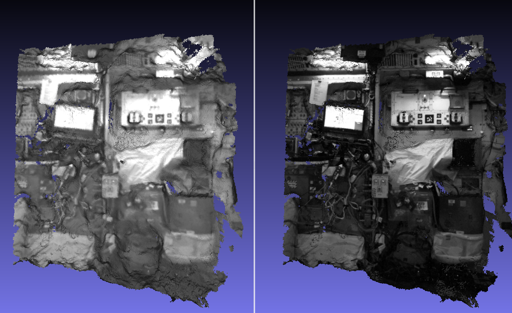

.. _multi_stereo:

multi_stereo
------------

The ``multi_stereo`` program takes as input a set of images and
cameras, runs pairwise stereo between each image/camera and the next
one in the list, filters the produced points clouds, fuses them, and
creates a mesh. The input cameras are found using
structure-from-motion.

For the moment this program is very tied to ``rig_calibrator``
(:numref:`rig_calibrator`).  It will become more generic and versatile
with time. In particular, logic is planned for automatically selecting
stereo pairs and for distributing and load-balancing all resulting
processing jobs over multiple machines.

Example
^^^^^^^

Here we will create a mesh of a small portion of the International
Space Station (ISS), based on images acquired with the `Astrobee
<https://github.com/nasa/astrobee>`_ robot (later this example will be
expanded to a full module). 

In this example it is very important to choose for pairwise stereo
images with a convergence angle of about 5-10 degrees. A smaller
convergence angle results in unreliable depth determination, while for
a bigger one the scene changes enough sometimes that stereo
correlation can be erroneous, resulting in artifacts. Note that the
``rig_calibrator`` tool (as well as ``bundle_adjust`` and
``parallel_stereo``) compute the convergence angles.

Then, the ``pc_filter`` tool was used for filtering blunders according
to many geometric criteria.

The 7-image dataset used below, the full recipe, and output mesh, are
all available at:

  https://github.com/NeoGeographyToolkit/StereoPipelineSolvedExamples/releases/tag/multi_stereo

Creation of camera models
~~~~~~~~~~~~~~~~~~~~~~~~~

We broadly follow the tools and approach from section :numref:`rig_calibrator`,
but with a rig consisting of just one camera.

Determination of initial camera poses. The inputs for this are the images
and some educated guess about camera intrinsics. The latter can be optimized
later with ``rig_calibrator``.

::

    theia_sfm --rig_config camera_config.txt \
      --images 'images/nav_cam/*jpg'         \
      --out_dir theia_out

Note that the images are stored in the ``nav_cam`` subdirectory, and
each image name consists of a number and an image extension, following
the conventions used by ``rig_calibrator``, even though here we have
just a single sensor acquiring all images.

Refinement of camera poses and registration to world coordinates (this
requires first manually picking some features with known 3D positions
in the images, per :numref:`rig_calibrator_registration`)::

    rig_calibrator                                \
      --rig_config camera_config.txt              \
      --nvm theia_out/cameras.nvm                 \
      --camera_poses_to_float "nav_cam"           \
      --intrinsics_to_float ""                    \
      --num_iterations 100                        \
      --calibrator_num_passes 2                   \
      --num_overlaps 10                           \
      --registration                              \
      --hugin_file control_points.pto             \
      --xyz_file xyz.txt                          \
      --out_dir rig_out
    
Registration to world coordinates is optional. It is still suggested
to use at least some rough guesses for where the world positions of
some points are. The camera configuration will not be deformed in
order to fit precisely the measurements; a single best-fit similarity
transform will be applied to the whole setup.

Running stereo and mesh creation
~~~~~~~~~~~~~~~~~~~~~~~~~~~~~~~~

As mentioned earlier, the geometry of the scene being imaged requires
some careful choices of parameters for stereo.  Then, this tool calls
several other tools under the hood, so options for those should be set
as well. Here's a recipe which works reasonably well::

    maxDistanceFromCamera=3.0

    stereo_opts="
      --stereo-algorithm asp_mgm
      --alignment-method affineepipolar
      --ip-per-image 10000
      --min-triangulation-angle 0.5
      --global-alignment-threshold 5
      --session nadirpinhole
      --no-datum
      --corr-seed-mode 1
      --corr-tile-size 5000
      --max-disp-spread 300
      --ip-inlier-factor 0.4
      --nodata-value 0"
      
    pc_filter_opts="
      --max-camera-ray-to-surface-normal-angle 75 
      --max-valid-triangulation-error 0.0025   
      --max-distance-from-camera $maxDistanceFromCamera
      --blending-dist 50 --blending-power 1"

    mesh_gen_opts="
      --min_ray_length 0.1
      --max_ray_length $maxDistanceFromCamera
      --voxel_size 0.01"

    multi_stereo --rig_config rig_out/rig_config.txt \
      --camera_poses rig_out/cameras.txt             \
      --undistorted_crop_win '1100 700'              \
      --rig_sensor nav_cam                           \
      --first_step stereo                            \
      --last_step  mesh_gen                          \
      --stereo_options "$stereo_opts"                \
      --pc_filter_options "$pc_filter_opts"          \
      --mesh_gen_options "$mesh_gen_opts"            \
      --out_dir stereo_out

The surface resolution of the cameras is on the order of 1 mm (0.001
meters), the camera is about 1-3 meters from the surface, hence a good
value for the triangulation error was about 0.0025 meters, and the
points in the cloud were binned (before meshing) into voxels of size
0.005 meters. Later some of these choices will be automated, or
scale-independent parameters will be provided. The value
``--max-disp-spread 300`` is about right for this case, but should
normally be omitted as sometimes it may restrict the disparity
unnecessarily. 

There are three steps happening above, namely:

* stereo: Runs ``parallel_stereo`` (:numref:`parallel_stereo`) and
  writes a point cloud in .tif format for each image/camera
  in the list and the next one. This is the most time-consuming step.

* pc_filter: For each point cloud runs ``pc_filter`` (:numref:`pc_filter`)
  and writes filtered point clouds in .tif and .pcd formats, and a
  textured mesh for that run in .obj format. The .pcd file is in left
  camera's coordinates. The .obj file is for individual stereo run
  inspection purposes.

* mesh_gen: Use ``voxblox_mesh`` (:numref:`voxblox_mesh`) to fuse the
  filtered point clouds in .pcd format and create a mesh in .ply
  format.

The images are undistorted internally before stereo is run. (The
undistortion step may be optional in future versions.)

See ``--first_step`` and ``--last_step`` in
:numref:`multi_stereo_command_line` for how to choose which processing
steps to run. This tool also has controls for the range of images to run.

Creating a textured mesh
~~~~~~~~~~~~~~~~~~~~~~~~

The obtained mesh can be post-processed (smoothed, hole-filled, etc.)
using a handful of CGAL-based tools shipped with ASP
(:numref:`cgal_tools`).  Then, it can be textured with the original
images using the ``texrecon`` tool (:numref:`texrecon`) as::

    texrecon --rig_config rig_out/rig_config.txt \
      --camera_poses rig_out/cameras.txt         \
      --mesh stereo_out/nav_cam/fused_mesh.ply   \
      --rig_sensor nav_cam                       \
      --undistorted_crop_win '1100 700'          \
      --out_dir stereo_out

This produces ``stereo_out/nav_cam/texture.obj``.

   Fused .ply mesh and textured .obj file produced by ``voxblox_mesh``
   and ``texrecon`` (left and right). Here, no smoothing or hole-filling
   of the meshes was used (:numref:`cgal_tools`).

Handling issues
^^^^^^^^^^^^^^^

If the produced mesh is noisy, it is suggested to inspect individual
.obj files produced by each stereo pair, the triangulation error of
each filtered point cloud (fourth band, extractable with
``gdal_translate -b 4``), and the blending weight files saved by
``pc_filter``.

One may need to decrease the value of
``--max-valid-triangulation-error``, use less of the boundary image
region (``--undistorted_crop_win``) or redo the bundle adjustment with
``rig_calibrator``.

.. _multi_stereo_command_line:

Command-line options for multi_stereo
^^^^^^^^^^^^^^^^^^^^^^^^^^^^^^^^^^^^^

--rig_config <string (default: "")>
    Rig configuration file.
--rig_sensor <string (default: "")>
    Which rig sensor images to use. Must be among the
    sensors specified via ``--rig_config``.
--camera_poses <string (default: "")>
    Read images and camera poses for this sensor from this 
    list.
--out_dir <string (default: "")>
    The directory where to write the stereo output, textured mesh,
    other data.
--stereo_options <string (default: "")>
    Options to pass to ``parallel_stereo``. Use double quotes
    around the full list and simple quotes if needed by an
    individual option, or vice-versa.
--pc_filter_options <string (default: "")>
    Options to pass to ``pc_filter``.
--mesh_gen_options <string (default: "")>
    Options to pass to ``voxblox_mesh`` for mesh generation.
--undistorted_crop_win <string (default: "")>
    The dimensions of the central image region to keep
    after the internal undistortion step and before using it in
    stereo. Normally 85% - 90% of distorted (actual)
    image dimensions would do. Suggested the Astrobee images:
    sci_cam: '1250 1000' nav_cam: '1100 776'. haz_cam: '250 200'.
--first_step <string (default: "stereo")>
    Let the first step run by this tool be one of:
    'stereo', 'pc_filter', or 'mesh_gen'. This allows
    resuming a run at a desired step. The stereo
    subdirectories are deleted before that step takes
    place.
--last_step <string (default: "mesh_gen")>
    The last step run by this tool. See ``--first_step``
    for allowed values.

--first-image-index <integer (default: None)>
    The index of the first image to use for stereo, in the
    list of images. Indices start from 1. By default, use
    all the images.

--last-image-index <integer (default: None)>
    The index of the last image to use for stereo, in the
    list of images. Indices start from 1. By default, use
    all the images.

-h, --help
  Show this help message and exit.
