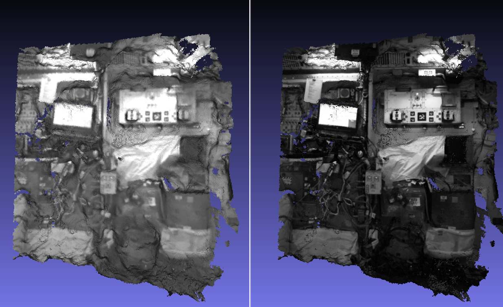

.. _multi_stereo:

multi_stereo
------------

The ``multi_stereo`` program runs pairwise stereo on many image pairs given by an
overlap list, and fuses the results. It has two modes, set with ``--mode``:

* ``mesh``: pairwise stereo, then ``pc_filter`` (:numref:`pc_filter`), then a fused
  mesh with ``voxblox_mesh`` (:numref:`voxblox_mesh`). The cameras come from a rig
  (:numref:`rig_calibrator`). This is for robot or Structure-from-Motion data, with no
  datum. See the example below.

* ``dem_mosaic``: pairwise stereo on mapprojected images with the given cameras and a
  seed DEM, then ``point2dem`` (:numref:`point2dem`) per pair, then a DEM mosaic and a
  maximum triangulation error mosaic with ``dem_mosaic`` (:numref:`dem_mosaic`). This
  is for mapprojected satellite images, for example TGO CaSSIS (:numref:`cassis`). See
  :numref:`multi_stereo_dem_mosaic`.

In both modes the image pairs are read from an overlap list (``--overlap-list``). The
pairs run in parallel; ``--processes`` sets how many run at once and ``--threads`` the
threads per pair.

.. _multi_stereo_dem_mosaic:

DEM mosaic example
^^^^^^^^^^^^^^^^^^

In ``dem_mosaic`` mode, ``multi_stereo`` runs stereo on pairs of mapprojected images,
makes a DEM for each pair, and mosaics them. This is how the CaSSIS pipeline builds a
terrain model (:numref:`cassis`), but it works for any mapprojected images with
cameras and a seed DEM.

Consider a set of images (here ISIS cubes) with cameras (here CSM ``.json`` cameras,
:numref:`csm`), and a seed DEM ``seed.tif`` to mapproject onto (for CaSSIS a blurred
CTX DEM). Mapproject every image at the same resolution (:numref:`mapproject`). The
resolution should be near the native ground sample distance of the images (for CaSSIS
about 4.59 m), not the coarser DEM resolution, as stereo correlates at that grid::

    for f in image1 image2 image3; do
      mapproject --tr 4.59 seed.tif $f.cub $f.json $f.map.tif
    done

Build the overlap list. It has four columns per line: the left and right mapprojected
images and their cameras. List the pairs that overlap enough for stereo (for a strip
this is often each image with the next; for cross-track looks, each left image with
the right images it overlaps)::

    image1.map.tif image2.map.tif image1.json image2.json
    image2.map.tif image3.map.tif image2.json image3.json

Then run stereo and mosaic the DEMs. The DEM is gridded at a coarser resolution than
the images (here 18 m)::

    stereo_opts="--alignment-method none --stereo-algorithm asp_mgm --subpixel-mode 9"

    multi_stereo                                                       \
      --mode dem_mosaic                                                \
      --overlap-list overlap.txt                                       \
      --dem seed.tif                                                   \
      --ref-dem ctx.tif                                                \
      --processes 4                                                    \
      --threads 2                                                      \
      --stereo_options "$stereo_opts"                                  \
      --point2dem-options "--tr 18 --max-valid-triangulation-error 8"  \
      --out_dir stereo_out

This writes ``stereo_out/dem_mosaic-DEM.tif`` and
``stereo_out/dem_mosaic-IntersectionErr.tif``, the latter being the maximum
triangulation error over the pairs (:numref:`point2dem`), a useful diagnostic of ray
self-consistency.

The seed DEM (``--dem``) is the one the images were mapprojected onto. It is passed to
``parallel_stereo`` as the input DEM for mapprojected stereo. The three steps are
``stereo``, ``dem``, and ``fuse`` (see ``--first_step`` and ``--last_step``).

Every per-pair ``point2dem`` must land on the same grid, so the DEMs mosaic cleanly.
If both ``--tr`` and ``--t_srs`` are given in ``--point2dem-options``, they are used
for all pairs. Otherwise the first pair sets the grid (its resolution and projection)
and the rest reuse it. The projection can also come from ``--ref-dem`` or ``--dem``.

If ``--ref-dem`` is set (for example a sharp CTX DEM), a per-pair DEM is dropped from
the mosaic when its mean elevation departs from the reference over the same footprint
by more than ``--blunder-tol`` (in meters). This removes stereo blunders while keeping
real terrain.

Mesh example
^^^^^^^^^^^^

Here we will create a mesh of a small portion of the International
Space Station (ISS), based on images acquired with the `Astrobee
<https://github.com/nasa/astrobee>`_ robot (later this example will be
expanded to a full module).

In this example it is very important to choose for pairwise stereo
images with a convergence angle of about 5-10 degrees. A smaller
convergence angle results in unreliable depth determination, while for
a bigger one the scene changes enough sometimes that stereo
correlation can be erroneous, resulting in artifacts. Note that
``rig_calibrator`` (as well as ``bundle_adjust`` and
``parallel_stereo``) compute the convergence angles.

Then, ``pc_filter`` was used for filtering blunders according
to many geometric criteria.

The 7-image dataset used below, the full recipe, and output mesh, are
available for `download 
<https://github.com/NeoGeographyToolkit/StereoPipelineSolvedExamples/releases/tag/multi_stereo>`_.

See another example in :numref:`rig_msl`. That one runs stereo on
pairs of images created with a stereo rig onboard the MSL Curiosity
rover.

Creation of camera models
~~~~~~~~~~~~~~~~~~~~~~~~~

We follow the approach in :numref:`rig_calibrator`, but with a rig
consisting of just one camera.

The camera intrinsics and the images are used to find the camera
poses::

    theia_sfm --rig-config camera_config.txt \
      --images 'images/nav_cam/*jpg'         \
      --out-dir theia_out

Note that the images are stored in the ``nav_cam`` subdirectory, and
each image name consists of a number and an image extension, following
the conventions used by ``rig_calibrator``, even though here we have
just a single sensor acquiring all images.

Next is refinement of camera poses and registration to world
coordinates (this requires first manually picking some features with
known 3D positions in the images, per
:numref:`rig_calibrator_registration`)::

    rig_calibrator                      \
      --rig-config camera_config.txt    \
      --nvm theia_out/cameras.nvm       \
      --camera-poses-to-float "nav_cam" \
      --intrinsics-to-float ""          \
      --num-iterations 100              \
      --num-passes 2                    \
      --num-overlaps 10                 \
      --registration                    \
      --hugin-file control_points.pto   \
      --xyz-file xyz.txt                \
      --out-dir rig_out
    
Registration to world coordinates is optional. It is still suggested
to use at least some rough guesses for where the world positions of
some points are. The camera configuration will not be deformed in
order to fit precisely the measurements; a single best-fit similarity
transform will be applied to the whole setup.

Running stereo and mesh creation
~~~~~~~~~~~~~~~~~~~~~~~~~~~~~~~~

As mentioned earlier, the geometry of the scene being imaged requires
some careful choices of parameters for stereo.  Then, this tool calls
several other tools under the hood, so options for those should be set
as well. Here's a recipe which works reasonably well::

    maxDistanceFromCamera=3.0

    stereo_opts="
      --stereo-algorithm asp_mgm
      --alignment-method affineepipolar
      --ip-per-image 10000
      --min-triangulation-angle 0.5
      --global-alignment-threshold 5
      --session nadirpinhole
      --no-datum
      --corr-seed-mode 1
      --max-disp-spread 300
      --ip-inlier-factor 0.4
      --nodata-value 0"
      
    pc_filter_opts="
      --max-camera-ray-to-surface-normal-angle 75 
      --max-valid-triangulation-error 0.0025   
      --max-distance-from-camera $maxDistanceFromCamera
      --blending-dist 50 --blending-power 1"

    mesh_gen_opts="
      --min_ray_length 0.1
      --max_ray_length $maxDistanceFromCamera
      --voxel_size 0.01"

    multi_stereo                            \
      --mode mesh                           \
      --rig_config rig_out/rig_config.txt   \
      --camera_poses rig_out/cameras.txt    \
      --overlap-list overlap.txt            \
      --undistorted_crop_win '1100 700'     \
      --rig_sensor nav_cam                  \
      --first_step stereo                   \
      --last_step  mesh_gen                 \
      --stereo_options "$stereo_opts"       \
      --pc_filter_options "$pc_filter_opts" \
      --mesh_gen_options "$mesh_gen_opts"   \
      --out_dir stereo_out

The overlap list has one image pair per line, with two columns, giving the left and
right image names as in ``--camera_poses``::

    image1.tif image2.tif
    image2.tif image3.tif

To run stereo between each image and the next one, list the consecutive pairs.

The surface resolution of the cameras is on the order of 1 mm (0.001
meters), the camera is about 1-3 meters from the surface, hence a good
value for the triangulation error was about 0.0025 meters, and the
points in the cloud were binned (before meshing) into voxels of size
0.005 meters. Later some of these choices will be automated, or
scale-independent parameters will be provided. The value
``--max-disp-spread 300`` is about right for this case, but should
normally be omitted as sometimes it may restrict the disparity
unnecessarily. 

There are three steps happening above, namely:

* stereo: Runs ``parallel_stereo`` (:numref:`parallel_stereo`) and
  writes a point cloud in .tif format for each pair in the overlap
  list. This is the most time-consuming step.

* pc_filter: For each point cloud runs ``pc_filter`` (:numref:`pc_filter`)
  and writes filtered point clouds in .tif and .pcd formats, and a
  textured mesh for that run in .obj format. The .pcd file is in left
  camera's coordinates. The .obj file is for individual stereo run
  inspection purposes.

* mesh_gen: Use ``voxblox_mesh`` (:numref:`voxblox_mesh`) to fuse the
  filtered point clouds in .pcd format and create a mesh in .ply
  format.

The images are undistorted internally before stereo is run. (The
undistortion step may be optional in future versions.)

See ``--first_step`` and ``--last_step`` in
:numref:`multi_stereo_command_line` for how to choose which processing
steps to run.

Creating a textured mesh
~~~~~~~~~~~~~~~~~~~~~~~~

The obtained mesh can be post-processed (smoothed, hole-filled, etc.)
using a handful of CGAL-based tools shipped with ASP
(:numref:`cgal_tools`).  Then, it can be textured with the original
images using the ``texrecon`` tool (:numref:`texrecon`) as::

    texrecon --rig_config rig_out/rig_config.txt \
      --camera_poses rig_out/cameras.txt         \
      --mesh stereo_out/nav_cam/fused_mesh.ply   \
      --rig_sensor nav_cam                       \
      --undistorted_crop_win '1100 700'          \
      --out_dir stereo_out

This produces ``stereo_out/nav_cam/texture.obj``.

   Fused .ply mesh and textured .obj file produced by ``voxblox_mesh``
   and ``texrecon`` (left and right). Here, no smoothing or hole-filling
   of the meshes was used (:numref:`cgal_tools`). See :numref:`sfm_iss`
   for an example of mesh and texture creation for depth data.

Handling issues
^^^^^^^^^^^^^^^

If the produced mesh is noisy, it is suggested to inspect individual
.obj files produced by each stereo pair, the triangulation error of
each filtered point cloud (fourth band, extractable with
``gdal_translate -b 4``), and the blending weight files saved by
``pc_filter``.

One may need to decrease the value of
``--max-valid-triangulation-error``, use less of the boundary image
region (``--undistorted_crop_win``) or redo the bundle adjustment with
``rig_calibrator``.

.. _multi_stereo_command_line:

Command-line options for multi_stereo
^^^^^^^^^^^^^^^^^^^^^^^^^^^^^^^^^^^^^

--mode <string (default: "")>
    Processing mode. One of: ``mesh`` (pairwise stereo, ``pc_filter``, then a
    fused mesh, with rig cameras) or ``dem_mosaic`` (pairwise stereo on
    mapprojected images with the given cameras and a seed DEM, per-pair
    ``point2dem``, then a DEM mosaic and a maximum triangulation error mosaic).
    Required.
--overlap-list <string (default: "")>
    Text file with the image pairs to run stereo on, one pair per line. For
    mode ``mesh``: two columns, ``left_image right_image``, with names as in
    ``--camera_poses``. For mode ``dem_mosaic``: four columns,
    ``left_image right_image left_camera right_camera``. Lines starting with
    ``#`` and blank lines are ignored. Required.
--out_dir <string (default: "")>
    The directory where to write the stereo output, textured mesh or DEM
    mosaic, and other data.
--stereo_options <string (default: "")>
    Options to pass to ``parallel_stereo``. Use double quotes
    around the full list and simple quotes if needed by an
    individual option, or vice-versa.
--processes <integer (default: 1)>
    How many stereo pairs to run at the same time. Each pair is run with
    ``parallel_stereo --processes 1``, so this tool owns the parallelism across
    pairs.
--threads <integer (default: 0)>
    Threads per ``parallel_stereo`` pair. If positive, each pair is run with
    ``--threads-multiprocess`` and ``--threads-singleprocess`` set to this.
    Default: let ``parallel_stereo`` decide.
--first_step <string (default: "stereo")>
    Let the first step run by this tool be, for mode ``mesh``: ``stereo``,
    ``pc_filter``, or ``mesh_gen``; for mode ``dem_mosaic``: ``stereo``,
    ``dem``, or ``fuse``. This allows resuming a run at a desired step.
--last_step <string (default: "")>
    The last step run by this tool. See ``--first_step`` for allowed values.
    Default: the last step of the mode.

Options for mode ``mesh``:

--rig_config <string (default: "")>
    Rig configuration file.
--rig_sensor <string (default: "")>
    Which rig sensor images to use. Must be among the
    sensors specified via ``--rig_config``.  To use images from
    several sensors, pass in a quoted list of them, separated by a
    space.
--camera_poses <string (default: "")>
    Read images and camera poses for this sensor from this
    list.
--undistorted_crop_win <string (default: "")>
    The dimensions of the central image region to keep
    after the internal undistortion step and before using it in
    stereo. Normally 85% - 90% of distorted (actual)
    image dimensions would do. Suggested the Astrobee images:
    sci_cam: '1250 1000' nav_cam: '1100 776'. haz_cam: '250 200'.
--pc_filter_options <string (default: "")>
    Options to pass to ``pc_filter``.
--mesh_gen_options <string (default: "")>
    Options to pass to ``voxblox_mesh`` for mesh generation.

Options for mode ``dem_mosaic``:

--dem <string (default: "")>
    Seed DEM. For mapprojected input images this is the DEM they were
    mapprojected onto. It is appended as the trailing positional argument to
    ``parallel_stereo``.
--ref-dem <string (default: "")>
    Reference DEM, for example a sharp CTX DEM. If set, a per-pair DEM is dropped
    from the mosaic when its mean elevation departs from the reference over the
    same footprint by more than ``--blunder-tol``. Also used to set the output
    projection if it is not otherwise given.
--blunder-tol <double (default: 500)>
    Blunder filter tolerance, in meters (needs ``--ref-dem``). A per-pair DEM
    whose mean elevation departs from the reference over its footprint by more
    than this is dropped.
--point2dem-options <string (default: "")>
    Options for ``point2dem``. ``--errorimage`` is added automatically. If both
    ``--tr`` and ``--t_srs`` are given here, they are used for all pairs;
    otherwise the grid and projection are taken from the first DEM produced and
    applied to the rest, so all share one grid.
--dem-mosaic-options <string (default: "")>
    Extra options for the ``dem_mosaic`` of the per-pair DEMs.

-h, --help
  Show this help message and exit.
