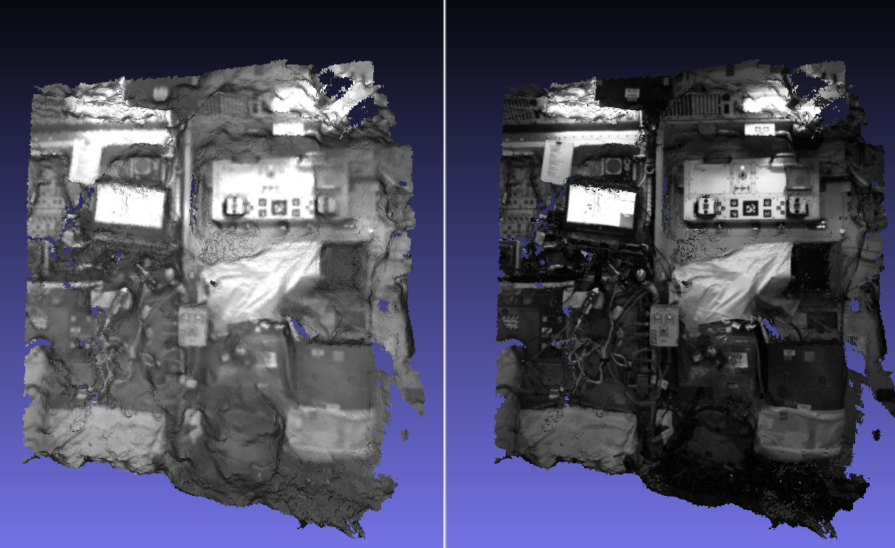

.. _multi_stereo:

multi_stereo
------------

The ``multi_stereo`` program runs pairwise stereo on many image pairs, given by a
range of stereo convergence angles or an image overlap list, and fuses the results.

Each tile of each stereo pair is a separate job, and these are run in parallel
over a given number of nodes (if ``--nodes-list`` is set) and processes per
node. It is thus a generalization of ``parallel_stereo``
(:numref:`parallel_stereo`).

It works with every image and camera type ASP supports, and handles all
``parallel_stereo`` options (via ``--stereo-options``).

DEM vs mesh mode
~~~~~~~~~~~~~~~~

This program has two modes, set with ``--mode``:

* ``dem_mosaic``: pairwise stereo with the given cameras, then ``point2dem``
  (:numref:`point2dem`) per pair, then a DEM mosaic with ``dem_mosaic``
  (:numref:`dem_mosaic`). It can also mosaic the maximum triangulation error (with
  ``dem_mosaic --max``) and an orthoimage (DRG) at the DEM resolution (with
  ``dem_mosaic --first``). See ``--point2dem-options``. This works for raw images
  (aerial frame cameras, :numref:`aerial_bathymetry`) or mapprojected images 
  (for example TGO CaSSIS, :numref:`multi_stereo_dem_mosaic`).

* ``mesh``: pairwise stereo, then ``pc_filter`` (:numref:`pc_filter`), then a fused
  mesh with ``voxblox_mesh`` (:numref:`voxblox_mesh`). The cameras come from a rig
  (:numref:`rig_calibrator`). This is for robot or Structure-from-Motion data, with no
  datum. See an example below.

In both modes the image pairs are chosen in one of two mutually exclusive ways: read
from an overlap list (``--overlap-list``), or auto-determined from a convergence angle
range (``--conv-angle-list`` and ``--conv-angle-range``). See
:numref:`multi_stereo_command_line`.

In both modes the per-tile work of all pairs are put in a single pool, with the
number of processes per node and threads per pair given by ``--processes`` and
``--threads``. The invocation on a cluster is as for ``parallel_stereo``
(:numref:`pbs_slurm`).

.. _multi_stereo_dem_mosaic:

DEM mosaic example
~~~~~~~~~~~~~~~~~~

An example for aerial images is in :numref:`aerial_bathymetry`.

The example below runs pairwise stereo with mapprojected images
(:numref:`mapproj-example`), and creates a DEM mosaic, as for CaSSIS data
(:numref:`cassis`). 

Consider a set of images (here ISIS cubes) with cameras (here CSM ``.json``
cameras, :numref:`csm`), and a DEM ``ref.tif`` to mapproject onto (for CaSSIS a
blurred CTX DEM). 

Set a local projection::

    proj="+proj=stere +lat_0=18.4 +lon_0=77.5 +R=3396190 +units=m +no_defs"
    
Mapproject every image at the same resolution (:numref:`mapproject`), near the
native ground sample distance (for CaSSIS about 4.59 m)::

    for f in image1 image2 image3; do
      mapproject --tr 4.59 --t_srs "$proj" \
        ref.tif $f.cub $f.json $f.map.tif
    done

List the mapprojected images in ``images.txt`` (one per line) and their cameras in
``cameras.txt`` (in the same order). Then build the overlap list of pairs to run
stereo on, two columns, the left and right image names as in ``images.txt``::

    image1.map.tif image2.map.tif
    image2.map.tif image3.map.tif

Note that it is often easier to use the convergence angle list, as shown in
:numref:`aerial_bathymetry`, while adjusting for the images being mapprojected.

Set up the stereo and point2dem options::

    stereoOpts="--alignment-method none
                 --stereo-algorithm asp_mgm
                 --subpixel-mode 9"

    demOpts="--tr 18 --t_srs '$proj' --errorimage --orthoimage"

Then run stereo and mosaic the DEMs. The DEM is gridded at a coarser resolution than
the images (here 18 m)::

    multi_stereo                     \
      --mode dem_mosaic              \
      --image-list images.txt        \
      --camera-list cameras.txt      \
      --overlap-list overlap.txt     \
      --dem ref.tif                  \
      --nodes-list machines.txt      \
      --processes 4                  \
      --threads 2                    \
      --stereo-options "$stereoOpts" \
      --point2dem-options "$demOpts" \
      --output-prefix stereo_out/run

This writes ``stereo_out/run-DEM.tif``. The output names follow ``point2dem``: the
output prefix plus ``-DEM.tif``. As in ``stereo_dist`` (:numref:`stereo_dist`), two
optional products are added by passing the corresponding flag in
``--point2dem-options``:

* ``--errorimage`` also writes ``stereo_out/run-IntersectionErr.tif``, the
  maximum triangulation error over the pairs (:numref:`triangulation_error`),
  combined with ``dem_mosaic --max``. A useful diagnostic of ray self-consistency.
* ``--orthoimage`` (with no argument, the per-pair ``L.tif`` is added automatically)
  also writes ``stereo_out/run-DRG.tif``, the orthoimage, combined with
  ``dem_mosaic --first`` (the first valid pixel, to avoid smearing seams).

Set the option ``--nodes-list`` to run on multiple machines (:numref:`pbs_slurm`).

The seed DEM (``--dem``) is the one the images were mapprojected onto. It is passed to
``parallel_stereo`` as the input DEM for mapprojected stereo. The three steps are
``stereo``, ``dem``, and ``fuse`` (see ``--first-step`` and ``--last-step``).

Every per-pair ``point2dem`` must land on the same grid, so the DEMs mosaic cleanly.
If both ``--tr`` and ``--t_srs`` are given in ``--point2dem-options``, they are used
for all pairs. Otherwise the first pair sets the grid (its resolution and projection)
and the rest reuse it. The projection can also come from the seed DEM ``--dem``.

A per-pair DEM is dropped from the mosaic when its mean elevation departs from the
seed DEM (``--dem``) over the same footprint by more than ``--blunder-tol`` (in
meters). This removes stereo blunders while keeping real terrain.

Mesh example
~~~~~~~~~~~~

Here we will create a mesh of a small portion of the International
Space Station (ISS), based on images acquired with the `Astrobee
<https://github.com/nasa/astrobee>`_ robot (later this example will be
expanded to a full module).

In this example it is very important to choose for pairwise stereo
images with a convergence angle of about 5-10 degrees. A smaller
convergence angle results in unreliable depth determination, while for
a bigger one the scene changes enough sometimes that stereo
correlation can be erroneous, resulting in artifacts. Note that
``rig_calibrator`` (as well as ``bundle_adjust`` and
``parallel_stereo``) compute the convergence angles.

Then, ``pc_filter`` was used for filtering blunders according
to many geometric criteria.

The 7-image dataset used below, the full recipe, and output mesh, are
available for `download 
<https://github.com/NeoGeographyToolkit/StereoPipelineSolvedExamples/releases/tag/multi_stereo>`_.

See another example in :numref:`rig_msl`. That one runs stereo on
pairs of images created with a stereo rig onboard the MSL Curiosity
rover.

Creation of camera models
^^^^^^^^^^^^^^^^^^^^^^^^^

We follow the approach in :numref:`rig_calibrator`, but with a rig
consisting of just one camera.

The camera intrinsics and the images are used to find the camera
poses::

    theia_sfm --rig-config camera_config.txt \
      --images 'images/nav_cam/*jpg'         \
      --out-dir theia_out

Note that the images are stored in the ``nav_cam`` subdirectory, and
each image name consists of a number and an image extension, following
the conventions used by ``rig_calibrator``, even though here we have
just a single sensor acquiring all images.

Next is refinement of camera poses and registration to world
coordinates (this requires first manually picking some features with
known 3D positions in the images, per
:numref:`rig_calibrator_registration`)::

    rig_calibrator                      \
      --rig-config camera_config.txt    \
      --nvm theia_out/cameras.nvm       \
      --camera-poses-to-float "nav_cam" \
      --intrinsics-to-float ""          \
      --num-iterations 100              \
      --num-passes 2                    \
      --num-overlaps 10                 \
      --registration                    \
      --hugin-file control_points.pto   \
      --xyz-file xyz.txt                \
      --out-dir rig_out
    
Registration to world coordinates is optional. It is still suggested
to use at least some rough guesses for where the world positions of
some points are. The camera configuration will not be deformed in
order to fit precisely the measurements; a single best-fit similarity
transform will be applied to the whole setup.

Running stereo and mesh creation
^^^^^^^^^^^^^^^^^^^^^^^^^^^^^^^^

As mentioned earlier, the geometry of the scene being imaged requires
some careful choices of parameters for stereo.  Then, this tool calls
several other tools under the hood, so options for those should be set
as well. Here's a recipe which works reasonably well::

    maxDistanceFromCamera=3.0

    stereoOpts="
      --stereo-algorithm asp_mgm
      --alignment-method affineepipolar
      --ip-per-image 10000
      --min-triangulation-angle 0.5
      --global-alignment-threshold 5
      --session nadirpinhole
      --no-datum
      --corr-seed-mode 1
      --max-disp-spread 300
      --ip-inlier-factor 0.4
      --nodata-value 0"
      
    pc_filter_opts="
      --max-camera-ray-to-surface-normal-angle 75 
      --max-valid-triangulation-error 0.0025   
      --max-distance-from-camera $maxDistanceFromCamera
      --blending-dist 50 --blending-power 1"

    mesh_gen_opts="
      --min_ray_length 0.1
      --max_ray_length $maxDistanceFromCamera
      --voxel_size 0.01"

    multi_stereo                            \
      --mode mesh                           \
      --rig-config rig_out/rig_config.txt   \
      --camera-poses rig_out/cameras.txt    \
      --overlap-list overlap.txt            \
      --undistorted-crop-win '1100 700'     \
      --rig-sensor nav_cam                  \
      --first-step stereo                   \
      --last-step  mesh_gen                 \
      --stereo-options "$stereoOpts"        \
      --pc-filter-options "$pc_filter_opts" \
      --mesh-gen-options "$mesh_gen_opts"   \
      --output-prefix stereo_out/run

The overlap list has one image pair per line, with two columns, giving the left and
right image names as in ``--camera-poses``::

    image1.tif image2.tif
    image2.tif image3.tif

To run stereo between each image and the next one, list the consecutive pairs.

The surface resolution of the cameras is on the order of 1 mm (0.001
meters), the camera is about 1-3 meters from the surface, hence a good
value for the triangulation error was about 0.0025 meters, and the
points in the cloud were binned (before meshing) into voxels of size
0.005 meters. Later some of these choices will be automated, or
scale-independent parameters will be provided. The value
``--max-disp-spread 300`` is about right for this case, but should
normally be omitted as sometimes it may restrict the disparity
unnecessarily. 

There are three steps happening above, namely:

* stereo: Runs ``parallel_stereo`` (:numref:`parallel_stereo`) and
  writes a point cloud in .tif format for each pair in the overlap
  list. This is the most time-consuming step.

* pc_filter: For each point cloud runs ``pc_filter`` (:numref:`pc_filter`)
  and writes filtered point clouds in .tif and .pcd formats, and a
  textured mesh for that run in .obj format. The .pcd file is in left
  camera's coordinates. The .obj file is for individual stereo run
  inspection purposes.

* mesh_gen: Use ``voxblox_mesh`` (:numref:`voxblox_mesh`) to fuse the
  filtered point clouds in .pcd format and create a mesh in .ply
  format.

The images are undistorted internally before stereo is run. (The
undistortion step may be optional in future versions.)

See ``--first-step`` and ``--last-step`` in
:numref:`multi_stereo_command_line` for how to choose which processing
steps to run.

Creating a textured mesh
^^^^^^^^^^^^^^^^^^^^^^^^

The obtained mesh can be post-processed (smoothed, hole-filled, etc.)
using a handful of CGAL-based tools shipped with ASP
(:numref:`cgal_tools`).  Then, it can be textured with the original
images using the ``texrecon`` tool (:numref:`texrecon`) as::

    texrecon --rig-config rig_out/rig_config.txt \
      --camera-poses rig_out/cameras.txt         \
      --mesh stereo_out/run-fused_mesh.ply       \
      --rig-sensor nav_cam                       \
      --undistorted-crop-win '1100 700'          \
      --out-dir stereo_out

This produces ``stereo_out/nav_cam/texture.obj``.

   Fused .ply mesh and textured .obj file produced by ``voxblox_mesh``
   and ``texrecon`` (left and right). Here, no smoothing or hole-filling
   of the meshes was used (:numref:`cgal_tools`). See :numref:`sfm_iss`
   for an example of mesh and texture creation for depth data.

Handling issues
^^^^^^^^^^^^^^^

If the produced mesh is noisy, it is suggested to inspect individual
.obj files produced by each stereo pair, the triangulation error of
each filtered point cloud (fourth band, extractable with
``gdal_translate -b 4``), and the blending weight files saved by
``pc_filter``.

One may need to decrease the value of
``--max-valid-triangulation-error``, use less of the boundary image
region (``--undistorted-crop-win``) or redo the bundle adjustment with
``rig_calibrator``.

.. _multi_stereo_command_line:

Command-line options for multi_stereo
~~~~~~~~~~~~~~~~~~~~~~~~~~~~~~~~~~~~~

--mode <string (default: "")>
    Processing mode. One of: ``mesh`` (pairwise stereo, ``pc_filter``, then a
    fused mesh, with rig cameras) or ``dem_mosaic`` (pairwise stereo with the given
    cameras, per-pair ``point2dem``, then a DEM mosaic, and optionally a
    triangulation error and orthoimage mosaic). Required.
--overlap-list <string (default: "")>
    Text file with the image pairs to run stereo on, one pair per line, two
    columns, ``left_image right_image``. For mode ``mesh`` the names are as in
    ``--camera-poses``. For mode ``dem_mosaic`` as in ``--image-list`` (the
    cameras come from ``--image-list`` and ``--camera-list``). Lines starting
    with a pound character are ignored. Mutually exclusive with
    ``--conv-angle-list``.
--conv-angle-list <string (default: "")>
    A ``bundle_adjust`` convergence angle report, named
    ``<prefix>-convergence_angles.txt`` (:numref:`ba_conv_angle`). The overlap list is
    built automatically from it: each image pair whose median convergence angle is
    within ``--conv-angle-range`` is used. An alternative to ``--overlap-list`` for
    choosing the pairs, in both modes. When the images are mapprojected (a seed DEM is
    set with ``--dem``), this report may name either the mapprojected images or the
    images before mapprojection, since each mapprojected image records the image it was
    made from (:numref:`mapproject`). Mutually exclusive with ``--overlap-list``. See
    the example in :numref:`aerial_bathymetry`.
--conv-angle-range <min,max>
    Two comma-separated values, no quotes, the minimum and maximum median convergence
    angle in degrees, for example ``15,45``. Used with ``--conv-angle-list`` to
    select the stereo pairs.
--output-prefix <string (default: "")>
    The output prefix, as for parallel_stereo and stereo_dist. The DEM mosaic,
    mesh, per-pair stereo data, and other outputs are named starting with this
    prefix (for example <prefix>-DEM.tif, <prefix>-fused_mesh.ply).
--stereo-options <string (default: "")>
    Options to pass to ``parallel_stereo``. Use double quotes
    around the full list and simple quotes if needed by an
    individual option, or vice-versa.
--processes <integer (default: 1)>
    The width of the parallel job: how many per-tile stereo jobs run at once, pooled
    over all pairs (both modes). If ``--nodes-list`` or ``PBS_NODEFILE`` is set, the
    pool is spread over those nodes.
--threads <integer (default: 0)>
    Threads per ``parallel_stereo`` pair. If positive, each pair is run with
    ``--threads-multiprocess`` and ``--threads-singleprocess`` set to this.
    Default: let ``parallel_stereo`` decide.
--nodes-list <filename (default: "")>
    A file with the computing nodes, one per line, over which to spread the pooled
    stereo jobs, as for ``parallel_stereo`` and ``stereo_dist``. The nodes must share
    a file system. Default: the value of ``$PBS_NODEFILE``, if set.
--first-step <string (default: "stereo")>
    Let the first step run by this tool be, for mode ``mesh``: ``stereo``,
    ``pc_filter``, or ``mesh_gen``; for mode ``dem_mosaic``: ``stereo``,
    ``dem``, or ``fuse``. This allows resuming a run at a desired step.
--last-step <string (default: "")>
    The last step run by this tool. See ``--first-step`` for allowed values.
    Default: the last step of the mode.

Options for mode ``mesh``:

--rig-config <string (default: "")>
    Rig configuration file.
--rig-sensor <string (default: "")>
    Which rig sensor images to use. Must be among the
    sensors specified via ``--rig-config``.  To use images from
    several sensors, pass in a quoted list of them, separated by a
    space.
--camera-poses <string (default: "")>
    Read images and camera poses for this sensor from this
    list.
--undistorted-crop-win <string (default: "")>
    The dimensions of the central image region to keep
    after the internal undistortion step and before using it in
    stereo. Normally 85% - 90% of distorted (actual)
    image dimensions would do. Suggested the Astrobee images:
    sci_cam: '1250 1000' nav_cam: '1100 776'. haz_cam: '250 200'.
--pc-filter-options <string (default: "")>
    Options to pass to ``pc_filter``.
--mesh-gen-options <string (default: "")>
    Options to pass to ``voxblox_mesh`` for mesh generation.

Options for mode ``dem_mosaic``:

--dem <string (default: "")>
    Seed DEM. For mapprojected input images this is the DEM they were
    mapprojected onto, appended as the trailing positional argument to
    ``parallel_stereo``. It is also the blunder-filter reference, and sets the
    output projection if it is not otherwise given.
--blunder-tol <double (default: 500)>
    Blunder filter tolerance, in meters (needs ``--dem``). A per-pair DEM whose
    mean elevation departs from the seed DEM (``--dem``) over its footprint by
    more than this is dropped.
--point2dem-options <string (default: "")>
    Options for ``point2dem``. Pass ``--errorimage`` to also mosaic the maximum
    triangulation error, and ``--orthoimage`` (with no argument, the per-pair
    ``L.tif`` is added automatically) to also mosaic an orthoimage (DRG), as in
    ``stereo_dist`` (:numref:`stereo_dist`). If both ``--tr`` and ``--t_srs`` are
    given here, they are used for all pairs; otherwise the grid and projection are
    taken from the first DEM produced and applied to the rest, so all share one grid.
--dem-mosaic-options <string (default: "")>
    Extra options for the ``dem_mosaic`` of the per-pair DEMs.

-h, --help
  Show this help message and exit.
