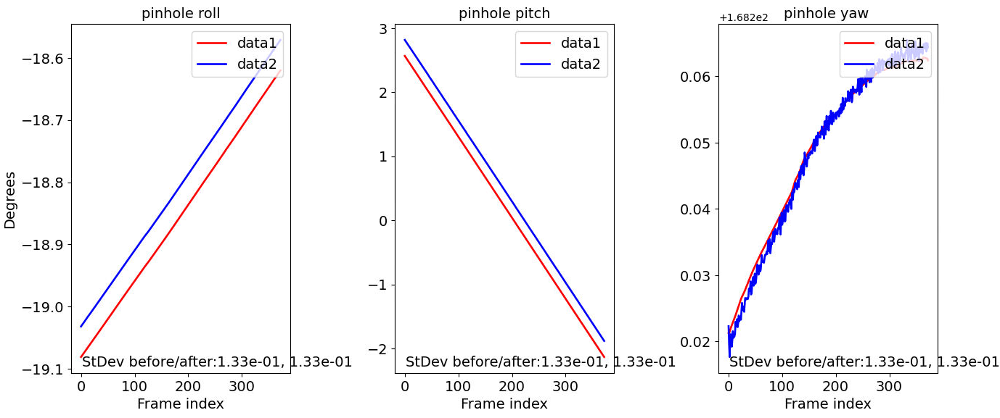

.. _orbit_plot:

orbit_plot.py
-------------

The ``orbit_plot.py`` program is a Python script that takes an input one or more
orbital sequences of cameras, and plots the camera orientation as it changes
along the orbit. Each orientation is decomposed into roll, pitch, and yaw
components (in degrees), that are plotted separately (:numref:`orbit_plot_fig`).

If a second set of orbital sequences exists, for example, if the camera
orientations are later optimized, with ``bundle_adjust``
(:numref:`bundle_adjust`) or ``jitter_solve`` (:numref:`jitter_solve`), this
tool can overlay the two sets.

Each orbital sequence consists of several frame (pinhole) cameras, in .tsai
(:numref:`pinholemodels`) or CSM (:numref:`csm_frame`) format, or it can be a
single linescan camera in the CSM model state format (:numref:`csm_state`).  

At some point this program will also plot the camera positions.

The ``orbit_plot`` conda environment should be first installed 
as described in :numref:`orbit_plot_dependencies`.

Satellite coordinate system
~~~~~~~~~~~~~~~~~~~~~~~~~~~

This program estimates the camera orientation relative to the local satellite
coordinate system at each sample, which is defined as follows: the origin is the
camera center (in ECEF), the *x* axis is tangent to the orbit, so it points
along the track, the z axis points roughly from the camera center to the planet
center while being perpendicular to the *x* axis, and the *y* axis is
perpendicular to the *x* and *z* axes, so it points across-track.

Given that we have only a set of samples for the camera center, all these axes
are approximate, and it is implicitly assumed that the planet and orbit are
somewhat spherical (circular). Hence, the produced plots have some small
inaccuracies.

When synthetic cameras are created with ``sat_sim`` (:numref:`sat_sim`), that
tool can save the precise satellite orientation if invoked with the option
``--save-ref-cams``. This program can then read those orientations if called
with the ``--use-ref-cams`` option.

Roll, pitch, and yaw angles
~~~~~~~~~~~~~~~~~~~~~~~~~~~

The camera orientation relative to the local satellite coordinate system is
decomposed into roll, pitch, and yaw angles, measured in degrees. When all these
angles are zero, the camera looks straight down. For a positive pitch, the
camera looks somewhat ahead.

See :numref:`roll_pitch_yaw_def` for a more technical discussion of these
angles and for the relation between the camera and satellite coordinate systems.

Examples
~~~~~~~~

Plot one dataset
^^^^^^^^^^^^^^^^

We assume that ASP's ``bin`` directory is in the path, otherwise the full path
to this script must be specified below. Then, the dependencies are should be
installed (:numref:`orbit_plot_dependencies`).

Plot a single set of cameras along a given orbit::

    ~/miniconda3/envs/orbit_plot/bin/python \
      $(which orbit_plot.py)                \
      --dataset dataset1/                   \
      --dataset-label dataset1              \
      --orbit-id pinhole-fwd                \
      --orbit-label pinhole 

We assume that the cameras are in the directory ``dataset1/``, and their names
in that directory start with ``pinhole-fwd``. 

The slash (``/``) at the end of the directory name is important, as the two
strings above will be concatenated to find the camera names.

The rest of a camera name can be any string ending in ``.tsai`` or ``.json``.
Hence, only the cameras satisfying this convention will be read.

See an illustration in :numref:`orbit_plot_fig`.

For finer-grained control, the desired cameras can be put in a list. For
example::

  ls dataset1/pinhole*.tsai > pinhole_list.txt
    ~/miniconda3/envs/orbit_plot/bin/python \
      $(which orbit_plot.py)                \
      --list pinhole_list.txt               \
      --dataset-label dataset1              \
      --orbit-id pinhole-fwd                \
      --orbit-label pinhole 

Then, only the images in the list that match the value of ``--orbit-id`` will be
read.

If these are synthetic cameras created with ``sat_sim`` (:numref:`sat_sim`),
consider adding the option ``--use-ref-cams`` (this option does not work with
``--list``).

Plot two datasets
^^^^^^^^^^^^^^^^^

We consider two camera datasets, with the camera names starting with::

    dataset1/pinhole-fwd
    dataset2/run-pinhole-fwd 

The naming convention used above is suggestive of the first dataset being a set
of input cameras, while the second being created from the first using
``bundle_adjust`` or ``jitter_solve``. The string ``pinhole-fwd`` is the orbit
id.

::

    ~/miniconda3/envs/orbit_plot/bin/python \
      $(which orbit_plot.py)                \
      --dataset dataset1/,dataset2/run-     \
      --orbit-id pinhole-fwd                \
      --dataset-label data1,data2           \
      --orbit-label pinhole

Notice how above the shared orbit id is specified separately from the dataset
names. Here we omitted the option ``--use-ref-cams``.

It may be convenient on occasion to read from lists instead, while respecting
the pattern in in ``--orbit-id``::

    ~/miniconda3/envs/orbit_plot/bin/python \
      $(which orbit_plot.py)                \
      --list list1.txt,list2.txt            \
      --orbit-id pinhole-fwd                \
      --dataset-label data1,data2           \
      --orbit-label pinhole

These two datasets will be plotted on top of each other, in red and blue, respectively.

   
   Roll, pitch, and yaw angle (in degrees) for two orbital sequences, 
   shown in red and blue.

Plot two orbital groups, including linescan cameras
^^^^^^^^^^^^^^^^^^^^^^^^^^^^^^^^^^^^^^^^^^^^^^^^^^^

Here, in addition to a group of pinhole cameras looking forward, before and
after bundle adjustment, we also consider a group consisting of a single
linescan camera, which looks down, before and after solving for jitter.

It is assumed that the linescan camera will have many position and orientation
samples, and that these numbers of samples are equal (unless the option
``--use-ref-cams`` is used).

The only change in the command above is that the orbit id now has the additional value ``linescan-nadir``, so the plot command becomes::

    ~/miniconda3/envs/orbit_plot/bin/python \
      $(which orbit_plot.py)                \
      --dataset dataset1/,dataset2/run-     \
      --orbit-id pinhole-fwd,linescan-nadir \
      --dataset-label data1,data2

The cameras before optimization will be in directory ``dataset1/``, with the
pinhole camera names starting with ``pinhole-fwd``, and the linescan camera
name starting with ``linescan-nadir``. 

The cameras after optimization will start with ``dataset2/run-``, followed
again by the orbit id.

The resulting plot will have two rows, showing the two orbital groups. 

.. _orbit_plot_dependencies:

Dependencies
~~~~~~~~~~~~

This tool needs Python 3 and some additional Python packages to be installed with 
``conda``. 

Conda can be obtained from 

    https://docs.conda.io/en/latest/miniconda.html

Run::

    ./Miniconda3-latest-Linux-x86_64.sh

on Linux, and the appropriate version on OSX (this script needs to be
made executable first). Use the suggested::

    $HOME/miniconda3

directory for installation. 

Activate conda. The needed packages can be installed, for example,
as follows:

::
    
    conda create -n orbit_plot numpy scipy pyproj matplotlib

See also
~~~~~~~~

The tool ``sfm_view`` (:numref:`sfm_view`) can be used to visualize cameras in
orbit. 

Command-line options
~~~~~~~~~~~~~~~~~~~~

--dataset <string (default: "")>
    The dataset to plot. If more than one, separate them by comma, with no
    spaces in between. The dataset is the prefix of the cameras, such as
    "cameras/" or "opt/run-". It is to be followed by the orbit id, such as,
    "nadir" or "aft". If more than one dataset, they will be plotted on top of
    each other.

--list <string (default: "")>
    Instead of specifying ``--dataset``, load the cameras listed in this file
    (one per line). Only the names matching ``--orbit-id`` will be read. If more
    than one list, separate them by comma, with no spaces in between.

--orbit-id <string (default: "")>
    The id (a string) that determines an orbital group of cameras. If more than
    one, separate them by comma, with no spaces in between.

--dataset-label <string (default: "")>
    The label to use for each dataset in the legend. If more than one, separate
    them by comma, with no spaces in between. If not set, will use the dataset
    name.

--orbit-label <string (default: "")>
    The label to use for each orbital group (will be shown as part of the
    title). If more than one, separate them by comma, with no spaces in between.
    If not set, will use the orbit id.

--num-cameras <int (default: -1)>
    Plot only the first this many cameras from each orbital sequence. By
    default, plot all of them.

--use-ref-cams
    Read from disk reference cameras that determine the satellite orientation.
    This assumes the first dataset was created with ``sat_sim`` with the option
    ``--save-ref-cams``. Otherwise do not use this option. In that case the
    satellite orientation is estimated based on camera positions.

--subtract-line-fit
    If set, subtract the best line fit from the curves being plotted. If more
    than one dataset is being plotted, the same line fit will be subtracted from
    all of them. This is useful to see the residuals after fitting a line to the
    data.

--trim-ratio <float (default: 0.0)>
    Trim ratio. Given a value between 0 and 1 (inclusive), remove this fraction
    of camera poses from each sequence, with half of this amount for poses at
    the beginning and half at the end of the sequence. This is used only for
    linescan cameras, to not plot camera poses beyond image lines. For cameras
    created with ``sat_sim``, a value of 0.5 should be used.

--figure-size <string (default: "15,15")>
    Specify the width and height of the figure having the plots, in inches. Use
    two numbers with comma as separator (no spaces).

--title <string (default: "")>
    Set this as the figure title, to be shown on top of all plots.
    
--line-width <float (default: 1.5)>
    Line width for the plots.

--font-size <int (default: 14)>
    Font size for the plots.
    
-h, --help
    Display this help message.

.. |times| unicode:: U+00D7 .. MULTIPLICATION SIGN
