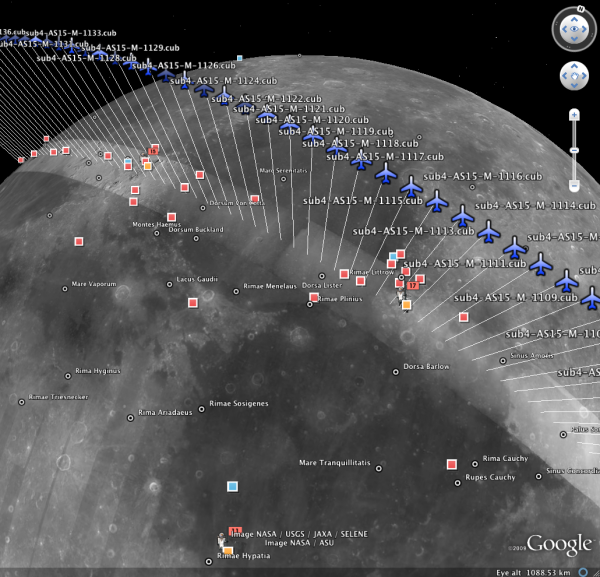

.. _orbitviz:

orbitviz
--------

Produces a Google Earth KML file useful for visualizing camera
positions. The input for this tool is one or more images and camera
files.

   Example of a KML visualization produced with ``orbitviz`` depicting
   camera locations for the Apollo 15 Metric Camera during orbit 33 of
   the Apollo command module.

Usage::

     orbitviz [options] <input images and cameras> 

Command-line options for orbitviz:

-o, --output <filename (default: orbit.kml)>
    The output kml file that will be written.

--linescan-line <integer (default: 1)>
    Get the camera position at this pixel line.

--linescan-sample <integer (default: 1)>
    Get the camera position at this pixel sample.

-s, --model-scale <float (default: 1)>
    Scale the size of the coordinate axes by this amount. Ex: To
    scale axis sizes up to Earth size, use 3.66.

-u, --use-path-to-dae-model <fullpath>
    Use this dae model to represent camera location. *Google Sketch
    up can create these.*

-r, --reference-spheroid <string (default: WGS_1984)>
    Use this reference spheroid (datum). 

    Options:

    - WGS_1984
    - D_MOON (1,737,400 meters)
    - D_MARS (3,396,190 meters)
    - MOLA (3,396,000 meters)
    - NAD83
    - WGS72
    - NAD27
    - Earth (alias for WGS_1984)
    - Mars (alias for D_MARS)
    - Moon (alias for D_MOON)

-t, --session-type <string>
    Select the input camera model type. Normally this is auto-detected,
    but may need to be specified if the input camera model is in
    XML format. See :numref:`parallel_stereo_options` for options.

--load-camera-solve
    Use a specialized display for showing the results of the
    ``camera_solve`` tool. When using this option, only pass in the
    path to the ``camera_solve`` output folder as a positional
    argument. Green lines drawn between the camera positions indicate
    a successful interest point match between those two images.

--hide-labels
    Hide image names unless the camera is highlighted.

--bundle-adjust-prefix <string>
    Use the camera adjustment obtained by previously running
    bundle_adjust with this output prefix.

--write-csv
    Write a csv file with the orbital data.

--threads <integer (default: 0)>
    Select the number of threads to use for each process. If 0, use
    the value in ~/.vwrc.
 
--cache-size-mb <integer (default = 1024)>
    Set the system cache size, in MB.

--tile-size <integer (default: 256 256)>
    Image tile size used for multi-threaded processing.

--no-bigtiff
    Tell GDAL to not create bigtiffs.

--tif-compress <None|LZW|Deflate|Packbits (default: LZW)>
    TIFF compression method.

-v, --version
    Display the version of software.

-h, --help
    Display this help message.

