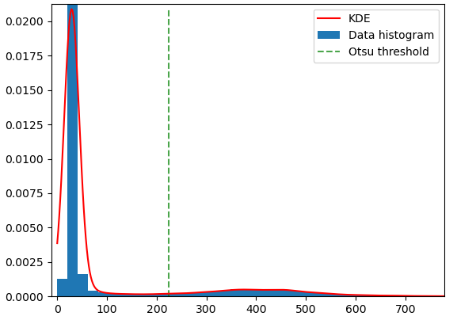

.. _otsu_threshold:

otsu_threshold
--------------

The ``otsu_threshold`` program takes as input a single-channel image
and computes the optimal `Otsu threshold
<https://en.wikipedia.org/wiki/Otsu%27s_method>`_. See also 
`this overview <http://www.labbookpages.co.uk/software/imgProc/otsuThreshold.html>`_ 
with some example images and thresholds plotted vs histograms at the very bottom of that page.

If the input image is, for example, band 7 of a WorldView multispectral
image, this will return a value for the threshold separating land from water
(since water shows up rather dark in the infrared).
If the input is an image of the Moon, with shadows present, the threshold
will separate shadowed and lit regions.

Note that the threshold value returned by this tool is not necessarily
the position corresponding to the bottom of the "saddle" of the
histogram of this image, if it is bi-modal (see the figure). To get
that behavior, use instead ``bathy_threshold_calc.py``
(:numref:`bathy_threshold_calc`).

   Illustration of the Otsu threshold.

Example::

    otsu_threshold image.tif

It will produce output as follows::

    Reading image: image.tif
    No nodata value present in the file.
    Number of image rows and columns: 7276, 8820
    Picking a uniform sample of dimensions 7276, 8820
    Number of bins in the histogram: 256
    It may take several minutes to find the answer.
    Otsu threshold for image image.tif: 224.7686274509804

Usage::

    otsu_threshold <options> <images>

Command-line options for otsu_threshold:

--num-samples <integer (default: -1)>
    The number of samples to pick from the image (more samples will
    result in more accuracy but will be slower). If not specified,
    hence set to -1, the full image will be used.

--num-bins <integer (default: 256)>
    Number of bins to use for the histogram. A larger value is
    suggested if the image has some outlying pixel values.

--nodata-value <double>
    Use this nodata value instead of what is read from the file, if
    present.

--threads <integer (default: 0)>
    Select the number of threads to use for each process. If 0, use
    the value in ~/.vwrc.
 
--cache-size-mb <integer (default = 1024)>
    Set the system cache size, in MB.

--tile-size <integer (default: 256 256)>
    Image tile size used for multi-threaded processing.

--no-bigtiff
    Tell GDAL to not create BigTiff files.

--tif-compress <None|LZW|Deflate|Packbits (default: LZW)>
    TIFF compression method.

-v, --version
    Display the version of software.

-h, --help
    Display this help message.
