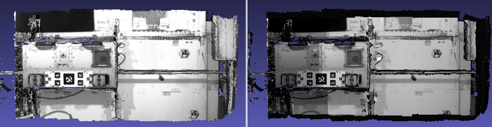

.. _rig_calibrator:

rig_calibrator
--------------

The ``rig_calibrator`` program takes as input image and/or depth+image
datasets acquired with one or more rigs, each having one or more
cameras. It finds the relationship among the rig sensors, the pose of
each camera image, and refines the intrinsics of each sensor.

This tool was created as part of the `ISAAC
<https://www.nasa.gov/directorates/spacetech/game_changing_development/projects/ISAAC>`_
project.

The ``rig_calibrator`` program was extensively tested with actual
hardware and can model many real-world issues encountered with a
rig. Its output can be used to create a fused surface mesh with
seamless texture from each of its sensors, and, for ground data,
also terrain models and orthoimages.

The intrinsics of the sensors and each camera pose can also be
optimized without the rig assumption. Then the sensors can acquire data
at unrelated times (e.g., years apart). In that case the transforms
among the sensors on the rig are not modeled, but any group of images
acquired with the same sensor still share intrinsics. 

The `Theia <https://github.com/sweeneychris/TheiaSfM>`_ package is invoked (and
shipped with ASP) to find the initial camera poses (:numref:`theia_sfm`).
 
See :numref:`rig_calibrator_example` for a solved example,
:numref:`sfm_iss` for a larger example covering a full ISS module, and
:numref:`rig_msl` for an example using MSL Curiosity rover images.

   Textures obtained with the ``nav_cam`` and ``sci_cam`` rig cameras,
   (left and right) projected onto the mesh obtained with the
   ``haz_cam`` depth+image camera. The textures are nearly seamless
   and agree very well when overlaid, which shows that the rig
   calibration was successful. Note that the ``sci_cam`` pictures (on
   the right) have some lightning variation due to the fact that
   auto-exposure was used. The images show a portion of the Granite
   Lab at NASA Ames.

Capabilities
^^^^^^^^^^^^

- The cameras on the rig may be purely image cameras, or may have a depth
  component. In the latter case, the transform from a camera's depth to image
  coordinate system is modeled.
- No calibration target is assumed, so the image/depth data are acquired in situ.
- The solved-for camera poses and relationships among sensors can be registered 
  to real-world coordinates via user-selected control points.
- All images acquired with one sensor are assumed to share intrinsics.
  The user may choose which intrinsics of which sensor are optimized
  or kept fixed, while the rig transforms and camera poses are optimized.
- There can be zero, one, or more rigs.
- It is not assumed that the rig sensors have a shared field of view. 
  Yet, a surface seen in one sensor should at some point be seen 
  also in other sensors.
- The sensors on the rig may acquire data simultaneously or not. In
  the latter case one sensor is expected to acquire
  data frequently enough to be used to bracket data from the other
  sensors in time using bilinear interpolation of the camera poses (if
  the rig assumption is used).
- A known time offset among the clocks of the various sensors on the 
  rig is modeled and can be optimized. (By default no offset is
  assumed.)  
- A preexisting mesh of the surface being imaged can be used as a
  constraint (rays corresponding to the same feature must intersect
  close to the mesh). Otherwise one can constrain the triangulated
  points to not move too far from their original values.
- Several quality metrics are printed on output, error reports
  are saved to disk, and for each image with its optimized camera a
  textured mesh with that image is created, for visual examination of
  any misalignments (if an input mesh is given).

.. _rig_calibrator_data_conv:

Input data conventions
^^^^^^^^^^^^^^^^^^^^^^

Each rig sensor should have a name, such as ``ref_cam``, ``alt_cam``,
etc.

Each image file must be stored according to the convention::

    <image dir>/<sensor name>/<timestamp><tag>.<extension>

For example, two images acquired at time 1004.6 can be named::

    my_images/ref_cam/10004.6.ref_cam.jpg
    my_images/alt_cam/10004.6.alt_cam.jpg

The tag after the timestamp is suggested to ensure all image names without
directory path are unique, in case these are passed later to ``bundle_adjust``
(:numref:`rc_bundle_adjust`). The tag better not have any numerical characters, as
that may confuse ``rig_calibrator``.

The images are expected to be 8 or 16 bit, with .jpg, .png, or .tif extension.

If some sensors also have depth data, the same convention is followed,
with the file extension being .pc. Example::

    my_images/alt_cam/10004.6.alt_cam.pc

All such depth cloud files will be loaded automatically alongside
images if present. See :numref:`point_cloud_format` for the file
format.

Assumptions about the timestamp
^^^^^^^^^^^^^^^^^^^^^^^^^^^^^^^

If the rig constraint is used (omitting ``--no_rig``), and the
sensors acquire the images at independent times, it is strongly
suggested that the timestamp be a number of the form
``<digits>.<digits>``, representing the precise image acquisition
time. 

Without the rig constraint, or if all the sensors on the rig take
pictures simultaneously, the only assumption is that images have the
same timestamp only if taken at the same time, with the precise
timestamp value not used (see also ``--num_overlaps``).

Any characters in the timestamp string that are not digits or the
decimal period will be removed and the rest will be converted to a
double-precision value, interpreted as time in seconds.

The following bash script can make a copy of the images with file
names of the form ``dir/sensor/digits.jpg``::

    mkdir -p new_images/my_cam
    ext=".jpg"
    ((timestamp=100000))
    for image in $(ls old_images/*${ext}); do 
        /bin/cp -fv $image new_images/my_cam/${timestamp}.my_cam${ext}
        ((timestamp++))
    done

The reference sensor
^^^^^^^^^^^^^^^^^^^^

With the rig constraint, if each sensor acquires images independently,
one of the sensors, named the *reference* sensor, should acquire
images frequently enough to help bracket the other sensors in time
using bilinear pose interpolation.

.. _rig_config:

Configuration file
^^^^^^^^^^^^^^^^^^

What is known about the rig, or set of rigs, should be specified in a
plain text file, with the following syntax::

  # Anything after the pound sign is a comment
  ref_sensor_name: <string>

  # For each sensor on the rig, specify the following:
  sensor_name: <string>
  focal_length: <double> # units of pixel
  optical_center: <double double> # units of pixel
  distortion_coeffs: <n doubles>
  distortion_type: <string>
  image_size: <int, int>
  distorted_crop_size: <int int> 
  undistorted_image_size: <int int> 
  ref_to_sensor_transform: <12 doubles>
  depth_to_image_transform: <12 doubles>
  ref_to_sensor_timestamp_offset: <double>

Example (only one of the *N* sensors is shown)::

  ref_sensor_name: nav_cam

  sensor_name: nav_cam
  focal_length: 621.04422
  optical_center: 580.56426999999996 495.51236
  distortion_coeffs: 1.0092038999999999
  distortion_type: fisheye
  image_size: 1280 960
  distorted_crop_size: 1280 960
  undistorted_image_size: 1500 1200
  ref_to_sensor_transform: 1 0 0 0 1 0 0 0 1 0 0 0
  depth_to_image_transform: 1 0 0 0 1 0 0 0 1 0 0 0
  ref_to_sensor_timestamp_offset: 0

If there is more than one sensor on the rig, need to create a new value for
``sensor_name``, and add a block as above for each sensor (without a new
``ref_sensor_name``).

If there is more than one rig, there should be a new line having 
``ref_sensor_name``, and then continue as above.

See a full example with two rigs in :numref:`sfm_iss_sample_rig_config`.

The lens distortion model can be one of ``no_distortion`` (zero distortion
parameters), ``fov`` (1 distortion parameter), ``fisheye`` (4 distortion
parameters), or ``radtan`` (radial-tangential, 4 or 5 distortion parameters).
The ``fisheye`` and ``radtan`` distortion models are the same as in OpenCV.
See :numref:`pinholemodels` for more details.

The ``ref_to_sensor_transform`` field has the rotation (9 doubles, stored
row after row) and translation (3 doubles) transform from the
reference sensor to the sensor with given name, while
``depth_to_image_transform`` is the transform from the depth to image
coordinate systems of a given depth+image sensor. These must be set to
the identity transform (example below) if not known or not applicable.
That is usually the case for the first invocation of this tool, when
the ``ref_to_sensor_transform`` values are initialized based on the
camera poses of each input camera (unless
``--use_initial_rig_transforms`` is set).

The value ``ref_to_sensor_timestamp_offset``, measured in seconds, is
what should be added to the reference camera clock to get the time in
current sensor's clock. Set to 0 if the clocks are synchronized.

The ``image_size`` field has the image dimensions (width and height).
The ``distorted_crop_size`` has the dimensions of the region whose
center is also the image center in which the given distortion model is
valid.  Normally it should be the whole image. The
``undistorted_image_size`` has a somewhat generous overestimate of the image
dimensions after undistortion.

Educated guess can be provided for the quantities that are not known. This tool
can be used to optimize the focal length, optical center, and distortion
coefficients (the latter requires many interest point matches, espcially around
image corners). 

The undistorted image size also need not
be known accurately. A tighter ``distorted_crop_size`` can help for
images with strong distortion if the distortion model is not
expressive enough to fit it precisely. But this then also eliminates
interest point matches in the corners of the image, which is not
good when solving for lens distortion.

A file in the same format will be written in the output directory,
with the name::

  <output dir>/rig_config.txt

This time the transforms among the rig sensors will be known, having
been computed and optimized. 

Such a file can be read with the option ``--rig_config``.

.. _rig_calibrator_outputs:

Output files
^^^^^^^^^^^^

The optimized rig configuration in the format described in :numref:`rig_config`
is saved to::

  <output dir>/rig_config.txt

The image names, camera poses, and interest point matches are stored
in the NVM format. These are determined using the Theia
structure-from-motion software, and are read by ``rig_calibrator`` via the
``--nvm`` option. The optimized camera poses and inlier interest point
matches will be written in the same format when this program finishes. 
Then the output nvm file name is::

  <output dir>/cameras.nvm

In this file, the interest point matches are offset relative to the
optical center. This file can be passed in to a new invocation
``rig_calibrator`` via ``--nvm``. 

The optical centers per image are written separately, to::

  <output dir>/cameras_offsets.txt

This is because these are not part of the .nvm file format.

If the option ``--save_nvm_no_shift`` is specified, the additional
file::

  <output dir>/cameras_no_shift.nvm

will be saved, in the same format as above, but without interest
points being shifted relative to the optical center for the
corresponding image. This file is is easier to plot, as there is
no shift to undo, with the latter needing to be stored separately.
To read this back, use ``--read_nvm_no_shift``.

The produced .nvm files can be visualized with ``stereo_gui`` 
(:numref:`stereo_gui_nvm`). A submap can be extracted with ``sfm_submap``
(:numref:`sfm_submap`).

In addition, a plain text file having just the list of images and
world-to-camera poses will be written, with the name::

  <output dir>/cameras.txt

Each line in this file has the format::

<image dir>/<sensor name>/<timestamp>.<extension> <12 doubles>

Here, the 12 values are the rows of the world-to-camera rotation and
then the world-to-camera translation. See the ``--camera_poses``
option (:numref:`rig_calibrator_command_line`) for how this file can
be read back in. Note that camera's position and orientation in world
coordinates are determined by taking the inverse of this rotation +
translation transform.

The inlier residuals for each camera (that is, norm of reprojection
errors, with reprojection errors defined as the difference of interest
points and projection of triangulated interest points back in the
camera), before and after optimization, are saved to::

  <output dir>/<sensor name>-initial-residuals.txt
  <output dir>/<sensor name>-final-residuals.txt

in the format::

  distorted_pixel_x distorted_pixel_y norm(residual_x, residual_y)

The convergence angle percentiles for each pair of images having
inlier matches, together with the number of such matches for each pair,
are saved to::

  <output dir>/convergence_angles.txt

The option ``--export_to_voxblox`` saves files that can be used with ``voxblox_mesh`` (:numref:`voxblox_mesh`).

The list of images is saved (one per line) to::

  <output dir>/image_list.txt
  
How to export the data for use in bundle adjustment is discussed in
:numref:`rc_bundle_adjust`.

Examples
^^^^^^^^

See a step-by-step-example in :numref:`rig_calibrator_example`. See
:numref:`sfm_iss` for a larger example covering a full ISS module, and
:numref:`rig_msl` for an example using MSL Curiosity rover images.

Notes
^^^^^

Optimizing the camera poses (without control points or a preexisting
mesh constraint) can change the scale and orientation of the camera
set.

The output directory will have the optimized rig configuration and
camera poses for all images. These can be used as inputs for a
subsequent invocation, if needed to fine-tune things.

.. _rig_calibrator_registration:

Determination of scale and registration
^^^^^^^^^^^^^^^^^^^^^^^^^^^^^^^^^^^^^^^

The cameras produced so far are in an arbitrary coordinate system. This section
describes how to register them to known Cartesian coordinates. For registering
rover cameras to a DEM, see :numref:`msl_registration`.

To transform the system of cameras to world coordinates, it is necessary to know
the Cartesian coordinates of at least three control points in the scene, and
then to pick the pixel of coordinates of each of these points in at least two
images.

All images used in registration must be for the same sensor. To find
the pixel coordinates, open, for example, a subset of the 
camera images for one of the sensors in Hugin, such as::

    hugin <image dir>/<sensor name>/*.jpg

It will ask to enter a value for the FoV (field of view). That value
is not important since we won't use it. One can input 10 degrees,
for example. 

Go to the "Expert" interface, choose a couple of distinct images, and
click on a desired control point in both images.  Make sure the left
and right image are not the same or highly similar, as that may result
in poor triangulation and registration. Add that point. Then repeat
this process for all control points.

Save the Hugin project to disk. Create a separate text file which
contains the world coordinates of the control points picked earlier,
with each line in the "x y z" format, and in the same order as the
Hugin project file.  That is to say, if a control point was picked in
several image pairs in Hugin, it must show up also the same number of
times in the text file, in the same order. In the xyz text file all
lines starting with the pound sign (#) are ignored, as well as all
entries on any line beyond three numerical values.

The dataset from :numref:`rig_calibrator_example` has examples
of files used for registration, and shows how to pass these to the tool.

After registration is done, it will print each transformed coordinate
point from the map and its corresponding measured point, as well as the 
error among the two. That will look as follows::

    transformed computed xyz -- measured xyz -- error norm (meters)
    -0.0149 -0.0539  0.0120 --  0.0000  0.0000  0.0000 --  0.0472 img1.jpg img2.jpg
     1.8587  0.9533  0.1531 --  1.8710  0.9330  0.1620 --  0.0254 img3.jpg img4.jpg

Each error norm (last value), is the distance between a measured 3D
point and its computed value based on the registered cameras. If
some of them are too large, may be the measurements have some error,
or the camera poses or intrinsics are not accurate enough.

Note that the registration happens before the optimization, and that
can move the cameras around somewhat. Hence the registration
is redone after the last optimization pass, unless
the flag ``--skip_post_registration`` is specified. 

The initial registration does not change the depth-to-image
transforms, as those are presumed to be reasonably known, unlike the
image camera poses, which are determined normally using Theia and are
in an arbitrary coordinate system. After the cameras and all
transforms are optimized, including the depth-to-image transforms, if
present, and if registration happens at the end, these transforms will
be changed as well, for consistency with the transforms among the
image cameras.

If the images cover a large area, it is suggested to use registration
points distributed over that area. Registration may not always produce
perfect results since a structure-from-motion solution may drift over
large distances.

The software does not force the camera poses to move individually to
fit better the control points. Therefore, the cameras are always kept
self-consistent, then the camera configuration has a single
registration transform applied to it to fit the control points.
The only approach to make the cameras individually conform more
faithfully to what is considered accurate geometry is to use the mesh
constraint, if such a prior surface mesh is available.

.. _rig_calibration_stats:

Quality metrics
^^^^^^^^^^^^^^^

The rig calibrator will print out some statistics showing the residual errors
before and after each optimization pass (before outlier removal at the
end of the pass), as follows::
    
    The 25, 50, 75, and 100th percentile residual stats after opt
    depth_mesh_x_m: 0.0018037 0.0040546 0.011257 0.17554 (742 residuals)
    depth_mesh_y_m: 0.0044289 0.010466 0.025742 0.29996 (742 residuals)
    depth_mesh_z_m: 0.0016272 0.0040004 0.0080849 0.067716 (742 residuals)
    depth_tri_x_m: 0.0012726 0.0054119 0.013084 1.6865 (742 residuals)
    depth_tri_y_m: 0.0010357 0.0043689 0.022755 3.8577 (742 residuals)
    depth_tri_z_m: 0.00063148 0.0023309 0.0072923 0.80546 (742 residuals)
    haz_cam_pix_x: 0.44218 0.99311 2.1193 38.905 (819 residuals)
    haz_cam_pix_y: 0.2147 0.49129 1.3759 95.075 (819 residuals)
    mesh_tri_x_m: 0.0002686 0.00072069 0.014236 6.3835 (5656 residuals)
    mesh_tri_y_m: 9.631e-05 0.00032232 0.057742 9.7644 (5656 residuals)
    mesh_tri_z_m: 0.00011342 0.00031634 0.010118 1.0238 (5656 residuals)
    nav_cam_pix_x: 0.098472 0.28129 0.6482 155.99 (47561 residuals)
    nav_cam_pix_y: 0.11931 0.27414 0.55118 412.36 (47561 residuals)
    sci_cam_pix_x: 0.33381 0.70169 1.4287 25.294 (2412 residuals)
    sci_cam_pix_y: 0.24164 0.52997 0.90982 18.333 (2412 residuals)

These can be helpful in figuring out if the calibration result is
good.  The errors whose name ends in "_m" are in meters and measure
the absolute differences between the depth clouds and mesh
(depth_mesh), between depth clouds and triangulated points
(depth_tri), and between mesh points and triangulated points
(mesh_tri), in x, y, and z, respectively. The ``mesh`` residuals will
be printed only if a mesh is passed on input and if the mesh-related
weights are positive. 

Some outliers are unavoidable, hence some of these numbers can be big
even if the calibration overall does well (the robust threshold set
via ``--robust_threshold`` does not allow outliers to dominate). See
the option ``--max_reprojection_error`` for filtering outliers. It is
best to not filter them too aggressively unless one has very high
confidence in the modeling of the cameras.
 
Source of errors can be, as before, inaccurate intrinsics, camera
poses, or insufficiently good modeling of lens distortion.

When each rig sensor has its own clock, or acquires images at is own
rate, the discrepancy among the clocks (if the timestamp offsets are
not set correctly) or insufficiently tight bracketing (cameras moving
too much between acquisitions meant to serve as brackets) may be source
of errors as well. In this case one can also try the tool with
the ``--no_rig`` option, when the cameras are decoupled and see if this
makes a difference.

Handling failures
^^^^^^^^^^^^^^^^^

This software was very carefully tested in many circumstances, and it
is though to be, by and large, correct, and it should normally co-register
all images to within 0-5 pixels, and likely even better if distortion
is modeled accurately. (Quality can be verified as above, by projecting
the camera images onto a mesh obtained either from depth clouds or stereo.)

If it performs poorly, it may be because:

- Image timestamps are not accurate. Then try using the
  ``--no_rig`` option, adjust the timestamp offsets, or use tighter
  bracketing with ``--bracket_len``.

- Distortion is very strong and not modeled well. Then reduce the
  domain of each image by making ``distorted_crop_size`` smaller in the
  rig configuration, or switch to a different distortion model, or allow
  distortion to be optimized by this tool.
  
- The best-fit distortion model can be inaccurate unless there are many interest
  point matches, especially in the image periphery. See
  :numref:`theia_sfm_config` for how to get more matches. The produced matches
  should be visualized in ``stereo_gui`` (:numref:`stereo_gui_nvm`).  

- Some image pairs have insufficient matches, which may result in poor initial
  camera poses. This can be addressed as for distortion, in the paragraph above.
  This tool has good robustness to that when the rig constraint is used (so
  without ``--no_rig``) as then the transforms between rig sensors are found by
  using the median of transforms derived from individual image pairs, and the 
  same rig transform applies for all acquisitions.

- Some weights passed in (e.g., ``--tri_weight``,
  ``--mesh_tri_weight``) may be too high and prevent convergence.

- The options ``--camera_poses_to_float``, ``--intrinsics_to_float``,
  ``--depth_to_image_transforms_to_float``,
  were not all specified and hence some optimizations did not take
  place.

For understanding issues, it is strongly suggested to drastically
reduce the problem to perhaps one or two images from each sensor, and
turn on the debugging flags ``--save_matches``,
``--export_to_voxblox``, ``--save_transformed_depth_clouds``,
``--out_texture_dir``. Then, the images can be projected individually
onto a mesh, and/or individual transformed clouds can be inspected. 
See an example output in :numref:`rig_calibrator_textures`.

One should also look at the statistics printed by the tool.

.. _point_cloud_format:

Point cloud file format
^^^^^^^^^^^^^^^^^^^^^^^

The depth point clouds (for the depth component of cameras, if
applicable) are saved to disk in binary. The first three entries are
of type ``int32``, having the number of rows, columns and channels (whose
value is 3). Then, one iterates over rows, for each row iterates over
columns, and three ``float32`` values corresponding to x, y, z
coordinates are read or written. If all three values are zero, this
point is considered to be invalid, but has to be read or written
to ensure there exists one depth point for each corresponding image pixel.

Note that the ``float32`` datatype has limited precision, but is adequate,
unless the measurements are ground data taken from a planet's orbit.

.. _rc_bundle_adjust:

Exporting data for use in bundle adjustment
^^^^^^^^^^^^^^^^^^^^^^^^^^^^^^^^^^^^^^^^^^^

If ``rig_calibrator`` is called with the option ``--save_matches``, it will save
the inlier interest point matches in the ASP ``bundle_adjust``
(:numref:`bundle_adjust`) format with the proper naming convention
(:numref:`ba_match_files`).

These can then be inspected in ``stereo_gui``
(:numref:`stereo_gui_pairwise_matches`) as::

  stereo_gui $(cat rig_out/image_list.txt) \
    rig_out/matches/run --pairwise-matches

Here and below we assume that the output directory is ``rig_out``.

The optimized cameras can be saved in the ASP pinhole format
(:numref:`pinholemodels`) by calling ``rig_calibrator`` with the option
``--save_pinhole_cameras``. The OpenCV ``radtan`` (radial-tangential) distortion
model will be saved, but not the fisheye model.

The list of saved cameras will be in the file::

  rig_out/camera_list.txt

If both the matches and cameras are saved, ``bundle_adjust`` can be
invoked as::

  bundle_adjust                              \
    --image-list rig_out/image_list.txt      \
    --camera-list rig_out/camera_list.txt    \
    --match-files-prefix rig_out/matches/run \
    -o ba/run

In order for exporting data this way to work, all input image names (without
directory path) must be unique, as the ASP bundle adjustment counts on that. See
the input naming convention in :numref:`rig_calibrator_data_conv`.

How to register the produced cameras to the ground is discussed in
:numref:`msl_registration`.

Source code
^^^^^^^^^^^

The rig calibration software is shipped with ASP. It can, however, be
built and used independently, and has many fewer dependencies
than ASP itself (particularly, it does not depend on ISIS). If desired
to run ``multi_stereo``, however, then ASP itself is needed
(:numref:`multi_stereo`). See this tool's `source code and build
instructions <https://github.com/NeoGeographyToolkit/MultiView>`_.

.. _rig_calibrator_command_line:

Command-line options for rig_calibrator
^^^^^^^^^^^^^^^^^^^^^^^^^^^^^^^^^^^^^^^

``--robust_threshold`` Residual pixel errors and 3D point residuals (the latter
  multiplied by corresponding weight) much larger than this will be
  logarithmically attenuated to affect less the cost function. See also
  ``--tri_robust_threshold``. Type: double. Default: 0.5.
``--affine_depth_to_image`` Assume that the depth-to-image transform for each
  depth + image camera is an arbitrary affine transform rather than 
  scale * rotation + translation. See also ``--float_scale``. Type: bool. 
  Default: false.
``--bracket_len`` Lookup non-reference cam images only between consecutive ref
  cam images whose distance in time is no more than this (in seconds),
  after adjusting for the timestamp offset between these cameras. It is
  assumed the rig moves slowly and uniformly during this time. A large
  value here will make the calibrator compute a poor solution but a small
  value may prevent enough images being bracketed. Type: double. Default: 0.6.
  The timestamp (in seconds) is part of the image name.
``--calibrator_num_passes`` How many passes of optimization to do. Outliers
  will be removed after every pass. Each pass will start with the
  previously optimized solution as an initial guess. Mesh intersections (if
  applicable) and ray triangulation will be recomputed before each pass.)
  Type: int32. Default: 2.
``--camera_poses_to_float`` Specify the cameras of which sensor types can have
  their poses floated. Note that allowing the cameras for all sensors types
  to float can change the scene location, orientation, and scale. Hence,
  registration may be needed. Example: 'cam1 cam3'. 
  With this example, the rig transform from cam1 to cam3 will be
  floated with the rig constraint, and the cam3 poses will be floated
  without the rig constraint. Type: string. Default: "".
``--tri_weight`` The weight to give to the constraint that optimized
  triangulated points stay close to original triangulated points. A
  positive value will help ensure the cameras do not move too far, but a
  large value may prevent convergence. Type: double. Default: 0.1. 
``--tri_robust_threshold`` The robust threshold to use with the
  triangulation weight. Must be positive. See also ``--robust_threshold``.
  Type: double. Default: 0.1. 
``--depth_mesh_weight`` A larger value will give more weight to the constraint
  that the depth clouds stay close to the mesh. Not suggested by default.)
  Type: double. Default: 0.
``--depth_to_image_transforms_to_float`` Specify for which sensors to float the
  depth-to-image transform (if depth data exists). Example: 'cam1 cam3'.)
  Type: string. Default: "".
``--depth_tri_weight`` The weight to give to the constraint that depth
  measurements agree with triangulated points. Use a bigger number as depth
  errors are usually on the order of 0.01 meters while reprojection errors
  are on the order of 1 pixel. Type: double. Default: 1000.
``--float_scale`` If to optimize the scale of the clouds, part of
  depth-to-image transform. If kept fixed, the configuration of cameras
  should adjust to respect the given scale. This parameter should not be
  used with ``--affine_depth_to_image`` when the transform is affine, rather
  than rigid and a scale. Type: bool. Default: false.
``--float_timestamp_offsets`` If to optimize the timestamp offsets among the
  cameras. This is experimental. Type: bool. Default: false.
``--camera_poses`` Read the images and world-to-camera poses from this list.
  The same format is used as when this tool saves the updated
  poses in the output directory. It is preferred to read the camera
  poses with the ``--nvm`` option, as then interest point matches will
  be read as well. Type: string. Default: "".
``--initial_max_reprojection_error`` If filtering outliers, remove interest
  points for which the reprojection error, in pixels, is larger than this.
  This filtering happens when matches are created, before cameras are
  optimized, and a big value should be used if the initial cameras are not
  trusted. Type: double. Default: 300.
``--intrinsics_to_float`` Specify which intrinsics to float for each sensor.
  Example: 'cam1:focal_length,optical_center,distortion
  cam2:focal_length'. Type: string. Default: "".
``--max_ray_dist`` The maximum search distance from a starting point along a
  ray when intersecting the ray with a mesh, in meters (if applicable).)
  Type: double. Default: 100.
``--max_reprojection_error`` If filtering outliers, remove interest points for
  which the reprojection error, in pixels, is larger than this. This
  filtering happens after each optimization pass finishes, unless disabled.
  It is better to not filter too aggressively unless confident of the
  solution. Type: double. Default: 25.
``--mesh`` Use this mesh to help constrain the calibration (in .ply format). 
  Must use a positive ``--mesh_tri_weight``. Type: string. Default: "".
``--mesh_tri_weight`` A larger value will give more weight to the constraint
  that triangulated points stay close to a preexisting mesh. Not suggested
  by default. Type: double. Default: 0.
``--min_ray_dist`` The minimum search distance from a starting point along a
  ray when intersecting the ray with a mesh, in meters (if applicable).
  Type: double. Default: 0.
``--no_rig`` Do not assumes the cameras are on a rig. Hence, the pose of any
  camera of any sensor type may vary on its own and not being tied to other
  sensor types. See also ``--camera_poses_to_float``. Type: bool. Default: false.
``--num_iterations`` How many solver iterations to perform in calibration.)
  Type: int32. Default: 100.
``--num_threads`` How many threads to use. Type: int32.
  Default: Number of cores on a machine.
``--num_match_threads`` How many threads to use in feature detection/matching.
  A large number can use a lot of memory. Type: int32. Default: 8.
``--out_dir`` Save in this directory the camera intrinsics and extrinsics. See
  also ``--save_matches``, ``--verbose``. Type: string. Default: "".
``--out_texture_dir`` If non-empty and if an input mesh was provided, project
  the camera images using the optimized poses onto the mesh and write the
  obtained .obj files in the given directory. Type: string. Default: "".
``--nvm`` Read images and camera poses from this nvm file, as exported by
  Theia. Type: string. Default: "".
``--num_overlaps`` Match an image with this many images (of all camera
  types for the same rig) following it in increasing order of
  timestamp value. Set to a positive value
  only if desired to find more interest point matches than read from the input
  nvm file. Not suggested by default. For advanced controls of interest points, run: 
  ``rig_calibrator --help | grep -B 2 -A 1 -i sift``. Type: integer. Default: 0.
``--no_nvm_matches`` Do not read interest point matches from the nvm file. 
  So read only camera poses. This implies ``--num_overlaps`` is positive, 
  to be able to find new matches.
``--parameter_tolerance`` Stop when the optimization variables change by less
  than this. Type: double. Default: 1e-12.
``--min_triangulation_angle`` If filtering outliers, remove triangulated points for
  which all rays converging to it make an angle (in degrees) less than
  this. Note that some cameras in the rig may be very close to each other
  relative to the triangulated points, so care is needed here.
  Type: double. Default: 0.01.
``--registration`` If true, and registration control points for the sparse map
  exist and are specified by ``--hugin_file`` and ``--xyz_file``, register all
  camera poses and the rig transforms before starting the optimization. For
  now, the depth-to-image transforms do not change as result of this, which
  may be a problem. To apply the registration only, use zero iterations.)
  Type: bool. Default: false.
``--skip_post_registration`` If true and registration to world
  coordinates takes place, do not apply the registration again after
  the cameras are optimized. This is usually not recommended,
  unless one is quite confident that other constraints (such as using ``--tri_weight``
  or ``--mesh_tri_weight``) are sufficient to keep the cameras from drifting.
  Type: bool. Default: false.
``--hugin_file`` The path to the hugin .pto file used for registration.)
  Type: string. Default: "".
``--xyz_file`` The path to the xyz file used for registration. Type:
  string. Default: "".
``--rig_config`` Read the rig configuration from file. Type: string. 
  Default: "".
``--read_nvm_no_shift`` Read an nvm file assuming that interest point
  matches were not shifted to the origin.
``--save_nvm_no_shift`` Save the optimized camera poses and inlier interest point 
  matches to <out dir>/cameras_no_shift.nvm. Interest point matches are not offset 
  relative to the optical center, which is not standard, but which 
  allows this file to be self-contained and for the matches to be 
  drawn with ``stereo_gui``.
``--save_matches`` Save the interest point matches (all matches and
  inlier matches after filtering). ``stereo_gui`` can be used to visualize these
  (:numref:`rc_bundle_adjust`). Type: bool. Default: false.
``--export_to_voxblox`` Save the depth clouds and optimized transforms needed
  to create a mesh with ``voxblox`` (if depth clouds exist). Type: bool. Default: false.
``--save_transformed_depth_clouds`` Save the depth clouds with the
  camera transform applied to them to make them be in world coordinates.
``--save_pinhole_cameras``
  Save the optimized cameras in ASP's Pinhole format (:numref:`rc_bundle_adjust`). 
  The distortion model gets saved if it is of ``radtan`` type (OpenCV
  radial-tangential distortion model). Type: bool. Default: false.
``--timestamp_offsets_max_change`` If floating the timestamp offsets, do not
  let them change by more than this (measured in seconds). Existing image
  bracketing acts as an additional constraint. Type: double. Default: 1.
``--use_initial_rig_transforms`` Use the transforms between the sensors
  (``ref_to_sensor_transform``) of the rig specified via ``--rig_config`` to
  initialize all non-reference camera poses based on the reference camera poses
  and the rig transforms. If this option is not set, derive the rig transforms
  from the poses of individual cameras. Type: bool. Default: false.
``--fixed_image_list`` A file having a list of images (separated by
  spaces or newlines) whose camera poses should be fixed during
  optimization. These can be only reference sensor images when the rig
  constraint is on.
``--extra_list`` Add to the SfM solution the camera poses for the
  additional images/depth clouds in this list. Use bilinear
  interpolation of poses in time and nearest neighbor extrapolation
  (within ``--bracket_len``) and/or the rig constraint to find the new poses
  (will be followed by bundle adjustment refinement). This can give
  incorrect results if the new images are not very similar or not close
  in time to the existing ones. This list can contain entries for the
  data already present. Type: string. Default: "".
``--nearest_neighbor_interp`` Use nearest neighbor interpolation (in
  time) when inserting extra camera poses. Type: bool. Default: false.
``--verbose`` Print a lot of verbose information about how matching goes.)
  Type: bool. Default: false.
