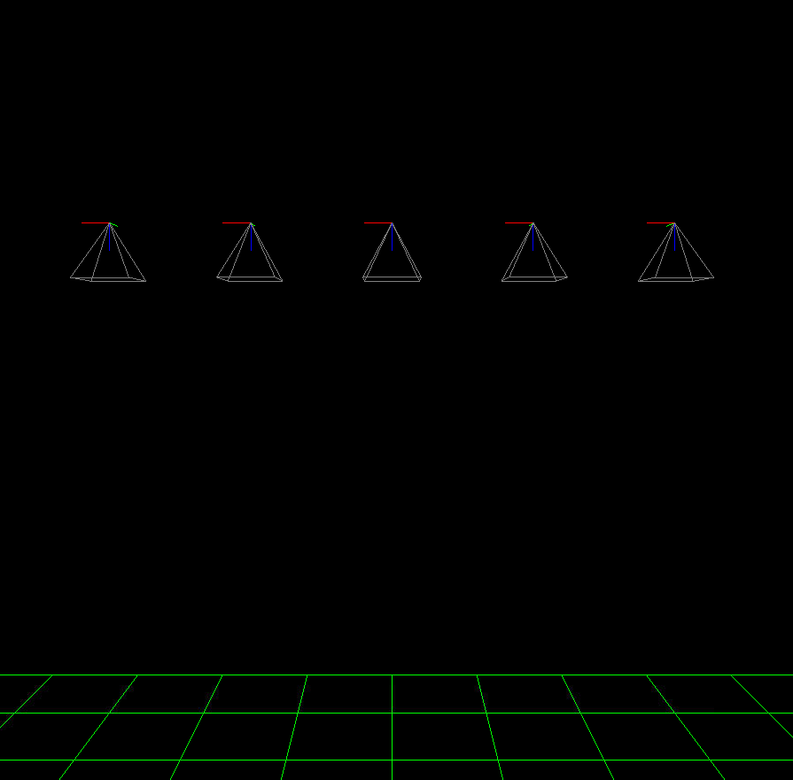
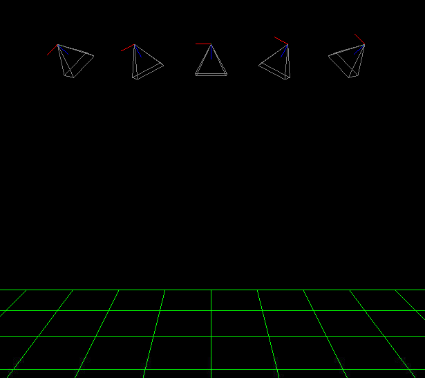
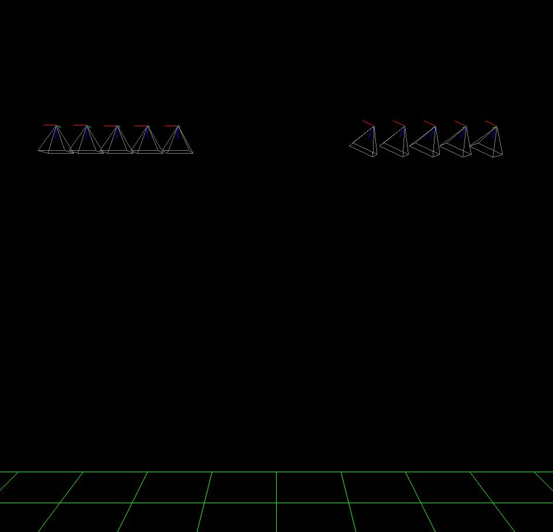
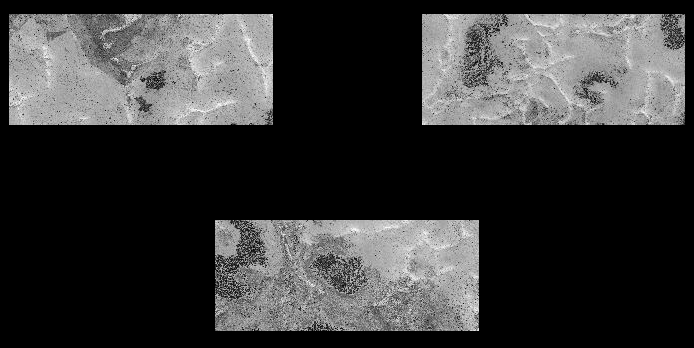

.. _sat_sim:

sat_sim
-------

The ``sat_sim`` satellite simulator program models a satellite traveling around
a planet and taking pictures. It can either create camera models (Pinhole or
linescan), or read them from disk. In either case it creates synthetic images
for the given cameras. This tool can model camera jitter, a rig, and recording
acquisition time.

The inputs are a DEM and georeferenced image (ortho image) of the area of
interest. See :numref:`sat_sim_dem` for how to create such inputs.

If the input cameras are not specified, the orbit is determined by given
endpoints. It is represented as a straight edge in the projected coordinate
system of the DEM, which results in an arc around the planet. 

The images are created with bicubic interpolation in the ortho image and are
saved with float pixels. Missing pixels will have nodata values.

If the cameras are created from scratch, the camera view can follow a custom
path on the surface with varying orientation (:numref:`sat_sim_custom_path`), or
the cameras can have a fixed orientation, without
(:numref:`sat_sim_roll_pitch_yaw`) and with
(:numref:`sat_sim_roll_pitch_yaw_ground`) ground constraints.

The cameras are assumed to be of Pinhole (Frame) type by default, and are saved
as .tsai files (:numref:`pinholemodels`). The option ``--save-as-csm`` can be
used to save the cameras in CSM format (:numref:`csm`). Linescan cameras are
supported as well (:numref:`sat_sim_linescan`). Lens distortion is not modeled.

Several use cases are below. 

.. _sat_sim_prior:

Use given cameras
^^^^^^^^^^^^^^^^^
::
  
    sat_sim --dem dem.tif           \
      --ortho ortho.tif             \
      --camera-list camera_list.txt \
      --image-size 800 600          \
      -o run/run

The camera names in the list should be one per line. The produced image names
will be created from camera names by keeping the filename (without directory
name) and replacing the extension with ``.tif``. They will start with specified
output prefix. Hence, if the input camera is ``path/to/camera.tsai``, the output
image will be ``run/run-camera.tif``.

The value of ``--image-size`` should be chosen so that the ground sample
distance of the produced images is close to the one of the input ortho image. 

To see how a created image projects onto the ground, run ``mapproject``
(:numref:`mapproject`) as::

    mapproject dem.tif run/run-camera.tif path/to/camera.tsai \
      camera.map.tif

The images can be overlaid in ``stereo_gui`` (:numref:`stereo_gui`).

A perturbation can be apply to given cameras (:numref:`sat_sim_perturb`).

.. _sat_sim_nadir:

Generate nadir-pointing cameras
^^^^^^^^^^^^^^^^^^^^^^^^^^^^^^^

::
  
    sat_sim --dem dem.tif          \
        --ortho ortho.tif          \
        --first 397.1 400.7 450000 \
        --last 397.1 500.7 450000  \
        --num 5                    \
        --focal-length 450000      \
        --optical-center 500 500   \
        --image-size 1000 1000     \
        -o run/run

See :numref:`sat_sim_roll_pitch_yaw` for how to apply a custom rotation
to the cameras.

The first and last cameras will be located as specified by ``--first`` and
``--last`` (:numref:`sat_sim_options`). See also ``--frame-rate``.

In this example, the camera is 450,000 m above the ground and the
focal length is 450,000 pixels. If the magnitude of DEM heights is within
several hundred meters, this will result in the ground sample distance being
around 1 meter per pixel.

The resulting cameras will point in a direction perpendicular to the orbit
trajectory. They will point precisely to the planet center only if the orbit
endpoints are at the same height and the datum is spherical.

The produced image and camera names will be along the lines of::
    
    run/run-10000.tif
    run/run-10000.tsai

These names will be adjusted per sensor, if a rig is present
(:numref:`sat_sim_rig`), or if time is modeled (:numref:`sat_sim_time`).

   
   Illustration of ``sat_sim`` creating nadir-looking cameras. 
   See :numref:`orbit_plot` for how to visualize the roll, pitch, 
   and yaw angles of the cameras with ``orbit_plot.py``.

.. _sat_sim_custom_path:

Follow custom ground path with varying orientation
^^^^^^^^^^^^^^^^^^^^^^^^^^^^^^^^^^^^^^^^^^^^^^^^^^

Given two locations on the DEM, each specified by the column and row of DEM
pixel, to ensure that the center of the camera footprint travels along the straight
edge (in DEM pixel coordinates) between these, use options as::

    --first-ground-pos 484.3 510.7 \
    --last-ground-pos  332.5 893.6    

This will result in the camera orientation changing gradually to keep the
desired view.

   An example of several generated cameras looking at the same ground point. 
   Plotted with ``sfm_view`` (:numref:`sfm_view`).

.. _sat_sim_roll_pitch_yaw:

Fixed camera orientation
^^^^^^^^^^^^^^^^^^^^^^^^

When custom cameras are created (not read from disk), and unless the
``--first-ground-pos`` and ``--last-ground-pos`` options are specified, the
cameras will look straight down (nadir, perpendicular to along and across track
directions). 

If desired to have a custom orientation, use the ``--roll``, ``--pitch`` and
``--yaw`` options (measured in degrees, all three must be specified). 
See :numref:`roll_pitch_yaw_def` for how these angles are defined.

Example invocation::

    sat_sim --dem dem.tif         \
      --ortho ortho.tif           \
      --first 397.1 400.7 450000  \
      --last 397.1 500.7 450000   \
      --num 5                     \
      --roll 0 --pitch 25 --yaw 0 \
      --focal-length 450000       \
      --optical-center 500 500    \
      --image-size 1000 1000      \
      -o run/run

See :numref:`orbit_plot` for how to visualize the roll, pitch, and yaw angles of
the cameras with ``orbit_plot.py``.

.. _sat_sim_roll_pitch_yaw_ground:

Pose and ground constraints
^^^^^^^^^^^^^^^^^^^^^^^^^^^

Given an orbital trajectory, a path on the ground, and a desired fixed camera
orientation (roll, pitch, yaw), this tool can find the correct endpoints along
the satellite orbit, then use those to generate the cameras (positioned
between those endpoints), with the center of the camera ground footprint following 
the desired ground path. Example::

    sat_sim --dem dem.tif            \
      --ortho ortho.tif              \
      --first 397.1 400.7 450000     \
      --last 397.1 500.7 450000      \
      --first-ground-pos 397.1 400.7 \
      --last-ground-pos  397.1 500.7 \
      --roll 0 --pitch 25 --yaw 0    \
      --num 5                        \
      --focal-length 450000          \
      --optical-center 500 500       \
      --image-size 1000 1000         \
      -o run/run

Here, unlike in :numref:`sat_sim_nadir`, we will use ``--first`` and ``--last``
only to identify the orbit. The endpoints to use on it will be found
given that we have to satisfy the orientation constraints in ``--roll``,
``--pitch``, ``--yaw`` and the ground path constraints in ``--first-ground-pos``
and ``--last-ground-pos``. 

Unlike in :numref:`sat_sim_custom_path`, the camera orientations will not change.

It is not important to know very accurately the values of ``--first-ground-pos``
and ``--last-ground-pos``. The trajectory of the camera center ground footprint
will be computed, points on it closest to these two ground coordinates will be
found, which in turn will be used to find the orbital segment endpoints.

   
   Illustration of ``sat_sim`` creating two sets of cameras, with different 
   fixed orientations for each, with both sets looking at the same ground path.
   A separate invocation of ``sat_sim`` is needed for each set. 

.. _sat_sim_jitter_model:

Jitter modelling
^^^^^^^^^^^^^^^^

As a satellite moves in orbit, it vibrates ever so slightly. The effect of this
on the acquired images is called *jitter*, and it occurs for both Linescan and
Pinhole cameras. See :numref:`jitter_solve` for how jitter is solved for when
the cameras are Linescan. Here we will discuss modeling jitter for synthetic
Pinhole cameras. See :numref:`sat_sim_linescan` for how to create synthetic
Linescan cameras (with or without jitter).

We assume the jitter is a superposition of periodic perturbations of the roll,
pitch, and yaw angles. For each period, there will be an individual amplitude
and phase shift for these three angles. For example, to model along-track
(pitch) jitter only, the amplitudes for the other angles can be set to zero.
Across-track jitter is modeled by a roll perturbation.

The jitter frequency will be measured in Hz. For example, *f* = 45 Hz (45
oscillations per second). If the satellite velocity is *v* meters per second,
the jitter period in meters is :math:`v / f`. More than one jitter frequency
(hence period) can be specified. Their contributions will be summed up.

Denote by :math:`A_{ij}` the jitter amplitude, in degrees. The index :math:`i`
corresponds to jitter frequency :math:`f_i`, and :math:`j` = 1, 2, 3 is
the index for roll, pitch, and yaw. The jitter perturbation is modeled as:

.. math::
    
    \sum_i A_{ij} \sin\left(d \frac{2 \pi f_i}{v} + \phi_{ij}\right)

Some care is needed to define the parameter *d*. We set it to be the distance
from the starting orbit point as specified by ``--first`` to the current camera
center (both in ECEF, along the curved orbit). This starting point is *before*
adjusting the orbital segment for roll, pitch, yaw, and ground constraints
(:numref:`sat_sim_roll_pitch_yaw_ground`). 

This way the jitter amplitude at the adjusted starting point (first camera
position) is uncorrelated between several sets of cameras along the same orbit
but with different values of roll, pitch, yaw.

The phase shift :math:`\phi_{ij}` is measured in radians. If not specified, it is set
to zero. How to set it is discussed below.

.. _sat_sim_jitter_amplitude_meters:

Specifying the jitter amplitude in meters
~~~~~~~~~~~~~~~~~~~~~~~~~~~~~~~~~~~~~~~~~

The jitter amplitude is usually very small and not easy to measure or interpret.
It can be set in micro radians, as done in
:numref:`sat_sim_jitter_amplitude_micro_radians`.

Here we will discuss how jitter can be defined indirectly, via its effect
on the *horizontal uncertainty* of the intersection of a ray emanating
from the camera center with the datum (see also :numref:`error_propagation`).

Consider a nadir-facing camera with the camera center at height *D* meters above
the datum. If the ray pointing straight down from that camera intersects the
datum at a certain point, and then that ray is perturbed by :math:`A` degrees, the
intersection point will move horizontally by

.. math::
    
      H = D \tan\left( \frac{\pi}{180} A \right)

This is the horizontal ground uncertainty of the intersection point. It is a
rather intuitive concept and many vendors publish it for their cameras. For
example, if the camera ground sample distance (pixel size on the ground) is 1
m/pixel, a horizontal uncertainty of 0.1 m or less is very good. If the camera
orientation is found using a star-tracker or some other estimations in orbit,
and no bundle adjustment (:numref:`bundle_adjust`) is performed, the horizontal
uncertainty will likely be much larger, for example on the order of 1-4 meters. 

In either case, this number is easy to understand, and the jitter amplitude
can be defined as the value of :math:`A_{ij}` that produces the desired horizontal
uncertainty:

.. math::
    
      A_{ij} = \frac{180}{\pi} \arctan\left( \frac{H_j}{D} \right)

Note that we will use the same jitter amplitude for all frequencies, since we
are limited by just a single horizontal uncertainty value for each of roll,
pitch, and yaw. 

One should also note that the effect of a yaw perturbation by a given amount
is much less than the effect of the same amount of roll or pitch perturbation,
because for the latter two the effect is magnified by the distance from the camera
center to the datum, unlike for yaw.

The height above datum for the starting and ending points of the orbital segment
is the third value in ``--first`` and ``--last``. These values can, in
principle, be different, and then a linearly interpolated value will be used at
each camera position (and note that the orbital segment endpoints are adjusted,
per :numref:`sat_sim_roll_pitch_yaw_ground`).

As an example of using this functionality, consider the ``sat_sim``
invocation as in :numref:`sat_sim_roll_pitch_yaw_ground`, and add the options::

    --velocity 7500 --jitter-frequency "45.0 100.0" \
    --horizontal-uncertainty "0.0 2.0 0.0"

This will produce a set of cameras with along-track (pitch) jitter only. 
Two frequencies will be used, of 45 and 100 Hz. 

To add a phase :math:`\phi_{ij}`, in radians, to roll, pitch, and yaw jitter,
specify it as::

    --jitter-phase "1.5708 1.5708 1.5708 0.0 0.0 0.0"

Here we used an approximation of :math:`\pi/2` radians, which is 90 degrees,
for the 45 Hz frequency, and 0 radians for the 100 Hz frequency. 

The values can also be separated by commas, without spaces, then the quotes are
not necessary. See :numref:`sat_sim_options` for more information on these
options.

Jitter can be applied to existing cameras as well (:numref:`sat_sim_perturb`). 

A useful test is compare a camera without jitter with the corresponding one with
jitter.  For that, project a pixel from the first camera to the datum, and
project the obtained point back into the second camera. See how different the
produced pixel value is compared to the original pixel. That is done with
``cam_test`` (:numref:`cam_test`)::

    cam_test --session1 pinhole        \
      --session2 pinhole               \
      --image sim_jitter0/n-10020.tif  \
      --cam1  sim_jitter0/n-10020.tsai \
      --cam2  sim_jitter2/n-10020.tsai

It will produce an output as::

    cam1 to cam2 pixel diff
    Min:    1.89408
    Median: 1.89408
    Max:    1.89408

    cam2 to cam1 pixel diff
    Min:    1.89408
    Median: 1.89408
    Max:    1.89408

.. _sat_sim_jitter_amplitude_micro_radians:

Specifying the jitter amplitude in micro radians
~~~~~~~~~~~~~~~~~~~~~~~~~~~~~~~~~~~~~~~~~~~~~~~~

Alternatively, instead of three horizontal uncertainties, the full set of amplitudes
can be specified directly, in micro radians. The option for that is ``--jitter-amplitude``.
Use a quoted list of values separated by commas of spaces. The first three values
are for roll, pitch and yaw of the first frequency, the next three values are for
the second frequency, and so on. For example::

    --jitter-amplitude "0 1 0 0 1 0"

These will be multiplied by 1e-6 to convert to radians, then converted to
degrees, and used as the jitter amplitudes :math:`A_{ij}`. In this example
only the pitch amplitudes are nonzero, and are equal to 1 micro radian.

.. _sat_sim_linescan:

Linescan cameras
^^^^^^^^^^^^^^^^

The ``sat_sim`` tool can be used to simulate linescan cameras and images, with
or without jitter. Then, instead of many Pinhole cameras and/or images along the
orbit, a single Linescan camera and/or image will be created. 

The option ``--num`` (or ``--frame-rate``) will control how many camera samples
are created between the first and last image lines (including these lines). An
additional set of camera samples will be created, with the same total size,
before the first and after the last image line, evenly divided between the two,
to help with along-track pose interpolation and jitter modeling. 

Lagrange interpolation (with 8th degree polynomials) will be used in between the
samples.

All above modes are supported. One has to add to ``sat_sim`` the option
``--sensor-type linescan``.

By default, if the linescan cameras are not provided with ``--camera-list``, the
input image height is auto-computed so that the horizontal and vertical ground
sample distances are very similar. The produced image height will be the same
regardless of amount of jitter in the input cameras or whether jitter is modeled
at all. This can be overridden with ``--non-square-pixels``.

When creating synthetic linescan cameras, the row coordinate of the optical
center (the second value in ``--optical-center``) will be ignored and will be
treated as set to 0. Hence, we assume that the ray from the camera center that
is perpendicular to the sensor plane intersects the single-row sensor array. 

The produced linescan cameras are in the CSM model state format
(:numref:`csm_state`). This is a standard CSM format and can be read by all ASP
tools including this one.

Here is an example invocation. The use case here is as in
:numref:`sat_sim_roll_pitch_yaw_ground`. The camera maintains fixed roll, pitch,
and yaw, and the ground path determines the orbital segment endpoints. Here we
also model along-track jitter.

::

    sat_sim --dem dem.tif                \
      --ortho ortho.tif                  \
      --first 397.1 400.7 450000         \
      --last  397.1 500.7 450000         \
      --first-ground-pos 397.1 400.7     \
      --last-ground-pos  397.1 500.7     \
      --roll 0 --pitch 30 --yaw 0        \
      --num 5                            \
      --focal-length 450000              \
      --optical-center 500 500           \
      --image-size 1000 1000             \
      --sensor-type linescan             \
      --velocity 7500                    \
      --jitter-frequency 5               \
      --horizontal-uncertainty '0 2 0'   \
      --jitter-phase "0.4 0.8 1.2"       \
      -o jitter2/run

See :numref:`jitter_sat_sim` for how such cameras can be used with ASP's jitter solver.

As in :numref:`sat_sim_jitter_amplitude_meters`, one can compare cameras with
and without jitter as::
    
    cam_test                   \
      --session1 csm           \
      --session2 csm           \
      --image jitter0/run.tif  \
      --cam1  jitter0/run.json \
      --cam2  jitter2/run.json

.. _sat_sim_rig:

Modeling a rig
^^^^^^^^^^^^^^

The ``sat_sim`` program can simulate a rig that has a mix of frame (pinhole) and
linescan cameras. The rig should be passed in via ``--rig-config``. Its format
is defined in :numref:`rig_config`. The rig can be adjusted after loading (:numref:`sat_sim_rig_adjust`).

As an example, consider the setup from :numref:`sat_sim_roll_pitch_yaw`. Add the
rig option, and do not set the image size, focal length, and optical center on
the command line, as those are set by the rig configuration. 

The produced image and camera file names will include the sensor name, before
the image/camera extension. Example::

  out/out-10000_my_cam.tsai

The option ``--sensor-type`` controls the type of each rig sensor. A single
value will apply to all sensors. To have per-sensor type, set a list of values
separated by commas, with no spaces. Example::

  --sensor-type linescan,pinhole,linescan

Lens distortion is not supported. If desired to produce cameras and images only
for a subset of the rig sensors, use the ``--sensor-name`` option. Consider
using the option ``--save-as-csm``.

   
   Illustration of ``sat_sim`` creating a rig of 3 frame cameras. The resulting
   images have been mapprojected onto the ground.

.. _sat_sim_rig_adjust:

Adjusting a rig
^^^^^^^^^^^^^^^

Given a rig (:numref:`sat_sim_rig`), the positions and orientations of the
sensors in the focal plane and of their footprints on the ground can be
overridden by setting ``--rig-sensor-ground-offsets``.

For example, consider a rig with two cameras. If it is desired to have the rig
sensors separated by 0.02 m in the *x* direction the sensor plane, and their
footprints separated by 2000 m in the *x* (across-track) direction on the ground,
with no separation vertically, use::

  --rig-sensor-ground-offsets -0.01,0,-1000,0,0.01,0,1000,0

Additionally, an option such as::

  --rig-sensor-rotation-angles 0.0,5.0

can be invoked to rotate each sensor in the sensor plane by the corresponding
angle in degrees. The in-sensor rotations get applied before the sensor and
ground offsets.

After the images and cameras are saved, the rig that created the data will be
modified to make each sensor transform relative to the first sensor. The rig
configuration will be saved to disk as::

  <out prefix>-rig_config.txt

Such a rig configuration can be passed in to ``jitter_solve``
(:numref:`jitter_solve`) and ``rig_calibrator`` (:numref:`rig_calibrator`). 

If this rig is passed back in to ``sat_sim``, one must again specify the offsets
and angles, if any, as such adjustments are lost when the rig is saved as above.

.. _sat_sim_time:

Modeling time
^^^^^^^^^^^^^

Given two points on the orbit (specified by ``--first`` and ``--last``), the
starting ground position (``--first-ground-pos``), and satellite velocity
(``--velocity``), the option ``--model-time`` ensures the precise time is
recorded for each acquisition.

The time is measured in seconds in double precision. Time is important for
modeling a rig, when this option is set to true even when not explicitly set.

The time will be saved with the linescan camera metadata. It will be part of the
name of the pinhole cameras and images (but not part of the name for linescan
sensors).

As an example, given an orbit, and three separate invocations of ``sat_sim``,
with the camera pitch being --40, 0, and 40 degrees, respectively (so considering
*forward*, *nadir*, and *backward*-looking cameras), the created cameras will have
names that look like::

  out/out-0009997.588028494_my_cam.tsai
  out/out-0010000.000000000_my_cam.tsai
  out/out-0010002.411951096_my_cam.tsai

This needs ``--reference-time`` to be defined, which is the time when the camera
looks straight down at the starting point of the ground path. The default
value is 10,000 seconds. 

For different orbits it is suggested to use a different value for
``--reference-time``, and also a different output prefix. It is suggested to
keep the reference time in the 1000 - 100,000 second range to ensure the produced
and nearby times are positive but not too large, which can result in loss of precision.

Here we also assumed a rig was present (:numref:`sat_sim_rig`), with the sensor
name being ``my_cam``.

.. _sat_sim_perturb:

Perturbing existing cameras
^^^^^^^^^^^^^^^^^^^^^^^^^^^

This program can apply a jitter perturbation (:numref:`sat_sim_jitter_model`)
to a sequence of given Pinhole cameras (:numref:`pinholemodels`).

If more than one sequence is present, such as nadir-looking and forward-looking
cameras, ``sat_sim`` should be called separately for each one.

In this mode, no images are generated and no rig can be used.

Example::

    ls nadir_cameras/*tsai > camera_list.txt
    
    sat_sim                            \
      --perturb-cameras                \
      --camera-list camera_list.txt    \
      --dem dem.tif                    \
      --velocity 7500                  \
      --jitter-frequency 5             \
      --horizontal-uncertainty '0 2 0' \
      -o run/run

If an input image is named ``camDir/camName.tsai`` and the output prefix is
``run/run``, the output camera will be saved as ``run/run-camName.tsai``.

The list of written cameras is saved in a file named ``run/run-cameras.txt``.
That list can be passed to ``bundle_adjust`` (:numref:`bundle_adjust`) and
``jitter_solve`` (:numref:`jitter_solve`).

.. _roll_pitch_yaw_def:

Roll, pitch, and yaw
^^^^^^^^^^^^^^^^^^^^

The roll, pitch and yaw angles (measured in degrees) are used to determine
the camera orientation relative to the local coordinate system in orbit.

When all these are set to 0 (the default is ``NaN``) the camera looks straight down.

If the pitch is 90 degrees and the other angles are zero, the camera will look
along the track rather than down. If a non-zero yaw is set, the camera will
rotate around its view axis.

The rotations are applied to the camera body in the roll, pitch, and yaw order.
So, the combined rotation matrix is::

    R = yawRot * pitchRot * rollRot

(the application is from right to left). The camera-to-ECEF rotation is produced
by further multiplying this matrix on the left by the rotation from the local 
satellite coordinate system to ECEF.

It is important to note that the satellite and the camera use different coordinate
systems. The satellite orientation is with the *x*, *y* and *z* axes pointing along
satellite track, across track, and towards the planet, respectively.

For the camera, it is preferable for the rows of pixels to be parallel to the
across track direction, and for the columns to be parallel to the along track
direction. So, the camera *y* direction is along the track, the camera *x*
direction is the negative of the across-track direction, and *z* points towards
the ground as before.

Camera models with desired roll, pitch, and yaw angles can be also created when
the camera follows a variable path with variable orientation
(:numref:`cam_gen_extrinsics`).

Efficiency considerations
^^^^^^^^^^^^^^^^^^^^^^^^^

Each image (of size about 2000 x 1000 pixels) can take about 10 seconds to
create using multiple threads. A job can be divided over several processes
using the ``--first-index`` and ``--last-index`` options (see
:numref:`sat_sim_options`). The last index is the index before the last camera.
The option ``--no-images`` can be used to skip the image creation step.

.. _sat_sim_dem:

Preparing the input DEM and orthoimage
^^^^^^^^^^^^^^^^^^^^^^^^^^^^^^^^^^^^^^

The input DEM must not have holes, be reasonably smooth, and extend well-beyond
the area of interest. It is suggested to create it using stereo
(:numref:`tutorial`). For steep terrain one should first mapproject the images
(:numref:`mapproj-example`).

The stereo cloud should be converted to a DEM, preferably in the local
stereographic projection, using a grid size that is perhaps 4 times the ground
sample distance (GSD). For example, for images having a GSD of 0.4 meters, a
command as follows may work::

  point2dem --auto-proj-center --tr 1.6 run/run-PC.tif

See :numref:`point2dem_proj` for a discussion regarding the projection of the
produced DEM.

The ``dem_mosaic`` (:numref:`dem_mosaic`) tool can be used to fill holes in the
DEM, using either the ``--hole-fill-length`` or ``--fill-search-radius`` option.
It is also suggested to blur it a little, which may reduce some of the noise in
the DEM. For that, use ``dem_mosaic`` with the option ``--dem-blur-sigma`` with a
value of 1 or 2.

Very large holes may be infilled from a third-party low-resolution DEM, like
Copernicus (:numref:`initial_terrain`), but this is a measure of last resort. Do
not forget to first convert it to be relative to the WGS84 ellipsoid, using
``dem_geoid`` (:numref:`conv_to_ellipsoid`). This DEM can be converted to the
local projection and grid size using ``gdalwarp`` (:numref:`gdal_tools`, bicubic
or bilinear interpolation is suggested), and cropped to desired area with
``gdal_translate``. Then, it can be used as::

    dem_mosaic --priority-blending-length 100 \
      stereo-DEM.tif copernicus-DEM.tif       \
      -o filled-DEM.tif

This assumes that the two DEMs being blended are reasonably well-aligned.
Otherwise, alignment may be needed (:numref:`pc_align`).

One can also use such a third-party DEM if no stereo DEM can be produced. 

The orthoimage can be obtained by mapprojecting (:numref:`mapproject`) a
satellite image onto the DEM at the native resolution of the image::

    mapproject -t rpc filled-DEM.tif \
      image.tif image.xml ortho.tif

Here we assumed a WorldView satellite, so option ``-t rpc`` was used. See
:numref:`other-mapproj` for how to handle other satellites.

The resolution and projection can be set via ``--tr`` and ``--t_srs`` if need
be.

Output files
^^^^^^^^^^^^

In addition to the images and/or cameras, when ``--sensor-type`` is ``pinhole``,
``sat_sim`` will also save two files, having the lists of created images and
cameras, one per line, with names as::

    <output prefix>-images.txt
    <output prefix>-cameras.txt

These will be adjusted per sensor name, if a rig is present
(:numref:`sat_sim_rig`).

These files will not be saved if ``--first-index`` is non-zero, as
then ``sat_sim`` is presumably being invoked concurrently by several
processes to write several ranges of images and/or cameras, and that may
result in these files being corrupted.

Then, the list of images will not be saved if ``--no-images`` is used,
and the list of cameras will not be saved if ``--camera-list`` is set,
as then the cameras are not being generated by ``sat_sim``.

.. _sat_sim_options:

Command-line options
^^^^^^^^^^^^^^^^^^^^

--dem <string (default="")>
    Input DEM file.

--ortho <string (default="")>
    Input georeferenced image file. 

-o, --output-prefix <string (default="")>
    Specify the output prefix. All the files that are saved will start with this
    prefix.

--camera-list <string (default="")>
    A file containing the list of pinhole cameras to create synthetic images
    for. Then these cameras will be used instead of generating them. Specify one
    file per line. The options ``--first``, ``--last``, ``--num``, ``--focal-length``,
    and ``--optical-center`` will be ignored.

--first <float, float, float>
    First camera position, specified as DEM pixel column and row, and height
    above the DEM datum. This may be adjusted, per
    :numref:`sat_sim_roll_pitch_yaw_ground`. Can use ``mapproject
    --query-pixel`` to find the DEM pixel column and row for a given image pixel
    (:numref:`mapproj_options`).

--last <float, float, float>
    Last camera position, specified as DEM pixel column and row, and height
    above the DEM datum. See also ``--first``.

--num <int (default=0)>
    Number of cameras to generate, including the first and last ones. Must be
    positive. The cameras are uniformly distributed along the straight edge from
    first to last (in projected coordinates). See also ``--frame-rate``.

--first-ground-pos <float, float>
    Coordinates of first camera ground footprint center (DEM column and row). If
    not set, the cameras will look straight down (perpendicular to along and
    across track directions).

--last-ground-pos <float, float>
    Coordinates of last camera ground footprint center (DEM column and row). If
    not set, the cameras will look straight down (perpendicular to along and
    across track directions).

--focal-length <double>
    Output camera focal length in units of pixel.

--optical-center <float, float>
    Output camera optical center (image column and row). Units of pixel.

--image-size <int, int>
    Output camera image size (width and height).

--roll <double>
    Camera roll angle, in degrees. See :numref:`sat_sim_roll_pitch_yaw` for
    details.

--pitch <double>
    Camera pitch angle, in degrees. See :numref:`sat_sim_roll_pitch_yaw` for
    details.

--yaw <double>
    Camera yaw angle, in degrees. See :numref:`sat_sim_roll_pitch_yaw` for  details.

--velocity <double>
    Satellite velocity, in meters per second. Used for modeling jitter. A value of
    around 8000 m/s is typical for a satellite like SkySat in Sun-synchronous orbit
    (90 minute period) at an altitude of about 450 km. For WorldView, the velocity
    is around 7500 m/s, with a higher altitude and longer period.

--jitter-frequency <string>
    Jitter frequency, in Hz. Used for modeling jitter (satellite vibration).
    Several frequencies can be specified. Use a quoted list, with spaces as
    separators (or separated by commas with no quotes). See also
    ``--jitter-amplitude`` and ``--horizontal-uncertainty``.

--jitter-phase <string>
    Jitter phase, in radians. Measures the jitter phase offset from the start of
    the orbit as set by ``--first``. Specify as a quoted list of numbers
    separated by space (or separated by commas with no quotes). The Number of
    values must be 3 times the number of frequencies. The order in this list
    corresponds to phase for roll, pitch, and yaw for first frequency, then
    second frequency, etc. If not specified, will be set to 0. 
    
--jitter-amplitude <string>
    Jitter amplitude, in micro radians. Specify as a quoted list having
    amplitude in roll, pitch, yaw for first frequency, then second frequency,
    etc. Separate the values by spaces (or commas with no quotes).

--horizontal-uncertainty <string>
    Camera horizontal uncertainty on the ground, in meters, at nadir
    orientation. Specify as three numbers, in quotes, used for roll, pitch, and
    yaw (or separated by commas with no quotes). The jitter amplitude for each of
    these angles is found as ``amplitude = atan(horizontal_uncertainty /
    satellite_elevation_above_datum)``, then converted to degrees. See
    :numref:`sat_sim_jitter_model` for details.

--frame-rate <double>
    Camera frame rate, per second. Can be in double precision. If set, it will
    override ``--num``. The cameras will start from ``--first`` (after any
    position adjustment, if applicable, per
    :numref:`sat_sim_roll_pitch_yaw_ground`). Set the ``--velocity`` value. The
    last camera will be no further than the (adjusted) value of ``--last`` along
    the orbit. 

--sensor-type <string (default="pinhole")>
    Sensor type for created cameras and images. Can be one of: ``pinhole``,
    ``linescan``. Can use ``frame`` instead of ``pinhole``. With a rig
    (:numref:`sat_sim_rig`), this can be a list of values, separated by commas,
    with no spaces, one per sensor, if desired to have different types for
    different sensors.

--non-square-pixels
    When creating linescan cameras and images, use the provided image height in
    pixels, even if that results in non-square pixels. The default is to
    auto-compute the image height.

--first-index <int (default: -1)>
    Index of first camera and/or image to generate, starting from 0. If not set,
    will create all images/cameras. This is used for parallelization.

--last-index <int (default: -1)>
    Index of last image and/or camera to generate, starting from 0. Stop before
    this index. If not set, will create all images/cameras. This is used for
    parallelization.    

--no-images
    Create only cameras, and no images. Cannot be used with ``--camera-list``.

--save-ref-cams
    For each created camera, save also the 'reference' camera that has no roll, pitch,
    yaw, jitter, or 90 degree in-sensor-plane rotation from camera to satellite
    coordinates. Their names have ``-ref-`` after the output prefix.

--save-as-csm
    Save Pinhole (frame) cameras in the CSM format, as done for linescan
    cameras. Can be used to combine these sensors in bundle adjustment and
    solving for jitter. See an example in :numref:`jitter_linescan_frame_cam`.

--rig-config <string (default="")>
    Simulate a frame camera rig with this configuration file. Then do not set
    the image size, focal length, optical center on the command line, as those
    are set by the rig. The transforms on this rig may be adjusted via
    ``--rig-sensor-ground-offsets`` and ``--rig-sensor-rotation-angles``. See
    :numref:`sat_sim_rig`.

--rig-sensor-ground-offsets <string (default="")>
    Modify the input rig so that each sensor has the given horizontal offsets
    from the rig center in the rig plane, and the sensor ground footprints have
    the given horizontal offsets from the nominal ground footprint at nadir.
    Specify as a quoted list of values, separated by spaces or commas. The order
    is sensor1_x sensor1_y ground1_x ground1_y followed by sensor 2, etc. The
    units are in meter. These will determine the sensor rotations. Separate the
    values by spaces with quotes or commas with no quotes. If not set, use 0 for
    all sensors.

--rig-sensor-rotation-angles <string (default="")>
    Modify the input rig by rotating each sensor by the given angle in the sensor
    plane. Specify as one number per sensor, in degrees, separated by commas, or 
    in quotes and separated by spaces.
    
--sensor-name <string (default="all")>
    Name of the sensor in the rig to simulate (:numref:`sat_sim_rig`). If more
    than one, list them separated by commas (no spaces).

--model-time
    Model time at each camera position (:numref:`sat_sim_time`). See also
    ``--reference-time``.

--reference-time <double (default: 10000.0)>
    The measured time, in seconds, when the satellite is along given orbit, in nadir
    orientation, with the center view direction closest to the ground point at
    ``--first-ground-pos``. A unique value for each orbit is suggested. A large value
    (millions), may result in numerical issues. See :numref:`sat_sim_time`.

--perturb-cameras
    Apply a perturbation to existing cameras (:numref:`sat_sim_perturb`).

--blur-sigma <double (default: 0.0)>
    When creating images, blur them with a Gaussian with this sigma. The sigma is
    in input orthoimage pixel units.
            
--dem-height-error-tol <float (default: 0.001)>
    When intersecting a ray with a DEM, use this as the height error tolerance
    (measured in meters). It is expected that the default will be always good
    enough.

--threads <integer (default: 0)>
    Select the number of threads to use for each process. If 0, use the value in
    ~/.vwrc.
 
--cache-size-mb <integer (default = 1024)>
    Set the system cache size, in MB.

--tile-size <integer (default: 256 256)>
    Image tile size used for multi-threaded processing.

--tif-compress <string (default = "LZW")>
    TIFF compression method. Options: None, LZW, Deflate, Packbits.

-v, --version
    Display the version of software.

-h, --help
    Display this help message.
