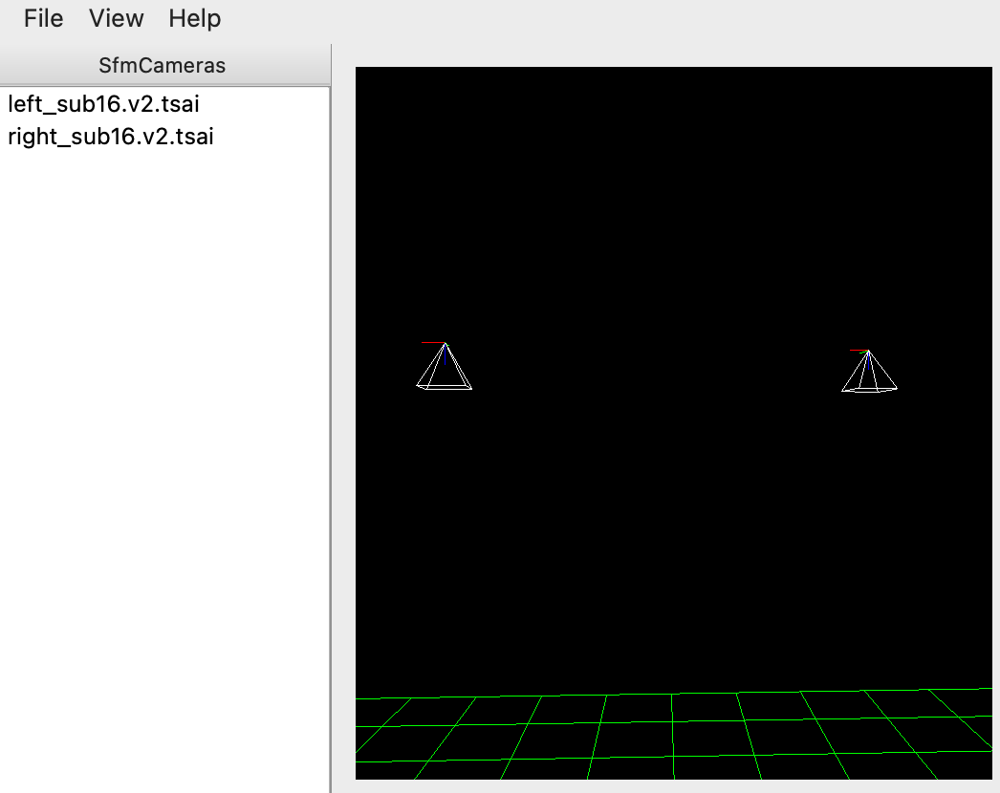

.. _sfm_view:

sfm_view
--------

The ``sfm_view`` program displays the positions and orientations of a set of orbital Pinhole camera models (:numref:`pinholemodels`) relative to the ground. 

This program is a modified version of `umve
<https://github.com/simonfuhrmann/mve>`_, by Simon Fuhrmann. It is still in
development and not all features of umve are available yet.

The cameras are represented as pyramids (the pyramid tip is the camera center
and the base is the sensor plane), and the ground as shown as a plane. The
ground plane is meant to be only a suggestion, and is not at the correct
distance or scale from the cameras. It is determined as the plane perpendicular
to the vector from the planet center to the mean of camera centers. The planet
curvature is not modeled. 

The actual field of view (focal length) and optical center of the
cameras are not reflected in the plots.

Zooming and scene rotation are done with the computer mouse. 

   Illustration of ``sfm_view`` showing nadir-pointing cameras. The entries in
   the left tab are in the same order as the cameras specified on the
   command line. Clicking on an entry highlights that camera's view direction.
   Synthetic cameras can be created with ``sat_sim`` (:numref:`sat_sim`).

Example
^^^^^^^

::

    sfm_view images/*.tif images/*.tsai

Command-line options
^^^^^^^^^^^^^^^^^^^^

--width <integer (default: 1400)>
    Window width in pixels. Specify as ``--width=1400``.
--height <integer (default: 1200)>
    Window height in pixels. Specify as ``--height=1200``.
